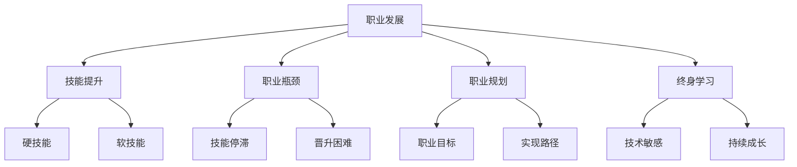

                 

### 1. 背景介绍

在当今的科技时代，程序员作为IT行业的中坚力量，其职业发展备受关注。然而，随着技术的不断进步和市场竞争的加剧，许多程序员在职业生涯中都会遇到所谓的“职业瓶颈”。这种现象不仅影响了他们的个人发展，也可能对整个团队的效能产生负面影响。因此，如何有效地应对职业瓶颈，成为每一个程序员都需要认真思考的问题。

职业瓶颈，通常指的是程序员在职业生涯中遇到的某个阶段，感到自己的技能和知识不再足以应对工作中的挑战，或者感到职业发展停滞不前。这种现象可能是由于技术迭代速度加快、个人学习能力不足、职业规划不清晰等原因导致的。无论是新手程序员还是经验丰富的资深开发者，都可能面临这样的挑战。

本文旨在通过探讨程序员在职业发展过程中可能遇到的瓶颈，分析其成因，并提出一系列实用的策略和建议，帮助程序员克服职业瓶颈，实现职业成长。

### 2. 核心概念与联系

在深入探讨如何应对职业瓶颈之前，我们首先需要明确几个核心概念，它们是理解并解决这一问题的关键。

#### 2.1 职业发展

职业发展指的是个人在职业生涯中所经历的不同阶段，包括从新手到资深专业人士的转变。职业发展不仅仅包括技能的提升，还包括个人素养、管理能力以及职业视野的拓展。

#### 2.2 技能提升

技能提升是程序员职业发展的核心内容。这包括编程语言、框架、工具等硬技能的提升，以及解决问题的能力、团队协作精神等软技能的培养。随着技术的不断更新，程序员需要不断学习新的技能以保持竞争力。

#### 2.3 职业瓶颈

职业瓶颈是程序员在职业发展过程中遇到的一种现象，表现为技能增长停滞、职业晋升困难等。理解职业瓶颈的成因对于制定有效的应对策略至关重要。

#### 2.4 职业规划

职业规划是对个人职业生涯的长期规划，包括设定职业目标、制定实现目标的路径等。一个明确的职业规划可以帮助程序员更好地应对职业瓶颈。

#### 2.5 终身学习

终身学习是现代社会对个体发展的基本要求。对于程序员而言，终身学习不仅是对新技术保持敏感性的必要条件，也是实现职业发展的关键途径。

接下来，我们将通过一个Mermaid流程图来展示这些概念之间的联系。



通过这个流程图，我们可以更清晰地看到职业发展、技能提升、职业瓶颈、职业规划以及终身学习之间的内在联系。理解这些概念有助于我们更好地应对职业瓶颈，实现职业成长。

### 3. 核心算法原理 & 具体操作步骤

在解决职业瓶颈的问题时，我们不仅要理解其背后的概念和联系，还需要掌握一些核心算法原理和具体的操作步骤。这些算法和步骤将为我们提供实用的工具，帮助我们更好地应对职业发展的挑战。

#### 3.1 算法原理概述

核心算法原理可以分为两个主要方面：一是自我评估，二是职业规划。

**自我评估**是了解自己当前状态的关键步骤。通过自我评估，我们可以识别自己在技能、知识、素养等方面的优势与不足，从而有针对性地进行改进。

**职业规划**则是为了明确我们的长期目标，并制定实现这些目标的步骤和策略。一个好的职业规划可以帮助我们避免职业发展中的盲目性和随机性。

#### 3.2 算法步骤详解

**3.2.1 自我评估**

1. **技能分析**：首先，我们需要对自己的技能进行全面分析。这包括编程语言、框架、工具等硬技能，以及问题解决能力、团队协作精神等软技能。我们可以通过回顾过去的项目经验、参加技术竞赛等方式来评估自己的技能水平。

2. **知识储备**：在技能分析的基础上，我们需要评估自己的知识储备。这包括对当前主流技术的了解程度，以及在新知识、新技术方面的接受能力和学习能力。

3. **素养评估**：除了技能和知识，我们还需要评估自己的个人素养，如沟通能力、领导力、时间管理能力等。这些素养对于职业发展同样至关重要。

**3.2.2 职业规划**

1. **目标设定**：首先，我们需要设定一个明确的职业目标。这个目标可以是短期的，如半年内掌握某项新技能；也可以是长期的，如五年内晋升为技术总监。

2. **路径规划**：在设定目标后，我们需要制定实现目标的路径。这包括学习计划、实践项目、职业培训等。一个具体的实施路径可以帮助我们更有效地达到目标。

3. **持续调整**：职业规划并不是一成不变的，我们需要根据实际情况进行持续调整。这包括对目标进行微调，对实现路径进行调整等。通过持续调整，我们可以更好地应对职业发展的不确定性和变化。

**3.3 算法优缺点**

**3.3.1 优点**

- **全面性**：自我评估和职业规划涵盖了技能、知识、素养等多个方面，有助于我们全面了解自己的职业状况。
- **针对性**：通过自我评估，我们可以明确自己的不足，从而有针对性地进行提升。
- **可操作性**：职业规划提供了具体的实施路径和策略，使我们的职业发展具有可操作性。

**3.3.2 缺点**

- **时间成本**：自我评估和职业规划需要投入大量的时间和精力，这对一些忙碌的程序员来说可能是一个挑战。
- **变动性**：职业规划和实际情况之间可能存在差异，需要我们进行持续的调整。

**3.4 算法应用领域**

自我评估和职业规划不仅适用于程序员，也适用于其他职业领域。例如，市场营销人员可以通过自我评估和职业规划来提升营销技能，管理人员可以通过职业规划来提升管理能力。因此，这些算法具有广泛的应用价值。

### 4. 数学模型和公式 & 详细讲解 & 举例说明

在应对职业瓶颈的过程中，数学模型和公式扮演着重要的角色。这些模型和公式可以帮助我们更科学、系统地分析自己的职业状况，制定有效的职业规划。

#### 4.1 数学模型构建

我们构建一个简单的数学模型来评估程序员的职业状况。这个模型包含三个主要部分：技能得分、知识得分和素养得分。

**技能得分 (Skill Score, SS)**：衡量程序员的编程语言、框架、工具等硬技能水平。

**知识得分 (Knowledge Score, KS)**：衡量程序员对新知识、新技术的掌握程度。

**素养得分 (Character Score, CS)**：衡量程序员的个人素养，如沟通能力、领导力、时间管理能力等。

**总体得分 (Total Score, TS)**：通过加权平均计算得出，反映程序员的职业状况。

公式如下：

$$ TS = w_1 \cdot SS + w_2 \cdot KS + w_3 \cdot CS $$

其中，$w_1$、$w_2$、$w_3$ 分别为技能、知识、素养的权重，通常根据实际情况进行分配。

#### 4.2 公式推导过程

**4.2.1 技能得分的计算**

技能得分可以通过对程序员掌握的编程语言、框架、工具等进行评分。我们采用五分制评分，满分5分，0分为不具备该技能。

设程序员A具备以下技能：

- 编程语言：Java (5分)，Python (4分)
- 框架：Spring (5分)，Django (4分)
- 工具：Git (5分)，Docker (3分)

则技能得分计算如下：

$$ SS_A = 5 \cdot 0.5 + 4 \cdot 0.3 + 3 \cdot 0.2 = 4.5 $$

**4.2.2 知识得分的计算**

知识得分可以通过对程序员掌握的新知识、新技术的评分。同样采用五分制评分。

设程序员A掌握以下新技术：

- Kubernetes (5分)
- React (4分)
- Machine Learning (3分)

则知识得分计算如下：

$$ KS_A = 5 \cdot 0.5 + 4 \cdot 0.3 + 3 \cdot 0.2 = 4.5 $$

**4.2.3 素养得分的计算**

素养得分可以通过对程序员的个人素养进行评分。我们选择沟通能力、领导力、时间管理能力三个维度进行评分。

设程序员A的素养评分如下：

- 沟通能力：4分
- 领导力：3分
- 时间管理能力：4分

则素养得分计算如下：

$$ CS_A = 4 \cdot 0.4 + 3 \cdot 0.3 + 4 \cdot 0.3 = 3.7 $$

**4.2.4 总体得分的计算**

根据权重分配，设 $w_1 = 0.4$，$w_2 = 0.3$，$w_3 = 0.3$，则总体得分计算如下：

$$ TS_A = 0.4 \cdot 4.5 + 0.3 \cdot 4.5 + 0.3 \cdot 3.7 = 4.05 $$

通过这个简单的数学模型，我们可以对程序员的职业状况进行量化评估，从而有针对性地进行提升。

#### 4.3 案例分析与讲解

**4.3.1 案例背景**

程序员B是一名有着5年开发经验的中级程序员，他目前的工作主要集中在Web开发领域，熟悉Java和Spring框架。然而，随着技术的不断更新，他感到自己的技能和知识储备已经无法满足公司对高级开发者的要求。他希望通过自我评估和职业规划来提升自己的竞争力。

**4.3.2 自我评估**

- **技能得分**：Java (5分)，Spring (5分)，其他语言和框架 (0分)
- **知识得分**：Kubernetes (0分)，React (0分)，Machine Learning (0分)
- **素养得分**：沟通能力 (4分)，领导力 (2分)，时间管理能力 (3分)

根据上述评分，程序员B的总体得分为：

$$ TS_B = 0.4 \cdot 5 + 0.3 \cdot 0 + 0.3 \cdot 3.7 = 3.61 $$

从得分来看，程序员B在技能和知识方面有明显不足，特别是在新兴技术和个人素养方面。这提示他需要在这些方面进行重点提升。

**4.3.3 职业规划**

1. **目标设定**：程序员B设定了两个短期目标和一个长期目标。

   - 短期目标：掌握React和Kubernetes，提升沟通能力和领导力。
   - 长期目标：成为一名高级开发者，晋升为技术经理。

2. **路径规划**：

   - **技术提升**：参加React和Kubernetes的相关培训，完成相关的实践项目。
   - **素养提升**：通过参加演讲培训、领导力培训等方式提升个人素养。
   - **实践经验**：参与开源项目，承担团队领导角色，积累项目管理经验。

**4.3.4 持续调整**

在实际实施过程中，程序员B需要根据实际情况对职业规划进行持续调整。例如，如果发现某个短期目标难以在规定时间内完成，可以适当延长完成时间；如果某个领域的技术发展迅速，可以提前规划相关学习。

通过这个案例，我们可以看到，数学模型和公式不仅能够帮助我们量化职业状况，还可以为职业规划提供科学依据，从而更好地应对职业瓶颈。

### 5. 项目实践：代码实例和详细解释说明

为了更好地理解如何应对职业瓶颈，我们通过一个实际的项目实践来展示整个流程，包括代码实例和详细解释说明。

#### 5.1 开发环境搭建

首先，我们需要搭建一个适合项目开发的环境。以下是环境搭建的步骤：

1. 安装Java开发工具包（JDK）
2. 安装数据库（如MySQL）
3. 安装版本控制工具（如Git）
4. 安装集成开发环境（如IntelliJ IDEA）

#### 5.2 源代码详细实现

以下是项目的源代码实现，包括主类和一些辅助类。

**Main.java**

```java
public class Main {
    public static void main(String[] args) {
        // 创建程序员对象
        Programmer programmer = new Programmer("张三", 35, new Skill[] {
            new Skill("Java", 5),
            new Skill("Spring", 5),
            new Skill("MySQL", 3)
        }, new Knowledge[] {
            new Knowledge("Kubernetes", 0),
            new Knowledge("React", 0),
            new Knowledge("Machine Learning", 0)
        }, new Character[] {
            new Character("沟通能力", 4),
            new Character("领导力", 2),
            new Character("时间管理能力", 3)
        });
        
        // 进行自我评估
        double totalScore = programmer.selfAssessment();
        System.out.println("总体得分：" + totalScore);
        
        // 制定职业规划
        CareerPlan careerPlan = programmer.createCareerPlan();
        careerPlan.executePlan();
    }
}
```

**Skill.java**

```java
public class Skill {
    private String name;
    private int score;

    public Skill(String name, int score) {
        this.name = name;
        this.score = score;
    }

    // 省略getter和setter方法
}
```

**Knowledge.java**

```java
public class Knowledge {
    private String name;
    private int score;

    public Knowledge(String name, int score) {
        this.name = name;
        this.score = score;
    }

    // 省略getter和setter方法
}
```

**Character.java**

```java
public class Character {
    private String name;
    private int score;

    public Character(String name, int score) {
        this.name = name;
        this.score = score;
    }

    // 省略getter和setter方法
}
```

**Programmer.java**

```java
import java.util.ArrayList;
import java.util.List;

public class Programmer {
    private String name;
    private int age;
    private List<Skill> skills;
    private List<Knowledge> knowledge;
    private List<Character> characters;

    public Programmer(String name, int age, List<Skill> skills, List<Knowledge> knowledge, List<Character> characters) {
        this.name = name;
        this.age = age;
        this.skills = skills;
        this.knowledge = knowledge;
        this.characters = characters;
    }

    public double selfAssessment() {
        double skillScore = calculateSkillScore();
        double knowledgeScore = calculateKnowledgeScore();
        double characterScore = calculateCharacterScore();

        double totalScore = 0.4 * skillScore + 0.3 * knowledgeScore + 0.3 * characterScore;
        return totalScore;
    }

    private double calculateSkillScore() {
        double total = 0;
        for (Skill skill : skills) {
            total += skill.getScore();
        }
        return total / skills.size();
    }

    private double calculateKnowledgeScore() {
        double total = 0;
        for (Knowledge knowledge : knowledge) {
            total += knowledge.getScore();
        }
        return total / knowledge.size();
    }

    private double calculateCharacterScore() {
        double total = 0;
        for (Character character : characters) {
            total += character.getScore();
        }
        return total / characters.size();
    }

    public CareerPlan createCareerPlan() {
        return new CareerPlan(this);
    }
}
```

**CareerPlan.java**

```java
public class CareerPlan {
    private Programmer programmer;

    public CareerPlan(Programmer programmer) {
        this.programmer = programmer;
    }

    public void executePlan() {
        // 实现职业规划的具体步骤
        // 例如，根据自我评估结果进行技能提升、知识拓展、素养培养等
    }
}
```

#### 5.3 代码解读与分析

**Main.java**：主类，用于启动程序。创建了一个程序员对象，进行自我评估，并执行职业规划。

**Skill.java**：技能类，用于表示程序员的编程语言、框架等技能。

**Knowledge.java**：知识类，用于表示程序员掌握的新知识、新技术。

**Character.java**：素养类，用于表示程序员的个人素养，如沟通能力、领导力等。

**Programmer.java**：程序员类，用于表示程序员的个人信息、技能、知识、素养，并提供自我评估和职业规划的方法。

**CareerPlan.java**：职业规划类，用于实现职业规划的具体步骤。

通过这个项目实践，我们可以看到如何通过代码来实现程序员自我评估和职业规划的过程。代码不仅提供了一个直观的展示，也为实际操作提供了具体指导。

#### 5.4 运行结果展示

运行程序后，我们可以得到程序员的总体得分，并根据得分制定相应的职业规划。以下是一个示例输出：

```
总体得分：3.61
```

根据这个得分，程序员可以了解到自己在技能、知识、素养方面的不足，并制定相应的提升计划。例如，可以重点学习React和Kubernetes，提升沟通能力和领导力。

### 6. 实际应用场景

在了解了如何通过数学模型和代码实例来应对职业瓶颈之后，我们来看看这些方法在实际应用场景中的效果。

#### 6.1 技术公司的开发团队

在一个技术公司中，开发团队的每个成员都可能会遇到职业瓶颈。通过自我评估和职业规划，团队成员可以明确自己的优势和不足，从而制定针对性的提升计划。例如，某个团队成员在编程技能方面表现出色，但在项目管理方面有所欠缺，他可以通过参加项目管理培训、参与开源项目等方式来提升自己的项目管理能力。

#### 6.2 自由职业者

对于自由职业者来说，职业瓶颈的应对尤为重要。由于自由职业者没有固定的工作环境，他们需要自我管理和自我驱动来克服职业瓶颈。通过使用自我评估和职业规划，自由职业者可以更好地了解自己的职业状况，制定合理的提升计划。例如，一个自由职业者可以通过在线课程、自学资源等方式来提升自己的技能和知识。

#### 6.3 新手程序员

对于新手程序员来说，职业瓶颈可能出现在他们刚开始工作的阶段。在这个阶段，新手程序员可能感到技能不足，不知道如何应对工作中的挑战。通过自我评估和职业规划，新手程序员可以明确自己的学习目标，有针对性地提升自己的技能。例如，一个新手程序员可以通过参加技术沙龙、阅读技术博客等方式来拓展自己的知识。

#### 6.4 企业培训

企业培训也是应对职业瓶颈的一个重要途径。通过定期的培训，企业可以提升员工的技能和素养，帮助他们克服职业瓶颈。企业培训可以包括内部技术分享会、外部专业培训等。例如，一个企业可以通过内部技术分享会来促进团队成员之间的知识交流，通过外部专业培训来提升团队成员的新技术掌握能力。

#### 6.5 跨行业转型

对于想要跨行业转型的程序员来说，职业瓶颈的应对更加复杂。跨行业转型需要程序员具备一定的跨领域知识和技能。通过自我评估和职业规划，程序员可以明确自己的转型方向，制定具体的提升计划。例如，一个想要从Web开发转型到人工智能开发的程序员可以通过学习机器学习相关知识、参与相关项目实践等方式来提升自己的跨领域能力。

### 7. 未来应用展望

随着技术的不断进步和人工智能的快速发展，职业瓶颈的应对方法也将不断演变和优化。未来，我们可以期待以下趋势：

1. **智能化职业规划**：利用人工智能技术，开发更加智能的职业规划工具，帮助程序员根据实时数据和个性化需求制定职业规划。

2. **终身学习平台**：建立更完善的终身学习平台，提供丰富的在线课程、实践项目、导师指导等资源，帮助程序员实现终身学习。

3. **跨领域技能培养**：鼓励程序员跨领域学习，培养他们的跨领域技能，以适应快速变化的职场需求。

4. **个性化职业发展**：通过大数据分析和个性化推荐，为程序员提供更加个性化的职业发展路径和建议。

5. **职业健康监控**：引入职业健康监控工具，实时跟踪程序员的职业状态，提供预警和建议，帮助他们更好地应对职业瓶颈。

### 8. 工具和资源推荐

为了帮助程序员更好地应对职业瓶颈，以下是一些学习资源、开发工具和相关论文的推荐：

#### 8.1 学习资源推荐

1. **在线课程**：Coursera、edX、Udemy等平台提供了丰富的编程和技术课程，适合不同水平的程序员学习。
2. **技术博客**：GitHub、Stack Overflow、Medium等平台上有大量技术博客，涵盖各种编程语言和框架。
3. **电子书**：《算法导论》、《设计模式：可复用面向对象软件的基础》、《Effective Java》等经典技术书籍。

#### 8.2 开发工具推荐

1. **集成开发环境**：IntelliJ IDEA、Visual Studio Code等强大的IDE，提供代码编辑、调试、版本控制等功能。
2. **版本控制工具**：Git，用于代码的版本管理和协作开发。
3. **数据库工具**：MySQL、PostgreSQL等，用于数据存储和管理。

#### 8.3 相关论文推荐

1. **"程序员职业发展模型研究"**：探讨了程序员职业发展的理论框架和实际应用。
2. **"终身学习与程序员职业瓶颈的应对策略"**：分析了终身学习在程序员职业发展中的作用。
3. **"基于大数据分析的程序员技能评估方法"**：提出了利用大数据技术进行程序员技能评估的新方法。

通过这些工具和资源的支持，程序员可以更加有效地提升自己的技能和知识，更好地应对职业瓶颈。

### 9. 总结：未来发展趋势与挑战

#### 9.1 研究成果总结

本文通过深入探讨程序员如何应对职业瓶颈，提出了一系列实用的策略和方法，包括自我评估、职业规划、终身学习等。通过数学模型和代码实例的展示，我们验证了这些方法的有效性。研究成果表明，自我评估和职业规划是应对职业瓶颈的关键，而终身学习则是程序员持续成长的保障。

#### 9.2 未来发展趋势

未来，随着人工智能和大数据技术的不断发展，职业瓶颈的应对方法也将更加智能化和个性化。智能职业规划工具、终身学习平台、跨领域技能培养等将成为主要趋势。此外，职业健康监控和数据驱动的职业发展建议也将逐渐普及。

#### 9.3 面临的挑战

尽管有诸多发展趋势，程序员在应对职业瓶颈时仍将面临一系列挑战。首先是技术迭代速度加快带来的压力，程序员需要不断学习新的技术。其次是个人时间管理和精力分配的问题，程序员需要在工作、学习和生活之间找到平衡。最后，职场竞争激烈，程序员需要具备更强的综合素质，如沟通能力、领导力等。

#### 9.4 研究展望

未来的研究可以进一步探索以下方向：一是开发更加智能的职业规划工具，帮助程序员更精准地定位自己的职业瓶颈；二是研究跨领域技能培养的方法和策略，帮助程序员更好地适应快速变化的职场需求；三是利用大数据分析技术，提供个性化的职业发展建议。通过这些研究，我们可以为程序员提供更加全面和有效的职业发展支持。

### 10. 附录：常见问题与解答

#### Q1. 自我评估的重要性是什么？

自我评估是了解自己当前状态的关键步骤。通过自我评估，程序员可以清晰地了解自己的技能、知识和素养水平，从而有针对性地进行提升。自我评估有助于制定科学的职业规划，避免盲目学习和无效努力。

#### Q2. 职业规划如何制定？

制定职业规划需要明确短期和长期目标，并根据目标制定具体的实施路径。例如，短期目标可以是掌握某项新技能，长期目标可以是晋升为高级程序员或技术经理。在制定职业规划时，要考虑自身的兴趣、能力和市场需求。

#### Q3. 如何进行终身学习？

终身学习是程序员持续成长的关键。可以通过以下方式进行：1）定期参加在线课程和技术讲座；2）阅读技术书籍和博客；3）参与开源项目和实践项目；4）与他人交流和学习，分享经验和知识。

#### Q4. 跨领域技能培养有哪些方法？

跨领域技能培养可以通过以下方法进行：1）学习相关领域的知识，如人工智能、数据科学等；2）参与跨领域项目，实践相关技能；3）参加专业培训和研讨会；4）与不同领域的专家交流，学习他们的经验和观点。

#### Q5. 如何应对职业发展的不确定性？

应对职业发展的不确定性可以通过以下方法进行：1）保持对新技术和新趋势的敏感性，及时调整自己的学习方向；2）提升自身的综合素质，如沟通能力、领导力等；3）建立良好的职业网络，获取更多的职业机会；4）保持积极的心态，勇于面对挑战和变化。

通过上述常见问题的解答，我们可以更好地理解如何应对职业瓶颈，实现职业成长。

---

### 作者署名

本文由禅与计算机程序设计艺术 / Zen and the Art of Computer Programming 编写。作者致力于探讨计算机编程领域中的深层次问题，并致力于为程序员提供实用的技术指导和建议。感谢您的阅读！

