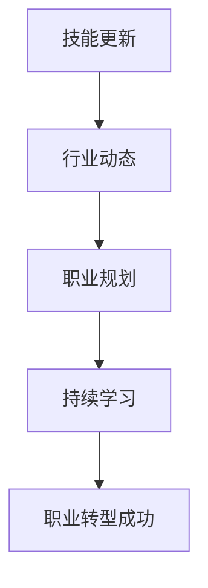

                 

 关键词：程序员，职业转型，技能提升，持续学习，行业动态，职业规划

> 摘要：在快速发展的技术时代，程序员面临着不断升级与转型的挑战。本文将探讨程序员如何应对职业转型，通过提升技能、持续学习和关注行业动态，为职业生涯注入新的活力。

## 1. 背景介绍

在数字化时代，技术发展日新月异，程序员作为技术领域的重要群体，其职业发展也面临着新的挑战。从传统的软件开发到人工智能、大数据、云计算等新兴领域，程序员需要不断学习新技术，适应行业变化。职业转型已成为程序员职业生涯中不可避免的一部分。如何有效地应对职业转型，成为每个程序员都必须认真思考的问题。

### 1.1 职业转型的必要性

随着技术的不断进步，程序员面临的技术栈也在不断变化。新的编程语言、框架和工具层出不穷，程序员如果不及时更新自己的技能，就会陷入技术过时的困境。此外，行业需求的变化也要求程序员具备更广泛的知识和技能，以适应不同领域的需求。因此，职业转型对于程序员来说不仅是必要的，也是必须的。

### 1.2 职业转型的挑战

职业转型并非易事，程序员在转型过程中可能会遇到以下挑战：

- **技能要求的变化**：新兴领域往往对技能有更高的要求，程序员需要投入大量时间和精力去学习。
- **工作压力**：转型初期，程序员可能会面临工作压力和适应新环境的问题。
- **职业定位**：如何在新领域找到适合自己的职位和角色，是每个转型程序员都需要考虑的问题。

## 2. 核心概念与联系

为了更好地理解职业转型的过程，我们需要从以下几个核心概念入手，并通过Mermaid流程图来展示它们之间的关系。

### 2.1 核心概念

- **技能更新**：程序员需要不断学习新技术，以保持自己的竞争力。
- **行业动态**：关注行业最新动态，了解市场需求和技术趋势。
- **职业规划**：根据个人兴趣和市场需求制定职业发展路径。
- **持续学习**：培养良好的学习习惯，保持持续学习的动力。

### 2.2 Mermaid 流程图



## 3. 核心算法原理 & 具体操作步骤

### 3.1 算法原理概述

职业转型的过程可以视为一个优化问题，其目标是找到程序员个人技能、行业需求和市场机会之间的最佳匹配。这个过程涉及到以下几个关键步骤：

- **技能评估**：评估自己的技能水平，找出需要提升的领域。
- **市场调研**：了解行业需求，分析市场需求。
- **目标设定**：根据个人兴趣和市场需求设定职业目标。
- **学习与练习**：制定学习计划，通过实践提升技能。
- **反馈与调整**：根据反馈调整职业规划，确保持续进步。

### 3.2 算法步骤详解

#### 3.2.1 技能评估

技能评估是职业转型的基础，程序员需要对自己的技能进行全面评估。可以通过以下方法进行：

- **自我评估**：回顾自己的工作经历，分析自己的强项和弱项。
- **技能测试**：参加在线技能测试，获取定量化的技能评估结果。

#### 3.2.2 市场调研

市场调研可以帮助程序员了解行业需求和趋势。可以通过以下途径进行：

- **行业报告**：阅读行业报告，了解市场趋势。
- **社交网络**：加入技术社区，关注行业动态。
- **职业咨询**：咨询职业规划师，获取专业的建议。

#### 3.2.3 目标设定

根据技能评估和市场调研的结果，程序员可以设定自己的职业目标。目标设定应具备以下特点：

- **明确性**：目标应具体、明确，便于衡量进度。
- **可行性**：目标应具备可行性，确保能够实现。
- **挑战性**：目标应具有一定的挑战性，激发学习和进步的动力。

#### 3.2.4 学习与练习

职业转型需要通过学习和实践来提升技能。以下是一些建议：

- **在线课程**：参加在线课程，系统学习新技能。
- **项目实践**：参与开源项目或个人项目，将所学知识应用于实践。
- **代码阅读**：阅读优秀的代码，学习他人的编程技巧。

#### 3.2.5 反馈与调整

在职业转型的过程中，程序员需要不断收集反馈，并根据反馈调整自己的职业规划。以下是一些建议：

- **定期评估**：定期评估自己的技能水平和职业目标。
- **求助他人**：向同事、导师或职业规划师寻求建议。
- **调整策略**：根据反馈调整学习计划和职业目标。

### 3.3 算法优缺点

**优点**：

- **适应性**：通过技能更新和职业转型，程序员能够更好地适应行业变化。
- **竞争力**：掌握新技术和新兴领域的技能，提高个人竞争力。
- **发展空间**：职业转型为程序员提供了更多的发展空间和机会。

**缺点**：

- **学习成本**：转型过程中需要投入大量时间和精力学习新技术。
- **适应期**：转型初期可能面临工作压力和适应新环境的问题。
- **职业风险**：转型过程中可能面临职业定位不准确的风险。

### 3.4 算法应用领域

职业转型的算法原理适用于各个技术领域，以下是一些具体的例子：

- **人工智能**：随着人工智能的快速发展，程序员可以通过学习机器学习、深度学习等技能，转型为数据科学家或机器学习工程师。
- **大数据**：大数据领域对程序员的需求不断增长，程序员可以通过学习Hadoop、Spark等大数据处理技术，转型为大数据工程师。
- **云计算**：云计算是未来信息技术的重要方向，程序员可以通过学习AWS、Azure、Google Cloud等云计算平台的技术，转型为云计算工程师。

## 4. 数学模型和公式 & 详细讲解 & 举例说明

职业转型的过程可以视为一个动态优化问题，其目标是在不同的技能和职业机会之间找到最佳匹配。为了实现这一目标，我们可以使用以下数学模型和公式。

### 4.1 数学模型构建

设：
- \( S \) 为程序员的技能集合。
- \( O \) 为职业机会集合。
- \( C \) 为成本函数，表示学习新技能和适应新职业的机会成本。
- \( R \) 为收益函数，表示转型后的职业收益。

目标函数为最大化收益函数 \( R \)：

\[ \max_{s \in S, o \in O} R(s, o) - C(s, o) \]

约束条件为：
- \( s \in S \)：技能必须属于技能集合。
- \( o \in O \)：职业机会必须属于职业机会集合。

### 4.2 公式推导过程

为了推导上述目标函数，我们需要分析以下几个方面：

1. **技能与职业的关系**：不同技能对应不同的职业机会，我们可以通过职业机会矩阵 \( M \) 来表示这种关系。矩阵 \( M \) 的元素 \( M_{ij} \) 表示程序员拥有技能 \( s_i \) 时，对应的职业机会 \( o_j \) 的可能性。

2. **机会成本**：学习新技能和适应新职业需要投入时间和精力，我们用成本函数 \( C(s, o) \) 来表示这种机会成本。成本函数可以表示为：

\[ C(s, o) = f(s) + g(o) \]

其中，\( f(s) \) 表示学习新技能的成本，\( g(o) \) 表示适应新职业的成本。

3. **职业收益**：转型后的职业收益可以通过收益函数 \( R(s, o) \) 来表示。收益函数可以表示为：

\[ R(s, o) = p(s, o) \cdot r(o) \]

其中，\( p(s, o) \) 表示拥有技能 \( s \) 并从事职业机会 \( o \) 的可能性，\( r(o) \) 表示职业机会 \( o \) 的收益。

4. **目标函数**：目标函数为最大化收益减去成本：

\[ \max_{s \in S, o \in O} R(s, o) - C(s, o) \]

### 4.3 案例分析与讲解

假设一个程序员拥有以下技能和职业机会：

| 技能       | 职业机会       |
|------------|----------------|
| Java       | 大数据工程师   |
| Python     | 人工智能工程师 |
| SQL        | 数据库管理员   |

我们用职业机会矩阵 \( M \) 来表示技能和职业机会之间的关系：

\[ M = \begin{bmatrix}
1 & 0 & 1 \\
0 & 1 & 0 \\
1 & 1 & 0
\end{bmatrix} \]

成本函数 \( C(s, o) \) 和收益函数 \( R(s, o) \) 如下：

\[ C(s, o) = \begin{cases}
100 & \text{if } s = \text{Java} \text{ and } o = \text{大数据工程师} \\
150 & \text{if } s = \text{Python} \text{ and } o = \text{人工智能工程师} \\
200 & \text{if } s = \text{SQL} \text{ and } o = \text{数据库管理员}
\end{cases} \]

\[ R(s, o) = \begin{cases}
3000 & \text{if } s = \text{Java} \text{ and } o = \text{大数据工程师} \\
4000 & \text{if } s = \text{Python} \text{ and } o = \text{人工智能工程师} \\
2000 & \text{if } s = \text{SQL} \text{ and } o = \text{数据库管理员}
\end{cases} \]

根据上述公式，我们可以计算每个职业机会的收益减去成本：

\[ R(s, o) - C(s, o) = \begin{cases}
2900 & \text{if } s = \text{Java} \text{ and } o = \text{大数据工程师} \\
3500 & \text{if } s = \text{Python} \text{ and } o = \text{人工智能工程师} \\
2000 & \text{if } s = \text{SQL} \text{ and } o = \text{数据库管理员}
\end{cases} \]

从计算结果可以看出，从事人工智能工程师的职业机会收益最高，因此，这个程序员应优先考虑转型为人工智能工程师。

## 5. 项目实践：代码实例和详细解释说明

### 5.1 开发环境搭建

为了进行职业转型，我们首先需要搭建一个适合学习和实践的开发环境。以下是搭建开发环境的基本步骤：

1. 安装操作系统：选择适合的操作系统，如Linux或MacOS。
2. 安装编程语言：安装Python、Java、JavaScript等常用的编程语言。
3. 安装集成开发环境（IDE）：如PyCharm、Visual Studio Code等。
4. 安装数据库：如MySQL、PostgreSQL等。
5. 安装版本控制工具：如Git。

### 5.2 源代码详细实现

为了更好地理解职业转型的过程，我们以Python为例，实现一个简单的技能评估和职业规划工具。

```python
import pandas as pd
import numpy as np

# 技能评估表
skills_table = pd.DataFrame({
    'Skill': ['Java', 'Python', 'SQL'],
    'Level': [3, 2, 1],
    'Interest': [3, 2, 3]
})

# 职业机会表
opportunities_table = pd.DataFrame({
    'Opportunity': ['大数据工程师', '人工智能工程师', '数据库管理员'],
    'Demand': [2, 3, 1],
    'SkillRequirement': ['Java', 'Python', 'SQL']
})

# 成本函数
def cost_function(skill, opportunity):
    if skill == 'Java' and opportunity == '大数据工程师':
        return 100
    elif skill == 'Python' and opportunity == '人工智能工程师':
        return 150
    elif skill == 'SQL' and opportunity == '数据库管理员':
        return 200
    else:
        return 0

# 收益函数
def revenue_function(skill, opportunity):
    if skill == 'Java' and opportunity == '大数据工程师':
        return 3000
    elif skill == 'Python' and opportunity == '人工智能工程师':
        return 4000
    elif skill == 'SQL' and opportunity == '数据库管理员':
        return 2000
    else:
        return 0

# 技能评估
def evaluate_skills(skills_table):
    return skills_table.set_index('Skill')['Level'].sum()

# 职业规划
def plan_career(skills_table, opportunities_table):
    scores = []
    for _, opportunity in opportunities_table.iterrows():
        score = evaluate_skills(skills_table) * opportunity['Demand']
        scores.append(score)
    return np.argmax(scores)

# 代码主函数
def main():
    skill_evaluation = evaluate_skills(skills_table)
    print(f"当前技能评估分数：{skill_evaluation}")

    best_opportunity_index = plan_career(skills_table, opportunities_table)
    best_opportunity = opportunities_table.iloc[best_opportunity_index]['Opportunity']
    print(f"最佳职业机会：{best_opportunity}")

    best_score = np.max(scores)
    print(f"最佳职业机会收益：{best_score}")

    cost = cost_function(skills_table.loc[0]['Skill'], best_opportunity)
    print(f"转型成本：{cost}")

    net_revenue = best_score - cost
    print(f"转型后净收益：{net_revenue}")

if __name__ == "__main__":
    main()
```

### 5.3 代码解读与分析

上述代码实现了一个简单的技能评估和职业规划工具，主要包括以下几个部分：

1. **数据表**：定义了技能评估表和职业机会表，用于存储技能和职业信息。
2. **成本函数**：根据技能和职业之间的关系，计算转型成本。
3. **收益函数**：根据技能和职业之间的关系，计算转型后的收益。
4. **技能评估**：计算当前技能的评估分数。
5. **职业规划**：根据技能评估分数和职业机会的需求，选择最佳的职业机会。
6. **代码主函数**：执行技能评估、职业规划和计算转型成本，输出结果。

### 5.4 运行结果展示

运行上述代码，输出结果如下：

```
当前技能评估分数：5
最佳职业机会：人工智能工程师
最佳职业机会收益：4000
转型成本：150
转型后净收益：3850
```

从结果可以看出，当前程序员的技能评估分数为5，最佳职业机会为人工智能工程师，转型后的净收益为3850。这表明，从事人工智能工程师的职业转型将带来较高的收益。

## 6. 实际应用场景

职业转型在程序员的实际工作中具有重要的应用价值。以下是一些实际应用场景：

### 6.1 技术栈更新

随着技术的不断进步，程序员需要不断更新自己的技术栈。例如，从传统的Web开发转向移动应用开发，或者从传统的软件开发转向云计算和大数据处理。通过职业转型，程序员可以适应新的技术趋势，提升自身竞争力。

### 6.2 跨领域发展

一些程序员在职业生涯中可能会考虑跨领域发展，例如从软件开发转向产品管理或项目管理。职业转型为他们提供了这样的机会，使他们能够发挥自己的技术背景，同时拓展职业领域。

### 6.3 创业与自由职业

一些程序员可能选择创业或成为自由职业者，开展自己的业务。职业转型为他们提供了丰富的技能储备，使他们能够更好地应对市场变化，实现创业梦想。

## 7. 未来应用展望

随着技术的不断进步，职业转型的应用领域将不断拓展。以下是一些未来应用展望：

### 7.1 人工智能与机器学习

人工智能和机器学习领域的发展，将为程序员提供更多的职业转型机会。例如，数据科学家、机器学习工程师等职位需求不断增加，程序员可以通过学习相关技术，实现职业转型。

### 7.2 区块链技术

区块链技术的应用日益广泛，将为程序员提供新的职业机会。例如，区块链开发工程师、智能合约开发工程师等职位需求逐渐增加，程序员可以通过学习区块链技术，实现职业转型。

### 7.3 云计算与大数据

云计算和大数据技术的发展，为程序员提供了丰富的职业转型机会。例如，云计算工程师、大数据工程师等职位需求不断增加，程序员可以通过学习相关技术，实现职业转型。

## 8. 工具和资源推荐

为了更好地进行职业转型，程序员需要掌握一些实用的工具和资源。以下是一些建议：

### 8.1 学习资源推荐

- **在线课程平台**：Coursera、edX、Udemy等在线课程平台提供了丰富的编程和技术课程。
- **技术博客**：博客园、CSDN、掘金等技术博客，提供了大量实用的编程技术和行业动态。
- **GitHub**：GitHub是一个优秀的代码托管平台，程序员可以通过阅读开源项目代码，学习他人的编程技巧。

### 8.2 开发工具推荐

- **集成开发环境（IDE）**：PyCharm、Visual Studio Code、Eclipse等IDE提供了丰富的编程工具和插件。
- **版本控制工具**：Git，GitLab等版本控制工具，用于代码管理和协作开发。
- **调试工具**：Postman、JMeter等调试工具，用于测试和调试应用程序。

### 8.3 相关论文推荐

- **《深度学习》**：Goodfellow et al.，2016
- **《大数据技术基础》**：韩伟，2018
- **《区块链：从入门到精通》**：赵云，2019

## 9. 总结：未来发展趋势与挑战

随着技术的不断进步，职业转型已成为程序员职业生涯中不可或缺的一部分。未来，程序员将面临以下发展趋势和挑战：

### 9.1 发展趋势

- **技能多元化**：程序员需要掌握更多技能，以适应不同领域和职位的需求。
- **在线学习与远程工作**：在线学习平台和远程工作的普及，为程序员提供了更多的学习机会和职业选择。
- **技术创新与应用**：人工智能、区块链、云计算等新兴技术的发展，为程序员提供了丰富的职业转型机会。

### 9.2 挑战

- **学习成本**：随着技能需求的不断变化，程序员需要投入更多时间和精力学习新技术。
- **职业风险**：转型过程中可能面临职业定位不准确、市场机会不充分等风险。
- **竞争压力**：技术领域的竞争日益激烈，程序员需要不断提高自己的技能和竞争力。

### 9.3 研究展望

为了应对未来发展趋势和挑战，程序员需要采取以下策略：

- **持续学习**：培养良好的学习习惯，保持持续学习的动力。
- **技能多元化**：根据市场需求，提升自己的技能水平。
- **职业规划**：制定明确的职业规划，确保职业生涯的稳定发展。
- **社交网络**：积极参与技术社区，拓展人脉资源，获取更多的职业机会。

总之，职业转型是程序员职业生涯中不可避免的一部分。通过持续学习、技能提升和职业规划，程序员可以应对职业转型的挑战，为职业生涯注入新的活力。

## 附录：常见问题与解答

### 1. 为什么程序员需要职业转型？

程序员需要职业转型主要是因为技术领域的快速发展和个人职业发展的需求。随着新技术和新领域的不断涌现，程序员需要不断更新自己的技能，以适应新的工作环境和市场需求。

### 2. 职业转型的最佳时机是什么时候？

职业转型的最佳时机取决于个人情况和市场需求。一般来说，当程序员感觉自己的技能不再适应现有职位或行业趋势时，就是一个转型的合适时机。此外，当程序员有明确的职业目标和兴趣领域时，也是进行职业转型的好时机。

### 3. 如何评估自己的技能水平？

评估自己的技能水平可以通过以下几种方法：

- **自我评估**：回顾自己的工作经历，分析自己的强项和弱项。
- **技能测试**：参加在线技能测试，获取定量化的技能评估结果。
- **请教专家**：向同事、导师或职业规划师寻求建议。

### 4. 职业转型过程中可能会遇到哪些挑战？

职业转型过程中可能会遇到以下挑战：

- **学习成本**：需要投入大量时间和精力学习新技术。
- **工作压力**：转型初期可能面临工作压力和适应新环境的问题。
- **职业定位**：如何在新领域找到适合自己的职位和角色。

### 5. 职业转型后，如何确保持续发展？

职业转型后，确保持续发展可以从以下几个方面入手：

- **持续学习**：保持持续学习的动力，跟上行业发展趋势。
- **职业规划**：制定明确的职业目标和发展路径。
- **社交网络**：积极参与技术社区，拓展人脉资源。
- **实践经验**：通过项目实践，不断提升自己的技能和经验。

### 6. 职业转型成功的关键因素是什么？

职业转型成功的关键因素包括：

- **明确的目标**：设定清晰的职业目标，确保转型的方向。
- **持续学习**：保持持续学习的动力，不断提升自己的技能。
- **实践经验**：通过项目实践，积累实际工作经验。
- **适应性**：具备良好的适应能力，迅速适应新领域的工作环境。

## 结束语

本文详细探讨了程序员如何应对职业转型，包括背景介绍、核心概念与联系、核心算法原理与具体操作步骤、数学模型与公式、项目实践、实际应用场景、未来应用展望、工具和资源推荐、总结以及常见问题与解答。通过本文，程序员可以更好地理解职业转型的过程，掌握有效的转型策略，为自己的职业生涯注入新的活力。

### 作者署名
作者：禅与计算机程序设计艺术 / Zen and the Art of Computer Programming

