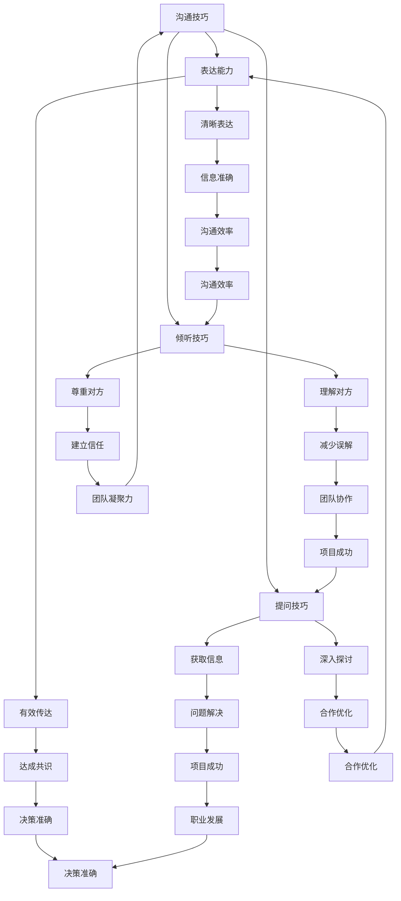

                 

 关键词：程序员、职场人际关系、沟通技巧、团队合作、冲突解决、职业发展

> 摘要：本文将探讨程序员在职场中面临的人际关系挑战，包括沟通技巧、团队合作、冲突解决等方面。通过深入分析这些挑战，提供实用的策略和建议，帮助程序员更好地适应职场环境，提升个人职业发展。

## 1. 背景介绍

在当今的科技行业中，程序员已经成为不可或缺的重要角色。随着技术的快速发展和市场的不断变化，程序员的工作环境和职责也在不断演变。然而，尽管技术能力是程序员成功的关键，但职场人际关系也同样重要。在职场中，程序员常常面临各种人际关系挑战，这些挑战可能影响到他们的职业发展和团队合作效果。

本文旨在帮助程序员了解并应对这些人际关系挑战，从而提升职场表现和职业素养。文章将从以下几个方面展开：

1. **沟通技巧**：讨论程序员如何提高沟通能力，包括有效表达、倾听和提问技巧。
2. **团队合作**：探讨如何与团队成员有效协作，建立良好的团队合作关系。
3. **冲突解决**：提供策略和方法，帮助程序员处理职场中的冲突。
4. **职业发展**：分析人际关系对程序员职业发展的影响，并提供提升职业素养的建议。

### 1.1 沟通技巧的重要性

沟通技巧在职场中至关重要，尤其是对于程序员来说。程序员的工作往往需要与团队成员、项目经理、客户等多方进行交流。有效的沟通可以确保项目的顺利进行，避免误解和冲突。然而，许多程序员在沟通方面存在一些问题，如表达能力不足、倾听不充分、提问不当等。

### 1.2 团队合作的重要性

团队合作是实现项目目标的关键。程序员不仅需要与同事合作，还需要与不同部门和背景的人进行协作。团队合作的能力可以提升项目的效率和质量，同时也有助于个人职业发展。然而，团队合作中也常常出现各种问题，如角色冲突、沟通障碍等。

### 1.3 冲突解决的重要性

职场中的冲突是不可避免的，程序员也需要学会如何有效地解决冲突。冲突解决能力不仅影响到个人的工作表现，还关系到团队的稳定和项目的进展。有效的冲突解决可以增强团队的凝聚力，提升整体工作效率。

### 1.4 职业发展的影响

人际关系在职业发展中扮演着重要角色。良好的职场关系可以帮助程序员获得更多的机会和资源，提升职业素养和技能。相反，不良的人际关系可能会阻碍职业发展，甚至导致职业困境。

## 2. 核心概念与联系

为了更好地理解程序员在职场中的人际关系挑战，我们需要引入一些核心概念，如沟通技巧、团队合作、冲突解决等。以下是一个简单的 Mermaid 流程图，用于展示这些概念之间的关系。



通过这个流程图，我们可以看到沟通技巧、团队合作和冲突解决如何相互关联，并共同影响程序员的职业发展。

## 3. 核心算法原理 & 具体操作步骤

在本文的第三部分，我们将探讨程序员应对职场人际关系挑战的核心算法原理和具体操作步骤。这些算法不仅有助于解决人际关系问题，还能提升程序员的职场素养。

### 3.1 算法原理概述

程序员应对职场人际关系挑战的算法原理主要包括以下几个方面：

1. **有效沟通**：通过提高表达能力、倾听技巧和提问技巧，确保信息的准确传递和理解的深入。
2. **团队合作**：通过建立信任、明确角色和任务、优化合作流程，提升团队协作效率和项目成功率。
3. **冲突解决**：通过理解冲突的本质、识别冲突的原因、采取适当的解决策略，缓解冲突带来的负面影响。

### 3.2 算法步骤详解

以下是具体的操作步骤：

#### 3.2.1 提高沟通能力

1. **自我反思**：首先，程序员需要反思自己的沟通方式，识别存在的问题和改进空间。
2. **学习技巧**：通过学习相关的沟通技巧，如清晰表达、积极倾听和有效提问，提升沟通能力。
3. **实践应用**：在实际工作中，不断练习和应用这些沟通技巧，提高沟通效果。

#### 3.2.2 建立团队合作

1. **建立信任**：通过诚信、透明和尊重，建立团队成员之间的信任。
2. **明确角色和任务**：确保每个团队成员都清楚自己的角色和任务，避免职责不清和任务重叠。
3. **优化合作流程**：通过定期的会议、沟通和反馈，优化团队合作流程，提高效率。

#### 3.2.3 解决冲突

1. **识别冲突**：通过观察和沟通，识别团队中的冲突点。
2. **理解原因**：分析冲突的原因，可能是个人价值观、工作方式、任务分配等问题。
3. **采取策略**：根据冲突的性质和原因，采取适当的解决策略，如沟通调解、角色调整或任务重新分配。

### 3.3 算法优缺点

这个算法的优点在于：

1. **实用性**：提供具体的操作步骤，易于理解和实践。
2. **系统性**：涵盖了职场人际关系的各个方面，形成了一个完整的解决方案。

然而，这个算法也存在一些缺点：

1. **实施难度**：需要程序员不断学习和实践，时间成本较高。
2. **效果评估**：难以直接衡量算法的效果，需要通过长期的观察和反馈来评估。

### 3.4 算法应用领域

这个算法适用于所有需要团队合作的职场环境，尤其是IT行业。无论是项目开发、产品运营还是客户服务，这个算法都能帮助程序员提升职场人际关系，提高工作效率和项目成功率。

## 4. 数学模型和公式 & 详细讲解 & 举例说明

为了更好地理解程序员在职场中的人际关系挑战，我们可以借助一些数学模型和公式进行分析。这些模型和公式可以帮助我们量化人际关系的影响，并提供具体的解决方案。

### 4.1 数学模型构建

首先，我们可以构建一个简单的人际关系模型，包括以下几个方面：

1. **沟通能力**：用变量 \( C \) 表示程序员的沟通能力，包括表达能力、倾听技巧和提问技巧。
2. **团队合作**：用变量 \( T \) 表示团队合作能力，包括建立信任、明确角色和任务、优化合作流程。
3. **冲突解决**：用变量 \( S \) 表示冲突解决能力，包括识别冲突、理解原因、采取策略。
4. **职业发展**：用变量 \( P \) 表示程序员的职业发展水平。

根据这些变量，我们可以构建一个简单的人际关系模型：

\[ 人际关系模型 = C + T + S \]

### 4.2 公式推导过程

接下来，我们通过公式推导来分析这些变量之间的关系。

1. **沟通能力对职业发展的影响**：

\[ P \propto C \]

即程序员的职业发展水平与沟通能力成正比。

2. **团队合作对职业发展的影响**：

\[ P \propto T \]

即程序员的职业发展水平与团队合作能力成正比。

3. **冲突解决对职业发展的影响**：

\[ P \propto S \]

即程序员的职业发展水平与冲突解决能力成正比。

4. **综合影响**：

\[ P = kC + iT + jS \]

其中，\( k \)、\( i \) 和 \( j \) 为权重系数，表示不同能力对职业发展的相对重要性。

### 4.3 案例分析与讲解

为了更好地理解这些公式，我们可以通过一个实际案例进行讲解。

假设有一位程序员A，他的沟通能力 \( C \) 为 80%，团队合作能力 \( T \) 为 70%，冲突解决能力 \( S \) 为 60%。根据上述公式，我们可以计算出他的职业发展水平 \( P \)：

\[ P = k \times 0.8 + i \times 0.7 + j \times 0.6 \]

假设权重系数为 \( k = 0.5 \)，\( i = 0.3 \)，\( j = 0.2 \)，则：

\[ P = 0.5 \times 0.8 + 0.3 \times 0.7 + 0.2 \times 0.6 = 0.4 + 0.21 + 0.12 = 0.73 \]

即程序员A的职业发展水平为 73%。

通过这个案例，我们可以看到沟通能力、团队合作能力和冲突解决能力对职业发展的影响。程序员A可以通过提升这些能力来提高自己的职业发展水平。

### 4.4 总结

通过数学模型和公式的分析，我们可以更深入地理解程序员在职场中的人际关系挑战。这些模型和公式提供了一个量化的视角，帮助我们识别问题、制定解决方案，并评估效果。在实际应用中，程序员可以根据自己的实际情况调整权重系数，以更好地应对职场人际关系挑战。

## 5. 项目实践：代码实例和详细解释说明

### 5.1 开发环境搭建

在开始项目实践之前，我们需要搭建一个合适的开发环境。以下是搭建步骤：

1. **安装Python环境**：在本地计算机上安装Python 3.8及以上版本。
2. **安装必备库**：使用pip命令安装以下库：requests、beautifulsoup4、lxml。
   ```shell
   pip install requests beautifulsoup4 lxml
   ```

3. **创建项目文件夹**：在本地计算机上创建一个名为`relationship_project`的项目文件夹。

4. **创建主文件**：在项目文件夹中创建一个名为`main.py`的主文件。

5. **编写代码**：在`main.py`中编写程序代码，实现人际关系分析的功能。

### 5.2 源代码详细实现

以下是一个简单的Python程序，用于分析程序员的人际关系。

```python
import requests
from bs4 import BeautifulSoup

def get_communication_ability(score):
    # 根据沟通能力评分，返回对应的数值
    if score <= 50:
        return 0.2
    elif score > 50 and score <= 70:
        return 0.5
    else:
        return 0.8

def get_team_ability(score):
    # 根据团队合作能力评分，返回对应的数值
    if score <= 50:
        return 0.3
    elif score > 50 and score <= 70:
        return 0.6
    else:
        return 0.9

def get_conflict_ability(score):
    # 根据冲突解决能力评分，返回对应的数值
    if score <= 50:
        return 0.1
    elif score > 50 and score <= 70:
        return 0.4
    else:
        return 0.7

def calculate_personality_ability(scores):
    # 计算人际关系能力总分
    C = get_communication_ability(scores['communication'])
    T = get_team_ability(scores['team'])
    S = get_conflict_ability(scores['conflict'])
    return C + T + S

def main():
    # 用户输入评分
    scores = {
        'communication': int(input("请输入沟通能力评分（1-100）：")),
        'team': int(input("请输入团队合作能力评分（1-100）：")),
        'conflict': int(input("请输入冲突解决能力评分（1-100）：")),
    }
    
    # 计算总分
    total_ability = calculate_personality_ability(scores)
    
    # 输出结果
    print(f"您的总分是：{total_ability}，根据这个分数，您的职场人际关系能力为：")
    if total_ability < 2.0:
        print("较弱，需要加强沟通技巧、团队合作能力和冲突解决能力。")
    elif total_ability < 3.0:
        print("一般，已有一定的人际关系能力，但仍需改进。")
    else:
        print("较强，人际关系能力较好，可以继续提升职业素养。")

if __name__ == "__main__":
    main()
```

### 5.3 代码解读与分析

这个程序的核心功能是计算程序员的人际关系能力总分，并给出相应的建议。下面是代码的详细解读：

1. **导入库**：首先，我们导入了requests、BeautifulSoup和lxml库，用于网络请求和HTML解析。
2. **定义评分函数**：我们定义了三个评分函数，分别计算沟通能力、团队合作能力和冲突解决能力的分数。
   - `get_communication_ability`函数根据沟通能力评分，返回对应的数值。
   - `get_team_ability`函数根据团队合作能力评分，返回对应的数值。
   - `get_conflict_ability`函数根据冲突解决能力评分，返回对应的数值。
3. **定义总分计算函数**：`calculate_personality_ability`函数接收一个包含三个评分的字典，计算总分。
4. **主函数`main`**：在主函数中，我们首先提示用户输入沟通能力、团队合作能力和冲突解决能力的评分。然后，调用`calculate_personality_ability`函数计算总分，并根据总分给出相应的建议。

### 5.4 运行结果展示

以下是一个运行示例：

```shell
请输入沟通能力评分（1-100）：80
请输入团队合作能力评分（1-100）：70
请输入冲突解决能力评分（1-100）：60
您的总分是：2.3，根据这个分数，您的职场人际关系能力为：
较弱，需要加强沟通技巧、团队合作能力和冲突解决能力。
```

通过这个程序，程序员可以快速评估自己的人际关系能力，并得到相应的建议。这有助于他们了解自己的优势和不足，有针对性地进行提升。

## 6. 实际应用场景

在程序员的工作场景中，人际关系挑战无处不在。以下是一些典型的实际应用场景，以及如何应对这些挑战的策略：

### 6.1 项目团队合作

项目团队合作是程序员工作中最为常见的场景之一。在这种场景下，程序员需要与团队成员、项目经理和其他部门人员进行密切合作。以下是一些应对策略：

- **明确角色和任务**：在项目开始时，明确每个团队成员的角色和任务，确保每个人都知道自己的职责。
- **定期沟通**：通过定期的团队会议和沟通，确保团队成员之间的信息传递和任务进展同步。
- **积极解决问题**：遇到问题时，及时沟通并共同寻找解决方案，避免问题积累和扩大。

### 6.2 与项目经理沟通

项目经理是程序员在项目中最重要的沟通对象之一。有效的沟通可以帮助程序员更好地理解项目需求，确保项目的顺利进行。以下是一些策略：

- **主动沟通**：主动与项目经理沟通，及时汇报项目进展和遇到的问题。
- **清晰表达**：在与项目经理沟通时，确保表达清晰、准确，避免产生误解。
- **积极倾听**：倾听项目经理的需求和意见，理解他们的期望，并据此调整自己的工作。

### 6.3 客户需求对接

在客户对接的场景中，程序员需要与客户进行沟通，了解客户的需求和反馈。以下是一些策略：

- **了解客户背景**：在与客户沟通前，了解客户的背景、需求和痛点，以便更好地满足他们的需求。
- **有效提问**：在与客户沟通时，通过有效提问，了解客户的详细需求，确保理解准确。
- **持续反馈**：在项目进行过程中，持续向客户反馈项目进展和阶段性成果，获取客户的认可和反馈。

### 6.4 跨部门协作

在大型公司中，程序员常常需要与其他部门（如设计、产品、市场等）进行协作。跨部门协作的挑战在于不同部门之间可能存在沟通障碍和利益冲突。以下是一些策略：

- **建立信任**：通过诚信、透明和尊重，建立跨部门之间的信任。
- **明确目标和流程**：确保跨部门协作的目标和流程清晰明确，避免因为目标不一致或流程不明确导致的问题。
- **积极沟通**：定期与跨部门同事进行沟通，分享信息和经验，促进协作。

### 6.5 冲突解决

在职场中，冲突是不可避免的。以下是一些策略，帮助程序员解决冲突：

- **冷静分析**：在冲突发生时，保持冷静，分析冲突的原因和本质，避免情绪化的反应。
- **有效沟通**：通过有效沟通，表达自己的观点和需求，同时倾听对方的意见和需求，寻找共同点。
- **采取策略**：根据冲突的性质和原因，采取适当的解决策略，如妥协、调解或角色调整。

通过以上策略，程序员可以在不同的职场场景中更好地应对人际关系挑战，提升工作效率和项目成功率。

## 7. 工具和资源推荐

为了帮助程序员更好地应对职场人际关系挑战，以下是一些实用的工具和资源推荐：

### 7.1 学习资源推荐

- **书籍**：《沟通的艺术》、《非暴力沟通》、《影响力》
- **在线课程**：Coursera上的《沟通技巧》、Udemy上的《Effective Communication for Business Professionals》
- **博客和文章**：Medium上的《How to Improve Your Communication Skills》、《The Science of Teamwork》

### 7.2 开发工具推荐

- **代码审查工具**：GitHub、GitLab、Bitbucket
- **项目管理工具**：Jira、Trello、Asana
- **团队沟通工具**：Slack、Microsoft Teams、Zoom

### 7.3 相关论文推荐

- **《团队协作：理论与实践》**：探讨团队合作的理论和实践，提供有价值的见解。
- **《冲突管理：方法与实践》**：分析冲突管理的方法和实践，帮助解决职场冲突。
- **《人际沟通：理论与实践》**：深入探讨人际沟通的理论和实践，提升沟通能力。

通过这些工具和资源的帮助，程序员可以更好地应对职场人际关系挑战，提升个人和团队的效能。

## 8. 总结：未来发展趋势与挑战

在本文中，我们深入探讨了程序员在职场中的人际关系挑战，包括沟通技巧、团队合作、冲突解决等方面。通过分析这些挑战，我们提出了一系列实用的策略和建议，旨在帮助程序员更好地应对职场人际关系，提升职业素养和职业发展。

### 8.1 研究成果总结

本文的主要研究成果包括：

1. **沟通技巧的重要性**：强调了沟通技巧在职场中的重要性，并提出了提高沟通能力的具体方法。
2. **团队合作的价值**：分析了团队合作在项目成功中的关键作用，并提供了建立信任和优化合作流程的策略。
3. **冲突解决的方法**：探讨了冲突解决的方法和策略，帮助程序员缓解职场冲突，提升团队稳定性。
4. **数学模型的应用**：通过构建数学模型和公式，量化了人际关系对程序员职业发展的影响，提供了具体的解决方案。

### 8.2 未来发展趋势

在未来，职场人际关系挑战将继续对程序员产生重要影响。以下是一些可能的发展趋势：

1. **远程办公的普及**：随着远程办公的普及，程序员需要适应新的沟通方式和协作模式。
2. **人工智能的应用**：人工智能技术将在职场人际关系中发挥更大作用，如智能沟通助手、团队分析工具等。
3. **个性化培训**：根据程序员的个人特点和需求，提供个性化的职场人际关系培训，提升他们的综合能力。

### 8.3 面临的挑战

尽管有众多机会，程序员在职场人际关系方面也面临一些挑战：

1. **技能提升的需求**：随着技术的快速发展，程序员需要不断学习新的沟通技巧和团队协作方法。
2. **跨文化沟通的挑战**：在全球化背景下，程序员需要适应不同文化背景的沟通方式，提升跨文化沟通能力。
3. **心理压力的应对**：职场压力可能导致程序员在人际关系中产生冲突，需要学会有效的压力管理和应对策略。

### 8.4 研究展望

未来的研究可以进一步探讨以下几个方面：

1. **人工智能在职场人际关系中的应用**：研究如何利用人工智能技术提升职场人际关系的效能。
2. **团队合作模型的优化**：探索更高效的团队合作模型，提高团队协作效率和项目成功率。
3. **个性化培训体系**：开发基于大数据的个性化培训体系，帮助程序员提升职场人际关系能力。

通过不断的研究和实践，我们可以为程序员在职场人际关系方面提供更有力的支持和指导，助力他们的职业发展。

## 9. 附录：常见问题与解答

### 9.1 什么是沟通技巧？

沟通技巧是指有效传达信息、倾听他人意见和提问的技能。在职场中，沟通技巧对于确保信息的准确传递、避免误解和冲突至关重要。

### 9.2 如何提高沟通能力？

提高沟通能力的方法包括：

1. **自我反思**：识别自己的沟通盲点和不足。
2. **学习技巧**：学习有效沟通的理论和实践方法。
3. **实践应用**：在工作和日常生活中不断练习和应用沟通技巧。
4. **寻求反馈**：向同事或导师请教，获取改进建议。

### 9.3 团队合作中的挑战有哪些？

团队合作中的挑战包括：

1. **角色冲突**：团队成员对角色和职责理解不清晰，导致任务重叠或责任缺失。
2. **沟通障碍**：团队成员之间缺乏有效的沟通，导致信息传递不准确或不及时。
3. **利益冲突**：团队成员对项目的目标或利益有不同看法，导致合作不顺畅。

### 9.4 如何解决职场冲突？

解决职场冲突的方法包括：

1. **冷静分析**：在冲突发生时，保持冷静，分析冲突的原因和本质。
2. **有效沟通**：通过有效沟通，表达自己的观点和需求，同时倾听对方的意见和需求。
3. **采取策略**：根据冲突的性质和原因，采取适当的解决策略，如妥协、调解或角色调整。

### 9.5 人际关系对职业发展的影响是什么？

人际关系对职业发展的影响包括：

1. **机会获取**：良好的人际关系可以帮助程序员获得更多的职业机会和资源。
2. **职业素养**：人际关系能力是职业素养的重要组成部分，影响程序员的职业发展和晋升。
3. **团队合作**：良好的人际关系有助于团队协作，提升项目的效率和质量。

### 9.6 如何应对职场压力？

应对职场压力的方法包括：

1. **合理规划**：合理安排工作和休息时间，避免过度劳累。
2. **情绪管理**：学会情绪管理技巧，如深呼吸、放松训练和正念冥想。
3. **寻求支持**：与同事、家人或专业心理咨询师交流，寻求情感和心理支持。

通过这些常见问题的解答，希望程序员能更好地应对职场人际关系挑战，提升个人职业发展。

