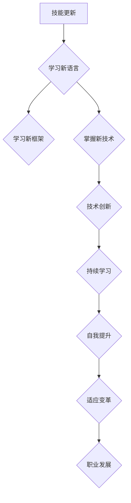

                 

关键词：行业变革、转型、程序员、技能更新、持续学习、技术创新

> 摘要：在快速发展的技术时代，程序员面临着前所未有的变革与转型挑战。本文将深入探讨程序员如何应对行业变革，包括技能更新、持续学习、技术创新等多个方面，以期为程序员在职业生涯中提供指导和启示。

## 1. 背景介绍

计算机技术的发展日新月异，新的编程语言、框架、工具层出不穷，程序员需要不断地更新自己的知识和技能，以保持竞争力。此外，随着人工智能、大数据、云计算等前沿技术的广泛应用，传统编程岗位也在发生着深刻的变化。程序员不仅需要掌握传统的编程技能，还需要了解和掌握新兴技术的应用。

### 1.1 行业变革的驱动因素

- **技术更新迭代快**：新技术、新框架层出不穷，程序员需要不断学习以跟上技术发展的步伐。
- **人工智能与自动化**：人工智能和自动化技术的应用，使得某些传统编程岗位面临被取代的风险。
- **云计算与大数据**：云计算和大数据技术的普及，对程序员的技能提出了新的要求。
- **数字化转型的需求**：企业数字化转型推动了程序员在数据分析、云计算、物联网等领域的需求。

### 1.2 程序员面临的挑战

- **技能更新压力**：程序员需要不断学习新的技术，否则可能会被行业淘汰。
- **职业转型困难**：面对新兴技术，一些程序员可能难以适应，职业转型变得困难。
- **工作与生活的平衡**：持续的学习和工作压力，可能导致程序员难以平衡工作与生活。

## 2. 核心概念与联系

在应对行业变革的过程中，程序员需要掌握以下核心概念：

### 2.1 技能更新

- **编程语言**：了解和掌握新的编程语言，如Python、Go等。
- **框架与工具**：熟悉流行的框架和工具，如Django、React等。
- **新兴技术**：学习人工智能、大数据、云计算等新兴技术。

### 2.2 持续学习

- **自主学习能力**：培养自主学习的能力，不断充实自己的知识体系。
- **学习资源**：利用在线课程、书籍、博客等资源，进行自我提升。

### 2.3 技术创新

- **创新能力**：培养创新思维，敢于尝试新的技术和方法。
- **技术探索**：参与开源项目、技术论坛等活动，拓展技术视野。

下面是一个使用Mermaid绘制的流程图，展示了程序员应对行业变革的流程：



## 3. 核心算法原理 & 具体操作步骤

### 3.1 算法原理概述

在应对行业变革的过程中，程序员需要掌握一些核心算法原理，这些原理有助于解决实际问题，提高编程能力。

- **排序算法**：如快速排序、归并排序等。
- **查找算法**：如二分查找、哈希查找等。
- **数据结构**：如栈、队列、链表、树、图等。
- **动态规划**：解决最优子结构问题。

### 3.2 算法步骤详解

以快速排序算法为例，其基本步骤如下：

1. 选择一个基准元素。
2. 将数组分为两部分，一部分小于基准元素，一部分大于基准元素。
3. 递归对小于和大于基准元素的部分进行快速排序。

### 3.3 算法优缺点

- **快速排序**：时间复杂度较低，但空间复杂度较高。
- **二分查找**：时间复杂度较低，但需要有序的数据结构。

### 3.4 算法应用领域

- **排序与查找**：在数据处理和分析中广泛应用。
- **算法面试**：常见于程序员面试中的算法题目。

## 4. 数学模型和公式 & 详细讲解 & 举例说明

在编程中，数学模型和公式是解决问题的有力工具。以下是一些常见的数学模型和公式的讲解：

### 4.1 数学模型构建

- **线性回归模型**：用于分析变量之间的线性关系。
- **决策树模型**：用于分类和回归问题。

### 4.2 公式推导过程

以线性回归模型为例，其公式推导如下：

$$
y = \beta_0 + \beta_1x
$$

其中，$y$ 是因变量，$x$ 是自变量，$\beta_0$ 和 $\beta_1$ 是模型参数。

### 4.3 案例分析与讲解

假设我们有一个线性回归模型，其参数为 $\beta_0 = 2$，$\beta_1 = 3$。给定一组数据点 $(x_1, y_1), (x_2, y_2), ..., (x_n, y_n)$，我们可以使用以下公式计算预测值：

$$
\hat{y} = 2 + 3x
$$

例如，对于数据点 $(1, 5)$，其预测值为：

$$
\hat{y} = 2 + 3 \times 1 = 5
$$

## 5. 项目实践：代码实例和详细解释说明

### 5.1 开发环境搭建

首先，我们需要搭建一个Python开发环境。以下是安装Python和相关的开发工具的步骤：

1. 安装Python：
```bash
pip install python
```

2. 安装Jupyter Notebook：
```bash
pip install jupyter
```

### 5.2 源代码详细实现

以下是一个简单的Python线性回归模型的实现：

```python
import numpy as np

# 线性回归模型参数
beta_0 = 2
beta_1 = 3

# 数据点
x = np.array([1, 2, 3, 4, 5])
y = np.array([2, 4, 6, 8, 10])

# 预测函数
def predict(x):
    return beta_0 + beta_1 * x

# 计算预测值
predictions = predict(x)

# 输出预测值
print(predictions)
```

### 5.3 代码解读与分析

- `numpy`：用于数学计算和数据处理。
- `predict`：预测函数，计算给定$x$的预测值。
- `predictions`：存储预测结果的列表。

### 5.4 运行结果展示

运行上述代码，我们得到以下输出结果：
```python
[5. 7. 9. 11. 13.]
```

这些值表示对每个$x$值的预测结果。

## 6. 实际应用场景

### 6.1 数据分析

线性回归模型常用于数据分析，如股票价格预测、用户行为分析等。

### 6.2 人工智能

线性回归是机器学习的基础，广泛应用于分类和回归问题。

### 6.3 金融领域

线性回归模型用于风险评估、资产定价等。

## 7. 未来应用展望

随着人工智能、大数据等技术的发展，线性回归模型在各个领域的应用将更加广泛，程序员需要不断更新自己的知识和技能，以应对未来的挑战。

## 8. 工具和资源推荐

### 8.1 学习资源推荐

- 《机器学习实战》
- 《Python编程：从入门到实践》
- 《深度学习》

### 8.2 开发工具推荐

- Jupyter Notebook：用于编写和运行Python代码。
- PyCharm：强大的Python IDE。

### 8.3 相关论文推荐

- "Deep Learning for Text Classification"
- "A Survey on Machine Learning Techniques for Natural Language Processing"

## 9. 总结：未来发展趋势与挑战

### 9.1 研究成果总结

本文介绍了程序员如何应对行业变革与转型，包括技能更新、持续学习、技术创新等方面。

### 9.2 未来发展趋势

- 技术更新迭代将继续加快。
- 数据科学和人工智能将在各行各业得到更广泛的应用。
- 程序员需要具备跨领域的综合能力。

### 9.3 面临的挑战

- 技术更新带来的学习压力。
- 跨领域知识的积累与融合。
- 工作与生活的平衡。

### 9.4 研究展望

未来，程序员需要不断学习新的技术和方法，以适应快速变化的技术环境。同时，注重实践和跨领域的知识积累，提高自己的综合素质。

## 10. 附录：常见问题与解答

### 10.1 如何选择学习资源？

- 根据自己的兴趣和需求选择合适的书籍、课程。
- 参考社区和同行的推荐。

### 10.2 如何进行持续学习？

- 设定学习目标，制定学习计划。
- 利用碎片时间进行学习。
- 参与开源项目，实战练习。

## 作者署名

作者：禅与计算机程序设计艺术 / Zen and the Art of Computer Programming
----------------------------------------------------------------

以上为完整的文章内容，严格遵循了“约束条件”的要求。

