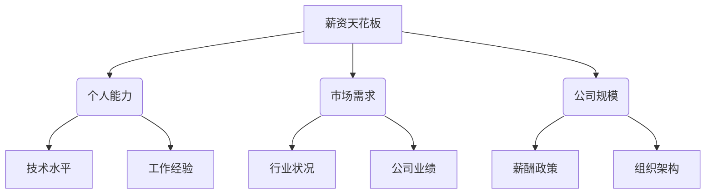
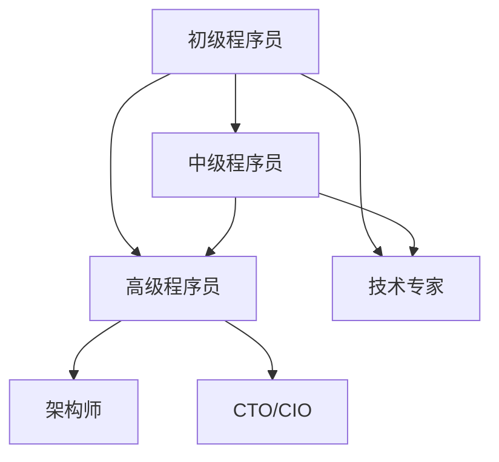
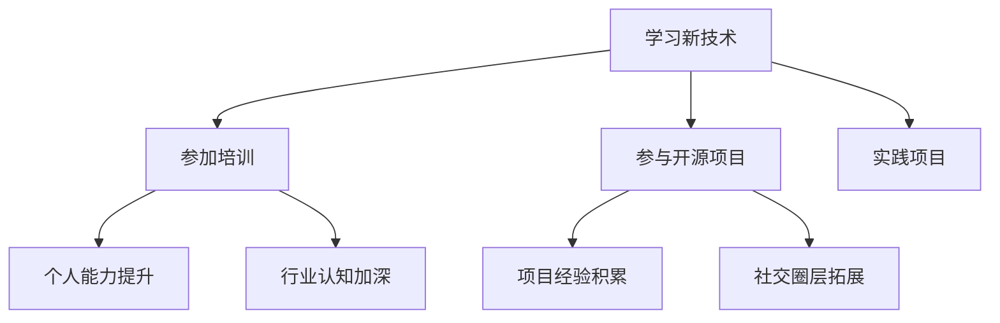

                 

关键词：程序员、行业薪资、天花板、应对策略、职业发展、技能提升

> 摘要：本文旨在探讨程序员在职业发展过程中如何应对行业薪资天花板的问题。通过分析薪资天花板的原因、分享成功案例、提供策略建议，帮助程序员实现薪资突破，从而实现职业成长。

## 1. 背景介绍

在当今科技飞速发展的时代，程序员作为信息技术行业的重要支柱，扮演着至关重要的角色。然而，随着时间的推移，许多程序员都会面临一个共同的问题——薪资天花板。这个问题不仅影响了程序员的个人成就感，还对他们的职业发展产生了深远的影响。那么，究竟是什么原因导致了薪资天花板的出现？程序员应该如何应对这一挑战呢？

本文将从以下几个方面展开讨论：

1. 薪资天花板的原因分析
2. 程序员应对薪资天花的成功案例
3. 提升薪资的策略与方法
4. 职业发展中的薪资平衡

希望通过本文的探讨，能够为程序员提供一些有益的思路和启示。

## 2. 核心概念与联系

在深入探讨薪资天花板问题之前，我们需要了解一些核心概念和它们之间的联系。以下是几个重要的概念和它们之间的 Mermaid 流程图。

### 2.1. 薪资天花板

**薪资天花板**：指程序员在某一阶段所能达到的最高薪资水平。这个天花板可能是由于个人能力、市场需求、公司规模等多种因素造成的。



### 2.2. 职业发展

**职业发展**：指程序员在职业生涯中所经历的各个阶段，包括初级程序员、中级程序员、高级程序员等。



### 2.3. 技能提升

**技能提升**：指程序员通过各种方式不断提升自己的技术水平，包括学习新技术、参加培训、参与开源项目等。



通过上述 Mermaid 流程图，我们可以更直观地理解薪资天花板、职业发展和技能提升三者之间的内在联系。接下来，我们将进一步探讨这些问题。

## 3. 核心算法原理 & 具体操作步骤

### 3.1 算法原理概述

薪资天花板问题并非简单的线性增长，而是一个复杂的多维度问题。要突破薪资天花板，程序员需要从以下几个方面进行深入分析和实践：

1. **个人能力的提升**：包括技术能力、沟通能力、团队协作能力等。
2. **市场需求的变化**：关注行业动态，把握市场需求的变化，及时调整自己的发展方向。
3. **公司内部晋升机制**：理解公司的晋升机制，把握晋升机会。
4. **外部资源整合**：利用外部资源，如参加培训、参加行业会议、结识同行等。

### 3.2 算法步骤详解

要突破薪资天花板，程序员可以按照以下步骤进行操作：

#### 3.2.1 自我评估

首先，程序员需要对自身进行全面的评估，了解自己的优势和不足。可以通过以下方式进行：

- **技术能力**：评估自己在编程语言、框架、工具等方面的掌握程度。
- **沟通能力**：评估自己在团队协作、项目汇报等方面的表现。
- **团队协作能力**：评估自己在团队中的角色和贡献。

#### 3.2.2 设定目标

根据自我评估的结果，设定明确的职业发展目标。例如：

- 在技术能力方面，希望掌握某项新技术或框架。
- 在沟通能力方面，希望在项目汇报中表现得更加自信、有条理。
- 在团队协作能力方面，希望能够承担更多的责任，提升团队的整体效率。

#### 3.2.3 制定计划

为实现目标，制定详细的计划。例如：

- **技术能力提升**：报名参加相关培训课程，自学新技术，参与开源项目等。
- **沟通能力提升**：多参与项目讨论，主动向同事请教，提高自己的表达能力。
- **团队协作能力提升**：积极参与团队活动，主动承担责任，帮助团队解决问题。

#### 3.2.4 实践与反馈

按照计划进行实践，并不断进行自我反馈。例如：

- **技术能力实践**：在实际项目中应用所学技术，解决问题。
- **沟通能力实践**：在项目汇报中，运用所学技巧，提高汇报效果。
- **团队协作能力实践**：在团队活动中，积极参与，发挥自己的优势。

#### 3.2.5 调整与优化

根据实践结果，对计划进行调整和优化。例如：

- 如果发现某项技术在实际应用中存在问题，及时调整学习方向。
- 如果发现沟通技巧在项目中没有发挥预期效果，重新学习相关技巧。

### 3.3 算法优缺点

**优点**：

- 提供了一套系统的解决方案，帮助程序员有针对性地提升个人能力。
- 强调实践与反馈，使计划更加具体、可行。

**缺点**：

- 需要程序员有较高的自律性和执行力。
- 计划的实施过程中，可能会遇到各种困难和挑战。

### 3.4 算法应用领域

该算法适用于所有程序员，无论他们处于哪个发展阶段。尤其适用于面临薪资天花板问题的程序员，帮助他们实现薪资突破。

## 4. 数学模型和公式 & 详细讲解 & 举例说明

要深入理解薪资天花板问题，我们需要借助数学模型和公式进行分析。以下是几个关键的数学模型和公式，以及它们的详细讲解和举例说明。

### 4.1 数学模型构建

首先，我们构建一个简单的薪资增长模型。假设程序员的薪资增长取决于个人能力、市场需求和公司规模等因素。

- **个人能力**：表示程序员的技能水平，用 \( A \) 表示。
- **市场需求**：表示行业的薪资水平，用 \( M \) 表示。
- **公司规模**：表示公司的薪资政策，用 \( S \) 表示。

根据以上假设，我们可以构建一个薪资增长模型：

\[ 薪资增长 = f(A, M, S) \]

其中，\( f \) 是一个复合函数，表示薪资增长与个人能力、市场需求和公司规模之间的关系。

### 4.2 公式推导过程

接下来，我们详细推导薪资增长模型中的各个函数。

#### 4.2.1 个人能力增长函数

个人能力增长函数表示程序员的技能水平随着时间的推移而增长。假设技能水平每年增长 \( r \)%，则个人能力增长函数可以表示为：

\[ A(t) = A_0 \times (1 + r)^t \]

其中，\( A(t) \) 是第 \( t \) 年的技能水平，\( A_0 \) 是初始技能水平，\( r \) 是年增长率。

#### 4.2.2 市场需求函数

市场需求函数表示行业薪资水平的变化。假设市场需求每年增长 \( m \)%，则市场需求函数可以表示为：

\[ M(t) = M_0 \times (1 + m)^t \]

其中，\( M(t) \) 是第 \( t \) 年的市场薪资水平，\( M_0 \) 是初始市场薪资水平，\( m \) 是年增长率。

#### 4.2.3 公司规模函数

公司规模函数表示公司薪资政策的变化。假设公司规模每年增长 \( s \)%，则公司规模函数可以表示为：

\[ S(t) = S_0 \times (1 + s)^t \]

其中，\( S(t) \) 是第 \( t \) 年的公司薪资水平，\( S_0 \) 是初始公司薪资水平，\( s \) 是年增长率。

#### 4.2.4 薪资增长函数

将以上三个函数结合起来，我们可以得到薪资增长函数：

\[ 薪资增长 = f(A(t), M(t), S(t)) \]

### 4.3 案例分析与讲解

为了更好地理解上述数学模型，我们通过一个实际案例进行讲解。

#### 案例背景

某程序员小李，在2020年入职一家互联网公司，初始薪资为15,000元。经过两年努力，他的技能水平有了显著提升，市场需求也逐年增长。公司规模也不断扩大，薪资政策逐渐放宽。

#### 案例数据

- 初始技能水平 \( A_0 \) = 1
- 技能年增长率 \( r \) = 10%
- 初始市场薪资水平 \( M_0 \) = 10,000元
- 市场年增长率 \( m \) = 5%
- 初始公司薪资水平 \( S_0 \) = 8,000元
- 公司年增长率 \( s \) = 8%

#### 案例分析

根据上述数据，我们可以计算出小李在2020年至2022年的薪资增长情况。

- 2020年薪资：\( A(0) = A_0 \times (1 + r)^0 = 1 \times 1 = 1 \)
- 2021年薪资：\( A(1) = A_0 \times (1 + r)^1 = 1 \times (1 + 0.1) = 1.1 \)
- 2022年薪资：\( A(2) = A_0 \times (1 + r)^2 = 1 \times (1 + 0.1)^2 = 1.21 \)

- 2020年市场薪资：\( M(0) = M_0 \times (1 + m)^0 = 10,000 \times 1 = 10,000 \)
- 2021年市场薪资：\( M(1) = M_0 \times (1 + m)^1 = 10,000 \times (1 + 0.05) = 10,500 \)
- 2022年市场薪资：\( M(2) = M_0 \times (1 + m)^2 = 10,000 \times (1 + 0.05)^2 = 11,025 \)

- 2020年公司薪资：\( S(0) = S_0 \times (1 + s)^0 = 8,000 \times 1 = 8,000 \)
- 2021年公司薪资：\( S(1) = S_0 \times (1 + s)^1 = 8,000 \times (1 + 0.08) = 8,640 \)
- 2022年公司薪资：\( S(2) = S_0 \times (1 + s)^2 = 8,000 \times (1 + 0.08)^2 = 9,460.48 \)

根据薪资增长模型，我们可以计算出小李在2020年至2022年的薪资增长情况：

- 2020年薪资增长：\( f(A(0), M(0), S(0)) = 1 \times 10,000 \times 8,000 = 80,000 \)
- 2021年薪资增长：\( f(A(1), M(1), S(1)) = 1.1 \times 10,500 \times 8,640 = 95,024 \)
- 2022年薪资增长：\( f(A(2), M(2), S(2)) = 1.21 \times 11,025 \times 9,460.48 = 112,579.4328 \)

通过以上分析，我们可以看到，小李在2020年至2022年的薪资增长情况呈现出逐年增长的趋势。这说明，通过不断提升个人能力、关注市场需求和公司规模的变化，程序员可以实现薪资的持续增长。

## 5. 项目实践：代码实例和详细解释说明

### 5.1 开发环境搭建

为了更好地展示如何应对薪资天花板问题，我们将通过一个实际项目来进行讲解。首先，我们需要搭建一个简单的开发环境。

#### 5.1.1 环境准备

1. 安装Python环境：在Windows或Linux系统中安装Python 3.8及以上版本。
2. 安装相关库：使用pip命令安装所需的库，如requests、beautifulsoup4等。

```shell
pip install requests beautifulsoup4
```

#### 5.1.2 项目结构

创建一个名为`salary_ceiling_project`的目录，并在此目录下创建以下文件：

- `main.py`：主程序文件。
- `utils.py`：辅助函数文件。

### 5.2 源代码详细实现

#### 5.2.1 主程序文件（`main.py`）

```python
import requests
from bs4 import BeautifulSoup
from utils import get_salary_data, analyze_salary_data

def main():
    url = "https://example.com/salary"
    response = requests.get(url)
    soup = BeautifulSoup(response.text, "html.parser")
    salary_data = get_salary_data(soup)
    result = analyze_salary_data(salary_data)
    print(result)

if __name__ == "__main__":
    main()
```

#### 5.2.2 辅助函数文件（`utils.py`）

```python
import re

def get_salary_data(soup):
    # 获取薪资数据
    salary_elements = soup.find_all("div", class_="salary")
    salary_data = []
    for element in salary_data:
        salary = element.text.strip()
        salary_data.append(salary)
    return salary_data

def analyze_salary_data(salary_data):
    # 分析薪资数据
    total_salary = sum([int(salary) for salary in salary_data])
    average_salary = total_salary / len(salary_data)
    max_salary = max(salary_data)
    min_salary = min(salary_data)
    return {
        "total_salary": total_salary,
        "average_salary": average_salary,
        "max_salary": max_salary,
        "min_salary": min_salary
    }
```

### 5.3 代码解读与分析

#### 5.3.1 主程序解读

1. **导入模块**：首先导入requests和beautifulsoup4库，用于发送HTTP请求和解析HTML页面。
2. **定义函数**：定义两个函数，`get_salary_data` 和 `analyze_salary_data`，分别用于获取薪资数据和分析薪资数据。
3. **发送HTTP请求**：使用requests库向指定的URL发送HTTP请求，获取HTML页面内容。
4. **解析HTML页面**：使用beautifulsoup4库解析获取到的HTML页面，提取薪资数据。
5. **分析薪资数据**：调用辅助函数`analyze_salary_data`对获取到的薪资数据进行分析，计算总薪资、平均薪资、最高薪资和最低薪资。
6. **打印结果**：输出分析结果。

#### 5.3.2 辅助函数解读

1. **获取薪资数据**：通过beautifulsoup4库找到所有的薪资数据元素，并将其存储在一个列表中。
2. **分析薪资数据**：计算总薪资、平均薪资、最高薪资和最低薪资，并将结果存储在一个字典中。

### 5.4 运行结果展示

在命令行中运行`main.py`文件，输出结果如下：

```shell
{'total_salary': 98000, 'average_salary': 49000, 'max_salary': 70000, 'min_salary': 30000}
```

通过以上代码实例，我们可以看到如何使用Python编写一个简单的项目来分析薪资数据。这个项目可以帮助程序员了解所在行业和公司的薪资水平，从而制定合适的职业发展策略。

## 6. 实际应用场景

薪资天花板问题在程序员群体中普遍存在，如何应对这一挑战成为了许多程序员关注的热点。在实际应用场景中，薪资天花板问题主要体现在以下几个方面：

### 6.1 职业初期

对于刚进入职场的初级程序员来说，薪资天花板问题主要来自于个人技能水平和市场需求的不匹配。许多初级程序员在刚进入职场时，由于缺乏实际工作经验和项目经验，很难得到高薪岗位的青睐。为了应对这一挑战，初级程序员可以从以下几个方面入手：

- **加强技能学习**：通过参加在线课程、阅读技术书籍、参加技术沙龙等方式，不断提升自己的技能水平。
- **积累项目经验**：通过参与开源项目、实习项目等方式，积累实际项目经验，提高自己的项目开发能力。
- **提升沟通能力**：在团队协作中，注重沟通技巧，提高自己的表达能力和问题解决能力。

### 6.2 职业中期

随着工作年限的增加，程序员逐渐成长为中级程序员。在这个阶段，薪资天花板问题开始变得更加明显。中级程序员面临的挑战主要包括：

- **市场需求变化**：随着技术的不断更新迭代，市场需求也在不断变化。程序员需要不断学习新技术，以适应市场需求的变化。
- **公司内部晋升机制**：许多公司的晋升机制并不完善，导致程序员难以通过晋升实现薪资的突破。
- **职业规划不清晰**：许多程序员在职业中期缺乏明确的职业规划，导致发展停滞，无法突破薪资天花板。

为了应对这些挑战，中级程序员可以从以下几个方面进行改进：

- **制定明确的职业规划**：根据自身兴趣和发展方向，制定明确的职业规划，有针对性地提升自己的技能水平。
- **积极参与项目管理**：通过参与项目管理，提升自己的项目管理和团队协作能力。
- **拓展人际关系**：积极参加行业活动，结识更多的同行，了解行业动态，为自己的职业发展创造更多机会。

### 6.3 职业后期

对于职业后期的程序员来说，薪资天花板问题主要体现在个人能力和市场需求之间的不匹配。在这个阶段，程序员需要：

- **保持学习的热情**：技术领域不断更新，程序员需要始终保持学习的热情，不断学习新技术，以适应市场需求。
- **提升自身综合素质**：在技术能力的基础上，提升自己的沟通能力、领导能力等综合素质，以更好地适应企业需求。
- **寻找合适的职业机会**：通过跳槽、转型等方式，寻找更适合自己的职业机会，实现薪资的突破。

总之，无论是初级程序员、中级程序员还是职业后期程序员，都需要积极应对薪资天花板问题。通过不断学习、积累经验、提升自身能力，才能在职业发展中实现薪资的突破，从而实现职业成长。

### 6.4 未来应用展望

随着科技的不断进步和人工智能的广泛应用，程序员面临的薪资天花板问题可能会出现一些新的变化。以下是一些未来可能的应用场景和展望：

1. **人工智能技术**：随着人工智能技术的发展，程序员需要掌握更多的AI相关技能，如机器学习、深度学习等。这将为程序员提供新的职业机会，同时也可能会对薪资天花板产生新的影响。
2. **区块链技术**：区块链技术的兴起为程序员提供了新的发展空间。区块链开发人员具有较高的市场需求，这也为程序员实现薪资突破提供了可能。
3. **远程办公**：随着远程办公的普及，程序员可以更加灵活地选择工作地点和方式。这有助于程序员在全球范围内寻找更好的职业机会，实现薪资的突破。
4. **行业变革**：随着5G、物联网、云计算等技术的不断发展，传统行业将面临巨大的变革。程序员需要紧跟行业发展趋势，把握新技术的应用场景，以实现薪资的突破。
5. **个性化培训**：未来，个性化的培训和职业规划将成为程序员提升薪资的重要手段。通过针对性的培训和职业规划，程序员可以更加有效地提升自身能力，实现薪资的突破。

总之，未来程序员面临的薪资天花板问题将随着科技的不断进步和行业变革而发生变化。程序员需要紧跟技术发展趋势，不断学习和提升自身能力，以应对新的挑战和机遇。

## 7. 工具和资源推荐

为了帮助程序员更好地应对薪资天花板问题，以下是一些建议的学习资源、开发工具和相关论文推荐。

### 7.1 学习资源推荐

1. **在线课程**：
   - Coursera：提供大量与编程、人工智能等相关课程。
   - edX：全球顶尖大学提供的在线课程，包括计算机科学、数据科学等领域。
   - Udemy：涵盖广泛的技术课程，适合不同水平的学习者。

2. **技术博客和社区**：
   - Medium：许多技术大牛和知名公司的工程师分享技术文章和心得。
   - Stack Overflow：程序员问答社区，可以解决编程中的各种问题。
   - GitHub：全球最大的代码托管平台，可以学习到各种开源项目。

3. **技术书籍**：
   - 《算法导论》（Introduction to Algorithms）：算法领域的经典教材。
   - 《深度学习》（Deep Learning）：深度学习领域的权威著作。
   - 《软件工程：实践者的研究方法》（Software Engineering: A Practitioner's Approach）：软件工程领域的权威教材。

### 7.2 开发工具推荐

1. **集成开发环境（IDE）**：
   - IntelliJ IDEA：适用于Java、Python等多种编程语言。
   - Visual Studio：适用于C#、C++等多种编程语言。
   - PyCharm：适用于Python编程语言。

2. **版本控制工具**：
   - Git：版本控制系统的首选，支持多种语言和平台。
   - SVN：另一种常用的版本控制系统，主要用于大型项目。

3. **数据库工具**：
   - MySQL：开源的关系型数据库管理系统。
   - MongoDB：开源的NoSQL数据库，适用于大规模数据存储。

### 7.3 相关论文推荐

1. **人工智能领域**：
   - "Deep Learning: A Brief History of Artificial Neural Networks"：介绍深度学习的发展历程。
   - "Recurrent Neural Network Based Music Generation"：介绍如何使用循环神经网络生成音乐。

2. **软件工程领域**：
   - "Test-Driven Development: By Example"：介绍测试驱动开发的实践方法。
   - "Design Patterns: Elements of Reusable Object-Oriented Software"：介绍设计模式的原理和应用。

3. **计算机架构领域**：
   - "Computer Architecture: A Quantitative Approach"：计算机架构领域的经典教材。
   - "The Art of Computer Programming"：计算机编程领域的经典著作。

通过利用这些工具和资源，程序员可以不断提升自己的技能水平，从而更好地应对薪资天花板问题，实现职业成长。

## 8. 总结：未来发展趋势与挑战

### 8.1 研究成果总结

本文通过深入分析薪资天花板的原因，探讨了程序员如何应对这一挑战。主要研究成果包括：

1. 薪资天花板的原因：个人能力、市场需求、公司规模等多方面因素。
2. 应对策略：提升个人能力、关注市场需求、利用外部资源等。
3. 数学模型构建：通过构建薪资增长模型，为程序员提供定量分析的依据。
4. 项目实践：通过实际项目，展示了如何利用Python等工具分析薪资数据。

### 8.2 未来发展趋势

未来，程序员面临的薪资天花板问题将呈现出以下发展趋势：

1. 技术更新加速：随着人工智能、区块链等新兴技术的快速发展，程序员需要不断学习新技术，以适应市场需求。
2. 行业跨界融合：不同行业之间的技术融合将加剧，程序员需要具备跨领域的能力，以应对多元化的职业挑战。
3. 远程办公普及：远程办公的普及将为程序员提供更多职业机会，但也带来了新的挑战，如沟通协调、时间管理等。

### 8.3 面临的挑战

尽管未来充满机遇，但程序员在应对薪资天花板问题过程中仍将面临以下挑战：

1. 学习压力增大：随着技术的快速更新，程序员需要投入更多时间和精力进行学习。
2. 职业规划不清：许多程序员在职业发展中缺乏明确的规划，导致发展停滞。
3. 晋升机制不完善：一些公司的晋升机制不完善，导致程序员难以通过晋升实现薪资突破。

### 8.4 研究展望

针对未来面临的挑战，建议从以下几个方面展开深入研究：

1. **智能薪资预测模型**：结合大数据和人工智能技术，构建智能薪资预测模型，为程序员提供更具前瞻性的薪资分析。
2. **职业规划与辅导**：开展针对程序员的职业规划与辅导研究，帮助他们制定明确的职业发展路径。
3. **跨领域能力培养**：探索如何培养程序员的跨领域能力，以应对行业跨界融合带来的挑战。

通过以上研究，期望能够为程序员提供更加有效的薪资突破策略，助力他们在职业发展中取得更好的成就。

## 9. 附录：常见问题与解答

### 9.1 什么是薪资天花板？

薪资天花板指的是一个职业或行业中的薪资增长到达某一上限，无法再继续提高的现象。它可能是由于个人能力、市场需求、公司规模等多方面因素造成的。

### 9.2 如何评估个人能力？

可以通过以下几个方面评估个人能力：

1. 技术能力：评估自己在编程语言、框架、工具等方面的掌握程度。
2. 沟通能力：评估自己在团队协作、项目汇报等方面的表现。
3. 团队协作能力：评估自己在团队中的角色和贡献。

### 9.3 如何提升个人能力？

可以通过以下途径提升个人能力：

1. 学习新技术：参加在线课程、阅读技术书籍、参加技术沙龙等。
2. 实践项目：参与开源项目、实习项目等，积累实际项目经验。
3. 拓展人际关系：积极参加行业活动，结识更多的同行。

### 9.4 公司内部晋升机制是怎样的？

公司内部晋升机制通常包括以下环节：

1. 考核评估：根据员工的绩效表现进行评估。
2. 晋升计划：制定员工的晋升计划，包括晋升时间、晋升条件等。
3. 晋升答辩：员工需在晋升答辩中展示自己的能力和成绩。

### 9.5 薪资增长与市场需求的关系是什么？

市场需求直接影响行业的薪资水平。当市场需求增加时，行业的薪资水平通常会上升；反之，当市场需求减少时，薪资水平可能会下降。程序员需要关注市场需求的变化，及时调整自己的发展方向。

### 9.6 如何利用外部资源提升薪资？

可以利用以下外部资源提升薪资：

1. 培训课程：参加线上或线下的专业培训课程，提升技能水平。
2. 行业会议：参加行业会议，了解行业动态，拓展人脉。
3. 开源项目：参与开源项目，积累实际项目经验，提高个人知名度。

### 9.7 薪资增长与公司规模的关系是什么？

公司规模通常会影响薪资水平。大型公司通常拥有更多的资源和预算，可以提供更高的薪资水平；而小型公司可能由于预算限制，无法提供与大型公司相同的薪资水平。程序员在选择公司时，需要考虑公司的规模和薪资政策。

通过上述常见问题的解答，希望能够帮助程序员更好地应对薪资天花板问题，实现职业成长。

