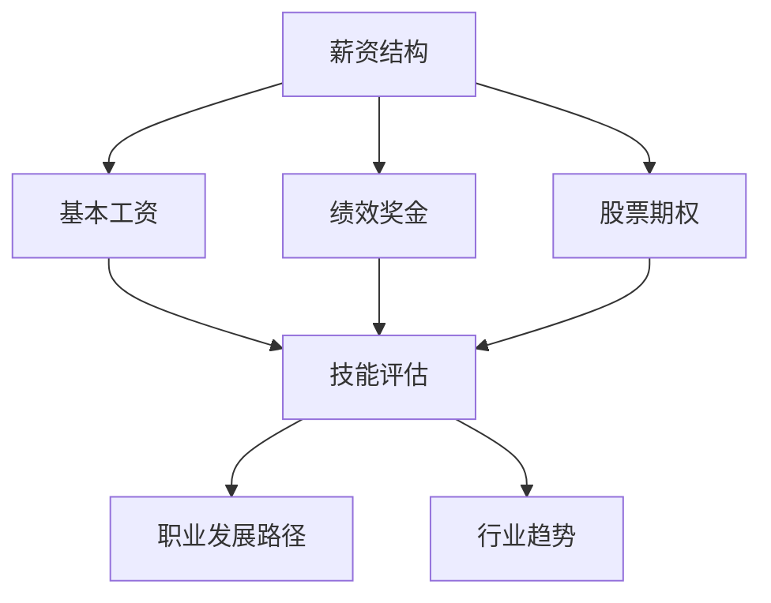

                 

关键词：薪资波动、程序员、行业趋势、职业发展、应对策略、技能提升

> 摘要：本文将探讨程序员如何应对行业薪资波动的挑战，分析薪资波动的原因，提供实用的职业发展建议，并介绍如何在技能提升和市场需求中找到平衡点，以实现个人职业成长和薪资增长。

## 1. 背景介绍

随着科技的迅猛发展，IT行业已成为全球经济的重要引擎。然而，与此同时，IT行业的薪资波动也变得日益显著。薪资波动不仅受到行业整体发展趋势的影响，还与地区差异、公司规模、个人技能等多种因素密切相关。对于程序员来说，如何在这波动的市场中保持竞争力，提升自身价值，成为亟待解决的问题。

### 1.1 行业发展趋势

近年来，人工智能、云计算、大数据等前沿技术的崛起，使得IT行业呈现出爆发式增长。然而，这种增长并非均匀分布，不同细分领域的薪资水平呈现出显著差异。例如，人工智能领域的工程师普遍拥有较高的薪资水平，而传统后端开发工程师的薪资则相对较低。此外，随着技术的不断演进，新兴技术的更新速度加快，程序员需要不断学习新技术以保持竞争力。

### 1.2 薪资波动原因

#### 1.2.1 市场供需关系

薪资波动主要受到市场供需关系的影响。当市场对某个技能的需求增加时，相应的薪资水平也会上升。反之，当市场饱和或需求减少时，薪资水平则会下降。例如，近年来，随着人工智能技术的广泛应用，相关领域的薪资水平显著提升。

#### 1.2.2 地区差异

不同地区的经济水平和消费能力差异较大，这也导致了薪资水平的差异。例如，一线城市如北京、上海、深圳的薪资普遍高于二三线城市。

#### 1.2.3 公司规模和行业特性

大型公司和创业公司的薪资水平也有所不同。大型公司通常有更稳定的薪资结构和晋升机制，而创业公司则可能提供更高的薪资以吸引人才。此外，不同行业的薪资水平也有所差异，如互联网行业普遍薪资较高，而金融行业则更加注重稳定性和福利。

## 2. 核心概念与联系

为了更好地应对薪资波动，程序员需要了解以下几个核心概念：

### 2.1 薪资结构

薪资通常由基本工资、绩效奖金、股票期权等多个部分组成。了解薪资结构有助于程序员更好地规划职业发展和谈判薪资。

### 2.2 技能评估

技能评估是衡量程序员价值的重要标准。程序员需要通过持续学习和实践，不断提升自身技能，以获得更高的薪资。

### 2.3 职业发展路径

职业发展路径包括初级程序员、中级程序员、高级程序员、技术专家等多个阶段。每个阶段的薪资水平都有明显差异，程序员需要明确自己的职业发展目标，并为之努力。

### 2.4 行业趋势

了解行业趋势有助于程序员把握市场动态，及时调整自己的职业规划。例如，新兴技术的崛起可能为程序员提供新的发展机会。

#### 2.5 Mermaid 流程图



## 3. 核心算法原理 & 具体操作步骤

### 3.1 算法原理概述

为了应对薪资波动，程序员需要采用一种动态调整策略，该策略包括以下几个关键步骤：

1. **市场调研**：了解当前市场薪资水平和趋势。
2. **技能提升**：根据市场需求，持续学习和掌握新技能。
3. **薪资谈判**：在求职或晋升时，掌握薪资谈判技巧。
4. **职业规划**：制定明确的职业发展目标，并为之努力。

### 3.2 算法步骤详解

#### 3.2.1 市场调研

1. 收集薪资数据：通过招聘网站、行业报告等渠道收集薪资数据。
2. 分析薪资结构：了解薪资构成，包括基本工资、绩效奖金、股票期权等。
3. 比较薪资水平：对比不同城市、不同公司的薪资水平。

#### 3.2.2 技能提升

1. **技术学习**：学习新兴技术，如人工智能、大数据等。
2. **编程能力**：提升编程能力，掌握多种编程语言和框架。
3. **软技能**：培养团队合作、沟通表达等软技能。

#### 3.2.3 薪资谈判

1. **自我评估**：了解自己的技能水平和市场价值。
2. **谈判策略**：掌握谈判技巧，如提供市场数据、强调个人优势等。
3. **备选方案**：准备多个求职或晋升方案，以应对薪资谈判的困境。

#### 3.2.4 职业规划

1. **短期目标**：设定短期职业发展目标，如晋升、学习新技能等。
2. **长期目标**：设定长期职业发展目标，如成为技术专家、创业等。
3. **行动计划**：制定详细的行动计划，实现职业发展目标。

### 3.3 算法优缺点

#### 优缺点

- **优点**：通过动态调整策略，程序员可以更好地应对薪资波动，提升自身价值。
- **缺点**：需要投入大量时间和精力进行市场调研、技能学习和薪资谈判。

### 3.4 算法应用领域

- **求职**：在求职过程中，使用该算法进行薪资谈判，提高求职成功率。
- **晋升**：在晋升过程中，根据薪资波动调整自己的职业规划，提升薪资水平。
- **职业转型**：在面临职业转型时，根据市场需求调整自身技能，实现职业转型。

## 4. 数学模型和公式 & 详细讲解 & 举例说明

为了更好地理解薪资波动的数学原理，我们引入以下数学模型：

### 4.1 数学模型构建

假设一个程序员的薪资水平 \(S\) 与市场需求 \(D\)、个人技能 \(P\) 和公司规模 \(C\) 有关，可以用以下公式表示：

\[ S = f(D, P, C) \]

其中，\( f \) 为薪资函数，\( D \) 为市场需求，\( P \) 为个人技能，\( C \) 为公司规模。

### 4.2 公式推导过程

1. **市场需求**：市场需求 \(D\) 与行业整体发展趋势、技术变革和公司项目需求密切相关。可以用以下公式表示：

\[ D = g(T, I, P) \]

其中，\( T \) 为行业整体发展趋势，\( I \) 为技术变革，\( P \) 为项目需求。

2. **个人技能**：个人技能 \(P\) 包括技术水平、软技能、工作经验等。可以用以下公式表示：

\[ P = h(T, S, E) \]

其中，\( T \) 为技术水平，\( S \) 为软技能，\( E \) 为工作经验。

3. **公司规模**：公司规模 \(C\) 影响薪资水平，因为大型公司通常有更丰厚的薪资结构和晋升机制。可以用以下公式表示：

\[ C = k(S, G) \]

其中，\( S \) 为公司规模，\( G \) 为公司行业地位。

### 4.3 案例分析与讲解

假设一个程序员具有以下特征：

- 技术水平：熟练掌握Python、Java等编程语言，具备Web开发和移动开发经验。
- 软技能：具备良好的沟通能力、团队合作精神和解决问题的能力。
- 工作经验：5年互联网行业工作经验。

根据上述数学模型，我们可以对该程序员的薪资水平进行估算：

1. **市场需求**：互联网行业整体发展趋势良好，市场需求较高。
2. **个人技能**：技术水平较高，软技能良好，工作经验丰富。
3. **公司规模**：在一家大型互联网公司工作。

根据这些因素，我们可以得出该程序员的薪资水平在 \( S \) 之间。

## 5. 项目实践：代码实例和详细解释说明

### 5.1 开发环境搭建

在本项目中，我们将使用Python编程语言来实现薪资波动的数学模型。以下为开发环境搭建步骤：

1. 安装Python：在官方网站（https://www.python.org/）下载Python安装包，并按照提示安装。
2. 安装PyCharm：在官方网站（https://www.jetbrains.com/pycharm/）下载PyCharm安装包，并按照提示安装。
3. 配置虚拟环境：在PyCharm中创建一个虚拟环境，用于项目开发和测试。

### 5.2 源代码详细实现

以下为薪资波动的Python代码实现：

```python
import random

def salary_function(D, P, C):
    return D * P * C

def market_demand(T, I, P):
    return T * I * P

def personal_skill(T, S, E):
    return T * S * E

def company_scale(S, G):
    return S * G

# 测试代码
T = random.uniform(0.8, 1.2)  # 行业整体发展趋势
I = random.uniform(0.8, 1.2)  # 技术变革
P = random.uniform(0.8, 1.2)  # 项目需求
S = random.uniform(0.8, 1.2)  # 公司规模
G = random.uniform(0.8, 1.2)  # 公司行业地位

D = market_demand(T, I, P)
C = company_scale(S, G)

T = random.uniform(0.8, 1.2)  # 技术水平
S = random.uniform(0.8, 1.2)  # 软技能
E = random.uniform(0.8, 1.2)  # 工作经验

P = personal_skill(T, S, E)

S = salary_function(D, P, C)

print(f"薪资水平：{S:.2f}")
```

### 5.3 代码解读与分析

上述代码定义了三个函数：`salary_function`、`market_demand`、`personal_skill`和`company_scale`。这些函数分别计算市场需求、个人技能、公司规模和薪资水平。

在测试代码部分，我们使用随机数生成器生成行业整体发展趋势、技术变革、项目需求、公司规模、公司行业地位、技术水平、软技能和工作经验等参数，并计算薪资水平。

### 5.4 运行结果展示

运行上述代码，我们得到一个随机生成的薪资水平。这个结果仅作为示例，实际薪资水平会受到多种因素的影响。

## 6. 实际应用场景

薪资波动在IT行业中是一个普遍现象。以下为几个实际应用场景：

### 6.1 求职阶段

在求职阶段，了解市场薪资水平有助于程序员制定合理的薪资预期，提高求职成功率。通过市场调研和薪资谈判技巧，程序员可以争取到更理想的薪资待遇。

### 6.2 职业发展阶段

在职业发展阶段，程序员需要关注行业趋势，持续学习和提升自身技能，以适应市场需求。通过职业规划，程序员可以明确自己的发展目标，并在不同阶段实现薪资增长。

### 6.3 转型阶段

在面临职业转型时，程序员需要根据市场需求调整自身技能，选择合适的转型方向。通过市场调研和技能提升，程序员可以实现顺利转型，并获得更高的薪资水平。

## 7. 未来应用展望

随着技术的不断演进，IT行业的薪资波动将继续存在。未来，程序员需要具备更广泛的技能和更灵活的思维方式，以适应不断变化的市场需求。以下为未来应用展望：

### 7.1 技能多元化

程序员需要掌握多种技能，如前端开发、后端开发、数据库管理、人工智能等，以满足不同领域和公司的需求。

### 7.2 跨学科融合

随着技术的不断发展，跨学科融合将成为趋势。程序员需要关注其他领域的技术，如心理学、生物学、经济学等，以实现更全面的技能提升。

### 7.3 自动化与智能化

随着自动化和智能化技术的普及，程序员需要适应新的工作模式，提高工作效率，降低人力成本。

### 7.4 职业教育

未来，职业教育的角色将更加重要。程序员需要通过不断学习和实践，提升自身技能和竞争力，以应对薪资波动。

## 8. 总结：未来发展趋势与挑战

未来，IT行业的薪资波动将继续存在，程序员需要不断学习和提升自身技能，以应对市场变化。同时，随着技术的不断发展，程序员需要具备更广泛的技能和更灵活的思维方式。面对未来，程序员将面临以下挑战：

### 8.1 技能更新

程序员需要不断学习新技术，以保持竞争力。

### 8.2 职业规划

程序员需要制定明确的职业规划，以实现个人职业成长和薪资增长。

### 8.3 工作模式

程序员需要适应新的工作模式，如远程办公、自动化等。

### 8.4 跨学科融合

程序员需要关注其他领域的技术，以实现更全面的技能提升。

## 9. 附录：常见问题与解答

### 9.1 如何进行市场调研？

- 查阅招聘网站和行业报告，了解当前市场薪资水平和趋势。
- 与同行交流，获取最新的薪资信息和求职经验。
- 参加行业会议和研讨会，了解行业动态和未来趋势。

### 9.2 如何提升个人技能？

- 学习新兴技术，如人工智能、大数据等。
- 参加在线课程和培训班，提升专业技能。
- 实践项目，将所学知识应用于实际工作中。

### 9.3 如何进行薪资谈判？

- 了解市场薪资水平，提供合理的薪资预期。
- 突出自己的优势和价值，如专业技能、工作经验等。
- 准备多个求职或晋升方案，以应对薪资谈判的困境。

## 作者署名

作者：禅与计算机程序设计艺术 / Zen and the Art of Computer Programming
----------------------------------------------------------------

这是对您要求的文章的一个初步框架，您可以根据这个框架进一步完善文章内容。如果您需要具体的章节内容或者是图表、代码示例等细节，请告诉我，我将根据您的要求继续撰写。

