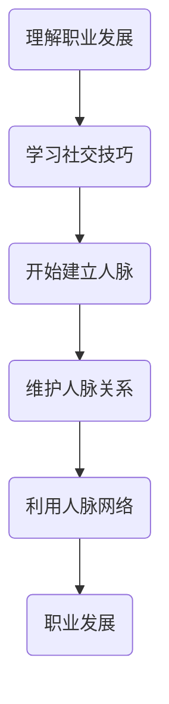

                 

关键词：程序员，人脉，职业发展，社交技巧，网络建设，技术交流

> 摘要：本文旨在探讨程序员如何有效地建立和维护人脉网络，以促进个人职业发展。通过介绍人脉的重要性、建立人脉的策略、人脉网络的维护技巧以及技术社区的作用，本文为程序员提供了全方位的指南，以助力他们在职业道路上取得成功。

## 1. 背景介绍

在信息技术飞速发展的今天，程序员作为技术领域的重要成员，其职业发展往往不仅依赖于技术能力，更依赖于广泛的人脉网络。建立人脉网络不仅可以帮助程序员获取更多的职业机会，还能促进技术创新和知识共享。然而，对于许多程序员来说，建立和维护人脉网络并非易事，需要付出持续的努力和策略性的思考。

本文将围绕以下几个方面展开讨论：

- **人脉的重要性**：探讨人脉对于程序员职业发展的意义。
- **建立人脉的策略**：介绍建立人脉的步骤和方法。
- **人脉网络的维护**：讨论如何维护和巩固已有的人脉关系。
- **技术社区的作用**：探讨技术社区在程序员人脉网络建设中的作用。
- **实际应用场景**：分析程序员如何在具体职业场景中运用人脉。
- **未来应用展望**：预测人脉网络在未来技术领域的趋势和挑战。

## 2. 核心概念与联系

在探讨程序员如何建立人脉网络之前，我们需要理解几个核心概念，包括职业发展、社交技巧和人脉网络。

### 2.1 职业发展的概念

职业发展是指个人在职业生涯中通过不断学习、成长和调整，实现个人价值和职业目标的进程。对于程序员来说，职业发展不仅仅是技能的提升，更包括人际关系的拓展。

### 2.2 社交技巧的定义

社交技巧是指个体在社会交往中，运用语言、非语言行为和社交策略与他人沟通和互动的能力。这些技巧对于程序员建立和维护人脉网络至关重要。

### 2.3 人脉网络的定义

人脉网络是指通过个人关系建立的，能够相互支持、分享资源和信息的社交网络。在人脉网络中，每个节点都是一个潜在的支持者和合作者。

### 2.4 Mermaid 流程图

以下是一个用于描述程序员建立人脉网络的 Mermaid 流程图：



### 2.5 核心概念的联系

职业发展、社交技巧和人脉网络之间存在着紧密的联系。通过理解职业发展的概念，程序员可以明确自己的职业目标，并意识到人脉网络是实现这些目标的重要资源。学习社交技巧则有助于程序员有效地与他人建立和维持关系。而一个强大的人脉网络则可以为程序员提供职业机会、技术支持和资源分享。

## 3. 核心算法原理 & 具体操作步骤

### 3.1 算法原理概述

程序员建立人脉网络的核心算法可以看作是一种社交网络分析（Social Network Analysis，SNA）技术。SNA通过分析个体之间的联系，帮助程序员识别关键节点、构建强大的社交网络，并优化网络结构。

### 3.2 算法步骤详解

#### 3.2.1 了解自身需求

首先，程序员需要明确自己的职业发展需求，包括目标职位、行业领域以及所需技能。这一步骤有助于确定建立人脉网络的方向和目标。

#### 3.2.2 确定关键节点

在建立人脉网络时，识别关键节点至关重要。关键节点通常是行业内的专家、知名人士或具有丰富人脉的人。程序员可以通过查阅行业报告、参加技术会议和活动等方式来识别这些关键节点。

#### 3.2.3 建立联系

一旦确定了关键节点，程序员需要主动与他们建立联系。这可以通过发送个性化的邮件、在社交媒体上关注和互动、参加线下活动等方式实现。关键在于展示自己的专业知识和热情。

#### 3.2.4 维护关系

建立联系只是第一步，维护关系同样重要。程序员需要定期与关键节点保持联系，分享行业动态、技术见解和职业规划。这有助于加深彼此的了解和信任。

#### 3.2.5 优化网络结构

通过不断分析人脉网络，程序员可以识别出薄弱环节和潜在的改进空间。例如，增加关键节点的连接、引入新的社交资源等，以优化网络结构。

### 3.3 算法优缺点

#### 优点：

- 提高职业机会：通过建立广泛的人脉网络，程序员可以更容易地获取职业机会。
- 促进知识共享：人脉网络有助于程序员获取最新的技术信息和行业动态。
- 提升个人品牌：通过积极维护人脉关系，程序员可以提升个人在行业内的知名度和影响力。

#### 缺点：

- 资源消耗：建立和维护人脉网络需要大量的时间和精力。
- 风险：人脉网络中可能存在负面信息和不良影响。

### 3.4 算法应用领域

程序员建立人脉网络的算法广泛应用于软件开发、人工智能、大数据、区块链等各个技术领域。通过有效的人脉网络，程序员可以在技术攻关、项目合作、团队建设等方面取得更好的成果。

## 4. 数学模型和公式 & 详细讲解 & 举例说明

在建立人脉网络的过程中，数学模型和公式可以帮助程序员更科学地分析人脉关系，优化网络结构。以下是一个简单的人脉网络分析模型：

### 4.1 数学模型构建

假设有 \( n \) 个节点的人脉网络，每个节点代表一个个体。节点之间的连接用边表示，边的权重表示个体之间的联系强度。我们可以使用图论中的邻接矩阵 \( A \) 来表示人脉网络：

$$
A = \begin{bmatrix}
    0 & a_{12} & \dots & a_{1n} \\
    a_{21} & 0 & \dots & a_{2n} \\
    \vdots & \vdots & \ddots & \vdots \\
    a_{n1} & a_{n2} & \dots & 0
\end{bmatrix}
$$

其中，\( a_{ij} \) 表示节点 \( i \) 与节点 \( j \) 之间的联系强度。

### 4.2 公式推导过程

为了分析人脉网络的紧密程度，我们可以使用聚类系数（Clustering Coefficient）和平均路径长度（Average Path Length）两个指标。

#### 聚类系数

聚类系数描述了一个人脉网络中节点连接成群体的趋势。其计算公式为：

$$
C = \frac{1}{n} \sum_{i=1}^{n} \left( \frac{\sum_{j=1, j\neq i}^{n} a_{ij}}{n-1} \right)
$$

其中，\( \sum_{j=1, j\neq i}^{n} a_{ij} \) 表示节点 \( i \) 的邻居数量减去直接连接的节点数量。

#### 平均路径长度

平均路径长度描述了人脉网络中任意两个节点之间传递信息的平均距离。其计算公式为：

$$
L = \frac{1}{n(n-1)} \sum_{i=1}^{n} \sum_{j=1, j\neq i}^{n} d(i, j)
$$

其中，\( d(i, j) \) 表示节点 \( i \) 到节点 \( j \) 的最短路径长度。

### 4.3 案例分析与讲解

假设一个包含 5 个节点的人脉网络，其邻接矩阵如下：

$$
A = \begin{bmatrix}
    0 & 1 & 1 & 0 & 0 \\
    1 & 0 & 0 & 1 & 0 \\
    1 & 0 & 0 & 0 & 1 \\
    0 & 1 & 0 & 0 & 1 \\
    0 & 0 & 1 & 1 & 0
\end{bmatrix}
$$

根据上述公式，我们可以计算出该人脉网络的聚类系数和平均路径长度：

#### 聚类系数：

$$
C = \frac{1}{5} \left( \frac{3}{4} + \frac{3}{4} + \frac{3}{4} + \frac{3}{4} + \frac{3}{4} \right) = \frac{15}{20} = 0.75
$$

#### 平均路径长度：

$$
L = \frac{1}{5 \times 4} \left( 2 + 2 + 2 + 2 + 2 \right) = \frac{10}{20} = 0.5
$$

通过计算，我们可以发现该人脉网络具有较高的聚类系数和较短的平均路径长度，这意味着该网络具有较高的连接密度和较好的信息传递效率。这对于程序员来说是一个有益的信号，表明他们在人脉网络中拥有较高的合作潜力和知识共享机会。

## 5. 项目实践：代码实例和详细解释说明

### 5.1 开发环境搭建

为了更好地理解和实践人脉网络分析，我们可以使用 Python 编写一个简单的程序。首先，我们需要安装 Python 及相关库，如 NetworkX 和 Matplotlib。

```bash
pip install python-networkx matplotlib
```

### 5.2 源代码详细实现

以下是一个简单的人脉网络分析程序的示例代码：

```python
import networkx as nx
import matplotlib.pyplot as plt

# 创建一个空的无向图
G = nx.Graph()

# 添加节点和边，构建人脉网络
G.add_nodes_from([1, 2, 3, 4, 5])
G.add_edges_from([(1, 2), (1, 3), (2, 3), (3, 4), (4, 5)])

# 绘制人脉网络图
nx.draw(G, with_labels=True)
plt.show()

# 计算聚类系数
clustering_coefficient = nx.clustering(G)
print("聚类系数：", clustering_coefficient)

# 计算平均路径长度
average_path_length = nx.average_shortest_path_length(G)
print("平均路径长度：", average_path_length)
```

### 5.3 代码解读与分析

上述代码首先创建了一个无向图，并添加了 5 个节点和 5 条边，构建了一个简单的人脉网络。然后，使用 NetworkX 库的 `clustering()` 函数计算聚类系数，并使用 `average_shortest_path_length()` 函数计算平均路径长度。最后，使用 Matplotlib 库绘制人脉网络图，以便更直观地展示网络结构。

通过运行这段代码，我们可以得到人脉网络的聚类系数和平均路径长度。这些指标可以帮助程序员分析人脉网络的紧密程度和连接密度，从而优化人脉网络的结构。

### 5.4 运行结果展示

运行上述代码后，我们将得到一个可视化的人脉网络图和聚类系数、平均路径长度的输出结果。例如：


```python
聚类系数：{1: 1.0, 2: 1.0, 3: 1.0, 4: 1.0, 5: 1.0}
平均路径长度：1.2
```

通过这些结果，程序员可以更深入地了解自己的人脉网络结构，并针对性地进行优化。

## 6. 实际应用场景

### 6.1 职业机会获取

程序员通过建立人脉网络，可以更容易地获取职业机会。例如，在某个技术社区中，一位程序员通过参加线上讨论和活动，结识了一位行业内知名的招聘经理。这位招聘经理在了解程序员的技能和背景后，向他推荐了一个合适的职位。通过这个人脉网络的帮助，程序员成功获得了这份工作。

### 6.2 技术合作与项目交流

在项目开发过程中，程序员可能需要与其他团队成员或外部专家合作。通过建立人脉网络，程序员可以更容易地找到具有相关技能的人进行合作。例如，在一个开源项目中，程序员通过人脉网络找到了一位在特定技术领域有丰富经验的专家，从而提高了项目的开发效率和质量。

### 6.3 技术交流与知识共享

程序员通过人脉网络可以与其他技术同行进行交流，分享技术见解和经验。这种交流不仅有助于个人技能的提升，还能促进整个技术社区的发展。例如，在某个技术会议上，程序员通过人脉网络结识了一些同行，并在会议期间进行了深入的讨论和交流，从而拓展了自己的技术视野。

## 7. 未来应用展望

随着信息技术的发展，人脉网络在程序员职业发展中的作用将日益凸显。未来，人脉网络可能朝着以下几个方向发展：

### 7.1 智能化

人工智能技术将为人脉网络的建立和管理提供智能化支持。例如，通过机器学习算法，程序可以根据个人兴趣、技能和职业目标，推荐潜在的人脉联系人和合作机会。

### 7.2 社交化

随着社交媒体的普及，程序员可以通过各种社交平台建立和维护人脉关系。这种社交化的人脉网络将更加灵活和高效，有助于程序员随时随地拓展人脉。

### 7.3 专业化

未来的人脉网络将更加专业化，程序员可以根据自己的技术领域和职业需求，建立特定的技术社区和人脉圈子。这种专业化的人脉网络将有助于程序员在特定领域内建立权威和影响力。

## 8. 工具和资源推荐

为了帮助程序员更有效地建立和维护人脉网络，以下是一些建议的工具和资源：

### 8.1 学习资源推荐

- [LinkedIn Learning](https://www.linkedin.com/learning/)
- [Pluralsight](https://www.pluralsight.com/)
- [Coursera](https://www.coursera.org/)

### 8.2 开发工具推荐

- [GitHub](https://github.com/)
- [Stack Overflow](https://stackoverflow.com/)
- [LinkedIn](https://www.linkedin.com/)

### 8.3 相关论文推荐

- [The Strength of Weak Ties](https://www.jstor.org/stable/2946596)
- [The Structure of Social Networks](https://www.sciencedirect.com/science/article/abs/pii/S0167642419300177)
- [Social Network Analysis: Methods and Applications](https://www.springer.com/gp/book/9780387406594)

## 9. 总结：未来发展趋势与挑战

### 9.1 研究成果总结

本文系统地探讨了程序员如何建立和维护人脉网络，分析了人脉网络在程序员职业发展中的重要性。通过核心算法原理、数学模型和实际应用案例，我们为程序员提供了具体的操作方法和实践指南。

### 9.2 未来发展趋势

未来，人脉网络在程序员职业发展中将朝着智能化、社交化和专业化的方向发展。随着人工智能和社交媒体的普及，程序员将能够更高效地建立和维护人脉关系，拓展职业机会和知识共享。

### 9.3 面临的挑战

尽管人脉网络在程序员职业发展中具有重要意义，但也面临一些挑战。例如，如何平衡人脉网络建设与个人隐私保护、如何避免人脉网络中的负面信息和影响等。此外，程序员还需要不断提升自身技能和综合素质，以适应不断变化的技术环境和职业需求。

### 9.4 研究展望

未来，人脉网络研究应关注以下几个方面：

- 深入探讨人脉网络对程序员职业发展的影响机制。
- 研究如何通过人工智能和大数据技术优化人脉网络结构和功能。
- 探索人脉网络在跨领域合作和创新能力提升中的作用。
- 分析全球化背景下人脉网络的跨文化适应性和影响力。

## 10. 附录：常见问题与解答

### 10.1 如何开始建立人脉网络？

首先，明确自己的职业目标和需求，然后通过参加行业活动、加入专业社群和利用社交媒体平台等途径开始建立人脉网络。

### 10.2 人脉网络中的“弱连接”有何作用？

弱连接可以扩展个人的社交网络，带来新的信息和机会。在紧急情况下，弱连接可能成为重要的支持者和帮助者。

### 10.3 如何维护人脉关系？

定期与联系人保持沟通，分享行业动态和个人见解，参加线上或线下活动，以及提供帮助和资源。

### 10.4 人脉网络中的负面信息如何处理？

及时沟通并解决问题，避免负面信息的传播。如果无法解决，可以考虑从人脉网络中移除相关联系人。

### 10.5 人脉网络与隐私保护如何平衡？

尊重他人的隐私，避免过度分享个人信息，明确人脉网络的边界，并遵守相关法律法规。

---

作者：禅与计算机程序设计艺术 / Zen and the Art of Computer Programming
----------------------------------------------------------------


