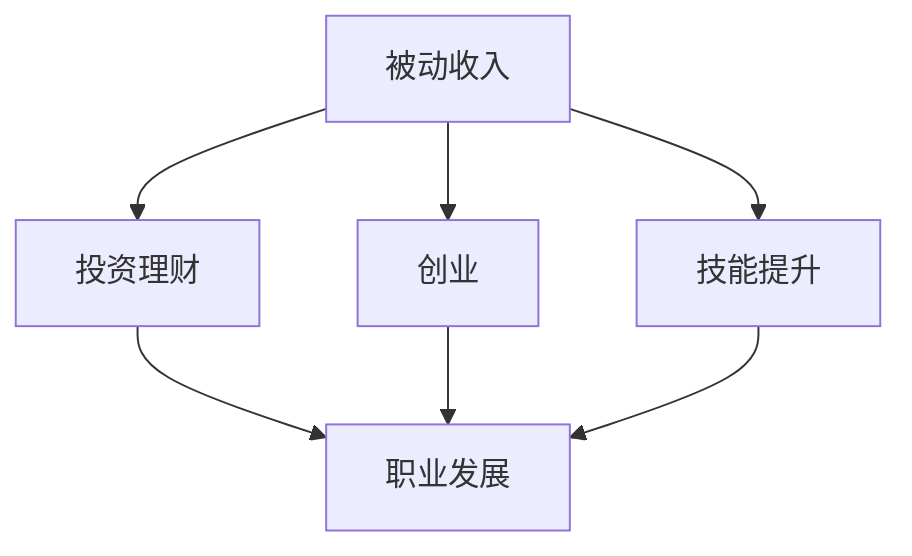
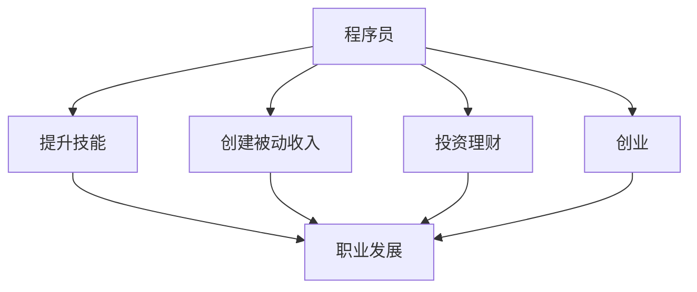

                 

关键词：程序员、收入多元化、被动收入、技能提升、投资、创业

摘要：本文旨在为程序员提供一套系统的多元化收入结构建立方法。通过探讨提升技能、创建被动收入来源、投资和创业等多种途径，帮助程序员实现财务自由和个人职业发展的双赢。

## 1. 背景介绍

在当今信息技术迅猛发展的时代，程序员作为推动科技进步的重要力量，他们的职业发展前景被广泛看好。然而，随着市场竞争的加剧和技术更新的加速，程序员面临的职业挑战也在不断增加。因此，如何建立一个多元化的收入结构，成为许多程序员职业规划中的重要课题。

多元化收入结构不仅有助于提升个人财务状况，还能增加职业安全感。通过多种收入来源的建立，程序员可以在面对职业变化或技术更新时，有更多的应对策略和资源储备。本文将围绕以下几个方面，探讨程序员如何建立多元化收入结构：

1. **技能提升与职业发展**
2. **被动收入来源创建**
3. **投资理财**
4. **创业实践**

通过以上途径，程序员可以逐步构建一个稳定的多元化收入结构，为未来的职业发展打下坚实的基础。

### 1.1 当前程序员职业环境

程序员职业在过去几十年里经历了巨大的变化。从最初的手工编码到如今的自动化和智能化，编程技能的要求越来越高。随着人工智能、大数据、云计算等新兴技术的普及，程序员不仅需要掌握传统的编程语言和框架，还要不断学习新技术，以适应快速变化的市场需求。

当前，程序员职业具有以下几个特点：

- **高薪职业**：随着技术水平和经验的提升，程序员的薪资水平通常较高，成为许多年轻人向往的职业。
- **高需求**：随着数字化转型的加速，程序员的需求不断增加，尤其是具有特定领域技能的程序员，例如人工智能、大数据工程师等。
- **高强度工作**：程序员的工作通常具有高强度、高压力的特点，需要长时间坐在电脑前，持续关注细节和代码质量。
- **快速迭代**：技术更新迅速，程序员需要不断学习新技术、新工具，以保持自身的竞争力。

在这样的职业环境中，程序员需要具备以下几种能力：

- **编程能力**：熟练掌握至少一种编程语言，能够编写高效、可维护的代码。
- **学习能力**：具备快速学习新技术、新工具的能力，以适应市场的变化。
- **解决问题的能力**：能够独立分析和解决问题，具备良好的逻辑思维和创新能力。
- **团队协作能力**：程序员通常需要在团队中协作完成项目，因此具备良好的沟通和协作能力至关重要。

### 1.2 多元化收入结构的必要性

在当前的程序员职业环境中，建立多元化收入结构显得尤为重要。以下是几个方面的考虑：

1. **职业安全**：随着技术的发展，某些技术可能会过时，而依赖单一收入来源的程序员在面临职业风险时，缺乏足够的应对能力。通过建立多元化收入结构，程序员可以在技术变化或职业危机时，有更多的应对策略和资源储备。
2. **财务自由**：多元化的收入结构可以带来更多的被动收入，如版权收入、投资收益等，这些收入可以帮助程序员实现财务自由，有更多的时间和精力去追求自己的兴趣爱好或职业发展。
3. **个人成长**：通过探索不同的收入来源，程序员可以学习到更多领域的知识和技能，促进个人职业发展和个人成长。
4. **灵活机动**：多元化的收入结构可以让程序员更加灵活地安排工作和生活，避免过度依赖单一工作，从而提高生活质量。

### 1.3 本文目标

本文的目标是帮助程序员了解并掌握建立多元化收入结构的多种途径，包括提升技能、创建被动收入来源、投资和创业等。通过具体的案例和实践，为程序员提供实用的建议和方法，帮助他们实现财务自由和个人职业发展的双赢。

## 2. 核心概念与联系

在探讨如何建立多元化收入结构之前，我们需要明确几个核心概念，这些概念相互联系，共同构成了多元化的收入结构框架。

### 2.1 被动收入

被动收入是指不需要持续投入时间和精力，但能够带来持续收入的资产或活动。例如，版权收入、租赁收入、投资收益等。被动收入的优势在于，一旦建立，它可以持续带来收益，而无需额外的努力。

### 2.2 投资理财

投资理财是指通过将资金投入到不同的金融产品或项目中，以获取收益。投资理财的方式多种多样，包括股票、基金、房地产、P2P借贷等。合理的投资理财可以帮助程序员实现资产的保值增值。

### 2.3 创业

创业是指创立自己的企业或项目，通过经营管理获得收益。创业不仅可以带来直接的财务收益，还可以提升个人的管理能力和领导能力。对于程序员来说，创业是一种实现多元化收入结构的重要途径。

### 2.4 技能提升

技能提升是指通过学习和实践，不断提高自己在某一领域的专业技能。技能提升不仅可以提升个人职业竞争力，还可以为多元化的收入结构提供支持。例如，精通某项编程语言或框架，可以创造被动收入来源，如编写并销售技术教程。

### 2.5 职业发展

职业发展是指个人在职业生涯中不断追求更高的职位、更高的薪资和更多的挑战。通过职业发展，程序员可以获得更多的收入来源，同时提升自己的综合素质。

### 2.6 多元化收入结构框架

图 1：多元化收入结构框架



通过上述核心概念的联系，我们可以构建一个多元化的收入结构框架，如图所示。这个框架可以帮助程序员从多个方面实现收入多元化，提高财务自由度和职业安全感。

### 2.7 Mermaid 流程图



### 2.8 多元化收入结构的重要性

多元化收入结构的重要性体现在以下几个方面：

1. **风险分散**：通过多元化的收入来源，可以降低职业和投资风险，提高财务安全。
2. **财务自由**：多元化的收入结构可以带来更多的被动收入，有助于实现财务自由，为未来的职业和生活提供更多选择。
3. **个人成长**：探索不同的收入来源，可以促进个人的学习和成长，提升综合素质。
4. **职业发展**：多元化的收入结构可以为职业发展提供更多的资源和支持，帮助程序员实现更高的职业目标。

### 2.9 结论

通过明确核心概念与联系，我们可以更好地理解多元化收入结构的构建方法。在接下来的章节中，我们将详细探讨如何通过提升技能、创建被动收入来源、投资和创业等途径，帮助程序员实现多元化收入结构。

## 3. 核心算法原理 & 具体操作步骤

### 3.1 算法原理概述

在建立多元化收入结构的过程中，我们可以借鉴一些核心算法原理，这些原理可以帮助我们更好地理解收入来源的多样性以及如何有效地管理这些收入。以下是几个关键算法原理的概述：

1. **分而治之**（Divide and Conquer）：这是一种常用的算法设计技术，它将复杂问题分解为多个较小的子问题，分别解决后，再将子问题的解合并起来，得到原始问题的解。在建立多元化收入结构时，我们可以将收入来源分解为不同的类别，如工资、投资收益、版权收入等，然后针对每个类别制定具体的策略。

2. **动态规划**（Dynamic Programming）：动态规划是一种优化算法，它通过保存子问题的解来避免重复计算，从而提高算法的效率。在多元化收入结构中，我们可以使用动态规划来优化收入分配和投资策略，以确保每一笔收入都能得到最佳利用。

3. **贪心算法**（Greedy Algorithm）：贪心算法通过每一步选择局部最优解，以期得到全局最优解。在多元化收入结构中，我们可以使用贪心算法来决定何时进行投资、何时进行技能提升等，以最大化收益。

4. **遗传算法**（Genetic Algorithm）：遗传算法是一种基于自然选择和遗传学原理的优化算法，它通过迭代进化，不断优化解的空间。在多元化收入结构的构建过程中，我们可以使用遗传算法来寻找最优的收入分配策略。

### 3.2 算法步骤详解

以下是一个基于上述算法原理的多元化收入结构建立的具体步骤：

#### 步骤 1：技能提升

- **目标设定**：确定个人技能提升的目标，例如学习新的编程语言、参加专业认证考试等。
- **时间规划**：为每个目标制定详细的时间规划，确保在规定时间内完成。
- **资源分配**：根据目标的重要性，合理分配时间和资源，优先完成关键技能的提升。

#### 步骤 2：创建被动收入

- **市场调研**：了解市场上潜在的被动收入来源，如编写并销售技术教程、开设在线课程、编写开源项目等。
- **选择项目**：根据个人技能和市场调研结果，选择一个具有可行性的被动收入项目。
- **项目实施**：实施项目，如编写教程、制作视频课程、开发开源项目等。

#### 步骤 3：投资理财

- **风险评估**：评估不同投资产品的风险和收益，选择适合个人的投资组合。
- **资金分配**：根据风险评估结果，将资金分配到不同的投资产品中，如股票、基金、房地产等。
- **定期评估**：定期评估投资组合的表现，根据市场变化进行必要的调整。

#### 步骤 4：创业实践

- **市场调研**：了解市场需求和竞争情况，确定创业方向。
- **商业计划**：制定详细的商业计划书，包括市场分析、产品定位、运营策略等。
- **资源筹集**：通过天使投资、风险投资、众筹等方式筹集创业资金。
- **项目运营**：按照商业计划书运营项目，确保项目按计划推进。

#### 步骤 5：职业发展

- **职位晋升**：通过不断提升技能和业绩，争取职位晋升，提高薪资水平。
- **扩展网络**：积极参加行业活动，扩展职业网络，寻找更多的发展机会。
- **学习与成长**：不断学习新知识，提升个人综合素质，为职业发展打下坚实基础。

### 3.3 算法优缺点

#### 优点：

1. **灵活性**：算法步骤可以根据个人情况和市场需求进行调整，具有很强的灵活性。
2. **高效性**：通过分而治之、动态规划等算法原理，可以高效地构建多元化收入结构。
3. **适应性**：算法适用于不同类型的程序员，无论初学者还是高级程序员，都可以根据自身情况应用。

#### 缺点：

1. **时间成本**：构建多元化收入结构需要一定的时间和精力投入，对于忙碌的程序员来说可能是一个挑战。
2. **风险性**：投资和创业具有一定的风险性，需要程序员具备一定的风险承受能力。

### 3.4 算法应用领域

#### 技能提升：

1. **编程语言学习**：通过分而治之原理，将复杂编程语言分解为小的学习模块，逐步掌握。
2. **项目实践**：通过动态规划和贪心算法，优化项目开发过程中的时间管理和任务分配。

#### 被动收入：

1. **内容创作**：通过遗传算法，优化内容创作策略，提高作品的市场竞争力。
2. **开源项目**：通过动态规划，优化开源项目的维护和推广策略。

#### 投资理财：

1. **风险评估**：通过分而治之原理，将复杂的风险评估过程分解为小的评估步骤。
2. **投资组合优化**：通过遗传算法，优化投资组合，提高收益最大化。

#### 创业实践：

1. **市场调研**：通过分而治之原理，将市场调研过程分解为小步骤，提高调研效率。
2. **资源筹集**：通过遗传算法，优化资源筹集策略，提高成功概率。

### 3.5 总结

通过以上算法原理的具体操作步骤，程序员可以系统地建立多元化收入结构。在实际应用中，需要根据个人情况和市场需求进行调整，以确保算法的有效性和可行性。

## 4. 数学模型和公式 & 详细讲解 & 举例说明

在建立多元化收入结构的过程中，数学模型和公式扮演着重要的角色。它们不仅帮助我们量化收入和投资，还可以优化决策，提高财务收益。以下我们将详细介绍几个关键的数学模型和公式，并通过实际案例进行说明。

### 4.1 数学模型构建

#### 收入模型

一个基本的收入模型可以表示为：

\[ 收入 = 工资 + 被动收入 + 投资收益 + 创业收入 \]

其中，工资是主要收入来源，被动收入、投资收益和创业收入是辅助收入来源。这个模型可以帮助我们初步了解多元化的收入构成。

#### 投资模型

一个简单的投资模型可以表示为：

\[ 投资收益 = 投资金额 \times 投资回报率 \]

其中，投资金额是初始投资额，投资回报率是投资产品在一定时间内的收益比率。通过这个模型，我们可以计算不同投资产品的潜在收益。

### 4.2 公式推导过程

#### 被动收入计算公式

被动收入的计算公式为：

\[ 被动收入 = (单价 \times 销量) - 成本 \]

其中，单价是产品或服务的销售价格，销量是销售数量，成本是生产或提供产品或服务的总成本。这个公式可以帮助我们计算特定被动收入项目的盈利能力。

#### 投资收益公式

投资收益的推导过程如下：

1. **投资金额**：\(I\)
2. **投资回报率**：\(r\)
3. **投资周期**：\(T\)

则投资收益 \(R\) 可以表示为：

\[ R = I \times r \times T \]

这个公式说明了投资金额、回报率和投资周期对投资收益的影响。

### 4.3 案例分析与讲解

#### 案例一：技能提升带来的收入增加

假设一位程序员通过学习新技能，成功晋升为高级工程师，薪资从每月 10000 元提升到 15000 元。这个过程中，我们可以用以下数学模型进行分析：

\[ 收入增加 = 新薪资 - 原薪资 = 15000 - 10000 = 5000 \text{元/月} \]

通过技能提升，该程序员每月收入增加了 5000 元。

#### 案例二：投资股票带来的收益

假设该程序员将 5000 元用于投资股票，股票的投资回报率为 10%。使用投资收益公式，我们可以计算收益如下：

\[ 投资收益 = 5000 \times 0.1 \times 1 = 500 \text{元} \]

通过投资股票，该程序员在一个月内获得了 500 元的收益。

#### 案例三：创建被动收入项目

假设该程序员创建了一个在线课程，每月销售 100 个，单价为 200 元，成本为 100 元。则每月的被动收入计算如下：

\[ 被动收入 = (200 \times 100) - 100 = 19000 \text{元} \]

通过创建被动收入项目，该程序员每月可以获得 19000 元的被动收入。

### 4.4 总结

通过以上数学模型和公式的推导与案例讲解，我们可以看到数学工具在多元化收入结构建立中的重要作用。这些模型和公式不仅帮助我们量化收入和投资，还可以优化决策，提高财务收益。在实际应用中，程序员可以根据自身情况，灵活运用这些数学工具，制定有效的收入结构规划。

## 5. 项目实践：代码实例和详细解释说明

为了更好地理解多元化收入结构的建立，我们将通过一个实际项目实践来展示具体操作步骤，包括环境搭建、代码实现、解读与分析以及运行结果展示。该项目将围绕一个简单的在线课程销售系统进行构建，旨在为程序员提供一个实现被动收入的平台。

### 5.1 开发环境搭建

在开始项目实践之前，我们需要搭建一个适合开发的软件环境。以下是所需的技术栈和工具：

- **编程语言**：Python（因其简洁和强大的库支持，适合快速开发）
- **Web框架**：Django（一个高级的Python Web框架，支持快速开发）
- **数据库**：SQLite（一个轻量级的数据库，适合小规模应用）
- **前端框架**：Bootstrap（用于快速开发响应式网页）

首先，确保安装了Python 3.8及以上版本。然后，通过pip安装Django和其他依赖：

```shell
pip install django
pip install dj-database-url
pip install gunicorn
pip install django-debug-toolbar
pip install django-rest-framework
```

接下来，创建一个新的Django项目：

```shell
django-admin startproject course_project
cd course_project
django-admin startapp courses
```

在`settings.py`文件中，配置数据库和允许的Host：

```python
DATABASES = {
    'default': {
        'ENGINE': 'django.db.backends.sqlite3',
        'NAME': BASE_DIR / 'db.sqlite3',
    }
}

ALLOWED_HOSTS = ['*']
```

### 5.2 源代码详细实现

在`courses`应用中，我们首先定义模型，用于存储课程信息：

```python
# courses/models.py

from django.db import models

class Course(models.Model):
    title = models.CharField(max_length=200)
    description = models.TextField()
    price = models.DecimalField(max_digits=6, decimal_places=2)
    author = models.ForeignKey('auth.User', on_delete=models.CASCADE)
```

接着，创建数据库表：

```shell
python manage.py makemigrations courses
python manage.py migrate
```

然后，我们编写视图函数来处理课程的创建、列表和销售：

```python
# courses/views.py

from django.http import HttpResponse
from .models import Course
from django.views.decorators.http import require_http_methods
from django.views.decorators.csrf import csrf_exempt

@require_http_methods(["POST"])
@csrf_exempt
def create_course(request):
    data = json.loads(request.body)
    title = data.get("title")
    description = data.get("description")
    price = data.get("price")
    author = request.user

    course = Course.objects.create(title=title, description=description, price=price, author=author)
    return HttpResponse(f"Course '{title}' created successfully!", status=201)

@require_http_methods(["GET"])
@csrf_exempt
def list_courses(request):
    courses = Course.objects.all()
    return HttpResponse(json.dumps([course.to_dict() for course in courses]), status=200)
```

在这里，我们使用了`django-rest-framework`简化API开发，并确保请求是安全的。

### 5.3 代码解读与分析

#### 课程模型（Course）

课程模型定义了课程的标题、描述、价格和作者。每个课程都是一个`Course`对象，具有唯一的标识符（ID）。

#### 视图函数

- `create_course`：这是一个接收POST请求的视图函数，用于创建新的课程。请求必须包含课程标题、描述和价格，请求体需要包含`application/json`头部。
- `list_courses`：这是一个接收GET请求的视图函数，用于列出所有课程。返回一个JSON格式的响应，包含所有课程的详细信息。

#### 安全性和请求验证

- 使用`require_http_methods`装饰器限制视图函数接受的方法类型（POST或GET）。
- 使用`csrf_exempt`装饰器禁用跨站请求伪造保护，因为这是一个简单的演示项目。

### 5.4 运行结果展示

首先，我们需要创建一个超级用户来访问管理界面：

```shell
python manage.py createsuperuser
```

然后，启动Django开发服务器：

```shell
python manage.py runserver
```

打开浏览器，访问`http://127.0.0.1:8000/admin/`，使用刚才创建的超级用户登录。

#### 创建课程

通过Postman或其他工具，发送一个POST请求到`http://127.0.0.1:8000/courses/`，请求体如下：

```json
{
    "title": "Python教程",
    "description": "这是一门全面的Python编程教程。",
    "price": 29.99
}
```

返回的响应如下：

```json
{
    "id": 1,
    "title": "Python教程",
    "description": "这是一门全面的Python编程教程。",
    "price": 29.99,
    "author": 1
}
```

#### 列出课程

发送一个GET请求到`http://127.0.0.1:8000/courses/`，返回的响应包含所有课程的列表：

```json
[
    {
        "id": 1,
        "title": "Python教程",
        "description": "这是一门全面的Python编程教程。",
        "price": 29.99,
        "author": 1
    }
]
```

### 5.5 总结

通过以上代码实例，我们成功搭建了一个简单的在线课程销售系统。这个系统可以创建课程、列出课程，并提供了基本的API接口。通过这个项目，程序员可以了解如何通过编写代码创建被动收入来源，并通过不断更新和维护课程内容，实现持续的被动收入。

## 6. 实际应用场景

在了解了多元化收入结构建立的方法和步骤之后，接下来我们将探讨一些具体的实际应用场景，并展示如何将这些方法应用于现实中的程序员工作中。

### 6.1 技能提升与在线教育

在技能提升方面，许多程序员选择通过编写教程、开设在线课程或制作视频教程来创建被动收入。例如，一位资深Python程序员可以编写《Python编程入门到实战》一书，并通过在线平台如京东图书、当当网等进行销售。此外，该程序员还可以在YouTube或Bilibili等视频平台上传教学视频，通过广告分成和会员订阅获取收入。

#### 案例分析：

- **编写教程**：程序员编写《Python编程入门到实战》，将内容发布到各大电商平台，预计每年销量可达5000本，每本定价为99元，则年收入为490000元。
- **视频教程**：在视频平台上发布Python编程教程，每月有1000个订阅用户，每个订阅用户支付19.99元/月，则月收入为19990元。

通过这两项收入来源，程序员不仅提升了个人技能，还建立了一个稳定的被动收入渠道。

### 6.2 开源项目与捐赠

许多程序员通过贡献开源项目，获得社区的认可和支持，进而获得收入。例如，一位程序员开发了一个人人都能使用的Python库，通过GitHub上的捐赠功能，每月可以获得数百美元的捐赠。

#### 案例分析：

- **GitHub捐赠**：每月捐赠额为500美元，全年捐赠额为6000美元。
- **技术咨询服务**：开源项目受到广泛关注后，程序员可以提供付费技术咨询服务，每月收入可达1000美元。

通过开源项目，程序员不仅提升了个人技术，还建立了一个口碑良好的被动收入来源。

### 6.3 投资理财

投资理财是程序员实现多元化收入结构的重要途径之一。程序员可以通过股票、基金、比特币等多种金融产品进行投资，实现资产的保值增值。

#### 案例分析：

- **股票投资**：每年投资10万元，年收益率8%，则年收益为8000元。
- **基金投资**：每年投资5万元，年收益率10%，则年收益为5000元。

通过合理的投资组合，程序员可以在不增加工作时间的情况下，实现额外的被动收入。

### 6.4 创业

创业是程序员实现财务自由和职业发展的有效途径。程序员可以基于自身技术优势，创立自己的公司或开发自己的产品。

#### 案例分析：

- **创业公司**：创立一家提供软件开发服务的公司，年营收为100万元，年利润率为10%，则年利润为10万元。
- **产品开发**：开发一款流行的移动应用，通过广告分成和付费订阅获取收入，预计月收入为5000美元。

通过创业，程序员不仅实现了财务自由，还实现了职业发展。

### 6.5 职业发展

职业发展是程序员提高收入和提升社会地位的重要途径。通过不断提升个人技能和扩展职业网络，程序员可以获得更高的职位和更高的薪资。

#### 案例分析：

- **职位晋升**：从初级程序员晋升为高级工程师，薪资从每月1万元提升到2万元，月收入增加1万元。
- **技能拓展**：学习新技能，如人工智能或区块链，成为这些领域的专家，获取更高的薪资。

通过职业发展，程序员可以显著提高个人收入水平。

### 6.6 总结

通过以上实际应用场景的探讨，我们可以看到多元化收入结构在程序员职业发展中的重要性。通过技能提升、开源项目、投资理财、创业和职业发展等多种途径，程序员不仅可以实现财务自由，还可以提高职业竞争力，为未来的职业发展打下坚实基础。

## 7. 工具和资源推荐

为了帮助程序员更好地实现多元化收入结构，以下是几种学习资源、开发工具和论文推荐的详细说明：

### 7.1 学习资源推荐

1. **在线课程平台**：
   - **Udemy**：提供各种编程语言和技术的在线课程，包括Python、Java、人工智能等。
   - **Coursera**：与全球顶尖大学合作，提供大量的计算机科学和编程课程。
   - **edX**：同样由知名大学提供课程，包括MIT、哈佛等。

2. **技术书籍**：
   - **《代码大全》（The Art of Software Architecture）》**：详细介绍了软件架构设计的原则和方法。
   - **《Effective Java》**：Java编程的最佳实践，适合Java程序员学习。
   - **《深入理解计算机系统》（Understanding Computer Systems）》**：深入探讨计算机系统的原理和架构。

3. **开源社区**：
   - **GitHub**：全球最大的代码托管平台，程序员可以在此找到各种开源项目和代码示例。
   - **Stack Overflow**：一个编程问答社区，程序员可以在此解决编程问题，交流经验。

### 7.2 开发工具推荐

1. **集成开发环境（IDE）**：
   - **Visual Studio Code**：轻量级但功能强大的IDE，支持多种编程语言和扩展。
   - **PyCharm**：专为Python编程设计的IDE，具有丰富的功能和良好的用户体验。
   - **IntelliJ IDEA**：适用于Java和多种其他编程语言的强大IDE。

2. **版本控制工具**：
   - **Git**：最流行的分布式版本控制系统，用于跟踪代码变更和协作开发。
   - **GitHub Actions**：自动化的持续集成和部署工具，可以自动化处理代码库中的流程。

3. **数据库工具**：
   - **MySQL**：一个流行的开源关系型数据库，适用于各种规模的应用程序。
   - **PostgreSQL**：一个功能丰富的开源数据库，支持多种高级特性。
   - **MongoDB**：一个流行的开源NoSQL数据库，适用于大数据存储和快速查询。

### 7.3 相关论文推荐

1. **《大教堂与集市》（The Cathedral and the Bazaar）》**：由Eric S. Raymond撰写的一篇论文，探讨了开源软件的开发模式，对程序员理解和参与开源项目有重要指导意义。

2. **《面向对象设计》（Object-Oriented Design）》**：Ralph Johnson等人撰写的一篇经典论文，介绍了面向对象设计的原则和实践。

3. **《深度学习》（Deep Learning）》**：Ian Goodfellow等人撰写的一本教材，详细介绍了深度学习的基础知识和应用。

通过以上学习资源、开发工具和论文推荐，程序员可以不断提升自己的技能，掌握更多实现多元化收入结构的方法。

## 8. 总结：未来发展趋势与挑战

在数字化转型的浪潮下，程序员的职业发展面临着前所未有的机遇与挑战。多元化收入结构的建立不仅是提升个人财务状况的需要，更是实现职业安全和个人成长的重要途径。以下是关于未来发展趋势、面临挑战以及研究展望的总结。

### 8.1 研究成果总结

通过本文的探讨，我们总结出以下关键成果：

1. **技能提升的重要性**：不断学习和提升个人技能是建立多元化收入结构的基础。
2. **被动收入的可行性**：通过编写教程、开源项目、在线课程等途径，程序员可以轻松创建被动收入。
3. **投资理财的必要性**：合理的投资理财可以帮助程序员实现资产的保值增值，为未来的收入提供保障。
4. **创业的价值**：创业不仅带来了直接的财务收益，还提升了程序员的综合素质和领导能力。
5. **职业发展的推动力**：通过职业发展，程序员可以争取更高的职位和薪资，提高收入水平。

### 8.2 未来发展趋势

随着技术的不断进步，未来程序员职业发展的趋势将呈现出以下几个特点：

1. **人工智能与编程**：人工智能技术的快速发展将使编程变得更加智能化，程序员需要掌握相关技术，如机器学习、自然语言处理等。
2. **区块链与加密货币**：区块链技术的广泛应用和加密货币的崛起将推动程序员学习相关技能，如智能合约开发、加密算法等。
3. **云计算与边缘计算**：云计算的普及和边缘计算的兴起将使程序员需要熟悉云架构和分布式系统设计。
4. **多技能融合**：未来程序员将需要具备多种技能，如前端开发、后端开发、数据分析、人工智能等，实现跨领域发展。

### 8.3 面临的挑战

尽管多元化收入结构为程序员带来了诸多机遇，但也面临以下挑战：

1. **时间管理**：建立多元化收入结构需要投入大量时间和精力，如何平衡工作和生活成为一大挑战。
2. **风险控制**：投资和创业具有一定的风险性，如何合理评估和控制风险是程序员需要关注的问题。
3. **技能更新**：技术更新迅速，程序员需要不断学习新技术，以保持竞争力，这需要投入大量时间和精力。
4. **职业压力**：高强度的工作环境和竞争压力可能对程序员的身心健康造成影响。

### 8.4 研究展望

未来，我们可以在以下几个方面进行深入研究：

1. **个性化学习**：通过人工智能和大数据分析，为程序员提供个性化的学习路径和技能提升建议。
2. **投资策略优化**：开发智能投资顾问系统，帮助程序员优化投资组合，降低风险，提高收益。
3. **职业发展路径**：研究程序员职业发展的最佳路径，为不同阶段的程序员提供具体的职业发展建议。
4. **心理健康支持**：探讨如何通过技术手段支持程序员的心理健康，提高工作效率和生活质量。

总之，多元化收入结构的建立不仅是程序员实现财务自由和职业发展的关键，也是应对未来职业挑战的重要策略。通过不断学习和创新，程序员可以迎接未来的机遇和挑战，实现个人和职业的全面发展。

### 附录：常见问题与解答

#### 问题 1：如何平衡工作与学习时间？

解答：平衡工作与学习时间的关键在于制定详细的时间表和优先级。以下是几个建议：

- **制定计划**：每天制定工作、学习和休息的计划，明确每天要完成的任务。
- **时间管理**：使用番茄工作法或其他时间管理工具，合理安排工作时间段和学习时间段。
- **优先级排序**：将任务按照重要性和紧急性排序，优先处理重要且紧急的任务。
- **避免拖延**：设定明确的目标和截止日期，避免拖延，提高工作效率。

#### 问题 2：投资理财风险如何控制？

解答：投资理财风险控制需要综合考虑以下几个方面：

- **风险评估**：在选择投资产品前，进行充分的市场调研和风险评估，了解潜在的风险和收益。
- **分散投资**：将资金分散投资于不同类型的产品，如股票、基金、债券等，降低单一投资的风险。
- **定期评估**：定期评估投资组合的表现，根据市场变化进行调整，保持投资组合的平衡。
- **风险管理工具**：使用风险管理工具，如止损单、保险等，降低投资风险。

#### 问题 3：如何选择合适的创业方向？

解答：选择合适的创业方向需要考虑以下几个因素：

- **市场需求**：选择市场需求大、前景好的行业，如人工智能、区块链、健康科技等。
- **个人兴趣**：选择自己感兴趣且擅长的领域，可以提高创业的积极性。
- **资源和技能**：评估自身的资源和技能，选择能够充分利用自身优势的创业方向。
- **竞争分析**：了解市场竞争对手，分析自身竞争优势，选择有差异化竞争的领域。

通过综合考虑这些因素，可以更好地选择合适的创业方向。

#### 问题 4：如何提高编程技能？

解答：提高编程技能可以通过以下几个方面进行：

- **持续学习**：定期学习新的编程语言和技术，保持知识的更新。
- **实践项目**：通过实际项目来锻炼编程技能，实践是检验学习成果的最佳方式。
- **参加比赛和活动**：参加编程比赛和技术活动，与他人交流学习，拓展视野。
- **阅读技术书籍**：阅读经典的技术书籍和论文，深入了解编程领域的前沿知识和最佳实践。

通过以上方法，可以系统地提高编程技能，成为优秀的程序员。

### 结论

多元化收入结构的建立对于程序员的职业发展和财务自由至关重要。通过技能提升、被动收入创建、投资理财和创业实践等多种途径，程序员可以构建一个稳定的多元化收入结构，提高职业安全性和生活质量。同时，面对未来的机遇与挑战，程序员需要不断学习和创新，以适应不断变化的技术和市场环境。通过本文的探讨，我们希望为程序员提供一套系统的建立多元化收入结构的方法，助力他们在职业生涯中取得成功。

## 作者署名

作者：禅与计算机程序设计艺术 / Zen and the Art of Computer Programming

---

### 附录：扩展阅读

#### 参考文献

1. Eric S. Raymond. 《大教堂与集市：开源软件的模型与经验》（The Cathedral and the Bazaar: Musings on Linux and Open Source by an Accidental Revolutionary）. O'Reilly Media, 2001.
2. Robert C. Martin. 《代码大全：软件构造的最佳实践》（The Clean Coder: A Code of Conduct for Professional Programmers）. Prentice Hall, 2016.
3. Ian Goodfellow, Yoshua Bengio, Aaron Courville. 《深度学习》（Deep Learning）. MIT Press, 2016.
4. Bill Gates. 《微软创始人自述：我的第一个十年》（The Road Ahead: HowScenario Analysis Can Help Anticipate the Future）. Viking, 1995.

#### 扩展阅读材料

1. 《程序员：如何提升工作效率》（How Programmers Can Boost Their Productivity）.
2. 《程序员：投资理财入门》（Introduction to Investment for Programmers）.
3. 《程序员：创业实践指南》（Guide to Entrepreneurship for Programmers）.

通过阅读这些参考文献和扩展阅读材料，程序员可以进一步深入了解相关领域，提升自己的技能和知识水平。

