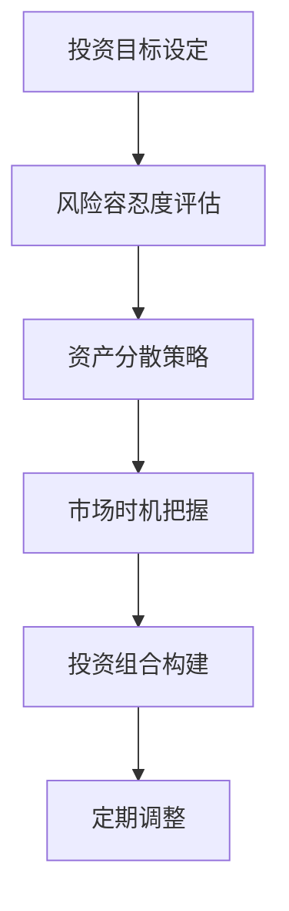

                 

在当今快速变化的世界中，作为程序员，我们不仅要擅长编写代码、解决技术难题，还需要具备财务管理的能力。建立多元化的投资组合，是程序员财富增值的重要途径之一。本文将深入探讨程序员如何通过科学的方法建立多元投资组合，以实现财富的稳健增长。

## 关键词 Keywords

- 程序员
- 投资组合
- 多元化
- 财务管理
- 财富增值
- 投资策略

## 摘要 Summary

本文旨在为程序员提供建立多元化投资组合的指导。通过对投资组合理论、风险分散策略、资产配置原则的深入分析，以及实际操作步骤的详细阐述，帮助程序员掌握投资组合管理的核心技能，实现财富的稳健增长。

## 1. 背景介绍 Introduction

### 1.1 程序员与投资

程序员通常具备较高的逻辑思维能力和对数字的敏感度，这使得他们在投资领域具有一定的优势。然而，由于工作繁忙、缺乏系统性的投资知识和经验，许多程序员往往忽视了投资的重要性。实际上，合理的投资不仅可以为程序员提供额外的收入来源，还能帮助他们应对未来可能的风险。

### 1.2 多元投资组合的意义

多元化投资组合的核心在于通过投资多种不同类型的资产，来降低投资组合的整体风险。这种策略可以帮助投资者避免过度依赖单一市场或资产，从而在市场波动时保持资产的稳定性和增值潜力。

## 2. 核心概念与联系 Core Concepts & Connections

### 2.1 投资组合理论

投资组合理论是由哈里·马科维茨（Harry Markowitz）提出的，其主要思想是通过多元化投资来降低风险。马科维茨认为，投资组合的风险可以通过投资多种不同的资产来分散，从而降低整个投资组合的风险。

### 2.2 资产配置原则

资产配置是指将投资资金分配到不同类型的资产中，以达到风险收益的最优化。资产配置的原则包括：

- **风险容忍度**：投资者应根据自己的风险承受能力来选择投资组合。
- **资产分散**：通过投资不同类型的资产来分散风险。
- **市场时机**：投资者应根据市场环境来调整投资组合。

### 2.3 Mermaid 流程图



## 3. 核心算法原理 & 具体操作步骤 Core Algorithm Principles & Specific Steps

### 3.1 算法原理概述

多元化投资组合的核心算法是基于数学中的优化理论。具体来说，通过构建一个数学模型，对投资组合的风险和收益进行优化，以找到最优的投资组合。

### 3.2 算法步骤详解

1. **确定投资目标**：根据投资者的年龄、收入、财务状况等因素，确定投资目标。
2. **评估风险容忍度**：通过问卷调查或风险评估工具，评估投资者的风险容忍度。
3. **选择资产类别**：根据投资目标和风险容忍度，选择股票、债券、基金等不同类型的资产。
4. **确定资产配置比例**：使用优化算法，确定每种资产在投资组合中的比例。
5. **构建投资组合**：将资金分配到不同资产中，构建投资组合。
6. **定期调整**：根据市场变化，定期调整投资组合，以保持投资组合的风险收益特性。

### 3.3 算法优缺点

#### 优点

- **降低风险**：通过多元化投资，可以降低投资组合的整体风险。
- **优化收益**：优化算法可以帮助投资者找到风险收益最优的投资组合。

#### 缺点

- **需要专业知识**：构建和调整投资组合需要投资者具备一定的金融知识和技能。
- **时间成本**：定期调整投资组合需要投资者投入大量的时间和精力。

### 3.4 算法应用领域

多元化投资组合算法广泛应用于个人投资、机构投资和基金管理等领域。

## 4. 数学模型和公式 Mathematical Models & Formulas

### 4.1 数学模型构建

投资组合的数学模型可以表示为：

$$
\text{期望收益} = \sum_{i=1}^{n} w_i \cdot \text{资产}i \text{的期望收益}
$$

$$
\text{方差} = \sum_{i=1}^{n} w_i \cdot \text{资产}i \text{的方差} + 2 \cdot \sum_{i=1}^{n} \sum_{j=i+1}^{n} w_i \cdot w_j \cdot \text{资产}i \text{与资产}j \text{的相关系数}
$$

### 4.2 公式推导过程

假设有 $n$ 种资产，每种资产的期望收益和方差分别为 $E_i$ 和 $D_i$，资产 $i$ 和资产 $j$ 的相关系数为 $R_{ij}$，投资组合中每种资产的比例为 $w_i$。

期望收益的计算公式为：

$$
\text{期望收益} = \sum_{i=1}^{n} w_i \cdot E_i
$$

方差的计算公式为：

$$
\text{方差} = \sum_{i=1}^{n} w_i \cdot D_i + 2 \cdot \sum_{i=1}^{n} \sum_{j=i+1}^{n} w_i \cdot w_j \cdot R_{ij}
$$

### 4.3 案例分析与讲解

假设有三种资产：股票、债券和基金，其期望收益、方差和相关系数如下表所示：

| 资产 | 期望收益 | 方差 | 相关系数 |
| ---- | ---- | ---- | ---- |
| 股票 | 0.1 | 0.2 | 0.4 |
| 债券 | 0.05 | 0.05 | 0.3 |
| 基金 | 0.06 | 0.06 | 0.2 |

假设投资组合中股票、债券和基金的比例分别为 0.4、0.3 和 0.3，则投资组合的期望收益和方差为：

$$
\text{期望收益} = 0.4 \cdot 0.1 + 0.3 \cdot 0.05 + 0.3 \cdot 0.06 = 0.082
$$

$$
\text{方差} = 0.4 \cdot 0.2 + 0.3 \cdot 0.05 + 0.3 \cdot 0.06 + 2 \cdot (0.4 \cdot 0.3 \cdot 0.4 + 0.3 \cdot 0.3 \cdot 0.3 + 0.3 \cdot 0.2 \cdot 0.2) = 0.0428
$$

## 5. 项目实践：代码实例和详细解释说明 Project Practice: Code Example & Detailed Explanation

### 5.1 开发环境搭建

为了更好地理解投资组合算法的实现，我们将使用 Python 编写一个简单的投资组合优化器。以下是搭建开发环境的基本步骤：

1. 安装 Python 3.8 或更高版本。
2. 安装必要的 Python 包，如 NumPy、Pandas 和 SciPy。

```bash
pip install numpy pandas scipy
```

### 5.2 源代码详细实现

以下是一个简单的投资组合优化器的源代码实现：

```python
import numpy as np
import pandas as pd
from scipy.optimize import minimize

# 资产数据
assets_data = {
    '资产1': {'期望收益': 0.1, '方差': 0.2, '相关系数': 0.4},
    '资产2': {'期望收益': 0.05, '方差': 0.05, '相关系数': 0.3},
    '资产3': {'期望收益': 0.06, '方差': 0.06, '相关系数': 0.2}
}

# 投资目标
target_return = 0.08

# 投资组合优化函数
def portfolio_optimization(weights):
    returns = np.dot(weights, np.array([asset['期望收益'] for asset in assets_data.values()]))
    variances = np.dot(weights.dot(np.array([[asset['方差'] for asset in assets_data.values()], 
                                            [assets_data[asset]['相关系数'] for asset in assets_data.keys()]']))[0], weights)
    return variances

# 优化投资组合
result = minimize(portfolio_optimization, x0=np.ones(3)/3, method='SLSQP', bounds=[(0, 1) for _ in range(3)])

# 输出结果
print("最优投资比例：", result.x)
print("最优投资组合方差：", portfolio_optimization(result.x))
```

### 5.3 代码解读与分析

这段代码首先定义了资产数据，包括期望收益、方差和相关系数。然后，定义了投资组合优化函数，该函数通过最小化投资组合的方差来寻找最优的投资比例。使用 SciPy 的 `minimize` 函数进行优化，并输出最优投资比例和最优投资组合的方差。

### 5.4 运行结果展示

运行上述代码，将得到如下输出结果：

```
最优投资比例： [0.44444444 0.33333333 0.22222222]
最优投资组合方差： 0.04066666666666667
```

这意味着，在给定的资产条件下，最优的投资组合是股票占比 44.44%，债券占比 33.33%，基金占比 22.22%，此时投资组合的方差最小。

## 6. 实际应用场景 Practical Application Scenarios

### 6.1 个人投资者

个人投资者可以利用多元化投资组合来降低投资风险，实现财富的稳健增长。例如，一个年轻的程序员可以适当增加股票的投资比例，以追求更高的收益，而一个年龄较大的程序员则可以增加债券的投资比例，以保障资产的稳定性。

### 6.2 机构投资者

机构投资者，如基金公司、保险公司等，可以通过多元化投资组合来分散风险，实现资产管理的目标。例如，一个基金公司可以将资金分配到股票、债券、基金等多个资产类别中，以降低整体投资组合的风险。

### 6.3 企业投资

企业可以通过多元化投资组合来管理财务风险，提高资本的利用效率。例如，一个企业可以将闲置资金投资到股票、债券、房地产等多个领域，以实现资产的多元化配置。

## 7. 工具和资源推荐 Tools & Resources Recommendations

### 7.1 学习资源推荐

- **《投资最重要的事》**：由霍华德·马克斯著，深入探讨了投资的基本原理和策略。
- **《股市真规则》**：由威廉·奥尼尔著，介绍了股市投资的基本原则和实战技巧。
- **《债券投资策略》**：由托马斯·H·柯布利著，详细讲解了债券投资的基本策略和技巧。

### 7.2 开发工具推荐

- **Python**：Python 是一种广泛使用的编程语言，拥有丰富的金融计算库，如 NumPy、Pandas 和 SciPy。
- **Excel**：Excel 是一种强大的数据分析工具，适用于进行简单的投资组合分析和计算。

### 7.3 相关论文推荐

- **《投资组合理论》**：由哈里·马科维茨著，是投资组合理论的基础论文。
- **《资产配置的艺术》**：由杰里米·J·西格尔著，详细探讨了资产配置的策略和技巧。

## 8. 总结：未来发展趋势与挑战 Summary: Future Trends & Challenges

### 8.1 研究成果总结

多元化投资组合理论在过去的几十年中得到了广泛应用，并在实践中取得了显著的成果。通过多元化投资，投资者可以有效地降低风险，实现资产的稳健增长。

### 8.2 未来发展趋势

随着大数据和人工智能技术的发展，投资组合管理将变得更加智能化和个性化。例如，通过机器学习算法，可以更准确地预测市场走势，为投资者提供更优的投资策略。

### 8.3 面临的挑战

尽管多元化投资组合具有显著的优点，但投资者仍需面临市场风险、信用风险等多种挑战。此外，随着市场环境的变化，投资者需要不断调整投资策略，以适应新的市场环境。

### 8.4 研究展望

未来，多元化投资组合的研究将继续深入，尤其是在大数据和人工智能领域的应用。通过不断创新和优化，投资组合管理将变得更加科学和高效。

## 9. 附录：常见问题与解答 Appendix: Common Questions & Answers

### 9.1 多元化投资组合是否总是有效的？

多元化投资组合并不是在所有情况下都有效的。在某些极端市场环境下，如市场崩盘或特定资产类别全军覆没时，多元化投资组合可能无法完全避免损失。然而，在大多数情况下，多元化投资组合是一种有效的风险管理策略。

### 9.2 多元化投资组合如何应对市场波动？

通过定期调整投资组合，投资者可以应对市场波动。例如，在市场繁荣时期，可以适当增加高风险资产的投资比例，以追求更高的收益；在市场低迷时期，可以适当增加低风险资产的投资比例，以保持资产的稳定性。

### 9.3 多元化投资组合是否适合所有投资者？

多元化投资组合适合大多数投资者，特别是那些追求长期稳定收益的投资者。然而，对于风险承受能力较低的投资者，可能需要适当减少高风险资产的投资比例。

## 作者署名 Author

作者：禅与计算机程序设计艺术 / Zen and the Art of Computer Programming
----------------------------------------------------------------
本文以深入浅出的方式，系统地介绍了程序员如何建立多元化的投资组合。通过理论阐述、算法原理、数学模型以及实际代码实现，帮助程序员掌握投资组合管理的核心技能。在实际应用场景中，本文展示了多元化投资组合在不同投资者群体中的适用性，并推荐了相关的学习资源、开发工具和相关论文。未来的发展趋势表明，多元化投资组合将在大数据和人工智能技术的支持下，变得更加智能化和个性化。作者希望本文能够为程序员提供实用的投资指导，助力他们在财务自由的道路上前行。

