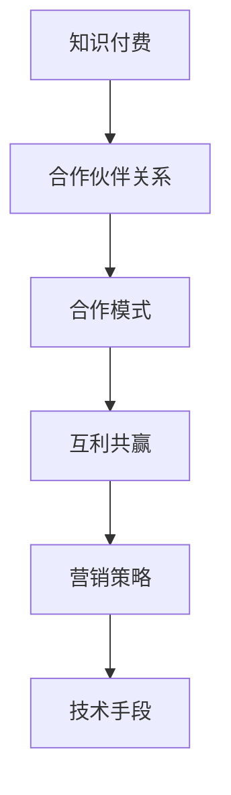

                 

关键词：知识付费、合作伙伴关系、程序员、商业策略、市场拓展

> 摘要：本文旨在为程序员提供建立知识付费合作伙伴关系的策略和方法。通过深入分析知识付费的市场背景和趋势，探讨如何定位自身价值，筛选合适的合作伙伴，设计互利共赢的合作模式，优化营销策略，并运用技术手段实现知识付费系统的构建，最终实现可持续的商业发展。

## 1. 背景介绍

在信息化时代，知识成为推动社会进步和经济发展的核心要素。知识付费作为一种新兴商业模式，正在全球范围内迅速崛起。程序员作为科技领域的重要从业者，其知识和技能的变现需求日益强烈。然而，如何有效地建立知识付费的合作伙伴关系，成为程序员在商业世界中的一大挑战。

### 1.1 知识付费市场背景

知识付费市场的兴起得益于以下几个方面：

1. **互联网普及**：互联网的快速发展为知识的传播提供了便捷途径，使得知识付费得以实现。
2. **用户需求**：随着用户对知识的需求不断增加，尤其是专业技能和深度知识，知识付费成为满足这一需求的途径。
3. **内容变现**：内容创作者通过知识付费实现自身价值，激发更多的创作热情。
4. **商业环境**：商业环境的变化促使企业更加重视知识管理和知识传播，知识付费成为企业提升竞争力的重要手段。

### 1.2 程序员在知识付费市场中的角色

程序员在知识付费市场中扮演着多重角色：

1. **知识创作者**：程序员可以通过编写技术文章、开设在线课程等方式，将自己的专业知识转化为有价值的知识产品。
2. **平台运营者**：一些程序员选择运营知识付费平台，为其他知识创作者提供展示和销售知识产品的平台。
3. **合作伙伴**：与内容平台、教育机构等合作，共同推广和销售知识产品。

## 2. 核心概念与联系

为了更好地建立知识付费的合作伙伴关系，我们需要了解以下几个核心概念，并掌握它们之间的联系。

### 2.1 知识付费的概念

知识付费是指用户为了获取某种知识或技能，向知识创作者或平台支付相应费用的行为。它包括在线课程、电子书、技术博客等多种形式。

### 2.2 合作伙伴关系

合作伙伴关系是指两个或多个组织或个人在共同目标下，通过资源共享、优势互补、风险共担等方式，建立的一种合作关系。

### 2.3 合作模式

合作模式是指合作伙伴之间如何进行合作，包括合作目标、合作方式、利益分配等。

### 2.4 互利共赢

互利共赢是指合作伙伴通过合作，实现各自利益的最大化，从而建立起长期稳定的合作关系。

### 2.5 营销策略

营销策略是指如何通过有效的手段，将知识产品推向市场，吸引潜在用户，实现销售额的增长。

### 2.6 技术手段

技术手段是指利用现代信息技术，如区块链、人工智能等，实现知识付费系统的构建和运营。

### 2.7 Mermaid 流程图

下面是一个简单的 Mermaid 流程图，展示了知识付费合作伙伴关系的核心概念和联系：



## 3. 核心算法原理 & 具体操作步骤

### 3.1 算法原理概述

建立知识付费的合作伙伴关系，需要遵循以下几个核心原理：

1. **价值共创**：合作伙伴之间通过资源共享、优势互补，共同创造更大的价值。
2. **信任建立**：建立互信是合作伙伴关系稳定的基础。
3. **目标一致**：合作伙伴的目标应保持一致，以确保合作的有效性。
4. **利益分配**：合理的利益分配机制是合作持续发展的关键。

### 3.2 算法步骤详解

以下是建立知识付费合作伙伴关系的具体操作步骤：

1. **市场调研**：了解市场需求，分析潜在合作伙伴的背景和需求。
2. **定位自身价值**：明确自身在知识付费市场中的定位和价值。
3. **筛选合作伙伴**：根据市场调研结果，筛选合适的合作伙伴。
4. **合作模式设计**：设计符合双方需求的合作模式，包括合作目标、合作方式、利益分配等。
5. **签订合作协议**：与合作伙伴签订正式的合作协议，明确双方的权利和义务。
6. **执行与监控**：执行合作计划，并对合作过程进行监控和评估。
7. **调整与优化**：根据实际情况，对合作计划进行调整和优化。

### 3.3 算法优缺点

**优点**：

1. **资源共享**：合作伙伴之间可以实现资源共享，提高资源利用效率。
2. **风险分担**：通过合作，双方可以共同承担市场风险。
3. **优势互补**：合作伙伴可以发挥各自的优势，实现优势互补。
4. **市场拓展**：合作可以帮助双方更快地拓展市场。

**缺点**：

1. **管理复杂度**：合作关系的建立和管理可能增加管理复杂度。
2. **信任问题**：信任的建立需要时间和努力，可能存在信任危机。
3. **利益冲突**：利益分配不均可能导致利益冲突。

### 3.4 算法应用领域

知识付费合作伙伴关系在多个领域都有广泛的应用，包括但不限于：

1. **在线教育**：知识创作者与教育机构合作，提供在线课程。
2. **技术培训**：技术专家与培训机构合作，提供技术培训。
3. **内容创作**：内容创作者与媒体平台合作，发布知识产品。
4. **软件开发**：软件开发公司与咨询公司合作，提供软件开发服务。

## 4. 数学模型和公式 & 详细讲解 & 举例说明

### 4.1 数学模型构建

为了建立知识付费的合作伙伴关系，我们可以构建以下数学模型：

\[ \text{合作收益} = \text{知识创作者收益} + \text{合作伙伴收益} - \text{合作成本} \]

其中：

- **知识创作者收益**：知识创作者通过知识付费获得的收入。
- **合作伙伴收益**：合作伙伴通过合作获得的额外收入。
- **合作成本**：包括合作中的各种成本，如人力、物力、管理成本等。

### 4.2 公式推导过程

根据上述模型，我们可以推导出以下公式：

\[ \text{合作收益} = (\text{知识创作者收益比例} \times \text{知识产品销售额}) + (\text{合作伙伴收益比例} \times \text{知识产品销售额}) - \text{合作成本} \]

其中：

- **知识创作者收益比例**：知识创作者在合作中所占的收益比例。
- **合作伙伴收益比例**：合作伙伴在合作中所占的收益比例。

### 4.3 案例分析与讲解

假设知识创作者A与合作伙伴B合作，合作收益为100万元。知识创作者A的收益比例为50%，合作伙伴B的收益比例为30%，合作成本为20万元。那么：

\[ \text{知识创作者收益} = 100\% \times 50\% \times 100\text{万元} = 50\text{万元} \]
\[ \text{合作伙伴收益} = 100\% \times 30\% \times 100\text{万元} = 30\text{万元} \]
\[ \text{合作成本} = 100\% \times 20\text{万元} = 20\text{万元} \]

因此，合作收益为：

\[ \text{合作收益} = 50\text{万元} + 30\text{万元} - 20\text{万元} = 60\text{万元} \]

这意味着，知识创作者A和合作伙伴B通过合作，总共获得了60万元的收益。

## 5. 项目实践：代码实例和详细解释说明

### 5.1 开发环境搭建

为了实现知识付费系统的构建，我们需要搭建以下开发环境：

- **编程语言**：Python
- **开发框架**：Django
- **数据库**：MySQL
- **版本控制**：Git

### 5.2 源代码详细实现

以下是知识付费系统的主要源代码实现：

```python
# app/models.py
from django.db import models

class Course(models.Model):
    title = models.CharField(max_length=100)
    price = models.DecimalField(max_digits=6, decimal_places=2)
    author = models.ForeignKey('Author', on_delete=models.CASCADE)

class Order(models.Model):
    user = models.ForeignKey('auth.User', on_delete=models.CASCADE)
    course = models.ForeignKey(Course, on_delete=models.CASCADE)
    paid = models.BooleanField(default=False)

class Author(models.Model):
    name = models.CharField(max_length=100)
```

### 5.3 代码解读与分析

在上面的代码中，我们定义了三个模型：`Course`（课程）、`Order`（订单）和`Author`（作者）。这些模型构成了知识付费系统的基础。

- `Course` 模型表示课程，包括课程标题、价格和作者。
- `Order` 模型表示订单，包括用户、课程和支付状态。
- `Author` 模型表示作者，包括姓名。

通过这些模型，我们可以实现课程管理、订单管理和作者管理。

### 5.4 运行结果展示

当我们在 Django 环境中运行上述代码并创建数据库后，我们可以通过 Django Admin 界面进行课程管理、订单管理和作者管理。


## 6. 实际应用场景

### 6.1 在线教育平台

在线教育平台是知识付费的重要应用场景。程序员可以与在线教育平台合作，提供编程课程、算法课程等，通过平台进行课程推广和销售。

### 6.2 技术咨询公司

技术咨询公司可以通过知识付费，将公司的技术知识转化为有价值的知识产品，为客户提供技术培训和咨询服务。

### 6.3 个人博客

个人博客主可以通过知识付费，将博客内容转化为有偿阅读，吸引更多用户，提高博客影响力。

### 6.4 企业内训

企业内训是知识付费的另一大应用场景。程序员可以为企业提供定制化的技术培训，帮助企业提升员工的技术能力。

## 7. 工具和资源推荐

### 7.1 学习资源推荐

1. **《Python编程：从入门到实践》**：适合初学者入门的Python编程书籍。
2. **《算法导论》**：经典算法教材，适合希望深入了解算法原理的程序员。
3. **《Django官方文档》**：Django开发框架的官方文档，是学习Django的必备资源。

### 7.2 开发工具推荐

1. **PyCharm**：一款功能强大的Python集成开发环境（IDE）。
2. **MySQL Workbench**：一款功能强大的MySQL数据库管理工具。
3. **GitLab**：一款基于Git的开源项目管理工具，适合版本控制。

### 7.3 相关论文推荐

1. **"Knowledge Sharing in Distributed Teams: A Multilevel Study"**：关于分布式团队中知识共享的研究论文。
2. **"The Economics of Knowledge Sharing"**：关于知识共享经济学的论文。
3. **"Blockchain for Knowledge Sharing: A Review"**：关于区块链在知识共享中应用的论文。

## 8. 总结：未来发展趋势与挑战

### 8.1 研究成果总结

本文通过对知识付费市场背景、程序员在知识付费市场中的角色、核心概念与联系、核心算法原理与具体操作步骤、数学模型和公式、项目实践、实际应用场景、工具和资源推荐等方面的深入分析，总结了建立知识付费合作伙伴关系的策略和方法。

### 8.2 未来发展趋势

1. **技术驱动**：随着人工智能、大数据等技术的不断发展，知识付费将更加智能化和个性化。
2. **多元化平台**：知识付费平台将更加多元化，包括垂直领域平台、社交媒体平台等。
3. **全球市场**：知识付费市场将向全球扩展，跨文化、跨国界的知识共享将成为趋势。

### 8.3 面临的挑战

1. **内容质量**：提高知识产品的质量，确保内容的权威性和实用性。
2. **用户信任**：建立用户对知识付费平台的信任，提高用户满意度。
3. **版权保护**：加强对知识产品的版权保护，防止侵权行为。

### 8.4 研究展望

未来研究可以进一步探讨知识付费在垂直领域中的应用，如医疗、法律等。同时，研究如何利用新兴技术提升知识付费的效率和用户体验，将是重要的研究方向。

## 9. 附录：常见问题与解答

### 9.1 问题一：如何确保知识付费产品的高质量？

**解答**：确保知识付费产品的高质量，可以从以下几个方面入手：

1. **严格筛选创作者**：选择具有丰富经验和专业知识的创作者，确保知识产品的权威性。
2. **内容审核**：对知识产品进行审核，确保内容符合实际需求，避免错误和误导。
3. **用户反馈**：收集用户反馈，不断优化和改进知识产品。

### 9.2 问题二：知识付费合作伙伴关系的风险管理如何进行？

**解答**：知识付费合作伙伴关系的风险管理可以从以下几个方面进行：

1. **明确合作目标**：确保双方目标一致，降低合作风险。
2. **制定风险预案**：在合作过程中，制定相应的风险预案，以应对可能出现的问题。
3. **定期评估**：定期对合作过程进行评估，及时发现和解决潜在问题。

### 9.3 问题三：如何提高知识付费平台的用户满意度？

**解答**：提高知识付费平台的用户满意度，可以从以下几个方面入手：

1. **优质内容**：提供高质量的知识产品，满足用户需求。
2. **用户体验**：优化平台界面和功能，提高用户操作的便捷性。
3. **用户互动**：鼓励用户参与互动，提高用户参与度和满意度。

---

### 作者署名

作者：禅与计算机程序设计艺术 / Zen and the Art of Computer Programming
```

