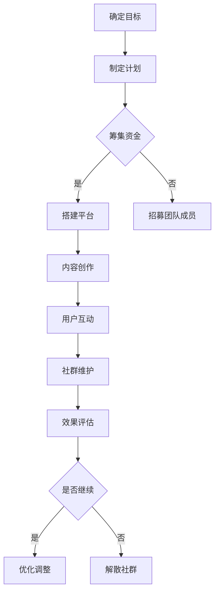

                 

## 1. 背景介绍

在当今信息爆炸的时代，知识付费已经成为了一种流行的商业模式。程序员作为技术领域的重要群体，拥有丰富的专业知识和技术技能。通过建立自己的知识付费社群，程序员不仅可以实现个人价值的提升，还可以为广大用户提供有价值的服务。然而，如何成功地建立和运营一个知识付费社群，是每一个想要尝试的程序员都需要面对的挑战。

本文将为您详细解析如何建立自己的知识付费社群。我们将从背景介绍、核心概念与联系、核心算法原理与操作步骤、数学模型与公式、项目实践、实际应用场景、工具和资源推荐、总结和附录等多个方面，为您提供全面的指导。

## 2. 核心概念与联系

在建立知识付费社群之前，我们需要明确几个核心概念，这些概念构成了整个社群的基础。

### 2.1 知识付费

知识付费是指用户为了获取特定的知识或技能，支付一定的费用以获取学习资源或服务的模式。这种模式在互联网时代得到了极大的发展，各种在线课程、专业咨询、电子书等都属于知识付费的范畴。

### 2.2 社群运营

社群运营是指通过一系列策略和活动，吸引和维护社群成员，从而实现社群价值和成员价值的最大化。社群运营的核心是构建良好的社群关系和互动氛围。

### 2.3 程序员特性

程序员具有独特的专业背景和技能，这使得他们在知识付费社群中具有独特的优势。程序员的知识结构往往更加系统和深入，他们能够提供高质量的技术分享和问题解答。

### 2.4 Mermaid 流程图

下面是一个简化的Mermaid流程图，展示了建立知识付费社群的基本步骤：



## 3. 核心算法原理 & 具体操作步骤

### 3.1 算法原理概述

建立知识付费社群的核心在于如何吸引和维护用户。我们可以将这个过程看作是一个用户生命周期管理的过程，包括以下几个关键环节：

1. **用户获取**：通过各种渠道吸引潜在用户，包括社交媒体推广、合作伙伴推荐等。
2. **用户转化**：将潜在用户转化为付费用户，通过提供免费试听、限时优惠等方式。
3. **用户互动**：建立良好的社群互动氛围，提高用户粘性，可以通过问答、讨论、直播等方式。
4. **用户留存**：通过持续的内容更新和服务，保持用户的长期活跃度。
5. **用户推荐**：鼓励用户进行口碑传播，通过奖励机制提高用户推荐率。

### 3.2 算法步骤详解

1. **用户获取**：

   - 确定目标用户群体：根据自身专业领域，明确目标用户的需求和特点。
   - 选择合适的推广渠道：根据用户行为和偏好，选择合适的推广渠道，如社交媒体、专业论坛、博客等。
   - 制定推广策略：结合渠道特点和用户需求，制定有效的推广策略。

2. **用户转化**：

   - 提供免费试听或体验服务：让用户先体验内容质量，提高付费意愿。
   - 设计优惠活动：如限时折扣、团购等，刺激用户购买。
   - 建立信任机制：通过用户评价、专家推荐等方式，建立用户信任。

3. **用户互动**：

   - 设计互动活动：如问答、讨论、抽奖等，提高用户参与度。
   - 定期举办直播：与用户进行实时互动，解答疑问，提供技术支持。
   - 建立社群规则：确保社群秩序，维护良好的互动氛围。

4. **用户留存**：

   - 持续更新内容：保持内容的新鲜度和实用性，吸引用户持续关注。
   - 提供个性化服务：根据用户需求，提供定制化的课程或咨询服务。
   - 定期反馈与沟通：了解用户反馈，及时调整服务策略。

5. **用户推荐**：

   - 设计奖励机制：鼓励用户进行口碑传播，如推荐奖励、积分兑换等。
   - 增加用户参与感：通过积分系统、等级制度等，增加用户的参与感和归属感。
   - 提供优质服务：只有优质的服务才能让用户愿意主动推荐。

### 3.3 算法优缺点

**优点**：

- **灵活性**：可以根据实际情况灵活调整策略，适应市场变化。
- **互动性**：通过社群互动，提高用户粘性和满意度。
- **可持续性**：通过持续的内容更新和服务，保持社群的长期活跃度。

**缺点**：

- **运营成本**：需要投入大量时间和精力进行社群运营，成本较高。
- **风险**：用户获取和转化的过程存在一定的不确定性，需要具备较强的风险管理能力。

### 3.4 算法应用领域

知识付费社群的建立和运营可以应用于多个领域，如：

- **在线教育**：通过社群提供在线课程，吸引学员报名学习。
- **技术咨询**：为用户提供技术支持和服务，解决用户的技术难题。
- **产品评测**：通过社群提供产品评测，吸引用户参与和反馈。
- **专业交流**：为专业人士提供交流和学习的平台，促进行业交流。

## 4. 数学模型和公式 & 详细讲解 & 举例说明

### 4.1 数学模型构建

在知识付费社群的运营中，我们可以使用一些数学模型来分析和优化运营效果。以下是一个简单的用户增长模型：

设 \(U(t)\) 为时间 \(t\) 时的用户数量，\(r\) 为用户增长率，\(C\) 为初始用户数量，则用户增长模型为：

\[ U(t) = C \cdot (1 + r)^t \]

### 4.2 公式推导过程

1. **确定用户增长率 \(r\)**：

   用户增长率 \(r\) 取决于多个因素，如推广效果、内容质量、用户满意度等。我们可以通过以下公式计算：

   \[ r = \frac{U_{new} - U_{old}}{U_{old}} \]

   其中，\(U_{new}\) 为新用户数量，\(U_{old}\) 为旧用户数量。

2. **计算用户增长量 \(U_{new}\)**：

   用户增长量可以通过以下公式计算：

   \[ U_{new} = U(t) - U(t-1) \]

3. **构建用户增长模型**：

   将用户增长率 \(r\) 代入用户增长模型，得到：

   \[ U(t) = U(t-1) \cdot (1 + r) \]

   累加得到：

   \[ U(t) = C \cdot (1 + r)^t \]

### 4.3 案例分析与讲解

假设我们有一个知识付费社群，初始用户数量为100人，用户增长率为10%。我们想要预测社群在3个月后的用户数量。

根据用户增长模型：

\[ U(3) = 100 \cdot (1 + 0.1)^3 \]

计算得到：

\[ U(3) \approx 133 \]

因此，在3个月后，社群的用户数量预计为133人。

通过这个简单的数学模型，我们可以对社群的运营效果进行预测和评估，从而优化运营策略。

## 5. 项目实践：代码实例和详细解释说明

### 5.1 开发环境搭建

在建立知识付费社群之前，我们需要搭建一个稳定、可靠的技术平台。以下是搭建开发环境的基本步骤：

1. **选择编程语言**：我们可以选择Python、Java、Node.js等主流编程语言。
2. **搭建服务器**：选择阿里云、腾讯云等云服务器，配置合适的硬件资源和软件环境。
3. **安装开发工具**：安装IDE（如PyCharm、IntelliJ IDEA）、版本控制工具（如Git）等。
4. **搭建数据库**：选择MySQL、PostgreSQL等关系型数据库，或MongoDB、Redis等非关系型数据库。

### 5.2 源代码详细实现

以下是一个简单的Python代码示例，用于搭建一个基本的知识付费社群平台。

```python
# 社群平台基础代码示例

from flask import Flask, request, jsonify
from flask_sqlalchemy import SQLAlchemy

app = Flask(__name__)
app.config['SQLALCHEMY_DATABASE_URI'] = 'sqlite:///community.db'
db = SQLAlchemy(app)

class User(db.Model):
    id = db.Column(db.Integer, primary_key=True)
    username = db.Column(db.String(80), unique=True, nullable=False)
    password = db.Column(db.String(120), nullable=False)

@app.route('/register', methods=['POST'])
def register():
    username = request.form['username']
    password = request.form['password']
    user = User(username=username, password=password)
    db.session.add(user)
    db.session.commit()
    return jsonify({'status': 'success', 'message': '注册成功'})

@app.route('/login', methods=['POST'])
def login():
    username = request.form['username']
    password = request.form['password']
    user = User.query.filter_by(username=username, password=password).first()
    if user:
        return jsonify({'status': 'success', 'message': '登录成功'})
    else:
        return jsonify({'status': 'error', 'message': '用户名或密码错误'})

if __name__ == '__main__':
    db.create_all()
    app.run(debug=True)
```

### 5.3 代码解读与分析

这段代码使用Flask框架搭建了一个简单的社群平台，包含用户注册和登录功能。以下是代码的详细解读：

- **数据库模型**：定义了`User`模型，包含用户ID、用户名和密码。
- **注册接口**：定义了`/register`接口，接收用户名和密码，将用户信息保存到数据库。
- **登录接口**：定义了`/login`接口，接收用户名和密码，验证用户身份。

通过这段代码，我们可以搭建一个基本的知识付费社群平台，为后续的功能扩展提供基础。

### 5.4 运行结果展示

在本地环境中运行此代码，我们可以使用浏览器或Postman等工具测试注册和登录接口。

- **注册**：

  发送POST请求到`http://localhost:5000/register`，传递用户名和密码：

  ```json
  {
      "username": "user1",
      "password": "password1"
  }
  ```

  返回结果：

  ```json
  {
      "status": "success",
      "message": "注册成功"
  }
  ```

- **登录**：

  发送POST请求到`http://localhost:5000/login`，传递用户名和密码：

  ```json
  {
      "username": "user1",
      "password": "password1"
  }
  ```

  返回结果：

  ```json
  {
      "status": "success",
      "message": "登录成功"
  }
  ```

通过以上步骤，我们成功地搭建了一个基本的知识付费社群平台。

## 6. 实际应用场景

知识付费社群在实际应用中具有广泛的场景，以下是一些典型的应用场景：

1. **在线教育**：程序员可以开设在线课程，教授编程语言、算法设计、软件开发等知识，吸引学员报名学习。
2. **技术咨询**：程序员可以提供技术咨询服务，解决用户在软件开发过程中遇到的问题，提供专业的技术支持。
3. **产品评测**：程序员可以建立产品评测社群，邀请用户对新产品进行评测，收集用户反馈，为产品优化提供依据。
4. **专业交流**：程序员可以创建专业交流社群，为专业人士提供一个交流和学习的平台，促进行业交流与合作。

在这些应用场景中，知识付费社群不仅为用户提供有价值的服务，也为程序员提供了实现个人价值的途径。通过社群运营，程序员可以不断提升自己的专业能力，扩大影响力，实现职业发展。

### 6.1 开设在线课程

开设在线课程是知识付费社群的一种常见形式。程序员可以通过以下步骤开设在线课程：

1. **确定课程主题**：根据自身专业优势和用户需求，确定课程主题，如Python编程、人工智能应用等。
2. **设计课程内容**：编写详细的课程大纲，包括课程目标、教学内容、实践案例等。
3. **录制课程视频**：使用视频录制工具，如Camtasia、OBS Studio等，录制高质量的课程视频。
4. **搭建课程平台**：使用在线教育平台，如网易云课堂、腾讯课堂等，发布课程视频和教学资料。
5. **推广课程**：利用社交媒体、专业论坛、合作伙伴等渠道，推广课程，吸引学员报名。

### 6.2 提供技术咨询服务

提供技术咨询服务是程序员实现知识付费的另一种途径。程序员可以通过以下步骤提供技术咨询服务：

1. **明确服务范围**：根据自身专业特长，明确服务范围，如Web开发、移动应用开发、数据库设计等。
2. **设置服务价格**：根据服务内容、难度和工作量，合理设置服务价格。
3. **建立咨询平台**：使用在线咨询工具，如腾讯云开发者社区、CSDN咨询区等，为用户提供咨询服务。
4. **提供高质量服务**：通过专业的技术支持和问题解答，为用户提供高质量的服务。
5. **维护客户关系**：通过定期回访、提供优惠等方式，维护客户关系，提高客户满意度。

### 6.3 建立产品评测社群

建立产品评测社群可以吸引更多的用户参与产品评测，为产品优化提供有力支持。程序员可以通过以下步骤建立产品评测社群：

1. **选择产品**：根据自身兴趣和专业领域，选择合适的产品进行评测。
2. **设计评测方案**：制定详细的评测方案，包括评测指标、评测方法、评测报告等。
3. **招募评测员**：通过社交媒体、专业论坛等渠道，招募有经验的评测员。
4. **发布评测任务**：为评测员分配评测任务，并提供必要的评测工具和资料。
5. **收集评测结果**：汇总评测员提交的评测结果，形成评测报告。
6. **提供反馈**：将评测报告反馈给产品团队，协助产品优化。

### 6.4 专业交流

专业交流社群为程序员提供了一个交流和学习的平台，有助于提升个人专业能力和行业影响力。程序员可以通过以下步骤创建专业交流社群：

1. **确定社群主题**：根据自身专业领域和兴趣，确定社群主题，如Python开发社群、人工智能社群等。
2. **设计社群活动**：包括线上讨论、线下聚会、技术分享会等，丰富社群活动内容。
3. **搭建社群平台**：选择合适的社群平台，如微信群、QQ群、Discord等，搭建社群交流平台。
4. **邀请专业人士**：邀请行业专家、技术大牛等参与社群活动，提升社群影响力。
5. **维护社群秩序**：制定社群规则，确保社群秩序和良好氛围。

通过以上实际应用场景，程序员可以充分发挥自身专业优势，建立自己的知识付费社群，实现个人价值和商业价值的双赢。

### 6.4 未来应用展望

随着互联网技术的不断进步，知识付费社群的应用场景将越来越广泛，未来的发展趋势也将呈现出以下几个特点：

1. **个性化服务**：未来知识付费社群将更加注重个性化服务，根据用户需求和兴趣，提供定制化的课程、咨询和评测服务。
2. **智能化推荐**：利用人工智能技术，实现智能化的内容推荐和用户匹配，提高用户满意度和社群运营效率。
3. **平台生态化**：知识付费社群将逐渐形成生态化平台，包括内容创作者、用户、投资方等多个角色，共同构建一个多元化的生态系统。
4. **线上线下融合**：未来知识付费社群将更加注重线上线下相结合，通过线下活动、实体课程等方式，提高用户参与度和粘性。

尽管前景广阔，但知识付费社群也面临着一系列挑战，如内容质量参差不齐、用户信任度不足、市场竞争加剧等。因此，未来知识付费社群的发展需要不断创新和优化，以应对日益激烈的市场竞争。

### 7. 工具和资源推荐

在建立和运营知识付费社群的过程中，我们需要使用到各种工具和资源。以下是一些推荐的工具和资源，以帮助您更高效地开展社群工作：

### 7.1 学习资源推荐

- **在线课程平台**：网易云课堂、腾讯课堂、慕课网等，提供丰富的编程和IT课程资源。
- **技术社区**：CSDN、GitHub、Stack Overflow等，可以获取最新的技术资讯和解决方案。
- **博客平台**：简书、博客园、掘金等，方便分享技术心得和成果。
- **在线文档**：GitBook、MarkdownPad等，方便编写和发布技术文档。

### 7.2 开发工具推荐

- **编程语言**：Python、Java、JavaScript等，根据需求选择合适的编程语言。
- **开发环境**：PyCharm、IntelliJ IDEA、Visual Studio Code等，提供强大的开发功能和插件支持。
- **数据库工具**：MySQL Workbench、PostgreSQL、MongoDB等，方便数据库管理和维护。
- **云服务**：阿里云、腾讯云、华为云等，提供稳定的云服务器和数据库服务。

### 7.3 相关论文推荐

- **在线教育研究**：《在线教育研究：理论与实践》（张伟忠 著）。
- **社群运营**：《社群营销与运营：策略、技巧与实践》（刘润 著）。
- **人工智能应用**：《人工智能：一种现代的方法》（Stuart Russell & Peter Norvig 著）。
- **编程语言理论**：《计算机程序的构造和解释》（Harold Abelson & Gerald Jay Sussman 著）。

### 8. 总结：未来发展趋势与挑战

### 8.1 研究成果总结

本文从多个角度探讨了程序员如何建立自己的知识付费社群。通过核心概念与联系、核心算法原理与操作步骤、数学模型与公式、项目实践、实际应用场景等多个方面的详细分析，我们得出以下结论：

1. **明确目标**：建立知识付费社群的首要任务是明确目标用户群体和核心价值。
2. **灵活运营**：根据市场变化和用户需求，灵活调整社群运营策略。
3. **优质内容**：提供高质量的内容是吸引用户和维持社群活跃的关键。
4. **用户互动**：通过用户互动，提高用户粘性和满意度。
5. **持续优化**：不断优化社群运营效果，实现长期可持续发展。

### 8.2 未来发展趋势

未来，知识付费社群将呈现以下发展趋势：

1. **个性化服务**：更注重个性化服务，根据用户需求提供定制化内容。
2. **智能化推荐**：利用人工智能技术，实现智能化的内容推荐和用户匹配。
3. **平台生态化**：形成生态化平台，包括内容创作者、用户、投资方等多个角色。
4. **线上线下融合**：线上线下相结合，提高用户参与度和粘性。

### 8.3 面临的挑战

尽管前景广阔，知识付费社群也面临着一系列挑战：

1. **内容质量参差不齐**：需要严格把控内容质量，提高用户信任度。
2. **用户信任度不足**：需要建立信任机制，提高用户满意度。
3. **市场竞争加剧**：需要不断创新和优化，以应对激烈的市场竞争。

### 8.4 研究展望

未来，我们可以在以下方面进一步研究：

1. **用户行为分析**：通过数据分析，深入了解用户需求和偏好。
2. **社群治理**：探索有效的社群治理模式，维护社群秩序和良好氛围。
3. **商业模式创新**：研究新的商业模式，实现知识付费社群的可持续发展。

总之，建立和运营知识付费社群是一项复杂而富有挑战的任务，但通过不断探索和实践，我们可以找到适合自己的运营策略，实现个人价值和商业价值的双赢。

## 9. 附录：常见问题与解答

### 9.1 如何确定目标用户群体？

确定目标用户群体的关键在于了解用户需求和兴趣。您可以通过以下方式：

- **市场调研**：收集行业报告、用户调查数据等，了解目标用户的基本情况和需求。
- **用户画像**：根据用户的基本信息、行为特征和需求，创建用户画像。
- **竞争对手分析**：分析竞争对手的用户群体，了解他们的优势和不足。

### 9.2 如何保证内容质量？

保证内容质量可以从以下几个方面入手：

- **内容审核**：建立内容审核机制，确保内容的准确性和专业性。
- **用户反馈**：收集用户反馈，及时调整和优化内容。
- **专家审核**：邀请行业专家对内容进行审核，提高内容的权威性。

### 9.3 如何提高用户粘性？

提高用户粘性可以通过以下方式：

- **用户互动**：设计丰富的互动活动，如问答、讨论、直播等，提高用户参与度。
- **个性化服务**：根据用户需求提供定制化的内容和服务，提高用户满意度。
- **社区氛围**：营造良好的社群氛围，让用户感到归属感和信任。

### 9.4 如何应对市场竞争？

应对市场竞争可以从以下几个方面入手：

- **差异化竞争**：提供差异化的服务，满足用户的不同需求。
- **持续创新**：不断优化运营策略和产品功能，保持竞争力。
- **用户口碑**：通过优质的服务和内容，积累良好的用户口碑。

通过以上策略，您可以有效地应对市场竞争，建立和运营一个成功的知识付费社群。

