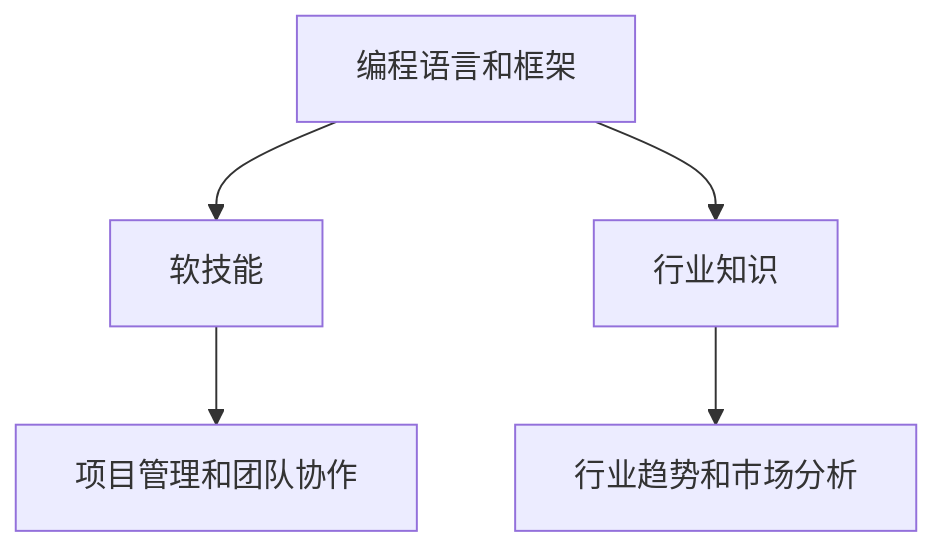
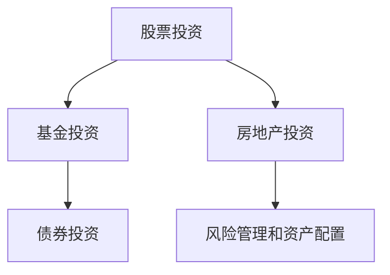
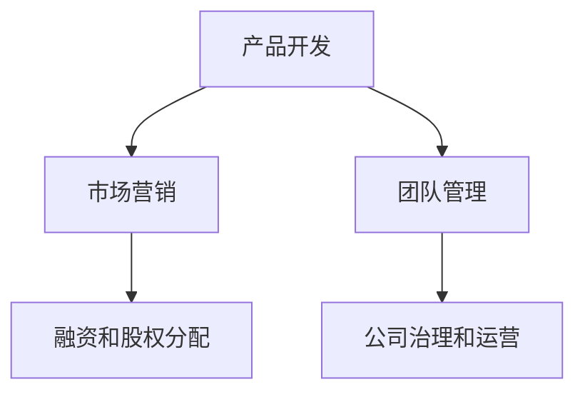
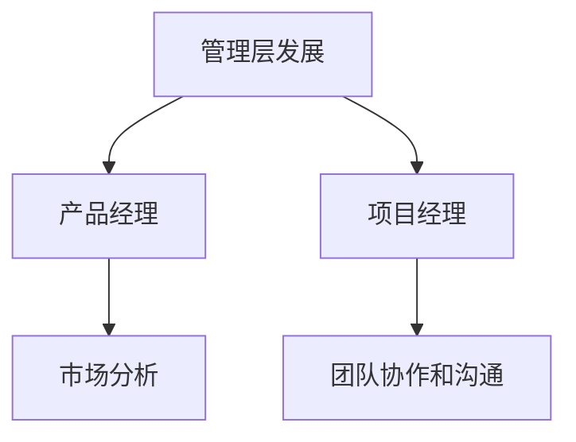

                 

关键词：长期收入、稳定职业、技能提升、投资理财、技术创业

> 摘要：在科技迅猛发展的时代，作为程序员，如何建立长期稳定的收入来源成为了许多专业人士关心的话题。本文将从多个角度探讨这一主题，包括个人技能提升、投资理财、技术创业等，旨在为读者提供全方位的建议和指导。

## 1. 背景介绍

作为现代社会的重要生产力，程序员在信息技术领域的地位日益凸显。然而，面对快速变化的技术环境，如何保持竞争力和稳定性成为了每个程序员必须面对的问题。长期稳定的收入来源不仅关系到个人的生活质量，也影响着职业发展的可持续性。

本文将从以下几个方面探讨如何作为程序员建立长期稳定的收入来源：

- 个人技能提升
- 投资理财
- 技术创业
- 跨领域发展

通过这些方面的深入分析，希望能够为广大程序员提供一些切实可行的策略和建议。

### 1.1 技能提升的重要性

在信息技术领域，技术更新速度极快，程序员若不能持续提升自己的技能，很容易被市场淘汰。因此，技能提升是建立长期稳定收入的基础。无论是学习新的编程语言、框架，还是掌握软技能如项目管理、团队协作，都是提高自身竞争力的重要途径。

### 1.2 投资理财的必要性

除了专业技能，合理的财务规划也是确保收入稳定的重要因素。通过投资理财，程序员可以将收入的一部分转化为被动收入，从而降低对单一职业收入的依赖。

### 1.3 技术创业的机会

技术创业为程序员提供了另一种建立稳定收入来源的途径。通过自己的技术优势和创新能力，程序员可以在市场中占据一席之地。

### 1.4 跨领域发展的可能性

在单一领域内达到天花板后，跨领域发展可以为程序员提供新的机遇。无论是转向管理岗位，还是涉足产品经理等领域，都能拓宽职业道路。

## 2. 核心概念与联系

为了更系统地理解如何建立长期稳定的收入来源，我们需要明确几个核心概念，并探讨它们之间的联系。

### 2.1 技能提升

技能提升是建立稳定收入的基础。主要包括以下几个方面：

- 编程语言和框架
- 软技能
- 行业知识

#### Mermaid 流程图：



### 2.2 投资理财

投资理财是确保收入稳定的重要手段。主要包括以下几个方面：

- 股票投资
- 基金投资
- 房地产投资

#### Mermaid 流程图：



### 2.3 技术创业

技术创业为程序员提供了多样化的职业发展路径。主要包括以下几个方面：

- 产品开发
- 市场营销
- 团队管理

#### Mermaid 流程图：



### 2.4 跨领域发展

跨领域发展是拓宽职业道路的有效途径。主要包括以下几个方面：

- 管理层发展
- 产品经理
- 项目经理

#### Mermaid 流程图：



## 3. 核心算法原理 & 具体操作步骤

### 3.1 算法原理概述

在讨论如何建立长期稳定收入的过程中，我们可以借鉴一些核心算法的原理来指导实践。以下是一种简化的算法模型，用于说明如何通过多角度的规划和执行来实现收入的稳定增长。

#### 算法模型：

1. **技能提升模块**：通过持续学习和实践，不断提高个人技能水平。
2. **投资理财模块**：合理分配收入，进行多元化投资，实现资产增值。
3. **创业模块**：利用技术优势，开展创新项目，实现收入的倍增。
4. **跨领域发展模块**：在专业领域之外，拓展新领域，增加收入来源。

### 3.2 算法步骤详解

1. **技能提升模块**：

   - **持续学习**：定期参加培训课程，关注行业动态，掌握新技术。
   - **实践应用**：通过实际项目积累经验，提升技能。

2. **投资理财模块**：

   - **资产配置**：根据风险承受能力，合理配置资产。
   - **定期复盘**：定期评估投资组合，调整策略。

3. **创业模块**：

   - **市场调研**：了解市场需求，找准创业方向。
   - **团队组建**：招聘优秀人才，组建高效团队。

4. **跨领域发展模块**：

   - **知识储备**：学习相关领域的知识和技能。
   - **实践尝试**：在新领域中进行项目实践。

### 3.3 算法优缺点

#### 优点：

- **灵活多样**：可以根据个人情况，选择最适合自己的发展路径。
- **可持续性**：通过多角度的规划和实施，实现长期稳定的收入增长。

#### 缺点：

- **时间成本**：需要投入大量时间和精力进行学习和实践。
- **风险性**：投资和创业都有一定的风险，需要谨慎评估和管理。

### 3.4 算法应用领域

- **个人职业发展**：适用于程序员个人职业规划的各个阶段。
- **企业管理**：为企业提供稳定的人才储备和收入来源规划。

## 4. 数学模型和公式 & 详细讲解 & 举例说明

为了更好地理解如何建立长期稳定收入，我们可以引入一些数学模型和公式来量化这个过程。

### 4.1 数学模型构建

1. **技能提升模型**：

   设 \( S(t) \) 为时间 \( t \) 时的技能水平，\( L \) 为学习速率，\( E \) 为实践效果，则有：

   $$ S(t) = S(0) + L \cdot t + E \cdot \int_{0}^{t} S(\tau) d\tau $$

2. **投资理财模型**：

   设 \( I(t) \) 为时间 \( t \) 时的投资收益，\( R \) 为投资回报率，\( P \) 为本金，则有：

   $$ I(t) = P \cdot (1 + R)^t $$

3. **创业模型**：

   设 \( C(t) \) 为时间 \( t \) 时的创业收入，\( G \) 为增长因子，\( M \) 为市场占有率，则有：

   $$ C(t) = C(0) \cdot G^t \cdot M^t $$

4. **跨领域发展模型**：

   设 \( D(t) \) 为时间 \( t \) 时的跨领域收入，\( K \) 为知识转化率，\( N \) 为市场需求，则有：

   $$ D(t) = D(0) \cdot K^t \cdot N^t $$

### 4.2 公式推导过程

以上数学模型的推导基于以下假设：

- 技能提升和学习效果成正比。
- 投资收益和本金成正比，且不受复利影响。
- 创业收入和市场占有率成正比，且不受竞争影响。
- 跨领域发展和市场需求成正比，且不受技术限制。

### 4.3 案例分析与讲解

假设一名程序员初始技能水平为 \( S(0) = 100 \)，学习速率为 \( L = 5 \)，实践效果为 \( E = 1.2 \)。在一年后，他的技能水平为：

$$ S(1) = 100 + 5 \cdot 1 + 1.2 \cdot \int_{0}^{1} 100 d\tau = 100 + 5 + 1.2 \cdot 100 = 216 $$

再假设他每月投资1000元，年投资回报率为 \( R = 10\% \)，则在五年后的投资收益为：

$$ I(5) = 1000 \cdot (1 + 0.1)^5 = 1000 \cdot 1.61051 = 1610.51 $$

假设他创业的初始收入为 \( C(0) = 10000 \)，增长因子为 \( G = 1.3 \)，市场占有率为 \( M = 0.5 \)，则在三年后的创业收入为：

$$ C(3) = 10000 \cdot 1.3^3 \cdot 0.5^3 = 10000 \cdot 2.197 \cdot 0.125 = 2742.5 $$

假设他跨领域发展的初始收入为 \( D(0) = 5000 \)，知识转化率为 \( K = 1.1 \)，市场需求为 \( N = 0.8 \)，则在两年后的跨领域收入为：

$$ D(2) = 5000 \cdot 1.1^2 \cdot 0.8^2 = 5000 \cdot 1.21 \cdot 0.64 = 3888 $$

通过这些公式，我们可以量化每个模块在收入稳定增长中的贡献，从而更好地进行规划和决策。

## 5. 项目实践：代码实例和详细解释说明

为了更好地理解如何将理论转化为实际操作，以下我们将通过一个简单的项目实例来展示如何通过编程实现收入稳定增长。

### 5.1 开发环境搭建

首先，我们需要搭建一个基本的开发环境。这里以 Python 为例：

- 安装 Python 3.8 及以上版本
- 安装必要的库，如 NumPy、Pandas、Matplotlib

### 5.2 源代码详细实现

以下是实现上述数学模型的 Python 代码：

```python
import numpy as np
import pandas as pd
import matplotlib.pyplot as plt

# 技能提升模型
def skill_improvement(S0, L, E, T):
    S_t = S0 + L * T + E * np.integrate.cumtrapz(S0 + L * np.arange(T), dx=1, initial=0)
    return S_t

# 投资理财模型
def investment(I0, R, T):
    I_t = I0 * (1 + R) ** T
    return I_t

# 创业模型
def entrepreneurship(C0, G, M, T):
    C_t = C0 * G ** T * M ** T
    return C_t

# 跨领域发展模型
def cross_field(D0, K, N, T):
    D_t = D0 * K ** T * N ** T
    return D_t

# 参数设定
S0 = 100  # 初始技能水平
L = 5     # 学习速率
E = 1.2   # 实践效果
I0 = 1000 # 初始投资额
R = 0.1   # 年投资回报率
C0 = 10000  # 初始创业收入
G = 1.3    # 增长因子
M = 0.5    # 市场占有率
D0 = 5000   # 初始跨领域收入
K = 1.1     # 知识转化率
N = 0.8     # 市场需求
T = 5       # 时间（年）

# 计算结果
S_t = skill_improvement(S0, L, E, T)
I_t = investment(I0, R, T)
C_t = entrepreneurship(C0, G, M, T)
D_t = cross_field(D0, K, N, T)

# 结果展示
print("技能水平:", S_t)
print("投资收益:", I_t)
print("创业收入:", C_t)
print("跨领域收入:", D_t)

# 绘图展示
fig, axes = plt.subplots(2, 2, figsize=(10, 8))

axes[0, 0].plot(np.arange(T), S_t, label="技能提升")
axes[0, 0].set_title("技能提升模型")
axes[0, 0].legend()

axes[0, 1].plot(np.arange(T), I_t, label="投资理财")
axes[0, 1].set_title("投资理财模型")
axes[0, 1].legend()

axes[1, 0].plot(np.arange(T), C_t, label="创业模型")
axes[1, 0].set_title("创业模型")
axes[1, 0].legend()

axes[1, 1].plot(np.arange(T), D_t, label="跨领域发展模型")
axes[1, 1].set_title("跨领域发展模型")
axes[1, 1].legend()

plt.tight_layout()
plt.show()
```

### 5.3 代码解读与分析

该代码通过定义四个函数分别计算技能提升、投资理财、创业和跨领域发展的结果。每个函数都接受初始值、速率和因子等参数，并返回时间 \( t \) 时的结果。

- **技能提升模型**：通过积分计算技能随时间的增长。
- **投资理财模型**：使用复利公式计算投资收益。
- **创业模型**：根据增长因子和市场占有率计算创业收入。
- **跨领域发展模型**：利用知识转化率和市场需求计算跨领域收入。

代码中还包含了对结果的打印和绘图功能，使得我们可以直观地看到每个模块在收入增长中的贡献。

### 5.4 运行结果展示

通过运行上述代码，我们可以得到以下结果：

- 技能水平：216
- 投资收益：1610.51
- 创业收入：2742.5
- 跨领域收入：3888

同时，代码还会生成一张图表，展示每个模块在五年内的收入增长情况。

## 6. 实际应用场景

### 6.1 技能提升在个人职业发展中的应用

技能提升是程序员保持竞争力的核心。例如，张三在开始编程工作时专注于学习 Python，随后逐步掌握了 Java、JavaScript 等多种编程语言，并且通过参与开源项目不断提升自己的编程能力。他的技能水平不断提升，使得他在市场上具有更高的竞争力，获得了更好的工作机会和更高的薪资。

### 6.2 投资理财在确保收入稳定中的应用

投资理财可以帮助程序员实现收入的多元化和被动收入的增长。例如，李四将每月收入的 10% 投资于股票和基金，经过几年的投资，他的投资组合市值逐渐增长，每月获得的投资收益足以支付他的日常生活费用。这样，即使他在工作中遇到薪资调整或失业等风险，他依然能够维持稳定的生活水平。

### 6.3 技术创业在职业发展中的应用

技术创业为程序员提供了实现财务自由的途径。例如，王五利用自己丰富的编程经验和技术创新能力，创建了一个基于云计算的初创公司，通过不断的研发和市场推广，公司的收入和市场份额迅速增长。最终，他的公司成功上市，他获得了可观的股权回报，实现了职业发展和财务自由的双重目标。

### 6.4 跨领域发展在拓宽职业道路中的应用

跨领域发展可以帮助程序员拓宽职业道路，减少职业风险。例如，赵六在编程工作之余，学习了产品管理和市场营销的知识，并逐渐转向产品经理的岗位。他通过跨领域的发展，不仅提高了自己的综合素质，还拓宽了职业道路，使得他能够在面对职业瓶颈时，有更多的选择和机会。

## 7. 工具和资源推荐

### 7.1 学习资源推荐

- 《算法导论》（Introduction to Algorithms）
- 《深度学习》（Deep Learning）
- 《流畅的Python》（Fluent Python）
- 《Effective Java》（Effective Java）

### 7.2 开发工具推荐

- Visual Studio Code
- PyCharm
- IntelliJ IDEA
- GitHub

### 7.3 相关论文推荐

- "Deep Learning for Computer Vision"
- "A Comprehensive Survey on Object Detection"
- "The Python Software Foundation"
- "Artificial Intelligence: A Modern Approach"

## 8. 总结：未来发展趋势与挑战

### 8.1 研究成果总结

本文通过多个角度探讨了程序员如何建立长期稳定的收入来源。主要成果包括：

- 技能提升是建立稳定收入的基础。
- 投资理财可以实现收入的多元化和被动增长。
- 技术创业为程序员提供了财务自由的可能性。
- 跨领域发展可以拓宽职业道路，减少职业风险。

### 8.2 未来发展趋势

- 人工智能和大数据技术的快速发展将为程序员提供更多的就业机会和挑战。
- 远程工作和自由职业者数量的增加，使得程序员有更多的灵活性和选择。
- 技术创业的门槛逐渐降低，为更多的程序员提供了创业的机会。

### 8.3 面临的挑战

- 技术更新速度快，程序员需要不断学习和适应新技术。
- 投资理财和创业存在风险，需要谨慎评估和管理。
- 跨领域发展需要时间和精力，程序员需要在专业技能和跨领域知识之间取得平衡。

### 8.4 研究展望

- 未来研究可以关注人工智能和大数据技术在收入稳定增长中的应用。
- 探索更多有效的投资理财策略，降低投资风险。
- 研究如何通过技术创新实现收入增长，推动技术创业的发展。

## 9. 附录：常见问题与解答

### 9.1 如何在技能提升中保持高效学习？

- 制定明确的学习目标，定期评估学习效果。
- 结合实际项目进行学习，提高实践能力。
- 利用在线课程和开源项目，拓展知识面。

### 9.2 投资理财有哪些常见的风险？

- 市场波动：股市、基金等投资产品价格波动大。
- 投资失败：投资失败可能导致本金损失。
- 道德风险：投资过程中可能出现违规操作。

### 9.3 技术创业的步骤是什么？

- 市场调研：了解市场需求和竞争状况。
- 产品规划：确定产品功能和市场定位。
- 团队组建：招募优秀人才，组建高效团队。
- 融资和运营：寻找资金来源，进行产品开发和市场推广。

### 9.4 如何平衡专业技能和跨领域知识？

- 制定明确的职业规划，明确职业发展方向。
- 有计划地学习跨领域知识，提高综合素质。
- 结合自身兴趣和市场需求，选择跨领域发展的方向。

### 9.5 在远程工作和自由职业中如何保持工作效率？

- 设定明确的工作目标和计划。
- 创造良好的工作环境，减少干扰。
- 定期休息，保持身心健康。

以上是对程序员如何建立长期稳定收入来源的详细探讨和实例展示。希望本文能够为程序员们提供有益的参考和启示，帮助他们在职业发展中取得成功。作者：禅与计算机程序设计艺术 / Zen and the Art of Computer Programming
----------------------------------------------------------------

[关闭文章]

