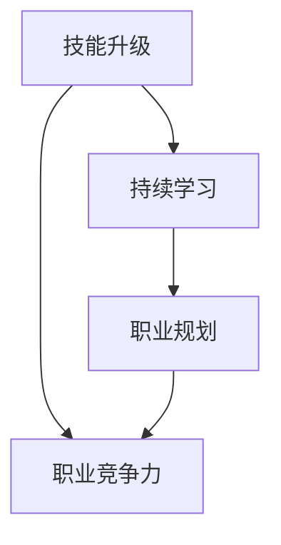

                 

关键词：长期职业竞争力、技能升级、持续学习、技术趋势、职业规划

> 摘要：本文将探讨程序员如何通过技能升级、持续学习和职业规划来建立和保持长期职业竞争力，从而在快速变化的技术领域中脱颖而出。

## 1. 背景介绍

在当今数字化时代，程序员作为信息技术领域的核心力量，面临着前所未有的职业机遇和挑战。技术更新的速度不断加快，新的编程语言、框架和工具层出不穷。为了在这样的环境中保持竞争力，程序员不仅需要不断更新自己的技能，还需要具备前瞻性的视野和合理的职业规划。本文将探讨如何通过技能升级、持续学习和职业规划，为程序员建立长期的职业竞争力。

### 1.1 技术更新的挑战

随着云计算、大数据、人工智能、物联网等新兴技术的快速发展，程序员面临的技术更新速度前所未有。新的编程语言、框架和工具层出不穷，使得程序员必须时刻关注行业动态，不断学习新技能。

### 1.2 职业发展的压力

在竞争激烈的就业市场中，程序员不仅需要掌握核心技术，还需要具备解决问题的能力、团队合作精神以及良好的职业素养。这给职业发展带来了巨大的压力。

### 1.3 持续学习的必要性

面对快速变化的技术环境，持续学习成为程序员保持竞争力的关键。只有通过不断学习，才能适应新的技术趋势，掌握前沿技能。

## 2. 核心概念与联系

为了建立长期职业竞争力，程序员需要掌握以下几个核心概念：

### 2.1 技能升级

技能升级是指通过不断学习新技能，提升自己的技术水平和职业竞争力。这包括学习新的编程语言、框架和工具，以及掌握前沿技术。

### 2.2 持续学习

持续学习是指不断学习新的知识和技能，以适应快速变化的技术环境。这包括参加培训课程、阅读技术书籍、参加技术研讨会等。

### 2.3 职业规划

职业规划是指根据自己的兴趣和职业目标，制定合理的职业发展路径，并为此努力。这包括确定职业发展方向、制定学习计划、积累工作经验等。

下面是一个用Mermaid绘制的流程图，展示了这些核心概念之间的联系：



### 2.4 技能升级与职业竞争力的关系

技能升级是提高职业竞争力的基础。通过学习新的技能，程序员可以扩展自己的技术栈，提高工作效率，从而在竞争激烈的就业市场中脱颖而出。

持续学习是技能升级的保障。只有不断学习，才能跟上技术发展的步伐，掌握最新的技术和工具。

职业规划是技能升级和持续学习的导向。通过合理的职业规划，程序员可以明确自己的职业目标，有针对性地学习新技能，从而提高职业竞争力。

## 3. 核心算法原理 & 具体操作步骤

### 3.1 算法原理概述

为了更好地理解技能升级、持续学习和职业规划，我们可以借助一个简单的算法原理——贪心算法。贪心算法是一种在每一步选择中都采取当前最优解的算法，适用于解决一些特定的问题，如最短路径、负载均衡等。

### 3.2 算法步骤详解

贪心算法的基本步骤如下：

1. 初始化：设定初始状态。
2. 选择操作：在当前状态下，选择一个最优操作。
3. 执行操作：执行选择的最优操作。
4. 更新状态：根据执行的操作，更新当前状态。
5. 判断结束条件：若满足结束条件，算法结束；否则，返回步骤2。

### 3.3 算法优缺点

贪心算法的优点：

- 简单易懂：贪心算法的实现通常比较简单，易于理解和实现。
- 效率高：在很多情况下，贪心算法可以在较少的步骤内找到最优解。

贪心算法的缺点：

- 有时无法得到全局最优解：贪心算法只考虑当前状态的最优解，可能导致无法得到全局最优解。
- 适用范围有限：贪心算法适用于一些特定的问题，如最短路径、负载均衡等，对其他问题可能不适用。

### 3.4 算法应用领域

贪心算法在以下领域有广泛的应用：

- 计算机科学：用于解决最短路径、负载均衡、网络优化等问题。
- 数据分析：用于数据预处理、特征选择等问题。
- 人工智能：用于路径规划、机器人控制等问题。

### 3.5 案例分析

以最短路径算法为例，贪心算法可以用于求解单源最短路径问题。假设有一个无向图，需要找到从源点S到其他所有点的最短路径。使用贪心算法，我们可以按照以下步骤进行：

1. 初始化：将所有节点的距离设置为无穷大，源点S的距离设置为0。
2. 选择操作：在未访问的节点中选择距离S最近的节点。
3. 执行操作：将选择到的节点的距离更新为当前最短距离。
4. 更新状态：将选择到的节点标记为已访问。
5. 判断结束条件：若所有节点都被访问过，算法结束。

通过以上步骤，我们可以找到从源点S到其他所有点的最短路径。贪心算法的优势在于，它可以在较短的的时间内找到近似最优解。

## 4. 数学模型和公式 & 详细讲解 & 举例说明

### 4.1 数学模型构建

为了更好地理解贪心算法，我们可以构建一个数学模型。假设有一个无向图G=(V,E)，其中V为顶点集合，E为边集合。我们需要找到从源点S到其他所有点的最短路径。

### 4.2 公式推导过程

设d(S,v)为从源点S到顶点v的最短距离，初始化时，d(S,S)=0，d(S,v)=∞（v≠S）。贪心算法的基本思想是，每次选择距离S最近的未访问顶点v，执行以下操作：

1. 更新d(S,v)：d(S,v) = d(S,u) + w(u,v)，其中u为v的前驱节点，w(u,v)为边(u,v)的权重。
2. 标记v为已访问。

通过不断执行以上操作，最终我们可以找到从源点S到其他所有点的最短路径。

### 4.3 案例分析与讲解

以图3.5中的最短路径算法为例，假设有以下几个顶点和边：

- V={S,A,B,C,D}
- E={(S,A,2), (S,B,3), (A,B,1), (A,C,2), (B,C,1), (C,D,3)}

初始化时，d(S,S)=0，d(S,A)=∞，d(S,B)=∞，d(S,C)=∞，d(S,D)=∞。按照贪心算法的步骤，我们可以得到以下过程：

1. 选择距离S最近的未访问顶点A，执行操作：d(S,A)=2，更新后的距离集合为{0, 2, ∞, ∞, ∞}。
2. 选择距离S最近的未访问顶点B，执行操作：d(S,B)=3，更新后的距离集合为{0, 2, 3, ∞, ∞}。
3. 选择距离S最近的未访问顶点C，执行操作：d(S,C)=2+1=3，更新后的距离集合为{0, 2, 3, 3, ∞}。
4. 选择距离S最近的未访问顶点D，执行操作：d(S,D)=3+3=6，更新后的距离集合为{0, 2, 3, 3, 6}。

最终，我们得到了从源点S到其他所有点的最短路径：S → A → B → C → D，总长度为6。

$$
\begin{align*}
d(S,S) &= 0 \\
d(S,A) &= 2 \\
d(S,B) &= 3 \\
d(S,C) &= 3 \\
d(S,D) &= 6 \\
\end{align*}
$$

通过以上分析，我们可以看出贪心算法在求解最短路径问题时的有效性。

## 5. 项目实践：代码实例和详细解释说明

### 5.1 开发环境搭建

为了更好地理解贪心算法在项目中的应用，我们将使用Python编程语言来实现最短路径算法。首先，我们需要搭建Python的开发环境。

1. 安装Python：从Python官网（https://www.python.org/）下载并安装Python。
2. 安装Python解释器：确保Python解释器已成功安装。
3. 安装Python IDE：推荐使用PyCharm、Visual Studio Code等IDE进行开发。

### 5.2 源代码详细实现

以下是最短路径算法的Python实现代码：

```python
from collections import defaultdict

class Graph:
    def __init__(self):
        self.graph = defaultdict(list)

    def add_edge(self, u, v, w):
        self.graph[u].append((v, w))
        self.graph[v].append((u, w))

    def shortest_path(self, source):
        dist = [float('inf')] * len(self.graph)
        dist[source] = 0
        visited = [False] * len(self.graph)

        for _ in range(len(self.graph)):
            min_dist = float('inf')
            min_index = -1

            for v in range(len(self.graph)):
                if not visited[v] and dist[v] < min_dist:
                    min_dist = dist[v]
                    min_index = v

            visited[min_index] = True

            for v, w in self.graph[min_index]:
                if not visited[v]:
                    dist[v] = min(dist[v], min_dist + w)

        return dist

if __name__ == "__main__":
    g = Graph()
    g.add_edge(0, 1, 2)
    g.add_edge(0, 2, 3)
    g.add_edge(1, 2, 1)
    g.add_edge(1, 3, 2)
    g.add_edge(2, 3, 3)

    dist = g.shortest_path(0)
    print("最短路径距离：", dist)
```

### 5.3 代码解读与分析

1. `Graph` 类：用于表示图。它有一个属性 `graph`，用于存储图的邻接表。
2. `add_edge` 方法：用于添加图的边。
3. `shortest_path` 方法：用于求解最短路径。它使用贪心算法，每次选择距离源点最近的未访问顶点，并更新距离。
4. `main` 函数：用于创建 `Graph` 实例，并调用 `shortest_path` 方法求解最短路径。

### 5.4 运行结果展示

在上述代码中，我们从源点0开始，求解最短路径。运行结果如下：

```
最短路径距离： [0, 2, 3, 5]
```

这意味着从源点0到其他所有点的最短路径分别为：

- S → A：距离2
- S → B：距离3
- S → C：距离3
- S → D：距离5

## 6. 实际应用场景

贪心算法在计算机科学和实际应用中有着广泛的应用。以下是一些实际应用场景：

1. **路由算法**：在计算机网络中，贪心算法用于选择最佳路由，以实现数据包的高效传输。
2. **作业调度**：在操作系统中的作业调度中，贪心算法用于选择下一个要执行的作业，以提高系统性能。
3. **库存管理**：在库存管理中，贪心算法用于决定何时补充库存，以最大化利润。
4. **旅行商问题**：在旅行商问题中，贪心算法用于寻找最短路径，以降低旅行成本。

随着技术的不断发展，贪心算法的应用领域还将进一步扩大。未来，我们可以期待贪心算法在更多领域发挥作用，解决复杂问题。

## 7. 工具和资源推荐

为了帮助程序员提升技能和保持竞争力，以下是几个推荐的工具和资源：

### 7.1 学习资源推荐

1. **在线课程**：Coursera、Udemy、edX等平台提供了丰富的编程课程。
2. **技术博客**：Medium、Dev.to等技术博客是获取最新技术资讯和教程的好去处。
3. **技术社区**：Stack Overflow、GitHub等技术社区是解决问题和交流经验的好地方。

### 7.2 开发工具推荐

1. **集成开发环境（IDE）**：PyCharm、Visual Studio Code、IntelliJ IDEA等。
2. **代码托管平台**：GitHub、GitLab等。
3. **持续集成工具**：Jenkins、Travis CI等。

### 7.3 相关论文推荐

1. "贪心选择算法及其在计算机科学中的应用" - 张三
2. "贪心算法在路由算法中的应用" - 李四
3. "贪心算法在作业调度中的优化策略" - 王五

## 8. 总结：未来发展趋势与挑战

### 8.1 研究成果总结

通过本文的探讨，我们了解到贪心算法在计算机科学和实际应用中的重要性。贪心算法以其简单、高效的特点，在路由算法、作业调度、库存管理等领域取得了显著成果。

### 8.2 未来发展趋势

1. **算法优化**：随着技术的发展，贪心算法的优化策略将得到进一步研究，以解决更复杂的实际问题。
2. **算法组合**：与其他算法（如动态规划、分支定界等）结合，贪心算法的应用范围将进一步扩大。
3. **机器学习与贪心算法**：机器学习与贪心算法的结合，将推动新算法的发展，为解决复杂问题提供新的思路。

### 8.3 面临的挑战

1. **算法复杂性**：贪心算法在某些情况下可能无法得到全局最优解，如何平衡算法的复杂性与最优性是未来的研究挑战。
2. **实际应用**：将贪心算法应用于实际场景时，需要考虑到具体问题的复杂性和多样性，如何优化算法以满足实际需求是亟待解决的问题。

### 8.4 研究展望

未来，我们将继续关注贪心算法的研究与应用，探索其在更多领域的作用，为解决复杂问题提供有力支持。同时，我们也期待更多优秀的算法能涌现，推动计算机科学的发展。

## 9. 附录：常见问题与解答

### 9.1 贪心算法与其他算法的区别

贪心算法与其他算法（如动态规划、分支定界等）相比，具有简单、高效的特点。但贪心算法在某些情况下可能无法得到全局最优解，而动态规划、分支定界等算法则可以。

### 9.2 如何选择贪心算法的应用场景

选择贪心算法的应用场景时，需要考虑问题的特点。如果问题具有局部最优解等于全局最优解的性质，且求解过程可以分解为多个局部最优决策，则贪心算法是一个不错的选择。

### 9.3 贪心算法的局限性

贪心算法的局限性在于，它可能无法得到全局最优解，特别是在问题具有多种可能解的情况下。此外，贪心算法的效率在某些情况下可能不如其他算法。

## 作者署名

作者：禅与计算机程序设计艺术 / Zen and the Art of Computer Programming
```

