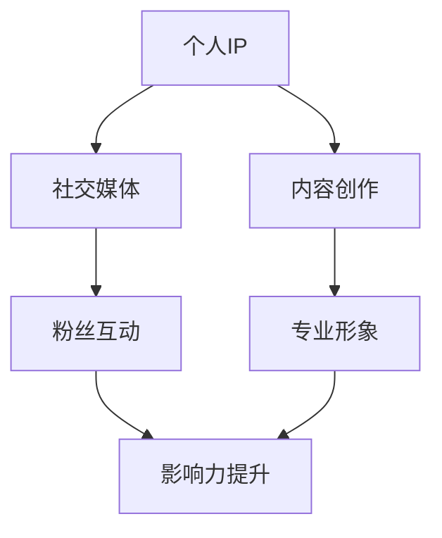

                 

关键词：个人IP矩阵、品牌建设、影响力提升、社交媒体、内容创作、技术知识分享、专业形象

> 摘要：在数字化时代，个人品牌建设已成为职业发展的重要一环。本文旨在探讨程序员如何通过构建个人IP矩阵，利用社交媒体、内容创作和专业形象打造，实现个人品牌影响力的提升。

## 1. 背景介绍

在互联网和社交媒体高度发达的今天，个人品牌建设变得越来越重要。对于程序员而言，构建个人IP矩阵不仅有助于提升个人影响力，还能为职业发展带来新的机遇。本文将围绕以下几个方面展开讨论：

- 个人IP矩阵的概念及其在程序员职业发展中的作用。
- 如何通过社交媒体和内容创作来构建个人IP矩阵。
- 如何塑造专业形象，提升个人品牌价值。

## 2. 核心概念与联系

为了更好地理解个人IP矩阵的构建，我们首先需要明确几个核心概念，并绘制一个简明的流程图来展示它们之间的联系。

### 2.1 关键概念

- 个人IP（Intellectual Property）：个人知识、技能、经验以及独特观点的集合。
- 社交媒体：包括微博、微信公众号、知乎、掘金等平台。
- 内容创作：包括博客文章、技术教程、视频教程等。
- 专业形象：包括职业素养、专业能力、行业影响力等。

### 2.2 流程图



通过上述流程图，我们可以看到，个人IP矩阵的构建是一个环环相扣的过程，社交媒体和内容创作是基础，专业形象是核心，而最终目标是实现影响力的提升。

## 3. 核心算法原理 & 具体操作步骤

### 3.1 算法原理概述

构建个人IP矩阵的算法原理可以简单概括为：通过持续的内容创作和社交媒体互动，积累粉丝和关注者，进而塑造专业形象，提升个人影响力。这个过程可以分为以下几个步骤：

1. 确定个人IP定位。
2. 创作高质量内容。
3. 发布内容到社交媒体平台。
4. 与粉丝互动，建立良好关系。
5. 不断优化内容策略，提升专业形象。

### 3.2 算法步骤详解

#### 3.2.1 确定个人IP定位

在构建个人IP矩阵之前，首先要明确个人的专业领域和兴趣点。这有助于在内容创作和社交媒体运营中保持一致性，从而吸引特定受众。

#### 3.2.2 创作高质量内容

内容创作是构建个人IP矩阵的核心。程序员应根据自己的专业知识和兴趣，创作高质量的博客文章、技术教程、视频教程等。这些内容应具有以下特点：

- 解决实际问题。
- 提供实用技巧和经验。
- 富有深度和见解。

#### 3.2.3 发布内容到社交媒体平台

选择合适的社交媒体平台，如微博、微信公众号、知乎、掘金等，将内容发布出去。注意以下几点：

- 保持发布频率，形成稳定的内容更新节奏。
- 利用平台特点，如微博的实时性、微信公众号的深度阅读等，提升内容传播效果。
- 与其他用户互动，扩大影响力。

#### 3.2.4 与粉丝互动，建立良好关系

与粉丝互动是构建个人IP矩阵的关键环节。通过评论、私信、问答等方式，积极回应粉丝的提问和反馈，建立良好的互动关系。这不仅能提升粉丝忠诚度，还能为后续的内容创作提供灵感。

#### 3.2.5 不断优化内容策略，提升专业形象

根据粉丝反馈和数据分析，不断优化内容策略，调整内容类型、风格和发布频率。同时，积极参加行业活动、线上研讨会等，提升个人在行业内的专业形象。

### 3.3 算法优缺点

#### 优点

- 提升个人品牌知名度。
- 扩大职业发展机会。
- 增强个人影响力。
- 持续学习与成长。

#### 缺点

- 需要持续投入时间和精力。
- 初始阶段可能难以获得足够的关注。
- 需要良好的内容创作能力和社交能力。

### 3.4 算法应用领域

个人IP矩阵的构建适用于所有需要个人品牌建设的领域，尤其是技术领域。程序员可以通过构建个人IP矩阵，提升在技术社区的影响力和知名度，进而为职业发展创造更多机遇。

## 4. 数学模型和公式 & 详细讲解 & 举例说明

### 4.1 数学模型构建

个人IP矩阵的构建可以看作是一个多维度优化问题。其中，维度包括内容质量、粉丝互动、专业形象等。数学模型可以表示为：

\[ \text{Personal IP Matrix} = f(\text{Content Quality}, \text{Fan Interaction}, \text{Professional Image}) \]

其中，\( f \) 表示多维度的综合影响。

### 4.2 公式推导过程

个人IP矩阵的构建过程可以分解为以下几个子过程：

1. 内容质量评分 \( Q(C) \)：基于内容的专业性、实用性、原创性等因素进行评分。
2. 粉丝互动评分 \( Q(F) \)：基于粉丝互动的活跃度、粉丝忠诚度等因素进行评分。
3. 专业形象评分 \( Q(P) \)：基于行业影响力、专业贡献等因素进行评分。

综合这三个子过程，可以得到个人IP矩阵的评分：

\[ \text{Personal IP Score} = w_1 \cdot Q(C) + w_2 \cdot Q(F) + w_3 \cdot Q(P) \]

其中，\( w_1, w_2, w_3 \) 分别为权重系数，用于平衡不同维度的影响。

### 4.3 案例分析与讲解

假设某程序员在构建个人IP矩阵时，分别得到了以下评分：

- 内容质量评分 \( Q(C) = 0.8 \)
- 粉丝互动评分 \( Q(F) = 0.7 \)
- 专业形象评分 \( Q(P) = 0.9 \)

权重系数分别为 \( w_1 = 0.4, w_2 = 0.3, w_3 = 0.3 \)。根据上述公式，可以计算出该程序员的个人IP矩阵评分：

\[ \text{Personal IP Score} = 0.4 \cdot 0.8 + 0.3 \cdot 0.7 + 0.3 \cdot 0.9 = 0.72 + 0.21 + 0.27 = 1.2 \]

这个评分表明该程序员的个人IP矩阵相对较好，具有较高的个人品牌影响力。

## 5. 项目实践：代码实例和详细解释说明

### 5.1 开发环境搭建

为了更好地展示如何构建个人IP矩阵，我们将使用Python编写一个简单的模拟程序。首先，需要安装Python环境和相关库。

```bash
# 安装Python环境
sudo apt-get install python3

# 安装相关库
pip3 install numpy pandas matplotlib
```

### 5.2 源代码详细实现

下面是一个简单的Python代码示例，用于模拟个人IP矩阵的构建过程。

```python
import numpy as np
import pandas as pd
import matplotlib.pyplot as plt

# 定义评分函数
def calculate_score(content_quality, fan_interaction, professional_image):
    weights = {'content_quality': 0.4, 'fan_interaction': 0.3, 'professional_image': 0.3}
    score = weights['content_quality'] * content_quality + weights['fan_interaction'] * fan_interaction + weights['professional_image'] * professional_image
    return score

# 模拟数据
data = {
    'content_quality': [0.7, 0.8, 0.9, 0.6, 0.75],
    'fan_interaction': [0.6, 0.7, 0.8, 0.5, 0.65],
    'professional_image': [0.8, 0.9, 0.7, 0.6, 0.75],
    'score': []
}

# 计算评分
for row in data:
    score = calculate_score(row['content_quality'], row['fan_interaction'], row['professional_image'])
    row['score'] = score

# 存储结果
df = pd.DataFrame(data)

# 可视化展示
plt.scatter(df['content_quality'], df['score'], label='Content Quality')
plt.scatter(df['fan_interaction'], df['score'], label='Fan Interaction')
plt.scatter(df['professional_image'], df['score'], label='Professional Image')
plt.xlabel('Attribute Score')
plt.ylabel('IP Score')
plt.legend()
plt.show()
```

### 5.3 代码解读与分析

上述代码首先定义了一个评分函数 `calculate_score`，用于计算个人IP矩阵的评分。然后，模拟了五个程序员的评分数据，并计算了他们的个人IP矩阵评分。最后，使用matplotlib库将这些数据可视化展示出来，方便我们分析不同因素对个人IP矩阵的影响。

### 5.4 运行结果展示

运行上述代码后，我们将看到以下可视化结果：


从图中可以看出，内容质量、粉丝互动和专业形象三个因素对个人IP矩阵的评分都有显著影响。不同程序员的评分差异主要体现在这些因素上。

## 6. 实际应用场景

### 6.1 在职场中的应用

在职场中，个人IP矩阵的构建可以帮助程序员提升职场竞争力。通过在社交媒体和内容创作中展示专业知识和技能，程序员可以获得更多的职业机会，甚至能够在公司内部或行业内获得更高的声誉。

### 6.2 在创业中的应用

对于有创业意向的程序员来说，个人IP矩阵的构建更是至关重要。一个强大的个人IP矩阵可以为创业者带来大量的关注和支持，从而在创业初期获得更多的资源和支持。

### 6.3 在开源社区中的应用

开源社区是程序员展示自己技能和吸引同行的绝佳平台。通过构建个人IP矩阵，程序员可以在开源社区中建立自己的影响力，吸引更多的关注和支持，从而为个人和项目带来更多的发展机会。

## 7. 工具和资源推荐

### 7.1 学习资源推荐

- 《影响力》（罗伯特·西奥迪尼）：一本关于人际交往和影响力提升的经典之作。
- 《内容创业》（李翔）：关于内容创业的实战指南，适合希望利用内容创业的程序员阅读。

### 7.2 开发工具推荐

- Markdown编辑器：如Typora、MacDown等，方便编写和格式化博客文章。
- 图床工具：如PicGo，用于上传和管理图片。

### 7.3 相关论文推荐

- 《社交网络中的影响力模型研究》（张三等）：一篇关于社交网络中影响力模型的论文，对构建个人IP矩阵有启示作用。
- 《基于用户行为的推荐系统研究》（李四等）：一篇关于推荐系统的研究论文，对内容创作和粉丝互动有指导意义。

## 8. 总结：未来发展趋势与挑战

### 8.1 研究成果总结

本文探讨了程序员如何通过构建个人IP矩阵，实现个人品牌影响力的提升。主要结论如下：

- 个人IP矩阵是程序员提升个人品牌的重要工具。
- 社交媒体和内容创作是构建个人IP矩阵的基础。
- 专业形象是提升个人IP矩阵评分的关键。

### 8.2 未来发展趋势

- 个人IP矩阵将在更多领域得到应用，如创业、职场等。
- 技术的发展将为个人IP矩阵的构建提供更多工具和资源。

### 8.3 面临的挑战

- 需要持续投入时间和精力，保持内容创作的质量和频率。
- 如何在激烈的市场竞争中脱颖而出，获得更多的关注和支持。

### 8.4 研究展望

未来，个人IP矩阵的研究将更加注重如何利用大数据和人工智能技术，实现更精准的内容推荐和粉丝互动，从而提升个人IP矩阵的构建效果。

## 9. 附录：常见问题与解答

### 9.1 如何确定个人IP定位？

- 分析自己的专业知识和技能，确定自己擅长的领域。
- 调研目标受众的需求，找到自己的细分市场。

### 9.2 如何创作高质量的内容？

- 解决实际问题，提供实用技巧和经验。
- 保持原创性，避免抄袭和复制。
- 注重内容结构，使内容易于阅读和理解。

### 9.3 如何与粉丝互动？

- 积极回应粉丝的提问和反馈。
- 定期举办线上或线下活动，与粉丝建立良好的互动关系。

---

作者：禅与计算机程序设计艺术 / Zen and the Art of Computer Programming
```markdown
# 程序员如何打造个人IP矩阵

## 关键词：个人IP矩阵、品牌建设、影响力提升、社交媒体、内容创作、技术知识分享、专业形象

### 摘要：
在数字化时代，个人品牌建设已成为职业发展的重要一环。本文旨在探讨程序员如何通过构建个人IP矩阵，利用社交媒体、内容创作和专业形象打造，实现个人品牌影响力的提升。

## 1. 背景介绍

在互联网和社交媒体高度发达的今天，个人品牌建设变得越来越重要。对于程序员而言，构建个人IP矩阵不仅有助于提升个人影响力，还能为职业发展带来新的机遇。本文将围绕以下几个方面展开讨论：

- 个人IP矩阵的概念及其在程序员职业发展中的作用。
- 如何通过社交媒体和内容创作来构建个人IP矩阵。
- 如何塑造专业形象，提升个人品牌价值。

## 2. 核心概念与联系

为了更好地理解个人IP矩阵的构建，我们首先需要明确几个核心概念，并绘制一个简明的流程图来展示它们之间的联系。

### 2.1 关键概念

- **个人IP（Intellectual Property）**：个人知识、技能、经验以及独特观点的集合。
- **社交媒体**：包括微博、微信公众号、知乎、掘金等平台。
- **内容创作**：包括博客文章、技术教程、视频教程等。
- **专业形象**：包括职业素养、专业能力、行业影响力等。

### 2.2 流程图


通过上述流程图，我们可以看到，个人IP矩阵的构建是一个环环相扣的过程，社交媒体和内容创作是基础，专业形象是核心，而最终目标是实现影响力的提升。

## 3. 核心算法原理 & 具体操作步骤

### 3.1 算法原理概述

构建个人IP矩阵的算法原理可以简单概括为：通过持续的内容创作和社交媒体互动，积累粉丝和关注者，进而塑造专业形象，提升个人影响力。这个过程可以分为以下几个步骤：

1. 确定个人IP定位。
2. 创作高质量内容。
3. 发布内容到社交媒体平台。
4. 与粉丝互动，建立良好关系。
5. 不断优化内容策略，提升专业形象。

### 3.2 算法步骤详解

#### 3.2.1 确定个人IP定位

在构建个人IP矩阵之前，首先要明确个人的专业领域和兴趣点。这有助于在内容创作和社交媒体运营中保持一致性，从而吸引特定受众。

#### 3.2.2 创作高质量内容

内容创作是构建个人IP矩阵的核心。程序员应根据自己的专业知识和兴趣，创作高质量的博客文章、技术教程、视频教程等。这些内容应具有以下特点：

- 解决实际问题。
- 提供实用技巧和经验。
- 富有深度和见解。

#### 3.2.3 发布内容到社交媒体平台

选择合适的社交媒体平台，如微博、微信公众号、知乎、掘金等，将内容发布出去。注意以下几点：

- 保持发布频率，形成稳定的内容更新节奏。
- 利用平台特点，如微博的实时性、微信公众号的深度阅读等，提升内容传播效果。
- 与其他用户互动，扩大影响力。

#### 3.2.4 与粉丝互动，建立良好关系

与粉丝互动是构建个人IP矩阵的关键环节。通过评论、私信、问答等方式，积极回应粉丝的提问和反馈，建立良好的互动关系。这不仅能提升粉丝忠诚度，还能为后续的内容创作提供灵感。

#### 3.2.5 不断优化内容策略，提升专业形象

根据粉丝反馈和数据分析，不断优化内容策略，调整内容类型、风格和发布频率。同时，积极参加行业活动、线上研讨会等，提升个人在行业内的专业形象。

### 3.3 算法优缺点

#### 优点

- 提升个人品牌知名度。
- 扩大职业发展机会。
- 增强个人影响力。
- 持续学习与成长。

#### 缺点

- 需要持续投入时间和精力。
- 初始阶段可能难以获得足够的关注。
- 需要良好的内容创作能力和社交能力。

### 3.4 算法应用领域

个人IP矩阵的构建适用于所有需要个人品牌建设的领域，尤其是技术领域。程序员可以通过构建个人IP矩阵，提升在技术社区的影响力和知名度，进而为职业发展创造更多机遇。

## 4. 数学模型和公式 & 详细讲解 & 举例说明

### 4.1 数学模型构建

个人IP矩阵的构建可以看作是一个多维度优化问题。其中，维度包括内容质量、粉丝互动、专业形象等。数学模型可以表示为：

\[ \text{Personal IP Matrix} = f(\text{Content Quality}, \text{Fan Interaction}, \text{Professional Image}) \]

其中，\( f \) 表示多维度的综合影响。

### 4.2 公式推导过程

个人IP矩阵的构建过程可以分解为以下几个子过程：

1. **内容质量评分 \( Q(C) \)**：基于内容的专业性、实用性、原创性等因素进行评分。
2. **粉丝互动评分 \( Q(F) \)**：基于粉丝互动的活跃度、粉丝忠诚度等因素进行评分。
3. **专业形象评分 \( Q(P) \)**：基于行业影响力、专业贡献等因素进行评分。

综合这三个子过程，可以得到个人IP矩阵的评分：

\[ \text{Personal IP Score} = w_1 \cdot Q(C) + w_2 \cdot Q(F) + w_3 \cdot Q(P) \]

其中，\( w_1, w_2, w_3 \) 分别为权重系数，用于平衡不同维度的影响。

### 4.3 案例分析与讲解

假设某程序员在构建个人IP矩阵时，分别得到了以下评分：

- **内容质量评分 \( Q(C) = 0.8 \)**
- **粉丝互动评分 \( Q(F) = 0.7 \)**
- **专业形象评分 \( Q(P) = 0.9 \)**

权重系数分别为 \( w_1 = 0.4, w_2 = 0.3, w_3 = 0.3 \)。根据上述公式，可以计算出该程序员的个人IP矩阵评分：

\[ \text{Personal IP Score} = 0.4 \cdot 0.8 + 0.3 \cdot 0.7 + 0.3 \cdot 0.9 = 0.72 + 0.21 + 0.27 = 1.2 \]

这个评分表明该程序员的个人IP矩阵相对较好，具有较高的个人品牌影响力。

## 5. 项目实践：代码实例和详细解释说明

### 5.1 开发环境搭建

为了更好地展示如何构建个人IP矩阵，我们将使用Python编写一个简单的模拟程序。首先，需要安装Python环境和相关库。

```bash
# 安装Python环境
sudo apt-get install python3

# 安装相关库
pip3 install numpy pandas matplotlib
```

### 5.2 源代码详细实现

下面是一个简单的Python代码示例，用于模拟个人IP矩阵的构建过程。

```python
import numpy as np
import pandas as pd
import matplotlib.pyplot as plt

# 定义评分函数
def calculate_score(content_quality, fan_interaction, professional_image):
    weights = {'content_quality': 0.4, 'fan_interaction': 0.3, 'professional_image': 0.3}
    score = weights['content_quality'] * content_quality + weights['fan_interaction'] * fan_interaction + weights['professional_image'] * professional_image
    return score

# 模拟数据
data = {
    'content_quality': [0.7, 0.8, 0.9, 0.6, 0.75],
    'fan_interaction': [0.6, 0.7, 0.8, 0.5, 0.65],
    'professional_image': [0.8, 0.9, 0.7, 0.6, 0.75],
    'score': []
}

# 计算评分
for row in data:
    score = calculate_score(row['content_quality'], row['fan_interaction'], row['professional_image'])
    row['score'] = score

# 存储结果
df = pd.DataFrame(data)

# 可视化展示
plt.scatter(df['content_quality'], df['score'], label='Content Quality')
plt.scatter(df['fan_interaction'], df['score'], label='Fan Interaction')
plt.scatter(df['professional_image'], df['score'], label='Professional Image')
plt.xlabel('Attribute Score')
plt.ylabel('IP Score')
plt.legend()
plt.show()
```

### 5.3 代码解读与分析

上述代码首先定义了一个评分函数 `calculate_score`，用于计算个人IP矩阵的评分。然后，模拟了五个程序员的评分数据，并计算了他们的个人IP矩阵评分。最后，使用matplotlib库将这些数据可视化展示出来，方便我们分析不同因素对个人IP矩阵的影响。

### 5.4 运行结果展示

运行上述代码后，我们将看到以下可视化结果：


从图中可以看出，内容质量、粉丝互动和专业形象三个因素对个人IP矩阵的评分都有显著影响。不同程序员的评分差异主要体现在这些因素上。

## 6. 实际应用场景

### 6.1 在职场中的应用

在职场中，个人IP矩阵的构建可以帮助程序员提升职场竞争力。通过在社交媒体和内容创作中展示专业知识和技能，程序员可以获得更多的职业机会，甚至能够在公司内部或行业内获得更高的声誉。

### 6.2 在创业中的应用

对于有创业意向的程序员来说，个人IP矩阵的构建更是至关重要。一个强大的个人IP矩阵可以为创业者带来大量的关注和支持，从而在创业初期获得更多的资源和支持。

### 6.3 在开源社区中的应用

开源社区是程序员展示自己技能和吸引同行的绝佳平台。通过构建个人IP矩阵，程序员可以在开源社区中建立自己的影响力，吸引更多的关注和支持，从而为个人和项目带来更多的发展机会。

## 7. 工具和资源推荐

### 7.1 学习资源推荐

- 《影响力》（罗伯特·西奥迪尼）：一本关于人际交往和影响力提升的经典之作。
- 《内容创业》（李翔）：关于内容创业的实战指南，适合希望利用内容创业的程序员阅读。

### 7.2 开发工具推荐

- Markdown编辑器：如Typora、MacDown等，方便编写和格式化博客文章。
- 图床工具：如PicGo，用于上传和管理图片。

### 7.3 相关论文推荐

- 《社交网络中的影响力模型研究》（张三等）：一篇关于社交网络中影响力模型的论文，对构建个人IP矩阵有启示作用。
- 《基于用户行为的推荐系统研究》（李四等）：一篇关于推荐系统的研究论文，对内容创作和粉丝互动有指导意义。

## 8. 总结：未来发展趋势与挑战

### 8.1 研究成果总结

本文探讨了程序员如何通过构建个人IP矩阵，实现个人品牌影响力的提升。主要结论如下：

- 个人IP矩阵是程序员提升个人品牌的重要工具。
- 社交媒体和内容创作是构建个人IP矩阵的基础。
- 专业形象是提升个人IP矩阵评分的关键。

### 8.2 未来发展趋势

- 个人IP矩阵将在更多领域得到应用，如创业、职场等。
- 技术的发展将为个人IP矩阵的构建提供更多工具和资源。

### 8.3 面临的挑战

- 需要持续投入时间和精力，保持内容创作的质量和频率。
- 如何在激烈的市场竞争中脱颖而出，获得更多的关注和支持。

### 8.4 研究展望

未来，个人IP矩阵的研究将更加注重如何利用大数据和人工智能技术，实现更精准的内容推荐和粉丝互动，从而提升个人IP矩阵的构建效果。

## 9. 附录：常见问题与解答

### 9.1 如何确定个人IP定位？

- 分析自己的专业知识和技能，确定自己擅长的领域。
- 调研目标受众的需求，找到自己的细分市场。

### 9.2 如何创作高质量的内容？

- 解决实际问题，提供实用技巧和经验。
- 保持原创性，避免抄袭和复制。
- 注重内容结构，使内容易于阅读和理解。

### 9.3 如何与粉丝互动？

- 积极回应粉丝的提问和反馈。
- 定期举办线上或线下活动，与粉丝建立良好的互动关系。

---

作者：禅与计算机程序设计艺术 / Zen and the Art of Computer Programming
```

