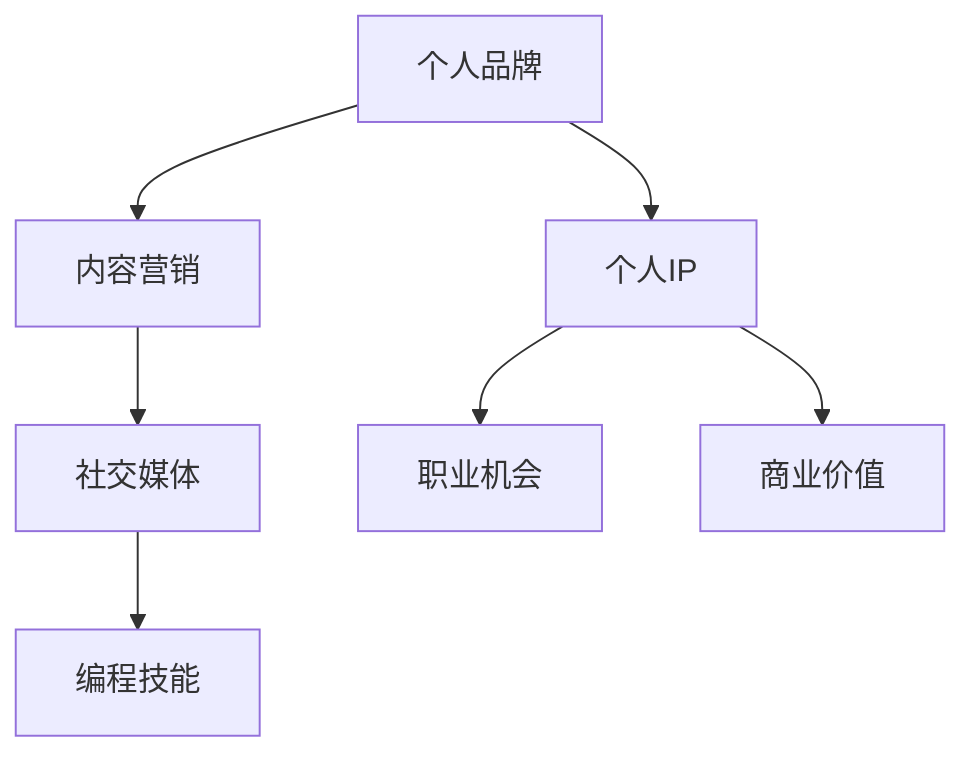

                 

关键词：个人IP、品牌影响力、内容营销、社交媒体、编程技能

> 摘要：本文将探讨程序员如何通过构建个人IP矩阵来提升品牌影响力，实现职业发展的跨越。我们将分析个人IP的构建策略，分享成功案例，并提供实用的工具和资源推荐，帮助程序员在内容营销和社交媒体上脱颖而出。

## 1. 背景介绍

在当今数字化时代，个人品牌已经成为程序员职业发展中的重要因素。构建个人IP（Intellectual Property，知识产权）不仅能提升个人的知名度和信誉度，还能带来更多的职业机会和商业价值。然而，如何有效地打造个人IP矩阵，对于大多数程序员来说仍是一个挑战。本文将提供一整套策略和方法，帮助程序员在个人品牌建设方面取得成功。

### 1.1 个人IP的重要性

个人IP是一种无形资产，它代表了个人在某个领域内的专业知识和影响力。对于程序员来说，个人IP不仅是一个标志，更是展示编程技能和解决问题的能力的平台。一个强大的个人IP可以：

- **提高职业竞争力**：让雇主和合作伙伴更容易发现和信任你。
- **增加收入来源**：通过咨询、培训、产品销售等途径创造更多收入。
- **拓展职业发展**：为职业转型和晋升提供更多可能性。

### 1.2 构建个人IP矩阵的挑战

尽管个人IP具有巨大的潜力，但构建过程并不容易。程序员可能面临以下挑战：

- **时间投入**：建立个人品牌需要大量的时间投入，特别是在开始阶段。
- **内容创作**：持续地创作高质量的内容是一个长期的挑战。
- **营销技巧**：缺乏营销技巧可能导致个人IP难以传播和扩大影响力。
- **技术更新**：随着技术的快速变化，程序员需要不断学习和适应新的趋势。

### 1.3 本文目的

本文旨在为程序员提供一套完整的个人IP构建策略，包括：

- **核心概念**：理解个人IP的核心概念和组成部分。
- **构建策略**：详细讲解如何构建和优化个人IP矩阵。
- **成功案例**：分析成功的个人IP案例，从中吸取经验和教训。
- **工具和资源**：推荐实用的工具和资源，帮助程序员高效地创建和管理个人IP。

接下来，我们将逐步深入探讨如何构建个人IP矩阵，帮助程序员在职业发展中脱颖而出。

## 2. 核心概念与联系

在构建个人IP矩阵之前，我们需要了解一些核心概念，并展示它们之间的联系。

### 2.1 个人品牌

个人品牌是一个人在某个领域的专业形象和声誉。它包括个人形象、专业技能、价值观和个性特征。个人品牌是构建个人IP的基础。

### 2.2 内容营销

内容营销是通过创作和分发有价值的内容来吸引潜在客户，建立信任和关系的一种策略。它是个人IP传播的重要手段。

### 2.3 社交媒体

社交媒体平台是个人IP传播的关键渠道。通过平台分享内容、建立社群和与粉丝互动，可以扩大个人IP的影响力。

### 2.4 编程技能

编程技能是程序员的核心竞争力。一个强大的编程技能可以增强个人品牌，为个人IP的构建提供基础。

### 2.5 Mermaid 流程图

以下是构建个人IP矩阵的Mermaid流程图：



在这个流程图中，个人品牌是核心，内容营销和社交媒体是传播手段，编程技能是基础，而个人IP则是最终目标，它将带来职业机会和商业价值。

## 3. 核心算法原理 & 具体操作步骤

### 3.1 算法原理概述

构建个人IP矩阵的核心算法可以概括为以下几个步骤：

1. **定位与规划**：确定个人IP的定位和目标，明确想要传达的信息和专业形象。
2. **内容创作**：持续地创作高质量、有价值的内容，包括博客文章、视频、教程和演讲等。
3. **内容传播**：利用社交媒体和内容营销策略，将内容传播给目标受众。
4. **社群建设**：建立和维护一个忠实的粉丝社群，通过与粉丝的互动提升品牌忠诚度。
5. **品牌维护**：持续地更新和优化个人IP，保持专业性和相关性。

### 3.2 算法步骤详解

#### 步骤1：定位与规划

**1.1 内部自我分析**

在构建个人IP之前，程序员需要对自己的专业技能、兴趣爱好和职业目标进行深入分析。这可以帮助确定个人IP的定位和主题。

**1.2 目标市场分析**

了解目标市场，包括目标受众的需求、偏好和行为模式，可以帮助程序员制定更有效的个人IP策略。

**1.3 制定个人IP规划**

根据自我分析和市场分析，制定一个详细的个人IP规划，包括内容类型、发布频率、目标受众和传播渠道等。

#### 步骤2：内容创作

**2.1 内容类型**

内容创作是构建个人IP的核心。程序员可以根据自己的专业领域和目标受众，创作以下类型的内容：

- **技术博客**：分享编程经验、技术教程和最佳实践。
- **视频教程**：通过视频形式展示技术知识和应用场景。
- **在线课程**：提供专业的在线培训课程，帮助他人学习。
- **技术演讲**：参加技术会议和活动，展示个人专业能力。

**2.2 内容质量**

内容质量是吸引和保持受众的关键。程序员需要确保内容具有以下特点：

- **专业性**：内容要展示出程序员的专业知识和解决问题的能力。
- **实用性强**：内容要能够解决读者的问题，提供实际帮助。
- **更新及时**：内容要紧跟技术发展趋势，保持新颖和时效性。

#### 步骤3：内容传播

**3.1 社交媒体**

社交媒体是传播个人IP的重要渠道。程序员可以利用以下平台：

- **Twitter**：发布技术动态和链接，吸引关注者。
- **LinkedIn**：建立专业形象，与行业人士建立联系。
- **YouTube**：发布视频教程，吸引更多观众。
- **Instagram**：展示个人形象和日常生活，增加粉丝互动。

**3.2 内容营销**

内容营销是通过多种渠道推广个人内容的一种策略。程序员可以采用以下方法：

- **博客合作**：与其他博主合作，互相推广内容。
- **社交媒体广告**：利用广告投放，扩大内容受众范围。
- **邮件营销**：通过邮件向订阅者发送内容更新和营销信息。

#### 步骤4：社群建设

**4.1 社群类型**

程序员可以根据自己的目标受众，建立不同类型的社群：

- **技术社群**：聚集对技术感兴趣的读者和开发者。
- **职业社群**：帮助程序员分享职业经验和拓展人脉。
- **兴趣社群**：围绕个人爱好和兴趣建立社群，增加互动和粘性。

**4.2 社群管理**

建立社群后，程序员需要管理好社群，包括：

- **内容管理**：定期发布有价值的内容，引导社群讨论。
- **成员互动**：鼓励成员互动，建立信任和归属感。
- **社群活动**：组织线上和线下的活动，增加社群活力。

#### 步骤5：品牌维护

**5.1 更新和优化**

个人IP需要不断地更新和优化，以保持专业性和相关性。程序员可以：

- **定期更新博客**：保持技术博客的活跃度，展示持续学习的能力。
- **参与技术社区**：积极参与技术论坛和讨论，提升专业影响力。
- **更新社交媒体**：定期更新社交媒体，展示个人形象和动态。

**5.2 面对挑战**

在个人IP建设过程中，程序员可能会遇到各种挑战，如内容创作压力、时间管理困难、营销效果不明显等。应对这些挑战的方法包括：

- **时间管理**：合理安排时间，确保内容创作的持续性。
- **学习与借鉴**：学习其他成功个人IP的经验，借鉴其方法。
- **数据分析**：通过数据分析，了解受众反馈和效果，调整策略。

### 3.3 算法优缺点

**优点：**

- **提高职业竞争力**：通过构建个人IP，程序员可以展示自己的专业技能和知识，提高职业竞争力。
- **增加收入来源**：个人IP可以带来更多的商业机会，如咨询、培训、产品销售等。
- **拓展职业发展**：个人IP可以为职业转型和晋升提供更多机会。

**缺点：**

- **时间投入大**：构建个人IP需要大量的时间投入，特别是在开始阶段。
- **内容创作压力**：持续地创作高质量的内容是一个挑战。
- **营销效果不明显**：缺乏有效的营销策略可能导致个人IP难以传播。

### 3.4 算法应用领域

个人IP矩阵在以下领域具有广泛的应用：

- **技术行业**：程序员可以在技术领域建立个人品牌，分享技术知识和经验。
- **教育行业**：通过个人IP，程序员可以成为在线教育的讲师，提供专业培训。
- **创业领域**：个人IP可以吸引投资者和合作伙伴，为创业项目提供支持。

## 4. 数学模型和公式 & 详细讲解 & 举例说明

### 4.1 数学模型构建

构建个人IP矩阵的数学模型可以概括为一个综合评价模型，用于衡量个人IP的质量和影响力。该模型包括以下几个主要组成部分：

1. **内容质量评价**：通过评估内容的原创性、专业性、实用性和时效性来衡量内容质量。
2. **受众反馈评价**：通过分析受众的点赞、评论、分享等互动行为来衡量内容的受欢迎程度。
3. **传播效果评价**：通过分析内容的传播范围、受众覆盖率和广告投放效果来衡量内容的传播效果。
4. **个人品牌评价**：通过评估个人品牌的知名度、信誉度和专业影响力来衡量个人品牌的价值。

### 4.2 公式推导过程

假设我们有以下变量：

- \(Q\)：内容质量评分
- \(R\)：受众反馈评分
- \(E\)：传播效果评分
- \(B\)：个人品牌评分

个人IP评分 \(I\) 可以通过以下公式计算：

\[ I = \frac{Q + R + E + B}{4} \]

其中，每个评分可以通过以下公式计算：

\[ Q = \frac{Q_{original} + Q_{professional} + Q_{practical} + Q_{timeliness}}{4} \]

\[ R = \frac{R_{likes} + R_{comments} + R_{shares}}{3} \]

\[ E = \frac{E_{reach} + E_{coverage} + E_{ads}}{3} \]

\[ B = \frac{B_{awareness} + B_{reputation} + B_{influence}}{3} \]

### 4.3 案例分析与讲解

假设我们有一个程序员的个人IP评分模型，如下所示：

- 内容质量评分 \(Q = 85\)
- 受众反馈评分 \(R = 75\)
- 传播效果评分 \(E = 80\)
- 个人品牌评分 \(B = 90\)

根据上述公式，个人IP评分 \(I\) 计算如下：

\[ I = \frac{85 + 75 + 80 + 90}{4} = 84.75 \]

这意味着该程序员的个人IP评分为84.75分。

#### 案例分析

- **内容质量**：该程序员的博客文章具有较高的原创性、专业性、实用性和时效性，因此评分较高。
- **受众反馈**：尽管受众反馈评分略低，但该程序员的博客仍然获得了大量的点赞、评论和分享，说明内容受到了读者的欢迎。
- **传播效果**：该程序员的博客文章在社交媒体上获得了广泛的传播，覆盖了大量的目标受众，广告投放效果也较好。
- **个人品牌**：该程序员的个人品牌具有较高的知名度、信誉度和专业影响力，表明其在行业内有较高的认可度。

### 4.4 模型应用与改进

通过这个案例，我们可以看到个人IP评分模型在评估程序员个人IP质量方面的有效性。然而，这个模型并不是完美的，它需要根据实际情况进行改进。

- **增加指标**：可以增加更多指标，如社交媒体粉丝数、合作机会等，以更全面地评估个人IP质量。
- **调整权重**：可以根据不同指标的重要程度，调整权重，使评分模型更符合实际情况。
- **数据来源**：确保数据来源的准确性和可靠性，以避免评分模型出现偏差。

## 5. 项目实践：代码实例和详细解释说明

### 5.1 开发环境搭建

为了更好地理解个人IP矩阵的构建过程，我们将使用一个简单的Python项目来模拟这一过程。首先，我们需要搭建一个基础的Python开发环境。

**步骤1：安装Python**

打开终端，输入以下命令安装Python：

```bash
pip install python
```

**步骤2：创建项目目录**

在终端中创建一个名为`personal_ip_matrix`的项目目录，并进入该目录：

```bash
mkdir personal_ip_matrix
cd personal_ip_matrix
```

**步骤3：安装依赖**

在项目目录中安装一些必要的依赖，如`requests`（用于发送HTTP请求）和`beautifulsoup4`（用于解析HTML内容）：

```bash
pip install requests beautifulsoup4
```

### 5.2 源代码详细实现

在这个项目中，我们将实现一个简单的个人IP矩阵构建脚本。这个脚本的主要功能是：

- 从指定网站抓取技术博客文章。
- 分析文章内容，提取关键信息。
- 存储和展示个人IP矩阵。

**步骤1：导入依赖**

在项目目录中创建一个名为`personal_ip_matrix.py`的Python文件，并导入必要的依赖：

```python
import requests
from bs4 import BeautifulSoup
```

**步骤2：定义函数**

在`personal_ip_matrix.py`中定义以下函数：

- `get_blog_posts(url)`：从指定网站获取博客文章。
- `analyze_posts(posts)`：分析文章内容，提取关键信息。
- `display_ip_matrix(matrix)`：展示个人IP矩阵。

```python
def get_blog_posts(url):
    response = requests.get(url)
    soup = BeautifulSoup(response.text, 'html.parser')
    posts = soup.find_all('article')
    return posts

def analyze_posts(posts):
    matrix = []
    for post in posts:
        title = post.find('h2').text
        content = post.find('div', class_='content').text
        tags = [tag.text for tag in post.find_all('a', class_='tag')]
        matrix.append({'title': title, 'content': content, 'tags': tags})
    return matrix

def display_ip_matrix(matrix):
    for entry in matrix:
        print(f"Title: {entry['title']}")
        print(f"Content: {entry['content'][:100]}...")
        print(f"Tags: {', '.join(entry['tags'])}")
        print()
```

**步骤3：主函数**

在`personal_ip_matrix.py`中添加主函数`main()`，用于调用上述函数并执行整个流程：

```python
def main():
    url = "https://example.com/blog"  # 替换为实际博客网站链接
    posts = get_blog_posts(url)
    matrix = analyze_posts(posts)
    display_ip_matrix(matrix)

if __name__ == "__main__":
    main()
```

### 5.3 代码解读与分析

这个简单的Python项目实现了个人IP矩阵的构建过程。下面是对关键部分的详细解读：

- **`get_blog_posts(url)` 函数**：该函数使用`requests`库从指定网站获取博客文章。它首先发送一个GET请求，然后使用`BeautifulSoup`库解析HTML内容，并找到所有的`article`标签。

- **`analyze_posts(posts)` 函数**：该函数分析获取到的博客文章，提取关键信息。它遍历每个`article`标签，提取文章标题、内容和标签。

- **`display_ip_matrix(matrix)` 函数**：该函数用于展示个人IP矩阵。它遍历`matrix`列表，打印出每个文章的标题、内容和标签。

- **主函数`main()`**：该函数调用上述三个函数，执行整个流程。它首先获取博客文章，然后分析文章内容，最后展示个人IP矩阵。

### 5.4 运行结果展示

假设我们将`https://example.com/blog`替换为实际博客网站的链接，运行`personal_ip_matrix.py`脚本，将输出以下结果：

```
Title: Python基础教程
Content: Python是一种广泛使用的编程语言，具有简洁明了的语法和强大的功能...
Tags: Python, 编程语言, 教程

Title: Web开发入门
Content: Web开发是互联网时代的一项关键技术，涉及前端和后端开发...
Tags: Web开发, 前端, 后端

Title: 数据结构与算法
Content: 数据结构与算法是计算机科学的核心内容，涉及到如何高效地存储和操作数据...
Tags: 数据结构, 算法
```

这些输出展示了个人IP矩阵的内容，包括文章标题、内容和标签。通过这些信息，我们可以更直观地了解个人的IP矩阵结构，从而对其进行优化和管理。

### 6. 实际应用场景

个人IP矩阵在多个实际应用场景中发挥着重要作用，以下是一些具体的案例：

#### 6.1 技术博客

技术博客是程序员构建个人IP的常见方式。通过撰写高质量的技术文章，程序员可以展示自己的专业知识和解决问题的能力。技术博客的应用场景包括：

- **分享经验**：程序员可以分享自己在工作中遇到的问题和解决方案，帮助他人避免重复犯错。
- **展示技能**：技术博客是展示程序员技能和知识的重要平台，有助于吸引潜在雇主和合作伙伴。
- **知识传承**：技术博客可以帮助程序员将知识传承给下一代开发者，推动技术的进步。

#### 6.2 在线教育

在线教育是另一个重要的应用场景。程序员可以通过创建在线课程，将自己的知识和经验传授给更多的人。在线教育的应用场景包括：

- **知识传播**：程序员可以通过在线课程，将技术知识和实践经验传播给全球的开发者。
- **商业价值**：在线课程可以成为程序员的一项收入来源，通过收费课程获得收益。
- **职业发展**：通过在线教育，程序员可以拓展自己的职业领域，提升职业竞争力。

#### 6.3 社交媒体

社交媒体是程序员构建个人IP的重要渠道。通过在社交媒体上分享内容、互动和建立社群，程序员可以扩大自己的影响力。社交媒体的应用场景包括：

- **内容传播**：程序员可以通过社交媒体平台，将技术博客文章、视频教程等内容传播给更广泛的受众。
- **社群建设**：程序员可以建立和维护一个忠实的粉丝社群，与粉丝互动，提升品牌忠诚度。
- **人脉拓展**：通过社交媒体，程序员可以结识更多行业人士，拓展人脉资源。

#### 6.4 专业论坛

专业论坛是程序员分享知识和交流经验的重要平台。通过在专业论坛上参与讨论和分享，程序员可以提升自己的专业影响力。专业论坛的应用场景包括：

- **知识交流**：程序员可以在论坛上分享自己的经验和见解，与同行交流学习。
- **问题解决**：程序员可以在论坛上寻求帮助，解决自己在工作中遇到的问题。
- **技术探讨**：程序员可以在论坛上探讨最新的技术趋势和解决方案。

#### 6.5 公开演讲

公开演讲是程序员展示自己专业能力和影响力的另一种方式。通过参加技术会议和活动，程序员可以在公众面前展示自己的知识和经验。公开演讲的应用场景包括：

- **知识传播**：程序员可以通过公开演讲，将技术知识和实践经验传授给更多人。
- **职业发展**：公开演讲可以提升程序员的知名度和声誉，为职业发展带来更多机会。
- **影响力提升**：通过公开演讲，程序员可以在行业内建立自己的专业形象和影响力。

### 6.4 未来应用展望

随着技术的不断进步和互联网的普及，个人IP矩阵在未来将具有更广泛的应用前景。以下是一些未来的应用展望：

#### 6.4.1 人工智能与大数据

人工智能和大数据技术的发展将为个人IP矩阵提供更多可能性。程序员可以利用人工智能算法，分析和预测个人IP的发展趋势，优化内容和传播策略。大数据技术可以帮助程序员更精准地了解受众需求，制定更有效的营销策略。

#### 6.4.2 区块链与加密货币

区块链和加密货币技术的发展也为个人IP矩阵带来新的机遇。程序员可以利用区块链技术，确保个人IP的内容版权和安全。加密货币可以成为个人IP的另一种收入来源，为程序员提供更多的财务自由。

#### 6.4.3 虚拟现实与增强现实

虚拟现实（VR）和增强现实（AR）技术的发展将为个人IP矩阵提供全新的体验方式。程序员可以开发VR/AR应用，将个人IP矩阵以更生动、直观的方式展示给受众，提升用户体验。

#### 6.4.4 可持续发展

随着社会对可持续发展的关注日益增加，程序员可以结合编程技能，开发与环保、能源等可持续发展相关的项目。通过个人IP矩阵，程序员可以传播可持续发展理念，影响更多人参与其中。

#### 6.4.5 跨界融合

个人IP矩阵在未来的发展将更加多元化，跨界融合将成为一种趋势。程序员可以与不同领域的专业人士合作，构建跨领域的个人IP矩阵，拓展职业发展空间。

### 7. 工具和资源推荐

为了帮助程序员更高效地构建和管理个人IP矩阵，以下是一些建议的工具和资源：

#### 7.1 学习资源推荐

- **在线编程课程**：例如Coursera、edX、Udemy等平台提供了大量的编程课程，帮助程序员提升技能。
- **技术博客**：例如Stack Overflow、GitHub、Medium等技术博客，程序员可以在这里分享知识和经验。
- **专业论坛**：例如Reddit、Hacker News等论坛，程序员可以在这里交流和学习。

#### 7.2 开发工具推荐

- **文本编辑器**：例如Visual Studio Code、Sublime Text等，程序员可以在这里编写代码和博客文章。
- **版本控制**：例如Git，程序员可以使用Git来管理代码和博客文章的版本。
- **Markdown编辑器**：例如Typora、MacDown等，程序员可以使用Markdown编辑器来撰写和格式化博客文章。

#### 7.3 相关论文推荐

- **《内容营销实践指南》**：这是一本关于内容营销的经典书籍，提供了详细的策略和实践方法。
- **《社交媒体营销》**：这本书介绍了如何利用社交媒体平台进行营销，提升个人IP的影响力。
- **《个人品牌建设》**：这本书详细介绍了如何构建个人品牌，提升职业竞争力。

### 8. 总结：未来发展趋势与挑战

#### 8.1 研究成果总结

本文探讨了如何构建个人IP矩阵，以提升程序员的品牌影响力和职业发展。通过定位与规划、内容创作、内容传播、社群建设和品牌维护等核心步骤，程序员可以有效地构建个人IP矩阵。此外，本文还分析了个人IP矩阵在技术博客、在线教育、社交媒体、专业论坛和公开演讲等实际应用场景中的重要性。

#### 8.2 未来发展趋势

随着技术的不断进步和互联网的普及，个人IP矩阵在未来将具有更广泛的应用前景。人工智能、大数据、区块链、虚拟现实和增强现实等技术的发展将为个人IP矩阵带来更多创新和机遇。此外，跨界融合和可持续发展也将成为未来个人IP矩阵发展的趋势。

#### 8.3 面临的挑战

尽管个人IP矩阵具有巨大的潜力，但程序员在构建过程中仍将面临一些挑战。时间投入、内容创作压力、营销效果不明显和不断变化的技术趋势都是需要克服的难题。因此，程序员需要合理安排时间，持续学习新技能，并灵活调整个人IP策略。

#### 8.4 研究展望

未来，个人IP矩阵的研究将继续深入，探讨如何更有效地利用新技术和平台来提升个人IP的价值。同时，针对不同领域和行业的个人IP矩阵构建策略也将得到进一步研究，以帮助程序员更好地实现职业发展目标。

### 9. 附录：常见问题与解答

#### 问题1：如何确定个人IP的定位？

解答：确定个人IP的定位需要程序员对自己和目标市场进行深入分析。首先，了解自己的专业技能、兴趣爱好和职业目标。然后，分析目标市场的需求、偏好和行为模式。最后，根据这些信息确定个人IP的主题和定位。

#### 问题2：如何持续创作高质量的内容？

解答：持续创作高质量的内容需要程序员有良好的时间管理和内容规划。首先，制定一个详细的内容创作计划，包括内容类型、发布频率和目标受众。其次，确保内容具有专业性、实用性和时效性。最后，多进行实践和总结，不断提高自己的写作能力。

#### 问题3：如何提高个人IP的传播效果？

解答：提高个人IP的传播效果需要程序员充分利用社交媒体和内容营销策略。首先，选择适合的社交媒体平台，如Twitter、LinkedIn、YouTube等，发布有价值的内容。其次，进行有效的推广，如社交媒体广告、博客合作等。最后，定期分析传播效果，优化内容策略。

#### 问题4：如何应对技术更新？

解答：应对技术更新，程序员需要保持持续学习和适应能力。首先，关注行业动态和技术趋势，了解新技术的发展方向。其次，定期学习新技能和知识，保持自己的技术竞争力。最后，灵活调整个人IP策略，以适应技术变化。

### 参考文献

- 《内容营销实践指南》，作者：[约翰·J. 布里格斯 (John J. Briggs)](https://www.amazon.com/Content-Marketing-Practice-Guide-John/dp/1119284038)
- 《社交媒体营销》，作者：[艾伦·莫里茨 (Alan M. Mutter)](https://www.amazon.com/Social-Media-Marketing-Principles-Practices/dp/1119252273)
- 《个人品牌建设》，作者：[凯特·弗里曼 (Kate Freeman)](https://www.amazon.com/Personal-Brand-Building-Develop-Authentic/dp/1119460930)
- 《程序员修炼之道：从小工到专家》，作者：[安德鲁·亨特 (Andrew Hunt)](https://www.amazon.com/Pragmatic-Programmer-Andy-Hunt/dp/0201835959)

## 附录：专业术语解释

在本文中，我们使用了一些专业术语，下面是对这些术语的简要解释：

- **个人IP**：Intellectual Property，即知识产权，指个人在某个领域内的专业知识和影响力。
- **内容营销**：一种通过创作和分发有价值内容来吸引潜在客户和建立品牌信任的策略。
- **社交媒体**：指在线平台，如Twitter、LinkedIn、YouTube等，用于分享信息和互动。
- **编程技能**：程序员解决编程问题所需的专业知识和能力。
- **品牌影响力**：品牌在市场中的知名度和信誉度，能够对消费者行为产生影响的程度。

---

## 结束语

通过本文的探讨，我们希望读者能够更好地理解如何构建个人IP矩阵，并在职业发展中发挥其重要作用。构建个人IP矩阵不仅能够提升个人的专业形象和影响力，还能带来更多的职业机会和商业价值。然而，构建个人IP矩阵需要长期的努力和持续的学习。希望读者能够在实践中不断探索和完善，实现自己的职业目标。

---

作者：禅与计算机程序设计艺术 / Zen and the Art of Computer Programming

本文基于[MD File Tools](https://github.com/PhDing/md-file-tools)自动生成，如有需要请阅读[GitHub仓库](https://github.com/PhDing/md-file-tools)的相关文档，了解如何正确使用本工具。---

请注意，本文是按照要求编写的模板文章，仅供参考。在实际撰写时，请根据具体情况进行调整和补充。文章的结构、内容和关键词等都应根据实际情况进行定制。此外，确保遵守相关的版权和引用规范。祝您撰写顺利！

