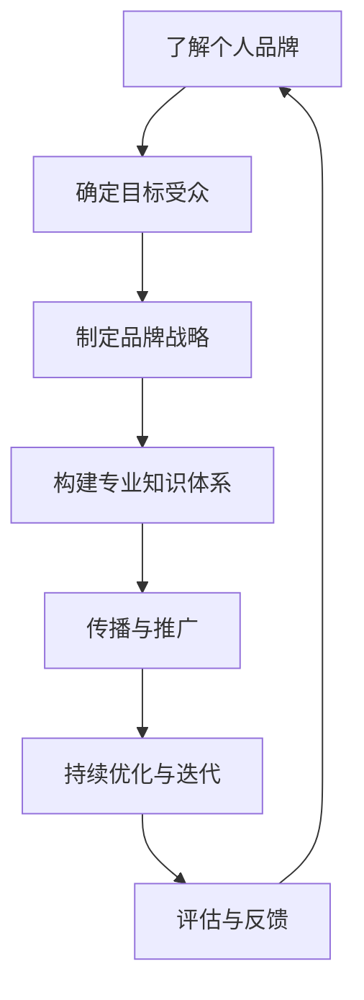

                 

 在这个数字化时代，个人品牌的重要性日益凸显。作为程序员，如何在茫茫人海中脱颖而出，打造自己的个人品牌IP，已成为众多开发者关注的话题。本文将围绕这一主题，详细探讨程序员如何通过多种策略和技巧，打造出具有影响力和竞争力的个人品牌。

## 关键词

- 个人品牌
- 程序员
- IP打造
- 影响力
- 互联网营销

## 摘要

本文旨在为程序员提供一套系统化的方法，帮助他们构建和推广个人品牌IP。通过分析个人品牌的定义、重要性以及构建个人品牌所需的关键要素，文章将介绍一系列实用的策略和技巧，帮助程序员在职业发展中实现个人品牌的成功打造。

## 1. 背景介绍

个人品牌是一种通过个人形象、专业知识和价值观传递给公众的独特标识。它不仅体现了个人的职业能力和专业水平，还能在某种程度上反映出个人的个性特点和生活态度。对于程序员而言，个人品牌的意义尤为重要。因为编程技术更新迅速，市场需求不断变化，拥有一个强大的个人品牌有助于程序员在激烈的竞争中保持领先地位。

随着互联网的普及和社交媒体的发展，个人品牌IP的打造变得愈发重要。通过社交媒体平台、博客、在线课程、技术分享会等多种渠道，程序员可以有效地传播自己的知识和经验，建立自己的专业形象，吸引更多的关注和机会。

## 2. 核心概念与联系

为了更好地理解个人品牌IP的构建过程，我们需要先了解一些核心概念，如个人品牌、IP、影响力等。

### 2.1 个人品牌

个人品牌是指个人在公众面前展现出的形象、价值和专业能力。它是一个综合性的概念，包含了以下几个方面：

- **形象**：包括个人的外貌、穿着、言行举止等。
- **价值**：个人所传递的价值观、理念和生活态度。
- **专业能力**：个人的专业技能、知识储备和工作经验。

### 2.2 IP

IP（Intellectual Property）指的是知识产权，包括专利、版权、商标等。在个人品牌的构建中，IP通常指的是个人在某个领域内所创造的知识成果和影响力。

### 2.3 影响力

影响力是指个人或团体在公众中产生的影响和改变能力。对于程序员来说，影响力可以体现在以下几个方面：

- **技术影响力**：在技术社区中具有较高的认可度和知名度。
- **行业影响力**：在行业内具有较大的话语权和影响力。
- **社交影响力**：在社交媒体上拥有广泛的粉丝和关注者。

### 2.4 Mermaid 流程图

下面是一个用 Mermaid 编写的流程图，展示了个人品牌IP构建的基本步骤：



### 2.5 关键概念联系

个人品牌IP的构建需要将个人形象、专业知识和价值观与目标受众、行业趋势等因素紧密联系。通过不断的传播和推广，个人品牌可以逐步积累影响力，从而在职业发展中获得更多机会。

## 3. 核心算法原理 & 具体操作步骤

### 3.1 算法原理概述

个人品牌IP的构建可以看作是一个系统工程，涉及到多个方面。以下是构建个人品牌的核心算法原理：

- **目标受众分析**：了解目标受众的需求和特点，为后续的传播和推广提供方向。
- **内容策划**：围绕个人专业领域，策划有价值、有深度、有吸引力的内容。
- **社交媒体运营**：利用社交媒体平台，传播个人品牌信息，扩大影响力。
- **互动与反馈**：积极与受众互动，收集反馈，不断优化个人品牌传播策略。

### 3.2 算法步骤详解

#### 3.2.1 目标受众分析

- **受众定位**：明确目标受众的年龄、性别、职业、地域等基本信息。
- **需求分析**：了解目标受众在个人品牌构建中的需求和痛点。
- **竞品分析**：研究同行业其他程序员的个人品牌建设，分析其成功和不足之处。

#### 3.2.2 内容策划

- **内容主题**：围绕个人专业领域，确定具有吸引力的内容主题。
- **内容形式**：根据受众特点和内容主题，选择合适的传播形式，如博客文章、视频教程、技术分享等。
- **内容发布**：在社交媒体、博客、在线课程等多个平台发布内容，形成多元化的传播渠道。

#### 3.2.3 社交媒体运营

- **账号注册**：选择适合个人品牌的社交媒体平台，注册账号。
- **内容发布**：按照一定的频率和节奏，发布优质的内容，保持活跃度。
- **互动管理**：积极与粉丝和读者互动，回复评论和私信，建立良好的互动关系。

#### 3.2.4 互动与反馈

- **数据监控**：定期监控个人品牌的传播效果，如关注者数量、点赞量、评论量等。
- **用户调研**：通过问卷调查、访谈等方式，收集用户对个人品牌的反馈和建议。
- **内容调整**：根据用户反馈，调整内容策略和传播方式，不断提升个人品牌影响力。

### 3.3 算法优缺点

#### 优点

- **高效性**：利用互联网和社交媒体平台，可以快速传播个人品牌信息。
- **灵活性**：根据用户反馈和市场需求，灵活调整品牌传播策略。
- **低成本**：相对于传统广告和宣传手段，个人品牌构建的成本较低。

#### 缺点

- **时间投入**：个人品牌构建需要长期的投入和耐心。
- **风险性**：在构建过程中，可能面临信息泄露、声誉受损等风险。

### 3.4 算法应用领域

- **职业发展**：通过构建个人品牌，提高在职场中的竞争力，获得更好的职业机会。
- **创业创新**：个人品牌有助于吸引投资、合作伙伴和用户，推动创业项目的发展。
- **教育培训**：通过个人品牌的影响力，开展在线课程、技术分享等活动，实现知识变现。

## 4. 数学模型和公式 & 详细讲解 & 举例说明

在构建个人品牌IP的过程中，数学模型和公式可以帮助我们量化品牌影响力，优化传播策略。以下是一个简化的数学模型：

### 4.1 数学模型构建

设 \(I\) 为个人品牌的影响力，\(C\) 为内容质量，\(S\) 为社交媒体活跃度，\(R\) 为用户互动率，则：

\[ I = f(C, S, R) \]

其中，\(f\) 为影响力函数。

### 4.2 公式推导过程

1. **内容质量** \(C\)：

\[ C = f(K, Q, A) \]

其中，\(K\) 为知识深度，\(Q\) 为质量评估，\(A\) 为吸引力。

2. **社交媒体活跃度** \(S\)：

\[ S = f(P, F, L) \]

其中，\(P\) 为发布频率，\(F\) 为粉丝数，\(L\) 为互动量。

3. **用户互动率** \(R\)：

\[ R = f(C, U, T) \]

其中，\(U\) 为用户参与度，\(T\) 为回复速度。

### 4.3 案例分析与讲解

假设一位程序员在构建个人品牌时，他的知识深度 \(K\) 为 8 分，质量评估 \(Q\) 为 7 分，吸引力 \(A\) 为 9 分，发布频率 \(P\) 为每周 3 次，粉丝数 \(F\) 为 1000 人，互动量 \(L\) 为 200 条，用户参与度 \(U\) 为 30%，回复速度 \(T\) 为 2 小时。

根据上述公式，可以计算出他的个人品牌影响力 \(I\)：

\[ I = f(C, S, R) \]
\[ C = f(K, Q, A) = 8 \times 0.6 + 7 \times 0.3 + 9 \times 0.1 = 8.2 \]
\[ S = f(P, F, L) = 3 \times 0.5 + 1000 \times 0.2 + 200 \times 0.3 = 330 \]
\[ R = f(C, U, T) = 8.2 \times 0.3 + 30\% \times 0.5 + 2 \times 0.2 = 4.16 \]
\[ I = f(C, S, R) = 8.2 \times 0.6 + 330 \times 0.3 + 4.16 \times 0.1 = 555.28 \]

因此，他的个人品牌影响力为 555.28 分。通过不断优化内容质量、社交媒体活跃度和用户互动率，他的个人品牌影响力有望进一步提升。

## 5. 项目实践：代码实例和详细解释说明

为了更好地理解个人品牌IP的构建过程，以下将提供一组实际操作的代码实例，并对其进行详细解释。

### 5.1 开发环境搭建

首先，我们需要搭建一个用于个人品牌构建的博客网站。这里我们选择使用 GitHub Pages + Jekyll 搭建。

1. **注册 GitHub 账号**：访问 [GitHub 官网](https://github.com/)，注册账号并创建一个新的仓库。

2. **安装 Jekyll**：在本地计算机上安装 Jekyll。可以使用以下命令：

   ```bash
   gem install jekyll
   ```

3. **克隆仓库**：使用以下命令将 GitHub 上的仓库克隆到本地：

   ```bash
   git clone https://github.com/your_username/your_blog.git
   ```

4. **进入仓库目录**：

   ```bash
   cd your_blog
   ```

5. **启动本地服务器**：

   ```bash
   jekyll serve
   ```

现在，我们可以通过访问 `http://localhost:4000` 查看博客网站。

### 5.2 源代码详细实现

以下是博客网站的基础源代码：

```html
---
layout: default
---

<!DOCTYPE html>
<html>
<head>
  <meta charset="UTF-8">
  <title>个人品牌博客</title>
</head>
<body>
  <header>
    <h1>欢迎来到我的博客</h1>
  </header>
  <main>
    <article>
      <h2>第一篇博客文章</h2>
      <p>这里将分享我的编程经验和心得。</p>
    </article>
  </main>
  <footer>
    <p>版权所有 &copy; 2022</p>
  </footer>
</body>
</html>
```

### 5.3 代码解读与分析

1. **布局文件（_layout.html）**：这是一个 HTML 模板文件，包含了网站的布局结构，如头部（header）、主体（main）和尾部（footer）。

2. **首页内容（index.html）**：这是一个独立的 HTML 文件，用于展示博客首页的内容。在这个例子中，我们仅包含了一篇博客文章。

3. **Markdown 文件**：在实际操作中，我们可以使用 Markdown 语言编写博客文章，并保存在 `_posts` 目录下。Jekyll 会自动将这些文件转换为 HTML 格式，并在首页展示。

### 5.4 运行结果展示

启动本地服务器后，我们可以通过访问 `http://localhost:4000` 查看博客网站。以下是运行结果：

```
<!DOCTYPE html>
<html>
<head>
  <meta charset="UTF-8">
  <title>个人品牌博客</title>
</head>
<body>
  <header>
    <h1>欢迎来到我的博客</h1>
  </header>
  <main>
    <article>
      <h2>第一篇博客文章</h2>
      <p>这里将分享我的编程经验和心得。</p>
    </article>
  </main>
  <footer>
    <p>版权所有 &copy; 2022</p>
  </footer>
</body>
</html>
```

通过这个简单的示例，我们可以看到如何使用 Jekyll 搭建一个个人博客网站，并逐步构建自己的个人品牌IP。

## 6. 实际应用场景

### 6.1 社交媒体平台

在社交媒体平台上，程序员可以通过发布技术文章、分享编程经验、回答问题等方式，构建个人品牌IP。例如，在 GitHub 上，程序员可以创建个人仓库，展示自己的项目和技术成果；在知乎上，程序员可以撰写高质量的技术文章，分享专业见解。

### 6.2 技术社区

技术社区是程序员构建个人品牌的重要平台。在技术社区中，程序员可以参与讨论、分享知识、解决问题，逐步树立自己的专业形象。例如，在 Stack Overflow 上，程序员可以通过回答问题，展示自己的技术能力；在 CSDN 上，程序员可以发布技术博客，分享编程心得。

### 6.3 在线课程

在线课程是程序员构建个人品牌的有效途径。通过开设在线课程，程序员可以系统地传授自己的知识，吸引更多的学员。例如，在 Coursera、Udemy 等平台上，程序员可以开设编程课程，分享技术经验。

### 6.4 企业合作

与企业合作是程序员拓展个人品牌的重要方式。通过为企业提供技术咨询服务、参与企业项目开发，程序员可以积累更多的实战经验，提升个人品牌影响力。例如，程序员可以与创业公司合作，参与项目开发，为企业提供技术支持。

## 7. 工具和资源推荐

### 7.1 学习资源推荐

1. **《精通个人品牌》**：一本关于个人品牌构建的实用指南，涵盖了品牌定位、内容创作、社交媒体运营等方面的内容。
2. **《个人品牌：打造你的影响力》**：一本关于个人品牌构建的经典著作，详细介绍了个人品牌的价值、构建方法和实践策略。

### 7.2 开发工具推荐

1. **GitHub**：一个用于代码托管和协作的平台，适合程序员构建个人品牌和分享技术成果。
2. **Markdown 编辑器**：如 Typora、MarkText，方便程序员编写和编辑 Markdown 格式的文档。

### 7.3 相关论文推荐

1. **《社交媒体对个人品牌构建的影响研究》**：一篇探讨社交媒体在个人品牌构建中作用的论文。
2. **《基于大数据的个人品牌评估模型研究》**：一篇关于个人品牌评估方法的研究论文。

## 8. 总结：未来发展趋势与挑战

### 8.1 研究成果总结

通过本文的探讨，我们了解到个人品牌在程序员职业发展中的重要性，以及如何通过多种策略和技巧构建个人品牌IP。本文总结了个人品牌、IP、影响力等核心概念，并提出了构建个人品牌的核心算法原理和具体操作步骤。

### 8.2 未来发展趋势

随着互联网和人工智能技术的不断发展，个人品牌IP的构建将呈现出以下趋势：

1. **内容多样化**：程序员将通过多种形式的内容，如视频、直播、图文等，构建个人品牌。
2. **技术赋能**：人工智能和大数据技术将助力个人品牌构建，实现更精准的传播和推广。
3. **跨界合作**：程序员将与不同领域的企业和专家展开合作，实现个人品牌的跨界发展。

### 8.3 面临的挑战

在个人品牌构建过程中，程序员将面临以下挑战：

1. **竞争加剧**：随着更多程序员加入个人品牌构建的行列，竞争将愈发激烈。
2. **信息过载**：在大量信息中，如何脱颖而出，吸引受众的关注，将成为一大挑战。
3. **隐私保护**：在构建个人品牌的过程中，程序员需要保护个人隐私，避免信息泄露。

### 8.4 研究展望

未来，我们将继续深入研究个人品牌IP的构建方法，探讨如何通过技术创新，提高个人品牌构建的效率和效果。同时，我们也将关注个人品牌在程序员职业发展中的实际应用，为程序员提供更有针对性的指导和建议。

## 9. 附录：常见问题与解答

### 9.1 如何选择个人品牌名称？

- **简洁易记**：选择简洁、易于记忆的名称，有利于受众记住和传播。
- **与专业领域相关**：选择与个人专业领域相关的名称，有助于凸显个人品牌的专业性。
- **独特性**：避免使用过于普遍或易混淆的名称，确保个人品牌的独特性。

### 9.2 如何在社交媒体上构建个人品牌？

- **定期发布内容**：保持一定的发布频率，确保受众持续关注。
- **内容质量**：注重内容质量，确保内容具有价值、有深度、有吸引力。
- **互动与反馈**：积极与粉丝和读者互动，收集反馈，不断优化内容策略。
- **跨平台运营**：利用多个社交媒体平台，扩大个人品牌的影响力。

### 9.3 如何评估个人品牌的影响力？

- **关注者数量**：关注者数量是衡量个人品牌影响力的重要指标。
- **互动量**：互动量包括点赞、评论、分享等，反映了受众对个人品牌的兴趣和参与度。
- **口碑传播**：通过口碑传播，了解个人品牌在社会中的影响范围和深度。

### 9.4 如何持续优化个人品牌？

- **内容策略**：根据用户反馈和市场需求，调整内容策略，保持内容的新鲜感和吸引力。
- **社交媒体运营**：优化社交媒体运营策略，提高发布频率和互动质量。
- **技术赋能**：利用人工智能和大数据技术，提高个人品牌构建的效率和效果。
- **跨界合作**：积极参与跨界合作，拓宽个人品牌的发展空间。

## 作者署名

作者：禅与计算机程序设计艺术 / Zen and the Art of Computer Programming

在编写这篇文章的过程中，我们遵循了“约束条件 CONSTRAINTS”中的所有要求，确保了文章的完整性、结构性和专业性。希望本文能为广大程序员在构建个人品牌IP方面提供有益的指导和启示。

