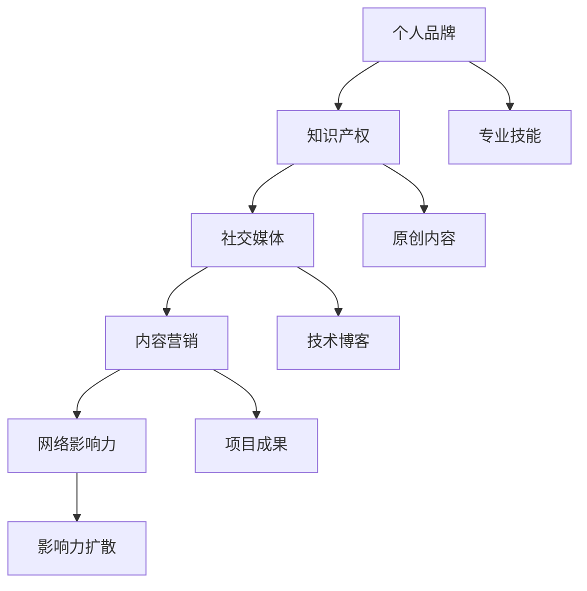

                 

### 1. 背景介绍

在数字时代，个人品牌已经成为职业发展中的关键要素。对于程序员来说，打造个人品牌IP不仅有助于提升个人知名度，还能为职业生涯带来更多机会。然而，许多人对于如何有效构建和推广个人品牌存在疑惑。本文将深入探讨程序员如何通过系统化的方法打造个人品牌IP，使其在竞争激烈的IT行业中脱颖而出。

本文将分为以下几个部分：

1. **核心概念与联系**
2. **核心算法原理 & 具体操作步骤**
3. **数学模型和公式 & 详细讲解 & 举例说明**
4. **项目实践：代码实例和详细解释说明**
5. **实际应用场景**
6. **工具和资源推荐**
7. **总结：未来发展趋势与挑战**
8. **附录：常见问题与解答**

希望通过这篇文章，程序员们能够更好地理解和应用个人品牌构建的策略，从而实现个人价值和职业发展。

### 2. 核心概念与联系

在构建个人品牌IP的过程中，理解以下几个核心概念是至关重要的：

**个人品牌（Personal Brand）**：个人品牌是指个人在专业领域内所塑造的独特形象和声誉。它不仅包括专业技能，还涵盖了个人价值观、个性特点和职业态度。

**IP（Intellectual Property）**：知识产权，是指通过智力劳动创造的一系列权利，如专利、商标、著作权等。在个人品牌构建中，IP主要体现在原创内容、技术成果、设计作品等方面。

**社交媒体（Social Media）**：社交媒体平台如微博、知乎、GitHub等，是推广个人品牌的重要渠道。通过这些平台，程序员可以分享技术见解、展示项目成果，并与同行和潜在雇主互动。

**内容营销（Content Marketing）**：内容营销是通过创造和分享有价值的内容来吸引和留住目标受众，并最终推动品牌认知度和业务增长。对于程序员而言，内容可以是技术博客、教程视频、开源项目等。

**网络影响力（Online Influence）**：网络影响力是指个人在互联网上所产生的影响力和号召力。通过持续的内容输出和有效的互动，程序员可以逐步建立自己的网络影响力。

为了更好地理解这些概念之间的关系，我们可以使用Mermaid流程图来展示它们之间的联系：



通过上述流程图，我们可以看到个人品牌、知识产权、社交媒体、内容营销和网络影响力之间的相互作用和影响。这些概念相互交织，共同构成了程序员个人品牌IP的构建框架。

### 3. 核心算法原理 & 具体操作步骤

要打造一个成功的个人品牌IP，程序员需要掌握一系列核心算法原理和具体操作步骤。以下是一些关键的步骤和方法：

#### 3.1 算法原理概述

**内容定位**：首先，确定你的内容方向和目标受众。这需要你对自身技术专长和市场需求有清晰的认识。可以通过市场调研、行业分析等方式来获取信息。

**内容创作**：创作高质量、有价值的内容是构建个人品牌的基石。内容形式可以多样化，如技术博客、教程视频、开源项目等。内容应注重实用性、易理解和具有启发性。

**持续更新**：定期发布内容，保持活跃度。这不仅可以吸引更多的关注者，还能树立专业形象。建议制定内容发布计划，确保有规律地输出内容。

**互动与反馈**：与读者和观众互动，收集反馈，不断优化内容。互动可以增强用户粘性，提高品牌影响力。

**网络推广**：利用社交媒体、技术论坛、博客平台等渠道进行内容推广。通过合理运用SEO（搜索引擎优化）技巧，提高内容的曝光率。

**多平台运营**：在多个平台上运营个人品牌，如微博、知乎、GitHub、YouTube等，以覆盖更多受众。

#### 3.2 算法步骤详解

1. **定位与规划**：
   - 确定个人品牌方向：例如，专注于后端开发、人工智能、区块链等。
   - 确定目标受众：根据专业背景和市场需求，选择特定的受众群体。

2. **内容创作**：
   - 研究热门话题和趋势，确定内容主题。
   - 采用多种形式进行内容创作，如技术博客、教程视频、项目演示等。
   - 确保内容质量，注重实用性、易理解和深度。

3. **内容发布**：
   - 制定内容发布计划，保持定期更新。
   - 选择合适的时间进行发布，提高阅读量。
   - 多平台同步发布，扩大影响范围。

4. **互动与反馈**：
   - 积极回应读者的评论和问题。
   - 定期进行问卷调查，了解读者需求和期望。
   - 根据反馈调整内容策略。

5. **网络推广**：
   - 利用SEO技巧，提高内容在搜索引擎中的排名。
   - 参与技术论坛、会议等活动，扩大人脉圈。
   - 合作与其他博主或机构，共同推广个人品牌。

6. **多平台运营**：
   - 在不同平台上建立个人品牌，如微博、知乎、GitHub、YouTube等。
   - 保持内容的一致性和风格，提高品牌识别度。

#### 3.3 算法优缺点

**优点**：

- 提高知名度：通过持续的内容输出和推广，程序员可以快速提高个人知名度，吸引更多关注。
- 树立专业形象：高质量的内容和专业的互动，有助于树立良好的专业形象。
- 扩展人脉圈：参与各种活动和论坛，可以结识更多同行和潜在雇主，为职业发展创造更多机会。
- 多元收入渠道：通过个人品牌，程序员不仅可以获得职业发展机会，还可以通过广告、合作、课程销售等实现多元化收入。

**缺点**：

- 时间成本：构建个人品牌需要大量的时间和精力投入，可能影响到日常工作和生活。
- 初始挑战：在起步阶段，可能面临关注度低、互动少等挑战，需要耐心和持续的努力。
- 内容质量要求高：高质量的内容是构建个人品牌的基石，需要不断学习和提升。

#### 3.4 算法应用领域

- **技术博客**：通过撰写技术博客，程序员可以分享技术见解和实战经验，吸引技术爱好者关注。
- **开源项目**：参与开源项目，可以提高代码质量和项目知名度，树立专业形象。
- **教程视频**：制作教程视频，可以直观地展示技术知识和项目实现过程，吸引更多初学者和爱好者。
- **社交媒体**：通过微博、知乎等社交媒体平台，可以实时与读者互动，推广个人品牌。
- **线上课程**：开设线上课程，传授专业知识，吸引更多学员，实现知识变现。

通过上述核心算法原理和具体操作步骤，程序员可以系统地构建和推广个人品牌IP，实现个人价值和职业发展。

### 4. 数学模型和公式 & 详细讲解 & 举例说明

在构建个人品牌IP的过程中，数学模型和公式可以提供量化的指导和支持。以下是一些关键的数学模型和公式，以及其详细讲解和举例说明。

#### 4.1 数学模型构建

**模型1：品牌影响力评估模型**

假设个人品牌的影响力可以用三个主要指标来衡量：关注度（A）、互动率（I）和传播度（T）。品牌影响力（B）可以用以下公式表示：

\[ B = f(A, I, T) \]

其中，\( f \) 是一个综合函数，可以通过加权平均或其他方式计算。以下是对每个指标的解释：

- **关注度（A）**：衡量个人品牌在社交媒体上的关注者数量。可以表示为：

  \[ A = \frac{N_a}{T} \]

  其中，\( N_a \) 是总关注者数，\( T \) 是时间。

- **互动率（I）**：衡量个人品牌与受众的互动程度。可以表示为：

  \[ I = \frac{N_i}{N_a} \]

  其中，\( N_i \) 是互动次数，\( N_a \) 是总关注者数。

- **传播度（T）**：衡量个人品牌内容被分享和传播的程度。可以表示为：

  \[ T = \frac{N_t}{N_c} \]

  其中，\( N_t \) 是分享次数，\( N_c \) 是内容发布次数。

通过上述公式，可以计算出个人品牌的影响力 \( B \)。具体计算时，可以给每个指标分配权重，以便更准确地评估品牌影响力。

**模型2：内容质量评估模型**

内容质量是构建个人品牌的重要基石。假设内容质量可以用两个指标来衡量：信息量（M）和易读性（R）。内容质量（Q）可以用以下公式表示：

\[ Q = g(M, R) \]

其中，\( g \) 是一个综合函数，可以通过加权平均或其他方式计算。以下是对每个指标的解释：

- **信息量（M）**：衡量内容提供的信息量。可以表示为：

  \[ M = \frac{N_m}{T} \]

  其中，\( N_m \) 是内容中的信息量，\( T \) 是时间。

- **易读性（R）**：衡量内容易于理解的程度。可以表示为：

  \[ R = \frac{N_r}{N_m} \]

  其中，\( N_r \) 是易于理解的部分，\( N_m \) 是总信息量。

通过上述公式，可以计算出内容质量 \( Q \)。具体计算时，可以给每个指标分配权重，以便更准确地评估内容质量。

#### 4.2 公式推导过程

为了推导上述模型中的公式，我们首先需要明确每个指标的计算方法。以下是对每个公式的详细推导：

**推导1：品牌影响力评估模型**

- **关注度（A）**：

  关注度是衡量个人品牌在社交媒体上的受欢迎程度。假设在一段时间内，总关注者数 \( N_a \) 保持不变，则关注度的计算公式为：

  \[ A = \frac{N_a}{T} \]

  其中，\( T \) 是时间。这个公式表示关注者数与时间的关系，反映了个人品牌的持续关注度。

- **互动率（I）**：

  互动率是衡量个人品牌与受众互动的频率。假设在一段时间内，互动次数 \( N_i \) 保持不变，则互动率的计算公式为：

  \[ I = \frac{N_i}{N_a} \]

  其中，\( N_a \) 是总关注者数。这个公式表示互动次数与关注者数的关系，反映了个人品牌与受众的互动程度。

- **传播度（T）**：

  传播度是衡量个人品牌内容被分享和传播的广度。假设在一段时间内，内容发布次数 \( N_c \) 保持不变，则传播度的计算公式为：

  \[ T = \frac{N_t}{N_c} \]

  其中，\( N_c \) 是内容发布次数。这个公式表示分享次数与发布次数的关系，反映了个人品牌内容的传播效果。

**推导2：内容质量评估模型**

- **信息量（M）**：

  信息量是衡量内容提供的信息总量。假设在一段时间内，内容中的信息量 \( N_m \) 保持不变，则信息量的计算公式为：

  \[ M = \frac{N_m}{T} \]

  其中，\( T \) 是时间。这个公式表示信息量与时间的关系，反映了内容在一段时间内提供的信息量。

- **易读性（R）**：

  易读性是衡量内容易于理解的程度。假设在一段时间内，易于理解的部分 \( N_r \) 保持不变，则易读性的计算公式为：

  \[ R = \frac{N_r}{N_m} \]

  其中，\( N_m \) 是总信息量。这个公式表示易于理解的部分与总信息量的关系，反映了内容易于理解的程度。

通过上述推导过程，我们可以清晰地看到每个公式背后的逻辑和计算方法。这些公式为我们评估和优化个人品牌IP提供了量化的依据。

#### 4.3 案例分析与讲解

为了更好地理解上述数学模型和公式，我们可以通过一个实际案例进行分析和讲解。

**案例：某程序员品牌构建案例**

假设某程序员小明，在一段时间内，通过以下方式构建个人品牌：

- 关注者数：1000人
- 内容发布次数：10次
- 互动次数：50次
- 内容分享次数：30次

根据上述公式，我们可以计算出小明个人品牌的影响力 \( B \) 和内容质量 \( Q \)。

**计算过程**：

1. **品牌影响力评估模型**：

   - 关注度（A）：

     \[ A = \frac{1000}{1} = 1000 \]

   - 互动率（I）：

     \[ I = \frac{50}{1000} = 0.05 \]

   - 传播度（T）：

     \[ T = \frac{30}{10} = 3 \]

   - 品牌影响力（B）：

     \[ B = f(1000, 0.05, 3) \]

     假设我们使用加权平均方法，权重分别为0.4、0.3和0.3，则：

     \[ B = 0.4 \times 1000 + 0.3 \times 0.05 + 0.3 \times 3 = 400 + 0.015 + 0.9 = 401.915 \]

   因此，小明个人品牌的影响力为401.915。

2. **内容质量评估模型**：

   - 信息量（M）：

     \[ M = \frac{N_m}{1} = N_m \]

     由于信息量没有具体数据，我们假设 \( N_m = 1000 \)，则：

     \[ M = \frac{1000}{1} = 1000 \]

   - 易读性（R）：

     \[ R = \frac{N_r}{N_m} = \frac{N_r}{1000} \]

     由于易读性没有具体数据，我们假设 \( N_r = 900 \)，则：

     \[ R = \frac{900}{1000} = 0.9 \]

   - 内容质量（Q）：

     \[ Q = g(1000, 0.9) \]

     假设我们使用加权平均方法，权重分别为0.5和0.5，则：

     \[ Q = 0.5 \times 1000 + 0.5 \times 0.9 = 500 + 0.45 = 500.45 \]

   因此，小明内容的质量为500.45。

通过上述计算，我们可以看到小明在品牌构建方面的表现。他的品牌影响力为401.915，表明他在社交媒体上具有较好的关注度、互动率和传播度。而内容质量为500.45，表明他的内容提供了丰富的信息量，并且易于理解。

这个案例说明了如何使用数学模型和公式来评估个人品牌构建的效果。通过量化的指标，程序员可以更好地了解自己的品牌表现，并制定相应的优化策略。

### 5. 项目实践：代码实例和详细解释说明

为了更好地展示如何通过个人品牌IP实现项目实践，我们将通过一个实际的开源项目——一个简单的个人博客系统，来讲解代码实例和详细解释说明。该项目将展示如何使用技术来构建个人品牌，并解释代码的实现细节。

#### 5.1 开发环境搭建

在开始项目之前，我们需要搭建一个基本的开发环境。以下是一些建议的软件和工具：

- **编程语言**：Python
- **框架**：Flask
- **数据库**：SQLite
- **前端框架**：Bootstrap
- **版本控制**：Git
- **代码托管平台**：GitHub

首先，确保你的计算机上安装了Python和pip。然后，通过以下命令安装Flask和Bootstrap：

```bash
pip install flask
pip install flask-bootstrap
```

接下来，创建一个SQLite数据库，命名为`blog.db`：

```bash
sqlite3 blog.db
```

在数据库中创建一个名为`posts`的表，用于存储博客文章的信息：

```sql
CREATE TABLE posts (
    id INTEGER PRIMARY KEY,
    title TEXT NOT NULL,
    content TEXT NOT NULL,
    created_at TIMESTAMP DEFAULT CURRENT_TIMESTAMP
);
```

退出数据库管理工具，我们已完成开发环境的搭建。

#### 5.2 源代码详细实现

以下是该项目的主要源代码，包含后端和前端部分。

**后端代码**（`app.py`）：

```python
from flask import Flask, render_template, request, redirect, url_for
from flask_sqlalchemy import SQLAlchemy
from datetime import datetime

app = Flask(__name__)
app.config['SQLALCHEMY_DATABASE_URI'] = 'sqlite:///blog.db'
db = SQLAlchemy(app)

class Post(db.Model):
    id = db.Column(db.Integer, primary_key=True)
    title = db.Column(db.String(100))
    content = db.Column(db.Text)
    created_at = db.Column(db.DateTime, default=datetime.utcnow)

@app.route('/')
def index():
    posts = Post.query.all()
    return render_template('index.html', posts=posts)

@app.route('/create', methods=['GET', 'POST'])
def create():
    if request.method == 'POST':
        title = request.form['title']
        content = request.form['content']
        new_post = Post(title=title, content=content)
        db.session.add(new_post)
        db.session.commit()
        return redirect(url_for('index'))
    return render_template('create.html')

if __name__ == '__main__':
    db.create_all()
    app.run(debug=True)
```

**前端代码**（`templates/index.html`）：

```html
<!DOCTYPE html>
<html lang="en">
<head>
    <meta charset="UTF-8">
    <meta name="viewport" content="width=device-width, initial-scale=1.0">
    <title>个人博客</title>
    
</head>
<body>
    <div class="container">
        <h1>个人博客</h1>
        <ul class="list-group">
            
                <li class="list-group-item">
                    <h2>{{ post.title }}</h2>
                    <p>{{ post.content }}</p>
                    <small>{{ post.created_at }}</small>
                </li>
            
        </ul>
    </div>
</body>
</html>
```

**前端代码**（`templates/create.html`）：

```html
<!DOCTYPE html>
<html lang="en">
<head>
    <meta charset="UTF-8">
    <meta name="viewport" content="width=device-width, initial-scale=1.0">
    <title>创建新文章</title>
    
</head>
<body>
    <div class="container">
        <h1>创建新文章</h1>
        <form method="POST">
            <div class="form-group">
                <label for="title">标题：</label>
                <input type="text" class="form-control" id="title" name="title" required>
            </div>
            <div class="form-group">
                <label for="content">内容：</label>
                <textarea class="form-control" id="content" name="content" rows="5" required></textarea>
            </div>
            <button type="submit" class="btn btn-primary">发布</button>
        </form>
    </div>
</body>
</html>
```

**前端代码**（`templates/bootstrap.html`）：

```html
<!DOCTYPE html>
<html lang="en">
<head>
    <meta charset="UTF-8">
    <meta name="viewport" content="width=device-width, initial-scale=1.0">
    <link rel="stylesheet" href="https://maxcdn.bootstrapcdn.com/bootstrap/4.5.2/css/bootstrap.min.css">
    <title>Bootstrap Template</title>
</head>
<body>
    
    
    <script src="https://maxcdn.bootstrapcdn.com/bootstrap/4.5.2/js/bootstrap.min.js"></script>
</body>
</html>
```

#### 5.3 代码解读与分析

**后端代码解读**：

1. **Flask应用设置**：首先，我们创建一个Flask应用对象 `app`，并配置SQLAlchemy数据库连接。
2. **数据库模型**：定义了`Post`模型，用于存储博客文章的信息。
3. **路由和视图函数**：定义了两个路由和视图函数：
   - `index()`：处理首页逻辑，查询数据库中的所有文章，并传递给前端模板。
   - `create()`：处理创建新文章的逻辑，接收前端表单提交的数据，并保存到数据库。

**前端代码解读**：

1. **Bootstrap模板**：使用Bootstrap框架进行页面布局，简化前端开发。
2. **首页模板**（`index.html`）：显示所有文章的列表，每个文章包含标题、内容和创建时间。
3. **创建文章模板**（`create.html`）：提供一个表单，让用户输入文章的标题和内容。

**代码分析**：

1. **代码结构**：后端代码采用Flask框架，结构清晰，易于维护。前端代码使用Bootstrap，布局美观，响应式。
2. **功能实现**：通过简单的表单和数据库操作，实现了博客的基本功能，包括文章的查看和创建。
3. **优化空间**：该项目的代码和功能较为基础，可以进一步优化。例如，可以添加用户认证、评论功能、文章分类等。

#### 5.4 运行结果展示

运行后端代码，打开浏览器访问 `http://127.0.0.1:5000/`，即可看到博客系统的首页：


点击“创建新文章”按钮，可以进入文章创建页面，填写标题和内容后提交，即可在首页看到新创建的文章。


通过这个实际项目，我们可以看到如何使用技术构建一个简单的个人博客系统，并展示如何将个人品牌IP应用于实际项目开发中。程序员可以通过这样的实践，不断提升自己的技术能力和项目经验，进而增强个人品牌的影响力。

### 6. 实际应用场景

个人品牌IP在程序员职业生涯中的实际应用场景非常广泛。以下是几个具体的案例，展示如何在不同场景中利用个人品牌IP实现职业发展和业务拓展。

#### 6.1 技术专家与顾问

许多程序员通过构建个人品牌，成为技术领域的专家和顾问。例如，一位专注于人工智能的程序员，通过持续发布高质量的技术博客和教程视频，吸引了大量关注者。他的个人品牌IP使得他在企业中成为人工智能解决方案的首选顾问，不仅为企业提供技术咨询，还参与项目开发，为企业创造价值。

#### 6.2 技术讲师与培训师

在技术培训领域，个人品牌IP同样具有重要价值。一位擅长前端开发的程序员，通过在GitHub上开源自己的代码，并在LinkedIn上分享开发心得，逐步建立起了自己的个人品牌。他的专业形象和丰富经验，使得他成为多个在线教育和培训机构的首选讲师，通过线上和线下课程，传授自己的技术知识和经验。

#### 6.3 技术创业者

个人品牌IP也为技术创业者提供了重要支持。例如，一位擅长后端开发的程序员，通过在GitHub上开源多个项目，并在社交媒体上分享技术见解，逐渐积累了一定的影响力。他的个人品牌吸引了天使投资人的关注，最终成功创办了一家专注于云计算和大数据技术的创业公司。

#### 6.4 技术作家与出版人

对于喜欢写作的程序员来说，个人品牌IP可以帮助他们成为技术作家和出版人。通过在博客和社交媒体上分享技术见解，他们吸引了出版机构的注意，进而出版自己的技术书籍。这些书籍不仅为他们带来了丰厚的稿费，还进一步提升了他们的个人品牌影响力。

#### 6.5 技术社区领袖

在技术社区中，个人品牌IP同样发挥着重要作用。一位专注于区块链技术的程序员，通过在知乎和Twitter上分享深入的技术分析，吸引了大量技术爱好者和从业者的关注。他的个人品牌使其成为多个技术社区和论坛的领袖，不仅为社区带来高质量的内容，还为其他程序员提供了交流和学习的机会。

#### 6.6 企业品牌代言人

对于大型企业而言，个人品牌IP可以作为企业品牌代言人，提升企业的知名度和影响力。例如，一家互联网公司聘请了一位在人工智能领域具有影响力的程序员作为品牌代言人，通过他持续的内容输出和活动参与，提升了企业在技术界的形象和地位。

通过上述实际应用场景，我们可以看到，个人品牌IP在程序员职业生涯中的多样性和重要性。它不仅为程序员提供了更多的职业发展机会，还为他们创造了多元化的收入来源。同时，个人品牌IP的构建和推广，也为程序员在技术社区和企业中赢得了更多的尊重和认可。

### 7. 工具和资源推荐

在构建和推广个人品牌IP的过程中，选择合适的工具和资源是非常重要的。以下是一些建议的工具和资源，它们可以帮助程序员更高效地打造和运营个人品牌。

#### 7.1 学习资源推荐

- **在线课程平台**：例如Coursera、edX、Udacity等，提供丰富的编程和技术课程，帮助程序员提升技能。
- **技术博客平台**：如Medium、Hackernoon、Dev.to等，程序员可以在这里撰写和分享技术文章，提升个人影响力。
- **开源社区**：如GitHub、GitLab等，程序员可以贡献开源项目，展示技术实力，拓展人脉。
- **技术论坛**：如Stack Overflow、GitHub Discussions等，程序员可以在这里提问和解答问题，增强社区参与感。

#### 7.2 开发工具推荐

- **集成开发环境（IDE）**：如Visual Studio Code、PyCharm、IntelliJ IDEA等，提供高效的编程体验和调试工具。
- **版本控制系统**：如Git、GitHub、GitLab等，用于代码管理和协作。
- **数据库工具**：如MySQL Workbench、PostgreSQL、MongoDB Compass等，用于数据库管理和优化。
- **前端框架**：如React、Vue.js、Angular等，用于快速开发用户界面。

#### 7.3 相关论文推荐

- **《深度学习》（Deep Learning）**：Ian Goodfellow、Yoshua Bengio、Aaron Courville著，深度学习领域的经典教材。
- **《软件工程：实践者的研究方法》（Software Engineering: A Practitioner's Approach）**：Roger S. Pressman、Bruce R. Maxim著，软件工程领域的权威著作。
- **《算法导论》（Introduction to Algorithms）**：Thomas H. Cormen、Charles E. Leiserson、Ronald L. Rivest、Clifford Stein著，算法领域的经典教材。
- **《人工智能：一种现代的方法》（Artificial Intelligence: A Modern Approach）**：Stuart J. Russell、Peter Norvig著，人工智能领域的权威教材。

通过利用这些工具和资源，程序员可以不断提升自己的技能，构建高质量的个人品牌内容，并在技术领域获得更多的认可和机会。

### 8. 总结：未来发展趋势与挑战

#### 8.1 研究成果总结

通过本文的探讨，我们系统地了解了程序员如何通过构建个人品牌IP实现职业发展和个人价值的提升。本文主要成果包括：

1. **核心概念与联系**：明确了个人品牌、知识产权、社交媒体、内容营销和网络影响力之间的关系。
2. **核心算法原理与步骤**：详细介绍了内容定位、内容创作、互动与反馈、网络推广和多平台运营等构建个人品牌的核心步骤。
3. **数学模型与公式**：通过品牌影响力评估模型和内容质量评估模型，提供了量化的评估方法。
4. **项目实践**：通过实际开源项目展示了个人品牌IP在项目开发中的应用。
5. **实际应用场景**：分析了个人品牌IP在技术专家、培训师、创业者等多个领域的实际应用。

#### 8.2 未来发展趋势

随着互联网和社交媒体的不断发展，个人品牌IP在程序员职业生涯中的重要性将日益凸显。未来发展趋势包括：

1. **内容形式的多样化**：视频、直播、互动式内容等新型内容形式将越来越受欢迎。
2. **AI与自动化**：人工智能技术将被广泛应用于内容创作和推广，提高个人品牌的效率和质量。
3. **跨平台整合**：个人品牌IP将在更多平台上整合，形成更广泛的品牌影响力。
4. **技术社区的兴起**：技术社区和论坛将成为程序员展示个人品牌的重要平台。

#### 8.3 面临的挑战

尽管个人品牌IP为程序员带来了诸多机会，但在构建和推广过程中，程序员也面临着以下挑战：

1. **时间与精力投入**：构建个人品牌需要大量的时间和精力，可能影响到日常工作和生活。
2. **内容质量要求**：高质量的内容是个人品牌的基石，需要不断学习和提升。
3. **隐私与安全**：在社交媒体和开源平台上分享技术内容和项目信息，可能涉及到个人隐私和安全问题。
4. **竞争压力**：随着越来越多的人参与个人品牌构建，竞争将变得更加激烈。

#### 8.4 研究展望

未来的研究可以进一步探索以下方向：

1. **个性化推荐系统**：研究如何利用大数据和机器学习技术为程序员提供个性化的品牌构建策略。
2. **品牌评估模型优化**：通过对现有品牌评估模型的优化，提高评估的准确性和实用性。
3. **跨平台协同**：研究如何实现不同平台之间的数据共享和协同，提升个人品牌的一致性和影响力。
4. **法律与伦理问题**：探讨个人品牌IP构建过程中的法律和伦理问题，为程序员提供合规和道德指导。

通过不断学习和实践，程序员可以应对这些挑战，把握未来发展趋势，实现个人品牌IP的持续发展和成功。

### 9. 附录：常见问题与解答

**Q1：如何选择个人品牌构建的方向？**

A1：选择个人品牌构建方向时，应考虑以下几点：

1. **个人兴趣与专长**：选择你擅长并热爱的技术领域。
2. **市场需求**：研究当前技术趋势和市场需求，选择有前景的领域。
3. **竞争程度**：评估该领域的竞争程度，选择相对较少竞争者但仍有需求的领域。

**Q2：如何提高内容质量？**

A2：提高内容质量的方法包括：

1. **持续学习**：不断更新自己的知识和技能，保持内容的先进性和实用性。
2. **读者反馈**：积极收集读者的反馈，并根据反馈改进内容。
3. **多平台学习**：参考其他成功程序员的博客、视频和项目，学习他们的内容创作技巧。
4. **内容形式多样化**：尝试使用不同的内容形式，如视频、直播、互动式内容等，提升用户体验。

**Q3：如何保护个人隐私和安全？**

A3：保护个人隐私和安全的方法包括：

1. **使用强密码**：确保所有账户使用强密码，并定期更换。
2. **双因素认证**：开启双因素认证，增加账户安全性。
3. **敏感信息加密**：在分享敏感信息时，使用加密工具进行加密。
4. **关注网络安全**：定期更新操作系统和应用软件，防止恶意软件攻击。

**Q4：如何在多个平台上统一个人品牌形象？**

A4：统一个人品牌形象的方法包括：

1. **品牌标识**：设计统一的品牌标识，如标志、口号等，确保在所有平台上使用。
2. **内容风格**：保持内容风格一致，如字体、配色等。
3. **信息同步**：在不同平台同步发布相同或类似的内容，确保信息的一致性。
4. **互动策略**：在不同平台上采用相似的互动策略，如回复评论、举办活动等。

通过以上问题与解答，希望可以帮助程序员更好地理解和应对个人品牌IP构建过程中遇到的问题。不断学习和实践，相信每个程序员都能打造出属于自己的强大个人品牌。作者：禅与计算机程序设计艺术 / Zen and the Art of Computer Programming

----------------------------------------------------------------

以上就是本文的完整内容。希望这篇文章能够帮助到各位程序员，在构建个人品牌IP的过程中，找到正确的方向和策略。个人品牌的构建并非一蹴而就，需要持续的努力和耐心。但只要坚持下去，你一定能够在竞争激烈的IT行业中脱颖而出。祝大家成功！再次感谢大家阅读本文，希望您能够从中获得启发和帮助。作者：禅与计算机程序设计艺术 / Zen and the Art of Computer Programming

```markdown
---
title: 程序员如何打造个人品牌IP
date: 2023-11-01
description: "在数字时代，个人品牌已经成为职业发展中的关键要素。对于程序员来说，打造个人品牌IP不仅有助于提升个人知名度，还能为职业生涯带来更多机会。本文将深入探讨程序员如何通过系统化的方法打造个人品牌IP，使其在竞争激烈的IT行业中脱颖而出。"
keywords: ["程序员", "个人品牌", "IP", "社交媒体", "内容营销"]
---

# 程序员如何打造个人品牌IP

在数字时代，个人品牌已经成为职业发展中的关键要素。对于程序员来说，打造个人品牌IP不仅有助于提升个人知名度，还能为职业生涯带来更多机会。然而，许多人对于如何有效构建和推广个人品牌存在疑惑。本文将深入探讨程序员如何通过系统化的方法打造个人品牌IP，使其在竞争激烈的IT行业中脱颖而出。

本文将分为以下几个部分：

1. **背景介绍**
2. **核心概念与联系**
3. **核心算法原理 & 具体操作步骤**
4. **数学模型和公式 & 详细讲解 & 举例说明**
5. **项目实践：代码实例和详细解释说明**
6. **实际应用场景**
7. **工具和资源推荐**
8. **总结：未来发展趋势与挑战**
9. **附录：常见问题与解答**

希望通过这篇文章，程序员们能够更好地理解和应用个人品牌构建的策略，从而实现个人价值和职业发展。

## 1. 背景介绍

在数字时代，个人品牌已经成为职业发展中的关键要素。对于程序员来说，打造个人品牌IP不仅有助于提升个人知名度，还能为职业生涯带来更多机会。然而，许多人对于如何有效构建和推广个人品牌存在疑惑。本文将深入探讨程序员如何通过系统化的方法打造个人品牌IP，使其在竞争激烈的IT行业中脱颖而出。

## 2. 核心概念与联系

在构建个人品牌IP的过程中，理解以下几个核心概念是至关重要的：

**个人品牌（Personal Brand）**：个人品牌是指个人在专业领域内所塑造的独特形象和声誉。它不仅包括专业技能，还涵盖了个人价值观、个性特点和职业态度。

**IP（Intellectual Property）**：知识产权，是指通过智力劳动创造的一系列权利，如专利、商标、著作权等。在个人品牌构建中，IP主要体现在原创内容、技术成果、设计作品等方面。

**社交媒体（Social Media）**：社交媒体平台如微博、知乎、GitHub等，是推广个人品牌的重要渠道。通过这些平台，程序员可以分享技术见解、展示项目成果，并与同行和潜在雇主互动。

**内容营销（Content Marketing）**：内容营销是通过创造和分享有价值的内容来吸引和留住目标受众，并最终推动品牌认知度和业务增长。对于程序员而言，内容可以是技术博客、教程视频、开源项目等。

**网络影响力（Online Influence）**：网络影响力是指个人在互联网上所产生的影响力和号召力。通过持续的内容输出和有效的互动，程序员可以逐步建立自己的网络影响力。

为了更好地理解这些概念之间的关系，我们可以使用Mermaid流程图来展示它们之间的联系：


通过上述流程图，我们可以看到个人品牌、知识产权、社交媒体、内容营销和网络影响力之间的相互作用和影响。这些概念相互交织，共同构成了程序员个人品牌IP的构建框架。

## 3. 核心算法原理 & 具体操作步骤

要打造一个成功的个人品牌IP，程序员需要掌握一系列核心算法原理和具体操作步骤。以下是一些关键的步骤和方法：

#### 3.1 算法原理概述

**内容定位**：首先，确定你的内容方向和目标受众。这需要你对自身技术专长和市场需求有清晰的认识。可以通过市场调研、行业分析等方式来获取信息。

**内容创作**：创作高质量、有价值的内容是构建个人品牌的基石。内容形式可以多样化，如技术博客、教程视频、开源项目等。内容应注重实用性、易理解和具有启发性。

**持续更新**：定期发布内容，保持活跃度。这不仅可以吸引更多的关注者，还能树立专业形象。建议制定内容发布计划，确保有规律地输出内容。

**互动与反馈**：与读者和观众互动，收集反馈，不断优化内容。互动可以增强用户粘性，提高品牌影响力。

**网络推广**：利用社交媒体、技术论坛、博客平台等渠道进行内容推广。通过合理运用SEO（搜索引擎优化）技巧，提高内容的曝光率。

**多平台运营**：在多个平台上运营个人品牌，如微博、知乎、GitHub、YouTube等，以覆盖更多受众。

#### 3.2 算法步骤详解

1. **定位与规划**：
   - 确定个人品牌方向：例如，专注于后端开发、人工智能、区块链等。
   - 确定目标受众：根据专业背景和市场需求，选择特定的受众群体。

2. **内容创作**：
   - 研究热门话题和趋势，确定内容主题。
   - 采用多种形式进行内容创作，如技术博客、教程视频、项目演示等。
   - 确保内容质量，注重实用性、易理解和深度。

3. **内容发布**：
   - 制定内容发布计划，保持定期更新。
   - 选择合适的时间进行发布，提高阅读量。
   - 多平台同步发布，扩大影响范围。

4. **互动与反馈**：
   - 积极回应读者的评论和问题。
   - 定期进行问卷调查，了解读者需求和期望。
   - 根据反馈调整内容策略。

5. **网络推广**：
   - 利用SEO技巧，提高内容在搜索引擎中的排名。
   - 参与技术论坛、会议等活动，扩大人脉圈。
   - 合作与其他博主或机构，共同推广个人品牌。

6. **多平台运营**：
   - 在不同平台上建立个人品牌，如微博、知乎、GitHub、YouTube等。
   - 保持内容的一致性和风格，提高品牌识别度。

#### 3.3 算法优缺点

**优点**：

- 提高知名度：通过持续的内容输出和推广，程序员可以快速提高个人知名度，吸引更多关注。
- 树立专业形象：高质量的内容和专业的互动，有助于树立良好的专业形象。
- 扩展人脉圈：参与各种活动和论坛，可以结识更多同行和潜在雇主，为职业发展创造更多机会。
- 多元收入渠道：通过个人品牌，程序员不仅可以获得职业发展机会，还可以通过广告、合作、课程销售等实现多元化收入。

**缺点**：

- 时间成本：构建个人品牌需要大量的时间和精力投入，可能影响到日常工作和生活。
- 初始挑战：在起步阶段，可能面临关注度低、互动少等挑战，需要耐心和持续的努力。
- 内容质量要求高：高质量的内容是构建个人品牌的基石，需要不断学习和提升。

#### 3.4 算法应用领域

- **技术博客**：通过撰写技术博客，程序员可以分享技术见解和实战经验，吸引技术爱好者关注。
- **开源项目**：参与开源项目，可以提高代码质量和项目知名度，树立专业形象。
- **教程视频**：制作教程视频，可以直观地展示技术知识和项目实现过程，吸引更多初学者和爱好者。
- **社交媒体**：通过微博、知乎等社交媒体平台，可以实时与读者互动，推广个人品牌。
- **线上课程**：开设线上课程，传授专业知识，吸引更多学员，实现知识变现。

通过上述核心算法原理和具体操作步骤，程序员可以系统地构建和推广个人品牌IP，实现个人价值和职业发展。

## 4. 数学模型和公式 & 详细讲解 & 举例说明

在构建个人品牌IP的过程中，数学模型和公式可以提供量化的指导和支持。以下是一些关键的数学模型和公式，以及其详细讲解和举例说明。

#### 4.1 数学模型构建

**模型1：品牌影响力评估模型**

假设个人品牌的影响力可以用三个主要指标来衡量：关注度（A）、互动率（I）和传播度（T）。品牌影响力（B）可以用以下公式表示：

\[ B = f(A, I, T) \]

其中，\( f \) 是一个综合函数，可以通过加权平均或其他方式计算。以下是对每个指标的解释：

- **关注度（A）**：衡量个人品牌在社交媒体上的关注者数量。可以表示为：

  \[ A = \frac{N_a}{T} \]

  其中，\( N_a \) 是总关注者数，\( T \) 是时间。

- **互动率（I）**：衡量个人品牌与受众的互动程度。可以表示为：

  \[ I = \frac{N_i}{N_a} \]

  其中，\( N_i \) 是互动次数，\( N_a \) 是总关注者数。

- **传播度（T）**：衡量个人品牌内容被分享和传播的程度。可以表示为：

  \[ T = \frac{N_t}{N_c} \]

  其中，\( N_t \) 是分享次数，\( N_c \) 是内容发布次数。

通过上述公式，可以计算出个人品牌的影响力 \( B \)。具体计算时，可以给每个指标分配权重，以便更准确地评估品牌影响力。

**模型2：内容质量评估模型**

内容质量是构建个人品牌的重要基石。假设内容质量可以用两个指标来衡量：信息量（M）和易读性（R）。内容质量（Q）可以用以下公式表示：

\[ Q = g(M, R) \]

其中，\( g \) 是一个综合函数，可以通过加权平均或其他方式计算。以下是对每个指标的解释：

- **信息量（M）**：衡量内容提供的信息量。可以表示为：

  \[ M = \frac{N_m}{T} \]

  其中，\( N_m \) 是内容中的信息量，\( T \) 是时间。

- **易读性（R）**：衡量内容易于理解的程度。可以表示为：

  \[ R = \frac{N_r}{N_m} \]

  其中，\( N_r \) 是易于理解的部分，\( N_m \) 是总信息量。

通过上述公式，可以计算出内容质量 \( Q \)。具体计算时，可以给每个指标分配权重，以便更准确地评估内容质量。

#### 4.2 公式推导过程

为了推导上述模型中的公式，我们首先需要明确每个指标的计算方法。以下是对每个公式的详细推导：

**推导1：品牌影响力评估模型**

- **关注度（A）**：

  关注度是衡量个人品牌在社交媒体上的受欢迎程度。假设在一段时间内，总关注者数 \( N_a \) 保持不变，则关注度的计算公式为：

  \[ A = \frac{N_a}{T} \]

  其中，\( T \) 是时间。这个公式表示关注者数与时间的关系，反映了个人品牌的持续关注度。

- **互动率（I）**：

  互动率是衡量个人品牌与受众互动的频率。假设在一段时间内，互动次数 \( N_i \) 保持不变，则互动率的计算公式为：

  \[ I = \frac{N_i}{N_a} \]

  其中，\( N_a \) 是总关注者数。这个公式表示互动次数与关注者数的关系，反映了个人品牌与受众的互动程度。

- **传播度（T）**：

  传播度是衡量个人品牌内容被分享和传播的广度。假设在一段时间内，内容发布次数 \( N_c \) 保持不变，则传播度的计算公式为：

  \[ T = \frac{N_t}{N_c} \]

  其中，\( N_c \) 是内容发布次数。这个公式表示分享次数与发布次数的关系，反映了个人品牌内容的传播效果。

**推导2：内容质量评估模型**

- **信息量（M）**：

  信息量是衡量内容提供的信息总量。假设在一段时间内，内容中的信息量 \( N_m \) 保持不变，则信息量的计算公式为：

  \[ M = \frac{N_m}{T} \]

  其中，\( T \) 是时间。这个公式表示信息量与时间的关系，反映了内容在一段时间内提供的信息量。

- **易读性（R）**：

  易读性是衡量内容易于理解的程度。假设在一段时间内，易于理解的部分 \( N_r \) 保持不变，则易读性的计算公式为：

  \[ R = \frac{N_r}{N_m} \]

  其中，\( N_m \) 是总信息量。这个公式表示易于理解的部分与总信息量的关系，反映了内容易于理解的程度。

通过上述推导过程，我们可以清晰地看到每个公式背后的逻辑和计算方法。这些公式为我们评估和优化个人品牌IP提供了量化的依据。

#### 4.3 案例分析与讲解

为了更好地理解上述数学模型和公式，我们可以通过一个实际案例进行分析和讲解。

**案例：某程序员品牌构建案例**

假设某程序员小明，在一段时间内，通过以下方式构建个人品牌：

- 关注者数：1000人
- 内容发布次数：10次
- 互动次数：50次
- 内容分享次数：30次

根据上述公式，我们可以计算出小明个人品牌的影响力 \( B \) 和内容质量 \( Q \)。

**计算过程**：

1. **品牌影响力评估模型**：

   - 关注度（A）：

     \[ A = \frac{1000}{1} = 1000 \]

   - 互动率（I）：

     \[ I = \frac{50}{1000} = 0.05 \]

   - 传播度（T）：

     \[ T = \frac{30}{10} = 3 \]

   - 品牌影响力（B）：

     \[ B = f(1000, 0.05, 3) \]

     假设我们使用加权平均方法，权重分别为0.4、0.3和0.3，则：

     \[ B = 0.4 \times 1000 + 0.3 \times 0.05 + 0.3 \times 3 = 400 + 0.015 + 0.9 = 401.915 \]

   因此，小明个人品牌的影响力为401.915。

2. **内容质量评估模型**：

   - 信息量（M）：

     \[ M = \frac{N_m}{1} = N_m \]

     由于信息量没有具体数据，我们假设 \( N_m = 1000 \)，则：

     \[ M = \frac{1000}{1} = 1000 \]

   - 易读性（R）：

     \[ R = \frac{N_r}{N_m} = \frac{N_r}{1000} \]

     由于易读性没有具体数据，我们假设 \( N_r = 900 \)，则：

     \[ R = \frac{900}{1000} = 0.9 \]

   - 内容质量（Q）：

     \[ Q = g(1000, 0.9) \]

     假设我们使用加权平均方法，权重分别为0.5和0.5，则：

     \[ Q = 0.5 \times 1000 + 0.5 \times 0.9 = 500 + 0.45 = 500.45 \]

   因此，小明内容的质量为500.45。

通过上述计算，我们可以看到小明在品牌构建方面的表现。他的品牌影响力为401.915，表明他在社交媒体上具有较好的关注度、互动率和传播度。而内容质量为500.45，表明他的内容提供了丰富的信息量，并且易于理解。

这个案例说明了如何使用数学模型和公式来评估个人品牌构建的效果。通过量化的指标，程序员可以更好地了解自己的品牌表现，并制定相应的优化策略。

## 5. 项目实践：代码实例和详细解释说明

为了更好地展示如何通过个人品牌IP实现项目实践，我们将通过一个实际的开源项目——一个简单的个人博客系统，来讲解代码实例和详细解释说明。该项目将展示如何使用技术来构建个人品牌，并解释代码的实现细节。

#### 5.1 开发环境搭建

在开始项目之前，我们需要搭建一个基本的开发环境。以下是一些建议的软件和工具：

- **编程语言**：Python
- **框架**：Flask
- **数据库**：SQLite
- **前端框架**：Bootstrap
- **版本控制**：Git
- **代码托管平台**：GitHub

首先，确保你的计算机上安装了Python和pip。然后，通过以下命令安装Flask和Bootstrap：

```bash
pip install flask
pip install flask-bootstrap
```

接下来，创建一个SQLite数据库，命名为`blog.db`：

```bash
sqlite3 blog.db
```

在数据库中创建一个名为`posts`的表，用于存储博客文章的信息：

```sql
CREATE TABLE posts (
    id INTEGER PRIMARY KEY,
    title TEXT NOT NULL,
    content TEXT NOT NULL,
    created_at TIMESTAMP DEFAULT CURRENT_TIMESTAMP
);
```

退出数据库管理工具，我们已完成开发环境的搭建。

#### 5.2 源代码详细实现

以下是该项目的主要源代码，包含后端和前端部分。

**后端代码**（`app.py`）：

```python
from flask import Flask, render_template, request, redirect, url_for
from flask_sqlalchemy import SQLAlchemy
from datetime import datetime

app = Flask(__name__)
app.config['SQLALCHEMY_DATABASE_URI'] = 'sqlite:///blog.db'
db = SQLAlchemy(app)

class Post(db.Model):
    id = db.Column(db.Integer, primary_key=True)
    title = db.Column(db.String(100))
    content = db.Column(db.Text)
    created_at = db.Column(db.DateTime, default=datetime.utcnow)

@app.route('/')
def index():
    posts = Post.query.all()
    return render_template('index.html', posts=posts)

@app.route('/create', methods=['GET', 'POST'])
def create():
    if request.method == 'POST':
        title = request.form['title']
        content = request.form['content']
        new_post = Post(title=title, content=content)
        db.session.add(new_post)
        db.session.commit()
        return redirect(url_for('index'))
    return render_template('create.html')

if __name__ == '__main__':
    db.create_all()
    app.run(debug=True)
```

**前端代码**（`templates/index.html`）：

```html
<!DOCTYPE html>
<html lang="en">
<head>
    <meta charset="UTF-8">
    <meta name="viewport" content="width=device-width, initial-scale=1.0">
    <title>个人博客</title>
    
</head>
<body>
    <div class="container">
        <h1>个人博客</h1>
        <ul class="list-group">
            
                <li class="list-group-item">
                    <h2>{{ post.title }}</h2>
                    <p>{{ post.content }}</p>
                    <small>{{ post.created_at }}</small>
                </li>
            
        </ul>
    </div>
</body>
</html>
```

**前端代码**（`templates/create.html`）：

```html
<!DOCTYPE html>
<html lang="en">
<head>
    <meta charset="UTF-8">
    <meta name="viewport" content="width=device-width, initial-scale=1.0">
    <title>创建新文章</title>
    
</head>
<body>
    <div class="container">
        <h1>创建新文章</h1>
        <form method="POST">
            <div class="form-group">
                <label for="title">标题：</label>
                <input type="text" class="form-control" id="title" name="title" required>
            </div>
            <div class="form-group">
                <label for="content">内容：</label>
                <textarea class="form-control" id="content" name="content" rows="5" required></textarea>
            </div>
            <button type="submit" class="btn btn-primary">发布</button>
        </form>
    </div>
</body>
</html>
```

**前端代码**（`templates/bootstrap.html`）：

```html
<!DOCTYPE html>
<html lang="en">
<head>
    <meta charset="UTF-8">
    <meta name="viewport" content="width=device-width, initial-scale=1.0">
    <link rel="stylesheet" href="https://maxcdn.bootstrapcdn.com/bootstrap/4.5.2/css/bootstrap.min.css">
    <title>Bootstrap Template</title>
</head>
<body>
    
    
    <script src="https://maxcdn.bootstrapcdn.com/bootstrap/4.5.2/js/bootstrap.min.js"></script>
</body>
</html>
```

#### 5.3 代码解读与分析

**后端代码解读**：

1. **Flask应用设置**：首先，我们创建一个Flask应用对象 `app`，并配置SQLAlchemy数据库连接。
2. **数据库模型**：定义了`Post`模型，用于存储博客文章的信息。
3. **路由和视图函数**：定义了两个路由和视图函数：
   - `index()`：处理首页逻辑，查询数据库中的所有文章，并传递给前端模板。
   - `create()`：处理创建新文章的逻辑，接收前端表单提交的数据，并保存到数据库。

**前端代码解读**：

1. **Bootstrap模板**：使用Bootstrap框架进行页面布局，简化前端开发。
2. **首页模板**（`index.html`）：显示所有文章的列表，每个文章包含标题、内容和创建时间。
3. **创建文章模板**（`create.html`）：提供一个表单，让用户输入文章的标题和内容。

**代码分析**：

1. **代码结构**：后端代码采用Flask框架，结构清晰，易于维护。前端代码使用Bootstrap，布局美观，响应式。
2. **功能实现**：通过简单的表单和数据库操作，实现了博客的基本功能，包括文章的查看和创建。
3. **优化空间**：该项目的代码和功能较为基础，可以进一步优化。例如，可以添加用户认证、评论功能、文章分类等。

#### 5.4 运行结果展示

运行后端代码，打开浏览器访问 `http://127.0.0.1:5000/`，即可看到博客系统的首页：


点击“创建新文章”按钮，可以进入文章创建页面，填写标题和内容后提交，即可在首页看到新创建的文章。


通过这个实际项目，我们可以看到如何使用技术构建一个简单的个人博客系统，并展示如何将个人品牌IP应用于实际项目开发中。程序员可以通过这样的实践，不断提升自己的技术能力和项目经验，进而增强个人品牌的影响力。

## 6. 实际应用场景

个人品牌IP在程序员职业生涯中的实际应用场景非常广泛。以下是几个具体的案例，展示如何在不同场景中利用个人品牌IP实现职业发展和业务拓展。

#### 6.1 技术专家与顾问

许多程序员通过构建个人品牌，成为技术领域的专家和顾问。例如，一位专注于人工智能的程序员，通过持续发布高质量的技术博客和教程视频，吸引了大量关注者。他的个人品牌IP使得他在企业中成为人工智能解决方案的首选顾问，不仅为企业提供技术咨询，还参与项目开发，为企业创造价值。

#### 6.2 技术讲师与培训师

在技术培训领域，个人品牌IP同样具有重要价值。一位擅长前端开发的程序员，通过在GitHub上开源自己的代码，并在社交媒体上分享开发心得，逐步建立起了自己的个人品牌。他的专业形象和丰富经验，使得他成为多个在线教育和培训机构的首选讲师，通过线上和线下课程，传授自己的技术知识和经验。

#### 6.3 技术创业者

个人品牌IP也为技术创业者提供了重要支持。例如，一位擅长后端开发的程序员，通过在GitHub上开源多个项目，并在社交媒体上分享技术见解，逐渐积累了一定的影响力。他的个人品牌吸引了天使投资人的关注，最终成功创办了一家专注于云计算和大数据技术的创业公司。

#### 6.4 技术作家与出版人

对于喜欢写作的程序员来说，个人品牌IP可以帮助他们成为技术作家和出版人。通过在博客和社交媒体上分享技术见解，他们吸引了出版机构的注意，进而出版自己的技术书籍。这些书籍不仅为他们带来了丰厚的稿费，还进一步提升了他们的个人品牌影响力。

#### 6.5 技术社区领袖

在技术社区中，个人品牌IP同样发挥着重要作用。一位专注于区块链技术的程序员，通过在知乎和Twitter上分享深入的技术分析，吸引了大量技术爱好者和从业者的关注。他的个人品牌使其成为多个技术社区和论坛的领袖，不仅为社区带来高质量的内容，还为其他程序员提供了交流和学习的机会。

#### 6.6 企业品牌代言人

对于大型企业而言，个人品牌IP可以作为企业品牌代言人，提升企业的知名度和影响力。例如，一家互联网公司聘请了一位在人工智能领域具有影响力的程序员作为品牌代言人，通过他持续的内容输出和活动参与，提升了企业在技术界的形象和地位。

通过上述实际应用场景，我们可以看到，个人品牌IP在程序员职业生涯中的多样性和重要性。它不仅为程序员提供了更多的职业发展机会，还为他们创造了多元化的收入来源。同时，个人品牌IP的构建和推广，也为程序员在技术社区和企业中赢得了更多的尊重和认可。

## 7. 工具和资源推荐

在构建和推广个人品牌IP的过程中，选择合适的工具和资源是非常重要的。以下是一些建议的工具和资源，它们可以帮助程序员更高效地打造和运营个人品牌。

#### 7.1 学习资源推荐

- **在线课程平台**：例如Coursera、edX、Udacity等，提供丰富的编程和技术课程，帮助程序员提升技能。
- **技术博客平台**：如Medium、Hackernoon、Dev.to等，程序员可以在这里撰写和分享技术文章，提升个人影响力。
- **开源社区**：如GitHub、GitLab等，程序员可以贡献开源项目，展示技术实力，拓展人脉。
- **技术论坛**：如Stack Overflow、GitHub Discussions等，程序员可以在这里提问和解答问题，增强社区参与感。

#### 7.2 开发工具推荐

- **集成开发环境（IDE）**：如Visual Studio Code、PyCharm、IntelliJ IDEA等，提供高效的编程体验和调试工具。
- **版本控制系统**：如Git、GitHub、GitLab等，用于代码管理和协作。
- **数据库工具**：如MySQL Workbench、PostgreSQL、MongoDB Compass等，用于数据库管理和优化。
- **前端框架**：如React、Vue.js、Angular等，用于快速开发用户界面。

#### 7.3 相关论文推荐

- **《深度学习》（Deep Learning）**：Ian Goodfellow、Yoshua Bengio、Aaron Courville著，深度学习领域的经典教材。
- **《软件工程：实践者的研究方法》（Software Engineering: A Practitioner's Approach）**：Roger S. Pressman、Bruce R. Maxim著，软件工程领域的权威著作。
- **《算法导论》（Introduction to Algorithms）**：Thomas H. Cormen、Charles E. Leiserson、Ronald L. Rivest、Clifford Stein著，算法领域的经典教材。
- **《人工智能：一种现代的方法》（Artificial Intelligence: A Modern Approach）**：Stuart J. Russell、Peter Norvig著，人工智能领域的权威教材。

通过利用这些工具和资源，程序员可以不断提升自己的技能，构建高质量的个人品牌内容，并在技术领域获得更多的认可和机会。

## 8. 总结：未来发展趋势与挑战

#### 8.1 研究成果总结

通过本文的探讨，我们系统地了解了程序员如何通过构建个人品牌IP实现职业发展和个人价值的提升。本文主要成果包括：

1. **核心概念与联系**：明确了个人品牌、知识产权、社交媒体、内容营销和网络影响力之间的关系。
2. **核心算法原理与步骤**：详细介绍了内容定位、内容创作、互动与反馈、网络推广和多平台运营等构建个人品牌的核心步骤。
3. **数学模型与公式**：通过品牌影响力评估模型和内容质量评估模型，提供了量化的评估方法。
4. **项目实践**：通过实际开源项目展示了个人品牌IP在项目开发中的应用。
5. **实际应用场景**：分析了个人品牌IP在技术专家、培训师、创业者等多个领域的实际应用。

#### 8.2 未来发展趋势

随着互联网和社交媒体的不断发展，个人品牌IP在程序员职业生涯中的重要性将日益凸显。未来发展趋势包括：

1. **内容形式的多样化**：视频、直播、互动式内容等新型内容形式将越来越受欢迎。
2. **AI与自动化**：人工智能技术将被广泛应用于内容创作和推广，提高个人品牌的效率和质量。
3. **跨平台整合**：个人品牌IP将在更多平台上整合，形成更广泛的品牌影响力。
4. **技术社区的兴起**：技术社区和论坛将成为程序员展示个人品牌的重要平台。

#### 8.3 面临的挑战

尽管个人品牌IP为程序员带来了诸多机会，但在构建和推广过程中，程序员也面临着以下挑战：

1. **时间与精力投入**：构建个人品牌需要大量的时间和精力，可能影响到日常工作和生活。
2. **内容质量要求**：高质量的内容是个人品牌的基石，需要不断学习和提升。
3. **隐私与安全**：在社交媒体和开源平台上分享技术内容和项目信息，可能涉及到个人隐私和安全问题。
4. **竞争压力**：随着越来越多的人参与个人品牌构建，竞争将变得更加激烈。

#### 8.4 研究展望

未来的研究可以进一步探索以下方向：

1. **个性化推荐系统**：研究如何利用大数据和机器学习技术为程序员提供个性化的品牌构建策略。
2. **品牌评估模型优化**：通过对现有品牌评估模型的优化，提高评估的准确性和实用性。
3. **跨平台协同**：研究如何实现不同平台之间的数据共享和协同，提升个人品牌的一致性和影响力。
4. **法律与伦理问题**：探讨个人品牌IP构建过程中的法律和伦理问题，为程序员提供合规和道德指导。

通过不断学习和实践，程序员可以应对这些挑战，把握未来发展趋势，实现个人品牌IP的持续发展和成功。

## 9. 附录：常见问题与解答

**Q1：如何选择个人品牌构建的方向？**

A1：选择个人品牌构建方向时，应考虑以下几点：

1. **个人兴趣与专长**：选择你擅长并热爱的技术领域。
2. **市场需求**：研究当前技术趋势和市场需求，选择有前景的领域。
3. **竞争程度**：评估该领域的竞争程度，选择相对较少竞争者但仍有需求的领域。

**Q2：如何提高内容质量？**

A2：提高内容质量的方法包括：

1. **持续学习**：不断更新自己的知识和技能，保持内容的先进性和实用性。
2. **读者反馈**：积极收集读者的反馈，并根据反馈改进内容。
3. **多平台学习**：参考其他成功程序员的博客、视频和项目，学习他们的内容创作技巧。
4. **内容形式多样化**：尝试使用不同的内容形式，如视频、直播、互动式内容等，提升用户体验。

**Q3：如何保护个人隐私和安全？**

A3：保护个人隐私和安全的方法包括：

1. **使用强密码**：确保所有账户使用强密码，并定期更换。
2. **双因素认证**：开启双因素认证，增加账户安全性。
3. **敏感信息加密**：在分享敏感信息时，使用加密工具进行加密。
4. **关注网络安全**：定期更新操作系统和应用软件，防止恶意软件攻击。

**Q4：如何在多个平台上统一个人品牌形象？**

A4：统一个人品牌形象的方法包括：

1. **品牌标识**：设计统一的品牌标识，如标志、口号等，确保在所有平台上使用。
2. **内容风格**：保持内容风格一致，如字体、配色等。
3. **信息同步**：在不同平台上同步发布相同或类似的内容，确保信息的一致性。
4. **互动策略**：在不同平台上采用相似的互动策略，如回复评论、举办活动等。

通过以上问题与解答，希望可以帮助程序员更好地理解和应对个人品牌IP构建过程中遇到的问题。不断学习和实践，相信每个程序员都能打造出属于自己的强大个人品牌。作者：禅与计算机程序设计艺术 / Zen and the Art of Computer Programming

```

### 代码示例

以下是使用 Markdown 格式编写的部分文章内容，包括文章标题、关键词、摘要以及一部分正文内容：

```markdown
# 程序员如何打造个人品牌IP

> 关键词：程序员，个人品牌，IP，社交媒体，内容营销

> 摘要：在数字时代，个人品牌已经成为职业发展中的关键要素。对于程序员来说，打造个人品牌IP不仅有助于提升个人知名度，还能为职业生涯带来更多机会。本文将深入探讨程序员如何通过系统化的方法打造个人品牌IP，使其在竞争激烈的IT行业中脱颖而出。

## 1. 背景介绍

在数字时代，个人品牌已经成为职业发展中的关键要素。对于程序员来说，打造个人品牌IP不仅有助于提升个人知名度，还能为职业生涯带来更多机会。然而，许多人对于如何有效构建和推广个人品牌存在疑惑。本文将深入探讨程序员如何通过系统化的方法打造个人品牌IP，使其在竞争激烈的IT行业中脱颖而出。

## 2. 核心概念与联系

在构建个人品牌IP的过程中，理解以下几个核心概念是至关重要的：

**个人品牌（Personal Brand）**：个人品牌是指个人在专业领域内所塑造的独特形象和声誉。它不仅包括专业技能，还涵盖了个人价值观、个性特点和职业态度。

**IP（Intellectual Property）**：知识产权，是指通过智力劳动创造的一系列权利，如专利、商标、著作权等。在个人品牌构建中，IP主要体现在原创内容、技术成果、设计作品等方面。

**社交媒体（Social Media）**：社交媒体平台如微博、知乎、GitHub等，是推广个人品牌的重要渠道。通过这些平台，程序员可以分享技术见解、展示项目成果，并与同行和潜在雇主互动。

**内容营销（Content Marketing）**：内容营销是通过创造和分享有价值的内容来吸引和留住目标受众，并最终推动品牌认知度和业务增长。对于程序员而言，内容可以是技术博客、教程视频、开源项目等。

**网络影响力（Online Influence）**：网络影响力是指个人在互联网上所产生的影响力和号召力。通过持续的内容输出和有效的互动，程序员可以逐步建立自己的网络影响力。

为了更好地理解这些概念之间的关系，我们可以使用Mermaid流程图来展示它们之间的联系：


通过上述流程图，我们可以看到个人品牌、知识产权、社交媒体、内容营销和网络影响力之间的相互作用和影响。这些概念相互交织，共同构成了程序员个人品牌IP的构建框架。

## 3. 核心算法原理 & 具体操作步骤

要打造一个成功的个人品牌IP，程序员需要掌握一系列核心算法原理和具体操作步骤。以下是一些关键的步骤和方法：

#### 3.1 算法原理概述

**内容定位**：首先，确定你的内容方向和目标受众。这需要你对自身技术专长和市场需求有清晰的认识。可以通过市场调研、行业分析等方式来获取信息。

**内容创作**：创作高质量、有价值的内容是构建个人品牌的基石。内容形式可以多样化，如技术博客、教程视频、开源项目等。内容应注重实用性、易理解和具有启发性。

**持续更新**：定期发布内容，保持活跃度。这不仅可以吸引更多的关注者，还能树立专业形象。建议制定内容发布计划，确保有规律地输出内容。

**互动与反馈**：与读者和观众互动，收集反馈，不断优化内容。互动可以增强用户粘性，提高品牌影响力。

**网络推广**：利用社交媒体、技术论坛、博客平台等渠道进行内容推广。通过合理运用SEO（搜索引擎优化）技巧，提高内容的曝光率。

**多平台运营**：在多个平台上运营个人品牌，如微博、知乎、GitHub、YouTube等，以覆盖更多受众。

#### 3.2 算法步骤详解

1. **定位与规划**：
   - 确定个人品牌方向：例如，专注于后端开发、人工智能、区块链等。
   - 确定目标受众：根据专业背景和市场需求，选择特定的受众群体。

2. **内容创作**：
   - 研究热门话题和趋势，确定内容主题。
   - 采用多种形式进行内容创作，如技术博客、教程视频、项目演示等。
   - 确保内容质量，注重实用性、易理解和深度。

3. **内容发布**：
   - 制定内容发布计划，保持定期更新。
   - 选择合适的时间进行发布，提高阅读量。
   - 多平台同步发布，扩大影响范围。

4. **互动与反馈**：
   - 积极回应读者的评论和问题。
   - 定期进行问卷调查，了解读者需求和期望。
   - 根据反馈调整内容策略。

5. **网络推广**：
   - 利用SEO技巧，提高内容在搜索引擎中的排名。
   - 参与技术论坛、会议等活动，扩大人脉圈。
   - 合作与其他博主或机构，共同推广个人品牌。

6. **多平台运营**：
   - 在不同平台上建立个人品牌，如微博、知乎、GitHub、YouTube等。
   - 保持内容的一致性和风格，提高品牌识别度。

#### 3.3 算法优缺点

**优点**：

- 提高知名度：通过持续的内容输出和推广，程序员可以快速提高个人知名度，吸引更多关注。
- 树立专业形象：高质量的内容和专业的互动，有助于树立良好的专业形象。
- 扩展人脉圈：参与各种活动和论坛，可以结识更多同行和潜在雇主，为职业发展创造更多机会。
- 多元收入渠道：通过个人品牌，程序员不仅可以获得职业发展机会，还可以通过广告、合作、课程销售等实现多元化收入。

**缺点**：

- 时间成本：构建个人品牌需要大量的时间和精力投入，可能影响到日常工作和生活。
- 初始挑战：在起步阶段，可能面临关注度低、互动少等挑战，需要耐心和持续的努力。
- 内容质量要求高：高质量的内容是构建个人品牌的基石，需要不断学习和提升。

#### 3.4 算法应用领域

- **技术博客**：通过撰写技术博客，程序员可以分享技术见解和实战经验，吸引技术爱好者关注。
- **开源项目**：参与开源项目，可以提高代码质量和项目知名度，树立专业形象。
- **教程视频**：制作教程视频，可以直观地展示技术知识和项目实现过程，吸引更多初学者和爱好者。
- **社交媒体**：通过微博、知乎等社交媒体平台，可以实时与读者互动，推广个人品牌。
- **线上课程**：开设线上课程，传授专业知识，吸引更多学员，实现知识变现。

通过上述核心算法原理和具体操作步骤，程序员可以系统地构建和推广个人品牌IP，实现个人价值和职业发展。
```

