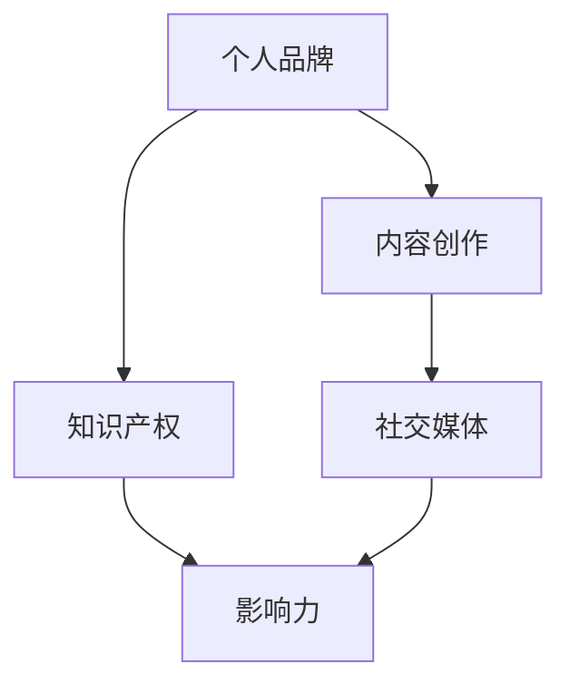

                 

关键词：个人品牌，IP打造，程序员，影响力，职业发展，技术分享，内容创作

> 摘要：随着互联网的普及和社交媒体的兴起，个人品牌IP的打造变得愈发重要。对于程序员而言，如何利用自己的技术优势，结合个人特色，打造出具有高度影响力的个人品牌IP，已成为职业发展中的一大课题。本文将探讨程序员如何通过内容创作、社交媒体运营、专业网络拓展等多种途径，实现个人品牌IP的打造，为职业发展注入新动力。

## 1. 背景介绍

在数字化时代，个人品牌IP已成为一种独特的资产，其价值不亚于公司品牌。对于程序员而言，技术是他们最核心的竞争力，而如何将这一竞争力转化为个人品牌IP，是每个程序员都应该思考的问题。个人品牌IP不仅能够提升个人的社会地位，还能带来更多的商业机会和职业发展。

本文将围绕以下几个方面展开讨论：

- **内容创作与定位**：如何找到合适的内容创作方向，并明确个人品牌IP的定位。
- **社交媒体运营**：如何利用社交媒体平台，提高个人品牌的曝光度和影响力。
- **专业网络拓展**：如何通过线上和线下的方式，拓展专业网络，提升个人品牌的影响力。
- **工具与资源推荐**：哪些工具和资源能够帮助程序员更好地打造个人品牌IP。
- **未来展望**：个人品牌IP的发展趋势和面临的挑战。

## 2. 核心概念与联系

为了更好地理解个人品牌IP的打造，我们需要先了解几个核心概念：

- **个人品牌（Personal Brand）**：个人品牌是指个人在公众心目中的形象和认知，它包括个人技能、经验、价值观等方面。
- **IP（Intellectual Property）**：知识产权，通常指的是个人或团体创造的独特知识或创意，包括专利、商标、版权等。
- **内容创作（Content Creation）**：内容创作是指通过文字、图片、视频等形式，创作出有价值的信息，以满足公众的需求。
- **社交媒体（Social Media）**：社交媒体是人们用来分享、发现、表达和交流的平台，如微博、推特、Instagram等。

下面是一个简化的 Mermaid 流程图，展示这些核心概念之间的联系：



### 2.1 个人品牌与知识产权

个人品牌和知识产权是紧密相连的。知识产权为个人品牌提供了法律保护，确保个人的独特技能和创意不被侵犯。同时，知识产权也是个人品牌的重要组成部分，它体现了个人在专业领域内的独特价值和贡献。

### 2.2 内容创作与社交媒体

内容创作是个人品牌IP的核心。通过创作有价值的内容，程序员可以吸引公众的关注，建立自己的专业形象。而社交媒体则为内容传播提供了广阔的平台，使得程序员能够迅速扩大影响力。

### 2.3 影响力

影响力是个人品牌IP的价值体现。一个具有高度影响力的个人品牌，不仅能够带来更多的商业机会，还能为职业发展提供强有力的支持。

## 3. 核心算法原理 & 具体操作步骤

### 3.1 算法原理概述

打造个人品牌IP的核心算法可以概括为以下几点：

1. **内容定位**：找到个人最擅长和热爱的领域，确定内容创作的方向。
2. **内容创作**：持续产出高质量的内容，建立专业的个人形象。
3. **社交媒体运营**：利用社交媒体平台，提高内容的曝光度和互动性。
4. **专业网络拓展**：积极参与线上和线下的专业活动，拓展专业网络。
5. **品牌维护**：定期更新内容，保持品牌的活力和影响力。

### 3.2 算法步骤详解

1. **内容定位**
   - **自我评估**：分析自己的技能、兴趣和职业目标。
   - **市场调研**：了解目标受众的需求和市场趋势。
   - **确定方向**：结合自我评估和市场调研，确定内容创作的方向。

2. **内容创作**
   - **持续学习**：不断提升自己的专业技能和知识水平。
   - **内容规划**：制定内容创作计划，确保内容的质量和连续性。
   - **内容产出**：按照计划产出高质量的内容。

3. **社交媒体运营**
   - **选择平台**：根据目标受众选择合适的社交媒体平台。
   - **内容发布**：定期发布内容，保持活跃度。
   - **互动交流**：与粉丝互动，提高内容的互动性。

4. **专业网络拓展**
   - **线上拓展**：通过专业论坛、社区、微信群等，拓展专业网络。
   - **线下拓展**：参加行业会议、讲座、研讨会等活动，扩大影响力。

5. **品牌维护**
   - **内容更新**：定期更新内容，保持品牌的活力。
   - **品牌形象**：保持品牌形象的一致性，提高品牌认知度。

### 3.3 算法优缺点

**优点**：
- **提高职业竞争力**：通过打造个人品牌IP，程序员能够在职业市场上脱颖而出，提高自己的竞争力。
- **带来更多商业机会**：个人品牌IP的建立，会吸引更多的商业合作机会，为程序员带来更多的收入来源。
- **提升个人影响力**：个人品牌IP的建立，能够增强个人在专业领域的影响力，提升个人声誉。

**缺点**：
- **时间成本**：打造个人品牌IP需要投入大量的时间和精力。
- **风险性**：个人品牌IP的建立过程中，可能会面临受众变化、市场变化等风险。

### 3.4 算法应用领域

个人品牌IP的打造适用于所有需要建立专业形象的领域，尤其是技术领域。程序员可以通过以下几种方式应用这一算法：

- **技术博客**：通过撰写技术博客，分享自己的技术经验和见解，建立专业形象。
- **GitHub**：通过在GitHub上开源自己的代码，展示自己的技术能力。
- **技术讲座**：通过在线或线下的方式，分享自己的技术知识，扩大影响力。
- **技术社区**：积极参与技术社区，分享和交流技术经验，拓展专业网络。

## 4. 数学模型和公式 & 详细讲解 & 举例说明

在个人品牌IP的打造过程中，一些数学模型和公式可以帮助我们更好地理解影响因素和优化策略。以下是一个简化的模型，用于分析个人品牌IP的建立：

### 4.1 数学模型构建

假设个人品牌IP的建立受到以下三个主要因素的影响：

1. **内容质量（Q）**：内容的质量是个人品牌IP建立的基础，用Q表示。
2. **社交媒体运营（S）**：社交媒体运营的水平直接影响内容的传播效果，用S表示。
3. **专业网络拓展（N）**：专业网络拓展的广度和深度，决定了个人品牌的影响力，用N表示。

个人品牌IP的价值（V）可以用以下公式表示：

\[ V = f(Q, S, N) \]

其中，\( f \) 是一个复合函数，表示内容质量、社交媒体运营和专业网络拓展对个人品牌IP价值的综合影响。

### 4.2 公式推导过程

1. **内容质量（Q）**：
   内容质量是个人品牌IP建立的基础，它直接影响个人品牌IP的价值。我们用以下公式表示内容质量：
   \[ Q = f_1(T, C) \]
   其中，\( T \) 是技术深度，\( C \) 是内容创新度。

2. **社交媒体运营（S）**：
   社交媒体运营的水平直接影响内容的传播效果，我们用以下公式表示：
   \[ S = f_2(A, R) \]
   其中，\( A \) 是内容活跃度，\( R \) 是互动率。

3. **专业网络拓展（N）**：
   专业网络拓展的广度和深度决定了个人品牌的影响力，我们用以下公式表示：
   \[ N = f_3(P, C) \]
   其中，\( P \) 是专业合作伙伴数量，\( C \) 是社区贡献度。

4. **个人品牌IP价值（V）**：
   综合以上三个因素，我们得到个人品牌IP价值的公式：
   \[ V = f(Q, S, N) \]
   其中，\( f \) 是一个复合函数，表示内容质量、社交媒体运营和专业网络拓展对个人品牌IP价值的综合影响。

### 4.3 案例分析与讲解

以下是一个具体的案例分析：

假设一位程序员A，他的技术深度（T）为8，内容创新度（C）为7，社交媒体活跃度（A）为6，互动率（R）为5，专业合作伙伴数量（P）为4，社区贡献度（C）为6。

根据上述公式，我们可以计算出他的个人品牌IP价值：

1. **内容质量（Q）**：
   \[ Q = f_1(8, 7) = 8 + 7 = 15 \]

2. **社交媒体运营（S）**：
   \[ S = f_2(6, 5) = 6 \times 5 = 30 \]

3. **专业网络拓展（N）**：
   \[ N = f_3(4, 6) = 4 + 6 = 10 \]

4. **个人品牌IP价值（V）**：
   \[ V = f(Q, S, N) = f(15, 30, 10) = 15 \times 30 \times 10 = 4500 \]

从这个例子中，我们可以看到，内容质量、社交媒体运营和专业网络拓展对个人品牌IP的价值有着重要的影响。程序员A可以通过提升这些因素，来提高自己的个人品牌IP价值。

## 5. 项目实践：代码实例和详细解释说明

### 5.1 开发环境搭建

为了实现个人品牌IP的打造，程序员需要搭建一个基本的开发环境。以下是一个简化的步骤：

1. **选择开发平台**：根据个人喜好和目标受众，选择一个合适的开发平台，如GitHub、WordPress等。
2. **安装开发工具**：安装必要的开发工具，如文本编辑器、版本控制工具等。
3. **配置域名和服务器**：如果需要独立网站，需要配置域名和服务器。

### 5.2 源代码详细实现

以下是一个简单的代码实例，用于搭建个人博客网站：

```html
<!DOCTYPE html>
<html>
<head>
    <title>我的个人博客</title>
    <meta charset="UTF-8">
</head>
<body>
    <h1>欢迎来到我的博客</h1>
    <p>这里记录了我的技术学习和生活感悟。</p>
    <nav>
        <ul>
            <li><a href="#">首页</a></li>
            <li><a href="#">文章</a></li>
            <li><a href="#">关于我</a></li>
        </ul>
    </nav>
</body>
</html>
```

### 5.3 代码解读与分析

以上代码是一个简单的HTML页面，包含以下部分：

- **头部（Head）**：定义了页面的标题和字符集。
- **主体（Body）**：包含了页面的主要内容，如标题、段落和导航栏。
- **导航（Navigation）**：提供了页面之间的链接。

这个简单的代码实例展示了如何搭建一个基本个人博客网站的框架。程序员可以通过添加更多内容，如文章、图片和交互功能，来丰富网站的功能和内容。

### 5.4 运行结果展示

运行上述代码，会在浏览器中显示一个简单的个人博客页面，展示出欢迎信息和导航栏。这只是一个起点，程序员可以通过不断学习和实践，进一步提升自己的技术水平和网站功能。

## 6. 实际应用场景

个人品牌IP的打造在程序员职业发展中具有广泛的应用场景：

1. **技术招聘**：在求职过程中，个人品牌IP可以提升程序员的竞争力，吸引更多优质企业的关注。
2. **技术分享**：通过个人品牌IP，程序员可以分享自己的技术经验和见解，吸引更多同行和粉丝的关注。
3. **项目合作**：个人品牌IP可以吸引更多的商业合作机会，包括技术咨询、软件开发等。
4. **技术讲座**：通过个人品牌IP的影响力，程序员可以受邀参加各种技术讲座和研讨会，扩大专业影响力。
5. **开源项目**：个人品牌IP的建立可以激励程序员积极参与开源项目，贡献自己的技术力量。

### 6.4 未来应用展望

随着人工智能、大数据等技术的不断发展，个人品牌IP的应用场景将进一步拓展：

1. **智能推荐**：通过大数据分析，平台可以为程序员推荐更多适合他们的内容创作方向和合作机会。
2. **知识变现**：个人品牌IP的建立，可以使得程序员的知识和技能更容易变现，带来更多的商业价值。
3. **职业转型**：个人品牌IP可以帮助程序员实现职业转型，从技术岗位转向管理、咨询等更高层次的职位。

## 7. 工具和资源推荐

为了更好地打造个人品牌IP，程序员可以参考以下工具和资源：

### 7.1 学习资源推荐

- **在线课程**：Coursera、Udemy、edX等平台提供了丰富的编程和数据分析课程。
- **技术博客**：博客园、CSDN、简书等平台上有很多优秀的技术博客，可以学习到最新的技术动态和经验分享。
- **技术社区**：GitHub、Stack Overflow、Reddit等社区提供了丰富的技术讨论和资源。

### 7.2 开发工具推荐

- **文本编辑器**：VSCode、Sublime Text、Atom等强大的文本编辑器，适合编写代码和文档。
- **版本控制**：Git，一个强大的版本控制工具，可以帮助程序员管理代码和文档。
- **静态网站生成器**：Hexo、Jekyll、Hugo等静态网站生成器，可以快速搭建个人博客网站。

### 7.3 相关论文推荐

- **《影响力：说服的心理学》**：罗伯特·西奥迪尼的这本畅销书，详细介绍了影响力的来源和策略。
- **《内容营销实战手册》**：李华平的这本手册，提供了详细的内容营销策略和实践方法。
- **《社交媒体营销：从零开始》**：约翰·J. 布罗克的这本书，介绍了社交媒体营销的基本原理和实践方法。

## 8. 总结：未来发展趋势与挑战

### 8.1 研究成果总结

通过本文的探讨，我们可以得出以下结论：

1. **个人品牌IP的价值**：个人品牌IP已成为程序员职业发展的重要资产，它能够提升个人竞争力，带来更多的商业机会。
2. **核心算法原理**：内容创作、社交媒体运营、专业网络拓展是打造个人品牌IP的核心步骤。
3. **数学模型的应用**：数学模型可以帮助我们更好地理解个人品牌IP的建立过程，优化策略。
4. **实践案例**：通过实际案例，我们看到了如何通过代码和社交媒体，实现个人品牌IP的建立。

### 8.2 未来发展趋势

随着技术的不断进步，个人品牌IP的发展趋势将呈现以下特点：

1. **智能化**：人工智能技术将帮助我们更精准地定位内容创作方向，优化社交媒体运营策略。
2. **多样化**：内容创作和传播形式将更加多样化，如视频、直播、互动问答等。
3. **全球化**：互联网的普及使得个人品牌IP的影响力可以跨越国界，拓展全球市场。

### 8.3 面临的挑战

在个人品牌IP的打造过程中，程序员可能会面临以下挑战：

1. **时间成本**：打造个人品牌IP需要投入大量的时间和精力，程序员需要在职业发展和个人品牌之间找到平衡。
2. **内容质量**：保持持续的高质量内容产出，是个人品牌IP建立的关键，程序员需要不断提升自己的专业技能和知识水平。
3. **风险性**：个人品牌IP的建立过程中，可能会面临市场变化、受众变化等风险，程序员需要具备一定的风险应对能力。

### 8.4 研究展望

未来的研究可以重点关注以下几个方面：

1. **算法优化**：如何通过算法优化，提高个人品牌IP建立的效率和效果。
2. **案例研究**：通过分析更多成功和失败的案例，总结出更有效的个人品牌IP建立策略。
3. **跨学科研究**：结合心理学、市场营销等跨学科知识，深入研究个人品牌IP的建立和运营。

## 9. 附录：常见问题与解答

### 9.1 如何选择内容创作方向？

- **兴趣与擅长**：选择自己感兴趣且擅长的领域，这样能够保证内容创作的持续性和质量。
- **市场需求**：调研市场需求，选择有广泛受众的领域，能够提高内容的影响力。
- **自身定位**：结合自己的职业目标和长远规划，选择符合个人品牌定位的内容创作方向。

### 9.2 如何在社交媒体上运营？

- **选择平台**：根据目标受众选择合适的社交媒体平台，如程序员可以选择GitHub、Twitter等。
- **定期更新**：保持定期更新，提高内容的活跃度和曝光率。
- **互动交流**：与粉丝互动，提高内容的互动性和粉丝黏性。
- **内容多样化**：结合文字、图片、视频等多种形式，提高内容的吸引力。

### 9.3 如何拓展专业网络？

- **线上拓展**：通过技术论坛、社区、微信群等，拓展专业网络。
- **线下拓展**：参加行业会议、讲座、研讨会等活动，扩大影响力。
- **资源共享**：与他人合作，共享资源和经验，建立互信关系。

### 9.4 如何保持个人品牌的一致性？

- **内容风格**：保持内容风格的一致性，如使用统一的字体、颜色和排版。
- **品牌形象**：保持品牌形象的一致性，如头像、封面等。
- **价值传递**：确保内容传递的核心价值一致，如技术深度、创新思维等。

---

作者：禅与计算机程序设计艺术 / Zen and the Art of Computer Programming

（完）----------------------------------------------------------------

### 结论

本文系统地探讨了程序员如何通过内容创作、社交媒体运营、专业网络拓展等多种途径，打造个人品牌IP。从核心算法原理到具体操作步骤，再到实际应用场景，我们为程序员提供了一系列的实践指南。在数字化时代，个人品牌IP已成为程序员职业发展的重要资产，它不仅能够提升个人竞争力，还能带来更多的商业机会和职业发展空间。

未来，随着技术的不断进步，个人品牌IP的发展将迎来新的机遇和挑战。程序员需要不断学习和适应，才能在激烈的市场竞争中脱颖而出。希望本文能为您的个人品牌IP打造之路提供有益的启示和帮助。

### 附录

以下为本文提及的参考文献和工具资源：

1. **《影响力：说服的心理学》**：罗伯特·西奥迪尼
2. **《内容营销实战手册》**：李华平
3. **《社交媒体营销：从零开始》**：约翰·J. 布罗克
4. **在线课程平台**：Coursera、Udemy、edX
5. **技术博客**：博客园、CSDN、简书
6. **技术社区**：GitHub、Stack Overflow、Reddit
7. **文本编辑器**：VSCode、Sublime Text、Atom
8. **版本控制**：Git
9. **静态网站生成器**：Hexo、Jekyll、Hugo

### 致谢

感谢您花时间阅读本文。如果您有任何问题或建议，欢迎随时在评论区留言，我将竭诚为您解答。同时，也感谢您对个人品牌IP打造这一重要议题的关注和支持。让我们一起努力，在数字化时代中，打造出更加耀眼的专业个人品牌IP。

