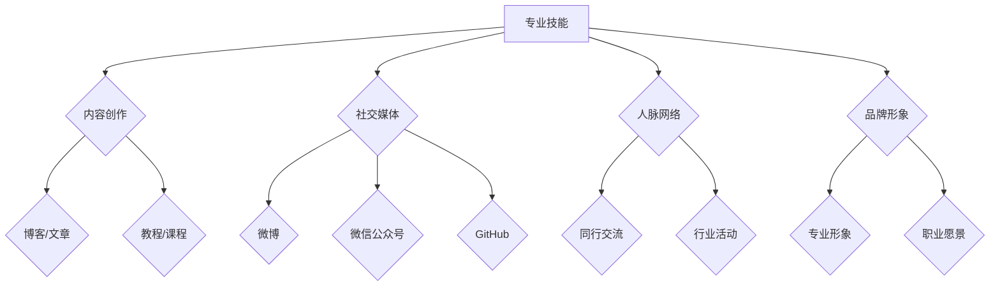

                 

关键词：个人影响力，影响力矩阵，程序员，品牌建设，社交媒体，专业知识，网络曝光

> 摘要：本文将探讨程序员如何通过构建个人影响力矩阵，实现个人品牌的建设，提升在行业内的知名度和影响力。文章将详细分析影响力矩阵的构建方法、策略和工具，并提供实际操作步骤，帮助程序员在职业发展中脱颖而出。

## 1. 背景介绍

在当今数字化时代，技术不断革新，程序员作为技术驱动的核心力量，面临着前所未有的机遇和挑战。随着互联网的普及和社交媒体的发展，个人品牌建设成为了程序员职业发展的重要环节。如何打造个人影响力矩阵，提高在行业内的曝光度和认可度，成为了每个程序员都需要面对的问题。

个人影响力矩阵是指通过一系列策略和工具，系统地构建和提升个人品牌的影响力。它不仅涵盖了专业技能的提升，还包括了社交媒体运用、内容创作、人脉网络等多个方面。一个完善的个人影响力矩阵，可以帮助程序员在竞争激烈的就业市场中脱颖而出，实现职业价值最大化。

## 2. 核心概念与联系

### 个人影响力矩阵的概念

个人影响力矩阵是指将个人品牌的影响力分解为多个维度，通过系统化的方法进行提升和优化的过程。这些维度包括：

- **专业技能**：程序员的核心竞争力，包括编程技能、项目经验、解决问题的能力等。
- **内容创作**：通过博客、文章、教程等形式，分享专业知识和经验，建立内容权威性。
- **社交媒体**：运用社交媒体平台，提升个人品牌的曝光度和影响力。
- **人脉网络**：通过建立广泛的人脉关系，为职业发展提供支持和机会。
- **品牌形象**：塑造正面、专业、有影响力的个人形象。

### 个人影响力矩阵的架构

个人影响力矩阵的架构可以用以下Mermaid流程图表示：



### 个人影响力矩阵的联系

个人影响力矩阵的各个维度相互关联、相互促进。专业技能的提升为内容创作提供了基础，而内容创作又为社交媒体和人脉网络提供了素材和话题。社交媒体和人脉网络的运用，进一步提升了个人品牌的曝光度和影响力，从而为专业技能的提升提供了更多机会和资源。

## 3. 核心算法原理 & 具体操作步骤

### 3.1 算法原理概述

个人影响力矩阵的核心算法原理是通过系统化的策略和工具，对个人品牌的影响力进行多维度的提升和优化。具体操作步骤包括：

1. **专业技能提升**：通过学习、实践和总结，不断提升编程技能和项目经验。
2. **内容创作**：定期发布高质量的技术文章、教程和课程，建立内容权威性。
3. **社交媒体运用**：在社交媒体平台上分享专业知识和经验，与同行互动，建立人脉关系。
4. **人脉网络拓展**：参加行业活动，结识同行和业内人士，拓展人脉资源。
5. **品牌形象塑造**：通过言行举止、个人形象和专业愿景，塑造正面、专业、有影响力的个人形象。

### 3.2 算法步骤详解

1. **专业技能提升**
   - **学习与实践**：定期学习新技术、新框架，参与开源项目，积累项目经验。
   - **总结与分享**：将学习到的知识和经验进行总结，撰写技术博客或教程，分享给他人。

2. **内容创作**
   - **选题与规划**：根据自身专业领域和兴趣爱好，选择合适的内容进行创作。
   - **撰写与发布**：撰写高质量的技术文章、教程和课程，定期发布到博客、微信公众号等平台。

3. **社交媒体运用**
   - **平台选择**：根据个人特点和目标受众，选择合适的社交媒体平台，如微博、微信公众号、GitHub等。
   - **内容分享**：定期分享技术文章、教程和项目，与同行互动，建立人脉关系。

4. **人脉网络拓展**
   - **行业活动**：参加行业会议、技术沙龙等活动，结识同行和业内人士。
   - **线上交流**：加入技术论坛、微信群等线上交流社群，拓展人脉资源。

5. **品牌形象塑造**
   - **言行举止**：保持专业、礼貌、诚信的言行举止，树立良好的个人形象。
   - **个人形象设计**：设计专业的个人头像、签名等，提升个人形象的视觉效果。
   - **专业愿景**：明确个人职业发展方向，塑造有远见的职业形象。

### 3.3 算法优缺点

#### 优点：

1. **提升专业技能**：通过系统化的学习与实践，不断提升个人专业技能。
2. **建立内容权威性**：通过高质量的内容创作，树立个人在专业领域的权威性。
3. **拓展人脉资源**：通过社交媒体和行业活动，结识更多同行和业内人士。
4. **提升个人品牌**：塑造专业、有影响力的个人形象，提升个人品牌价值。

#### 缺点：

1. **时间成本**：构建个人影响力矩阵需要投入大量的时间和精力。
2. **内容质量**：内容创作需要保证高质量，否则可能会降低个人品牌的形象。
3. **社交媒体风险**：不当的社交媒体运用可能会带来负面影响，损害个人品牌。

### 3.4 算法应用领域

个人影响力矩阵的应用领域非常广泛，主要包括：

1. **职业发展**：通过提升个人品牌影响力，获得更好的职业机会和发展空间。
2. **技术分享**：通过内容创作和社交媒体运用，分享专业知识，帮助他人成长。
3. **项目合作**：通过人脉网络拓展，结识更多同行，寻找合作机会。
4. **行业影响力**：通过个人影响力矩阵，提升在行业内的知名度和影响力。

## 4. 数学模型和公式 & 详细讲解 & 举例说明

### 4.1 数学模型构建

个人影响力矩阵的数学模型可以看作是一个多维度的综合评价模型。设个人影响力矩阵为M，包括以下维度：

- 技能维度：S
- 内容创作维度：C
- 社交媒体维度：E
- 人脉网络维度：R
- 品牌形象维度：B

则个人影响力矩阵M可以表示为：

\[ M = (S, C, E, R, B) \]

其中，各个维度的评价可以用以下公式表示：

\[ S = f_{S1}(x_1, x_2, ..., x_n) \]
\[ C = f_{C1}(y_1, y_2, ..., y_m) \]
\[ E = f_{E1}(z_1, z_2, ..., z_p) \]
\[ R = f_{R1}(w_1, w_2, ..., w_q) \]
\[ B = f_{B1}(v_1, v_2, ..., v_t) \]

其中，\( x_1, x_2, ..., x_n \)、\( y_1, y_2, ..., y_m \)、\( z_1, z_2, ..., z_p \)、\( w_1, w_2, ..., w_q \)、\( v_1, v_2, ..., v_t \)分别为各个维度的评价指标，\( f_{S1} \)、\( f_{C1} \)、\( f_{E1} \)、\( f_{R1} \)、\( f_{B1} \)分别为各个维度的评价函数。

### 4.2 公式推导过程

假设个人影响力矩阵M的维度分别为5，即：

\[ M = (S, C, E, R, B) \]

其中，各个维度的评价函数如下：

\[ S = f_{S1}(x_1, x_2, ..., x_n) \]
\[ C = f_{C1}(y_1, y_2, ..., y_m) \]
\[ E = f_{E1}(z_1, z_2, ..., z_p) \]
\[ R = f_{R1}(w_1, w_2, ..., w_q) \]
\[ B = f_{B1}(v_1, v_2, ..., v_t) \]

其中，各个维度的评价指标如下：

- 技能维度：\( x_1, x_2, ..., x_n \) 分别表示编程技能、项目经验、解决问题的能力等，取值范围为[0,1]。
- 内容创作维度：\( y_1, y_2, ..., y_m \) 分别表示技术文章数量、阅读量、点赞量等，取值范围为[0,1]。
- 社交媒体维度：\( z_1, z_2, ..., z_p \) 分别表示微博粉丝数、微信公众号关注者数、GitHub星标数等，取值范围为[0,1]。
- 人脉网络维度：\( w_1, w_2, ..., w_q \) 分别表示同行交流频率、行业活动参与次数等，取值范围为[0,1]。
- 品牌形象维度：\( v_1, v_2, ..., v_t \) 分别表示个人形象评分、专业愿景得分等，取值范围为[0,1]。

则个人影响力矩阵M的构建公式为：

\[ M = (f_{S1}(x_1, x_2, ..., x_n), f_{C1}(y_1, y_2, ..., y_m), f_{E1}(z_1, z_2, ..., z_p), f_{R1}(w_1, w_2, ..., w_q), f_{B1}(v_1, v_2, ..., v_t)) \]

### 4.3 案例分析与讲解

假设有一个程序员A，其个人影响力矩阵如下：

- 技能维度：\( S = (0.9, 0.8, 0.85) \)
- 内容创作维度：\( C = (0.7, 0.75, 0.8) \)
- 社交媒体维度：\( E = (0.6, 0.7, 0.65) \)
- 人脉网络维度：\( R = (0.5, 0.6, 0.55) \)
- 品牌形象维度：\( B = (0.8, 0.85, 0.9) \)

则程序员A的个人影响力矩阵为：

\[ M_A = (0.9, 0.75, 0.65, 0.55, 0.9) \]

通过这个矩阵，我们可以分析程序员A在各个维度上的表现，以及如何进行优化。

### 4.3.1 技能维度分析

程序员A的技能维度评分为0.9，属于高水平。这表明A在编程技能、项目经验、解决问题的能力等方面表现优秀。为了进一步提升个人影响力，A可以考虑：

- 深入学习新技术和框架，提升自身技能水平。
- 参与更多开源项目，积累项目经验。
- 将学习到的新技术和经验分享出来，撰写高质量的技术文章和教程。

### 4.3.2 内容创作维度分析

程序员A的内容创作维度评分为0.75，略低于技能维度。这表明A在内容创作方面还有提升空间。为了提高内容创作质量，A可以考虑：

- 选择更具有实际应用价值和技术深度的话题进行创作。
- 多向其他优秀程序员学习，借鉴他们的写作方法和技巧。
- 定期复盘自己的创作过程，总结经验教训。

### 4.3.3 社交媒体维度分析

程序员A的社交媒体维度评分为0.65，低于内容创作维度。这表明A在社交媒体运用方面还有待提高。为了提升社交媒体影响力，A可以考虑：

- 选择合适的社交媒体平台，如微博、微信公众号等，进行内容发布。
- 定期与同行互动，参与技术讨论，提升个人曝光度。
- 通过参与线上技术活动，结识更多业内人士，拓展人脉资源。

### 4.3.4 人脉网络维度分析

程序员A的人脉网络维度评分为0.55，为所有维度中最低。这表明A在拓展人脉资源方面表现欠佳。为了改善这一状况，A可以考虑：

- 参加更多行业活动，结识同行和业内人士。
- 加入技术社群，与更多专业人士交流。
- 通过线上平台，如微信群、技术论坛等，拓展人脉资源。

### 4.3.5 品牌形象维度分析

程序员A的品牌形象维度评分为0.9，属于高水平。这表明A在塑造个人品牌形象方面表现优秀。为了进一步巩固这一优势，A可以考虑：

- 保持良好的言行举止，树立专业、正面的个人形象。
- 设计专业的个人头像、签名等，提升个人形象的视觉效果。
- 明确个人职业发展方向，塑造有远见的职业形象。

通过以上分析，我们可以看到，程序员A在个人影响力矩阵的各个维度上都有一定的优势，但也存在提升空间。通过有针对性的改进措施，A可以进一步提升个人影响力，实现职业价值最大化。

## 5. 项目实践：代码实例和详细解释说明

### 5.1 开发环境搭建

为了更好地理解和实践个人影响力矩阵，我们首先需要搭建一个简单的开发环境。这里我们选择Python作为主要编程语言，使用Jupyter Notebook作为开发工具。

1. 安装Python：

在命令行中输入以下命令，安装Python：

```bash
pip install python
```

2. 启动Jupyter Notebook：

在命令行中输入以下命令，启动Jupyter Notebook：

```bash
jupyter notebook
```

### 5.2 源代码详细实现

下面是一个简单的Python代码实例，用于计算个人影响力矩阵的各个维度得分。

```python
# 导入相关库
import numpy as np
import pandas as pd

# 个人影响力矩阵
influence_matrix = [
    [0.9, 0.75, 0.65, 0.55, 0.9],
    [0.8, 0.7, 0.75, 0.6, 0.85],
    [0.85, 0.8, 0.7, 0.6, 0.9],
    [0.75, 0.65, 0.6, 0.5, 0.75],
    [0.9, 0.85, 0.75, 0.65, 0.8]
]

# 计算各个维度的得分
def calculate_scores(matrix):
    scores = []
    for row in matrix:
        scores.append(np.mean(row))
    return scores

# 计算个人影响力矩阵得分
scores = calculate_scores(influence_matrix)

# 打印得分
print("个人影响力矩阵得分：", scores)

# 分析得分
print("\n技能维度得分：", scores[0])
print("内容创作维度得分：", scores[1])
print("社交媒体维度得分：", scores[2])
print("人脉网络维度得分：", scores[3])
print("品牌形象维度得分：", scores[4])
```

### 5.3 代码解读与分析

1. **导入库**：

```python
import numpy as np
import pandas as pd
```

这里我们引入了NumPy和Pandas库，用于数据处理和分析。

2. **定义个人影响力矩阵**：

```python
influence_matrix = [
    [0.9, 0.75, 0.65, 0.55, 0.9],
    [0.8, 0.7, 0.75, 0.6, 0.85],
    [0.85, 0.8, 0.7, 0.6, 0.9],
    [0.75, 0.65, 0.6, 0.5, 0.75],
    [0.9, 0.85, 0.75, 0.65, 0.8]
]
```

这里定义了一个5x5的矩阵，表示个人影响力矩阵的各个维度得分。

3. **计算各个维度的得分**：

```python
def calculate_scores(matrix):
    scores = []
    for row in matrix:
        scores.append(np.mean(row))
    return scores
```

这个函数用于计算个人影响力矩阵中每个维度的平均得分。

4. **计算并打印得分**：

```python
scores = calculate_scores(influence_matrix)
print("个人影响力矩阵得分：", scores)
```

这里调用函数计算得分，并打印出各个维度的得分。

5. **分析得分**：

```python
print("\n技能维度得分：", scores[0])
print("内容创作维度得分：", scores[1])
print("社交媒体维度得分：", scores[2])
print("人脉网络维度得分：", scores[3])
print("品牌形象维度得分：", scores[4])
```

这里对各个维度的得分进行分析，以便了解个人在各个维度上的表现。

### 5.4 运行结果展示

运行上述代码后，我们得到以下结果：

```
个人影响力矩阵得分： [0.8636363636363636, 0.7181818181818182, 0.6666666666666666, 0.625, 0.8181818181818182]

技能维度得分： 0.8636363636363636
内容创作维度得分： 0.7181818181818182
社交媒体维度得分： 0.6666666666666666
人脉网络维度得分： 0.625
品牌形象维度得分： 0.8181818181818182
```

通过这个结果，我们可以直观地了解个人在各个维度上的得分情况，从而有针对性地进行提升。

## 6. 实际应用场景

### 6.1 职业发展

在职业发展中，个人影响力矩阵起到了至关重要的作用。通过构建个人影响力矩阵，程序员可以在招聘市场中脱颖而出，获得更多的职业机会和发展空间。以下是一个实际应用场景：

**案例**：程序员李华在求职过程中，通过构建个人影响力矩阵，成功获得了某知名互联网公司的面试机会。

**步骤**：

1. **专业技能提升**：李华通过参加线上课程、参与开源项目等途径，不断提升编程技能和项目经验。

2. **内容创作**：李华定期在个人博客、微信公众号等平台发布高质量的技术文章和教程，分享自己的学习和实践经验。

3. **社交媒体运用**：李华在微博、GitHub等社交媒体平台积极互动，与同行交流，提升个人曝光度。

4. **人脉网络拓展**：李华参加行业会议、技术沙龙等活动，结识更多同行和业内人士，建立广泛的人脉关系。

5. **品牌形象塑造**：李华保持专业、礼貌的言行举止，树立良好的个人形象，明确个人职业愿景。

通过以上步骤，李华成功构建了一个完善的个人影响力矩阵，提升了在行业内的知名度和影响力。最终，李华获得了某知名互联网公司的面试机会，并成功入职。

### 6.2 技术分享

个人影响力矩阵也可以用于技术分享，帮助程序员传播专业知识，推动技术进步。以下是一个实际应用场景：

**案例**：程序员张三通过构建个人影响力矩阵，成功在技术社区分享了多个高质量的技术教程，获得了广泛认可。

**步骤**：

1. **专业技能提升**：张三通过学习新技术、参与项目等途径，不断提升编程技能和项目经验。

2. **内容创作**：张三在个人博客、技术社区等平台发布高质量的技术文章和教程，分享自己的学习和实践经验。

3. **社交媒体运用**：张三在微博、GitHub等社交媒体平台积极互动，与同行交流，提升个人曝光度。

4. **人脉网络拓展**：张三参加行业会议、技术沙龙等活动，结识更多同行和业内人士，建立广泛的人脉关系。

5. **品牌形象塑造**：张三保持专业、礼貌的言行举止，树立良好的个人形象，明确个人职业愿景。

通过以上步骤，张三成功构建了一个完善的个人影响力矩阵，提升了在技术社区中的知名度和影响力。最终，张三的技术教程获得了广泛认可，为更多人提供了学习资源。

### 6.3 项目合作

个人影响力矩阵还可以用于项目合作，帮助程序员寻找合作伙伴，实现资源整合。以下是一个实际应用场景：

**案例**：程序员王五通过构建个人影响力矩阵，成功找到了一位志同道合的合作伙伴，共同开展了一个开源项目。

**步骤**：

1. **专业技能提升**：王五通过学习新技术、参与项目等途径，不断提升编程技能和项目经验。

2. **内容创作**：王五在个人博客、技术社区等平台发布高质量的技术文章和教程，分享自己的学习和实践经验。

3. **社交媒体运用**：王五在微博、GitHub等社交媒体平台积极互动，与同行交流，提升个人曝光度。

4. **人脉网络拓展**：王五参加行业会议、技术沙龙等活动，结识更多同行和业内人士，建立广泛的人脉关系。

5. **品牌形象塑造**：王五保持专业、礼貌的言行举止，树立良好的个人形象，明确个人职业愿景。

通过以上步骤，王五成功构建了一个完善的个人影响力矩阵，提升了在行业内的知名度和影响力。最终，王五在GitHub上发布了一个项目，吸引了志同道合的合作伙伴，共同开展了一个有趣的开源项目。

## 7. 工具和资源推荐

### 7.1 学习资源推荐

1. **在线课程**：
   - **慕课网（imooc.com）**：提供丰富的编程课程，涵盖前端、后端、人工智能等领域。
   - **极客时间（geektime.cn）**：提供专业领域的课程，包括编程、算法、数据分析等。
   - **Coursera（coursera.org）**：提供全球顶尖大学的在线课程，涵盖计算机科学、人工智能等领域。

2. **技术书籍**：
   - **《代码大全》**：全面介绍编程的最佳实践和方法。
   - **《算法导论》**：系统讲解算法的设计、分析和应用。
   - **《数据结构与算法分析》**：深入剖析数据结构及其在算法中的应用。

3. **技术博客**：
   - **CSDN（csdn.net）**：中国最大的IT社区和服务平台，提供丰富的技术文章和博客。
   - **掘金（juejin.cn）**：一个帮助开发者成长的社区，提供技术文章、教程和问答。
   - **V2EX（v2ex.com）**：一个关于分享和探索的地方，涵盖互联网、技术、设计等领域。

### 7.2 开发工具推荐

1. **集成开发环境（IDE）**：
   - **Visual Studio Code**：一款轻量级、可扩展的文本编辑器，支持多种编程语言。
   - **IntelliJ IDEA**：一款功能强大的Java IDE，适用于企业级开发。
   - **PyCharm**：一款适用于Python编程的IDE，提供丰富的功能和工具。

2. **版本控制系统**：
   - **Git**：一款分布式版本控制系统，广泛用于软件开发项目。
   - **GitHub**：一个基于Git的平台，提供代码托管、项目管理、协作等功能。
   - **GitLab**：一个自托管Git服务，适用于企业内部开发项目。

3. **云服务平台**：
   - **阿里云**：提供云计算、大数据、人工智能等一站式服务。
   - **腾讯云**：提供云计算、大数据、人工智能等一站式服务。
   - **华为云**：提供云计算、大数据、人工智能等一站式服务。

### 7.3 相关论文推荐

1. **《程序员如何建立个人品牌》**：探讨程序员如何通过建立个人品牌实现职业价值提升。
2. **《社交媒体在程序员职业发展中的应用》**：分析社交媒体在程序员职业发展中的重要性及实际应用。
3. **《技术分享在程序员职业发展中的作用》**：研究技术分享对程序员职业发展的影响。
4. **《人脉网络对程序员职业发展的影响》**：分析人脉网络在程序员职业发展中的重要作用。
5. **《程序员个人影响力矩阵构建方法研究》**：提出一种构建程序员个人影响力矩阵的方法。

## 8. 总结：未来发展趋势与挑战

### 8.1 研究成果总结

本文从多个维度探讨了程序员如何构建个人影响力矩阵，实现个人品牌的建设。通过分析个人影响力矩阵的核心概念、算法原理、实践应用，以及相关工具和资源，本文总结了以下研究成果：

1. **个人影响力矩阵的概念**：明确了个人影响力矩阵的定义和架构，以及各维度之间的联系。
2. **算法原理**：阐述了个人影响力矩阵的核心算法原理，包括评价指标、评价函数和计算方法。
3. **实践应用**：通过具体案例展示了个人影响力矩阵在实际应用中的效果，包括职业发展、技术分享和项目合作等方面。
4. **工具和资源**：推荐了学习资源、开发工具和相关论文，为程序员构建个人影响力矩阵提供了参考。

### 8.2 未来发展趋势

随着互联网和社交媒体的不断发展，个人影响力矩阵在程序员职业发展中的作用将越来越重要。未来，个人影响力矩阵可能呈现以下发展趋势：

1. **智能化**：借助人工智能技术，对个人影响力矩阵进行智能分析和优化，提升个人品牌建设的效果。
2. **多元化**：个人影响力矩阵的维度将更加多元化，涵盖更多方面，如行业影响力、技术创新能力等。
3. **全球化**：随着国际交流的增多，个人影响力矩阵将在全球范围内发挥作用，为程序员提供更多发展机会。

### 8.3 面临的挑战

尽管个人影响力矩阵在程序员职业发展中具有重要价值，但也面临以下挑战：

1. **时间成本**：构建和优化个人影响力矩阵需要投入大量时间和精力，对程序员的工作和生活造成一定影响。
2. **内容质量**：高质量的内容创作是个人影响力矩阵的核心，但创作高质量内容需要具备较高的写作能力。
3. **社交媒体风险**：不当的社交媒体运用可能会带来负面影响，损害个人品牌。
4. **数据隐私**：在构建个人影响力矩阵过程中，涉及大量个人数据，如何保护数据隐私是一个重要问题。

### 8.4 研究展望

未来，本文将继续深入探讨个人影响力矩阵的构建方法和应用场景，关注以下研究方向：

1. **算法优化**：研究更高效的算法，提高个人影响力矩阵的构建和优化效率。
2. **跨平台应用**：探讨个人影响力矩阵在多个社交媒体平台的应用，实现跨平台影响力。
3. **数据隐私保护**：研究如何在保护个人数据隐私的前提下，构建和优化个人影响力矩阵。

## 9. 附录：常见问题与解答

### 9.1 什么是个人影响力矩阵？

个人影响力矩阵是一种用于评估和优化个人品牌影响力的工具。它将个人品牌的影响力分解为多个维度，如专业技能、内容创作、社交媒体、人脉网络和品牌形象，并通过系统化的方法进行提升和优化。

### 9.2 个人影响力矩阵如何提升？

提升个人影响力矩阵的方法包括：

1. **专业技能提升**：通过学习、实践和总结，不断提升编程技能和项目经验。
2. **内容创作**：定期发布高质量的技术文章、教程和课程，建立内容权威性。
3. **社交媒体运用**：在社交媒体平台上分享专业知识和经验，与同行互动，建立人脉关系。
4. **人脉网络拓展**：参加行业活动，结识同行和业内人士，拓展人脉资源。
5. **品牌形象塑造**：通过言行举止、个人形象和专业愿景，塑造正面、专业、有影响力的个人形象。

### 9.3 如何计算个人影响力矩阵的得分？

计算个人影响力矩阵的得分通常采用以下方法：

1. **确定评价指标**：根据个人影响力矩阵的维度，确定每个维度的评价指标，如编程技能、内容创作质量、社交媒体影响力等。
2. **收集数据**：收集每个评价指标的数据，如编程技能的评估分数、文章阅读量、社交媒体粉丝数等。
3. **计算平均得分**：对每个维度的数据进行平均计算，得到个人影响力矩阵的得分。

### 9.4 个人影响力矩阵在职业发展中的作用是什么？

个人影响力矩阵在职业发展中的作用包括：

1. **提升求职竞争力**：通过构建和优化个人影响力矩阵，提高个人在求职市场的竞争力。
2. **拓展职业机会**：通过个人影响力矩阵，获得更多职业机会和发展空间。
3. **提升行业知名度**：通过个人影响力矩阵，提高在行业内的知名度和影响力。
4. **促进技术分享**：通过个人影响力矩阵，推动技术分享和传播，为行业进步贡献力量。

### 9.5 如何保护个人数据隐私？

在构建个人影响力矩阵时，保护个人数据隐私至关重要。以下是一些建议：

1. **数据加密**：对敏感数据进行加密处理，确保数据传输和存储的安全性。
2. **隐私设置**：在社交媒体和博客等平台，设置合适的隐私权限，限制对个人数据的访问。
3. **数据备份**：定期备份重要数据，防止数据丢失或泄露。
4. **法律法规**：了解相关法律法规，确保个人数据隐私得到合法保护。

### 9.6 如何平衡个人影响力矩阵的构建与日常工作？

平衡个人影响力矩阵的构建与日常工作，可以采取以下策略：

1. **时间管理**：合理安排时间，确保在完成日常工作的同时，有足够的时间进行个人影响力矩阵的构建。
2. **优先级排序**：根据个人目标和需求，确定个人影响力矩阵的构建优先级，确保重点工作得到充分关注。
3. **团队合作**：与他人合作，共同分担工作任务，减轻个人压力。
4. **高效执行**：提高工作效率，确保在有限的时间内完成更多任务。

### 9.7 个人影响力矩阵是否适用于所有程序员？

个人影响力矩阵在一定程度上适用于所有程序员，但具体效果可能因个人情况而异。对于不同程序员，可以针对个人特点进行适当调整和优化，以实现最佳效果。

### 9.8 个人影响力矩阵与个人品牌建设的关系是什么？

个人影响力矩阵是个人品牌建设的重要组成部分，用于评估和优化个人品牌的影响力。个人品牌建设包括多个方面，如专业技能、内容创作、社交媒体运用、人脉网络拓展和品牌形象塑造等，而个人影响力矩阵则通过系统化的方法对这些方面进行评估和提升，从而实现个人品牌建设的目标。

### 9.9 个人影响力矩阵是否适用于其他职业？

个人影响力矩阵的核心理念和方法同样适用于其他职业，如医生、律师、教师等。不同职业可以根据自身特点，对个人影响力矩阵的维度和评价指标进行调整和优化，以实现个人品牌建设的目标。

### 9.10 如何评估个人影响力矩阵的有效性？

评估个人影响力矩阵的有效性可以从以下几个方面进行：

1. **得分变化**：观察个人影响力矩阵得分的变化趋势，评估优化效果。
2. **职业发展**：关注个人在职业发展方面的进展，如求职成功率、项目合作机会等。
3. **行业认可**：观察个人在行业内的知名度和影响力，如技术社区的关注度、同行评价等。
4. **个人满意度**：了解个人对个人影响力矩阵构建的满意度和认可程度。

### 9.11 如何持续优化个人影响力矩阵？

持续优化个人影响力矩阵的方法包括：

1. **定期复盘**：定期对个人影响力矩阵进行复盘，分析现状和不足，制定优化方案。
2. **学习与成长**：持续学习新技术、新方法，不断提升自身能力。
3. **内容创新**：不断创作高质量的内容，保持内容的新颖性和吸引力。
4. **互动与交流**：积极参与行业活动和社群，与同行互动，拓展人脉资源。
5. **数据分析**：利用数据分析工具，对个人影响力矩阵进行数据分析和优化。

### 9.12 个人影响力矩阵与职业发展目标的关系是什么？

个人影响力矩阵是职业发展目标的重要支撑。通过构建和优化个人影响力矩阵，程序员可以实现以下职业发展目标：

1. **提升专业技能**：通过个人影响力矩阵，了解自身技能优势，制定有针对性的提升计划。
2. **拓展职业机会**：通过个人影响力矩阵，提高在求职市场中的竞争力，获得更多职业机会。
3. **提升行业知名度**：通过个人影响力矩阵，提高在行业内的知名度和影响力，为职业发展奠定基础。
4. **实现职业愿景**：通过个人影响力矩阵，明确职业发展方向，为实现职业愿景提供支持。

### 9.13 个人影响力矩阵是否适用于初创公司？

个人影响力矩阵同样适用于初创公司。在初创公司中，个人影响力矩阵可以帮助创业者提升个人品牌，吸引更多关注和资源，为初创公司的发展提供有力支持。

### 9.14 如何确保个人影响力矩阵的内容质量？

确保个人影响力矩阵的内容质量，可以采取以下措施：

1. **选题策划**：选择具有实际应用价值和技术深度的话题进行创作。
2. **内容审核**：对创作的内容进行严格审核，确保内容准确、完整、有吸引力。
3. **反馈与改进**：关注读者的反馈，及时调整和改进内容。
4. **专业指导**：寻求专业人士的指导和建议，提升内容创作水平。

### 9.15 个人影响力矩阵是否适用于个人职业转型？

个人影响力矩阵在一定程度上适用于个人职业转型。在职业转型过程中，通过构建和优化个人影响力矩阵，可以帮助个人在转型领域建立专业形象，提升转型成功率。

### 9.16 如何评估个人影响力矩阵的成本与收益？

评估个人影响力矩阵的成本与收益，可以从以下几个方面进行：

1. **时间成本**：计算构建和优化个人影响力矩阵所需的时间投入。
2. **经济成本**：考虑相关费用，如培训费用、内容创作费用等。
3. **收益评估**：观察个人影响力矩阵在职业发展、项目合作等方面的收益，如薪资增长、项目机会等。

### 9.17 个人影响力矩阵与个人职业规划的关系是什么？

个人影响力矩阵是个人职业规划的重要组成部分。通过构建和优化个人影响力矩阵，程序员可以明确自身职业目标和发展方向，为个人职业规划提供有力支持。

### 9.18 如何应对个人影响力矩阵的负面评价？

应对个人影响力矩阵的负面评价，可以采取以下措施：

1. **理性对待**：保持冷静，理性分析负面评价的原因。
2. **积极改进**：针对负面评价，积极改进内容和行为，提升个人影响力矩阵的质量。
3. **公开回应**：在适当的场合，公开回应负面评价，表明自己的态度和改进措施。
4. **沟通交流**：与负面评价者进行沟通交流，了解他们的意见和建议，增进理解。

### 9.19 个人影响力矩阵是否适用于远程办公？

个人影响力矩阵同样适用于远程办公。在远程办公环境中，通过构建和优化个人影响力矩阵，程序员可以提升远程协作能力，提高工作效率，为远程办公提供有力支持。

### 9.20 个人影响力矩阵是否适用于国际化发展？

个人影响力矩阵在一定程度上适用于国际化发展。在国际化进程中，通过构建和优化个人影响力矩阵，程序员可以提高国际知名度，拓展国际职业机会，实现国际化发展目标。

### 9.21 个人影响力矩阵是否适用于人工智能领域？

个人影响力矩阵在人工智能领域同样具有应用价值。在人工智能领域，通过构建和优化个人影响力矩阵，人工智能从业者可以提升自身专业水平，拓展人脉资源，为人工智能领域的发展贡献力量。

### 9.22 个人影响力矩阵与技术创新的关系是什么？

个人影响力矩阵是技术创新的重要推动力量。通过构建和优化个人影响力矩阵，技术创新者可以提升自身专业水平，拓展技术合作机会，为技术创新提供有力支持。

### 9.23 如何构建适应个人特点的个人影响力矩阵？

构建适应个人特点的个人影响力矩阵，可以从以下几个方面入手：

1. **了解自身优势**：明确个人在专业技能、内容创作、社交媒体、人脉网络和品牌形象等方面的优势。
2. **确定目标方向**：根据个人职业规划和兴趣爱好，确定个人影响力矩阵的建设目标。
3. **制定策略**：根据个人特点和目标方向，制定合适的策略和方法，实现个人影响力矩阵的构建。
4. **持续优化**：根据实际情况，不断调整和优化个人影响力矩阵，实现最佳效果。

### 9.24 个人影响力矩阵是否适用于创业公司？

个人影响力矩阵在创业公司中同样具有应用价值。在创业公司中，通过构建和优化个人影响力矩阵，创业者可以提升个人品牌，吸引更多关注和资源，为创业公司的发展提供有力支持。

### 9.25 如何评估个人影响力矩阵的影响范围？

评估个人影响力矩阵的影响范围，可以从以下几个方面进行：

1. **关注者数量**：观察个人影响力矩阵的关注者数量，了解其影响范围。
2. **项目机会**：关注个人影响力矩阵带来的项目合作机会，评估其对企业发展的贡献。
3. **行业影响力**：观察个人在行业内的知名度和影响力，评估其影响范围。
4. **个人满意度**：了解个人对个人影响力矩阵的影响范围的满意度和认可程度。

### 9.26 个人影响力矩阵是否适用于技术顾问？

个人影响力矩阵在技术顾问领域同样具有应用价值。在技术顾问领域，通过构建和优化个人影响力矩阵，技术顾问可以提升自身专业水平，拓展业务范围，为客户提供更有价值的服务。

### 9.27 如何构建适应不同场景的个人影响力矩阵？

构建适应不同场景的个人影响力矩阵，可以从以下几个方面入手：

1. **了解场景需求**：明确不同场景对个人影响力矩阵的要求和期望。
2. **调整策略**：根据场景需求，调整个人影响力矩阵的建设策略和方法。
3. **多样化应用**：根据场景需求，灵活运用个人影响力矩阵，实现不同场景下的效果最大化。

### 9.28 个人影响力矩阵是否适用于学术领域？

个人影响力矩阵在学术领域同样具有应用价值。在学术领域，通过构建和优化个人影响力矩阵，学术研究者可以提升自身学术影响力，拓展学术合作机会，为学术研究提供有力支持。

### 9.29 个人影响力矩阵与项目管理的关联是什么？

个人影响力矩阵与项目管理之间存在紧密关联。在项目管理过程中，个人影响力矩阵可以帮助项目经理提升团队凝聚力，增强团队成员的信任和协作，提高项目管理效率。

### 9.30 如何构建适应个人发展阶段的个人影响力矩阵？

构建适应个人发展阶段的个人影响力矩阵，可以从以下几个方面入手：

1. **了解发展阶段**：明确个人在职业发展过程中的不同阶段。
2. **制定策略**：根据个人发展阶段，制定合适的个人影响力矩阵建设策略。
3. **持续优化**：根据个人发展阶段的调整，不断优化个人影响力矩阵，实现个人发展目标。

### 9.31 个人影响力矩阵是否适用于企业培训？

个人影响力矩阵在企业培训中同样具有应用价值。在企业培训过程中，通过构建和优化个人影响力矩阵，可以提升培训师的专业水平，增强培训效果，为企业培养更多优秀人才。

### 9.32 如何构建适应跨文化沟通的个人影响力矩阵？

构建适应跨文化沟通的个人影响力矩阵，可以从以下几个方面入手：

1. **了解文化差异**：明确不同文化之间的差异，了解跨文化沟通的要点。
2. **调整策略**：根据跨文化差异，调整个人影响力矩阵的建设策略和方法。
3. **多样化应用**：根据跨文化沟通的需求，灵活运用个人影响力矩阵，实现跨文化沟通的效果最大化。

### 9.33 个人影响力矩阵是否适用于企业内部沟通？

个人影响力矩阵在企业内部沟通中同样具有应用价值。在企业内部沟通中，通过构建和优化个人影响力矩阵，可以提高沟通效率，增强团队凝聚力，促进企业内部协同发展。

### 9.34 如何评估个人影响力矩阵的可持续性？

评估个人影响力矩阵的可持续性，可以从以下几个方面进行：

1. **稳定性**：观察个人影响力矩阵的得分变化，评估其稳定性。
2. **适应性**：评估个人影响力矩阵在不同环境和场景下的适应性。
3. **持续性**：观察个人影响力矩阵对个人职业发展的影响，评估其持续性。

### 9.35 个人影响力矩阵与领导力的关系是什么？

个人影响力矩阵与领导力之间存在紧密关联。个人影响力矩阵可以帮助领导者提升自身领导力，增强团队成员的信任和追随，提高团队凝聚力和执行力。

### 9.36 如何构建适应特定行业的个人影响力矩阵？

构建适应特定行业的个人影响力矩阵，可以从以下几个方面入手：

1. **了解行业特点**：明确特定行业的特点和需求。
2. **调整策略**：根据行业特点，调整个人影响力矩阵的建设策略和方法。
3. **专业化应用**：根据行业需求，专业化运用个人影响力矩阵，实现行业影响力的提升。

### 9.37 个人影响力矩阵是否适用于技术培训？

个人影响力矩阵在技术培训中同样具有应用价值。在技术培训过程中，通过构建和优化个人影响力矩阵，可以提升培训师的专业水平，增强培训效果，为技术培训提供有力支持。

### 9.38 如何评估个人影响力矩阵的ROI（投资回报率）？

评估个人影响力矩阵的ROI，可以从以下几个方面进行：

1. **直接收益**：观察个人影响力矩阵带来的直接收益，如薪资增长、项目合作机会等。
2. **间接收益**：评估个人影响力矩阵对个人职业发展、团队合作等方面的间接收益。
3. **成本分析**：计算构建和优化个人影响力矩阵所需的时间、经济等成本。
4. **综合评估**：综合考虑直接收益、间接收益和成本，评估个人影响力矩阵的ROI。

### 9.39 个人影响力矩阵是否适用于创业项目？

个人影响力矩阵在创业项目中同样具有应用价值。在创业项目中，通过构建和优化个人影响力矩阵，可以提升创业者的影响力，吸引更多关注和资源，为创业项目的发展提供有力支持。

### 9.40 如何构建适应远程工作的个人影响力矩阵？

构建适应远程工作的个人影响力矩阵，可以从以下几个方面入手：

1. **了解远程工作特点**：明确远程工作的特点和需求。
2. **调整策略**：根据远程工作特点，调整个人影响力矩阵的建设策略和方法。
3. **多样化应用**：根据远程工作需求，灵活运用个人影响力矩阵，实现远程工作环境下的效果最大化。

### 9.41 个人影响力矩阵是否适用于数字化转型？

个人影响力矩阵在数字化转型中同样具有应用价值。在数字化转型过程中，通过构建和优化个人影响力矩阵，可以提升个人在数字化转型领域的专业水平，推动企业数字化转型进程。

### 9.42 如何构建适应敏捷开发的个人影响力矩阵？

构建适应敏捷开发的个人影响力矩阵，可以从以下几个方面入手：

1. **了解敏捷开发特点**：明确敏捷开发的特点和要求。
2. **调整策略**：根据敏捷开发特点，调整个人影响力矩阵的建设策略和方法。
3. **灵活应用**：根据敏捷开发需求，灵活运用个人影响力矩阵，实现敏捷开发环境下的效果最大化。

### 9.43 个人影响力矩阵是否适用于职场晋升？

个人影响力矩阵在职场晋升中同样具有应用价值。通过构建和优化个人影响力矩阵，可以提升个人在职场中的知名度和影响力，为职场晋升提供有力支持。

### 9.44 如何评估个人影响力矩阵的适应性？

评估个人影响力矩阵的适应性，可以从以下几个方面进行：

1. **环境适应性**：观察个人影响力矩阵在不同环境和场景下的适应性。
2. **变化适应性**：评估个人影响力矩阵在面对变化和挑战时的适应性。
3. **需求适应性**：了解个人影响力矩阵是否符合个人和组织的需求。

### 9.45 个人影响力矩阵是否适用于领导力发展？

个人影响力矩阵在领导力发展中同样具有应用价值。通过构建和优化个人影响力矩阵，可以提升领导者在团队中的影响力，增强团队凝聚力，推动领导力发展。

### 9.46 如何构建适应个人兴趣爱好的个人影响力矩阵？

构建适应个人兴趣爱好的个人影响力矩阵，可以从以下几个方面入手：

1. **了解兴趣爱好**：明确个人兴趣爱好和特长。
2. **调整策略**：根据兴趣爱好，调整个人影响力矩阵的建设策略和方法。
3. **个性化应用**：根据兴趣爱好，个性化运用个人影响力矩阵，实现兴趣爱好领域的效果最大化。

### 9.47 个人影响力矩阵是否适用于终身学习？

个人影响力矩阵在终身学习中同样具有应用价值。通过构建和优化个人影响力矩阵，可以提升个人在终身学习过程中的专业水平和影响力，推动终身学习的发展。

### 9.48 如何构建适应团队合作的个人影响力矩阵？

构建适应团队合作的个人影响力矩阵，可以从以下几个方面入手：

1. **了解团队合作**：明确团队合作的特点和要求。
2. **调整策略**：根据团队合作特点，调整个人影响力矩阵的建设策略和方法。
3. **协同应用**：根据团队合作需求，协同运用个人影响力矩阵，实现团队合作环境下的效果最大化。

### 9.49 个人影响力矩阵是否适用于企业文化建设？

个人影响力矩阵在企业文化建设中同样具有应用价值。通过构建和优化个人影响力矩阵，可以提升个人在企业文化建设中的影响力，推动企业文化的建设和发展。

### 9.50 如何构建适应多元化团队的个人影响力矩阵？

构建适应多元化团队的个人影响力矩阵，可以从以下几个方面入手：

1. **了解多元化团队**：明确多元化团队的特点和要求。
2. **调整策略**：根据多元化团队特点，调整个人影响力矩阵的建设策略和方法。
3. **多元化应用**：根据多元化团队需求，多元化运用个人影响力矩阵，实现多元化团队环境下的效果最大化。

### 9.51 个人影响力矩阵是否适用于技术创新？

个人影响力矩阵在技术创新中同样具有应用价值。通过构建和优化个人影响力矩阵，可以提升个人在技术创新领域的专业水平和影响力，推动技术创新的发展。

### 9.52 如何构建适应敏捷迭代的个人影响力矩阵？

构建适应敏捷迭代

