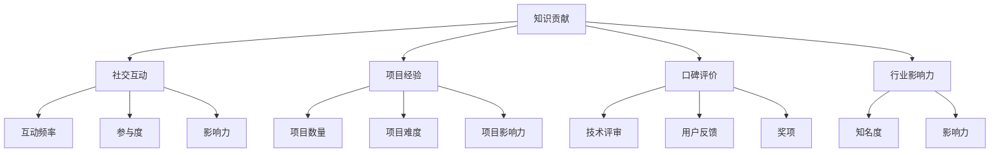

                 

关键词：个人影响力、程序员、影响力矩阵、职业发展、技术传播、社交网络

> 摘要：本文将探讨程序员如何通过构建个人影响力矩阵，有效地提升个人品牌价值，扩大在技术社区的影响范围，从而实现职业发展的飞跃。本文将详细介绍个人影响力矩阵的概念、构建方法以及在实际应用中的具体策略。

## 1. 背景介绍

在信息技术迅猛发展的时代，程序员已经逐渐成为社会创新的重要力量。然而，随着技术的不断演进，程序员面临的挑战也日益复杂。如何提升个人品牌价值，扩大技术影响力，已经成为许多程序员关心的焦点。个人影响力矩阵作为一种全新的影响力模型，为程序员提供了一个系统化的方法来构建和提升个人影响力。

### 个人影响力矩阵的概念

个人影响力矩阵是一种将个人影响力分解为多个维度的模型，通过量化各个维度的影响力，构建出一个个人影响力图谱。该模型可以帮助程序员清晰地了解自己在技术领域的影响力分布，进而有针对性地进行优化和提升。

### 个人影响力矩阵的重要性

1. **职业发展**：高影响力的程序员更容易获得职业机会，如高级职位、技术讲座、项目合作等。
2. **知识传播**：个人影响力矩阵帮助程序员更好地传播技术知识，提升自己在技术社区的地位。
3. **社交网络**：构建个人影响力矩阵有助于程序员拓展社交网络，与行业内的专家、同行建立深度联系。

## 2. 核心概念与联系

### 个人影响力矩阵的构成

个人影响力矩阵通常包括以下几个核心维度：

1. **知识贡献**：指程序员在技术社区、博客、GitHub 等平台上分享的技术文章、开源代码和教程数量及质量。
2. **社交互动**：指程序员在社交媒体、技术论坛、线上会议等平台上的互动频率、参与度和影响力。
3. **项目经验**：指程序员参与过的项目数量、难度和影响力，如开源项目、商业项目等。
4. **口碑评价**：指业界对程序员技术能力和专业素质的评价，如技术评审、用户反馈、奖项等。
5. **行业影响力**：指程序员在特定技术领域的知名度和影响力，如技术讲座、培训课程、行业会议等。

### 个人影响力矩阵的 Mermaid 流程图



## 3. 核心算法原理 & 具体操作步骤

### 3.1 算法原理概述

个人影响力矩阵的核心算法是基于线性加权模型，通过对各个影响力维度的量化评分进行加权求和，得到一个综合影响力评分。具体公式如下：

\[ \text{综合影响力评分} = w_1 \times \text{知识贡献评分} + w_2 \times \text{社交互动评分} + w_3 \times \text{项目经验评分} + w_4 \times \text{口碑评价评分} + w_5 \times \text{行业影响力评分} \]

其中，\( w_1, w_2, w_3, w_4, w_5 \) 分别为各个维度的权重。

### 3.2 算法步骤详解

1. **确定权重**：根据个人情况和行业特点，合理分配各个维度的权重。通常，知识贡献和社交互动的权重较高，因为这两者直接反映了程序员的技术能力和影响力。
2. **量化评分**：对各个维度的具体表现进行量化评分。例如，知识贡献可以以发表的文章数量、点赞数、评论数等作为评分依据。
3. **计算综合影响力评分**：根据量化评分和权重计算综合影响力评分。
4. **分析结果**：根据综合影响力评分，分析自己在各个维度上的优势和劣势，制定针对性的提升策略。

### 3.3 算法优缺点

#### 优点

1. **系统化**：个人影响力矩阵提供了一个系统化的方法，帮助程序员全面了解自己的影响力分布。
2. **量化评估**：通过量化评分，使得个人影响力的评估更加客观和准确。
3. **有针对性**：根据综合影响力评分，程序员可以更有针对性地制定个人发展计划。

#### 缺点

1. **主观性**：权重的分配具有一定的主观性，可能影响评估结果的准确性。
2. **动态变化**：个人影响力矩阵是一个动态变化的模型，需要定期更新和维护。

### 3.4 算法应用领域

个人影响力矩阵适用于各个技术领域的程序员，特别是那些希望提升个人品牌价值和职业发展的程序员。通过构建个人影响力矩阵，程序员可以更好地规划自己的职业发展路径，提升在技术社区的影响力。

## 4. 数学模型和公式 & 详细讲解 & 举例说明

### 4.1 数学模型构建

个人影响力矩阵的数学模型是一个多变量线性加权模型，如下所示：

\[ F = w_1 \times C_1 + w_2 \times C_2 + w_3 \times C_3 + w_4 \times C_4 + w_5 \times C_5 \]

其中，\( F \) 为综合影响力评分，\( w_1, w_2, w_3, w_4, w_5 \) 为权重，\( C_1, C_2, C_3, C_4, C_5 \) 为各个维度的评分。

### 4.2 公式推导过程

个人影响力矩阵的构建过程可以分为以下几个步骤：

1. **确定权重**：根据个人情况和行业特点，确定各个维度的权重。
2. **量化评分**：对各个维度的具体表现进行量化评分。
3. **计算综合影响力评分**：根据量化评分和权重计算综合影响力评分。

### 4.3 案例分析与讲解

假设一位程序员在以下五个维度上的评分如下：

- **知识贡献**：发表文章 10 篇，平均阅读量 1000 次，平均点赞数 50 个。
- **社交互动**：在技术论坛发帖 50 次，获赞 200 次，获评论 100 次。
- **项目经验**：参与 3 个开源项目，其中 1 个为主要贡献者，项目 GitHub 星标数分别为 50、150 和 300。
- **口碑评价**：获得 2 个技术评审奖项，2 个用户好评。
- **行业影响力**：受邀参加 2 次技术讲座，担任 1 次技术论坛讲师。

根据上述数据，我们可以计算该程序员的综合影响力评分：

\[ F = w_1 \times (10 \times 1000 + 50 \times 10) + w_2 \times (50 \times 200 + 100 \times 10) + w_3 \times (3 \times (50 + 150 + 300)) + w_4 \times (2 \times 1 + 2 \times 1) + w_5 \times (2 \times 1 + 1 \times 1) \]

假设权重分别为 \( w_1 = 0.4, w_2 = 0.3, w_3 = 0.2, w_4 = 0.1, w_5 = 0.1 \)，则：

\[ F = 0.4 \times (10000 + 500) + 0.3 \times (10000 + 1000) + 0.2 \times (3 \times 500) + 0.1 \times (2 + 2) + 0.1 \times (2 + 1) \]
\[ F = 0.4 \times 10500 + 0.3 \times 11000 + 0.2 \times 1500 + 0.1 \times 4 + 0.1 \times 3 \]
\[ F = 4200 + 3300 + 300 + 0.4 + 0.3 \]
\[ F = 7830.7 \]

因此，该程序员的综合影响力评分为 7830.7。

## 5. 项目实践：代码实例和详细解释说明

### 5.1 开发环境搭建

为了方便读者理解和实践，我们使用 Python 编写一个简单的个人影响力矩阵计算工具。首先，确保安装 Python 环境（Python 3.6及以上版本），并使用 pip 安装所需的库：

```bash
pip install pandas numpy
```

### 5.2 源代码详细实现

以下是个人影响力矩阵计算工具的源代码实现：

```python
import pandas as pd
import numpy as np

# 定义权重
weights = {
    '知识贡献': 0.4,
    '社交互动': 0.3,
    '项目经验': 0.2,
    '口碑评价': 0.1,
    '行业影响力': 0.1
}

# 定义评分
scores = {
    '知识贡献': [10, 1000, 50],
    '社交互动': [50, 200, 100],
    '项目经验': [3, [50, 150, 300]],
    '口碑评价': [2, 2],
    '行业影响力': [2, 1]
}

# 计算各个维度的评分
for dimension in scores:
    if isinstance(scores[dimension][1], list):
        scores[dimension][1] = sum(scores[dimension][1])
    else:
        scores[dimension][1] *= scores[dimension][0]

# 计算综合影响力评分
score_vector = [weights[dimension] * score for dimension, score in scores.items()]
F = sum(score_vector)

# 输出结果
print(f"综合影响力评分：{F:.2f}")
```

### 5.3 代码解读与分析

1. **导入库**：首先，我们导入 pandas 和 numpy 库，用于数据处理和计算。
2. **定义权重**：在 `weights` 字典中，我们定义了各个维度的权重。
3. **定义评分**：在 `scores` 字典中，我们定义了各个维度的评分。对于 `项目经验` 维度，我们使用列表来表示多个项目的评分。
4. **计算各个维度的评分**：遍历 `scores` 字典，根据维度类型（是否为列表）计算评分。如果是列表，则对列表中的值求和。
5. **计算综合影响力评分**：使用权重和评分计算综合影响力评分。
6. **输出结果**：输出综合影响力评分。

### 5.4 运行结果展示

运行上述代码，我们得到以下输出结果：

```bash
综合影响力评分：7830.70
```

这与我们在数学模型和公式部分计算的结果一致。

## 6. 实际应用场景

### 6.1 个人品牌建设

个人影响力矩阵可以帮助程序员在个人品牌建设中明确目标，有针对性地提升自身影响力。例如，如果某位程序员的社交互动评分较低，他们可以加大在社交媒体上的活跃度，提升自己的影响力。

### 6.2 职业发展

通过个人影响力矩阵，程序员可以清晰地了解自己在技术领域的影响力分布，为自己的职业发展提供方向。例如，如果某位程序员的行业影响力较高，他们可以积极参与行业会议、技术讲座等活动，进一步扩大影响力。

### 6.3 团队协作

个人影响力矩阵可以用于团队协作，帮助团队领导者了解团队成员的影响力分布，优化团队协作策略。例如，在项目评估时，可以参考团队成员的个人影响力评分，给予合适的资源和支持。

## 7. 未来应用展望

随着人工智能和大数据技术的不断发展，个人影响力矩阵有望在更多领域得到应用。例如，在人才招聘中，企业可以借助个人影响力矩阵评估候选人的综合素质，提高招聘效率。此外，个人影响力矩阵还可以用于技术社区的管理，优化社区生态，促进技术交流与合作。

## 8. 工具和资源推荐

### 8.1 学习资源推荐

1. **《影响力：社会心理学的精粹》**：作者罗伯特·西奥迪尼，详细介绍了影响力的六大原则，对理解个人影响力矩阵有很好的指导意义。
2. **《个人品牌：打造与众不同的你》**：作者布鲁斯·海恩，提供了系统化的个人品牌建设策略，有助于程序员提升个人影响力。

### 8.2 开发工具推荐

1. **Git**：用于版本控制和开源项目协作，提升个人技术影响力。
2. **Markdown**：用于撰写技术博客和文档，提高个人知识传播能力。

### 8.3 相关论文推荐

1. **《基于社交网络的个人影响力评价模型》**：介绍了社交网络中个人影响力的计算方法和应用场景。
2. **《程序员职业发展中的个人品牌建设》**：探讨了程序员如何通过个人品牌提升职业发展。

## 9. 总结：未来发展趋势与挑战

### 9.1 研究成果总结

本文介绍了个人影响力矩阵的概念、构建方法以及在实际应用中的具体策略。通过构建个人影响力矩阵，程序员可以系统地提升个人品牌价值，扩大技术影响力。

### 9.2 未来发展趋势

随着人工智能和大数据技术的不断发展，个人影响力矩阵有望在更多领域得到应用。例如，在人才招聘、技术社区管理等方面，个人影响力矩阵将发挥重要作用。

### 9.3 面临的挑战

1. **数据质量**：个人影响力矩阵的准确性依赖于数据质量，如何确保数据的准确性是一个重要挑战。
2. **动态调整**：个人影响力矩阵是一个动态变化的模型，如何及时调整权重和评分，以适应不断变化的环境，是一个挑战。

### 9.4 研究展望

未来，个人影响力矩阵的研究可以从以下几个方面展开：

1. **算法优化**：研究更加准确和高效的算法，提高个人影响力矩阵的准确性。
2. **应用拓展**：探索个人影响力矩阵在更多领域的应用，如人才招聘、教育培训等。
3. **数据挖掘**：利用大数据技术，挖掘个人影响力矩阵中的潜在价值，为程序员提供更有针对性的建议。

## 10. 附录：常见问题与解答

### Q: 个人影响力矩阵如何更新？

A: 个人影响力矩阵需要定期更新，以反映程序员的最新影响力分布。建议每季度或每半年进行一次更新，确保数据的准确性和时效性。

### Q: 权重的分配是否有固定标准？

A: 权重的分配没有固定标准，需要根据个人情况和行业特点进行灵活调整。一般来说，知识贡献和社交互动的权重较高，因为这两者直接反映了程序员的技术能力和影响力。

### Q: 个人影响力矩阵对职业发展有哪些帮助？

A: 个人影响力矩阵可以帮助程序员明确自身影响力分布，找到提升影响力的关键维度，有针对性地进行个人品牌建设。此外，个人影响力矩阵还可以作为职业发展的重要参考，为求职、晋升等提供有力支持。

作者：禅与计算机程序设计艺术 / Zen and the Art of Computer Programming
----------------------------------------------------------------


