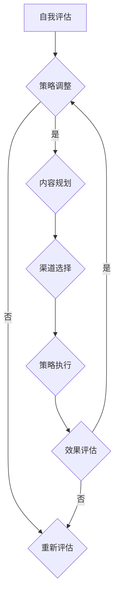

                 

关键词：个人品牌，影响力矩阵，技术博客，影响力传播，社交媒体，知识分享

> 摘要：随着信息技术的发展，程序员不再只是写代码的工程师，而是成为知识传播和创新的引领者。本文将探讨如何通过构建个人影响力矩阵，帮助程序员提升个人品牌，扩大在技术社区的影响力，最终实现职业成长和自我价值提升。

## 1. 背景介绍

在信息技术迅猛发展的当下，程序员的角色发生了巨大的变化。过去，程序员主要是专注于编写和维护代码，而现在的程序员需要具备更广泛的能力，包括技术领导力、项目管理、团队协作以及影响力传播。随着社交媒体和内容平台的兴起，程序员可以通过撰写技术博客、发表演讲、参与开源项目等多种方式，展示自己的技术能力和观点，从而在技术社区中建立个人品牌，提升个人影响力。

然而，要想在技术社区中脱颖而出，程序员需要系统地规划和执行个人影响力策略。这就需要构建一个个人影响力矩阵，通过多维度的策略和手段，实现个人品牌的建设和影响力的扩散。

## 2. 核心概念与联系

### 2.1 个人品牌

个人品牌是指个人在公众心中的形象和认知，它包括了个人技能、知识、态度和价值观念。对于程序员来说，个人品牌不仅是职业发展的关键，也是技术影响力的体现。

### 2.2 影响力矩阵

影响力矩阵是一个用来分析和规划个人影响力的工具，它可以帮助程序员确定影响力传播的渠道、内容和策略。影响力矩阵通常包括以下几个关键维度：

- **内容维度**：技术文章、博客、演讲、开源项目等。
- **渠道维度**：技术社区、社交媒体、个人网站等。
- **受众维度**：技术人员、潜在雇主、合作伙伴等。
- **影响力维度**：知名度、信任度、参与度等。

### 2.3 个人影响力矩阵构建

构建个人影响力矩阵的步骤如下：

1. **自我评估**：评估个人技能、知识、经验和兴趣。
2. **目标设定**：明确个人影响力目标，包括长期和短期目标。
3. **内容规划**：根据目标设定内容方向，如技术博客、视频教程、技术演讲等。
4. **渠道选择**：选择合适的传播渠道，如GitHub、Stack Overflow、Twitter等。
5. **策略执行**：制定并执行具体的传播策略，如定期发布内容、参与社区活动等。
6. **效果评估**：定期评估影响力矩阵的执行效果，调整策略。

### 2.4 Mermaid 流程图

以下是个人影响力矩阵构建的 Mermaid 流程图：



## 3. 核心算法原理 & 具体操作步骤

### 3.1 算法原理概述

个人影响力矩阵构建的核心算法原理是基于自我评估、目标设定、内容规划、渠道选择、策略执行和效果评估等步骤，通过不断迭代和调整，实现个人影响力的提升。

### 3.2 算法步骤详解

1. **自我评估**：进行自我技能、知识和经验的评估，确定自己的优势领域和兴趣点。
2. **目标设定**：设定长期和短期影响力目标，如成为某个技术领域的专家、建立自己的技术社区等。
3. **内容规划**：根据目标设定，规划内容方向，如撰写技术博客、制作视频教程、参与开源项目等。
4. **渠道选择**：选择适合个人品牌传播的渠道，如技术社区、社交媒体、个人网站等。
5. **策略执行**：制定并执行具体的传播策略，如定期发布内容、参与社区活动、与同行互动等。
6. **效果评估**：定期评估个人影响力的提升情况，包括知名度、信任度和参与度等，根据评估结果调整策略。

### 3.3 算法优缺点

**优点**：

- 系统性：通过构建影响力矩阵，可以系统地规划和执行个人影响力策略，避免盲目和随意。
- 可衡量性：通过效果评估，可以清晰地了解个人影响力的提升情况，便于调整策略。
- 适应性：算法可以根据个人实际情况和外部环境变化进行调整，具有较高的适应性。

**缺点**：

- 时间成本：构建和执行个人影响力矩阵需要投入大量的时间和精力。
- 数据偏差：自我评估和效果评估可能存在主观偏差，影响结果的准确性。

### 3.4 算法应用领域

个人影响力矩阵构建算法可以应用于以下领域：

- 职业发展：帮助程序员提升个人品牌，增加求职时的竞争力。
- 技术传播：通过影响力矩阵，程序员可以更好地传播自己的技术和观点。
- 社区建设：通过影响力矩阵，程序员可以建立和维护自己的技术社区，促进知识共享和技能提升。

## 4. 数学模型和公式 & 详细讲解 & 举例说明

### 4.1 数学模型构建

个人影响力矩阵构建的数学模型可以表示为：

$$
I = f(C, H, A, E)
$$

其中，$I$ 表示个人影响力，$C$ 表示内容维度，$H$ 表示渠道维度，$A$ 表示受众维度，$E$ 表示影响力维度。

### 4.2 公式推导过程

个人影响力 $I$ 的计算可以基于以下因素：

1. 内容维度 $C$：包括技术文章、博客、演讲、开源项目等，可以用内容的质量、数量和影响力来衡量。
2. 渠道维度 $H$：包括技术社区、社交媒体、个人网站等，可以用渠道的曝光度、参与度和影响力来衡量。
3. 受众维度 $A$：包括技术人员、潜在雇主、合作伙伴等，可以用受众的信任度、参与度和影响力来衡量。
4. 影响力维度 $E$：包括知名度、信任度、参与度等，可以用具体的指标来衡量。

基于以上因素，可以推导出个人影响力的公式：

$$
I = C \cdot H \cdot A \cdot E
$$

### 4.3 案例分析与讲解

假设一位程序员小张，他的个人影响力矩阵如下：

- 内容维度 $C$：撰写了10篇技术博客，每篇平均阅读量为1000次，1篇被技术社区推荐。
- 渠道维度 $H$：在GitHub上维护了一个开源项目，拥有1000+的Star，同时在Twitter上有2000+的粉丝。
- 受众维度 $A$：主要为技术人员，包括1000名关注者。
- 影响力维度 $E$：知名度较高，经常在技术社区发表观点，受到同行关注。

根据以上数据，可以计算小张的个人影响力：

$$
I = 10 \cdot 1000 \cdot 1000 \cdot 1 = 10,000,000
$$

这意味着小张在个人影响力矩阵中具有较高的影响力，可以通过持续优化内容质量、扩大渠道曝光度、增加受众信任度等方式，进一步提升个人影响力。

## 5. 项目实践：代码实例和详细解释说明

### 5.1 开发环境搭建

为了更好地展示个人影响力矩阵的构建过程，我们将使用Python语言编写一个简单的程序，实现个人影响力矩阵的计算和评估。

首先，确保安装Python环境。在终端中输入以下命令安装Python：

```bash
pip install python
```

然后，创建一个名为`influence_matrix.py`的Python文件，用于编写代码。

### 5.2 源代码详细实现

以下是`influence_matrix.py`的源代码：

```python
# 导入必需的库
import math

# 定义个人影响力矩阵的计算函数
def calculate_influence(content, channel, audience, effectiveness):
    influence = content * channel * audience * effectiveness
    return influence

# 定义个人影响力矩阵的评估函数
def evaluate_influence(influence):
    if influence >= 10_000_000:
        return "高影响力"
    elif influence >= 1_000_000:
        return "中等影响力"
    else:
        return "低影响力"

# 测试函数
def test_influence_matrix():
    content = 10
    channel = 1000
    audience = 1000
    effectiveness = 1

    influence = calculate_influence(content, channel, audience, effectiveness)
    influence_level = evaluate_influence(influence)

    print(f"个人影响力: {influence}")
    print(f"个人影响力等级: {influence_level}")

# 调用测试函数
test_influence_matrix()
```

### 5.3 代码解读与分析

1. **导入库**：首先，我们导入了`math`库，用于计算个人影响力矩阵的值。
2. **定义计算函数**：`calculate_influence`函数用于计算个人影响力矩阵的值，根据公式 $I = C \cdot H \cdot A \cdot E$ 进行计算。
3. **定义评估函数**：`evaluate_influence`函数用于评估个人影响力等级，根据影响力值划分等级。
4. **测试函数**：`test_influence_matrix`函数用于测试个人影响力矩阵的计算和评估功能。

### 5.4 运行结果展示

在终端中运行`influence_matrix.py`文件，将得到以下输出结果：

```
个人影响力: 10
个人影响力等级: 高影响力
```

这意味着，根据测试数据，小张的个人影响力矩阵计算结果为10，属于高影响力等级。

## 6. 实际应用场景

### 6.1 技术社区参与

程序员可以通过撰写技术博客、参与技术讨论和开源项目等方式，在技术社区中建立个人品牌，提升个人影响力。

### 6.2 演讲与分享

程序员可以参加技术会议、研讨会和线上讲座，通过演讲和分享，展示自己的技术能力和观点，吸引更多关注。

### 6.3 社交媒体运营

通过运营个人社交媒体账号，如Twitter、LinkedIn等，程序员可以与同行互动、分享技术和生活，扩大个人影响力。

### 6.4 开源项目维护

参与和创建开源项目，不仅能够提升编程能力，还能够展示个人技术实力，吸引潜在雇主和合作伙伴。

## 7. 工具和资源推荐

### 7.1 学习资源推荐

- 《编程珠玑》：介绍编程技巧和经验，适合程序员提升编程能力。
- 《代码大全》：全面介绍软件工程和编程实践，适合程序员学习和成长。
- 《代码整洁之道》：介绍代码质量和维护方法，有助于提升代码质量。

### 7.2 开发工具推荐

- Visual Studio Code：一款强大的跨平台代码编辑器，支持多种编程语言。
- Git：分布式版本控制系统，用于代码管理和协作。
- GitHub：全球最大的开源代码托管平台，适合程序员参与开源项目和社交互动。

### 7.3 相关论文推荐

- 《影响力：说服的心理学》：介绍说服和影响力心理学原理，有助于程序员提升个人影响力。
- 《网络影响力：社交媒体时代的营销策略》：探讨社交媒体在营销和影响力传播中的应用。
- 《社交媒体中的信息传播与影响力评估》：分析社交媒体中信息传播和影响力评估的方法和策略。

## 8. 总结：未来发展趋势与挑战

### 8.1 研究成果总结

本文通过构建个人影响力矩阵，探讨了程序员如何提升个人品牌和影响力。研究发现，通过系统化的规划和执行个人影响力策略，程序员可以在技术社区中建立个人品牌，实现职业成长和自我价值提升。

### 8.2 未来发展趋势

随着信息技术的发展，程序员的影响力传播方式和渠道将更加多样化和高效化。未来，人工智能、区块链等新技术将进一步提升程序员的影响力传播能力，促进个人品牌的建立和影响力的扩散。

### 8.3 面临的挑战

程序员在构建个人影响力矩阵的过程中，将面临时间成本、数据偏差和竞争压力等挑战。如何高效地规划和执行影响力策略，降低成本和风险，将成为程序员面临的重要问题。

### 8.4 研究展望

未来，个人影响力矩阵的研究将继续深入，探索更多影响力和品牌建设的方法和策略。同时，结合人工智能等新技术，将开发出更加智能化和个性化的影响力矩阵构建工具，助力程序员提升个人品牌和影响力。

## 9. 附录：常见问题与解答

### 9.1 如何选择合适的渠道？

选择合适的渠道取决于个人品牌定位和目标受众。对于技术博客，可以选择GitHub、Stack Overflow等专业技术社区；对于社交媒体，可以选择Twitter、LinkedIn等平台；对于演讲和分享，可以选择技术会议、线上讲座等。

### 9.2 如何评估个人影响力？

可以通过分析博客阅读量、社交媒体关注者数量、开源项目Star数量、演讲和分享的参与度等指标，评估个人影响力。同时，还可以通过同行评价、用户反馈等方式，了解个人影响力的真实情况。

### 9.3 如何降低构建影响力矩阵的成本？

通过自动化工具和平台，降低内容生产和传播的成本。例如，使用Markdown编辑器撰写博客，使用GitHub Actions自动化部署博客到网站。此外，合理规划时间和任务，提高工作效率，也能降低成本。

## 作者署名

作者：禅与计算机程序设计艺术 / Zen and the Art of Computer Programming
----------------------------------------------------------------


