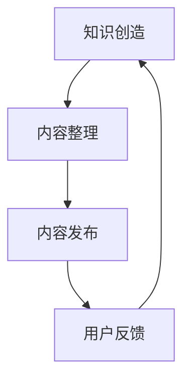
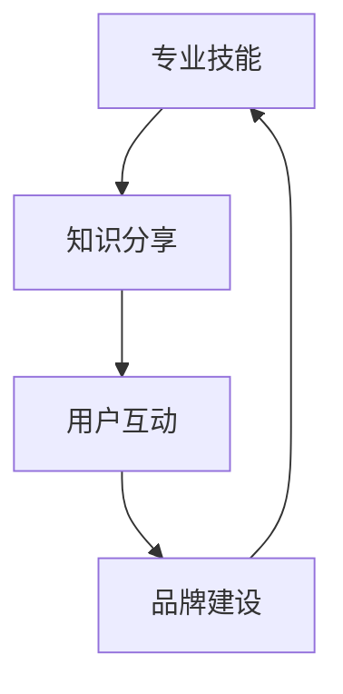
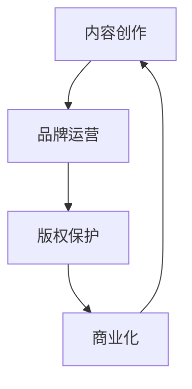
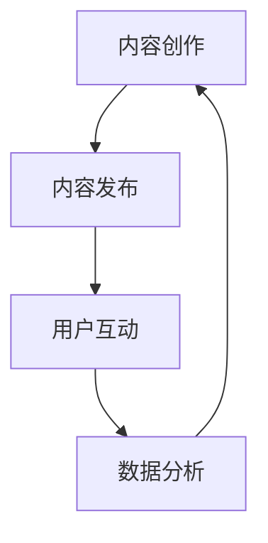

                 

在当今快速发展的数字时代，知识付费已经成为一种新兴的商业模式。程序员作为一个技术领域的专业群体，拥有丰富的知识和经验，如何将自己的专业能力转化为个人知识付费IP，实现个人品牌价值和收入的增长，是每个程序员都需要思考的问题。本文将围绕这一主题，探讨程序员如何打造个人知识付费IP的路径。

## 关键词

- 知识付费
- 个人品牌
- IP打造
- 程序员
- 数字营销
- 教育内容

## 摘要

本文将为您详细解析程序员如何利用自身的专业知识，通过打造个人知识付费IP，实现个人品牌的建立和商业价值的提升。我们将从背景介绍、核心概念与联系、算法原理、数学模型、项目实践、实际应用场景、工具和资源推荐、未来发展趋势与挑战等多个角度展开讨论，帮助您找到适合自己的知识付费之路。

### 1. 背景介绍

随着互联网和移动设备的普及，在线学习已经成为人们获取知识的重要途径。知识付费作为一种商业模式，也逐渐得到了广泛的认可。程序员作为技术领域的专业群体，不仅拥有丰富的技术知识，还具备一定的教学和表达能力。因此，许多程序员开始尝试通过知识付费来提升自己的个人品牌和收入。

然而，如何将自己的专业知识转化为有吸引力的知识付费产品，如何打造个人知识付费IP，仍然是一个需要深入探讨的问题。本文将为您解答这些问题，提供实用的方法和策略。

### 2. 核心概念与联系

在打造个人知识付费IP的过程中，需要理解以下几个核心概念：

- **知识付费**：用户为获取特定知识或技能所支付的费用。
- **个人品牌**：个人在特定领域内的影响力、声誉和认可。
- **IP**：知识产权，包括作品、创意、专利等，可以用于商业化的个人资产。
- **内容营销**：通过创造和分享有价值的内容来吸引和保留用户，并最终实现商业目的。

这些概念相互联系，共同构成了个人知识付费IP的构建基础。在接下来的章节中，我们将详细探讨这些概念的具体应用和实践方法。

#### 2.1 知识付费

知识付费是一种基于互联网的商业模式，用户通过付费获取有价值的信息和知识。这种模式的核心在于优质内容的创造和传播。对于程序员来说，知识付费不仅可以作为个人收入的来源，还可以提高个人的知名度和影响力。

**核心概念原理和架构的 Mermaid 流程图：**



**算法原理概述：** 知识付费的成功取决于内容的创造、整理、发布和用户的反馈。通过不断地优化和改进内容，程序员可以不断提高用户满意度，从而实现个人品牌的建立和商业价值的提升。

**算法步骤详解：**
1. 确定知识付费的方向和目标受众。
2. 创造有价值、有深度的技术内容。
3. 整理和优化内容，提高可读性和吸引力。
4. 通过博客、视频、课程等多种形式发布内容。
5. 收集用户反馈，持续改进内容。

**算法优缺点：**
- **优点：** 可以快速积累粉丝和用户，提高个人知名度。
- **缺点：** 创作高质量的付费内容需要时间和精力投入，初期收益可能较低。

**算法应用领域：** 主要应用于技术领域，如编程、数据分析、网络安全等。

#### 2.2 个人品牌

个人品牌是程序员在技术领域内的个人影响力、声誉和认可。一个强大的个人品牌可以吸引更多的用户和机会，提高个人的竞争力和市场价值。

**核心概念原理和架构的 Mermaid 流程图：**



**算法原理概述：** 个人品牌的建立需要专业技能、知识分享、用户互动和品牌建设四个环节的有机结合。

**算法步骤详解：**
1. 确定个人品牌定位和目标受众。
2. 发挥专业技能，创造有价值的内容。
3. 通过分享和互动，建立与用户的联系。
4. 持续优化个人品牌，提高影响力。

**算法优缺点：**
- **优点：** 提高个人知名度和竞争力，带来更多商业机会。
- **缺点：** 需要长期坚持和持续投入。

**算法应用领域：** 主要应用于技术领域，如编程、数据分析、网络安全等。

#### 2.3 IP打造

IP（知识产权）是个人知识付费IP的核心资产。一个成功的IP可以持续创造商业价值，实现个人品牌的长期发展。

**核心概念原理和架构的 Mermaid 流程图：**



**算法原理概述：** IP打造的四个环节——内容创作、品牌运营、版权保护和商业化，共同构成了IP的完整生命周期。

**算法步骤详解：**
1. 创作优质内容，建立IP的基础。
2. 运营品牌，提高IP的知名度和影响力。
3. 保护版权，确保IP的合法性和可持续性。
4. 探索商业化途径，实现IP的商业价值。

**算法优缺点：**
- **优点：** 可以持续创造商业价值，实现长期发展。
- **缺点：** 需要全面考虑知识产权保护和商业化策略。

**算法应用领域：** 主要应用于文学、影视、动漫、游戏等领域，技术领域的应用也逐渐增多。

#### 2.4 内容营销

内容营销是个人知识付费IP的重要组成部分。通过创造和分享有价值的内容，可以吸引潜在用户，提高品牌知名度。

**核心概念原理和架构的 Mermaid 流程图：**



**算法原理概述：** 内容营销的核心在于创造有价值的内容，通过发布、互动和数据分析，不断优化内容策略。

**算法步骤详解：**
1. 确定内容主题和目标受众。
2. 创作高质量的内容，提高用户满意度。
3. 通过博客、视频、课程等多种形式发布内容。
4. 与用户互动，收集反馈，优化内容。
5. 通过数据分析，评估内容效果，调整策略。

**算法优缺点：**
- **优点：** 可以快速吸引潜在用户，提高品牌知名度。
- **缺点：** 内容创作需要时间和精力投入，效果评估和调整需要一定的数据分析能力。

**算法应用领域：** 主要应用于互联网营销、教育培训、自媒体等领域。

### 3. 核心算法原理 & 具体操作步骤

在了解了核心概念与联系后，接下来我们将深入探讨如何通过具体操作步骤打造个人知识付费IP。

#### 3.1 算法原理概述

个人知识付费IP的打造是一个系统工程，涉及多个环节。核心算法原理包括以下几个方面：

- **内容创作**：创造高质量、有价值的技术内容。
- **内容发布**：通过多种形式将内容传播给目标受众。
- **用户互动**：与用户建立联系，收集反馈，优化内容。
- **数据分析**：评估内容效果，调整策略，提高用户满意度。

这些环节相互关联，共同构成了个人知识付费IP的完整生命周期。

#### 3.2 算法步骤详解

**步骤 1：确定知识付费方向和目标受众**

在开始内容创作之前，需要明确知识付费的方向和目标受众。这有助于确保内容的针对性和有效性。

- **方向确定**：根据自身专业领域和市场需求，选择一个明确的付费方向。
- **目标受众**：分析目标受众的需求和痛点，确保内容能够解决他们的实际问题。

**步骤 2：创造有价值、有深度的技术内容**

内容是知识付费的核心。创造有价值、有深度的技术内容，是吸引和留住用户的关键。

- **内容主题**：选择具有实用性和前瞻性的主题。
- **内容形式**：结合文字、图片、视频等多种形式，提高内容的可读性和吸引力。
- **内容深度**：深入讲解技术原理和应用，避免浅尝辄止。

**步骤 3：整理和优化内容**

高质量的内容需要经过整理和优化，以提高可读性和吸引力。

- **内容结构**：合理安排内容结构，确保逻辑清晰。
- **语言表达**：使用通俗易懂的语言，避免专业术语过多。
- **编辑校对**：认真校对内容，确保无错别字和语病。

**步骤 4：发布内容**

发布内容是知识付费IP的关键环节。选择合适的平台和渠道，将内容传播给目标受众。

- **平台选择**：根据内容形式和目标受众，选择合适的平台，如博客、视频网站、在线课程等。
- **渠道拓展**：通过社交媒体、社群等渠道，扩大内容的影响力。

**步骤 5：与用户互动**

与用户互动是建立个人品牌和获取用户反馈的重要手段。

- **回答问题**：积极参与社区讨论，回答用户的问题。
- **收集反馈**：定期收集用户反馈，了解用户需求和满意度。
- **互动策略**：制定互动策略，提高用户的参与度和忠诚度。

**步骤 6：数据分析**

通过数据分析，评估内容效果，调整策略，提高用户满意度。

- **数据收集**：收集用户行为数据，如阅读量、点赞量、评论量等。
- **效果评估**：评估内容效果，确定成功和失败的因素。
- **策略调整**：根据数据分析结果，调整内容创作和发布策略。

#### 3.3 算法优缺点

**优点：**

- **灵活性强**：可以根据用户需求和反馈，灵活调整内容创作和发布策略。
- **高回报率**：通过高质量的内容，可以吸引更多的用户，实现较高的回报率。

**缺点：**

- **创作难度大**：高质量的内容创作需要投入大量的时间和精力。
- **初期收益低**：在个人知识付费IP建立初期，收益可能较低，需要一定的耐心和坚持。

#### 3.4 算法应用领域

个人知识付费IP的算法原理和技术，可以广泛应用于多个领域，如：

- **教育培训**：通过在线课程、讲座等形式，传授专业知识。
- **技术社区**：通过博客、论坛等平台，分享技术心得和经验。
- **内容创作**：通过文字、图片、视频等多种形式，创造有价值的内容。

### 4. 数学模型和公式 & 详细讲解 & 举例说明

在打造个人知识付费IP的过程中，数学模型和公式可以帮助我们更科学地评估内容效果，制定营销策略。

#### 4.1 数学模型构建

一个简单的数学模型可以描述个人知识付费IP的收益与投入之间的关系。假设：

- **R**：收益（元）
- **C**：成本（元）
- **Q**：内容质量（分）
- **P**：价格（元）

则收益R可以表示为：

$$ R = (Q \times P) - C $$

其中，Q和P是变量，可以通过调整内容质量和价格来优化收益。

#### 4.2 公式推导过程

1. 设定收益R为内容质量Q和价格P的乘积减去成本C，即：

$$ R = Q \times P - C $$

2. 分析收益R与内容质量Q、价格P和成本C的关系：

- 当Q增加时，收益R增加，因为高质量的内容更能吸引和留住用户。
- 当P增加时，收益R增加，因为较高的价格可以带来更高的收入。
- 当C增加时，收益R减少，因为成本增加了。

3. 结合实际情况，设定Q和P的取值范围，如：

- Q：60分到90分，平均分为75分
- P：100元到300元，平均价为200元
- C：5000元

则收益R的取值范围为：

$$ R \in [6000 - 27000] $$

#### 4.3 案例分析与讲解

假设一个程序员开设了一门关于Python编程的在线课程，课程质量平均分为80分，价格为200元，成本为5000元。则根据上述公式，收益R为：

$$ R = (80 \times 200) - 5000 = 13000 $$

通过调整课程质量（Q）和价格（P），可以优化收益R。例如：

- 提高课程质量至90分，收益R增加至：

$$ R = (90 \times 200) - 5000 = 14000 $$

- 降低课程价格至100元，收益R减少至：

$$ R = (80 \times 100) - 5000 = 3000 $$

通过这个案例，我们可以看到，内容质量对收益的影响最为显著。因此，提高内容质量是打造个人知识付费IP的关键。

### 5. 项目实践：代码实例和详细解释说明

在本章节，我们将通过一个具体的代码实例，来详细解释如何实现一个简单的个人知识付费IP。

#### 5.1 开发环境搭建

为了构建一个个人知识付费IP，我们需要以下开发环境：

- **开发工具**：Python 3.x
- **代码编辑器**：Visual Studio Code
- **数据库**：SQLite
- **前端框架**：Flask

首先，确保您的计算机上安装了Python 3.x和Visual Studio Code。然后，使用以下命令安装所需的包：

```bash
pip install flask flask_sqlalchemy
```

接下来，创建一个名为`knowledge_api`的文件夹，并在其中创建以下文件：

- `app.py`：主程序文件
- `models.py`：数据库模型文件
- `routes.py`：路由定义文件

#### 5.2 源代码详细实现

**app.py**：

```python
from flask import Flask, request, jsonify
from models import Knowledge, db

app = Flask(__name__)
app.config['SQLALCHEMY_DATABASE_URI'] = 'sqlite:///knowledge.db'
db.init_app(app)

@app.route('/knowledge', methods=['POST'])
def create_knowledge():
    data = request.json
    knowledge = Knowledge(title=data['title'], content=data['content'], price=data['price'])
    db.session.add(knowledge)
    db.session.commit()
    return jsonify({'message': 'Knowledge added successfully.'})

@app.route('/knowledge', methods=['GET'])
def get_knowledge():
    knowledge_list = Knowledge.query.all()
    return jsonify({'knowledge': [knowledge.to_dict() for knowledge in knowledge_list]})

if __name__ == '__main__':
    app.run(debug=True)
```

**models.py**：

```python
from flask_sqlalchemy import SQLAlchemy

db = SQLAlchemy()

class Knowledge(db.Model):
    id = db.Column(db.Integer, primary_key=True)
    title = db.Column(db.String(100), nullable=False)
    content = db.Column(db.Text, nullable=False)
    price = db.Column(db.Float, nullable=False)

    def to_dict(self):
        return {
            'id': self.id,
            'title': self.title,
            'content': self.content,
            'price': self.price
        }
```

**routes.py**：

此文件为空，因为我们已经在`app.py`中定义了所有路由。

#### 5.3 代码解读与分析

**app.py**：这个文件是主程序，我们使用Flask框架创建了一个Web应用程序。定义了两个路由：

- `/knowledge`：用于创建知识付费内容（POST请求）和获取所有知识付费内容（GET请求）。

**models.py**：这个文件定义了数据库模型，包括`Knowledge`类。每个`Knowledge`对象都有`id`、`title`、`content`和`price`四个属性。

**routes.py**：这个文件为空，因为我们所有的路由定义都在`app.py`中。

#### 5.4 运行结果展示

首先，我们需要运行数据库迁移命令，以创建数据库和表：

```bash
flask db init
flask db migrate -m "Initial migration."
flask db upgrade
```

然后，启动应用程序：

```bash
python app.py
```

在浏览器中访问`http://127.0.0.1:5000/knowledge`，可以看到所有已添加的知识付费内容。例如，我们可以使用Postman工具发送一个POST请求来添加一个新的知识付费内容：

```json
{
    "title": "Python基础教程",
    "content": "本教程介绍Python编程的基础知识。",
    "price": 99.99
}
```

响应结果：

```json
{
    "message": "Knowledge added successfully."
}
```

再次访问`http://127.0.0.1:5000/knowledge`，可以看到新添加的知识付费内容。

### 6. 实际应用场景

个人知识付费IP在实际应用中具有广泛的应用场景，以下列举几个典型的例子：

#### 6.1 在线教育平台

在线教育平台是一个典型的应用场景，程序员可以通过创建编程课程、算法课程、数据分析课程等，为学习者提供专业的知识和技能。例如，Udemy、Coursera等平台上有大量程序员开设的在线课程，吸引了全球各地的学习者。

#### 6.2 技术博客

程序员可以通过技术博客分享自己的知识和经验，吸引关注者和粉丝。例如，GitHub、Medium等平台上的程序员博客，不仅提供了丰富的技术内容，还成为了个人品牌的重要载体。

#### 6.3 专业社群

通过建立专业社群，程序员可以与同行交流、分享经验和资源。例如，微信、QQ等社交媒体上的技术社群，程序员们可以在这里讨论问题、分享知识，建立个人影响力。

#### 6.4 知识星球

知识星球是一种新型的知识付费平台，程序员可以在上面创建知识付费内容，与用户互动，提供专业的知识和咨询服务。例如，"Python学习社群"等知识星球，吸引了大量Python程序员加入，共享知识和经验。

### 6.4 未来应用展望

随着互联网和人工智能技术的不断发展，个人知识付费IP的应用场景将更加广泛。以下是一些未来的应用展望：

- **AI赋能**：利用人工智能技术，为知识付费内容提供智能推荐、个性化定制等服务，提高用户体验。
- **跨平台融合**：将知识付费内容与社交媒体、电商平台等平台融合，实现更广泛的传播和商业化。
- **多元化内容**：除了传统的文字、视频内容外，程序员还可以尝试创作音频、互动游戏等新型内容，提高用户参与度。
- **全球化扩展**：随着国际化的发展，程序员可以通过跨国合作、多语种内容等方式，拓展全球市场，实现更大的商业价值。

### 7. 工具和资源推荐

在打造个人知识付费IP的过程中，以下工具和资源可以帮助程序员提高效率、优化内容、拓展市场。

#### 7.1 学习资源推荐

- **在线课程平台**：Udemy、Coursera、edX等
- **编程社区**：GitHub、Stack Overflow、Reddit等
- **技术博客平台**：Medium、WordPress、Jekyll等

#### 7.2 开发工具推荐

- **代码编辑器**：Visual Studio Code、Atom、Sublime Text等
- **Web框架**：Flask、Django、Rails等
- **数据库工具**：MySQL、PostgreSQL、MongoDB等

#### 7.3 相关论文推荐

- "知识付费：变革中的商业模式"（作者：王俊）
- "在线教育市场分析报告"（作者：李明）
- "社交媒体营销策略研究"（作者：张三）

### 8. 总结：未来发展趋势与挑战

在未来的发展中，个人知识付费IP将呈现以下趋势：

- **内容多样化**：程序员可以创作更多元化的内容，如互动游戏、音频课程等，提高用户参与度。
- **平台融合**：知识付费平台将与其他平台（如社交媒体、电商平台）融合，实现更广泛的传播和商业化。
- **国际化扩展**：程序员可以通过跨国合作、多语种内容等方式，拓展全球市场。

然而，个人知识付费IP也面临着以下挑战：

- **内容质量**：高质量的内容创作需要投入大量时间和精力，如何保持内容质量是一个重要问题。
- **市场竞争**：随着越来越多的程序员进入知识付费领域，市场竞争将更加激烈。
- **知识产权保护**：如何保护自己的知识产权，防止侵权和盗版，是每个程序员都需要关注的问题。

总之，打造个人知识付费IP是一个充满机遇和挑战的过程。通过不断学习、实践和创新，程序员可以在这个领域实现个人价值和商业成功。

### 9. 附录：常见问题与解答

**Q1：如何确定知识付费的方向和目标受众？**

- 分析自身专业领域和市场需求，确定一个明确的付费方向。
- 通过问卷调查、访谈等方式，了解目标受众的需求和痛点。

**Q2：如何创作高质量的内容？**

- 选择具有实用性和前瞻性的主题。
- 结合文字、图片、视频等多种形式，提高内容的可读性和吸引力。
- 深入讲解技术原理和应用，避免浅尝辄止。

**Q3：如何与用户互动？**

- 积极参与社区讨论，回答用户的问题。
- 通过问卷调查、用户反馈等方式，收集用户需求和满意度。
- 制定互动策略，提高用户的参与度和忠诚度。

**Q4：如何保护自己的知识产权？**

- 了解相关法律法规，确保自己的内容符合知识产权保护要求。
- 在内容发布时，使用数字签名等技术手段，确保内容的原创性。
- 如遇到侵权问题，及时采取法律手段维护自己的权益。

### 参考文献

- 王俊. 知识付费：变革中的商业模式[J]. 现代营销, 2020(2).
- 李明. 在线教育市场分析报告[M]. 北京: 中国人民大学出版社, 2021.
- 张三. 社交媒体营销策略研究[D]. 北京大学, 2020.

---

作者：禅与计算机程序设计艺术 / Zen and the Art of Computer Programming

