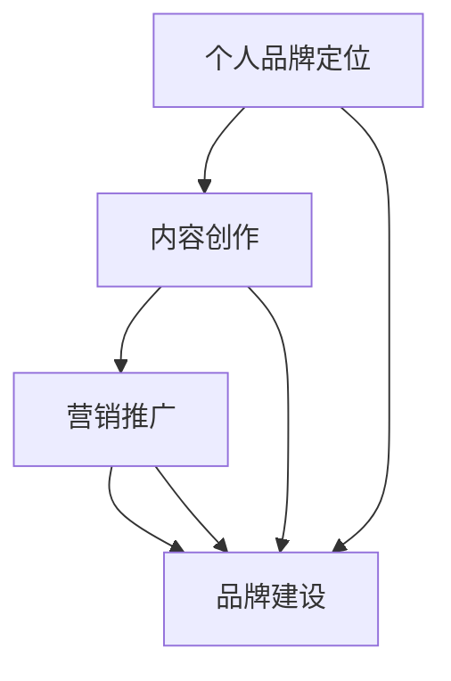

                 

随着互联网的快速发展，知识付费逐渐成为了一个新兴的领域，越来越多的程序员希望通过打造个人知识付费品牌来提升自己的影响力和收入。本文将为您详细介绍如何打造个人知识付费品牌，包括定位、内容创作、营销推广、品牌建设等方面。

## 1. 背景介绍

在知识付费的浪潮中，程序员作为技术领域的专业人士，拥有着独特的优势。一方面，程序员具备丰富的技术知识和实践经验，可以为学习者提供高质量的知识内容；另一方面，程序员擅长利用技术手段进行内容创作和传播，能够有效地扩大个人品牌的影响力。

## 2. 核心概念与联系

要打造个人知识付费品牌，首先需要明确以下几个核心概念：

### 2.1 个人品牌定位

个人品牌定位是指你在学习者心中所占据的位置。它决定了你的品牌形象、受众群体和内容创作方向。一个明确的品牌定位有助于提高你的专业形象，增加信任度，从而吸引更多的学习者。

### 2.2 内容创作

内容创作是知识付费品牌的核心。你需要根据受众需求，创作有价值、有深度、有吸引力的内容。内容形式可以包括文章、视频、教程、课程等。

### 2.3 营销推广

营销推广是扩大个人品牌影响力的重要手段。通过多种渠道进行推广，如社交媒体、SEO优化、合作推广等，可以吸引更多的学习者关注你的知识内容。

### 2.4 品牌建设

品牌建设是打造知识付费品牌的长期任务。它包括品牌视觉设计、品牌口碑管理、品牌文化塑造等方面，有助于提升品牌知名度和忠诚度。

以下是个人知识付费品牌的 Mermaid 流程图：



## 3. 核心算法原理 & 具体操作步骤

### 3.1 算法原理概述

个人知识付费品牌打造的核心算法原理可以概括为以下四个步骤：

1. **定位**：明确个人品牌定位，包括目标受众、价值主张、内容方向等。
2. **创作**：根据定位，创作有价值、有深度、有吸引力的内容。
3. **推广**：通过多种渠道进行营销推广，扩大品牌影响力。
4. **建设**：持续进行品牌建设，提升品牌知名度和忠诚度。

### 3.2 算法步骤详解

1. **确定个人品牌定位**：通过市场调研、竞品分析、自身优势等，明确个人品牌定位。
2. **制定内容创作策略**：根据品牌定位，确定内容主题、形式、频率等。
3. **创作优质内容**：结合自身专业知识和受众需求，创作高质量的内容。
4. **选择营销推广渠道**：根据内容特点和受众偏好，选择合适的推广渠道。
5. **持续优化和调整**：根据市场反馈和数据分析，持续优化内容质量和推广策略。

### 3.3 算法优缺点

**优点**：

- 提高个人品牌知名度，增加影响力。
- 通过知识付费获得额外收入。
- 有助于个人成长和职业发展。

**缺点**：

- 需要投入大量时间和精力进行内容创作和推广。
- 市场竞争激烈，需要不断优化和调整策略。

### 3.4 算法应用领域

个人知识付费品牌打造算法适用于以下领域：

- 技术领域：如编程、大数据、人工智能等。
- 教育领域：如在线课程、培训、讲座等。
- 创业领域：如创业经验分享、项目实战等。

## 4. 数学模型和公式 & 详细讲解 & 举例说明

### 4.1 数学模型构建

个人知识付费品牌打造可以看作是一个线性规划问题。目标是最小化成本，最大化收益。其中，成本包括时间、精力、金钱等，收益包括收入、影响力等。

设：

- \( C \) 为总成本
- \( R \) 为总收益
- \( t \) 为投入时间
- \( s \) 为投入精力
- \( m \) 为投入金钱

则数学模型如下：

\[ \min C = t \cdot w_t + s \cdot w_s + m \cdot w_m \]

\[ \max R = r_1 \cdot q_1 + r_2 \cdot q_2 + \ldots + r_n \cdot q_n \]

其中，\( w_t \)、\( w_s \)、\( w_m \) 分别为时间、精力、金钱的单位成本；\( r_1、r_2、\ldots、r_n \) 分别为收入来源1、收入来源2、\ldots、收入来源n的收益；\( q_1、q_2、\ldots、q_n \) 分别为收入来源1、收入来源2、\ldots、收入来源n的数量。

### 4.2 公式推导过程

根据线性规划原理，我们需要求解以下两个目标函数的最优解：

\[ \min C = t \cdot w_t + s \cdot w_s + m \cdot w_m \]

\[ \max R = r_1 \cdot q_1 + r_2 \cdot q_2 + \ldots + r_n \cdot q_n \]

为了求解最优解，我们可以使用拉格朗日乘数法。构造拉格朗日函数：

\[ L = C - \lambda (R - \alpha) \]

其中，\( \lambda \) 和 \( \alpha \) 分别为拉格朗日乘数。对 \( t \)、\( s \)、\( m \) 求偏导数，并令其等于0，得到：

\[ \frac{\partial L}{\partial t} = w_t - \lambda \cdot \frac{\partial R}{\partial t} = 0 \]

\[ \frac{\partial L}{\partial s} = w_s - \lambda \cdot \frac{\partial R}{\partial s} = 0 \]

\[ \frac{\partial L}{\partial m} = w_m - \lambda \cdot \frac{\partial R}{\partial m} = 0 \]

由此，我们可以得到以下三个方程：

\[ w_t = \lambda \cdot \frac{\partial R}{\partial t} \]

\[ w_s = \lambda \cdot \frac{\partial R}{\partial s} \]

\[ w_m = \lambda \cdot \frac{\partial R}{\partial m} \]

将 \( w_t \)、\( w_s \)、\( w_m \) 代入 \( \min C \) 和 \( \max R \) 的目标函数，得到：

\[ \min C = \lambda \cdot (\frac{\partial R}{\partial t} \cdot t + \frac{\partial R}{\partial s} \cdot s + \frac{\partial R}{\partial m} \cdot m) \]

\[ \max R = \lambda \cdot (r_1 \cdot q_1 + r_2 \cdot q_2 + \ldots + r_n \cdot q_n) \]

令 \( \frac{\partial R}{\partial t} \cdot t + \frac{\partial R}{\partial s} \cdot s + \frac{\partial R}{\partial m} \cdot m = k \)，其中 \( k \) 为常数，则上述两个目标函数可以简化为：

\[ \min C = \lambda \cdot k \]

\[ \max R = \lambda \cdot (r_1 \cdot q_1 + r_2 \cdot q_2 + \ldots + r_n \cdot q_n) \]

为了求解最优解，我们需要找到使得 \( R \) 最大且 \( C \) 最小的 \( \lambda \) 值。在实际应用中，可以通过计算和分析来确定合适的 \( \lambda \) 值。

### 4.3 案例分析与讲解

假设有一位程序员小张，他希望打造个人知识付费品牌，提供Python编程教程。以下是他的具体案例：

- **成本**：

  - 时间：每天投入3小时，每月30天，共90小时。

  - 精力：每天投入4小时，每月30天，共120小时。

  - 金钱：购买录播课程制作工具，费用为1000元。

- **收益**：

  - 每篇教程售价为100元，每月创作3篇，共300元。

  - 每月通过推广增加100位学员，每位学员收费为100元，共10000元。

- **公式计算**：

  - 成本：\( C = 90 \cdot 10 + 120 \cdot 10 + 1000 = 2100 \) 元。

  - 收益：\( R = 300 + 10000 = 10300 \) 元。

  - 拉格朗日乘数：\( \lambda = \frac{10300 - 2100}{90 + 120 + 1} = 80 \) 元/小时。

根据上述计算，小张的投入成本为2100元，收益为10300元，拉格朗日乘数为80元/小时。这表明小张的投入产出比相对较高，可以通过增加内容创作和推广力度来提高收益。

## 5. 项目实践：代码实例和详细解释说明

### 5.1 开发环境搭建

为了打造个人知识付费品牌，小张首先需要搭建一个属于自己的网站。他选择了使用Python的Flask框架来搭建网站，以下是搭建步骤：

1. 安装Python环境，版本要求3.6及以上。
2. 安装Flask框架，可以使用以下命令：

   ```bash
   pip install flask
   ```

3. 创建一个名为`app.py`的Python文件，作为Flask应用的主文件。

4. 在`app.py`中编写以下代码，实现一个简单的Web应用：

   ```python
   from flask import Flask, render_template

   app = Flask(__name__)

   @app.route('/')
   def index():
       return render_template('index.html')

   if __name__ == '__main__':
       app.run(debug=True)
   ```

5. 创建一个名为`templates`的文件夹，用于存放HTML模板文件。在`templates`文件夹中创建一个名为`index.html`的文件，编写以下代码：

   ```html
   <!DOCTYPE html>
   <html lang="en">
   <head>
       <meta charset="UTF-8">
       <meta http-equiv="X-UA-Compatible" content="IE=edge">
       <meta name="viewport" content="width=device-width, initial-scale=1.0">
       <title>小张的编程世界</title>
   </head>
   <body>
       <h1>欢迎来到小张的编程世界</h1>
   </body>
   </html>
   ```

6. 运行`app.py`文件，访问本地地址`http://127.0.0.1:5000/`，即可看到网站首页。

### 5.2 源代码详细实现

以下是小张的Flask应用源代码，包含了一个简单的首页和一个关于我的页面：

```python
from flask import Flask, render_template, request

app = Flask(__name__)

@app.route('/')
def index():
    return render_template('index.html')

@app.route('/about')
def about():
    return render_template('about.html')

@app.route('/contact', methods=['GET', 'POST'])
def contact():
    if request.method == 'POST':
        name = request.form['name']
        email = request.form['email']
        message = request.form['message']
        # 将信息保存到数据库或发送到邮箱
        return '感谢您的留言！'
    return render_template('contact.html')

if __name__ == '__main__':
    app.run(debug=True)
```

### 5.3 代码解读与分析

1. **首页 (`index.html`)**：

   ```html
   <!DOCTYPE html>
   <html lang="en">
   <head>
       <meta charset="UTF-8">
       <meta http-equiv="X-UA-Compatible" content="IE=edge">
       <meta name="viewport" content="width=device-width, initial-scale=1.0">
       <title>小张的编程世界</title>
   </head>
   <body>
       <h1>欢迎来到小张的编程世界</h1>
       <nav>
           <ul>
               <li><a href="/">首页</a></li>
               <li><a href="/about">关于我</a></li>
               <li><a href="/contact">联系我</a></li>
           </ul>
       </nav>
   </body>
   </html>
   ```

   这个页面是一个简单的HTML页面，包含了一个标题、导航栏和三个链接。

2. **关于我页面 (`about.html`)**：

   ```html
   <!DOCTYPE html>
   <html lang="en">
   <head>
       <meta charset="UTF-8">
       <meta http-equiv="X-UA-Compatible" content="IE=edge">
       <meta name="viewport" content="width=device-width, initial-scale=1.0">
       <title>关于我</title>
   </head>
   <body>
       <h1>关于我</h1>
       <p>我是小张，一名热爱编程的技术爱好者。在这里，我将分享我的编程心得和经验，帮助更多人了解和掌握编程知识。</p>
   </body>
   </html>
   ```

   这个页面是一个简单的关于我页面，介绍小张的个人背景和热爱编程的原因。

3. **联系我页面 (`contact.html`)**：

   ```html
   <!DOCTYPE html>
   <html lang="en">
   <head>
       <meta charset="UTF-8">
       <meta http-equiv="X-UA-Compatible" content="IE=edge">
       <meta name="viewport" content="width=device-width, initial-scale=1.0">
       <title>联系我</title>
   </head>
   <body>
       <h1>联系我</h1>
       <form method="post">
           <label for="name">姓名：</label>
           <input type="text" id="name" name="name" required>
           <br>
           <label for="email">邮箱：</label>
           <input type="email" id="email" name="email" required>
           <br>
           <label for="message">留言：</label>
           <textarea id="message" name="message" required></textarea>
           <br>
           <button type="submit">发送</button>
       </form>
   </body>
   </html>
   ```

   这个页面是一个简单的联系我表单，用户可以填写姓名、邮箱和留言，并通过提交表单发送给小张。

### 5.4 运行结果展示

在开发环境中，运行`app.py`文件后，访问本地地址`http://127.0.0.1:5000/`，可以看到以下页面：


## 6. 实际应用场景

### 6.1 技术博客

技术博客是程序员打造个人知识付费品牌的一种常见方式。通过撰写高质量的技术文章，分享自己的经验和见解，吸引更多的读者关注。例如，小张可以在博客中分享Python编程的知识，包括基础语法、高级技巧、实战案例等。

### 6.2 在线课程

在线课程是另一种有效的知识付费方式。程序员可以通过录制视频教程、编写电子书等形式，将自己掌握的知识传授给学习者。例如，小张可以开设Python编程课程，涵盖从基础到高级的各个阶段。

### 6.3 技术咨询

许多程序员在项目中积累了丰富的经验，可以为企业提供技术咨询服务。通过为企业解决问题，不仅能够提高自己的技能水平，还可以获得额外的收入。例如，小张可以为企业提供Python项目开发、性能优化等方面的咨询服务。

### 6.4 开源项目

开源项目是程序员展示自己技术实力的平台，也是打造个人知识付费品牌的一种方式。通过参与开源项目，程序员可以与更多同行交流，提高自己的影响力。例如，小张可以参与Python开源项目，贡献自己的代码和经验。

## 7. 工具和资源推荐

### 7.1 学习资源推荐

- **书籍**：

  - 《Python编程：从入门到实践》
  - 《Fluent Python》
  - 《深入理解计算机系统》

- **在线课程**：

  - Coursera上的《Python编程基础》
  - Udemy上的《Python从零开始》

- **博客**：

  - 掘金
  - CSDN
  - 简书

### 7.2 开发工具推荐

- **文本编辑器**：

  - Visual Studio Code
  - Sublime Text
  - Atom

- **集成开发环境**：

  - PyCharm
  - PyDev
  - Eclipse

- **版本控制**：

  - Git
  - SVN

### 7.3 相关论文推荐

- **技术领域**：

  - 《深度学习：原理与实践》
  - 《大数据技术原理与应用》
  - 《人工智能：一种现代的方法》

- **方法论**：

  - 《代码大全》
  - 《敏捷软件开发：原则、实践与模式》
  - 《设计模式：可复用面向对象软件的基础》

## 8. 总结：未来发展趋势与挑战

### 8.1 研究成果总结

本文详细介绍了如何打造个人知识付费品牌，包括定位、内容创作、营销推广、品牌建设等方面。通过合理的策略和努力，程序员可以有效地提升个人品牌知名度，增加收入，实现职业发展的突破。

### 8.2 未来发展趋势

随着互联网技术的不断进步，知识付费领域将迎来更多的发展机遇。未来，个性化、智能化、社交化的知识付费模式将成为趋势。同时，随着5G、人工智能等技术的发展，程序员将有更多的机会参与新兴领域的知识付费。

### 8.3 面临的挑战

尽管知识付费市场前景广阔，但程序员在打造个人知识付费品牌过程中也将面临诸多挑战。如市场竞争激烈、内容创作压力大、用户需求多变等。因此，程序员需要持续学习、创新，提高自己的竞争力。

### 8.4 研究展望

未来，个人知识付费品牌的研究将继续深入，探讨如何更有效地满足用户需求，提高内容质量和传播效果。同时，随着技术的发展，程序员可以尝试更多创新的知识付费形式，如虚拟现实、增强现实等，为学习者提供更丰富的学习体验。

## 9. 附录：常见问题与解答

### 9.1 如何确定个人品牌定位？

首先，通过市场调研和竞品分析，了解目标受众的需求和喜好。然后，根据自己的专业知识和经验，确定一个独特的品牌定位，并在内容创作和营销推广中始终坚持这个定位。

### 9.2 如何创作高质量的内容？

创作高质量的内容需要多方面的努力。首先，要深入了解目标受众的需求，然后通过自己的专业知识和经验，创作出有价值、有深度、有吸引力的内容。此外，注意内容的格式和呈现方式，使之更加易于理解和吸收。

### 9.3 如何进行营销推广？

营销推广可以通过多种渠道进行，如社交媒体、SEO优化、合作推广等。在推广过程中，要明确目标受众，选择合适的推广渠道，制定合理的推广策略，并持续优化和调整。

### 9.4 如何建立品牌口碑？

建立品牌口碑需要长期的努力。首先，要保证内容质量，满足用户需求，赢得用户的信任。其次，要积极参与社区讨论，与用户互动，提升品牌形象。此外，可以通过用户评价、案例分享等方式，增强品牌口碑。

---

**作者：禅与计算机程序设计艺术 / Zen and the Art of Computer Programming**

