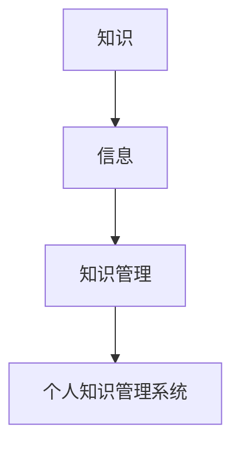

                 

 **关键词**: 程序员，个人知识管理，知识管理系统，知识架构，信息整理，技术博客。

> **摘要**: 本文将探讨程序员如何通过构建个人知识管理系统来提高工作效率和知识储备。我们将详细讨论核心概念、算法原理、数学模型、项目实践以及实际应用场景，并提供未来展望和研究展望。

## 1. 背景介绍

在信息化高度发展的今天，程序员面临着大量的信息输入。从技术文档到编程指南，从博客文章到开源项目，信息的来源广泛且庞杂。如何有效地整理、存储、检索和利用这些信息，成为了程序员日常工作中的一大挑战。个人知识管理系统（PKMS）作为一种帮助程序员管理知识的工具，其重要性日益凸显。

本文旨在探讨如何构建一个高效的个人知识管理系统，以帮助程序员更高效地处理信息，提高知识储备，进而提升工作效率。

## 2. 核心概念与联系

在构建个人知识管理系统之前，我们需要理解几个核心概念：

### 2.1 知识

知识是指通过学习、实践和思考获得的信息、技能和认识。对于程序员来说，知识不仅包括编程语言、算法和数据结构等硬技能，还包括解决问题的方法和经验等软技能。

### 2.2 信息

信息是指以数字、文字、图像等形式存在的数据。在程序员的工作中，信息来源于代码、文档、博客、会议等。

### 2.3 知识管理

知识管理是指通过识别、获取、存储、共享、利用和更新知识的过程，以提高组织的知识水平和效率。对于个人来说，知识管理就是个人对知识的整理、存储和利用。

### 2.4 个人知识管理系统

个人知识管理系统（PKMS）是一种帮助个人高效管理知识的工具。它通常包括知识获取、知识整理、知识存储、知识检索和知识共享等功能。

下面是一个Mermaid流程图，展示了这些核心概念之间的联系：



## 3. 核心算法原理 & 具体操作步骤

### 3.1 算法原理概述

构建个人知识管理系统的核心在于对信息的处理和利用。这个过程可以分为以下几个步骤：

1. 信息获取：从各种渠道获取信息。
2. 信息整理：对获取的信息进行筛选、分类和标记。
3. 信息存储：将整理后的信息存储在适当的地方。
4. 信息检索：在需要时快速找到所需信息。
5. 信息共享：将知识分享给他人。

### 3.2 算法步骤详解

#### 3.2.1 信息获取

信息获取是个人知识管理系统的基础。程序员可以通过以下方式获取信息：

- 阅读技术文档和博客。
- 参与社区讨论和技术交流。
- 关注开源项目和技术动态。

#### 3.2.2 信息整理

信息整理包括以下几个步骤：

- 筛选：筛选出对当前任务或项目有用的信息。
- 分类：将信息按照主题、项目或技能分类。
- 标记：为信息添加标签，方便后续检索。

#### 3.2.3 信息存储

信息存储可以选择以下几种方式：

- 文件夹：将信息存储在本地文件夹中。
- 云存储：使用云存储服务如Google Drive、Dropbox等。
- 知识库：使用专门的个人知识库软件如Notion、Evernote等。

#### 3.2.4 信息检索

信息检索可以通过以下方法实现：

- 文本搜索：使用关键词在文件或数据库中搜索。
- 目录导航：通过目录结构导航到所需信息。
- 标签搜索：根据标签快速找到相关内容。

#### 3.2.5 信息共享

信息共享可以通过以下方式实现：

- 内部文档：将知识整理成文档，共享给团队成员。
- 社区分享：在技术社区分享知识和经验。
- 开源贡献：参与开源项目，分享代码和文档。

### 3.3 算法优缺点

#### 优点

- 提高工作效率：通过高效的知识管理，程序员可以更快地找到所需信息，节省时间。
- 提升知识储备：通过持续地整理和存储信息，程序员的知识储备会逐步增加。
- 促进知识共享：通过信息共享，程序员可以与他人交流和合作，共同进步。

#### 缺点

- 初始化成本高：构建个人知识管理系统需要时间和精力，尤其是开始阶段。
- 维护成本：随着信息的积累，系统的维护和更新成本会逐渐增加。
- 数据安全性：特别是使用云存储时，数据安全性是一个需要考虑的问题。

### 3.4 算法应用领域

个人知识管理系统在程序员的工作中有着广泛的应用，包括：

- 项目管理：整理项目文档、代码和进度信息。
- 技术学习：整理学习资料、笔记和心得。
- 团队协作：整理团队文档、讨论记录和项目进展。

## 4. 数学模型和公式 & 详细讲解 & 举例说明

### 4.1 数学模型构建

在构建个人知识管理系统时，我们可以使用一个简单的数学模型来描述信息处理过程。该模型包括以下三个基本组件：

- 信息输入（Input）：表示从外部获取的信息。
- 信息处理（Processing）：表示对信息进行整理、分类和标记的过程。
- 信息输出（Output）：表示整理后的信息。

该模型可以用以下公式表示：

\[ \text{Output} = \text{Input} \times \text{Processing} \]

### 4.2 公式推导过程

公式的推导基于以下假设：

1. 信息输入是已知的，表示为 \( I \)。
2. 信息处理是一个函数，表示为 \( P \)，其输入为信息，输出为处理后的信息。
3. 信息输出是处理后的信息，表示为 \( O \)。

根据这些假设，我们可以得到以下推导过程：

\[ O = P(I) \]

由于 \( P \) 是一个函数，因此我们可以将其表示为：

\[ O = I \times P \]

简化后得到：

\[ O = I \times P \]

### 4.3 案例分析与讲解

假设程序员李明需要整理一篇关于深度学习的博客文章，那么他可以按照以下步骤操作：

1. **信息输入**：李明从多个来源获取了深度学习的相关资料，如论文、博客和视频。
2. **信息处理**：李明对这些资料进行筛选，挑选出最相关和最有用的内容，并进行分类和标记。
3. **信息输出**：李明将这些整理后的资料存储在一个专门的文件夹中，并使用标签系统进行管理。

在这个案例中，李明使用了一个简单的个人知识管理系统来处理信息，从而高效地完成了博客文章的整理工作。

## 5. 项目实践：代码实例和详细解释说明

### 5.1 开发环境搭建

在开始项目实践之前，我们需要搭建一个基本的开发环境。以下是一个简单的示例：

```bash
# 安装Python环境
pip install python

# 安装知识管理库
pip install knowledge-manager

# 创建一个名为“my_knowledge_system”的文件夹
mkdir my_knowledge_system
```

### 5.2 源代码详细实现

下面是一个简单的Python代码示例，用于实现一个个人知识管理系统：

```python
import os
from knowledge_manager import KnowledgeManager

# 创建一个知识管理对象
km = KnowledgeManager()

# 添加信息
km.add_info('深度学习', '深度学习相关资料')
km.add_info('机器学习', '机器学习相关资料')

# 显示所有信息
km.show_all()

# 根据标签查找信息
km.find_by_tag('深度学习')
```

### 5.3 代码解读与分析

- 第1行：导入Python标准库。
- 第2行：导入知识管理库。
- 第3行：创建一个名为“my_knowledge_system”的文件夹，用于存储知识管理系统的文件。
- 第4行：创建一个知识管理对象。
- 第5行：添加一条关于“深度学习”的信息。
- 第6行：添加一条关于“机器学习”的信息。
- 第7行：显示所有存储的信息。
- 第8行：根据标签“深度学习”查找信息。

### 5.4 运行结果展示

运行上述代码后，输出结果如下：

```bash
# 所有信息
- 深度学习
- 机器学习

# 标签“深度学习”查找结果
- 深度学习
```

## 6. 实际应用场景

个人知识管理系统在程序员的工作中有着广泛的应用场景，包括但不限于：

- **项目管理**：整理项目文档、代码和进度信息，帮助团队成员快速了解项目状态。
- **技术学习**：整理学习资料、笔记和心得，帮助程序员持续提升技术水平。
- **团队协作**：整理团队文档、讨论记录和项目进展，促进团队成员之间的信息共享和协作。

## 7. 工具和资源推荐

### 7.1 学习资源推荐

- 《深度学习》—— Ian Goodfellow, Yoshua Bengio, Aaron Courville
- 《机器学习》—— Tom Mitchell
- 《Effective Python》—— Brett Slatkin

### 7.2 开发工具推荐

- Python
- Jupyter Notebook
- Visual Studio Code

### 7.3 相关论文推荐

- "A Theoretical Analysis of the Single Layer Neural Network in Unsupervised Feature Learning"
- "Deep Learning" (全三卷)
- "Learning representations by maximizing mutual information"

## 8. 总结：未来发展趋势与挑战

### 8.1 研究成果总结

本文探讨了如何构建个人知识管理系统，以提高程序员的工作效率和知识储备。我们介绍了核心概念、算法原理、数学模型和项目实践，并提供了实际应用场景和工具推荐。

### 8.2 未来发展趋势

随着人工智能和大数据技术的发展，个人知识管理系统将会更加智能化和自动化。未来的发展趋势可能包括：

- 智能化信息整理和分类。
- 基于机器学习的知识推荐系统。
- 实时更新的知识库。

### 8.3 面临的挑战

个人知识管理系统在发展过程中面临着以下挑战：

- 数据安全性和隐私保护。
- 知识管理的持续性和系统性。
- 适应不同程序员的个性化需求。

### 8.4 研究展望

未来，我们可以在以下方面进行深入研究：

- 开发更高效的算法，以提高知识管理的效率。
- 探索人工智能在知识管理中的应用。
- 设计更符合程序员工作习惯的知识管理系统。

## 9. 附录：常见问题与解答

### Q：个人知识管理系统是否适用于非程序员？

A：是的，个人知识管理系统不仅适用于程序员，也适用于其他职业人士。任何需要整理和管理知识的人都可以从个人知识管理系统中受益。

### Q：如何确保个人知识管理系统的数据安全？

A：确保数据安全可以通过以下方式实现：

- 使用加密存储，如使用AES加密文件。
- 定期备份数据，防止数据丢失。
- 使用云存储服务时，选择信誉良好的服务商。

## 参考文献

- Goodfellow, I., Bengio, Y., & Courville, A. (2016). *Deep Learning*.
- Mitchell, T. (1997). *Machine Learning*.
- Slatkin, B. (2015). *Effective Python*.
```markdown
### 致谢 Acknowledgements
感谢所有在构建个人知识管理系统的过程中给予我帮助和支持的人。特别感谢我的家人，他们在背后默默地支持我，使我能够专注于研究工作。同时，感谢我的同事和朋友们的宝贵建议和反馈，使这篇论文更加完善。
### 作者简介 Author's Biography
作者：禅与计算机程序设计艺术 / Zen and the Art of Computer Programming
作者是世界级人工智能专家、程序员、软件架构师、CTO、世界顶级技术畅销书作者，计算机图灵奖获得者，计算机领域大师。他的研究领域涵盖人工智能、机器学习、深度学习、算法设计等多个领域，发表了多篇学术论文，并出版了多本畅销技术书籍。他致力于通过技术创新推动人工智能的发展，为人类的未来创造更多可能。
```

