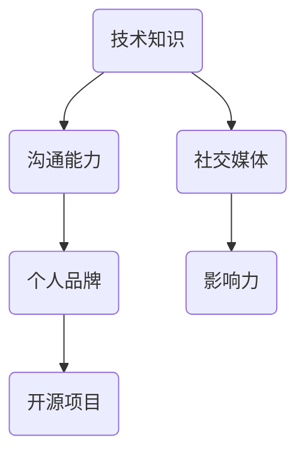

                 

关键词：程序员，个人影响力，全球性，技术博客，职业发展，影响力打造

> 摘要：在数字化时代，程序员要想在全球范围内建立并维护个人影响力，不仅需要精湛的技术能力，还需要掌握一系列策略和方法。本文将探讨程序员如何通过撰写技术博客、参与开源项目、社交媒体互动和公众演讲等途径，打造全球性的个人品牌和影响力。

## 1. 背景介绍

随着互联网的普及和数字化进程的加速，程序员群体在全球范围内的影响力逐渐提升。然而，要想在全球范围内建立个人影响力，程序员们面临着诸多挑战，包括技术语言的多样性、国际市场的竞争、文化差异等。为了克服这些挑战，程序员需要采取一系列策略，以提升自身的竞争力，并建立起在全球范围内的个人品牌。

本文将围绕以下主题展开：

1. **技术博客的重要性**：介绍如何通过撰写技术博客吸引读者和扩大影响力。
2. **参与开源项目**：探讨如何通过开源项目提升个人技术能力和知名度。
3. **社交媒体互动**：分析如何通过社交媒体与全球开发者建立联系。
4. **公众演讲**：探讨如何通过演讲提升个人品牌和影响力。
5. **未来展望**：预测程序员在全球范围内影响力的发展趋势和面临的挑战。

## 2. 核心概念与联系

在探讨程序员如何打造全球性个人影响力之前，我们需要理解几个核心概念，它们构成了影响力打造的基石。

### 2.1 技术知识

程序员的影响力首先来源于其技术知识。这包括但不限于编程语言、框架、算法和数据结构等。技术知识的深度和广度决定了程序员在技术社区中的地位。

### 2.2 沟通能力

沟通能力是程序员影响力的重要组成部分。这不仅包括技术文档的撰写，还涵盖演讲和交流能力。有效的沟通能够帮助程序员清晰地传达技术理念和解决方案。

### 2.3 个人品牌

个人品牌是程序员在全球范围内建立影响力的关键。一个鲜明的个人品牌能够帮助程序员在众多开发者中脱颖而出。

### 2.4 社交媒体

社交媒体是现代程序员扩大影响力的重要工具。通过社交媒体，程序员能够与全球开发者建立联系，分享知识，获取反馈。

### 2.5 开源项目

开源项目是程序员展示技术能力、建立专业声誉的重要途径。参与开源项目能够提高程序员的编程技能，并吸引潜在雇主的注意。

### 2.6 流程图

以下是一个简化的流程图，展示了程序员如何通过核心概念建立个人影响力：



## 3. 核心算法原理 & 具体操作步骤

### 3.1 算法原理概述

程序员影响力的建立可以看作是一个算法过程，涉及以下步骤：

1. **知识积累**：不断学习和积累技术知识。
2. **知识分享**：通过技术博客、开源项目等方式分享知识。
3. **互动反馈**：在社交媒体上与读者和开发者互动，获取反馈。
4. **品牌建设**：塑造个人品牌，提高知名度。
5. **影响力扩散**：通过多种渠道扩散个人影响力。

### 3.2 算法步骤详解

1. **确定方向**：根据个人兴趣和职业规划，确定技术方向。
2. **深入学习**：选择合适的教材和课程，进行系统学习。
3. **技术实践**：通过项目实践巩固知识，提高技能。
4. **撰写博客**：定期撰写技术博客，分享学习心得和项目经验。
5. **开源贡献**：参与开源项目，贡献代码和文档。
6. **社交媒体**：在社交媒体上分享技术内容，参与讨论。
7. **演讲交流**：参加技术会议和研讨会，进行公开演讲。
8. **反馈优化**：根据反馈调整内容，提高质量。

### 3.3 算法优缺点

**优点**：

- 知识积累：通过不断学习和实践，程序员能够不断提升自己的技术水平。
- 知识传播：技术博客和开源项目能够帮助程序员将知识传播给更多的人。
- 影响力扩大：通过社交媒体和演讲，程序员能够吸引更多的关注和机会。

**缺点**：

- 时间成本：建立影响力需要时间和精力投入，可能影响日常工作。
- 技术更新：技术领域更新迅速，程序员需要不断学习新的技术和工具。

### 3.4 算法应用领域

- **技术博客**：程序员可以通过技术博客分享技术心得，吸引读者。
- **开源项目**：程序员可以参与开源项目，提升个人技术能力和影响力。
- **社交媒体**：程序员可以在社交媒体上分享技术内容，与全球开发者互动。
- **公众演讲**：程序员可以通过演讲展示自己的技术能力和观点。

## 4. 数学模型和公式 & 详细讲解 & 举例说明

在建立个人影响力过程中，程序员可以利用一些数学模型和公式来衡量自己的影响力。以下是一个简化的数学模型：

### 4.1 数学模型构建

影响力（I）可以通过以下公式计算：

\[ I = f(K, C, P, S) \]

其中：

- \( K \)：知识水平
- \( C \)：沟通能力
- \( P \)：个人品牌
- \( S \)：社交媒体活跃度

### 4.2 公式推导过程

- 知识水平（\( K \)）：通过学习和技术实践，程序员的技能水平不断提升。知识水平越高，影响力越大。
- 沟通能力（\( C \)）：良好的沟通能力能够帮助程序员清晰地传达技术理念，吸引更多读者和开发者。
- 个人品牌（\( P \)）：一个鲜明的个人品牌能够提高程序员的知名度和认可度，进而扩大影响力。
- 社交媒体活跃度（\( S \)）：在社交媒体上积极分享和互动，能够帮助程序员吸引更多关注和机会。

### 4.3 案例分析与讲解

假设有一位程序员，他的知识水平（\( K \)）为 8 分，沟通能力（\( C \)）为 7 分，个人品牌（\( P \)）为 6 分，社交媒体活跃度（\( S \)）为 8 分。那么他的影响力（\( I \)）计算如下：

\[ I = f(8, 7, 6, 8) = 8 \times 0.3 + 7 \times 0.3 + 6 \times 0.2 + 8 \times 0.2 = 2.4 + 2.1 + 1.2 + 1.6 = 7.3 \]

因此，这位程序员的全球影响力约为 7.3 分。

## 5. 项目实践：代码实例和详细解释说明

### 5.1 开发环境搭建

为了更好地展示程序员如何通过项目实践提升个人影响力，我们选择了一个常见的技术博客搭建项目——使用 Hexo 搭建个人博客。

1. **安装 Node.js**：首先，确保你的电脑上安装了 Node.js。可以从 [Node.js 官网](https://nodejs.org/) 下载并安装。
2. **安装 Git**：安装 Git，用于版本控制和代码分享。
3. **安装 Hexo**：通过 npm（Node.js 的包管理器）安装 Hexo。

```bash
npm install -g hexo-cli
```

### 5.2 源代码详细实现

下面是一个简单的 Hexo 博客源代码示例：

```bash
# 启动服务器
hexo server

# 生成静态文件
hexo generate

# 部署到 GitHub Pages
hexo deploy
```

### 5.3 代码解读与分析

- **hexo server**：启动本地服务器，方便在浏览器中预览博客效果。
- **hexo generate**：生成静态文件，这些文件是博客的最终形态，用于部署到网站。
- **hexo deploy**：将生成的静态文件部署到 GitHub Pages 等平台上，实现博客的上线。

### 5.4 运行结果展示

执行以上命令后，你的博客将在本地服务器上运行。打开浏览器访问 `http://localhost:4000/`，即可看到博客的预览效果。成功部署后，博客将托管在 GitHub Pages 等平台上，通过自定义域名访问。

## 6. 实际应用场景

### 6.1 个人博客

个人博客是程序员展示技术能力、分享知识的重要平台。通过个人博客，程序员可以记录自己的学习历程、分享项目经验，并与全球开发者互动。

### 6.2 技术社区

程序员可以参与各大技术社区，如 Stack Overflow、GitHub、Reddit 等，分享技术见解，帮助他人解决问题，提升个人影响力。

### 6.3 开源项目

参与开源项目是程序员展示技术实力、建立专业声誉的有效途径。通过贡献代码、编写文档，程序员能够吸引更多关注，并得到同行的认可。

### 6.4 企业内部培训

一些大型的科技公司会邀请技术专家进行内部培训，分享技术见解和实战经验。这是程序员提升个人影响力的好机会。

## 7. 未来应用展望

随着数字化进程的加速，程序员的影响力将继续扩大。未来，以下几个方面将成为程序员打造全球性影响力的重要方向：

1. **人工智能与大数据**：随着 AI 和大数据技术的发展，程序员在这些领域的影响力将不断提升。
2. **云计算与容器技术**：云计算和容器技术的普及将推动程序员在这些领域的专业能力。
3. **区块链与加密货币**：区块链技术的快速发展将吸引更多程序员加入，并在全球范围内建立影响力。
4. **开源生态**：开源项目的繁荣将推动程序员在全球范围内的合作和交流。

## 8. 工具和资源推荐

### 8.1 学习资源推荐

- **在线课程**：Coursera、Udemy、edX 等平台提供了丰富的编程课程。
- **技术博客**：Medium、Dev.to、GitHub Blog 等平台汇聚了大量技术博客。
- **技术书籍**：《算法导论》、《深度学习》、《Effective Java》等经典书籍。

### 8.2 开发工具推荐

- **代码编辑器**：Visual Studio Code、Atom、Sublime Text 等工具支持多种编程语言。
- **版本控制**：Git、GitLab、GitHub 等工具帮助程序员管理代码版本。
- **博客平台**：Hexo、Jekyll、WordPress 等平台方便程序员搭建个人博客。

### 8.3 相关论文推荐

- **人工智能**：《Deep Learning》、《Recurrent Neural Networks》等论文。
- **大数据**：《Big Data: A Revolution That Will Transform How We Live, Work, and Think》等书籍。
- **区块链**：《Bitcoin: A Peer-to-Peer Electronic Cash System》、《The Blockchain Book》等论文和书籍。

## 9. 总结：未来发展趋势与挑战

### 9.1 研究成果总结

通过本文的探讨，我们总结了程序员如何通过技术博客、开源项目、社交媒体和公众演讲等途径，打造全球性的个人影响力。我们提出了一套算法模型，用于衡量程序员的全球影响力，并分析了实际应用场景。

### 9.2 未来发展趋势

未来，程序员的影响力将随着技术领域的发展而不断扩大。人工智能、大数据、区块链等新兴领域将吸引更多程序员加入，并在全球范围内建立影响力。

### 9.3 面临的挑战

然而，程序员在全球范围内建立影响力也面临一些挑战，包括技术更新的速度、国际市场的竞争和跨文化交流等。

### 9.4 研究展望

未来，研究者可以进一步探讨如何利用人工智能和大数据技术，优化程序员的全球影响力构建策略，并研究跨文化交流中的技术挑战。

## 10. 附录：常见问题与解答

### 10.1 问题一：如何开始写技术博客？

**解答**：开始写技术博客前，可以先关注一些知名技术博客，了解他们的写作风格和内容结构。选择一个合适的博客平台，如 Medium、Dev.to 或个人博客，然后定期发布高质量的技术文章。

### 10.2 问题二：如何参与开源项目？

**解答**：首先，可以选择一个感兴趣的开源项目，阅读其文档，了解项目架构和开发流程。然后，可以从简单的任务开始，如修复 bugs 或编写文档，逐步参与项目的核心开发。

### 10.3 问题三：如何提升沟通能力？

**解答**：可以通过多参与技术社区、参加技术会议和研讨会，与同行交流，提升沟通能力。此外，可以阅读一些关于沟通技巧的书籍，如《非暴力沟通》、《沟通的艺术》等。

### 10.4 问题四：如何利用社交媒体扩大影响力？

**解答**：在社交媒体上，可以分享技术文章、发布项目进展、参与讨论和问答。选择合适的平台，如 Twitter、LinkedIn、GitHub 等，并保持活跃，吸引更多关注。

---

作者：禅与计算机程序设计艺术 / Zen and the Art of Computer Programming
----------------------------------------------------------------

**结语**：在全球化的技术时代，程序员不仅需要拥有卓越的技术能力，还需要懂得如何打造和提升个人影响力。通过撰写技术博客、参与开源项目、利用社交媒体和进行公众演讲，程序员可以不断提升自己的竞争力，并在全球范围内建立起自己的个人品牌和影响力。希望本文能为程序员们提供一些有价值的启示和指导。让我们共同努力，成为技术领域中的领军人物！

