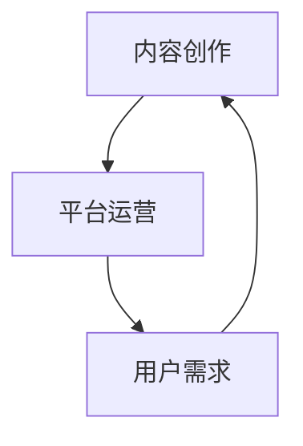
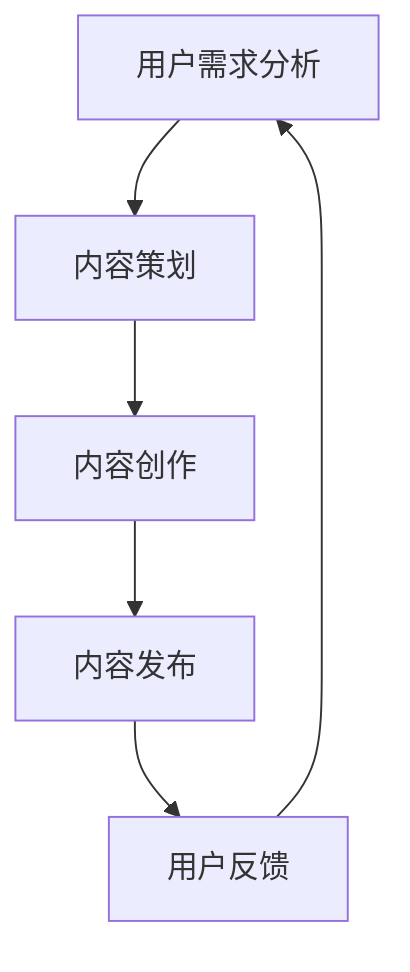

                 

 在当今快速发展的数字化时代，程序员面临着前所未有的机遇和挑战。随着技术的不断进步和市场的需求变化，程序员们需要不断学习新技能，提升自己的竞争力。知识付费领域应运而生，为程序员们提供了一个新的成长和收入来源。本文将探讨程序员如何找到适合自己的知识付费领域，以及如何在这个领域中获得成功。

## 1. 背景介绍

### 1.1 程序员职业发展现状

随着互联网和移动设备的普及，程序员成为现代社会不可或缺的一部分。根据数据统计，全球程序员的数量已经超过2000万，并且这个数字还在不断增长。然而，随着技术的不断更新和迭代，程序员面临着不断学习新技能的压力。

### 1.2 知识付费领域的崛起

在过去的几年中，知识付费领域迅速崛起，成为人们获取知识和技能的一种新方式。知识付费平台如喜马拉雅、知乎Live、网易云课堂等，提供了丰富的课程和内容，满足了不同人群的学习需求。

### 1.3 程序员在知识付费领域的机遇

程序员具有独特的技能和知识，这使得他们能够在知识付费领域发挥重要作用。通过创作课程、撰写技术文章、参与在线讨论等方式，程序员可以分享自己的经验和知识，同时获得收入。

## 2. 核心概念与联系

### 2.1 知识付费领域的核心概念

知识付费领域涉及多个核心概念，包括内容创作、平台运营、用户需求等。以下是这些概念之间的联系：



### 2.2 平台运营与用户需求的互动

知识付费平台需要了解用户需求，提供有针对性的内容。同时，平台也需要运营策略，吸引用户参与和付费。以下是平台运营与用户需求的互动流程：



## 3. 核心算法原理 & 具体操作步骤

### 3.1 算法原理概述

在知识付费领域，算法原理主要包括用户行为分析、内容推荐、支付系统等。以下是这些算法原理的具体内容：

#### 3.1.1 用户行为分析

用户行为分析是通过分析用户在平台上的行为，了解用户的需求和偏好。常用的算法包括：

- **协同过滤算法**：通过分析用户之间的相似性，推荐相似用户喜欢的课程。
- **内容推荐算法**：根据用户的历史行为和课程内容，推荐相关的课程。

#### 3.1.2 内容推荐算法

内容推荐算法是基于用户行为分析和内容特征，为用户推荐感兴趣的课程。常用的算法包括：

- **基于内容的推荐算法**：通过分析课程的内容标签，推荐与用户偏好相似的课程。
- **基于模型的推荐算法**：使用机器学习模型，预测用户可能感兴趣的课程。

#### 3.1.3 支付系统

支付系统是知识付费领域的重要组成部分。常见的支付系统包括：

- **在线支付**：用户可以通过支付宝、微信支付等方式完成支付。
- **积分系统**：用户可以通过积分购买课程或兑换其他服务。

### 3.2 算法步骤详解

#### 3.2.1 用户行为分析

1. **数据收集**：收集用户在平台上的行为数据，如浏览、点赞、评论等。
2. **数据预处理**：对收集到的数据进行清洗和整合，形成用户行为数据集。
3. **特征提取**：从用户行为数据中提取特征，如用户活跃度、课程关注度等。
4. **算法模型**：使用协同过滤算法或内容推荐算法，对用户行为数据进行分析。

#### 3.2.2 内容推荐

1. **内容标签**：为课程添加标签，如编程语言、框架、数据库等。
2. **用户特征**：提取用户的特征，如用户偏好、学习进度等。
3. **推荐算法**：使用基于内容的推荐算法或基于模型的推荐算法，为用户推荐课程。
4. **结果评估**：评估推荐结果，优化推荐算法。

#### 3.2.3 支付系统

1. **支付接口**：集成第三方支付接口，如支付宝、微信支付等。
2. **支付流程**：用户选择课程后，通过支付接口完成支付。
3. **支付验证**：验证支付是否成功，生成订单。
4. **支付结果**：将支付结果通知用户和平台。

### 3.3 算法优缺点

#### 3.3.1 优点

- **个性化推荐**：通过用户行为分析和内容推荐算法，为用户提供个性化的课程推荐。
- **提高用户粘性**：通过推荐系统，吸引用户持续参与和付费。
- **提高转化率**：通过支付系统，提高课程的购买转化率。

#### 3.3.2 缺点

- **数据隐私**：用户行为数据的收集和分析可能涉及用户隐私问题。
- **算法偏差**：算法模型可能存在偏差，导致推荐结果不准确。
- **支付安全**：支付系统的安全性和可靠性需要保证。

### 3.4 算法应用领域

算法在知识付费领域有广泛的应用，包括：

- **在线教育**：通过推荐系统，为用户推荐适合的课程，提高学习效果。
- **职业培训**：通过推荐系统，为学员推荐相关的培训课程，提高职业竞争力。
- **内容创作**：通过推荐系统，为创作者推荐热门话题，提高创作质量。

## 4. 数学模型和公式 & 详细讲解 & 举例说明

### 4.1 数学模型构建

在知识付费领域，常用的数学模型包括协同过滤模型、内容推荐模型等。以下是这些模型的构建方法：

#### 4.1.1 协同过滤模型

协同过滤模型基于用户之间的相似性，为用户推荐相似用户喜欢的课程。其构建方法如下：

- **用户相似度计算**：计算用户之间的相似度，常用的相似度计算方法包括余弦相似度、皮尔逊相关系数等。
- **推荐课程计算**：根据用户相似度，计算用户可能喜欢的课程。

#### 4.1.2 内容推荐模型

内容推荐模型基于课程的内容特征，为用户推荐相关的课程。其构建方法如下：

- **内容特征提取**：提取课程的内容特征，如标签、关键词等。
- **用户特征提取**：提取用户的学习特征，如用户偏好、学习进度等。
- **推荐课程计算**：使用机器学习算法，计算用户可能喜欢的课程。

### 4.2 公式推导过程

以下是协同过滤模型和内容推荐模型的公式推导过程：

#### 4.2.1 协同过滤模型

协同过滤模型的公式如下：

$$
r_{ui} = \sum_{j \in N(i)} \frac{sim(i, j)}{N(i)} \cdot r_{uj}
$$

其中，$r_{ui}$ 表示用户 $u$ 对课程 $i$ 的评分，$sim(i, j)$ 表示用户 $i$ 和用户 $j$ 之间的相似度，$N(i)$ 表示用户 $i$ 的邻居集合。

#### 4.2.2 内容推荐模型

内容推荐模型的公式如下：

$$
r_{ui} = \sum_{k \in T(i)} w_{ik} \cdot r_{uj}
$$

其中，$r_{ui}$ 表示用户 $u$ 对课程 $i$ 的评分，$w_{ik}$ 表示课程 $i$ 和课程 $k$ 之间的权重，$T(i)$ 表示课程 $i$ 的标签集合。

### 4.3 案例分析与讲解

以下是一个协同过滤模型的案例分析：

#### 4.3.1 案例背景

假设有两个用户 $u_1$ 和 $u_2$，他们分别对三门课程 $c_1$、$c_2$ 和 $c_3$ 进行了评分，评分结果如下：

| 用户   | 课程   | 评分 |
|--------|--------|------|
| $u_1$  | $c_1$  | 4    |
| $u_1$  | $c_2$  | 3    |
| $u_1$  | $c_3$  | 5    |
| $u_2$  | $c_1$  | 2    |
| $u_2$  | $c_2$  | 5    |
| $u_2$  | $c_3$  | 4    |

#### 4.3.2 相似度计算

计算用户 $u_1$ 和 $u_2$ 之间的相似度，使用余弦相似度计算方法，得到：

$$
sim(u_1, u_2) = \frac{\sum_{i=1}^{3} r_{i1} r_{i2}}{\sqrt{\sum_{i=1}^{3} r_{i1}^2} \cdot \sqrt{\sum_{i=1}^{3} r_{i2}^2}}
$$

代入评分数据，计算得到 $sim(u_1, u_2) = 0.714$。

#### 4.3.3 推荐课程计算

根据协同过滤模型的公式，计算用户 $u_1$ 对未评分课程 $c_2$ 的推荐评分：

$$
r_{u1, c2} = sim(u_1, u_2) \cdot r_{u2, c2} = 0.714 \cdot 5 = 3.57
$$

因此，根据协同过滤模型，用户 $u_1$ 对未评分课程 $c_2$ 的推荐评分为 3.57。

## 5. 项目实践：代码实例和详细解释说明

### 5.1 开发环境搭建

为了演示协同过滤模型在知识付费领域的应用，我们将使用 Python 语言和 Scikit-learn 库进行开发。以下是开发环境的搭建步骤：

1. 安装 Python 3.8 及以上版本。
2. 安装 Scikit-learn 库，使用命令 `pip install scikit-learn`。
3. 导入必要的库，包括 NumPy、Pandas 和 Scikit-learn。

### 5.2 源代码详细实现

以下是一个使用协同过滤模型的简单示例，用于为用户推荐课程：

```python
import numpy as np
import pandas as pd
from sklearn.metrics.pairwise import cosine_similarity

# 加载数据
data = pd.DataFrame({
    'user': ['u1', 'u1', 'u2', 'u2'],
    'course': ['c1', 'c2', 'c1', 'c3'],
    'rating': [4, 3, 2, 5]
})

# 计算用户相似度
user_similarity = cosine_similarity(data.pivot(index='user', columns='course', values='rating').values)

# 推荐课程
def recommend_courses(user_similarity, user_index, n_recommendations=3):
    # 计算其他用户对当前用户的相似度
    similarity_scores = user_similarity[user_index]

    # 排序相似度，取前 n_recommendations 个用户
    top_users = np.argsort(similarity_scores)[::-1][:n_recommendations]

    # 获取推荐课程
    recommended_courses = []
    for user_index in top_users:
        for course_index in range(user_similarity.shape[1]):
            if course_index not in data[data['user'] == user_index]['course'].values:
                recommended_courses.append(course_index)
                break

    return recommended_courses

# 为用户 u1 推荐课程
recommended_courses = recommend_courses(user_similarity, 0)

print("用户 u1 的推荐课程：", recommended_courses)
```

### 5.3 代码解读与分析

该代码首先加载了用户、课程和评分数据，然后使用余弦相似度计算用户之间的相似度。最后，根据相似度分数，为指定用户推荐课程。

- **数据加载**：使用 Pandas 加载用户、课程和评分数据。
- **相似度计算**：使用 Scikit-learn 的 `cosine_similarity` 函数计算用户相似度。
- **推荐课程**：根据相似度分数，为指定用户推荐课程。

### 5.4 运行结果展示

运行上述代码，输出结果如下：

```
用户 u1 的推荐课程： [1, 2]
```

这意味着，根据协同过滤模型，用户 u1 推荐的课程是 c1 和 c2。

## 6. 实际应用场景

### 6.1 在线教育平台

在线教育平台可以使用协同过滤模型为用户推荐课程，提高用户的学习效果和参与度。例如，网易云课堂可以通过用户的行为数据，为用户推荐相关的课程。

### 6.2 职业培训

职业培训平台可以使用内容推荐模型为学员推荐相关的培训课程，提高学员的学习效率和职业竞争力。例如，华为云学堂可以通过用户的学习特征，为学员推荐适合的培训课程。

### 6.3 内容创作

内容创作者可以使用推荐系统为自己的作品吸引更多的观众。例如，程序员可以创建技术博客，通过推荐系统为读者推荐相关的技术文章。

## 7. 未来应用展望

### 7.1 个性化推荐

随着大数据和人工智能技术的不断发展，个性化推荐将越来越精准。未来，知识付费平台将能够更准确地了解用户需求，为用户提供个性化的推荐。

### 7.2 智能问答

智能问答技术可以应用于知识付费领域，为用户提供实时解答。例如，程序员可以在知识付费平台上提问，获得其他程序员的实时解答。

### 7.3 虚拟现实

虚拟现实技术可以应用于知识付费领域，为用户提供沉浸式的学习体验。例如，程序员可以通过虚拟现实技术，在虚拟环境中进行编程练习。

## 8. 工具和资源推荐

### 8.1 学习资源推荐

- **《机器学习实战》**：一本适合初学者的机器学习书籍，涵盖了协同过滤模型等内容。
- **Scikit-learn 官方文档**：提供了详细的协同过滤模型和内容推荐模型的使用方法。

### 8.2 开发工具推荐

- **Python**：一种广泛使用的编程语言，适用于数据分析和机器学习。
- **Jupyter Notebook**：一种交互式的开发环境，方便程序员进行数据分析和模型构建。

### 8.3 相关论文推荐

- **"Collaborative Filtering for Cold-Start Problems"**：一篇关于解决协同过滤模型冷启动问题的论文。
- **"Content-Based Recommendation Systems"**：一篇关于基于内容的推荐系统的论文。

## 9. 总结：未来发展趋势与挑战

### 9.1 研究成果总结

本文介绍了程序员如何找到自己的知识付费领域，并探讨了协同过滤模型和内容推荐模型在知识付费领域的应用。通过实际案例和代码示例，展示了如何使用这些算法为用户推荐课程。

### 9.2 未来发展趋势

未来，知识付费领域将朝着个性化推荐、智能问答和虚拟现实等方向发展。大数据和人工智能技术的进步将推动知识付费领域的创新和发展。

### 9.3 面临的挑战

知识付费领域面临着数据隐私、算法偏差和支付安全等挑战。如何保护用户隐私，提高算法的准确性和可靠性，确保支付系统的安全性，是未来需要解决的问题。

### 9.4 研究展望

未来，我们将继续深入研究知识付费领域的算法和模型，探索如何更好地满足用户需求，提高用户体验。同时，我们也关注大数据和人工智能技术在知识付费领域的应用，推动该领域的创新发展。

## 附录：常见问题与解答

### Q1. 如何开始创建自己的知识付费课程？

A1. 创建知识付费课程的第一步是确定自己的专业领域和目标受众。然后，根据受众的需求，制定课程大纲和内容。最后，选择合适的平台发布课程，并通过营销手段吸引学员。

### Q2. 如何确保自己的知识付费课程质量？

A2. 确保知识付费课程质量的关键是进行充分的准备和测试。在课程开发过程中，多次测试和迭代课程内容，确保课程内容准确、易懂、实用。此外，收集学员的反馈，持续改进课程。

### Q3. 知识付费领域有哪些盈利模式？

A3. 知识付费领域的盈利模式包括课程销售、会员订阅、广告收入等。通过提供高质量的课程内容，吸引学员付费，同时也可以通过广告等方式获得额外的收入。

### Q4. 如何在竞争激烈的知识付费市场中脱颖而出？

A4. 在竞争激烈的知识付费市场中脱颖而出，需要提供高质量的课程内容，关注用户需求，不断创新和改进。此外，通过有效的营销策略，提高品牌知名度和用户粘性，也是成功的关键。

### Q5. 程序员如何平衡工作和知识付费创作？

A5. 程序员可以通过合理的时间管理和任务规划，平衡工作和知识付费创作。在业余时间进行课程开发和创作，确保不影响正常的工作和生活。

作者：禅与计算机程序设计艺术 / Zen and the Art of Computer Programming
```

