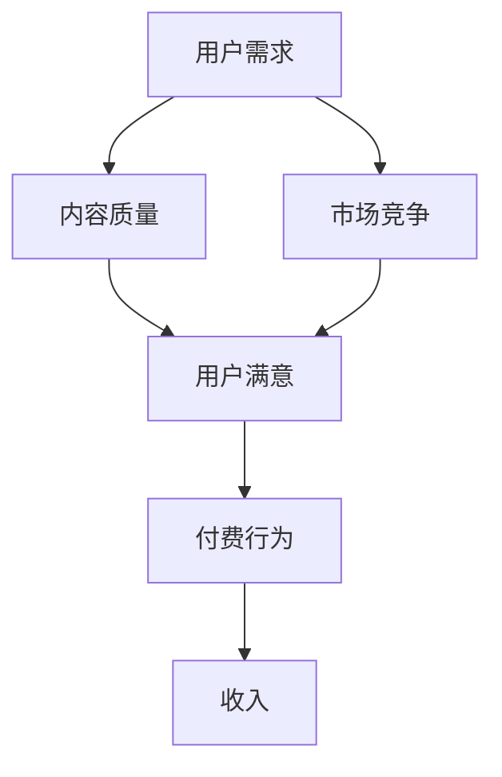

                 

关键词：知识付费模式、可持续发展、商业模式、程序员、用户需求、技术实践

摘要：随着互联网技术的不断进步和在线教育市场的日益繁荣，知识付费模式逐渐成为程序员收入的重要来源。然而，如何在激烈的市场竞争中构建可持续的知识付费模式，成为每个程序员必须面对的挑战。本文将从多个角度探讨程序员如何构建可持续的知识付费模式，包括了解用户需求、优化课程内容、提升用户体验、建立品牌形象以及合理定价等方面。

## 1. 背景介绍

近年来，随着知识经济的崛起和互联网的普及，知识付费模式逐渐成为各行业的发展趋势。特别是在IT行业，随着技能更新换代的速度加快，程序员们需要不断学习新技术、新方法来提升自己的竞争力。知识付费平台为程序员提供了便捷的学习途径，同时也为他们提供了通过传授知识获取收入的渠道。

然而，知识付费市场存在着激烈的竞争和不断变化的需求。程序员如何在这个市场中脱颖而出，构建一个可持续的知识付费模式，成为他们关注的焦点。本文将结合实际案例，探讨程序员在构建知识付费模式时可能遇到的问题以及解决策略。

### 1.1 知识付费的现状

根据市场调研数据显示，2019年全球知识付费市场规模已达到1,820亿美元，并预计在未来几年内将继续保持快速增长。在中国，知识付费市场尤为活跃，以得到APP、知乎Live、极客时间等为代表的平台不断涌现，吸引了大量用户。

程序员作为知识付费市场的一个重要群体，他们既可以是知识的消费者，也可以是知识的提供者。一方面，程序员需要通过付费课程来学习新技术；另一方面，一些具备深厚技术背景的程序员也通过开设在线课程、撰写技术博客等方式实现知识变现。

### 1.2 知识付费模式的挑战

尽管知识付费市场前景广阔，但程序员在构建可持续的知识付费模式时仍面临诸多挑战：

- **用户需求的多样性**：程序员的需求多样，且变化迅速。如何根据不同用户的需求提供个性化的内容，是知识付费模式成功的关键。
- **市场竞争的激烈**：随着知识付费平台的增多，市场竞争日益激烈。如何在这个市场中脱颖而出，提高用户粘性，是每个程序员都需要思考的问题。
- **内容质量的保证**：高质量的内容是知识付费模式的核心。如何保证课程内容的实用性、针对性和创新性，是程序员需要重点解决的问题。
- **持续收入的稳定性**：如何通过付费模式实现持续稳定的收入，是程序员构建可持续知识付费模式的重要目标。

## 2. 核心概念与联系

### 2.1 知识付费模式的核心概念

知识付费模式是指通过提供有价值的内容或服务，以获取经济利益的一种商业模式。其核心概念包括：

- **内容**：知识付费模式的基础，是指通过文字、图片、音频、视频等形式提供的有价值的信息。
- **用户**：知识付费模式的服务对象，是指愿意为获取知识或技能付出一定代价的用户。
- **平台**：知识付费模式的载体，是指为知识提供者和需求者提供交流与交易的场所。

### 2.2 知识付费模式的联系

知识付费模式与用户需求、内容质量、市场竞争等之间存在密切的联系。以下是它们之间的相互关系：

- **用户需求**：用户需求是知识付费模式的出发点。只有深入了解用户的需求，才能提供符合用户期望的内容，从而获得用户的认可。
- **内容质量**：内容质量是知识付费模式的保障。高质量的内容能够提高用户的满意度和忠诚度，从而促进付费行为的产生。
- **市场竞争**：市场竞争是知识付费模式面临的外部压力。如何在激烈的市场竞争中脱颖而出，是知识付费模式成功的关键。

### 2.3 Mermaid 流程图

下面是知识付费模式的核心概念及其相互关系的 Mermaid 流程图：



## 3. 核心算法原理 & 具体操作步骤

### 3.1 算法原理概述

构建可持续的知识付费模式，需要从用户需求分析、内容创作、平台运营等多个方面进行综合考量。以下是核心算法原理的概述：

- **用户需求分析**：通过数据分析和用户调研，了解用户的需求和痛点，为内容创作提供依据。
- **内容创作**：根据用户需求，创作高质量、具有实用性和创新性的内容。
- **平台运营**：通过内容营销、用户互动、数据监控等手段，提高用户粘性，实现持续收入。

### 3.2 算法步骤详解

以下是构建可持续的知识付费模式的具体操作步骤：

#### 3.2.1 用户需求分析

1. **数据收集**：通过网站访问日志、用户评论、问卷调查等方式收集用户数据。
2. **数据分析**：利用数据挖掘技术，分析用户的兴趣爱好、学习习惯、需求痛点等。
3. **需求建模**：根据数据分析结果，建立用户需求模型，为内容创作提供指导。

#### 3.2.2 内容创作

1. **选题策划**：根据用户需求模型，策划符合用户期望的内容主题。
2. **内容创作**：邀请行业专家、资深程序员等进行内容创作，确保内容的专业性和实用性。
3. **内容审核**：对内容进行严格审核，确保内容质量符合标准。

#### 3.2.3 平台运营

1. **内容营销**：通过社交媒体、搜索引擎等渠道，推广内容，吸引潜在用户。
2. **用户互动**：建立用户社区，鼓励用户参与互动，提高用户粘性。
3. **数据监控**：通过数据分析，监控用户行为，优化平台运营策略。

### 3.3 算法优缺点

#### 优点

- **个性化**：通过用户需求分析，提供个性化的内容，提高用户满意度。
- **高效**：通过数据分析和算法优化，提高内容创作的效率和效果。
- **可持续**：通过持续的用户互动和数据监控，实现知识付费模式的可持续发展。

#### 缺点

- **成本高**：用户需求分析和内容创作等环节需要大量的人力、物力和财力投入。
- **风险大**：市场竞争激烈，知识付费模式可能面临失败的风险。

### 3.4 算法应用领域

知识付费模式的应用领域广泛，包括但不限于以下方面：

- **在线教育**：通过知识付费模式，提供高质量的教育内容，满足用户的学习需求。
- **技能培训**：为程序员、设计师等专业人士提供技能提升培训，帮助他们提升职业竞争力。
- **知识分享**：通过知识付费模式，鼓励专业人士分享自己的经验和知识，促进知识的传播。

## 4. 数学模型和公式 & 详细讲解 & 举例说明

### 4.1 数学模型构建

构建可持续的知识付费模式，可以从以下几个方面进行数学建模：

#### 4.1.1 用户满意度模型

用户满意度模型可以用来衡量用户对知识付费内容的满意度，其公式如下：

\[ S = \frac{Q \times C}{P} \]

其中：

- \( S \)：用户满意度
- \( Q \)：内容质量
- \( C \)：用户对内容的期望值
- \( P \)：用户为内容付出的代价（如付费金额）

#### 4.1.2 收益模型

收益模型可以用来计算知识付费模式的收入，其公式如下：

\[ R = U \times S \times P \]

其中：

- \( R \)：收益
- \( U \)：用户数量
- \( S \)：用户满意度
- \( P \)：用户为内容付出的代价（如付费金额）

#### 4.1.3 成本模型

成本模型可以用来计算知识付费模式的总成本，其公式如下：

\[ C = T \times C_p + V \times C_v \]

其中：

- \( C \)：总成本
- \( T \)：内容创作成本
- \( C_p \)：内容创作单位成本
- \( V \)：平台运营成本
- \( C_v \)：平台运营单位成本

### 4.2 公式推导过程

#### 用户满意度模型推导

用户满意度模型是基于用户对内容的质量、期望和付出的代价的综合评估。具体推导过程如下：

1. **内容质量**：假设内容质量为 \( Q \)，表示内容的实用性和专业性。
2. **用户期望**：假设用户对内容的期望值为 \( C \)，表示用户期望从内容中获取的收益。
3. **用户付出代价**：假设用户为内容付出的代价为 \( P \)，表示用户为内容付费的金额。
4. **用户满意度**：根据满意度公式，用户满意度 \( S \) 可以表示为：

\[ S = \frac{Q \times C}{P} \]

#### 收益模型推导

收益模型是基于用户满意度、用户数量和用户付出的代价来计算的。具体推导过程如下：

1. **用户满意度**：根据用户满意度模型，假设用户满意度为 \( S \)。
2. **用户数量**：假设用户数量为 \( U \)。
3. **用户付出代价**：假设用户为内容付出的代价为 \( P \)。
4. **收益**：根据收益公式，收益 \( R \) 可以表示为：

\[ R = U \times S \times P \]

#### 成本模型推导

成本模型是基于内容创作成本和平台运营成本来计算的。具体推导过程如下：

1. **内容创作成本**：假设内容创作成本为 \( T \)，表示内容创作的总成本。
2. **内容创作单位成本**：假设内容创作单位成本为 \( C_p \)，表示每创作一个内容单元的成本。
3. **平台运营成本**：假设平台运营成本为 \( V \)，表示平台运营的总成本。
4. **平台运营单位成本**：假设平台运营单位成本为 \( C_v \)，表示每运营一个内容单元的成本。
5. **总成本**：根据成本公式，总成本 \( C \) 可以表示为：

\[ C = T \times C_p + V \times C_v \]

### 4.3 案例分析与讲解

#### 案例背景

假设某程序员开设了一门关于前端开发的付费课程，课程内容涵盖HTML、CSS、JavaScript等基础知识，课程定价为200元。

#### 案例分析

1. **用户满意度**：假设有100名用户购买了这门课程，根据用户反馈，用户满意度 \( S \) 为0.8。
2. **用户数量**：用户数量 \( U \) 为100。
3. **用户付出代价**：用户为内容付出的代价 \( P \) 为200元。
4. **收益**：根据收益模型，收益 \( R \) 可以计算为：

\[ R = U \times S \times P = 100 \times 0.8 \times 200 = 16,000 \text{元} \]

5. **内容创作成本**：假设内容创作成本 \( T \) 为5000元。
6. **平台运营成本**：假设平台运营成本 \( V \) 为3000元。
7. **总成本**：根据成本模型，总成本 \( C \) 可以计算为：

\[ C = T \times C_p + V \times C_v = 5000 \times 1 + 3000 \times 1 = 8,000 \text{元} \]

8. **净利润**：净利润 \( N \) 可以计算为：

\[ N = R - C = 16,000 - 8,000 = 8,000 \text{元} \]

#### 案例结论

根据以上计算，这门前端开发课程在第一个月的收益为16000元，总成本为8000元，净利润为8000元。这个案例说明，通过合理的定价和有效的运营，程序员可以通过知识付费模式实现可观的收入。

### 5. 项目实践：代码实例和详细解释说明

#### 5.1 开发环境搭建

为了实现知识付费模式，我们需要搭建一个完整的开发环境，包括以下工具和组件：

- **前端框架**：Vue.js
- **后端框架**：Node.js + Express
- **数据库**：MongoDB
- **身份验证**：JSON Web Token (JWT)
- **支付接口**：支付宝支付

#### 5.2 源代码详细实现

以下是知识付费模式的核心功能模块的实现代码：

**1. 用户注册与登录**

```javascript
// 用户注册
app.post('/api/register', async (req, res) => {
  const { username, password } = req.body;
  // 数据库操作：保存用户信息
  // 返回注册结果
});

// 用户登录
app.post('/api/login', async (req, res) => {
  const { username, password } = req.body;
  // 数据库操作：验证用户信息
  // 生成JWT令牌
  // 返回登录结果
});
```

**2. 课程管理**

```javascript
// 添加课程
app.post('/api/courses', async (req, res) => {
  const { title, description, price } = req.body;
  // 数据库操作：保存课程信息
  // 返回添加结果
});

// 获取课程列表
app.get('/api/courses', async (req, res) => {
  // 数据库操作：查询课程列表
  // 返回课程列表
});

// 购买课程
app.post('/api/buy', async (req, res) => {
  const { userId, courseId } = req.body;
  // 数据库操作：更新用户课程信息
  // 调用支付接口
  // 返回购买结果
});
```

**3. 支付接口**

```javascript
// 支付接口（支付宝）
app.post('/api/pay', async (req, res) => {
  const { orderId, amount } = req.body;
  // 调用支付宝支付接口
  // 返回支付结果
});
```

#### 5.3 代码解读与分析

以上代码实现了一个简单的知识付费平台的核心功能。以下是代码的解读与分析：

- **用户注册与登录**：通过POST请求实现用户的注册和登录功能，使用JWT令牌进行身份验证。
- **课程管理**：通过POST请求添加课程，通过GET请求获取课程列表，通过POST请求购买课程。
- **支付接口**：通过POST请求实现支付功能，调用支付宝支付接口进行支付。

#### 5.4 运行结果展示

以下是一个简单的运行结果展示：

```shell
$ npm run start
```

- **用户注册**：

```json
POST /api/register
{
  "username": "user1",
  "password": "password1"
}
```

- **用户登录**：

```json
POST /api/login
{
  "username": "user1",
  "password": "password1"
}
```

- **添加课程**：

```json
POST /api/courses
{
  "title": "Vue.js实战",
  "description": "本课程将介绍Vue.js的基础知识和实战技巧。",
  "price": 200
}
```

- **课程列表**：

```json
GET /api/courses
[
  {
    "id": "1",
    "title": "Vue.js实战",
    "description": "本课程将介绍Vue.js的基础知识和实战技巧。",
    "price": 200
  }
]
```

- **购买课程**：

```json
POST /api/buy
{
  "userId": "1",
  "courseId": "1"
}
```

- **支付结果**：

```json
POST /api/pay
{
  "orderId": "1001",
  "amount": 200
}
```

### 6. 实际应用场景

知识付费模式在程序员中的实际应用场景非常广泛，以下是几个典型的应用场景：

#### 6.1 技术分享

一些具有丰富经验的程序员会在知识付费平台上开设课程，分享自己在技术领域的心得和经验。这些课程通常涵盖编程语言、框架、工具等方面，为初学者和从业者提供了宝贵的学习资源。

#### 6.2 技能培训

针对特定的技能需求，程序员可以开设专门的培训课程，帮助学员快速掌握所需的技能。这些课程通常包括项目实战、面试技巧、职业规划等方面，为学员提供了全面的职业发展支持。

#### 6.3 专业知识普及

一些程序员会针对特定的专业知识进行普及和讲解，帮助非专业人士了解和掌握相关领域的知识。这些课程通常具有高度的实用性和针对性，为学习者提供了全新的视角和思考方式。

#### 6.4 跨领域学习

程序员在跨领域学习时，也可以通过知识付费模式获取专业的学习资源和指导。例如，程序员可以通过学习设计、产品管理、项目管理等课程，提升自己的综合能力。

### 6.4 未来应用展望

随着人工智能、大数据、区块链等新兴技术的不断涌现，知识付费模式在未来将会有更广泛的应用前景。以下是几个可能的未来应用方向：

#### 6.4.1 智能推荐

通过人工智能技术，知识付费平台可以更加精准地推荐用户感兴趣的课程，提高用户满意度和付费意愿。

#### 6.4.2 智能学习

人工智能技术可以辅助学习者进行个性化学习，根据学习者的学习习惯和进度，提供定制化的学习计划和建议。

#### 6.4.3 区块链应用

区块链技术可以为知识付费模式提供更安全、透明的支付和版权保护机制，促进知识付费市场的发展。

#### 6.4.4 深度学习

通过大数据分析和深度学习技术，知识付费平台可以更好地了解用户需求，优化课程内容和教学方式，提高课程质量。

### 7. 工具和资源推荐

#### 7.1 学习资源推荐

- **技术博客**：简书、掘金、CSDN等技术博客平台，提供了丰富的技术文章和教程。
- **在线教育平台**：极客时间、得到、网易云课堂等在线教育平台，提供了大量的优质课程。
- **编程社区**：GitHub、Stack Overflow、Reddit等技术社区，是程序员学习、交流和分享知识的绝佳场所。

#### 7.2 开发工具推荐

- **集成开发环境**：Visual Studio Code、IntelliJ IDEA、Eclipse等集成开发环境，提供了强大的编程功能和调试工具。
- **版本控制工具**：Git、SVN等版本控制工具，可以帮助程序员高效地进行代码管理和协作。
- **数据库工具**：MongoDB、MySQL、PostgreSQL等数据库工具，为程序员提供了强大的数据存储和管理能力。

#### 7.3 相关论文推荐

- **《在线教育的商业模式创新研究》**：该论文从商业模式创新的角度，探讨了在线教育的发展趋势和挑战。
- **《知识付费模式的案例分析》**：该论文通过对知识付费平台的案例分析，总结了知识付费模式的优势和劣势。
- **《人工智能在教育领域的应用研究》**：该论文探讨了人工智能技术在教育领域的应用前景，为知识付费模式的发展提供了新的思路。

### 8. 总结：未来发展趋势与挑战

随着技术的不断进步和用户需求的不断变化，知识付费模式在未来将会有更广阔的发展空间。然而，面对激烈的市场竞争和不断变化的需求，程序员需要不断创新和调整自己的知识付费模式，以适应市场的变化。

#### 8.1 研究成果总结

本文从用户需求、内容创作、平台运营等多个方面，探讨了程序员如何构建可持续的知识付费模式。通过用户需求分析、内容质量保证、平台运营优化等策略，程序员可以有效地提升用户满意度和收入水平。

#### 8.2 未来发展趋势

- **个性化**：知识付费模式将更加注重个性化，通过智能推荐、个性化学习等方式，满足用户多样化的需求。
- **智能化**：人工智能技术将在知识付费模式中发挥重要作用，提高课程质量和用户体验。
- **跨界融合**：知识付费模式将与区块链、大数据等新兴技术相结合，创造更多创新的应用场景。

#### 8.3 面临的挑战

- **内容质量**：如何在激烈的市场竞争中提供高质量的内容，是程序员面临的主要挑战。
- **用户粘性**：如何提高用户的粘性，保持用户的持续付费意愿，是知识付费模式成功的关键。
- **市场竞争**：如何在激烈的市场竞争中脱颖而出，是程序员需要不断思考和解决的问题。

#### 8.4 研究展望

未来，知识付费模式将会有更多创新和发展。程序员需要不断学习和探索，掌握新的技术和方法，以适应不断变化的市场需求。通过不断创新和优化，程序员可以构建可持续的知识付费模式，实现个人和企业的双赢。

## 9. 附录：常见问题与解答

### 9.1 什么是知识付费模式？

知识付费模式是指通过提供有价值的内容或服务，以获取经济利益的一种商业模式。通常，知识付费模式涉及知识内容的创作、传播和变现。

### 9.2 程序员如何构建知识付费模式？

程序员可以通过以下步骤构建知识付费模式：

1. **用户需求分析**：通过数据分析和用户调研，了解用户的需求和痛点。
2. **内容创作**：根据用户需求，创作高质量、具有实用性和创新性的内容。
3. **平台运营**：通过内容营销、用户互动、数据监控等手段，提高用户粘性，实现持续收入。

### 9.3 如何保证内容质量？

为了保证内容质量，程序员可以采取以下措施：

1. **严格审核**：对内容进行严格审核，确保内容的准确性和专业性。
2. **专家指导**：邀请行业专家、资深程序员等进行内容创作，确保内容的质量。
3. **用户反馈**：收集用户反馈，根据用户意见不断优化内容。

### 9.4 如何提高用户粘性？

提高用户粘性的方法包括：

1. **个性化推荐**：根据用户的兴趣和需求，提供个性化的内容推荐。
2. **用户互动**：建立用户社区，鼓励用户参与互动，提高用户参与度。
3. **持续更新**：定期更新内容，保持用户的持续关注。

### 9.5 知识付费模式的未来发展趋势是什么？

知识付费模式的未来发展趋势包括：

1. **个性化**：知识付费模式将更加注重个性化，通过智能推荐、个性化学习等方式，满足用户多样化的需求。
2. **智能化**：人工智能技术将在知识付费模式中发挥重要作用，提高课程质量和用户体验。
3. **跨界融合**：知识付费模式将与区块链、大数据等新兴技术相结合，创造更多创新的应用场景。

### 9.6 知识付费模式对程序员有什么影响？

知识付费模式对程序员的影响包括：

1. **收入来源**：知识付费模式为程序员提供了额外的收入来源。
2. **职业发展**：通过知识付费模式，程序员可以提升自己的专业技能和职业地位。
3. **知识传播**：知识付费模式促进了程序员知识的传播和分享，提高了整个行业的知识水平。

# 作者：禅与计算机程序设计艺术 / Zen and the Art of Computer Programming

在本文中，我们探讨了程序员如何构建可持续的知识付费模式。从用户需求分析、内容创作、平台运营等多个方面，我们提出了具体的策略和操作步骤。同时，我们也分析了知识付费模式的优缺点和应用领域，为程序员提供了实用的参考和指导。未来，随着技术的不断进步和市场需求的不断变化，知识付费模式将会有更广阔的发展空间。程序员需要不断学习和探索，以适应市场的变化，实现个人和企业的双赢。让我们一起努力，共同推动知识付费模式的可持续发展。作者：禅与计算机程序设计艺术 / Zen and the Art of Computer Programming。感谢您的阅读！
----------------------------------------------------------------

### 文章结论 Conclusion

本文从多个角度探讨了程序员如何构建可持续的知识付费模式。通过用户需求分析、内容创作、平台运营等核心步骤，程序员可以有效地提升用户满意度和收入水平。同时，我们还分析了知识付费模式的优缺点和应用领域，为程序员提供了实用的参考和指导。未来，随着技术的不断进步和市场需求的不断变化，知识付费模式将会有更广阔的发展空间。程序员需要不断学习和探索，以适应市场的变化，实现个人和企业的双赢。让我们一起努力，共同推动知识付费模式的可持续发展。作者：禅与计算机程序设计艺术 / Zen and the Art of Computer Programming。感谢您的阅读！

