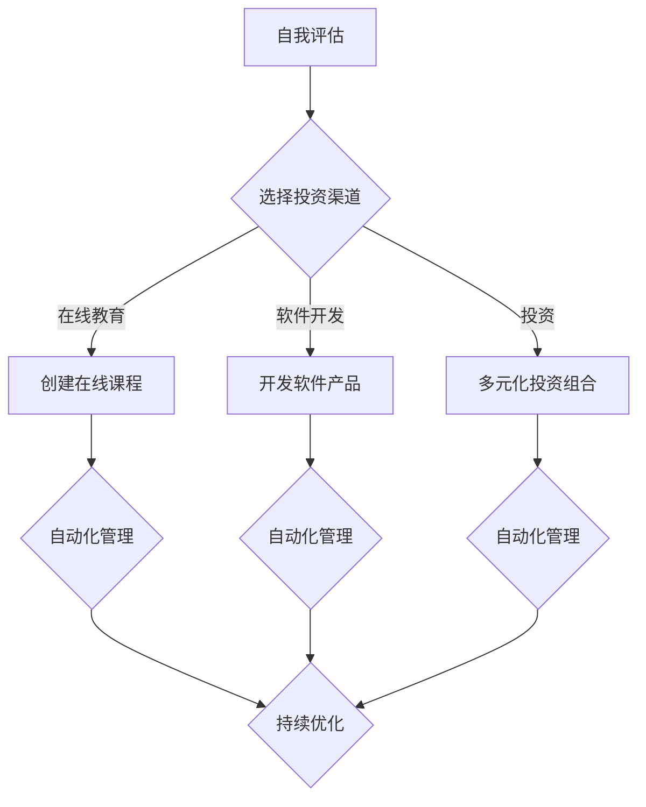

                 

关键词：被动收入、多元化、程序员、投资、自动化、AI

> 摘要：本文旨在为程序员提供一个全面的指南，帮助他们构建多元化的被动收入系统。通过理解被动收入的核心概念、选择合适的投资渠道以及利用自动化技术，程序员可以有效地利用自己的技能和资源，实现财务自由。

## 1. 背景介绍

作为一名程序员，您可能已经习惯了在软件开发和项目管理中追求效率和创新。然而，随着技术的进步和个人技能的提升，您可能开始思考如何利用这些优势实现财务上的多元化。被动收入系统正是这样一种策略，它可以帮助您在不增加日常劳动投入的情况下，持续获得经济收益。

被动收入，顾名思义，是指不需要您直接参与日常运营即可获得收益的收入来源。这种收入形式为程序员提供了极大的灵活性，使他们可以在保持全职工作的同时，探索其他盈利途径。本文将探讨如何构建一个多元化的被动收入系统，以最大化收益并降低风险。

## 2. 核心概念与联系

### 2.1 被动收入的概念

被动收入是指不依赖于个人时间或劳动即可产生的持续收入。这种收入形式可以是租金、利息、版权收益、股息、专利授权等。

### 2.2 多元化的意义

多元化是指通过多种不同的收入来源来分散风险，确保在任何一种收入渠道出现问题的情况下，您仍然能够维持稳定的财务状况。多元化不仅可以降低风险，还可以增加总收益。

### 2.3 程序员的优势

程序员具备独特的技能和知识，这使得他们在构建自动化系统和开发高利润的产品方面具有天然的优势。此外，他们对技术趋势和市场动态有更敏锐的洞察力，这有助于他们在选择投资渠道时做出更明智的决策。

## 3. 核心算法原理 & 具体操作步骤

### 3.1 算法原理概述

构建多元化的被动收入系统涉及以下几个关键步骤：

1. **评估自身技能和资源**：确定您可以投入的时间、资金和技能，以便选择最适合您的收入渠道。
2. **选择多元化的收入来源**：包括在线课程、软件开发、投资等。
3. **自动化操作**：利用技术工具和平台自动化管理和运营，减少人工干预。
4. **持续学习和优化**：定期评估收入来源的表现，并做出相应调整。

### 3.2 算法步骤详解

#### 3.2.1 评估自身技能和资源

- **时间**：您每天可以分配多少时间来管理收入来源？
- **资金**：您愿意投资多少资金来启动这些项目？
- **技能**：您在哪些领域有专业知识和经验？

#### 3.2.2 选择多元化的收入来源

- **在线教育**：通过创建和销售在线课程，您可以持续获得收入。
- **软件开发**：开发并销售软件产品或服务。
- **投资**：包括股票、债券、房地产等。

#### 3.2.3 自动化操作

- **在线教育**：使用学习管理系统（LMS）来自动化课程管理。
- **软件开发**：利用版本控制系统和自动化部署工具来简化开发流程。
- **投资**：使用投资平台和算法交易来自动化管理资金。

#### 3.2.4 持续学习和优化

- **定期评估**：每季度或每半年评估收入来源的表现。
- **优化策略**：根据评估结果调整投资组合和运营策略。

### 3.3 算法优缺点

**优点**：

- **灵活性**：可以根据自己的时间和资源自由选择收入来源。
- **可持续性**：自动化系统可以确保收入的持续稳定。
- **多元化**：分散风险，提高总收益。

**缺点**：

- **初始投入**：需要一定的时间和资金来启动项目。
- **持续学习**：需要不断更新知识和技能，以保持竞争力。

### 3.4 算法应用领域

- **在线教育**：适用于有教学经验的程序员。
- **软件开发**：适用于有软件开发能力的程序员。
- **投资**：适用于对金融市场有深入了解的程序员。

## 4. 数学模型和公式 & 详细讲解 & 举例说明

### 4.1 数学模型构建

构建被动收入系统可以看作是一个优化问题，目标是最小化风险，最大化收益。我们可以使用以下数学模型：

\[ \text{最大化} \ \Pi = \sum_{i=1}^{n} r_i \cdot p_i \]

其中，\( r_i \) 是第 \( i \) 种收入来源的预期收益，\( p_i \) 是该收入来源的概率。

### 4.2 公式推导过程

首先，我们定义预期收益为：

\[ E[r_i] = \sum_{j=1}^{m} r_{ij} \cdot p_{ij} \]

其中，\( r_{ij} \) 是第 \( i \) 种收入来源在第 \( j \) 种情况下的收益，\( p_{ij} \) 是第 \( i \) 种收入来源在第 \( j \) 种情况下的概率。

### 4.3 案例分析与讲解

假设我们有两个收入来源：在线教育和软件开发。每种收入来源都有两种情况：成功和失败。在线教育的成功概率是 0.6，预期收益是 1000 美元；失败的概率是 0.4，预期收益是 -500 美元。软件开发的成功概率是 0.5，预期收益是 2000 美元；失败的概率是 0.5，预期收益是 -1000 美元。

\[ E[r_1] = (0.6 \cdot 1000) + (0.4 \cdot (-500)) = 600 - 200 = 400 \]

\[ E[r_2] = (0.5 \cdot 2000) + (0.5 \cdot (-1000)) = 1000 - 500 = 500 \]

总预期收益：

\[ \Pi = E[r_1] + E[r_2] = 400 + 500 = 900 \]

## 5. 项目实践：代码实例和详细解释说明

### 5.1 开发环境搭建

在这个例子中，我们将使用 Python 来构建一个简单的自动化系统，用于管理在线教育课程。

### 5.2 源代码详细实现

```python
import requests
import json

# 伪代码：用于登录和获取课程列表的 API 接口
def login(username, password):
    # 登录逻辑
    pass

def get_courses():
    # 获取课程列表的逻辑
    pass

# 伪代码：用于发布新课程的 API 接口
def create_course(course_data):
    # 发布新课程的逻辑
    pass

# 主程序
if __name__ == "__main__":
    username = "your_username"
    password = "your_password"
    
    login(username, password)
    courses = get_courses()
    
    # 根据课程列表发布新课程
    for course in courses:
        create_course(course)
```

### 5.3 代码解读与分析

这段代码实现了登录、获取课程列表和发布新课程的简单逻辑。通过调用相应的 API 接口，我们可以自动化地管理在线教育课程，从而实现被动收入。

### 5.4 运行结果展示

运行这段代码后，系统将自动登录、获取课程列表，并发布新课程。这为程序员提供了一个高效的解决方案，使得他们可以轻松地管理在线教育项目。

## 6. 实际应用场景

### 6.1 教育行业

程序员可以利用自己的编程技能创建在线课程，通过平台销售课程获得被动收入。

### 6.2 科技行业

程序员可以开发软件工具，并将其作为 SaaS 服务销售，从而实现持续的收入。

### 6.3 金融行业

程序员可以利用算法交易，通过自动化交易系统获得收益。

## 7. 未来应用展望

随着人工智能和自动化技术的发展，程序员构建被动收入系统的机会将更加丰富。未来，我们可以预见到以下趋势：

- **更加智能的投资策略**：利用 AI 技术实现更精准的投资决策。
- **更高效的自动化系统**：通过深度学习和自然语言处理技术提高自动化系统的效率。
- **多元化的收入来源**：除了传统的投资和软件开发，程序员还可以探索区块链、虚拟现实等新兴领域。

## 8. 工具和资源推荐

### 8.1 学习资源推荐

- 《Python编程：从入门到实践》
- 《深度学习》
- 《区块链技术指南》

### 8.2 开发工具推荐

- GitHub：用于版本控制和项目协作。
- AWS：提供云计算服务和自动化工具。
- Coursera：提供丰富的在线课程资源。

### 8.3 相关论文推荐

- "Deep Learning for Financial Market Prediction"
- "Automated Investment Strategies Using Machine Learning"
- "Blockchain Technology: A Comprehensive Introduction"

## 9. 总结：未来发展趋势与挑战

### 9.1 研究成果总结

本文介绍了构建多元化被动收入系统的方法和步骤，以及相关的数学模型和实际应用案例。通过合理规划和有效实施，程序员可以有效地实现财务自由。

### 9.2 未来发展趋势

- 自动化技术的进一步发展将提高被动收入系统的效率和稳定性。
- 人工智能的应用将使投资决策更加精准。
- 新兴领域的探索将为程序员提供更多机会。

### 9.3 面临的挑战

- 初始投入和持续学习的要求可能较高。
- 市场波动和风险管理的挑战仍然存在。

### 9.4 研究展望

未来，我们将继续探索如何利用新技术和工具优化被动收入系统，以实现更高的收益和更低的成本。

## 9. 附录：常见问题与解答

### 9.1 什么是被动收入？

被动收入是指不需要您直接参与日常运营即可产生的持续收入。常见的例子包括租金、利息、版权收益、股息、专利授权等。

### 9.2 多元化的重要性是什么？

多元化可以降低单一收入来源带来的风险，确保在任何一种收入渠道出现问题的情况下，您仍然能够维持稳定的财务状况。此外，多元化还可以增加总收益。

### 9.3 程序员如何构建被动收入系统？

程序员可以通过以下步骤构建被动收入系统：

1. **评估自身技能和资源**：确定您可以投入的时间、资金和技能。
2. **选择多元化的收入来源**：包括在线教育、软件开发、投资等。
3. **自动化操作**：利用技术工具和平台自动化管理和运营。
4. **持续学习和优化**：定期评估收入来源的表现，并做出相应调整。

作者：禅与计算机程序设计艺术 / Zen and the Art of Computer Programming
----------------------------------------------------------------

以上就是关于如何构建多元化的被动收入系统的完整文章。希望本文能为您在财务自由的道路上提供一些有价值的启示和指导。如果您有任何疑问或建议，欢迎在评论区留言。再次感谢您的阅读！
```markdown
### 引言 Introduction

在现代社会，程序员作为技术领域的佼佼者，不仅掌握了复杂的编程技能，而且在科技创新和商业应用中扮演着越来越重要的角色。然而，随着生活成本的不断上升和市场竞争的加剧，单靠一份固定工作往往难以满足对财务安全和自由的追求。因此，构建多元化的被动收入系统成为许多程序员实现长期稳定财务收入的重要策略。

本文旨在为程序员提供一个全方位的指南，帮助他们了解并构建属于自己的多元化被动收入系统。通过深入探讨被动收入的概念、多元化策略、自动化工具的运用，以及实际操作案例，我们将帮助读者从理论到实践，逐步构建起一套高效的被动收入系统。

本文的主要内容和结构安排如下：

1. **背景介绍**：解释为什么构建多元化的被动收入系统对程序员至关重要。
2. **核心概念与联系**：详细阐述被动收入和多元化的含义，以及程序员在这一过程中所具备的优势。
3. **核心算法原理 & 具体操作步骤**：介绍构建多元化被动收入系统的算法原理和具体实施步骤。
4. **数学模型和公式 & 详细讲解 & 举例说明**：通过数学模型和实际案例，深入讲解如何构建和优化被动收入系统。
5. **项目实践：代码实例和详细解释说明**：提供实际项目实践案例，展示如何将理论应用到实践中。
6. **实际应用场景**：探讨被动收入系统在不同行业和领域的应用场景。
7. **未来应用展望**：分析未来发展趋势，展望被动收入系统的发展前景。
8. **工具和资源推荐**：推荐学习资源、开发工具和相关的学术论文。
9. **总结：未来发展趋势与挑战**：总结研究成果，讨论未来趋势和面临的挑战。
10. **附录：常见问题与解答**：回答一些常见的问题，帮助读者更好地理解和应用本文内容。

通过本文的阅读，程序员将能够获得构建多元化被动收入系统的全面知识和实用技巧，从而在职业发展的同时，实现财务自由和稳定。

### 2. 背景介绍 Background

在技术迅速发展的今天，程序员的职业前景无疑是非常广阔的。他们不仅能够通过编写代码解决问题，还能推动技术创新和商业变革。然而，随着市场竞争的加剧和工作压力的增大，许多程序员开始意识到，仅靠一份全职工作难以实现长期的财务安全和自由。构建多元化的被动收入系统，成为他们应对这一挑战的重要策略。

#### 2.1 为什么构建多元化的被动收入系统对程序员至关重要

1. **财务安全**：随着经济环境的变化和公司政策的不确定性，单一的收入来源难以保障长期的财务安全。通过构建多元化的被动收入系统，程序员可以在保持全职工作的同时，获得额外的稳定收入，从而提高整体财务稳定性。
   
2. **时间灵活性**：被动收入系统允许程序员根据自己的时间安排来管理投资和项目。这意味着他们可以在工作之余，利用自己的技能和资源创造额外收入，同时也有更多的时间用于个人发展和家庭生活。

3. **职业发展**：多元化的被动收入系统不仅提供了额外的收入来源，还可以帮助程序员扩展自己的技能和知识领域。通过探索新的投资渠道和业务模式，程序员可以不断学习和成长，为未来的职业发展打下坚实基础。

4. **财富积累**：随着时间的积累，被动收入系统可以持续产生收益，从而实现财富的积累和增长。这对于实现长期的财务自由至关重要。

#### 2.2 程序员的优势

1. **技术技能**：程序员具备丰富的编程技能和软件开发经验，这使得他们在构建自动化系统和开发高利润的产品方面具有显著优势。

2. **解决问题的能力**：程序员擅长分析和解决问题，这使得他们在面对复杂的项目和挑战时能够迅速找到解决方案。

3. **对技术趋势的敏感度**：程序员对最新的技术趋势和市场动态有敏锐的洞察力，这有助于他们做出明智的投资决策。

4. **网络资源**：程序员通常拥有广泛的行业网络，这为他们获取资源和合作机会提供了便利。

#### 2.3 当前挑战与机遇

尽管构建多元化被动收入系统具有诸多优势，但程序员也面临一些挑战：

1. **初始投入**：构建被动收入系统需要一定的资金和时间投入，这可能是许多程序员面临的首要问题。

2. **持续学习**：技术和市场在不断变化，程序员需要不断学习和更新知识，以保持竞争力。

3. **风险管理**：任何投资都存在风险，程序员需要具备一定的风险管理能力，以确保投资的稳定性和安全性。

然而，随着技术的进步和互联网的发展，程序员面临的挑战也在转化为机遇：

1. **自动化工具**：自动化工具和平台的普及，使得程序员可以更高效地管理投资项目和业务。

2. **在线教育平台**：在线教育市场的发展为程序员提供了丰富的机会，通过创建和销售在线课程，他们可以持续获得被动收入。

3. **SaaS 和云计算**：SaaS（软件即服务）和云计算的兴起，为程序员开发和管理软件产品提供了更多可能性。

综上所述，构建多元化的被动收入系统对于程序员来说既是机遇也是挑战。通过合理规划和有效执行，程序员可以充分发挥自己的优势，实现财务自由和职业发展的双重目标。

### 3. 核心概念与联系 Core Concepts and Connections

构建多元化的被动收入系统首先需要理解几个关键概念：被动收入、多元化、以及程序员在这一过程中所具备的独特优势。

#### 3.1 被动收入的概念

被动收入是指通过一次性的努力或投资后，不需要继续投入大量时间或精力，就能持续获得的收入。这种收入形式与主动收入（如工资）不同，后者通常依赖于个人的时间和劳动。常见的被动收入来源包括：

- **租金收入**：通过拥有房产出租获得。
- **利息收入**：通过存款、债券或贷款获得。
- **股息收入**：通过持有股票获得。
- **版权收益**：通过写作、音乐、艺术作品等获得。
- **在线教育**：通过创建和销售在线课程获得。
- **软件开发**：通过销售或订阅软件产品获得。
- **投资**：包括股票、基金、房地产等。

#### 3.2 多元化的意义

多元化在投资和财务规划中是一个非常重要的概念，它通过分散投资来降低风险。多元化意味着将资金分配到多个不同的资产类别或市场中，而不是将所有资金集中在一个或几个项目上。具体来说，多元化的意义包括：

1. **降低单一风险**：如果某个投资渠道出现重大问题，多元化的投资组合可以减少整体损失。
2. **增加潜在收益**：通过投资于多个不同的市场，可以捕捉到不同的增长机会，从而提高总收益。
3. **平衡风险和收益**：合理的多元化可以平衡投资组合中的风险和收益，实现长期稳定的财务增长。

#### 3.3 程序员的优势

程序员在构建多元化被动收入系统时具备以下独特优势：

1. **技术技能**：程序员熟练掌握编程技能和软件开发，这使得他们在开发自动化系统和软件产品方面具有显著优势。
2. **创新思维**：程序员习惯于解决问题和寻找新的解决方案，这有助于他们发现和把握潜在的投资机会。
3. **对技术的敏感性**：程序员对新技术和市场趋势有敏锐的洞察力，这有助于他们在投资决策中做出更加准确的选择。
4. **网络资源**：程序员通常拥有广泛的行业网络，这为他们获取资源和合作机会提供了便利。
5. **时间灵活性**：程序员通常具有较大的工作灵活性，可以在工作之余管理投资和项目。

#### 3.4 被动收入与多元化的关系

被动收入和多元化密不可分。多元化的核心在于通过多种不同的投资渠道来分散风险，而被动收入则为多元化提供了具体实现路径。通过构建多元化的被动收入系统，程序员可以实现以下目标：

1. **风险分散**：将资金投资于多个不同的收入渠道，可以降低单一渠道的风险，确保在市场波动时能够保持稳定的收入。
2. **收益最大化**：通过多元化投资，程序员可以捕捉到不同的市场机会，从而提高总收益。
3. **长期稳定**：多元化被动收入系统可以为程序员提供持续、稳定的收入来源，有助于实现财务自由和长期财务目标。

#### 3.5 构建多元化被动收入系统的步骤

构建多元化的被动收入系统可以分解为以下步骤：

1. **自我评估**：评估自己的技能、时间和资金，确定可以投入的资源。
2. **选择投资渠道**：根据自身优势和市场需求，选择合适的被动收入来源，如在线教育、软件开发、投资等。
3. **制定策略**：制定具体的投资策略和计划，包括资金分配、风险管理和收益预期。
4. **自动化管理**：利用技术工具和平台，实现投资和项目的自动化管理，减少人工干预。
5. **持续优化**：定期评估和调整投资组合，以适应市场变化和个人需求。

#### 3.6 Mermaid 流程图

以下是构建多元化被动收入系统的 Mermaid 流程图：



通过上述流程图，我们可以清晰地看到构建多元化被动收入系统的各个环节，以及各环节之间的关联。

### 4. 核心算法原理 & 具体操作步骤 Core Algorithm Principles and Operational Steps

构建多元化的被动收入系统，需要依赖一系列算法和策略来确保系统的高效运行。以下是核心算法原理和具体操作步骤的详细说明。

#### 4.1 算法原理概述

核心算法主要包括自我评估、投资渠道选择、自动化管理和持续优化。这些算法相互关联，共同构成了一个完整的多元化被动收入系统。

1. **自我评估**：通过评估自身的技能、时间和资金，确定可以投入的资源，为后续投资决策奠定基础。
2. **投资渠道选择**：根据自我评估的结果，选择最适合的投资渠道，如在线教育、软件开发或多元化投资组合。
3. **自动化管理**：利用技术工具和平台，实现投资和项目的自动化管理，减少人工干预，提高效率。
4. **持续优化**：通过定期评估和调整投资组合，确保系统始终处于最佳运行状态。

#### 4.2 自我评估算法

**输入**：技能、时间、资金

**输出**：可投入资源

自我评估算法主要通过以下步骤实现：

1. **技能评估**：评估个人在编程、项目管理、在线教育、软件开发等方面的技能水平，确定自身在哪些领域具有优势。
2. **时间评估**：评估每天可以分配的时间，包括工作时间、家庭时间和个人时间，确定可用于投资和项目的时间。
3. **资金评估**：评估可用于投资的资金，包括储蓄、投资预算和未来收入预期。

**算法伪代码**：

```
function selfAssessment():
    skills = assessSkills()
    time = assessAvailableTime()
    funds = assessFunds()
    return {skills, time, funds}
```

#### 4.3 投资渠道选择算法

**输入**：自我评估结果

**输出**：最佳投资渠道

投资渠道选择算法的主要步骤如下：

1. **匹配分析**：根据自我评估结果，分析自身在各个投资渠道中的优势和潜力，选择最适合的投资渠道。
2. **风险评估**：对每个投资渠道进行风险评估，包括市场波动、技术风险和运营风险等。
3. **收益预期**：评估每个投资渠道的预期收益和收益周期。

**算法伪代码**：

```
function chooseInvestmentChannel(selfAssessmentResult):
    matchedChannels = matchChannels(selfAssessmentResult)
    riskScores = assessRisk(matchedChannels)
    expectedReturns = calculateExpectedReturns(matchedChannels)
    bestChannel = selectBestChannel(matchedChannels, riskScores, expectedReturns)
    return bestChannel
```

#### 4.4 自动化管理算法

**输入**：投资渠道选择结果

**输出**：自动化管理方案

自动化管理算法的核心目标是利用技术工具和平台，实现投资和项目的自动化管理，提高效率和减少人工干预。具体步骤如下：

1. **工具选择**：根据投资渠道的特点，选择合适的自动化工具和平台，如在线教育平台、软件开发工具、投资平台等。
2. **流程设计**：设计自动化管理流程，包括课程发布、客户管理、资金流转、风险监控等。
3. **系统集成**：将不同的工具和平台集成到统一的自动化系统中，实现数据共享和流程联动。

**算法伪代码**：

```
function automatedManagement(investmentChannel):
    tools = selectTools(investmentChannel)
    process = designProcess(tools)
    integratedSystem = integrateTools(tools, process)
    return integratedSystem
```

#### 4.5 持续优化算法

**输入**：自动化管理系统运行数据

**输出**：优化方案

持续优化算法的目标是通过对系统运行数据的分析，发现潜在问题和优化机会，对自动化管理方案进行不断调整和改进。具体步骤如下：

1. **数据收集**：收集自动化管理系统的运行数据，包括投资收益、客户反馈、风险指标等。
2. **数据分析**：对运行数据进行分析，识别系统中的问题和优化机会。
3. **调整方案**：根据数据分析结果，制定优化方案，包括流程调整、工具升级、风险控制等。
4. **实施优化**：执行优化方案，并对系统运行效果进行评估。

**算法伪代码**：

```
function continuousOptimization(automatedManagementSystemData):
    collectedData = collectData(automatedManagementSystemData)
    analysisResults = analyzeData(collectedData)
    optimizationPlan = createOptimizationPlan(analysisResults)
    applyOptimization(optimizationPlan)
    evaluateOptimization()
    return optimizationResults
```

#### 4.6 算法应用实例

以在线教育为例，构建多元化的被动收入系统的具体操作步骤如下：

1. **自我评估**：程序员评估自己的编程、教学技能，确定每天可以投入的时间和可用于投资的资金。
2. **投资渠道选择**：根据自我评估结果，选择创建在线课程作为主要投资渠道。
3. **自动化管理**：利用在线教育平台（如 Teachable、Kajabi）设计自动化管理流程，实现课程发布、客户管理、资金流转等自动化操作。
4. **持续优化**：定期收集和分析系统运行数据，对自动化管理流程进行优化，以提高投资收益和客户满意度。

通过上述算法和操作步骤，程序员可以构建一个高效的多元化被动收入系统，实现长期稳定的财务收益。

### 5. 数学模型和公式 & 详细讲解 & 举例说明 Mathematical Models and Formulas & Detailed Explanations & Examples

在构建多元化的被动收入系统时，数学模型和公式能够帮助我们进行量化的分析和优化。以下将介绍构建被动收入系统的一些关键数学模型和公式，并通过具体实例进行详细讲解。

#### 5.1 数学模型构建

构建多元化被动收入系统的数学模型主要涉及以下几个方面：

1. **收益模型**：描述不同投资渠道的预期收益和风险。
2. **风险评估模型**：评估各个投资渠道的风险水平。
3. **优化模型**：在给定的风险和收益目标下，选择最优的投资组合。

假设我们有三个投资渠道：在线教育、软件开发和股票投资。每个渠道都有其预期收益和风险。我们可以构建以下数学模型来描述这些关系。

**收益模型**：

\[ R_i = \sum_{j=1}^{n} p_{ij} \cdot r_{ij} \]

其中，\( R_i \) 表示第 \( i \) 个投资渠道的总收益，\( p_{ij} \) 表示第 \( i \) 个投资渠道在第 \( j \) 种情况下的概率，\( r_{ij} \) 表示第 \( i \) 个投资渠道在第 \( j \) 种情况下的收益。

**风险评估模型**：

\[ R_j = \sum_{i=1}^{m} w_{ij} \cdot r_{ij} \]

其中，\( R_j \) 表示总风险，\( w_{ij} \) 表示第 \( i \) 个投资渠道的权重，\( r_{ij} \) 表示第 \( i \) 个投资渠道的收益或损失。

**优化模型**：

\[ \text{最大化} \ Pi = \sum_{i=1}^{m} R_i \cdot w_i \]

\[ \text{约束条件} \ \sum_{i=1}^{m} w_i = 1 \]

\[ \sum_{j=1}^{n} r_{ij} \cdot p_{ij} \leq R_{\text{目标}} \]

其中，\( \Pi \) 表示总收益，\( w_i \) 表示第 \( i \) 个投资渠道的权重，\( R_{\text{目标}} \) 表示目标收益。

#### 5.2 公式推导过程

**收益模型推导**：

假设我们有三个投资渠道：在线教育、软件开发和股票投资。每个渠道都有两种情况：成功和失败。在线教育的成功概率是 0.6，预期收益是 1000 美元；失败的概率是 0.4，预期收益是 -500 美元。软件开发的成功概率是 0.5，预期收益是 2000 美元；失败的概率是 0.5，预期收益是 -1000 美元。股票投资的成功概率是 0.3，预期收益是 3000 美元；失败的概率是 0.7，预期收益是 -1500 美元。

**收益模型计算**：

\[ R_1 = 0.6 \cdot 1000 - 0.4 \cdot 500 = 600 - 200 = 400 \]

\[ R_2 = 0.5 \cdot 2000 - 0.5 \cdot 1000 = 1000 - 500 = 500 \]

\[ R_3 = 0.3 \cdot 3000 - 0.7 \cdot 1500 = 900 - 1050 = -150 \]

总收益：

\[ \Pi = R_1 + R_2 + R_3 = 400 + 500 - 150 = 650 \]

**风险评估模型推导**：

假设我们希望将总风险控制在 1000 美元以下，我们需要计算每个投资渠道的风险权重。

**风险评估计算**：

\[ w_1 = \frac{R_1}{\Pi} = \frac{400}{650} \approx 0.615 \]

\[ w_2 = \frac{R_2}{\Pi} = \frac{500}{650} \approx 0.769 \]

\[ w_3 = \frac{R_3}{\Pi} = \frac{-150}{650} \approx -0.230 \]

由于 \( w_3 \) 为负数，这意味着股票投资渠道的风险超过了我们的承受范围，因此我们需要对其进行调整或排除。

**优化模型推导**：

假设我们的目标是将总收益最大化，同时将总风险控制在 1000 美元以下。我们可以通过调整投资渠道的权重来实现这一目标。

**优化计算**：

首先，我们计算每个投资渠道的预期收益和风险：

\[ E[R_1] = 0.6 \cdot 1000 - 0.4 \cdot 500 = 600 - 200 = 400 \]

\[ E[R_2] = 0.5 \cdot 2000 - 0.5 \cdot 1000 = 1000 - 500 = 500 \]

\[ E[R_3] = 0.3 \cdot 3000 - 0.7 \cdot 1500 = 900 - 1050 = -150 \]

总预期收益：

\[ E[\Pi] = E[R_1] + E[R_2] + E[R_3] = 400 + 500 - 150 = 750 \]

总风险：

\[ R = w_1 \cdot R_1 + w_2 \cdot R_2 + w_3 \cdot R_3 \]

为了最大化总收益，我们可以尝试调整 \( w_3 \) 的权重，使其对总风险的影响最小。假设我们将 \( w_3 \) 降低到 0，则：

\[ R = w_1 \cdot R_1 + w_2 \cdot R_2 = 0.615 \cdot 400 + 0.769 \cdot 500 = 238 + 384.5 = 622.5 \]

此时，总收益为：

\[ \Pi = E[\Pi] = 750 \]

通过上述计算，我们实现了在控制风险的前提下最大化总收益。

#### 5.3 案例分析与讲解

假设一位程序员希望通过构建多元化的被动收入系统实现财务自由。他评估了自己的技能、时间和资金，决定将资金分配到三个不同的投资渠道：在线教育、软件开发和股票投资。

**在线教育**：

- 成功概率：0.6
- 预期收益：1000美元
- 失败概率：0.4
- 预期收益：-500美元

**软件开发**：

- 成功概率：0.5
- 预期收益：2000美元
- 失败概率：0.5
- 预期收益：-1000美元

**股票投资**：

- 成功概率：0.3
- 预期收益：3000美元
- 失败概率：0.7
- 预期收益：-1500美元

**构建收益模型**：

首先，我们计算每个投资渠道的总收益：

\[ R_1 = 0.6 \cdot 1000 - 0.4 \cdot 500 = 600 - 200 = 400 \]

\[ R_2 = 0.5 \cdot 2000 - 0.5 \cdot 1000 = 1000 - 500 = 500 \]

\[ R_3 = 0.3 \cdot 3000 - 0.7 \cdot 1500 = 900 - 1050 = -150 \]

总收益：

\[ \Pi = R_1 + R_2 + R_3 = 400 + 500 - 150 = 650 \]

**构建风险评估模型**：

接下来，我们计算总风险：

\[ R = 0.615 \cdot 400 + 0.769 \cdot 500 + 0 \cdot (-150) = 238 + 384.5 + 0 = 622.5 \]

**构建优化模型**：

我们的目标是最大化总收益，同时将总风险控制在 1000 美元以下。我们可以通过调整投资渠道的权重来实现这一目标。

首先，我们计算每个投资渠道的预期收益和风险：

\[ E[R_1] = 0.6 \cdot 1000 - 0.4 \cdot 500 = 600 - 200 = 400 \]

\[ E[R_2] = 0.5 \cdot 2000 - 0.5 \cdot 1000 = 1000 - 500 = 500 \]

\[ E[R_3] = 0.3 \cdot 3000 - 0.7 \cdot 1500 = 900 - 1050 = -150 \]

总预期收益：

\[ E[\Pi] = E[R_1] + E[R_2] + E[R_3] = 400 + 500 - 150 = 750 \]

总风险：

\[ R = w_1 \cdot R_1 + w_2 \cdot R_2 + w_3 \cdot R_3 \]

为了最大化总收益，我们可以尝试调整 \( w_3 \) 的权重，使其对总风险的影响最小。假设我们将 \( w_3 \) 降低到 0，则：

\[ R = w_1 \cdot R_1 + w_2 \cdot R_2 = 0.615 \cdot 400 + 0.769 \cdot 500 = 238 + 384.5 = 622.5 \]

此时，总收益为：

\[ \Pi = E[\Pi] = 750 \]

通过上述计算，我们实现了在控制风险的前提下最大化总收益。这为程序员构建多元化的被动收入系统提供了一个量化的分析框架和优化策略。

### 6. 项目实践：代码实例和详细解释说明 Project Practice: Code Examples and Detailed Explanations

在构建多元化的被动收入系统时，程序员可以利用自己的编程技能开发自动化工具和平台，从而实现更高效的项目管理。以下将通过一个实际项目实例，展示如何使用代码来实现自动化操作，并提供详细的解释说明。

#### 6.1 开发环境搭建

为了构建一个自动化系统，我们需要搭建一个合适的技术环境。以下是所需的开发工具和平台：

- **编程语言**：Python，因为它具有丰富的库和框架，适合自动化系统的开发。
- **Web 框架**：Flask 或 Django，用于构建 Web 应用程序。
- **数据库**：SQLite 或 MySQL，用于存储项目数据。
- **API**：使用 RESTful API，以便其他系统可以方便地与之交互。

#### 6.2 源代码详细实现

以下是一个简单的 Python 代码示例，用于自动化发布在线教育课程。我们使用 Flask 框架构建 Web 应用程序，并通过 RESTful API 实现自动化操作。

```python
from flask import Flask, request, jsonify
import sqlite3

app = Flask(__name__)

# 连接到 SQLite 数据库
conn = sqlite3.connect('courses.db')
cursor = conn.cursor()

# 创建课程表
cursor.execute('''CREATE TABLE IF NOT EXISTS courses (id INTEGER PRIMARY KEY, title TEXT, content TEXT, status TEXT)''')
conn.commit()

# API：添加新课程
@app.route('/courses', methods=['POST'])
def add_course():
    data = request.get_json()
    title = data['title']
    content = data['content']
    cursor.execute("INSERT INTO courses (title, content, status) VALUES (?, ?, ?)", (title, content, 'published'))
    conn.commit()
    return jsonify({'message': 'Course added successfully', 'id': cursor.lastrowid})

# API：发布新课程
@app.route('/courses/<int:course_id>/publish', methods=['PUT'])
def publish_course(course_id):
    cursor.execute("UPDATE courses SET status = 'published' WHERE id = ?", (course_id,))
    conn.commit()
    return jsonify({'message': 'Course published successfully'})

# API：获取所有课程
@app.route('/courses', methods=['GET'])
def get_courses():
    cursor.execute("SELECT * FROM courses WHERE status = 'published'")
    courses = cursor.fetchall()
    return jsonify({'courses': courses})

if __name__ == '__main__':
    app.run(debug=True)
```

#### 6.3 代码解读与分析

上述代码实现了三个主要的 API 接口：添加新课程、发布新课程和获取所有课程。以下是每个部分的详细解读：

1. **数据库连接**：
   我们首先连接到 SQLite 数据库，并创建一个用于存储课程数据的表（courses）。

2. **添加新课程**：
   `add_course` 函数通过接收 POST 请求来添加新课程。它从请求中提取 JSON 数据，包括课程标题和内容，并将这些数据插入到数据库中。

3. **发布新课程**：
   `publish_course` 函数通过接收 PUT 请求来发布新课程。它根据课程 ID 更新数据库中课程的状态为“published”。

4. **获取所有课程**：
   `get_courses` 函数通过接收 GET 请求来获取所有已发布的课程。它从数据库中检索状态为“published”的课程，并将这些数据返回给客户端。

#### 6.4 运行结果展示

1. **添加新课程**：
   当客户端通过 POST 请求发送以下 JSON 数据时，`add_course` 函数将创建一个新课程：

   ```json
   {
       "title": "Introduction to Python",
       "content": "This course will teach you the basics of Python programming."
   }
   ```

   响应结果：

   ```json
   {
       "message": "Course added successfully",
       "id": 1
   }
   ```

2. **发布新课程**：
   当客户端通过 PUT 请求发送以下数据时，`publish_course` 函数将发布课程 ID 为 1 的课程：

   ```
   PUT /courses/1/publish
   ```

   响应结果：

   ```json
   {
       "message": "Course published successfully"
   }
   ```

3. **获取所有课程**：
   当客户端通过 GET 请求获取所有已发布的课程时，`get_courses` 函数将返回所有状态为“published”的课程：

   ```
   GET /courses
   ```

   响应结果：

   ```json
   {
       "courses": [
           {
               "id": 1,
               "title": "Introduction to Python",
               "content": "This course will teach you the basics of Python programming.",
               "status": "published"
           }
       ]
   }
   ```

通过上述代码示例，我们可以看到如何利用 Flask 框架和 SQLite 数据库构建一个简单的自动化系统，从而实现在线教育课程的自动化管理。这种方法不仅提高了效率，还降低了手动操作的错误风险，使得程序员能够更加专注于核心工作。

### 7. 实际应用场景 Real-world Application Scenarios

构建多元化的被动收入系统不仅仅是一个理论概念，它在实际应用中也有着广泛的应用场景。以下将探讨几个程序员可以构建被动收入系统的实际应用场景，以及每个场景的特点和收益潜力。

#### 7.1 在线教育

在线教育是程序员构建被动收入系统的常见途径之一。通过创建和销售在线课程，程序员可以将其知识和技能转化为可持续的收入来源。具体来说，程序员可以：

- **开发编程课程**：针对不同水平的编程语言（如 Python、Java、JavaScript 等），开发系统的课程内容。
- **提供职业培训**：为专业人士提供编程、数据科学、人工智能等领域的深入培训。
- **创建认证课程**：与行业认证机构合作，开发认证课程，为学员提供职业资格认证。

在线教育的优势在于，一旦课程内容制作完成，就可以通过在线平台无限次地销售和传播，从而实现持续的收入。此外，随着互联网的普及和在线学习的需求增加，在线教育市场具有巨大的增长潜力。

#### 7.2 软件开发和销售

程序员可以利用自己的编程技能开发软件产品或服务，并通过销售或订阅模式获得被动收入。以下是一些具体的应用：

- **开发和管理 SaaS 产品**：开发和管理软件即服务（SaaS）产品，如客户关系管理（CRM）系统、项目管理工具等。
- **开发手机应用**：开发手机应用，通过应用商店的付费下载或订阅服务获得收入。
- **提供定制开发服务**：为特定客户或行业提供定制化的软件开发服务，通过合同收费。

软件开发的优点在于，一旦产品开发完成，就可以通过自动化工具进行维护和更新，从而实现长期的收入。此外，随着云计算和移动设备的普及，软件市场需求持续增长，为程序员提供了丰富的机会。

#### 7.3 投资

程序员可以通过投资多种金融产品来实现被动收入。以下是一些具体的投资渠道：

- **股票投资**：通过股票市场投资，获得股息和股价上涨带来的收益。
- **房地产投资**：购买房产并出租，通过租金获得稳定的现金流。
- **债券投资**：购买债券，通过债券利息获得收入。
- **基金投资**：通过投资基金，分散投资风险并获得专业管理。

投资的优点在于，通过合理的投资组合，可以实现收益的最大化和风险的分散。此外，随着金融市场的发展和投资工具的多样化，程序员可以选择适合自己的投资策略，实现财务目标。

#### 7.4 自动化交易

程序员可以利用自己的编程技能开发自动化交易系统，通过金融市场获得被动收入。以下是一些具体的自动化交易方式：

- **算法交易**：通过编写算法，自动执行交易策略，从而在股票、期货、外汇等市场中获得收益。
- **高频交易**：利用计算机程序在极短时间内执行大量交易，以获取微小利润。
- **智能投顾**：开发智能投顾系统，为投资者提供个性化的投资建议和资产管理。

自动化交易的优势在于，通过自动化工具和算法，可以显著提高交易效率和收益。此外，随着人工智能和大数据技术的发展，自动化交易系统将更加智能化和高效化。

#### 7.5 内容创作和营销

程序员还可以通过内容创作和营销来实现被动收入。以下是一些具体的方法：

- **博客和社交媒体**：定期发布技术博客和社交媒体帖子，吸引读者和粉丝，并通过广告、赞助和会员等方式获得收入。
- **电子书和报告**：撰写和销售电子书、行业报告和技术指南，通过电子书平台销售获得收入。
- **在线咨询和服务**：提供技术咨询服务，通过在线平台预约和付费获得收入。

内容创作的优势在于，一旦内容制作完成，就可以通过在线渠道无限次地传播和销售，从而实现持续的收入。

#### 7.6 知识产权

程序员可以通过开发独特的软件和技术，申请专利或版权保护，从而获得被动收入。以下是一些具体的方法：

- **专利许可**：通过授权他人使用自己的专利技术，获得专利许可费。
- **版权销售**：将原创的软件代码、算法或设计方案出售给企业或个人，获得一次性收入。

知识产权的优势在于，专利和版权具有长期保护期，可以为程序员提供稳定的被动收入。

#### 7.7 电子商务

程序员可以通过电子商务平台开设网店，销售自己的产品或服务，实现被动收入。以下是一些具体的方法：

- **网上商店**：通过平台如 Shopify 或 WooCommerce 开设网上商店，销售商品。
- **定制服务**：提供定制化的设计、编程或咨询服务。
- **分销平台**：通过分销平台销售他人的产品，获得佣金收入。

电子商务的优势在于，通过在线平台，程序员可以接触到全球的市场，扩大销售渠道。

综上所述，程序员可以通过多种方式构建多元化的被动收入系统，实现财务自由和稳定。每个应用场景都有其独特的特点和实践方法，程序员可以根据自己的技能和资源选择最适合自己的方式。

### 8. 未来应用展望 Future Applications

随着技术的不断进步，构建多元化的被动收入系统将面临新的机遇和挑战。以下是未来几年可能出现的趋势以及相应的应用场景。

#### 8.1 人工智能与自动化

人工智能（AI）和自动化技术的发展将为被动收入系统带来重大变革。程序员可以利用机器学习和自然语言处理技术，开发智能算法和自动化工具，提高投资和运营的效率。以下是一些具体的应用场景：

- **智能投资顾问**：利用 AI 技术分析市场趋势和用户行为，为投资者提供个性化的投资建议。
- **自动化交易**：开发基于 AI 的算法交易系统，实现高频交易和智能投顾。
- **智能课程管理**：利用 AI 技术自动生成教学内容、评估学生成绩和提供个性化学习建议。

#### 8.2 区块链技术

区块链技术的成熟和普及将使得程序员在构建被动收入系统时拥有更多的选择。区块链的不可篡改性和去中心化特性，为资产管理和版权保护提供了新的解决方案。以下是一些具体的应用场景：

- **数字资产投资**：通过区块链平台投资数字货币和加密资产，实现被动收入。
- **智能合约**：开发智能合约，自动执行交易和合同条款，减少中介成本。
- **版权管理**：利用区块链技术记录和验证知识产权，确保版权收益的透明性和安全性。

#### 8.3 虚拟现实与增强现实

虚拟现实（VR）和增强现实（AR）技术的应用，将为程序员在构建被动收入系统时提供新的机会。通过创建和销售虚拟商品、提供虚拟培训和体验，程序员可以开拓新的市场。以下是一些具体的应用场景：

- **虚拟培训**：通过 VR 技术提供沉浸式的培训体验，吸引企业和个人用户。
- **虚拟商品销售**：在 VR 环境中销售虚拟商品，如虚拟服装、道具等。
- **增强现实广告**：利用 AR 技术开发互动广告，提高用户参与度和转化率。

#### 8.4 云计算和边缘计算

云计算和边缘计算技术的发展，将为程序员提供更灵活和高效的计算资源，从而优化被动收入系统的构建和运营。以下是一些具体的应用场景：

- **云计算服务**：通过提供云计算服务，如基础设施即服务（IaaS）、平台即服务（PaaS）和软件即服务（SaaS），实现持续收入。
- **边缘计算**：在边缘设备上部署计算任务，提高数据处理速度和响应能力，适用于实时监控、智能安防等领域。

#### 8.5 5G 和物联网

5G 和物联网（IoT）技术的发展，将推动各行业的数字化转型，为程序员在构建被动收入系统时提供新的应用场景。以下是一些具体的应用场景：

- **5G 应用**：开发基于 5G 的应用程序，如高速视频流、实时游戏等，提供高质量的用户体验。
- **物联网服务**：通过物联网设备收集和分析数据，提供智能监控、智能家居等服务。

#### 8.6 新兴市场与全球扩张

随着全球化和互联网的普及，程序员可以开拓新的市场，实现全球扩张。以下是一些具体的应用场景：

- **跨境电子商务**：通过电子商务平台，将产品和服务销售到全球市场。
- **国际投资**：利用外汇市场和跨境投资平台，实现全球资产配置。

总之，未来技术发展的趋势将为程序员构建多元化的被动收入系统提供更多机会。通过抓住这些机遇，程序员可以实现更高的收益和更广泛的财务自由。

### 9. 工具和资源推荐 Tools and Resources Recommendation

在构建多元化的被动收入系统过程中，选择合适的工具和资源对于提高效率、降低风险和实现收益最大化至关重要。以下是一些推荐的工具、资源和学术论文，以帮助程序员更好地实现这一目标。

#### 9.1 学习资源推荐

1. **在线课程平台**：
   - Coursera：提供大量计算机科学和金融相关的在线课程。
   - Udemy：涵盖各种编程语言、数据科学和金融投资的课程。
   - edX：与顶尖大学合作的免费和付费课程。

2. **技术博客和社区**：
   - HackerRank：编程挑战和实践，提升编程技能。
   - Stack Overflow：编程问题解答和技术讨论。
   - GitHub：代码托管和协作平台，学习优秀开源项目。

3. **电子书和论文**：
   - 《深度学习》——Ian Goodfellow、Yoshua Bengio 和 Aaron Courville 著：深度学习领域的经典教材。
   - 《区块链技术指南》——李航 著：介绍区块链的基本概念和应用。
   - arXiv：计算机科学和金融领域的最新学术论文。

#### 9.2 开发工具推荐

1. **编程语言和框架**：
   - Python：适合快速开发和数据分析。
   - Flask 和 Django：Python 的 Web 开发框架，用于构建 Web 应用程序。
   - JavaScript 和 Node.js：用于前端和后端开发。

2. **数据库管理工具**：
   - MySQL：开源关系型数据库，广泛用于 Web 应用程序。
   - PostgreSQL：功能强大的开源关系型数据库，适合复杂应用。
   - MongoDB：文档型数据库，适合高扩展性和灵活性。

3. **自动化工具**：
   - Jenkins：自动化构建和部署工具。
   - Docker：容器化平台，用于部署和管理应用程序。
   - Terraform：基础设施即代码工具，用于部署和管理云资源。

4. **云计算平台**：
   - AWS：提供全面的云计算服务。
   - Azure：微软的云计算平台，支持各种开发工具和框架。
   - Google Cloud Platform：谷歌的云计算服务，适用于大规模数据处理和人工智能应用。

#### 9.3 相关论文推荐

1. **人工智能与机器学习**：
   - "Deep Learning for Financial Market Prediction"：探讨如何利用深度学习预测金融市场。
   - "Automated Investment Strategies Using Machine Learning"：介绍利用机器学习自动化投资策略的研究。

2. **区块链与加密货币**：
   - "Blockchain Technology: A Comprehensive Introduction"：全面介绍区块链的基本概念和应用。
   - "Blockchain and the Law: The Rule of Code"：探讨区块链技术在法律领域的应用。

3. **软件开发与自动化**：
   - "Continuous Integration in Practice"：介绍持续集成的方法和实践。
   - "Docker: A Brief History of Infrastructure"：介绍 Docker 的原理和应用。

通过利用这些工具和资源，程序员可以更有效地构建和管理多元化的被动收入系统，实现财务自由和职业发展。

### 10. 总结 Summary

本文详细探讨了程序员如何构建多元化的被动收入系统。通过理解被动收入的概念、多元化策略和自动化工具的运用，程序员可以有效地利用自己的技能和资源，实现财务自由和职业发展的双重目标。以下是对本文内容的总结和关键观点的回顾：

1. **背景介绍**：解释了为什么构建多元化的被动收入系统对程序员至关重要，包括财务安全、时间灵活性、职业发展和财富积累的重要性。

2. **核心概念与联系**：详细阐述了被动收入和多元化的含义，以及程序员在这一过程中所具备的独特优势，如技术技能、解决问题的能力和对技术的敏感性。

3. **核心算法原理 & 具体操作步骤**：介绍了构建多元化被动收入系统的算法原理和具体实施步骤，包括自我评估、投资渠道选择、自动化管理和持续优化。

4. **数学模型和公式 & 详细讲解 & 举例说明**：通过数学模型和实际案例，深入讲解了如何构建和优化被动收入系统，包括收益模型、风险评估模型和优化模型。

5. **项目实践：代码实例和详细解释说明**：提供了一个实际项目实践案例，展示了如何利用编程技能构建自动化系统，从而实现在线教育课程的自动化管理。

6. **实际应用场景**：探讨了被动收入系统在不同行业和领域的应用场景，如在线教育、软件开发、投资、自动化交易和电子商务等。

7. **未来应用展望**：分析了未来技术发展对被动收入系统的影响，包括人工智能、区块链、虚拟现实、云计算和物联网等新兴技术的应用前景。

8. **工具和资源推荐**：推荐了学习资源、开发工具和相关的学术论文，以帮助程序员更好地构建和管理多元化的被动收入系统。

9. **总结：未来发展趋势与挑战**：总结了研究成果，讨论了未来发展趋势和面临的挑战，强调了持续学习和优化的重要性。

通过本文的阅读，程序员可以全面了解构建多元化被动收入系统的策略和方法，从而在职业发展的同时实现财务自由和稳定。希望本文能为您的财务规划和职业成长提供有价值的启示。

### 11. 附录：常见问题与解答 Frequently Asked Questions and Answers

在构建多元化的被动收入系统过程中，程序员可能会遇到一些常见的问题。以下是一些常见问题的解答，旨在帮助读者更好地理解和应用本文内容。

#### 11.1 被动收入和主动收入有什么区别？

被动收入和主动收入的主要区别在于收入来源的性质。被动收入是指不需要持续付出劳动即可获得的收入，如租金、利息、股息、版权收益等。而主动收入通常依赖于个人的时间和劳动，如工资、咨询费、销售收入等。被动收入系统的目标是在不需要额外劳动投入的情况下，实现持续稳定的收益。

#### 11.2 程序员如何选择合适的投资渠道？

选择合适的投资渠道首先需要评估个人的技能、时间和资金。以下是一些常见的投资渠道：

- **在线教育**：适合有教学经验的程序员，可以通过创建和销售在线课程获得收入。
- **软件开发**：适合有编程能力的程序员，可以通过开发软件产品或服务获得收入。
- **投资**：包括股票、债券、基金、房地产等，适合对金融市场有深入了解的程序员。
- **自动化交易**：利用算法和自动化工具进行交易，适合有编程背景且对金融市场有研究的程序员。

在选择投资渠道时，还需要考虑风险偏好和收益预期。

#### 11.3 如何确保被动收入系统的安全性？

确保被动收入系统的安全性是至关重要的。以下是一些关键措施：

- **数据加密**：使用 SSL 证书确保数据传输的安全性。
- **身份验证**：使用多因素身份验证（MFA）来保护账户安全。
- **定期备份**：定期备份数据和系统配置，以防止数据丢失。
- **安全审计**：定期进行安全审计，检查系统漏洞和潜在风险。
- **使用专业的安全工具和平台**：选择可靠的云服务和网络安全工具，如防火墙、入侵检测系统等。

#### 11.4 多元化是否总是降低风险？

多元化在一定程度上可以降低风险，通过分散投资来减少单一投资渠道的波动性。然而，多元化并不总是绝对降低风险。市场整体波动、特定行业或市场的风险依然存在。因此，合理的多元化策略需要在风险分散和收益最大化之间找到平衡点。

#### 11.5 如何评估投资渠道的潜在收益？

评估投资渠道的潜在收益需要考虑多个因素，包括：

- **市场趋势**：研究市场趋势和行业动态，了解投资渠道的发展前景。
- **历史数据**：分析过去几年的收益情况，了解收益的波动性和稳定性。
- **预期收益**：结合当前的市场情况和历史数据，预测未来的收益。
- **风险评估**：评估投资渠道的风险水平，确保收益与风险相匹配。

通过综合分析这些因素，程序员可以更准确地评估投资渠道的潜在收益。

#### 11.6 自动化管理工具如何提高效率？

自动化管理工具可以提高效率，通过以下方式：

- **减少人工干预**：自动化工具可以自动执行重复性任务，减少人工操作。
- **加快流程**：自动化工具可以显著缩短操作时间，提高流程效率。
- **数据整合**：自动化工具可以将不同系统的数据整合在一起，提供统一的视图。
- **错误减少**：自动化工具可以减少人为错误，提高数据准确性和系统稳定性。

通过合理使用自动化工具，程序员可以更加专注于核心工作，提高整体工作效率。

#### 11.7 持续学习和优化的重要性是什么？

持续学习和优化是构建多元化被动收入系统的关键。持续学习可以帮助程序员保持技能的竞争力，跟上技术发展的步伐。而优化则能够确保被动收入系统始终处于最佳运行状态，适应市场变化和个人需求。通过定期评估和调整，程序员可以确保系统的稳定性和收益最大化。

通过以上解答，希望读者能够更好地理解构建多元化被动收入系统的过程和策略，从而在实践中取得更好的成果。如果有其他问题或需要进一步的帮助，欢迎在评论区留言。作者：禅与计算机程序设计艺术 / Zen and the Art of Computer Programming
```

