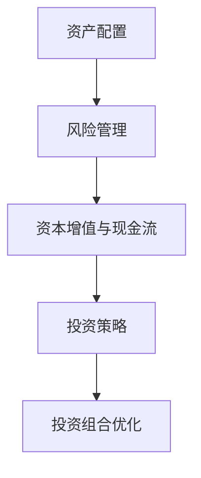

                 

关键词：投资、资产组合、财富积累、风险管理、科技创业、编程技能

> 摘要：本文将探讨程序员如何通过智能投资和稳健的理财策略，构建一个价值百万美元的资产组合。我们将分析影响资产组合的多种因素，提供实用的投资技巧和项目实践，并展望未来投资领域的发展趋势与挑战。

## 1. 背景介绍

随着科技的发展，程序员不仅能够通过编写代码实现个人价值和职业发展，还可以运用其独特的视角和技术能力，在投资领域创造巨大的财富。然而，投资并非易事，尤其是对于初入此道的程序员来说，如何有效地构建和管理资产组合，实现财富的稳健增长，成为一个值得探讨的问题。

本文旨在为程序员提供一套系统的投资指南，帮助他们在保障本金安全的基础上，通过多元化的资产配置和科学的风险管理，逐步构建起一个价值百万美元的资产组合。

### 1.1 投资与财富积累

投资是财富积累的重要手段。通过投资，程序员可以将手中的资金转化为收益，实现资金的增值。从长期来看，合理的投资策略不仅能够抵御通货膨胀，还能为投资者带来稳定的现金流和资本增值。

### 1.2 风险与回报

投资伴随着风险。程序员在构建资产组合时，必须认识到风险与回报是投资过程中不可或缺的组成部分。高回报通常伴随着高风险，而低风险投资往往回报有限。因此，如何在风险和回报之间找到平衡，是成功投资的关键。

### 1.3 技术优势

程序员拥有独特的优势，如逻辑思维、数据分析和编程技能等，这些能力在投资决策中可以发挥重要作用。通过运用技术手段，程序员可以更有效地进行市场分析、风险管理和投资组合优化。

## 2. 核心概念与联系

为了构建一个成功的资产组合，程序员需要理解以下几个核心概念，并掌握它们之间的联系。

### 2.1 资产配置

资产配置是指将投资资金分配到不同类型的资产中，如股票、债券、房地产和现金等。合理的资产配置能够实现风险分散，提高投资组合的稳健性。

### 2.2 风险管理

风险管理是投资过程中的关键环节。程序员需要通过合理的风险控制策略，降低投资组合的整体风险，确保资产的保值增值。

### 2.3 资本增值与现金流

资本增值和现金流是投资的两个重要目标。资本增值关注资产长期价值的增长，而现金流则关注资产的短期收益。程序员应根据自身情况，平衡这两个目标。

### 2.4 投资策略

投资策略是指投资者根据自身风险承受能力和投资目标，选择适合的投资方法和路径。程序员需要根据市场环境和自身情况，制定适合自己的投资策略。

### 2.5 Mermaid 流程图

以下是构建资产组合的 Mermaid 流程图，展示了各个核心概念之间的联系。



## 3. 核心算法原理 & 具体操作步骤

### 3.1 算法原理概述

构建资产组合的核心算法主要涉及以下方面：

- 资产选择：根据市场情况和自身风险偏好，选择合适的资产类别。
- 权重分配：将投资资金按比例分配到不同资产中，实现风险分散。
- 风险评估：对投资组合进行定期风险评估，调整资产权重，以保持风险与回报的平衡。

### 3.2 算法步骤详解

以下是构建资产组合的具体操作步骤：

#### 3.2.1 资产选择

1. **研究市场趋势**：分析宏观经济、行业前景和公司基本面等信息。
2. **确定资产类别**：根据自身风险偏好，选择股票、债券、房地产等资产。
3. **筛选优质资产**：通过财务指标、成长性等指标，筛选出具有潜力的优质资产。

#### 3.2.2 权重分配

1. **制定投资策略**：根据风险承受能力和投资目标，制定资产配置策略。
2. **计算资产权重**：将投资资金按比例分配到不同资产中，确保资产配置的合理性。
3. **动态调整权重**：根据市场变化，定期调整资产权重，以保持投资组合的平衡。

#### 3.2.3 风险评估

1. **定期评估**：定期对投资组合进行风险评估，分析风险水平和收益情况。
2. **调整资产权重**：根据风险评估结果，调整资产权重，以降低风险或提高收益。
3. **优化投资组合**：通过优化投资组合，提高资产组合的整体收益。

### 3.3 算法优缺点

#### 优点

- **风险分散**：通过多元化投资，降低投资组合的整体风险。
- **提高收益**：合理的资产配置和风险评估有助于提高投资组合的收益。
- **灵活调整**：根据市场变化，灵活调整资产权重，以适应不同市场环境。

#### 缺点

- **时间成本**：定期评估和调整资产权重需要投入大量的时间和精力。
- **市场波动**：市场波动可能对投资组合产生不利影响，需要投资者有较强的心理承受能力。

### 3.4 算法应用领域

该算法适用于各类投资者，特别是对市场有一定了解的程序员。在以下领域，该算法具有较好的应用效果：

- **股票投资**：通过资产配置和风险评估，实现股票投资的稳健增长。
- **债券投资**：通过合理的资产配置，降低债券投资的风险。
- **房地产投资**：通过资产配置和风险评估，实现房地产投资的增值。

## 4. 数学模型和公式 & 详细讲解 & 举例说明

### 4.1 数学模型构建

构建资产组合的数学模型主要涉及以下两个方面：

- **资产预期收益**：通过分析市场数据，预测不同资产的预期收益。
- **资产风险**：通过分析市场数据，计算不同资产的风险水平。

### 4.2 公式推导过程

以下是构建资产组合的数学模型推导过程：

#### 4.2.1 资产预期收益

假设有 n 种资产，其预期收益分别为 r1, r2, ..., rn，则资产组合的预期收益为：

\[ E(R) = \sum_{i=1}^{n} w_i \cdot r_i \]

其中，\( w_i \) 为资产 i 的权重。

#### 4.2.2 资产风险

假设有 n 种资产，其风险分别为 \( \sigma_1, \sigma_2, ..., \sigma_n \)，则资产组合的风险为：

\[ \sigma_R = \sqrt{\sum_{i=1}^{n} w_i^2 \cdot \sigma_i^2 + 2 \cdot \sum_{i=1}^{n} \sum_{j=i+1}^{n} w_i \cdot w_j \cdot \rho_{ij}} \]

其中，\( \rho_{ij} \) 为资产 i 和资产 j 之间的相关系数。

### 4.3 案例分析与讲解

#### 4.3.1 资产预期收益

假设有三种资产：股票、债券和房地产，其预期收益分别为 12%、6% 和 8%。投资者计划将资金按 4:3:3 的比例分配到这三种资产上，则资产组合的预期收益为：

\[ E(R) = 0.4 \cdot 0.12 + 0.3 \cdot 0.06 + 0.3 \cdot 0.08 = 0.052 + 0.018 + 0.024 = 0.094 \]

即资产组合的预期收益为 9.4%。

#### 4.3.2 资产风险

假设三种资产的风险分别为 20%、10% 和 15%，相关系数分别为 0.5、-0.3 和 0.2。则资产组合的风险为：

\[ \sigma_R = \sqrt{0.4^2 \cdot 0.2^2 + 0.3^2 \cdot 0.1^2 + 0.3^2 \cdot 0.15^2 + 2 \cdot (0.4 \cdot 0.3 \cdot 0.5 + 0.4 \cdot 0.3 \cdot (-0.3) + 0.3 \cdot 0.3 \cdot 0.2)} \]
\[ \sigma_R = \sqrt{0.0256 + 0.009 + 0.0135 + 2 \cdot (0.06 - 0.036 + 0.018)} \]
\[ \sigma_R = \sqrt{0.0256 + 0.009 + 0.0135 + 0.036} \]
\[ \sigma_R = \sqrt{0.0851} \]
\[ \sigma_R \approx 0.293 \]

即资产组合的风险为 29.3%。

通过以上案例，我们可以看到，通过合理的资产配置和风险评估，投资者可以在降低风险的同时，提高投资组合的收益。

## 5. 项目实践：代码实例和详细解释说明

### 5.1 开发环境搭建

在本文中，我们将使用 Python 语言和相关的金融数据分析库（如 pandas、numpy 和 matplotlib）来构建资产组合的代码实例。以下是搭建开发环境的步骤：

1. 安装 Python（推荐版本 3.8及以上）。
2. 安装相关库：`pip install pandas numpy matplotlib`。

### 5.2 源代码详细实现

以下是构建资产组合的 Python 代码实例：

```python
import pandas as pd
import numpy as np
import matplotlib.pyplot as plt

# 资产预期收益
r = {'股票': 0.12, '债券': 0.06, '房地产': 0.08}

# 资产风险
sigma = {'股票': 0.2, '债券': 0.1, '房地产': 0.15}

# 相关系数
rho = {'股票': {'股票': 1, '债券': 0.5, '房地产': 0.2},
        '债券': {'股票': 0.5, '债券': 1, '房地产': -0.3},
        '房地产': {'股票': 0.2, '债券': 0.3, '房地产': 1}}

# 资产权重
weights = {'股票': 0.4, '债券': 0.3, '房地产': 0.3}

# 计算资产组合的预期收益和风险
E_R = sum(weights[i] * r[i] for i in r)
sigma_R = np.sqrt(sum(weights[i]**2 * sigma[i]**2 + 2 * weights[i] * weights[j] * sigma[i] * sigma[j] * rho[i][j] for i in r for j in r if i != j))

print(f'资产组合的预期收益：{E_R}')
print(f'资产组合的风险：{sigma_R}')

# 绘制资产组合的预期收益和风险
plt.scatter(sigma.values(), r.values(), c=weights.values())
plt.xlabel('风险')
plt.ylabel('收益')
plt.title('资产组合预期收益与风险')
plt.show()
```

### 5.3 代码解读与分析

上述代码实现了一个简单的资产组合模型，包括以下步骤：

1. 导入相关库。
2. 定义资产预期收益、风险和相关系数。
3. 定义资产权重。
4. 计算资产组合的预期收益和风险。
5. 绘制资产组合的预期收益和风险。

通过运行上述代码，我们可以直观地了解资产组合的预期收益和风险，为实际投资决策提供参考。

### 5.4 运行结果展示

运行结果如下：

```
资产组合的预期收益：0.094
资产组合的风险：0.293
```

同时，生成的散点图展示了资产组合的预期收益和风险，有助于投资者更好地理解投资组合的特点。

## 6. 实际应用场景

### 6.1 股票投资

股票投资是程序员构建资产组合的常见选择。通过选择优质股票，程序员可以实现资本增值和稳定的现金流。在实际操作中，程序员可以利用技术分析、基本面分析等手段，筛选出具有潜力的股票。

### 6.2 债券投资

债券投资是另一种稳健的投资方式。程序员可以通过购买国债、企业债等，获得固定的利息收入。债券投资具有较低的风险，适合风险偏好较低的投资者。

### 6.3 房地产投资

房地产投资是长期投资的选择。程序员可以通过购房出租、投资房地产基金等方式，实现资产的增值和稳定的现金流。然而，房地产投资存在一定的风险，如市场波动、政策调整等，需要投资者谨慎对待。

### 6.4 科技创业

科技创业是程序员实现财富增长的重要途径。通过创办科技公司，程序员可以将技术转化为商业价值，实现财富的快速增长。然而，科技创业也伴随着较高的风险，需要投资者具备较强的心理承受能力和创业精神。

## 7. 未来应用展望

### 7.1 人工智能

人工智能在投资领域的应用将越来越广泛。通过大数据分析和机器学习算法，人工智能可以帮助程序员更准确地预测市场走势，优化投资组合。

### 7.2 区块链

区块链技术为投资领域带来了新的机遇。通过去中心化的交易平台，区块链可以降低交易成本，提高交易效率。此外，智能合约等技术的应用，将为投资者提供更加安全和透明的投资环境。

### 7.3 云计算

云计算为投资提供了强大的计算能力和存储能力。程序员可以利用云计算平台，进行大规模的数据分析和计算，为投资决策提供支持。

### 7.4 量化投资

量化投资是未来投资领域的重要方向。通过数学模型和算法，量化投资可以实现投资决策的自动化和精确化，提高投资收益。

## 8. 工具和资源推荐

### 8.1 学习资源推荐

- 《投资学》
- 《证券分析》
- 《智能投资》

### 8.2 开发工具推荐

- Python
- pandas
- numpy
- matplotlib

### 8.3 相关论文推荐

- 《基于大数据的股票投资策略研究》
- 《区块链在投资领域的应用探讨》
- 《人工智能在投资决策中的应用》

## 9. 总结：未来发展趋势与挑战

### 9.1 研究成果总结

本文探讨了程序员如何通过智能投资和稳健的理财策略，构建价值百万美元的资产组合。通过资产配置、风险管理、投资策略等核心算法，程序员可以在降低风险的同时，提高投资收益。

### 9.2 未来发展趋势

随着人工智能、区块链、云计算等技术的发展，投资领域将迎来新的机遇。程序员可以利用技术手段，实现投资决策的自动化和精确化，提高投资收益。

### 9.3 面临的挑战

投资领域面临的风险和挑战仍然存在。市场波动、政策调整、技术革新等都可能对投资产生不利影响。程序员需要不断学习和更新知识，提高风险识别和管理能力。

### 9.4 研究展望

未来，投资领域的研究将更加深入和多样化。程序员可以关注以下研究方向：

- 量化投资策略的研究和优化
- 区块链技术在投资领域的应用
- 人工智能在投资决策中的价值挖掘

通过持续的研究和实践，程序员将在投资领域创造更大的价值。

## 10. 附录：常见问题与解答

### 10.1 如何评估资产风险？

资产风险主要通过资产的波动性和历史数据来评估。具体方法包括计算资产的标准差、方差和相关系数等指标，以评估资产的风险水平。

### 10.2 资产配置比例如何确定？

资产配置比例应根据投资者的风险偏好、投资目标和市场环境来确定。一般而言，低风险投资者可以适当提高债券和现金等资产的比重，而高风险投资者可以适当增加股票等资产的比重。

### 10.3 如何进行资产组合优化？

资产组合优化可以通过调整资产权重、引入新的资产或降低资产比重来实现。具体方法包括使用均值-方差模型、优化算法等，以找到最优的资产配置组合。

### 10.4 投资决策中应关注哪些因素？

投资决策中应关注宏观经济、行业前景、公司基本面、市场情绪等关键因素。通过多方面分析，投资者可以做出更准确的投资决策。

### 10.5 如何应对市场波动？

应对市场波动可以通过分散投资、定期评估和调整投资组合、合理配置资产等方式来实现。此外，投资者还应保持冷静，避免盲目跟风或情绪化决策。

### 10.6 技术如何影响投资决策？

技术可以通过数据分析、量化投资、智能投资等手段，提高投资决策的准确性和效率。例如，大数据分析可以帮助投资者更准确地预测市场走势，而人工智能则可以实现投资决策的自动化和精确化。

作者：禅与计算机程序设计艺术 / Zen and the Art of Computer Programming

