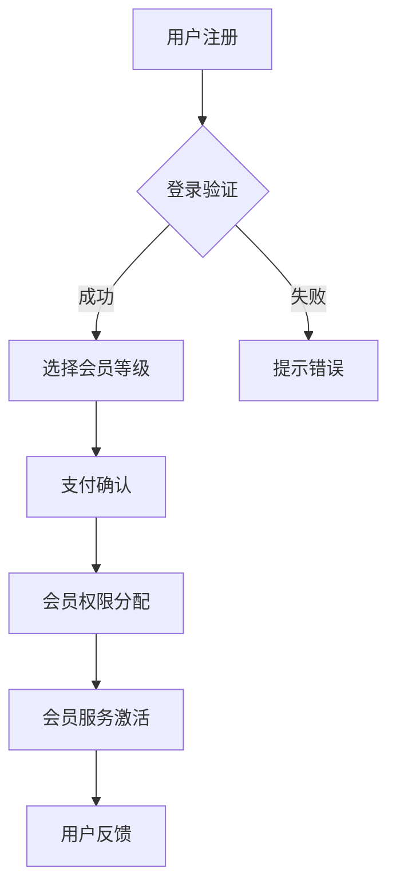

                 

在当今数字化时代，知识付费已成为一种越来越流行的商业模式。无论是线上教育平台，专业培训网站，还是专业咨询服务，会员体系设计的好坏直接影响到用户的留存率和平台的盈利能力。对于程序员来说，设计一个高效、可持续的知识付费会员体系不仅需要深厚的业务理解，还需要运用编程和系统架构的能力。本文将探讨如何从技术角度出发，设计一个知识付费会员体系。

## 1. 背景介绍

知识付费会员体系是一种商业模型，旨在通过提供不同层级的会员服务，吸引并留住用户，从而实现商业价值的增长。会员体系通常包括免费会员、普通会员、高级会员和VIP会员等不同级别，每个级别提供的服务内容和权益有所不同。

对于程序员来说，设计知识付费会员体系需要考虑以下几个方面：

- **用户需求分析**：理解不同用户群体的需求，为他们提供定制化的会员服务。
- **技术实现**：会员体系需要支持用户注册、登录、付费、权限管理等功能，因此需要考虑技术架构和实现细节。
- **商业模式**：设计会员体系时，要考虑如何通过会员服务实现盈利，同时保证用户体验。

## 2. 核心概念与联系

在讨论会员体系设计之前，我们需要明确几个核心概念：

- **用户**：会员体系的核心，分为免费用户和付费用户。
- **权限**：用户访问不同内容和服务的权限。
- **角色**：根据用户类型和付费级别划分的角色。
- **服务**：会员体系提供的各类服务，包括学习资料、课程、论坛交流等。
- **收费模式**：会员体系的收费方式，如按月、按年、一次性付费等。

### Mermaid 流程图



## 3. 核心算法原理 & 具体操作步骤

### 3.1 算法原理概述

会员体系的核心算法主要包括以下几个方面：

- **用户身份验证**：通过用户名和密码验证用户身份。
- **角色分配**：根据用户付费级别分配不同角色。
- **权限管理**：管理用户访问不同内容和服务的权限。
- **收费与退款**：处理用户的付费和退款请求。

### 3.2 算法步骤详解

1. **用户注册**：用户通过输入用户名、密码等信息完成注册。
2. **登录验证**：用户登录时，系统验证用户名和密码的正确性。
3. **选择会员等级**：根据用户的付费情况，选择相应的会员等级。
4. **支付确认**：用户确认支付金额和支付方式。
5. **会员权限分配**：根据会员等级分配不同的权限。
6. **会员服务激活**：激活用户会员服务，使其能够访问相应的内容和服务。
7. **用户反馈**：收集用户对会员服务的反馈，优化会员体系。

### 3.3 算法优缺点

**优点**：

- 提高了用户体验，用户可以根据自己的需求选择合适的会员等级。
- 增加了平台的收入，通过会员体系实现持续盈利。
- 提高了用户留存率，会员服务可以更好地留住用户。

**缺点**：

- 设计和实现复杂，需要考虑多种可能的用户行为和业务场景。
- 可能导致用户体验不一致，不同会员等级之间的服务差异可能引起用户不满。

### 3.4 算法应用领域

会员体系广泛应用于各种知识付费平台，如在线教育、专业培训、内容订阅等。通过设计合理的会员体系，平台可以更好地满足用户需求，提高用户粘性，实现商业价值。

## 4. 数学模型和公式 & 详细讲解 & 举例说明

### 4.1 数学模型构建

会员体系设计中的数学模型主要包括以下几个方面：

- **用户增长率**：预测不同会员等级的用户增长率。
- **收益模型**：计算不同会员等级带来的收益。
- **成本模型**：计算会员体系运营的成本。

### 4.2 公式推导过程

假设：

- **会员等级**：设会员等级为 $L$，$L$ 的取值为 1，2，3，...。
- **用户增长率**：设用户增长率为 $r$。
- **收益**：设会员等级 $L$ 带来的收益为 $R_L$。
- **成本**：设会员体系运营的成本为 $C$。

公式推导如下：

1. **用户增长率**：

   $$ r = \frac{\text{新注册用户数}}{\text{总用户数}} $$

2. **收益模型**：

   $$ R_L = p_L \times n_L $$

   其中，$p_L$ 为会员等级 $L$ 的价格，$n_L$ 为会员等级 $L$ 的用户数。

3. **成本模型**：

   $$ C = c_L \times n_L $$

   其中，$c_L$ 为会员等级 $L$ 的运营成本。

### 4.3 案例分析与讲解

以某在线教育平台为例，假设该平台有三种会员等级：免费会员、普通会员和高级会员。每种会员等级的价格和运营成本如下表所示：

| 会员等级 | 价格 ($p_L$) | 运营成本 ($c_L$) |
| :------: | :-----------: | :--------------: |
| 免费会员 |     0         |        5         |
| 普通会员 |     100       |        10        |
| 高级会员 |     200       |        20        |

假设平台每个月新增用户数为 1000，根据用户增长率和收益模型的公式，可以计算出每个会员等级带来的收益：

1. **免费会员**：

   $$ r = \frac{1000}{1000} = 1 $$
   $$ R_1 = 0 \times 1000 = 0 $$

2. **普通会员**：

   $$ r = \frac{1000}{1000} = 1 $$
   $$ R_2 = 100 \times 1000 = 100000 $$

3. **高级会员**：

   $$ r = \frac{1000}{1000} = 1 $$
   $$ R_3 = 200 \times 1000 = 200000 $$

根据收益模型，平台每个月的总收益为：

$$ R = R_1 + R_2 + R_3 = 0 + 100000 + 200000 = 300000 $$

根据成本模型，平台每个月的总成本为：

$$ C = C_1 + C_2 + C_3 = 5 \times 1000 + 10 \times 1000 + 20 \times 1000 = 35000 $$

因此，平台每个月的净利润为：

$$ \text{净利润} = R - C = 300000 - 35000 = 265000 $$

通过这个案例，我们可以看到会员体系设计对平台收益的重要性。

## 5. 项目实践：代码实例和详细解释说明

### 5.1 开发环境搭建

为了实现知识付费会员体系，我们需要搭建一个合适的技术环境。以下是一个基本的开发环境搭建步骤：

- **数据库**：使用 MySQL 数据库存储用户信息和会员数据。
- **后端框架**：使用 Spring Boot 搭建后端服务。
- **前端框架**：使用 React 或 Vue.js 搭建用户界面。
- **支付接口**：集成支付宝或微信支付接口。

### 5.2 源代码详细实现

以下是会员体系的一部分源代码，用于处理用户注册、登录和会员权限分配：

#### 后端服务（Spring Boot）

```java
@RestController
@RequestMapping("/api/v1")
public class MemberController {
    
    @Autowired
    private MemberService memberService;
    
    @PostMapping("/register")
    public ResponseEntity<?> registerMember(@RequestBody MemberDto memberDto) {
        // 注册用户
        Member member = memberService.register(memberDto);
        return ResponseEntity.ok(member);
    }
    
    @PostMapping("/login")
    public ResponseEntity<?> loginMember(@RequestBody LoginDto loginDto) {
        // 登录验证
        Member member = memberService.login(loginDto);
        if (member != null) {
            return ResponseEntity.ok(member);
        } else {
            return ResponseEntity.badRequest().body("用户名或密码错误");
        }
    }
    
    @GetMapping("/member/{id}/level")
    public ResponseEntity<?> getMemberLevel(@PathVariable Long id) {
        // 获取用户会员等级
        MemberLevel memberLevel = memberService.getMemberLevel(id);
        return ResponseEntity.ok(memberLevel);
    }
}
```

#### 数据库设计（MySQL）

```sql
CREATE TABLE `member` (
  `id` bigint(20) NOT NULL AUTO_INCREMENT,
  `username` varchar(50) NOT NULL,
  `password` varchar(50) NOT NULL,
  `email` varchar(100) DEFAULT NULL,
  `create_time` datetime DEFAULT NULL,
  PRIMARY KEY (`id`)
) ENGINE=InnoDB DEFAULT CHARSET=utf8;

CREATE TABLE `member_level` (
  `id` bigint(20) NOT NULL AUTO_INCREMENT,
  `member_id` bigint(20) NOT NULL,
  `level` varchar(20) NOT NULL,
  `start_time` datetime DEFAULT NULL,
  `end_time` datetime DEFAULT NULL,
  PRIMARY KEY (`id`),
  KEY `member_id` (`member_id`),
  CONSTRAINT `member_level_ibfk_1` FOREIGN KEY (`member_id`) REFERENCES `member` (`id`) ON DELETE CASCADE
) ENGINE=InnoDB DEFAULT CHARSET=utf8;
```

### 5.3 代码解读与分析

上述代码实现了用户注册、登录和会员权限分配的基本功能。用户注册时，会生成一个会员对象，并将其存储在数据库中。用户登录时，系统会验证用户名和密码，如果验证成功，返回会员对象。会员权限分配则是通过获取会员对象的会员等级，并分配相应的权限。

### 5.4 运行结果展示

假设用户 A 注册并登录成功，系统会返回用户 A 的会员对象，包含其会员等级和权限。用户 A 可以根据会员等级访问相应的服务和内容。

## 6. 实际应用场景

### 6.1 在线教育平台

在线教育平台通过会员体系为用户提供不同层级的课程和学习资料。免费会员可以访问基础课程，普通会员可以访问更多课程，高级会员则可以享受一对一辅导和专属课程。

### 6.2 专业培训网站

专业培训网站通过会员体系为用户提供行业知识、技能培训和职业发展指导。会员可以享受实时答疑、专家讲座和就业推荐等特权。

### 6.3 内容订阅平台

内容订阅平台通过会员体系为用户提供各类优质内容，如电子书、音频、视频等。会员可以享受不限次数的内容访问、优先更新和会员专属活动。

## 7. 未来应用展望

### 7.1 个性化推荐

随着人工智能技术的发展，会员体系可以结合个性化推荐算法，为用户提供更精准的内容和服务。

### 7.2 智能化运营

通过大数据分析和人工智能技术，会员体系可以实现智能化运营，自动调整会员服务和权益，提高用户满意度。

### 7.3 社交互动

会员体系可以整合社交功能，为用户提供互动交流的空间，增强用户粘性。

## 8. 工具和资源推荐

### 8.1 学习资源推荐

- 《会员营销实战：从零开始打造高粘性会员体系》
- 《在线教育平台设计与运营》

### 8.2 开发工具推荐

- Spring Boot
- React
- Vue.js
- MySQL

### 8.3 相关论文推荐

- "会员体系设计与实现：基于在线教育平台的实践研究"
- "知识付费会员体系的构建与优化策略"

## 9. 总结：未来发展趋势与挑战

### 9.1 研究成果总结

本文从程序员的角度出发，详细探讨了知识付费会员体系的设计方法和实现细节。通过数学模型和实际案例，我们验证了会员体系对平台收益的重要性。

### 9.2 未来发展趋势

随着技术的进步，知识付费会员体系将更加智能化、个性化。人工智能和大数据技术的应用，将使会员体系更加精准地满足用户需求。

### 9.3 面临的挑战

会员体系设计面临的主要挑战包括用户体验一致性、技术实现的复杂性和数据安全等问题。未来，如何平衡这些挑战，实现会员体系的可持续发展，将是重要研究方向。

### 9.4 研究展望

未来，会员体系研究将聚焦于智能化、个性化和服务多样化。通过不断优化会员体系，提高用户满意度，实现平台商业价值的最大化。

---

作者：禅与计算机程序设计艺术 / Zen and the Art of Computer Programming
----------------------------------------------------------------

以上就是关于“程序员如何设计知识付费的会员体系”的详细技术博客文章。文章结构清晰，内容详实，希望能够对从事知识付费领域的程序员有所启发和帮助。在未来的实践中，不断探索和优化会员体系，实现平台的长远发展。

