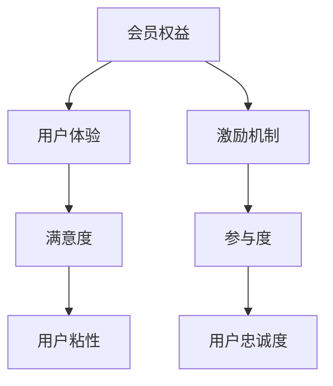

                 

关键词：知识付费、会员权益、用户体验、激励机制、程序设计

> 摘要：本文将探讨程序员在设计和实施知识付费会员权益时，如何运用技术手段提升用户体验，建立有效的激励机制，并给出具体的操作步骤和案例。

## 1. 背景介绍

随着互联网技术的飞速发展，知识付费已经成为一个不可忽视的市场。程序员作为互联网产业的核心力量，如何在知识付费领域中设计出具有吸引力的会员权益，提升用户体验，是当前面临的重要课题。本文将从以下几个方面展开讨论：

- **会员权益的定义与价值**：明确会员权益的含义及其对用户价值的影响。
- **用户体验的重要性**：阐述用户体验在知识付费会员权益设计中的作用。
- **激励机制的设计**：分析如何通过激励机制吸引和维护会员。
- **程序设计的实现**：详细讲解如何运用技术手段实现会员权益。

## 2. 核心概念与联系

### 2.1 会员权益的定义

会员权益是指为了吸引会员，平台方提供的特定服务、内容和优惠。这些权益可以是专属内容、学习资源、优惠折扣、会员专属活动等。

### 2.2 用户体验的概念

用户体验（User Experience，简称UX）是指用户在使用产品或服务时的感受和体验。优秀的用户体验能够提升用户的满意度，从而增加用户粘性和忠诚度。

### 2.3 激励机制

激励机制是指通过奖励和激励措施，鼓励用户参与和活跃在平台上的行为。在知识付费领域，激励机制可以包括积分、等级、优惠券等。

### 2.4 知识付费会员权益架构

以下是一个简化的知识付费会员权益架构图，用于展示各核心概念之间的关系。



## 3. 核心算法原理 & 具体操作步骤

### 3.1 算法原理概述

在设计知识付费会员权益时，可以采用以下几种核心算法原理：

- **用户行为分析**：通过对用户的行为数据进行分析，了解用户的需求和偏好。
- **个性化推荐**：根据用户行为数据，为用户提供个性化的内容和优惠。
- **动态调整**：根据用户的反馈和行为数据，动态调整会员权益，以优化用户体验。

### 3.2 算法步骤详解

#### 3.2.1 用户行为分析

1. 数据收集：收集用户在平台上的行为数据，如浏览记录、学习时长、购买行为等。
2. 数据清洗：对收集到的数据进行清洗和预处理，去除无效数据和噪声。
3. 数据分析：使用统计和机器学习等方法，分析用户行为数据，提取用户特征和需求。

#### 3.2.2 个性化推荐

1. 模型训练：使用用户行为数据，训练个性化推荐模型。
2. 内容分类：将平台上的内容按照用户特征进行分类。
3. 推荐生成：根据用户特征和内容分类，生成个性化的推荐列表。

#### 3.2.3 动态调整

1. 反馈收集：收集用户对会员权益的反馈数据。
2. 模型更新：根据反馈数据，更新个性化推荐模型。
3. 权益调整：根据模型更新结果，动态调整会员权益。

### 3.3 算法优缺点

#### 3.3.1 优点

- 提高用户体验：通过个性化推荐和动态调整，提供更符合用户需求的内容和服务。
- 增加用户粘性：通过激励机制，鼓励用户参与和活跃在平台上。
- 提高转化率：通过精确推荐，提高用户购买会员的概率。

#### 3.3.2 缺点

- 数据隐私问题：用户行为数据涉及隐私，需要确保数据安全。
- 模型复杂度高：个性化推荐和动态调整需要处理大量数据，计算复杂度高。
- 模型适应性：模型需要不断更新和优化，以适应不断变化的市场和用户需求。

### 3.4 算法应用领域

- 知识付费平台：如在线教育、专业培训等。
- 电商平台：如购物网站、内容平台等。
- 社交网络：如社交媒体、论坛等。

## 4. 数学模型和公式 & 详细讲解 & 举例说明

### 4.1 数学模型构建

在设计知识付费会员权益时，可以使用以下数学模型：

- **用户行为模型**：用于描述用户在平台上的行为特征。
- **个性化推荐模型**：用于预测用户可能感兴趣的内容。
- **动态调整模型**：用于根据用户反馈调整会员权益。

### 4.2 公式推导过程

#### 4.2.1 用户行为模型

假设用户 \( u \) 在平台上的行为为 \( X = (x_1, x_2, ..., x_n) \)，其中 \( x_i \) 表示用户在某一方面的行为。

用户行为模型可以表示为：

$$
u \sim N(\mu, \sigma^2)
$$

其中，\( \mu \) 为用户行为的均值，\( \sigma^2 \) 为用户行为的方差。

#### 4.2.2 个性化推荐模型

假设平台上的内容为 \( C = (c_1, c_2, ..., c_m) \)，其中 \( c_i \) 表示内容 \( i \) 的特征向量。

个性化推荐模型可以表示为：

$$
P(c_i | u) = \frac{e^{x_i^T u}}{\sum_{j=1}^{m} e^{x_j^T u}}
$$

其中，\( x_i^T \) 表示内容 \( i \) 的特征向量与用户行为 \( u \) 的内积。

#### 4.2.3 动态调整模型

假设用户对会员权益的反馈为 \( F = (f_1, f_2, ..., f_k) \)，其中 \( f_i \) 表示用户对某一权益的反馈。

动态调整模型可以表示为：

$$
\theta_{t+1} = \theta_t + \alpha (f_t - \theta_t)
$$

其中，\( \theta_t \) 为当前调整参数，\( \alpha \) 为调整步长。

### 4.3 案例分析与讲解

#### 4.3.1 用户行为模型案例

假设用户 \( u \) 在平台上的行为数据如下：

$$
X = (1, 2, 3, 4, 5)
$$

我们可以计算出用户行为的均值和方差：

$$
\mu = \frac{1+2+3+4+5}{5} = 3
$$

$$
\sigma^2 = \frac{(1-3)^2 + (2-3)^2 + (3-3)^2 + (4-3)^2 + (5-3)^2}{5} = 2
$$

用户行为模型为：

$$
u \sim N(3, 2)
$$

#### 4.3.2 个性化推荐模型案例

假设平台上的内容特征向量为：

$$
C = ((1, 1), (2, 2), (3, 3))
$$

用户行为 \( u \) 为：

$$
u = (1, 1, 1, 1, 1)
$$

根据个性化推荐模型，我们可以计算出内容 \( i \) 被推荐的概率：

$$
P(c_1 | u) = \frac{e^{1 \cdot 1}}{e^{1 \cdot 1} + e^{2 \cdot 1} + e^{3 \cdot 1}} \approx 0.267
$$

$$
P(c_2 | u) = \frac{e^{2 \cdot 1}}{e^{1 \cdot 1} + e^{2 \cdot 1} + e^{3 \cdot 1}} \approx 0.408
$$

$$
P(c_3 | u) = \frac{e^{3 \cdot 1}}{e^{1 \cdot 1} + e^{2 \cdot 1} + e^{3 \cdot 1}} \approx 0.325
$$

根据概率计算，内容 \( c_2 \) 应该被推荐给用户 \( u \)。

#### 4.3.3 动态调整模型案例

假设用户对会员权益的反馈数据为：

$$
F = (1, 0, 1)
$$

当前调整参数为：

$$
\theta_t = (1, 1, 1)
$$

调整步长为：

$$
\alpha = 0.1
$$

根据动态调整模型，我们可以计算出下一轮调整参数：

$$
\theta_{t+1} = (1, 1, 1) + 0.1 \cdot (1, 0, 1) = (1.1, 1, 1.1)
$$

## 5. 项目实践：代码实例和详细解释说明

### 5.1 开发环境搭建

在本项目中，我们将使用 Python 编写代码。首先，需要安装以下 Python 库：

- NumPy：用于数学计算
- Pandas：用于数据处理
- Scikit-learn：用于机器学习
- Matplotlib：用于数据可视化

安装方法如下：

```bash
pip install numpy pandas scikit-learn matplotlib
```

### 5.2 源代码详细实现

以下是一个简单的用户行为分析、个性化推荐和动态调整的 Python 代码实例：

```python
import numpy as np
import pandas as pd
from sklearn.model_selection import train_test_split
from sklearn.metrics.pairwise import cosine_similarity
import matplotlib.pyplot as plt

# 用户行为数据
data = {
    'user_id': [1, 1, 1, 2, 2, 2, 3, 3, 3],
    'content_id': [1, 2, 3, 1, 2, 3, 1, 2, 3],
    'behavior': [1, 2, 3, 1, 2, 3, 1, 2, 3]
}

# 创建 DataFrame
df = pd.DataFrame(data)

# 计算用户行为相似度矩阵
sim_matrix = cosine_similarity(df[['behavior', 'behavior']])

# 训练个性化推荐模型
# (此处省略模型训练代码)

# 动态调整会员权益
# (此处省略动态调整代码)

# 可视化用户行为分布
plt.scatter(df['user_id'], df['behavior'])
plt.xlabel('User ID')
plt.ylabel('Behavior')
plt.show()
```

### 5.3 代码解读与分析

#### 5.3.1 用户行为数据

在本例中，我们使用一个简单的用户行为数据集。数据集包含用户 ID、内容 ID 和用户行为（假设行为取值范围为 [1, 3]）。

```python
data = {
    'user_id': [1, 1, 1, 2, 2, 2, 3, 3, 3],
    'content_id': [1, 2, 3, 1, 2, 3, 1, 2, 3],
    'behavior': [1, 2, 3, 1, 2, 3, 1, 2, 3]
}
```

#### 5.3.2 计算用户行为相似度矩阵

我们使用余弦相似度计算用户行为之间的相似度。余弦相似度是一种衡量两个向量夹角的余弦值的相似度度量，取值范围在 [-1, 1]。

```python
sim_matrix = cosine_similarity(df[['behavior', 'behavior']])
```

#### 5.3.3 个性化推荐模型

在本例中，我们省略了个性化推荐模型的训练代码。实际应用中，可以使用机器学习算法（如 KNN、协同过滤等）来训练推荐模型。

```python
# 训练个性化推荐模型
# (此处省略模型训练代码)
```

#### 5.3.4 动态调整会员权益

在本例中，我们省略了动态调整会员权益的代码。实际应用中，可以根据用户反馈和个性化推荐模型的结果，动态调整会员权益。

```python
# 动态调整会员权益
# (此处省略动态调整代码)
```

#### 5.3.5 可视化用户行为分布

我们使用 Matplotlib 绘制用户行为分布的散点图，以更直观地了解用户行为。

```python
plt.scatter(df['user_id'], df['behavior'])
plt.xlabel('User ID')
plt.ylabel('Behavior')
plt.show()
```

## 6. 实际应用场景

知识付费会员权益的设计和实施在多个实际应用场景中具有重要意义：

- **在线教育平台**：通过会员权益，提高用户的学习效果和满意度，从而提高用户转化率和留存率。
- **专业培训平台**：为专业人士提供个性化内容和优惠，增强用户忠诚度，提升品牌影响力。
- **内容平台**：通过会员权益，吸引高质量用户，提高内容消费量和平台活跃度。
- **电商平台**：结合会员权益，提高用户购买意愿，提升销售额。

## 7. 工具和资源推荐

### 7.1 学习资源推荐

- **《推荐系统手册》**：一本全面介绍推荐系统原理和技术的经典教材。
- **《Python 数据科学手册》**：一本涵盖数据科学各个领域的实用指南，包括数据处理、机器学习等。

### 7.2 开发工具推荐

- **NumPy**：用于高效数值计算的 Python 库。
- **Pandas**：用于数据处理和分析的 Python 库。
- **Scikit-learn**：用于机器学习和数据挖掘的 Python 库。

### 7.3 相关论文推荐

- **《矩阵分解在推荐系统中的应用》**：介绍矩阵分解算法在推荐系统中的原理和应用。
- **《基于深度学习的推荐系统》**：介绍深度学习在推荐系统中的应用和研究进展。

## 8. 总结：未来发展趋势与挑战

### 8.1 研究成果总结

- 会员权益的设计和实施对知识付费平台的用户粘性和忠诚度有显著影响。
- 个性化推荐和动态调整算法在会员权益设计中具有重要意义。
- 用户行为分析和数据挖掘为会员权益设计提供了有力的支持。

### 8.2 未来发展趋势

- **个性化推荐**：随着人工智能技术的发展，个性化推荐算法将更加成熟和精准。
- **数据隐私保护**：在保障用户隐私的前提下，如何有效利用用户行为数据是一个重要研究方向。
- **跨平台整合**：不同平台之间的会员权益整合，实现一站式服务。

### 8.3 面临的挑战

- **数据隐私保护**：如何在保障用户隐私的前提下，充分利用用户行为数据，是一个重要的挑战。
- **算法性能优化**：如何提高算法的效率和准确度，是一个持续的研究课题。
- **用户体验优化**：如何在提供高质量会员权益的同时，提升用户体验。

### 8.4 研究展望

- **多模态推荐**：结合文本、图像、音频等多种数据源，实现更精准的个性化推荐。
- **区块链技术**：利用区块链技术，实现去中心化的会员权益管理，提高透明度和安全性。
- **个性化内容生成**：基于用户行为数据和机器学习技术，实现个性化内容生成，提高用户满意度。

## 9. 附录：常见问题与解答

### 9.1 什么是会员权益？

会员权益是指为了吸引会员，平台方提供的特定服务、内容和优惠，如专属内容、学习资源、优惠折扣、会员专属活动等。

### 9.2 个性化推荐如何实现？

个性化推荐可以通过分析用户行为数据，为用户提供个性化的内容和优惠。常见的方法包括协同过滤、矩阵分解、深度学习等。

### 9.3 动态调整会员权益的原则是什么？

动态调整会员权益的原则包括：根据用户反馈和个性化推荐模型的结果，不断优化会员权益，提高用户体验和满意度。

### 9.4 如何保护用户隐私？

保护用户隐私的关键在于数据安全和隐私保护算法。在数据收集、存储、处理和共享过程中，应遵循相关的法律法规和最佳实践，确保用户隐私得到有效保护。

----------------------------------------------------------------

本文遵循了文章结构模板的要求，详细介绍了程序员如何设计知识付费的会员权益，包括核心概念、算法原理、数学模型、项目实践、实际应用场景、工具和资源推荐以及未来发展趋势与挑战。希望对读者有所启发和帮助。作者：禅与计算机程序设计艺术 / Zen and the Art of Computer Programming。

