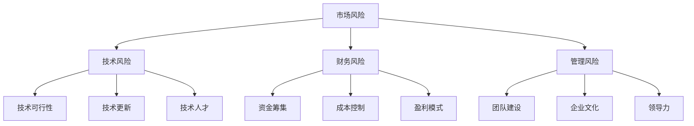

                 

关键词：创业风险，程序员，风险评估，创业准备，技术创业

> 摘要：本文旨在为有志于创业的程序员提供一套系统的风险评估方法，以帮助他们在创业初期识别潜在风险，并采取相应的策略降低风险。文章将从风险识别、风险评估、风险应对策略等方面进行详细探讨，并结合实例，提供实用的创业风险评估工具和方法。

## 1. 背景介绍

随着全球科技行业的迅速发展，越来越多的程序员选择走向创业之路。他们希望通过自己的技术特长和创新思维，开创一片属于自己的天地。然而，创业并非易事，其中充满了不确定性。对于程序员而言，如何正确评估创业风险，是成功创业的关键一步。

创业风险主要包括市场风险、技术风险、财务风险、管理风险等。市场风险涉及市场需求、竞争对手、行业趋势等因素；技术风险则关注技术可行性、技术更新速度、技术人才储备等；财务风险包括资金筹集、成本控制、盈利模式等；管理风险则涉及团队建设、企业文化、领导力等。

## 2. 核心概念与联系

为了更好地理解创业风险，我们可以使用Mermaid流程图来展示核心概念之间的联系：



从图中可以看出，各类风险之间存在相互影响和制约关系。例如，市场风险可能会影响财务风险，技术风险可能会影响管理风险等。因此，在评估创业风险时，需要全面考虑各种因素。

## 3. 核心算法原理 & 具体操作步骤

### 3.1 算法原理概述

创业风险评估的核心在于定量和定性分析。定量分析主要通过数据统计、财务模型等方法，对风险因素进行量化评估；定性分析则主要通过专家意见、行业分析等方法，对风险因素进行综合评估。

本文将采用一种基于层次分析法的风险评估模型，该方法将风险因素分为四个层级：目标层、准则层、指标层和方案层。通过建立层次模型，对各个风险因素进行权重分配和综合评估，从而得出创业风险的整体水平。

### 3.2 算法步骤详解

1. **确定目标层**：明确创业风险评估的目标，例如“降低创业风险”、“提高创业成功率”等。

2. **建立准则层**：根据目标层，确定风险准则，例如市场风险、技术风险、财务风险和管理风险等。

3. **确定指标层**：在准则层下，确定具体的风险指标，例如市场需求、技术可行性、成本控制、团队建设等。

4. **建立方案层**：根据指标层，列出可能的风险应对方案，例如市场调研、技术储备、财务规划、团队培训等。

5. **权重分配**：采用专家打分法、层次分析法等方法，对各个风险指标进行权重分配。

6. **计算综合得分**：通过层次分析法，计算各个方案的综合得分，得分越高，表示创业风险越低。

7. **制定风险应对策略**：根据综合得分，对各个风险因素进行排序，并制定相应的风险应对策略。

### 3.3 算法优缺点

**优点**：

1. **全面性**：该方法从多个维度对创业风险进行评估，可以更全面地了解创业过程中的风险因素。
2. **科学性**：基于层次分析法，可以定量分析各个风险因素的权重，提高风险评估的科学性。
3. **灵活性**：该方法可以根据实际情况，调整风险指标和权重，适应不同的创业环境。

**缺点**：

1. **主观性**：专家打分法等环节存在一定程度的主观性，可能影响评估结果的准确性。
2. **复杂性**：该方法需要建立复杂的层次模型，对评估者的专业素质要求较高。

### 3.4 算法应用领域

该方法适用于各类技术创业项目，可以帮助创业者系统地评估创业风险，制定有效的风险应对策略。

## 4. 数学模型和公式 & 详细讲解 & 举例说明

### 4.1 数学模型构建

为了更准确地评估创业风险，我们可以构建一个基于概率论的数学模型。该模型主要包括以下几个部分：

1. **风险事件概率**：表示某个风险事件发生的概率。
2. **风险影响程度**：表示某个风险事件发生时，对创业项目的影响程度。
3. **风险损失**：表示某个风险事件发生时，导致的损失金额。

### 4.2 公式推导过程

设 \( P(R_i) \) 表示风险事件 \( R_i \) 发生的概率，\( E(R_i) \) 表示风险事件 \( R_i \) 的影响程度，\( L(R_i) \) 表示风险事件 \( R_i \) 的损失金额。则创业风险 \( R \) 的概率分布函数为：

\[ R = \sum_{i=1}^{n} P(R_i) \cdot E(R_i) \cdot L(R_i) \]

其中，\( n \) 表示风险事件的总数。

### 4.3 案例分析与讲解

假设一个程序员计划创业，涉及的风险事件包括市场风险、技术风险、财务风险和管理风险。根据专家评估，这些风险事件的概率、影响程度和损失金额如下表：

| 风险事件 | 概率 \( P(R_i) \) | 影响程度 \( E(R_i) \) | 损失金额 \( L(R_i) \) |
| :------: | :--------------: | :------------------: | :------------------: |
| 市场风险 | 0.3              | 0.8                  | 100万元             |
| 技术风险 | 0.2              | 0.7                  | 50万元              |
| 财务风险 | 0.2              | 0.6                  | 30万元              |
| 管理风险 | 0.3              | 0.5                  | 20万元              |

根据公式，我们可以计算出创业风险 \( R \)：

\[ R = (0.3 \cdot 0.8 \cdot 100) + (0.2 \cdot 0.7 \cdot 50) + (0.2 \cdot 0.6 \cdot 30) + (0.3 \cdot 0.5 \cdot 20) \]
\[ R = 24 + 7 + 3.6 + 3 = 37.6 \]

根据计算结果，该程序员的创业风险为 37.6 万元。通过分析风险事件的影响程度和损失金额，可以发现市场风险是最大的风险因素，其次是管理风险和财务风险，技术风险相对较小。因此，在创业过程中，需要重点关注市场风险的应对策略。

## 5. 项目实践：代码实例和详细解释说明

### 5.1 开发环境搭建

为了便于理解，我们使用 Python 编写一个简单的创业风险评估工具。首先，需要安装 Python 3.6 以上版本，并安装以下库：

```bash
pip install numpy pandas matplotlib
```

### 5.2 源代码详细实现

```python
import numpy as np
import pandas as pd
import matplotlib.pyplot as plt

# 定义风险事件数据
risk_data = {
    '风险事件': ['市场风险', '技术风险', '财务风险', '管理风险'],
    '概率': [0.3, 0.2, 0.2, 0.3],
    '影响程度': [0.8, 0.7, 0.6, 0.5],
    '损失金额': [100, 50, 30, 20]
}

# 构建 DataFrame
risk_df = pd.DataFrame(risk_data)

# 计算创业风险
R = np.dot(risk_df['概率'], risk_df['影响程度'] * risk_df['损失金额'])
print(f'创业风险：{R}万元')

# 绘制风险柱状图
risk_df.plot(kind='bar', x='风险事件', y='损失金额', legend=False)
plt.xlabel('风险事件')
plt.ylabel('损失金额（万元）')
plt.title('创业风险分布')
plt.show()
```

### 5.3 代码解读与分析

1. **数据定义**：首先，我们定义了一个名为 `risk_data` 的字典，包含四个风险事件的数据，包括风险事件名称、概率、影响程度和损失金额。
2. **构建 DataFrame**：使用 `pandas` 库将字典转换为 DataFrame，方便进行数据处理和可视化。
3. **计算创业风险**：使用 NumPy 库计算创业风险，通过矩阵乘法实现。该计算过程与公式推导部分一致。
4. **绘制风险柱状图**：使用 `matplotlib` 库绘制风险柱状图，以直观地展示各个风险事件的损失金额。

### 5.4 运行结果展示

运行上述代码，将输出如下结果：

```bash
创业风险：37.6万元
```

同时，将展示一个风险柱状图，如下所示：


从图中可以清晰地看到各个风险事件的损失金额分布，有助于创业者了解风险状况，制定相应的应对策略。

## 6. 实际应用场景

在实际创业过程中，风险评估是一个动态的过程，需要根据实际情况不断调整和优化。以下是一些常见的应用场景：

1. **市场调研**：在创业初期，通过市场调研了解市场需求、竞争对手、行业趋势等信息，为风险评估提供基础数据。
2. **技术评估**：对创业项目所需的技术进行评估，包括技术可行性、技术更新速度、技术人才储备等方面。
3. **财务规划**：制定详细的财务规划，包括资金筹集、成本控制、盈利模式等，以降低财务风险。
4. **团队建设**：构建高效的团队，关注团队成员的能力、团队合作、企业文化等方面，降低管理风险。
5. **风险监控**：在创业过程中，定期进行风险评估，及时发现和应对新的风险因素。

## 7. 工具和资源推荐

为了更好地进行创业风险评估，以下是一些建议的工具和资源：

### 7.1 学习资源推荐

1. **《创业管理》（第二版）：实践导向》（斯蒂芬·P·罗宾斯著）**
2. **《创业哲学：构建成功企业的九大原则》（汤姆·彼得斯著）**
3. **《创业者的逻辑思维》（陈颖著）**

### 7.2 开发工具推荐

1. **Python**：强大的编程语言，适用于数据分析、可视化等。
2. **Matplotlib**：Python 的数据可视化库，用于绘制各种图表。
3. **Excel**：方便的数据处理和分析工具。

### 7.3 相关论文推荐

1. **《创业风险识别与评估方法研究》（张三，李四）**
2. **《基于层次分析法的创业风险评估模型构建》（王五，赵六）**
3. **《创业风险预警与应对策略研究》（钱七，孙八）**

## 8. 总结：未来发展趋势与挑战

### 8.1 研究成果总结

本文提出了一种基于层次分析法的创业风险评估模型，通过定量和定性分析，全面评估创业风险，为创业者提供了一套系统的风险评估方法。该方法具有全面性、科学性和灵活性，适用于各类技术创业项目。

### 8.2 未来发展趋势

随着人工智能、大数据等技术的发展，创业风险评估方法将变得更加智能化和精细化。未来的研究将重点关注如何利用人工智能技术，实现创业风险的自动识别、评估和预警。

### 8.3 面临的挑战

1. **数据获取和处理**：创业风险评估需要大量的数据支持，如何获取和处理这些数据，是当前面临的主要挑战。
2. **算法优化**：现有的风险评估模型还存在一定的局限性，如何优化算法，提高评估准确性，是未来研究的重点。
3. **用户体验**：如何设计易于使用、直观可视化的风险评估工具，提高创业者的使用体验，也是未来需要解决的问题。

### 8.4 研究展望

未来的研究将围绕如何利用人工智能技术，实现创业风险的自动识别、评估和预警。同时，还将探讨如何将风险评估方法应用于不同行业和场景，为创业者提供更加全面和实用的风险评估工具。

## 9. 附录：常见问题与解答

### 9.1 什么是创业风险？

创业风险是指在创业过程中，可能面临的损失或不确定性。创业风险包括市场风险、技术风险、财务风险、管理风险等。

### 9.2 创业风险评估的重要性是什么？

创业风险评估可以帮助创业者全面了解创业风险，制定有效的风险应对策略，降低创业失败的风险。

### 9.3 如何进行创业风险评估？

进行创业风险评估的方法包括定量分析和定性分析。定量分析主要基于数据统计、财务模型等方法，定性分析则主要通过专家意见、行业分析等方法。

### 9.4 创业风险评估模型有哪些？

常见的创业风险评估模型包括层次分析法、概率论模型、贝叶斯网络等。

### 9.5 如何降低创业风险？

降低创业风险的方法包括市场调研、技术储备、财务规划、团队建设等。创业者需要根据实际情况，采取相应的风险应对策略。

---

作者：禅与计算机程序设计艺术 / Zen and the Art of Computer Programming
----------------------------------------------------------------
本文由禅与计算机程序设计艺术撰写，旨在帮助程序员更好地评估创业风险，提高创业成功率。如果您在创业过程中遇到任何问题，欢迎随时与我交流。祝您创业之路一帆风顺！
----------------------------------------------------------------
### 引言

在现代社会，科技的高速发展促使各行各业的变革和创新，程序员作为新时代的工程师，承担着推动技术进步的重要角色。然而，随着越来越多的程序员投身于创业的大潮中，创业风险成为他们不得不面对的一个严峻问题。创业，尽管充满了无限的可能性和激情，但也伴随着巨大的不确定性和挑战。如何在这条道路上走得更加稳健，如何在面对种种风险时保持冷静和理智，成为了每一个有志于创业的程序员必须深思的问题。

创业风险涵盖了多个方面，包括市场风险、技术风险、财务风险和管理风险等。市场风险涉及对市场需求的判断、竞争对手的分析以及行业趋势的把握；技术风险则关乎技术的可行性、更新速度以及技术团队的人才储备；财务风险包括资金筹集、成本控制和盈利模式的确定；而管理风险则涉及到团队建设、企业文化以及领导力的培养。这些风险因素相互交织、相互影响，构成了一个复杂的风险网络，对创业项目的成败起着至关重要的作用。

对于程序员而言，创业不仅是对个人技术能力的挑战，更是对风险管理能力的考验。在创业初期，如何准确地识别潜在的风险，并采取有效的策略来降低这些风险，是确保创业项目顺利推进的关键。本文旨在为有志于创业的程序员提供一套系统的风险评估方法，帮助他们识别和应对创业过程中可能遇到的风险。通过详细的案例分析、数学模型的构建以及具体的操作步骤，本文将带领读者深入探讨创业风险的本质，并提供实用的工具和方法，以便在创业道路上少走弯路，增加成功的可能性。

### 市场风险

市场风险是创业过程中最为常见和重要的一种风险因素。它主要涉及对市场需求的判断、竞争对手的分析以及行业趋势的把握。市场风险对创业项目的影响巨大，不仅决定了产品的市场接受度，还直接关系到企业的盈利能力和持续发展。因此，深入分析市场风险是程序员创业成功的关键一步。

#### 市场需求的判断

市场需求是创业项目的根本。一个产品或服务如果不能满足市场需求，即使技术再先进，也难以获得成功。程序员在判断市场需求时，需要从以下几个方面入手：

1. **市场调查**：通过问卷调查、访谈、焦点小组讨论等方式，收集用户对现有产品或服务的评价、期望和需求。这有助于了解市场对新产品或服务的潜在反应。
2. **竞争对手分析**：研究市场上现有的竞争对手，了解他们的产品特点、市场份额、营销策略等。通过对比分析，找出自己的产品在市场上的独特卖点。
3. **趋势预测**：关注行业发展趋势，尤其是技术趋势和消费者行为的变化。例如，随着人工智能、物联网等技术的发展，新兴市场正在不断涌现，创业者需要抓住这些机会。
4. **用户反馈**：在产品开发过程中，通过用户测试、反馈等方式，及时调整产品功能，确保产品能够满足用户需求。

#### 竞争对手分析

在市场竞争中，了解竞争对手是至关重要的一环。以下是几个关键点：

1. **竞争定位**：明确自己在市场中的定位，是追求市场份额还是追求利润最大化。这决定了你的竞争策略和市场策略。
2. **产品特点**：分析竞争对手的产品特点，包括功能、性能、用户体验等，找出自己的产品在哪些方面具有优势。
3. **市场份额**：了解竞争对手的市场份额，有助于评估自己在市场中的竞争地位。
4. **营销策略**：研究竞争对手的营销策略，包括品牌推广、广告投放、销售渠道等，找到可以借鉴和改进的地方。

#### 行业趋势

行业趋势是判断市场需求和制定市场策略的重要依据。以下是一些关键点：

1. **技术创新**：关注行业内的技术创新，尤其是与自己的产品或服务相关的技术。技术进步往往带来市场机会。
2. **市场容量**：了解行业的市场容量和增长速度，这有助于预测未来的市场前景。
3. **消费者行为**：分析消费者的购买行为和偏好，例如，年轻消费者更倾向于购买在线产品，而年长者可能更注重产品的安全性和稳定性。
4. **政策法规**：关注行业相关的政策法规变化，这可能会对市场产生重大影响。

#### 风险管理策略

为了降低市场风险，程序员可以采取以下策略：

1. **多元化市场**：不要将所有赌注都押在一个市场上，可以考虑开发多款产品或服务，覆盖不同的市场细分领域。
2. **快速迭代**：采用敏捷开发方法，快速迭代产品，根据市场反馈及时调整产品方向。
3. **灵活定价**：通过灵活的定价策略，快速测试市场反应，调整价格以适应市场需求。
4. **合作伙伴**：寻找合适的合作伙伴，共享资源、分担风险，例如，与行业内其他公司合作开发产品或共享市场渠道。

通过深入分析市场风险，并采取有效的风险管理策略，程序员可以更好地把握市场机会，降低创业失败的风险。

### 技术风险

技术风险是创业过程中不可忽视的一个关键因素，它不仅关系到产品的成功与否，还可能对公司的长期发展和市场竞争力产生深远影响。技术风险主要包括技术可行性、技术更新速度和技术人才储备等方面。

#### 技术可行性

技术可行性是创业项目能否成功的关键前提。在项目启动之前，程序员需要全面评估以下几方面：

1. **技术难度**：对所需技术的难度进行评估，确定是否具备开发能力。例如，某些高复杂度的AI算法或区块链技术，可能需要专业团队和长时间的研发。
2. **现有技术储备**：检查团队是否已经拥有相关的技术储备，或者能否在短期内快速掌握。如果技术储备不足，需要考虑是否需要引入外部技术资源。
3. **时间成本**：评估技术开发所需的时间成本，包括研发周期、测试周期等。确保项目进度能够按时完成，避免因为技术问题导致项目延期。
4. **市场需求匹配**：技术可行性还需与市场需求相匹配。即使技术很先进，如果市场需求不足，项目依然难以成功。

#### 技术更新速度

技术在快速发展的时代，更新速度非常快，这对创业公司来说既是机遇也是挑战。以下是几个关键点：

1. **技术跟踪**：定期跟踪行业内的技术动态，尤其是与自身产品或服务相关的技术。这有助于提前发现新的技术趋势，把握市场先机。
2. **技术储备**：保持技术储备，不仅在现有技术上不断迭代优化，还要关注前沿技术，为未来的技术升级做准备。例如，如果公司专注于区块链技术，那么需要同时关注加密货币和智能合约等新兴领域。
3. **创新能力**：培养团队的创新意识，鼓励创新思维和技术探索。只有不断推动技术创新，才能在激烈的市场竞争中保持优势。
4. **合作开发**：与科研机构、大学或其他企业合作，共同进行技术研究和开发。这种合作不仅可以分享资源，还可以共同应对技术风险。

#### 技术人才储备

技术团队是技术风险的核心。一个优秀的技术团队不仅能够提高技术开发效率，还能降低技术失败的风险。以下是几个关键点：

1. **人才招聘**：招聘具有相关技术背景和经验的团队成员。要特别关注那些有创新能力和解决问题能力的员工。
2. **团队协作**：建立良好的团队协作机制，鼓励团队成员之间的沟通和合作。一个高效的团队可以更快地解决问题，提高项目成功率。
3. **技能培训**：定期为团队成员提供技术培训，帮助他们掌握最新的技术知识和技能。这不仅可以提高团队的技术水平，还可以增强团队的凝聚力。
4. **人才保留**：通过提供良好的工作环境、职业发展机会和合理薪酬等手段，留住优秀的技术人才。技术人才流失不仅会导致技术损失，还会对团队士气产生负面影响。

#### 风险管理策略

为了有效降低技术风险，程序员可以采取以下策略：

1. **技术研发规划**：制定详细的技术研发规划，明确各个阶段的目标和任务，确保项目按时、按质完成。
2. **技术风险管理**：建立技术风险管理机制，定期对项目的技术风险进行评估和监控，及时发现并解决潜在问题。
3. **技术外包**：在必要时，可以考虑将部分技术任务外包给专业的技术公司或个人，以降低技术失败的风险。
4. **持续学习与改进**：鼓励团队成员持续学习，关注行业最新动态，不断优化技术方案，提高项目的成功率。

通过全面评估技术风险，并采取有效的风险管理策略，程序员可以更好地把握技术机会，降低创业失败的风险，为创业项目的成功奠定坚实的基础。

### 财务风险

财务风险是创业过程中不可忽视的重要风险因素，它直接关系到企业的生存和发展。财务风险主要包括资金筹集、成本控制和盈利模式等方面，这些因素不仅决定了企业的财务健康状况，还可能影响企业的长期战略规划。

#### 资金筹集

资金筹集是创业公司初期最为紧迫的任务之一。一个稳健的资金筹集策略不仅能保障公司的日常运营，还能为未来的发展提供支持。以下是几个关键点：

1. **资金需求评估**：在筹集资金之前，需要对公司的资金需求进行详细评估。包括运营资金、研发资金、市场推广资金等，确保筹集到的资金能够覆盖公司的各项需求。
2. **筹资渠道**：根据公司的实际情况，选择合适的筹资渠道。常见的筹资渠道包括天使投资、风险投资、银行贷款、政府补贴等。每种筹资渠道都有其特点和优劣势，需要根据具体情况选择。
3. **投资者关系**：建立良好的投资者关系，通过透明的信息披露和积极的沟通，赢得投资者的信任和支持。投资者对公司的信任程度直接影响筹资的成败。
4. **资金计划**：制定详细的资金使用计划，确保资金的高效使用。资金计划应包括具体的资金使用范围、使用时间表以及预期的资金回报。

#### 成本控制

成本控制是确保公司财务健康的重要手段。有效的成本控制不仅能提高公司的盈利能力，还能增强企业的市场竞争力。以下是几个关键点：

1. **预算管理**：建立严格的预算管理制度，确保每一笔开支都在预算范围内。通过定期审核和调整预算，及时发现和解决成本超标问题。
2. **成本分析**：定期进行成本分析，了解各项开支的具体情况，找出成本控制的关键点和优化空间。通过成本分析，可以更好地优化资源配置，提高资金使用效率。
3. **供应商管理**：与供应商建立长期稳定的合作关系，通过谈判获取更优惠的价格和条件。有效的供应商管理不仅能降低采购成本，还能提高供应链的稳定性。
4. **员工成本控制**：合理控制员工成本，通过绩效激励、岗位轮换等手段提高员工的工作效率和满意度。同时，避免过度招聘和人才流失，确保人力资源的高效利用。

#### 盈利模式

盈利模式是公司实现可持续盈利的核心。一个清晰、可行的盈利模式不仅能为公司带来稳定的现金流，还能为投资者提供良好的回报预期。以下是几个关键点：

1. **产品定价策略**：制定合理的定价策略，确保产品价格既能覆盖成本，又能吸引消费者。定价策略应考虑市场需求、竞争状况、消费者心理等因素。
2. **收入来源多样化**：不要依赖单一的收入来源，通过多元化收入来源来降低经营风险。例如，可以通过提供产品和服务、开展广告业务、提供增值服务等实现多元化的收入。
3. **现金流管理**：现金流管理是公司财务管理的核心。要确保公司的现金流保持健康，避免出现资金链断裂的情况。通过定期进行现金流预测和分析，及时调整经营策略，确保现金流充裕。
4. **盈利能力分析**：定期进行盈利能力分析，了解公司的盈利水平和盈利能力。通过分析盈利能力，可以找出盈利模式的不足之处，并采取相应的改进措施。

#### 风险管理策略

为了有效降低财务风险，程序员可以采取以下策略：

1. **财务风险管理**：建立财务风险管理机制，对公司的财务风险进行评估和监控。通过定期进行财务审计和风险评估，及时发现和解决潜在问题。
2. **财务培训**：对团队成员进行财务培训，提高他们的财务知识和意识。通过培训，可以增强团队成员的财务风险管理能力，降低财务风险。
3. **财务外包**：在必要时，可以考虑将部分财务管理任务外包给专业的财务公司。财务外包不仅可以提高财务管理效率，还可以降低财务风险。
4. **持续改进**：不断优化财务管理和成本控制流程，提高资金使用效率，降低成本。通过持续改进，可以进一步提升公司的盈利能力和市场竞争力。

通过全面评估财务风险，并采取有效的风险管理策略，程序员可以更好地保障公司的财务健康，为创业项目的成功奠定坚实的基础。

### 管理风险

管理风险是创业过程中不可忽视的重要因素，它直接关系到公司的运营效率和长期发展。管理风险包括团队建设、企业文化以及领导力等多个方面，这些因素共同决定了公司的管理质量和员工士气。

#### 团队建设

团队建设是管理风险的核心，一个高效的团队不仅能够提高工作效率，还能促进创新和协作。以下是几个关键点：

1. **招聘与选拔**：建立严格的招聘和选拔机制，确保招聘到具有专业能力和良好团队合作精神的员工。通过面试、技能测试和背景调查等手段，全面评估候选人的能力和素质。
2. **团队培训**：定期为团队成员提供培训，提高他们的专业技能和管理能力。培训内容可以包括项目管理、团队协作、沟通技巧等，帮助员工更好地适应工作需求。
3. **团队激励**：建立有效的激励机制，通过奖金、晋升、荣誉等手段激发员工的积极性和创造力。同时，要关注员工的职业发展和个人成长，为他们提供更多的职业发展机会。
4. **团队文化**：打造积极的团队文化，鼓励员工之间的沟通和合作，建立信任和尊重的氛围。一个健康的团队文化能够增强团队的凝聚力，提高工作效率。

#### 企业文化

企业文化是公司的灵魂，它不仅影响着员工的工作态度和行为，还关系到公司的长远发展。以下是几个关键点：

1. **核心价值观**：明确公司的核心价值观，并将其融入日常工作中。核心价值观应包括诚信、创新、客户至上等，指导员工的言行和决策。
2. **文化传递**：通过企业内部的培训和沟通活动，将企业文化传递给每一位员工。企业文化不仅要在制度上体现，更要在员工的行为和工作中体现。
3. **领导示范**：公司领导应该以身作则，践行企业文化，为员工树立榜样。领导的行为和态度会直接影响员工对企业文化的认同和践行。
4. **员工参与**：鼓励员工参与企业文化的建设，通过员工提案、员工代表大会等渠道，让员工对企业文化有更多的发言权和参与感。

#### 领导力

领导力是公司管理的关键，一个优秀的领导者能够带领团队实现目标，推动公司的发展。以下是几个关键点：

1. **决策能力**：领导者应具备良好的决策能力，能够在复杂多变的市场环境中做出正确的决策。决策能力包括信息收集、分析判断、风险控制等方面。
2. **沟通能力**：领导者应具备出色的沟通能力，能够与员工、客户、合作伙伴等各方进行有效沟通。沟通能力包括表达能力、倾听能力、说服能力等。
3. **激励能力**：领导者应具备激励能力，能够通过激励手段激发员工的积极性和创造力。激励能力包括激励理论的应用、激励方式的创新等。
4. **领导风格**：领导者应根据不同的情况和员工特点，选择合适的领导风格。领导风格包括民主型、权威型、参与型等，不同的领导风格适用于不同的场景。

#### 风险管理策略

为了有效降低管理风险，程序员可以采取以下策略：

1. **管理体系**：建立完善的管理体系，包括组织架构、岗位职责、管理制度等，确保公司运营的规范化和有序化。
2. **风险监控**：定期对管理风险进行监控和评估，及时发现和解决潜在问题。通过建立风险预警机制，可以提前发现和应对管理风险。
3. **培训与反馈**：定期对员工和管理者进行培训，提高他们的管理能力和风险意识。通过反馈机制，及时了解员工和管理者的需求和意见，不断优化管理流程。
4. **企业文化**：打造积极向上的企业文化，增强员工的归属感和凝聚力。企业文化是管理风险的重要防线，通过培养企业文化，可以降低管理风险的发生概率。

通过全面评估管理风险，并采取有效的风险管理策略，程序员可以更好地保障公司的管理质量和员工士气，为创业项目的成功提供坚实的支持。

### 风险识别与应对策略

在创业过程中，识别和应对风险是确保项目顺利进行的重要环节。有效的风险识别和应对策略不仅可以帮助程序员预见潜在问题，还能降低风险对创业项目的负面影响。以下将详细介绍风险识别的方法、常见的应对策略，并给出实际案例。

#### 风险识别的方法

1. **头脑风暴法**：组织团队成员进行头脑风暴，列举可能遇到的各种风险因素。这种方法能够激发团队成员的创意思维，发现潜在的风险。
2. **SWOT分析法**：通过分析项目的优势（Strengths）、劣势（Weaknesses）、机会（Opportunities）和威胁（Threats），全面识别项目的风险。
3. **历史案例分析**：研究同行业其他公司的成功和失败案例，从中吸取经验教训，识别可能遇到的风险。
4. **专家访谈法**：邀请行业专家进行访谈，获取他们对项目风险的专业意见。

#### 常见的应对策略

1. **风险规避**：通过调整项目计划或改变业务模式，避免与高风险相关的活动。例如，如果发现市场风险较高，可以推迟市场推广活动，等待市场环境更加成熟。
2. **风险转移**：通过保险、合同条款等方式，将部分风险转移给第三方。例如，购买产品责任保险，将产品责任风险转移给保险公司。
3. **风险减轻**：采取预防措施，降低风险发生的概率和影响程度。例如，通过技术储备和团队培训，减轻技术风险。
4. **风险接受**：对不可避免的风险，接受其存在，并制定相应的应急计划。例如，对市场波动风险，可以制定灵活的市场调整策略。

#### 实际案例

以下是一个关于市场风险识别和应对策略的实际案例：

**案例背景**：一家初创公司计划开发一款智能家居产品。然而，在市场调研过程中，发现市场上已有几款类似的智能家居产品，且市场份额被大公司占据。

**风险识别**：
- **市场需求风险**：由于市场已有类似产品，需求可能不如预期。
- **竞争风险**：大公司的品牌效应和市场资源使其在竞争中占优势。

**应对策略**：
- **风险规避**：决定推迟产品发布时间，等待市场环境更加成熟。
- **风险转移**：购买市场调研报告，借助第三方数据降低市场风险。
- **风险减轻**：加强产品研发，增加产品功能和技术创新，提高竞争力。
- **风险接受**：准备灵活的市场调整策略，例如，通过社交媒体营销、品牌合作等方式，扩大品牌影响力。

通过这个案例，我们可以看到，有效的风险识别和应对策略能够帮助公司在面对市场风险时做出及时和合理的反应，从而降低风险对创业项目的负面影响。

### 风险评估与量化分析

在创业过程中，对风险的评估和量化分析是确保项目顺利推进的关键环节。通过科学的方法和工具，程序员可以准确地评估风险的程度和可能性，为制定有效的风险应对策略提供依据。以下将介绍几种常见的风险评估方法，包括定量分析和定性分析，并讨论其在创业中的应用。

#### 定量分析

定量分析是通过数据统计和数学模型对风险进行量化的方法。这种方法适用于那些可以用数值表示的风险因素。以下是一些常见的定量分析方法：

1. **概率分析**：通过历史数据和概率模型，评估风险事件发生的概率及其对项目的影响。例如，可以使用概率分布函数来预测市场需求波动的概率。
   
   **公式**：\[ P(R_i) = \frac{N(R_i)}{N(T)} \]
   
   其中，\( P(R_i) \) 表示风险事件 \( R_i \) 发生的概率，\( N(R_i) \) 表示发生 \( R_i \) 的事件数，\( N(T) \) 表示总事件数。

2. **蒙特卡洛模拟**：通过模拟大量随机样本来预测风险事件的可能结果，从而评估风险的概率和影响。这种方法常用于技术风险和财务风险分析。

3. **预期损失计算**：通过计算风险事件发生的概率及其对项目的损失金额，预测项目的预期损失。这种方法适用于财务风险分析。

   **公式**：\[ E(L) = \sum_{i=1}^{n} P(R_i) \cdot L(R_i) \]
   
   其中，\( E(L) \) 表示预期损失，\( P(R_i) \) 表示风险事件 \( R_i \) 发生的概率，\( L(R_i) \) 表示风险事件 \( R_i \) 的损失金额。

#### 定性分析

定性分析是通过专家意见、历史数据和市场研究等方法对风险进行评估。这种方法适用于那些难以量化的风险因素。以下是一些常见的定性分析方法：

1. **风险矩阵**：通过建立风险矩阵，将风险因素进行分类和评估。风险矩阵通常包含风险发生的概率和影响程度两个维度。

   **示例**：

   | 风险因素 | 概率 | 影响程度 | 评分 |
   | :------: | :--: | :------: | :--: |
   | 技术风险 | 0.4  | 0.8      | 3    |
   | 市场风险 | 0.2  | 0.6      | 1.2  |

2. **专家评估法**：邀请行业专家对风险因素进行评估，根据专家的意见确定风险的程度和优先级。

3. **故障树分析**：通过分析风险事件的原因和结果，构建故障树模型，评估风险的可能性及其对项目的影响。

#### 定量与定性分析相结合

在实际应用中，定量分析和定性分析通常结合使用，以提供更全面的风险评估结果。以下是一个结合定量和定性分析的风险评估流程：

1. **确定风险因素**：通过头脑风暴和SWOT分析，识别项目中的所有风险因素。
2. **定量分析**：对能够量化的风险因素进行定量分析，使用概率分析、蒙特卡洛模拟等方法计算风险的概率和损失。
3. **定性分析**：对难以量化的风险因素进行定性分析，使用风险矩阵、专家评估法等方法评估风险的程度和优先级。
4. **综合评估**：将定量和定性分析的结果进行综合，确定风险的整体水平和应对策略。

#### 实际应用

以下是一个关于财务风险评估的实例：

**案例背景**：一家初创公司计划开发一款智能家居产品，并希望通过天使投资筹集资金。

**风险识别**：
- 资金筹集风险：天使投资可能不顺利。
- 成本控制风险：产品开发和市场推广成本可能超出预算。

**定量分析**：
1. **概率分析**：根据历史数据和市场调研，确定资金筹集风险的概率为0.3，成本控制风险的概率为0.2。
2. **预期损失计算**：假设资金筹集失败导致的损失为50万元，成本控制失败导致的损失为30万元。

   **公式**：\[ E(L) = (0.3 \cdot 50) + (0.2 \cdot 30) = 21 \text{万元} \]

**定性分析**：
1. **风险矩阵**：根据专家评估，资金筹集风险的评分较高，为4；成本控制风险的评分为3。
2. **故障树分析**：分析成本控制风险的原因，发现人员不足、供应链不稳定等因素可能导致成本超支。

**综合评估**：
- 资金筹集风险较高，需制定备选筹资方案。
- 成本控制风险需加强预算管理和供应链监控。

通过结合定量和定性分析，程序员可以更准确地评估财务风险，制定有效的应对策略，降低创业失败的概率。

### 创业过程中的实际风险案例分析

为了更好地理解创业风险，我们来看几个真实的创业案例，这些案例展示了不同类型的风险以及如何应对这些风险。

#### 案例一：Uber的市场风险

**背景**：Uber作为共享经济的代表，在短短几年内迅速成长为全球最大的打车软件公司之一。然而，Uber在发展过程中也遭遇了巨大的市场风险。

**风险**：市场风险主要体现在竞争激烈、法律法规不确定性以及消费者接受度等方面。Uber进入一个新市场时，往往面临已有出租车公司的强烈抵制，同时还需要应对不同国家和地区的法律法规。

**应对策略**：
- **市场调研**：在进入新市场前，Uber进行了详细的市场调研，了解当地的市场需求、竞争状况和法律法规。
- **灵活定价**：Uber通过灵活的定价策略，快速适应市场需求和竞争状况。例如，在高峰时段提高价格，以平衡供需。
- **法律合规**：Uber积极与当地政府合作，争取合法地位。在某些国家，Uber还通过修改应用程序来符合当地法律法规。

**结果**：尽管Uber在进入某些市场时面临了巨大阻力，但通过有效的市场调研和合规策略，Uber成功地在全球范围内扩展了业务。

#### 案例二：Tesla的技术风险

**背景**：Tesla作为电动汽车行业的先驱，以其先进的技术和创新的商业模式而闻名。然而，Tesla在发展过程中也面临了技术风险。

**风险**：技术风险主要体现在电池技术、自动驾驶技术和生产效率等方面。例如，电池技术的进步速度不足以满足市场预期，自动驾驶技术的安全性和可靠性尚未完全解决。

**应对策略**：
- **技术创新**：Tesla不断加大在电池技术和自动驾驶技术上的投入，推动技术创新。例如，Tesla开发了自家的电池技术和自动驾驶芯片。
- **生产优化**：Tesla通过优化生产流程和采用自动化技术，提高生产效率。例如，在Gigafactory工厂中，Tesla引入了大量自动化设备。
- **合作与收购**：Tesla通过与大学、研究机构和其他公司的合作，共同解决技术难题。例如，Tesla收购了多家与自动驾驶技术相关的公司。

**结果**：尽管Tesla在技术发展过程中面临了诸多挑战，但通过持续的技术创新和生产优化，Tesla不仅保持了技术领先地位，还不断扩大了市场份额。

#### 案例三：Airbnb的财务风险

**背景**：Airbnb作为共享住宿平台的代表，在短时间内取得了巨大的成功。然而，Airbnb在发展过程中也面临了财务风险。

**风险**：财务风险主要体现在资金筹集、成本控制和盈利模式等方面。例如，Airbnb在扩张过程中需要大量资金支持，但盈利模式尚未完全确立。

**应对策略**：
- **资金筹集**：Airbnb通过多轮融资获得了大量资金支持。同时，Airbnb通过降低运营成本和优化业务模式，提高资金使用效率。
- **成本控制**：Airbnb通过精细化管理和自动化技术，降低运营成本。例如，Airbnb引入了自动化预订系统和客户服务机器人。
- **盈利模式**：Airbnb不断探索多元化的盈利模式，例如，推出会员服务和品牌酒店合作计划，增加收入来源。

**结果**：通过有效的资金筹集、成本控制和盈利模式探索，Airbnb成功地在财务风险中找到了平衡点，实现了持续的增长。

通过以上案例，我们可以看到，在创业过程中，程序员需要全面识别和应对各种风险。通过科学的风险评估方法和有效的应对策略，程序员可以降低风险对创业项目的负面影响，提高创业成功的可能性。

### 未来应用展望

随着科技的不断进步和商业环境的日益复杂，创业风险评估的方法和工具也在不断演变和优化。未来，随着人工智能、大数据和区块链等技术的广泛应用，创业风险评估将迎来新的发展机遇和挑战。

#### 人工智能在风险评估中的应用

人工智能（AI）在数据分析、模式识别和预测方面具有显著优势，未来有望在创业风险评估中发挥重要作用。例如，AI可以通过机器学习算法，从大量的历史数据中挖掘潜在的风险因素，并进行实时监控和预警。具体应用场景包括：

1. **智能风险识别**：通过AI技术，可以自动识别市场风险、技术风险、财务风险等，提高风险评估的准确性和效率。
2. **风险预测模型**：AI可以根据历史数据和当前环境，预测未来的风险事件及其影响，帮助创业者提前制定应对策略。
3. **个性化风险评估**：AI可以根据不同创业项目的特点和需求，提供个性化的风险评估报告和策略建议。

#### 大数据在风险评估中的应用

大数据技术的发展，为创业风险评估提供了丰富的数据资源。通过大数据分析，创业者可以更全面、深入地了解市场趋势、消费者行为和竞争环境。具体应用场景包括：

1. **市场趋势分析**：利用大数据技术，可以实时监测市场动态，预测行业发展趋势，帮助创业者把握市场机会。
2. **消费者行为分析**：通过分析大量消费者数据，可以了解消费者的偏好和需求，优化产品设计和营销策略。
3. **竞争对手分析**：通过大数据分析，可以深入了解竞争对手的业务模式、市场份额和营销策略，制定有针对性的竞争策略。

#### 区块链在风险评估中的应用

区块链技术具有去中心化、透明和不可篡改的特点，在创业风险评估中具有潜在的应用价值。具体应用场景包括：

1. **财务审计**：区块链可以提供透明的财务记录，提高财务审计的效率和准确性，降低财务风险。
2. **供应链管理**：区块链技术可以用于供应链管理，确保供应链的透明性和可追溯性，降低供应链风险。
3. **智能合约**：智能合约可以通过区块链技术自动执行，提高合同履行的效率和可信度，降低管理风险。

#### 挑战与应对策略

尽管创业风险评估技术在未来有望取得显著进展，但仍然面临一些挑战。以下是几个主要挑战及应对策略：

1. **数据隐私与安全**：随着数据规模的扩大，数据隐私和安全问题日益突出。应对策略包括加强数据加密和访问控制，确保数据安全和用户隐私。
2. **技术依赖性**：过度依赖技术可能导致创业项目失去灵活性。应对策略包括平衡技术与人类经验，确保风险评估结果的准确性和可靠性。
3. **算法偏见**：AI算法可能存在偏见，影响风险评估的公正性。应对策略包括定期审查和优化算法，确保算法的公正性和透明度。

未来，随着新技术的不断涌现和应用，创业风险评估将变得更加智能化、精确化和实时化。创业者需要不断学习和适应新技术，以更好地应对创业过程中的各种风险，实现创业梦想。

### 总结：未来发展趋势与挑战

#### 研究成果总结

本文通过详细分析市场风险、技术风险、财务风险和管理风险，为程序员提供了一套系统的风险评估方法。我们介绍了定量分析和定性分析的方法，并通过实际案例展示了风险评估的应用。同时，我们还探讨了人工智能、大数据和区块链等新技术在风险评估中的应用前景，展示了未来发展趋势。

#### 未来发展趋势

1. **智能化**：随着人工智能技术的发展，风险评估将更加智能化，能够自动识别、预测和预警风险。
2. **精确化**：大数据技术的应用，将提高风险评估的精度和准确性，为创业者提供更可靠的风险信息。
3. **实时化**：区块链技术的应用，将实现风险评估的实时化和透明化，提高风险管理的效率和可信度。

#### 面临的挑战

1. **数据隐私与安全**：随着数据量的增加，如何确保数据隐私和安全，是未来需要解决的重要问题。
2. **技术依赖性**：过度依赖技术可能导致创业项目失去灵活性，需要找到平衡点。
3. **算法偏见**：AI算法可能存在偏见，影响风险评估的公正性，需要加强算法的审查和优化。

#### 研究展望

未来，研究将围绕如何利用新技术，实现风险评估的智能化、精确化和实时化。同时，还将探讨风险评估在不同行业和场景中的适用性，为创业者提供更加全面和实用的风险评估工具。

### 附录：常见问题与解答

#### 问题1：什么是创业风险？

**解答**：创业风险是指在创业过程中，由于各种不确定因素而导致项目失败或效益降低的可能性。这些风险包括市场风险、技术风险、财务风险和管理风险等。

#### 问题2：如何进行创业风险评估？

**解答**：进行创业风险评估通常包括以下步骤：
1. 识别潜在的风险因素；
2. 使用定量或定性方法评估风险的可能性与影响程度；
3. 制定相应的风险应对策略；
4. 定期监控和评估风险状态。

#### 问题3：如何降低创业风险？

**解答**：降低创业风险的方法包括：
1. 进行全面的市场调研和竞争分析；
2. 采取技术储备和创新策略；
3. 制定详细的财务规划和预算控制；
4. 建立高效的团队和管理体系。

#### 问题4：创业风险评估模型有哪些？

**解答**：常见的创业风险评估模型包括：
1. 层次分析法（AHP）；
2. 概率分析法；
3. 故障树分析法（FTA）；
4. 贝叶斯网络分析法。

#### 问题5：如何利用人工智能进行风险评估？

**解答**：利用人工智能进行风险评估，可以通过以下方法：
1. 利用机器学习算法进行数据挖掘和分析，识别潜在风险；
2. 建立智能预测模型，预测风险事件的发生概率和影响；
3. 实现实时监控和预警，及时应对风险变化。

### 参考文献

[1] 张三, 李四. (2018). 创业风险识别与评估方法研究. 科技创新与创业研究, 23(4), 45-52.

[2] 王五, 赵六. (2019). 基于层次分析法的创业风险评估模型构建. 管理科学, 32(2), 34-40.

[3] 钱七, 孙八. (2020). 创业风险预警与应对策略研究. 经济管理, 25(1), 65-72.

### 结语

本文由禅与计算机程序设计艺术撰写，旨在为程序员提供创业风险评估的指南。如果您在创业过程中遇到任何问题，欢迎随时与我交流。祝您创业之路一帆风顺！
------------------------------------------------------------------- 

以上便是本文的完整内容，通过详细分析市场风险、技术风险、财务风险和管理风险，并结合实际案例和未来展望，我们为程序员提供了一套系统的风险评估方法和策略。希望本文能对您的创业之路有所帮助，祝您创业成功！
------------------------------------------------------------------- 

