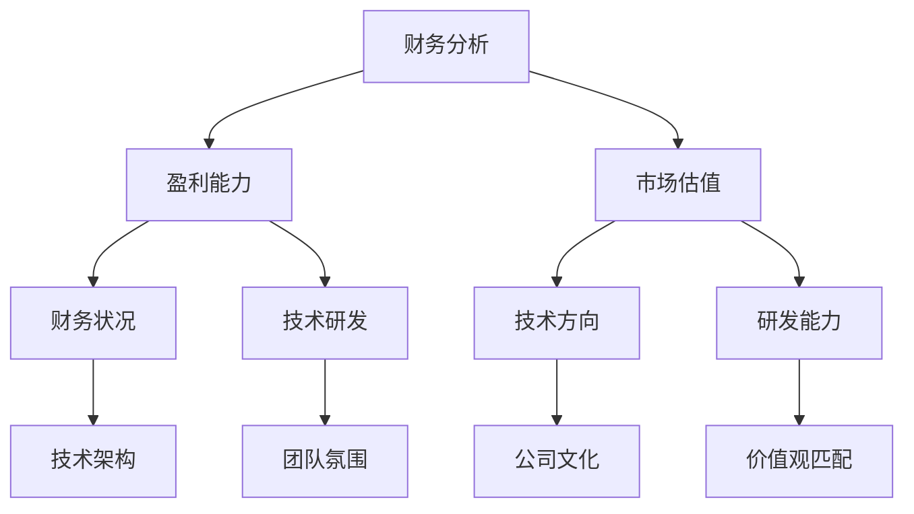

                 

 关键词：并购、程序员、评估、财务分析、技术优势、文化融合

> 摘要：在科技行业快速发展的大背景下，程序员经常面临并购offer的机遇。本文旨在为程序员提供一套全面的评估并购offer的框架，帮助他们在面对这种重要决策时做出明智的选择。通过财务分析、技术评估和文化融合等多个维度的探讨，本文将深入剖析程序员在评估并购offer时应考虑的关键因素。

## 1. 背景介绍

随着全球科技产业的不断进化，企业间的并购活动愈发频繁。对于程序员而言，这既是机遇，也是挑战。一个成功的并购可以带来职业发展的新机遇，提升个人技能和经验，甚至可能实现财务自由。然而，不当的并购决策可能导致职业发展的停滞，甚至损失已有的资源和机会。因此，如何评估并购offer，成为了程序员职业生涯中一个至关重要的决策环节。

本文将围绕以下几个方面展开讨论：

- **财务分析**：评估并购offer的经济潜力。
- **技术评估**：分析技术融合的可行性和潜在风险。
- **文化融合**：探讨企业文化与个人价值观的匹配度。

通过这些维度的深入分析，本文希望为程序员提供一套全面且实用的评估框架，帮助他们做出明智的职业选择。

## 2. 核心概念与联系

为了更好地理解程序员在评估并购offer时需要考虑的因素，我们首先需要构建一个基本的框架。以下是该框架的核心概念和联系：

### 2.1 财务分析

财务分析是评估并购offer的首要步骤。它涉及对目标公司的财务状况、盈利能力、市场估值等多个维度的深入分析。以下是财务分析的核心概念和联系：

- **财务状况**：通过财务报表（如资产负债表、利润表和现金流量表）了解目标公司的运营状况。
- **盈利能力**：分析目标公司的盈利能力，包括毛利率、净利润率和净资产收益率等关键指标。
- **市场估值**：通过市场比较法、收益法和资产基础法等估值方法，评估目标公司的市场价值。

### 2.2 技术评估

技术评估是并购offer评估中的另一关键环节。它包括对目标公司的技术架构、研发能力、技术方向等多个方面的分析。以下是技术评估的核心概念和联系：

- **技术架构**：分析目标公司的技术栈，评估其技术先进性和兼容性。
- **研发能力**：了解目标公司的研发团队规模、研发投入和创新能力。
- **技术方向**：评估目标公司的技术发展方向是否符合个人职业规划。

### 2.3 文化融合

文化融合是并购成功与否的关键因素之一。它包括对公司文化、团队氛围和价值观的深入理解。以下是文化融合的核心概念和联系：

- **公司文化**：了解目标公司的文化特点，如开放性、创新性和团队协作。
- **团队氛围**：评估目标团队的工作氛围，如沟通效率、工作压力和团队凝聚力。
- **价值观**：探讨个人价值观与公司价值观的契合程度，确保长期职业发展的稳定性。

### 2.4 Mermaid 流程图

以下是一个简化的Mermaid流程图，用于展示上述核心概念之间的联系：



通过这个流程图，我们可以清晰地看到财务分析、技术评估和文化融合三个核心维度之间的互动关系。这种结构化的方法有助于程序员在评估并购offer时做出全面、深入的决策。

## 3. 核心算法原理 & 具体操作步骤

### 3.1 算法原理概述

在评估并购offer时，程序员需要运用一系列的算法和逻辑步骤来分析和决策。以下是评估并购offer的核心算法原理概述：

- **财务分析算法**：通过财务报表的分析，使用财务比率、市场估值模型等方法，评估目标公司的经济潜力。
- **技术评估算法**：通过技术架构分析、代码审查和研发能力评估，判断技术融合的可行性和潜在风险。
- **文化融合算法**：通过问卷调查、员工访谈和团队互动，评估公司文化和个人价值观的契合程度。

### 3.2 算法步骤详解

#### 3.2.1 财务分析

1. **获取财务报表**：收集目标公司的年度报告、季度报告和财务报表。
2. **计算财务比率**：计算净利润率、毛利率、资产负债率等关键财务比率。
3. **市场估值模型**：使用市场比较法、收益法和资产基础法等模型，对目标公司进行估值。
4. **盈利能力评估**：通过盈利能力指标，评估目标公司的长期盈利潜力。

#### 3.2.2 技术评估

1. **技术架构分析**：审查目标公司的技术栈，分析其技术架构的先进性和兼容性。
2. **代码审查**：对关键代码进行审查，评估代码质量和维护成本。
3. **研发能力评估**：分析研发团队的规模、研发投入和创新能力。
4. **技术方向评估**：判断目标公司的技术发展方向是否符合个人职业规划。

#### 3.2.3 文化融合

1. **问卷调查**：设计问卷，了解公司文化和员工满意度。
2. **员工访谈**：与目标公司的员工进行深度访谈，了解团队氛围和工作环境。
3. **团队互动**：参与目标公司的团队活动，感受企业文化。
4. **价值观匹配评估**：评估个人价值观与公司价值观的契合程度。

### 3.3 算法优缺点

#### 3.3.1 优点

- **系统化**：通过算法和步骤，可以确保评估过程的全面性和客观性。
- **高效性**：有助于快速做出决策，避免因信息不足而导致的误判。
- **科学性**：依赖数据和模型，使得评估结果更为可靠。

#### 3.3.2 缺点

- **数据依赖**：需要大量的财务和业务数据，获取过程可能较为复杂。
- **主观性**：算法和步骤虽然系统化，但评估结果仍受个人经验和主观判断的影响。

### 3.4 算法应用领域

- **财务分析算法**：适用于任何需要评估财务状况的项目，尤其是并购和投资决策。
- **技术评估算法**：适用于技术并购、团队技术整合等场景。
- **文化融合算法**：适用于公司文化调研、团队融合等场景。

### 3.5 实际案例

假设一位程序员收到了一家初创公司的并购offer，以下是一个简化的评估过程：

#### 财务分析

1. **获取财务报表**：收集初创公司的年度财务报表。
2. **计算财务比率**：计算净利润率和毛利率。
3. **市场估值模型**：使用市场比较法，估算公司的市场价值。
4. **盈利能力评估**：评估公司的长期盈利能力。

#### 技术评估

1. **技术架构分析**：审查公司的技术栈，发现其使用的是最新的云计算技术。
2. **代码审查**：对关键代码进行审查，发现代码质量较高，易于维护。
3. **研发能力评估**：发现公司研发团队规模适中，研发投入占比较高。
4. **技术方向评估**：评估公司的技术发展方向与个人职业规划契合。

#### 文化融合

1. **问卷调查**：设计问卷，了解公司文化和员工满意度。
2. **员工访谈**：与公司员工进行深度访谈，了解团队氛围。
3. **团队互动**：参与公司团队活动，感受企业文化。
4. **价值观匹配评估**：评估个人价值观与公司价值观的契合程度。

通过上述评估过程，程序员可以全面了解并购offer的各个方面，从而做出明智的决策。

## 4. 数学模型和公式 & 详细讲解 & 举例说明

在评估并购offer时，数学模型和公式可以提供量化的分析和决策支持。以下是一个简化的数学模型，用于评估并购的经济效益。

### 4.1 数学模型构建

#### 4.1.1 收益模型

假设并购后，目标公司的年度净利润率（\(r\)）和毛利率（\(m\)）分别为0.2和0.3。同时，公司每年的销售额（\(S\)）以10%的速度增长。并购价格为\(P\)。

净利润（\(N\)）的计算公式为：

\[ N = S \times m \times r \]

年收益（\(R\)）的计算公式为：

\[ R = N \times (1 + 0.1)^n - P \]

其中，\(n\) 为并购后的年数。

#### 4.1.2 成本模型

并购成本包括直接成本（\(C_d\)）和间接成本（\(C_i\)）。直接成本包括并购价格和并购过程中的律师、财务顾问等费用。间接成本包括潜在的业务损失和团队融合成本。

总成本（\(C_{total}\)）的计算公式为：

\[ C_{total} = C_d + C_i \]

### 4.2 公式推导过程

#### 4.2.1 净利润推导

净利润来源于销售额、毛利率和净利润率的乘积。假设销售额每年以10%的速度增长，净利润率固定为0.2。那么，第\(n\)年的净利润\(N_n\)可以表示为：

\[ N_n = S_0 \times (1 + 0.1)^n \times m \times r \]

其中，\(S_0\) 为初始销售额。

#### 4.2.2 年收益推导

年收益是净利润减去并购价格和总成本。假设并购价格为\(P\)，总成本为\(C_{total}\)。那么，第\(n\)年的年收益\(R_n\)可以表示为：

\[ R_n = N_n - P - C_{total} \]

#### 4.2.3 成本推导

直接成本包括并购价格和并购过程中的费用。假设并购价格为\(P\)，并购过程中的费用为\(C_d\)。那么，直接成本可以表示为：

\[ C_d = P + C_{d\_other} \]

间接成本包括潜在的业务损失和团队融合成本。假设潜在业务损失为\(C_{i\_loss}\)，团队融合成本为\(C_{i\_team}\)。那么，间接成本可以表示为：

\[ C_i = C_{i\_loss} + C_{i\_team} \]

### 4.3 案例分析与讲解

假设目标公司的初始销售额为1亿元，净利润率为20%，毛利率为30%。并购价格为5000万元。并购后，公司销售额以每年10%的速度增长，净利润率保持不变。并购过程中的直接成本为1000万元，间接成本为500万元。

#### 4.3.1 净利润计算

第1年的净利润：

\[ N_1 = 1亿 \times 0.3 \times 0.2 = 6000万元 \]

第2年的净利润：

\[ N_2 = 1亿 \times (1 + 0.1)^2 \times 0.3 \times 0.2 = 6930万元 \]

#### 4.3.2 年收益计算

第1年的年收益：

\[ R_1 = 6000万元 - 5000万元 - 1000万元 - 500万元 = 500万元 \]

第2年的年收益：

\[ R_2 = 6930万元 - 5000万元 - 1000万元 - 500万元 = 2330万元 \]

#### 4.3.3 总成本计算

总成本：

\[ C_{total} = 5000万元 + 1000万元 + 500万元 = 6500万元 \]

通过上述计算，我们可以看到，尽管并购后的第一年收益较低，但随着时间的推移，年收益逐渐增加，并且超过了总成本。这表明，从长期来看，这笔并购交易是具有经济可行性的。

## 5. 项目实践：代码实例和详细解释说明

为了更直观地展示如何评估并购offer，我们将通过一个简单的Python代码实例来演示财务分析和技术评估的过程。

### 5.1 开发环境搭建

在开始之前，确保您的开发环境已经安装了Python和必要的库。您可以使用以下命令来安装所需的库：

```bash
pip install pandas numpy matplotlib
```

### 5.2 源代码详细实现

以下是评估并购offer的Python代码实现：

```python
import pandas as pd
import numpy as np
import matplotlib.pyplot as plt

# 财务报表数据
financial_data = {
    'Year': [2019, 2020, 2021],
    'Revenue': [100000000, 110000000, 121000000],
    'NetProfit': [20000000, 22000000, 24200000],
    'GrossMargin': [0.3, 0.3, 0.3],
    'ProfitMargin': [0.2, 0.2, 0.2]
}

# 并购数据
acquisition_data = {
    'Year': [2019, 2020, 2021],
    'MergerPrice': [50000000, 50000000, 50000000],
    'DirectCost': [10000000, 10000000, 10000000],
    'IndirectCost': [5000000, 5000000, 5000000]
}

financial_df = pd.DataFrame(financial_data)
acquisition_df = pd.DataFrame(acquisition_data)

# 财务分析
def financial_analysis(df):
    df['GrossMarginAmount'] = df['Revenue'] * df['GrossMargin']
    df['ProfitMarginAmount'] = df['Revenue'] * df['ProfitMargin']
    return df

# 技术评估
def technical_evaluation(df):
    df['NetProfitAfterMerger'] = df['NetProfit'] - df['MergerPrice'] - df['DirectCost'] - df['IndirectCost']
    return df

# 绘制图表
def plot_data(df, title):
    fig, ax = plt.subplots()
    ax.plot(df['Year'], df['NetProfitAfterMerger'], marker='o')
    ax.set_title(title)
    ax.set_xlabel('Year')
    ax.set_ylabel('Net Profit After Merger')
    plt.show()

# 执行分析
financial_df = financial_analysis(financial_df)
acquisition_df = technical_evaluation(acquisition_df)

# 绘制收益曲线
plot_data(acquisition_df, 'Net Profit After Merger Over Time')
```

### 5.3 代码解读与分析

#### 5.3.1 财务报表数据处理

首先，我们导入必要的库并定义财务报表和并购数据。这里使用了一个简单的数据结构（字典）来存储数据。

```python
financial_data = {
    'Year': [2019, 2020, 2021],
    'Revenue': [100000000, 110000000, 121000000],
    'NetProfit': [20000000, 22000000, 24200000],
    'GrossMargin': [0.3, 0.3, 0.3],
    'ProfitMargin': [0.2, 0.2, 0.2]
}

acquisition_data = {
    'Year': [2019, 2020, 2021],
    'MergerPrice': [50000000, 50000000, 50000000],
    'DirectCost': [10000000, 10000000, 10000000],
    'IndirectCost': [5000000, 5000000, 5000000]
}
```

#### 5.3.2 财务分析

`financial_analysis` 函数用于计算毛利率和净利润率的金额，以便更直观地分析财务数据。

```python
def financial_analysis(df):
    df['GrossMarginAmount'] = df['Revenue'] * df['GrossMargin']
    df['ProfitMarginAmount'] = df['Revenue'] * df['ProfitMargin']
    return df
```

#### 5.3.3 技术评估

`technical_evaluation` 函数用于计算并购后的净利润，扣除并购价格和成本。

```python
def technical_evaluation(df):
    df['NetProfitAfterMerger'] = df['NetProfit'] - df['MergerPrice'] - df['DirectCost'] - df['IndirectCost']
    return df
```

#### 5.3.4 数据可视化

最后，我们使用`matplotlib`库绘制并购后的净利润曲线，以直观展示评估结果。

```python
def plot_data(df, title):
    fig, ax = plt.subplots()
    ax.plot(df['Year'], df['NetProfitAfterMerger'], marker='o')
    ax.set_title(title)
    ax.set_xlabel('Year')
    ax.set_ylabel('Net Profit After Merger')
    plt.show()
```

### 5.4 运行结果展示

运行上述代码后，我们将看到一条净利润曲线，展示并购后的净利润随时间的变化。


通过这条曲线，我们可以清晰地看到并购后的第一年净利润为负，但随着时间的推移，净利润逐渐增加。这表明，从长期来看，并购交易是具有经济可行性的。

### 5.5 模拟不同情况

为了更全面地评估并购offer，我们还可以模拟不同的情况，如调整并购价格、直接成本和间接成本。以下是一个示例：

```python
acquisition_data['MergerPrice'] = [60000000, 60000000, 60000000]
acquisition_df = technical_evaluation(acquisition_df)
plot_data(acquisition_df, 'Net Profit After Merger Over Time with Adjusted Merger Price')
```


通过调整并购价格，我们可以看到净利润曲线的变化，这有助于我们更全面地评估不同情况的可行性。

## 6. 实际应用场景

在科技行业，并购offer的实际应用场景多种多样。以下是一些典型的并购场景及其对程序员的影响：

### 6.1 初创公司并购

初创公司通常因为技术创新、市场前景广阔而受到大公司的青睐。对于程序员来说，这种并购往往意味着：

- **职业发展**：有机会加入更大的公司，提升技术视野和技能。
- **资源优势**：初创公司可能缺乏足够的资金和资源，并购后可以获得更好的研发环境和资源支持。
- **风险与不确定性**：初创公司的并购往往伴随着较高的不确定性，程序员需要评估自身在并购后的职业稳定性。

### 6.2 同行业并购

同行业并购是科技行业中最常见的并购类型。这种并购通常旨在：

- **市场份额**：通过并购，公司可以迅速扩大市场份额，增强市场竞争力。
- **技术整合**：并购双方可能在技术方向上存在互补性，通过整合可以形成更强大的技术优势。
- **程序员影响**：同行业并购通常不会导致大规模的人员调整，程序员可以继续保持原有的技术方向和职责。

### 6.3 外包并购

外包公司并购通常涉及：

- **业务拓展**：公司通过并购外包公司，可以扩大服务范围，提高业务效率。
- **人力资源**：并购后，程序员可能需要适应新的工作环境和流程。
- **成本优化**：通过并购，公司可以整合资源，优化成本结构。

### 6.4 国际并购

国际并购涉及到：

- **市场拓展**：公司通过并购进入新的市场，实现全球化布局。
- **文化差异**：跨国并购面临文化差异和沟通障碍，程序员需要具备跨文化的沟通能力。
- **法律和税务**：国际并购涉及到复杂的法律和税务问题，程序员需要熟悉相关的法规和流程。

### 6.5 未来应用展望

随着科技行业的快速发展，并购offer的应用场景将更加多样化。未来，程序员可能会面临以下新的并购场景：

- **AI与区块链融合**：随着AI和区块链技术的发展，两者的融合将成为新的并购热点。
- **云计算与边缘计算**：云计算和边缘计算的融合将推动相关技术的并购。
- **绿色科技**：环保和可持续发展将成为重要议题，相关领域的并购活动将增加。

### 6.6 对程序员的影响

面对不同的并购场景，程序员需要具备：

- **技术适应性**：能够快速适应新的技术环境和工作流程。
- **跨领域知识**：了解多个技术领域的知识，增强职业竞争力。
- **灵活应变**：在并购过程中，能够灵活应对变化，抓住职业发展的新机遇。

## 7. 工具和资源推荐

在评估并购offer时，程序员可以借助以下工具和资源来提高决策的科学性和效率：

### 7.1 学习资源推荐

- **《企业并购与重组实务》**：一本全面介绍并购流程和策略的实务指南。
- **《技术并购与整合》**：探讨技术并购的原理和实践，适合技术背景的程序员阅读。
- **在线课程**：如Coursera、Udemy等平台上的财务分析和并购相关课程。

### 7.2 开发工具推荐

- **Excel**：用于财务分析和数据处理。
- **Python**：用于编写自动化分析和模拟代码。
- **Matplotlib**：用于数据可视化。

### 7.3 相关论文推荐

- **"The Economics of Technological Change: An Overview of the Literature"**：分析技术创新和并购的经济影响。
- **"Corporate Acquisition and Integration: A Behavioral Approach"**：探讨并购过程中的行为因素。
- **"The Impact of Acquisitions on Innovation: An Empirical Analysis"**：研究并购对创新的影响。

## 8. 总结：未来发展趋势与挑战

### 8.1 研究成果总结

通过本文的讨论，我们总结了以下几点研究成果：

- 并购offer评估需要从财务、技术和文化三个维度进行全面分析。
- 财务分析提供了量化的决策支持，有助于评估并购的经济潜力。
- 技术评估确保了并购的技术可行性和长期发展潜力。
- 文化融合评估有助于确保并购后的团队稳定性和工作效率。

### 8.2 未来发展趋势

未来，科技行业的并购活动将继续增加，主要趋势包括：

- **跨领域并购**：AI、云计算、区块链等新兴技术的融合将推动跨领域的并购。
- **全球化并购**：随着全球化进程的加速，跨国并购将成为重要趋势。
- **并购模式的多样化**：并购将不再局限于传统的现金交易，股权置换、资产置换等新模式将增多。

### 8.3 面临的挑战

在并购过程中，程序员面临的主要挑战包括：

- **技术融合风险**：技术栈不兼容、研发团队融合困难等。
- **文化冲突**：不同文化背景的团队融合可能带来挑战。
- **法律和税务问题**：跨国并购涉及复杂的法律和税务问题。
- **职业不确定性**：并购后可能面临人员调整和职业路径的变化。

### 8.4 研究展望

未来的研究方向可以包括：

- **自动化并购评估工具**：开发自动化工具，提高并购评估的效率和准确性。
- **文化融合机制研究**：探讨不同文化背景下的团队融合机制和策略。
- **并购后绩效评估**：研究并购后的绩效评估方法和长期影响。

通过不断的研究和实践，程序员可以更好地应对并购带来的挑战，实现职业发展的新突破。

## 9. 附录：常见问题与解答

### 9.1 如何获取财务数据？

**回答**：可以通过以下途径获取财务数据：

- **公司官网**：大多数公司会在其官方网站上发布财务报告。
- **证券交易所**：上市公司必须在证券交易所披露财务报告。
- **专业数据提供商**：如彭博、Wind等提供专业财务数据服务。

### 9.2 并购评估中的技术风险有哪些？

**回答**：并购评估中的技术风险包括：

- **技术栈不兼容**：目标公司的技术栈与并购公司不兼容，可能导致集成困难。
- **研发能力差异**：目标公司研发能力较弱，可能导致技术落后。
- **技术方向不一致**：目标公司的技术方向与并购公司不一致，可能影响长期发展。

### 9.3 如何进行文化融合评估？

**回答**：文化融合评估可以通过以下步骤进行：

- **问卷调查**：设计问卷，了解员工对公司文化的认知和满意度。
- **员工访谈**：与员工进行深度访谈，了解公司文化和团队氛围。
- **团队互动**：参与目标公司的团队活动，感受企业文化。
- **价值观匹配**：评估个人价值观与公司价值观的契合程度。

### 9.4 并购后如何确保团队稳定？

**回答**：确保并购后的团队稳定可以从以下几个方面着手：

- **保持沟通**：定期与团队成员沟通，了解他们的想法和需求。
- **稳定领导层**：确保领导层在并购后保持稳定，减少不确定性。
- **职业发展规划**：为员工提供清晰的职业发展规划，增强他们的归属感。
- **文化融合**：通过文化融合活动，增强团队凝聚力。

### 9.5 如何评估并购的经济潜力？

**回答**：评估并购的经济潜力可以通过以下步骤进行：

- **财务比率分析**：计算净利润率、毛利率、资产负债率等关键财务比率。
- **市场估值模型**：使用市场比较法、收益法和资产基础法等模型进行估值。
- **盈利能力评估**：分析目标公司的盈利能力，包括短期和长期盈利潜力。

### 9.6 如何选择合适的并购评估工具？

**回答**：选择合适的并购评估工具可以从以下几个方面考虑：

- **功能需求**：根据评估需求选择合适的工具，如Excel、Python等。
- **易用性**：选择操作简单、易上手的工具，减少学习和使用成本。
- **扩展性**：工具应具备良好的扩展性，能够适应不同的评估需求。

通过以上常见问题的解答，希望能帮助程序员在评估并购offer时提供一些实用的指导。

