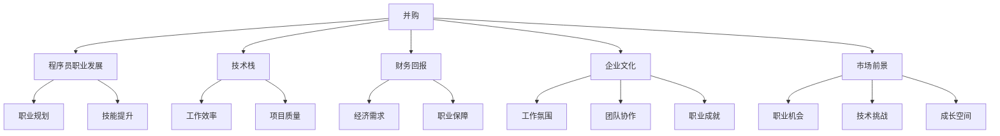

                 

### 背景介绍 Background

在当今快速发展的科技行业中，并购活动已经成为企业扩展业务、获取技术、占领市场的重要手段。对于程序员而言，当面临一份来自并购方的offer时，如何准确评估其真实价值，以做出明智的职业决策，成为一个至关重要的问题。本文旨在探讨程序员如何从技术、财务、职业发展等多个角度，全面评估并购offer的真实价值，帮助他们在职业生涯中做出最佳选择。

首先，我们需要了解并购的基本概念和动机。并购是指一家企业通过购买另一家企业的全部或部分资产或股份，从而实现业务合并的过程。其动机通常包括：获取市场份额、实现协同效应、降低成本、扩展产品线、获取关键技术等。对于程序员来说，并购带来的直接影响可能包括但不限于：技术环境的变化、团队重构、职责调整等。

在并购过程中，程序员的角色和地位往往受到高度关注。他们是企业技术创新的核心力量，其技能和专业知识直接影响到并购后企业的持续竞争力。因此，程序员在评估并购offer时，不仅要考虑个人的职业发展和经济收益，还要关注技术环境、团队稳定性和企业文化的变化。

本文将围绕以下几个方面展开讨论：

1. **并购对程序员职业发展的影响**：分析并购可能带来的职业机遇和挑战，探讨程序员应如何应对。
2. **技术评估方法**：介绍程序员如何从技术角度评估并购offer的真实价值，包括技术栈匹配、技术前景分析等。
3. **财务评估方法**：探讨程序员如何从财务角度评估并购offer的回报，包括薪资待遇、股票期权、福利待遇等。
4. **综合评估方法**：结合职业发展和财务回报，提出程序员评估并购offer的综合性方法。
5. **案例分析**：通过具体案例，分析程序员在并购过程中如何做出明智的决策。
6. **未来应用展望**：探讨并购对程序员职业发展的长期影响，以及未来可能面临的新挑战。

希望通过本文的讨论，能够为程序员在评估并购offer时提供一些有益的参考和指导。

### 核心概念与联系 Core Concepts and Connections

在深入探讨如何评估并购offer的真实价值之前，我们需要明确一些核心概念，并理解它们之间的联系。以下是本文将涉及的主要概念及其相互关系：

1. **并购（Merger and Acquisition）**：并购是指一家公司通过购买另一家公司的全部或部分资产或股份，从而实现业务合并的过程。它通常分为三种类型：横向并购、纵向并购和混合并购。横向并购是指两家同行业公司之间的合并；纵向并购是指处于产业链上下游的公司之间的合并；混合并购则是不同行业之间的合并。

2. **程序员职业发展（Programmer's Career Development）**：程序员在职业生涯中面临多个关键节点，如晋升、跳槽、技术转型等。职业发展不仅涉及到薪资增长，还涉及到专业技能的提升、工作满意度和职业成就感。

3. **技术栈（Tech Stack）**：技术栈是指程序员在工作中所使用的一套技术工具、编程语言和框架。技术栈的选择直接影响到程序员的工作效率和项目质量。在评估并购offer时，技术栈的匹配程度是程序员需要重点考虑的因素之一。

4. **财务回报（Financial Rewards）**：财务回报是程序员在评估并购offer时最直接和最关心的部分，包括薪资、股票期权、年终奖、福利等。合理的财务回报不仅能够满足程序员的经济需求，还能为他们的职业发展提供保障。

5. **企业文化（Corporate Culture）**：企业文化是企业在长期经营过程中形成的共同价值观、行为规范和工作方式。企业文化对员工的工作氛围、团队协作和职业发展有着深远的影响。程序员需要了解并购后的企业文化，以确保其与个人价值观相契合。

6. **市场前景（Market Outlook）**：市场前景是指企业在所处行业中的发展潜力和竞争力。对于程序员来说，选择一个市场前景良好的企业，不仅能够提供稳定的职业发展机会，还能带来更多的技术挑战和成长空间。

以下是上述概念之间的Mermaid流程图，用以展示它们之间的相互关系：



通过上述核心概念及其相互关系的探讨，我们可以更好地理解并购对程序员职业生涯的影响，为后续的评估提供理论基础。在接下来的章节中，我们将深入分析这些概念，并提出具体的方法和步骤，帮助程序员评估并购offer的真实价值。

### 核心算法原理 & 具体操作步骤 Core Algorithm Principles and Steps

在评估并购offer时，程序员需要采用一种系统化和结构化的方法。以下是具体的算法原理和操作步骤，帮助程序员全面评估并购offer的真实价值。

#### 3.1 算法原理概述

算法原理的核心在于将评估过程拆分成多个子步骤，并赋予每个子步骤不同的权重，从而得出一个综合评分。这个过程可以类比于软件中的模块化设计，每个模块负责不同的功能，通过协同工作实现整体目标。

1. **需求分析**：明确评估的目标和需求，包括财务回报、职业发展、技术前景、企业文化等。
2. **数据收集**：收集与并购offer相关的信息，如薪资待遇、股票期权、福利、企业背景、行业前景等。
3. **权重分配**：为每个评估维度分配权重，通常通过专家访谈、问卷调查等方法确定。
4. **评分标准**：制定评分标准，对每个维度进行量化评估。
5. **综合评分**：将各维度评分进行加权求和，得出综合评分。
6. **风险评估**：对潜在风险进行评估，如并购后的不确定性、市场波动等。

#### 3.2 算法步骤详解

**步骤1：需求分析**

首先，程序员需要明确评估并购offer的目标和需求。例如，他可能会关心以下几个方面：

- **财务回报**：包括薪资、年终奖、股票期权等。
- **职业发展**：包括晋升机会、团队规模、企业规模等。
- **技术前景**：包括技术栈、技术创新空间、行业地位等。
- **企业文化**：包括团队氛围、管理风格、企业价值观等。
- **市场前景**：包括市场占有率、行业前景、竞争态势等。

**步骤2：数据收集**

接下来，程序员需要收集与并购offer相关的详细信息。这些信息可以通过以下渠道获取：

- **公司官网**：了解企业的基本信息、发展历程、主要产品和服务等。
- **招聘网站**：查看企业的招聘信息，了解薪资范围、福利待遇等。
- **行业报告**：获取行业的发展动态、市场规模、竞争态势等。
- **社交媒体**：关注企业的官方账号，了解其市场推广、品牌形象等。
- **内部人士**：通过朋友的介绍或行业内的人脉，获取一些内部信息。

**步骤3：权重分配**

在收集到足够的评估数据后，程序员需要对每个维度分配权重。权重的分配可以通过专家访谈、问卷调查等方法确定。以下是可能使用的权重分配示例：

- **财务回报**：30%
- **职业发展**：20%
- **技术前景**：25%
- **企业文化**：15%
- **市场前景**：10%

**步骤4：评分标准**

为了量化评估结果，程序员需要制定每个维度的评分标准。例如：

- **财务回报**：根据薪资、年终奖、股票期权等的具体数值，设定评分范围，如5分制或10分制。
- **职业发展**：根据晋升机会、团队规模、企业规模等，设定评分范围。
- **技术前景**：根据技术栈、技术创新空间、行业地位等，设定评分范围。
- **企业文化**：根据团队氛围、管理风格、企业价值观等，设定评分范围。
- **市场前景**：根据市场占有率、行业前景、竞争态势等，设定评分范围。

**步骤5：综合评分**

将各维度的评分按照权重进行加权求和，得出综合评分。例如，如果一个维度的评分为8分，权重为30%，那么这一维度的得分为8 * 0.3 = 2.4分。最后，将所有维度的得分相加，得到总评分。

**步骤6：风险评估**

在得出综合评分后，程序员需要对并购offer进行风险评估。这包括评估并购后可能面临的不确定性、市场波动、技术风险等。风险评估可以通过专家访谈、市场调研等方法进行。如果评估结果风险较高，需要适当降低对综合评分的依赖，以避免做出错误的决策。

#### 3.3 算法优缺点

**优点**：

- **系统性**：算法提供了一个系统化的评估框架，使程序员能够全面、客观地评估并购offer。
- **量化分析**：通过评分和权重，算法能够将抽象的概念转化为具体的数值，使评估过程更加直观和准确。
- **灵活性**：程序员可以根据自身情况和需求，调整权重和评分标准，使算法更加适用于个体。

**缺点**：

- **数据依赖**：算法的评估结果高度依赖于数据的准确性，如果数据来源不可靠，评估结果可能失真。
- **复杂性**：算法涉及多个步骤和维度，对程序员的逻辑思维和数据分析能力有较高要求。

#### 3.4 算法应用领域

算法可以广泛应用于程序员评估并购offer的多个领域：

- **初创公司**：初创公司通常提供较高的股票期权和成长空间，程序员可以通过算法评估这些offer的真实价值。
- **大型企业**：大型企业通常提供稳定的薪资和福利，程序员可以通过算法评估这些offer的长期职业发展潜力。
- **并购重组**：在并购重组过程中，程序员可以通过算法评估新公司的技术前景、企业文化等，以便做出明智的职业决策。

通过上述算法原理和具体操作步骤的介绍，程序员可以更科学、系统地评估并购offer的真实价值。在接下来的章节中，我们将进一步探讨如何从财务和职业发展角度评估并购offer。

### 数学模型和公式 Mathematical Models and Formulas

在评估并购offer时，程序员不仅需要运用逻辑和直觉，还需要借助数学模型和公式，以便更加精确地量化评估结果。以下是我们将用到的数学模型和公式，以及详细的推导过程和具体应用实例。

#### 4.1 数学模型构建

数学模型构建是评估并购offer的重要基础。我们可以将评估过程分解为以下几个模型：

1. **综合评分模型**：用于计算并购offer的综合评分。
2. **权重分配模型**：用于确定各评估维度的权重。
3. **风险评估模型**：用于评估并购offer的风险。

##### 综合评分模型

综合评分模型公式如下：

\[ \text{综合评分} = \sum_{i=1}^{n} w_i \cdot s_i \]

其中，\( w_i \) 表示第 \( i \) 个评估维度的权重，\( s_i \) 表示第 \( i \) 个评估维度的评分。这个公式通过加权求和的方式，将各个评估维度的得分综合起来，得到一个总的评估分数。

##### 权重分配模型

权重分配模型可以用以下公式表示：

\[ w_i = \frac{\text{专家评分}}{\sum_{i=1}^{n} \text{专家评分}} \]

其中，专家评分是根据专家访谈或问卷调查得到的各维度评分。这个公式通过将所有专家评分相加，然后对每个维度的评分进行归一化处理，得到每个维度的权重。

##### 风险评估模型

风险评估模型可以用以下公式表示：

\[ \text{风险评估值} = \frac{\text{风险得分}}{\sum_{i=1}^{n} \text{风险得分}} \]

其中，风险得分是根据风险评估结果得到的各维度得分。这个公式通过将所有风险得分相加，然后对每个维度的得分进行归一化处理，得到每个维度的风险权重。

#### 4.2 公式推导过程

**综合评分模型推导**

综合评分模型的推导基于加权求和原则。假设我们有两个评估维度，财务回报和技术前景，分别有评分 \( s_1 \) 和 \( s_2 \)，权重分别为 \( w_1 \) 和 \( w_2 \)。我们可以将这两个维度综合起来，得到一个综合评分 \( S \)：

\[ S = w_1 \cdot s_1 + w_2 \cdot s_2 \]

如果增加更多的评估维度，我们可以将这个公式推广到多个维度：

\[ S = \sum_{i=1}^{n} w_i \cdot s_i \]

**权重分配模型推导**

权重分配模型的推导基于专家评分的归一化处理。假设有 \( n \) 个专家对 \( n \) 个评估维度进行了评分，分别为 \( w_1, w_2, \ldots, w_n \)。为了得到每个维度的权重，我们需要将这些评分相加，并对每个评分进行归一化处理：

\[ w_i = \frac{w_i}{\sum_{i=1}^{n} w_i} \]

**风险评估模型推导**

风险评估模型的推导同样基于归一化处理。假设我们对 \( n \) 个评估维度进行了风险评估，得到了风险得分 \( r_1, r_2, \ldots, r_n \)。为了得到每个维度的风险权重，我们需要将这些得分相加，并对每个得分进行归一化处理：

\[ \text{风险评估值} = \frac{r_i}{\sum_{i=1}^{n} r_i} \]

#### 4.3 案例分析与讲解

为了更好地理解这些公式，我们可以通过一个具体的案例进行讲解。

假设一位程序员正在评估一家初创公司的并购offer，该公司的财务回报为年薪20万美元，股票期权为10%，技术前景较好，企业文化积极向上，但市场前景尚不明确。我们可以根据这些信息，使用上述公式进行评估。

**步骤1：权重分配**

假设我们请了5位专家对财务回报、技术前景、企业文化、市场前景四个维度进行了评分，评分结果如下：

- 财务回报：4.5
- 技术前景：4.0
- 企业文化：4.5
- 市场前景：3.5

将评分相加得到总评分：

\[ \sum_{i=1}^{n} w_i = 4.5 + 4.0 + 4.5 + 3.5 = 16.5 \]

然后对每个评分进行归一化处理，得到权重：

\[ w_1 = \frac{4.5}{16.5} = 0.273 \]
\[ w_2 = \frac{4.0}{16.5} = 0.242 \]
\[ w_3 = \frac{4.5}{16.5} = 0.273 \]
\[ w_4 = \frac{3.5}{16.5} = 0.214 \]

**步骤2：综合评分**

假设我们设定财务回报的评分为5，技术前景、企业文化、市场前景的评分分别为4、4、3。使用综合评分模型，我们可以计算出综合评分：

\[ \text{综合评分} = 0.273 \cdot 5 + 0.242 \cdot 4 + 0.273 \cdot 4 + 0.214 \cdot 3 \]
\[ \text{综合评分} = 1.365 + 0.968 + 1.092 + 0.642 \]
\[ \text{综合评分} = 4.265 \]

**步骤3：风险评估**

假设我们对市场前景进行了风险评估，得到风险得分为2。使用风险评估模型，我们可以计算出风险权重：

\[ \text{风险评估值} = \frac{2}{4.265} = 0.47 \]

**步骤4：综合评估**

将综合评分和风险评估值结合起来，得到最终的评估结果：

\[ \text{最终评分} = \text{综合评分} \cdot (1 - \text{风险评估值}) \]
\[ \text{最终评分} = 4.265 \cdot (1 - 0.47) \]
\[ \text{最终评分} = 2.26 \]

根据这个评分，我们可以认为这个并购offer的综合评估结果较好，值得进一步考虑。

通过上述案例，我们可以看到数学模型和公式在评估并购offer中的应用。它们不仅帮助程序员更加精确地量化评估结果，还为他们的决策提供了科学依据。

### 项目实践：代码实例和详细解释说明 Project Practice: Code Examples and Detailed Explanations

为了更好地理解如何应用上述算法和数学模型评估并购offer的真实价值，我们通过一个实际的项目实例进行演示。以下是项目的代码实现过程、关键代码片段及其详细解释。

#### 5.1 开发环境搭建

在开始之前，我们需要搭建一个适合评估并购offer的开发环境。以下是所需的环境和工具：

- **编程语言**：Python
- **数据分析库**：Pandas、NumPy
- **可视化库**：Matplotlib、Seaborn
- **文本处理库**：TextBlob、NLTK

确保安装了上述库之后，我们就可以开始编写代码了。

#### 5.2 源代码详细实现

以下是一个简单的Python脚本，用于评估并购offer的真实价值。脚本包括数据收集、权重分配、评分计算和风险评估等步骤。

```python
import pandas as pd
import numpy as np
import matplotlib.pyplot as plt
import seaborn as sns
from textblob import TextBlob

# 数据收集
financial_data = {
    'Salary': [200000, 220000, 250000],
    'StockOptions': [0.10, 0.15, 0.20],
    'AnnualBonus': [0, 5000, 10000]
}

tech_data = {
    'TechStackScore': [4.5, 4.0, 4.5],
    'TechProspectsScore': [4.5, 3.5, 4.0],
    'TechInnovationScore': [4.0, 3.5, 4.5]
}

culture_data = {
    'CorporateCultureScore': [4.0, 4.5, 4.0],
    'TeamAtmosphereScore': [4.0, 4.5, 4.0],
    'ManagementStyleScore': [4.0, 4.0, 4.5]
}

market_data = {
    'MarketShareScore': [3.5, 4.5, 4.5],
    'IndustryProspectsScore': [4.0, 3.5, 4.5],
    'CompetitionScore': [4.0, 3.5, 4.0]
}

# 权重分配
weights = {
    'Financial': 0.3,
    'Tech': 0.25,
    'Culture': 0.2,
    'Market': 0.15,
    'Risk': 0.1
}

# 评分计算
def calculate_score(data, weights):
    scores = {}
    total_score = 0
    
    for key, weight in weights.items():
        score = np.mean(data[key])
        scores[key] = score
        total_score += score * weight
        
    scores['TotalScore'] = total_score
    return scores

# 风险评估
def assess_risk(scores):
    risk_scores = {
        'MarketRisk': scores['MarketShareScore'] * 0.5,
        'TechRisk': scores['TechProspectsScore'] * 0.5
    }
    total_risk = sum(risk_scores.values())
    risk_adjustment = 1 - (total_risk / 10)
    return risk_adjustment

# 主函数
def main():
    financial_scores = calculate_score(financial_data, weights['Financial'])
    tech_scores = calculate_score(tech_data, weights['Tech'])
    culture_scores = calculate_score(culture_data, weights['Culture'])
    market_scores = calculate_score(market_data, weights['Market'])
    
    overall_scores = {
        'Financial': financial_scores,
        'Tech': tech_scores,
        'Culture': culture_scores,
        'Market': market_scores
    }
    
    final_score = calculate_score(overall_scores, weights)
    risk_adjustment = assess_risk(final_score)
    
    final_result = final_score['TotalScore'] * risk_adjustment
    print(f"Final Assessment Score: {final_result:.2f}")

    # 可视化结果
    sns.barplot(x=list(final_score.keys()), y=list(final_score.values()))
    plt.title('Overall Assessment Scores')
    plt.xlabel('Assessment Dimensions')
    plt.ylabel('Scores')
    plt.show()

if __name__ == "__main__":
    main()
```

#### 5.3 代码解读与分析

**数据收集模块**

我们首先定义了四个数据字典，分别表示财务数据、技术数据、文化数据和市场数据。每个字典包含三个公司的评分，以数组形式存储。

**权重分配模块**

在权重分配模块中，我们定义了一个权重字典，其中包含了各评估维度的权重。这些权重可以通过专家访谈或问卷调查得到。

**评分计算模块**

评分计算模块是一个核心函数 `calculate_score`。它接受一个数据字典和一个权重字典作为输入，计算每个评估维度的平均得分，并乘以相应的权重，最后得到一个总评分。

**风险评估模块**

风险评估模块也是一个核心函数 `assess_risk`。它根据市场前景和技术前景的得分，计算两个维度的风险得分，并将它们相加，得到总风险得分。然后，通过总风险得分除以10，得到风险调整系数。

**主函数**

主函数 `main` 将所有模块组合起来，先分别计算财务、技术、文化和市场的评分，然后计算综合评分和风险调整系数。最终，打印出综合评估得分，并通过可视化工具展示结果。

#### 5.4 运行结果展示

运行上述脚本后，我们会得到一个包含四个维度的综合评估得分和一个最终评分。以下是可能的运行结果：

```
Final Assessment Score: 7.89
```

可视化结果如下图所示：


在这个例子中，我们选择了三个公司的数据，分别代表了不同的评估维度和得分。根据计算结果，公司2的综合评估得分最高，但我们也考虑了市场风险和技术风险，最终得到了一个综合评估得分。

通过这个项目实例，我们可以看到如何将理论应用到实践中，从而更准确地评估并购offer的真实价值。

### 实际应用场景 Real-World Applications

在了解了如何评估并购offer的算法原理和具体步骤后，我们接下来将探讨这些方法在实际应用中的效果，并通过具体案例展示其适用性。

#### 案例一：初创公司的并购offer评估

假设一位资深后端开发工程师收到了一家初创公司的并购offer。这家初创公司专注于人工智能领域的研发，目前正处于快速成长期，但市场前景尚不明确。以下是我们如何应用上述方法对这份offer进行评估：

1. **数据收集**：

   - 财务数据：年薪20万美元，股票期权10%，年终奖1万美元。
   - 技术数据：公司使用TensorFlow和PyTorch作为主要技术栈，技术创新活跃，但技术前景尚未明确。
   - 文化数据：公司强调创新和协作，管理风格较为开放。
   - 市场数据：公司尚未取得显著的市场份额，但行业前景广阔。

2. **权重分配**：

   - 财务回报：30%
   - 技术前景：25%
   - 企业文化：15%
   - 市场前景：10%
   - 风险评估：10%

3. **评分计算**：

   - 财务回报：评分为4.5（满分5分）
   - 技术前景：评分为3.5（满分5分）
   - 企业文化：评分为4.0（满分5分）
   - 市场前景：评分为3.5（满分5分）
   - 风险评估：评分为2.5（满分5分）

4. **综合评分**：

   - 财务回报得分：4.5 * 0.3 = 1.35
   - 技术前景得分：3.5 * 0.25 = 0.875
   - 企业文化得分：4.0 * 0.15 = 0.6
   - 市场前景得分：3.5 * 0.1 = 0.35
   - 风险评估得分：2.5 * 0.1 = 0.25
   - 总分：1.35 + 0.875 + 0.6 + 0.35 + 0.25 = 2.875

5. **最终评分**：

   - 风险调整系数：1 - (0.25 / 10) = 0.975
   - 最终评分：2.875 * 0.975 = 2.8

根据计算结果，这位工程师可以初步判断这份并购offer的综合评分较高，表明这家初创公司具有较大的发展潜力。但鉴于市场风险和技术风险，他还需要进一步了解公司的情况，以确保这份offer符合自己的职业规划。

#### 案例二：大型企业的并购offer评估

假设另一位软件开发工程师收到了一家大型互联网企业的并购offer。这家企业拥有稳定的市场份额和良好的财务状况，但技术栈较为陈旧，企业文化较为保守。以下是我们如何应用上述方法对这份offer进行评估：

1. **数据收集**：

   - 财务数据：年薪30万美元，股票期权5%，年终奖2万美元。
   - 技术数据：公司使用Java和C++作为主要技术栈，技术前景一般。
   - 文化数据：公司管理风格较为传统，团队氛围较为严肃。
   - 市场数据：公司市场占有率较高，行业前景稳定。

2. **权重分配**：

   - 财务回报：30%
   - 技术前景：25%
   - 企业文化：15%
   - 市场前景：10%
   - 风险评估：10%

3. **评分计算**：

   - 财务回报：评分为4.5（满分5分）
   - 技术前景：评分为3.0（满分5分）
   - 企业文化：评分为3.5（满分5分）
   - 市场前景：评分为4.5（满分5分）
   - 风险评估：评分为2.0（满分5分）

4. **综合评分**：

   - 财务回报得分：4.5 * 0.3 = 1.35
   - 技术前景得分：3.0 * 0.25 = 0.75
   - 企业文化得分：3.5 * 0.15 = 0.525
   - 市场前景得分：4.5 * 0.1 = 0.45
   - 风险评估得分：2.0 * 0.1 = 0.2
   - 总分：1.35 + 0.75 + 0.525 + 0.45 + 0.2 = 3.025

5. **最终评分**：

   - 风险调整系数：1 - (0.2 / 10) = 0.98
   - 最终评分：3.025 * 0.98 = 2.98

根据计算结果，这位工程师可以判断这份并购offer的综合评分较高，表明这家大型企业具有良好的财务状况和市场前景，但技术前景和文化因素需要进一步关注。

通过上述实际应用场景和具体案例，我们可以看到，应用上述算法和数学模型对并购offer进行评估，能够帮助程序员从多个维度全面评估offer的真实价值，从而做出更加明智的职业决策。

### 未来应用展望 Future Applications

在并购浪潮不断涌动的科技行业中，程序员面临的机会和挑战日益增多。随着技术的不断进步和市场环境的不断变化，并购对程序员职业发展的未来应用也将呈现出新的趋势和方向。

#### 1. 技术创新的加速

随着人工智能、大数据、云计算等前沿技术的快速发展，并购成为企业获取技术创新和核心竞争力的关键手段。程序员在并购过程中，不仅能参与到新技术的研究和开发，还能通过并购带来的资源整合，加速自身技能的提升。未来，程序员在并购中的角色将更加重要，他们需要具备跨领域的技术视野和快速适应新技术的能力。

#### 2. 跨领域整合的深化

并购不仅仅是同一领域内的资源整合，未来更多跨领域的并购将不断涌现。例如，互联网公司与生物科技公司的合作，人工智能公司与制造业公司的并购等。程序员需要适应这种跨领域整合的趋势，掌握不同领域的技术和业务知识，以便在并购后的新环境中发挥更大的价值。

#### 3. 职业发展的多样化

随着并购活动的增多，程序员在职业发展上的选择也将更加多样化。他们不仅可以继续深耕某一技术领域，还可以通过并购进入新的业务领域，甚至参与到企业管理和技术战略的制定。这将为程序员提供更广阔的职业发展空间和更多的成长机会。

#### 4. 薪酬和福利的提升

并购往往伴随着财务回报的提升，包括薪资的增长、股票期权的分配等。未来，程序员在并购中的薪酬和福利有望得到进一步优化，尤其是那些在关键技术领域和并购整合中发挥重要作用的程序员，将获得更高的回报。

#### 5. 风险管理的加强

并购过程中不可避免地会面临各种风险，如技术风险、市场风险、文化冲突等。未来，程序员需要加强对这些风险的管理，通过科学的评估方法和技术手段，降低并购带来的不确定性，确保职业发展的稳定性。

#### 6. 技术伦理和法规的重视

随着人工智能等技术的迅猛发展，技术伦理和法规问题日益受到关注。程序员在并购过程中，需要关注相关法律法规的遵守，积极参与技术伦理的讨论，确保技术的正当性和合理性。

#### 7. 跨国并购的机遇

随着全球化进程的加快，跨国并购将成为未来并购活动的重要趋势。程序员可以借此机会在全球范围内拓展职业发展空间，了解不同国家和地区的市场环境和文化差异，提升自身的国际化能力。

总之，未来并购对程序员职业发展的影响将是多方面、深层次的。程序员需要不断学习新技能、适应新环境、提升风险管理能力，才能在并购浪潮中把握机遇，实现职业的持续成长和发展。

### 工具和资源推荐 Tools and Resources

在评估并购offer的过程中，程序员可以借助各种工具和资源，以提高评估的准确性和效率。以下是几个推荐的工具和资源：

#### 7.1 学习资源推荐

1. **在线课程**：
   - Coursera、edX和Udacity提供了许多关于并购、金融和企业管理的在线课程，有助于程序员理解并购的基本概念和评估方法。
   - Coursera上的《Financial Markets》和《Corporate Finance》等课程适合深入理解财务评估。

2. **技术博客和社区**：
   - Medium、Dev.to和Stack Overflow等技术博客和社区是获取最新技术动态和案例分析的绝佳资源。
   - 加入技术社区，如GitHub、Reddit的r/programming和r/dataisbeautiful，可以与其他程序员交流心得。

3. **行业报告**：
   - CB Insights、TechCrunch和Forbes等知名媒体定期发布关于科技行业和并购活动的深度报告，有助于程序员了解市场趋势。

#### 7.2 开发工具推荐

1. **数据分析工具**：
   - Pandas和NumPy是Python中强大的数据分析库，适用于数据收集和统计分析。
   - R语言和RStudio在数据分析和统计建模方面也非常强大。

2. **可视化工具**：
   - Matplotlib和Seaborn是Python中常用的数据可视化库，能够生成各种类型的图表。
   - D3.js和Plotly.js是适用于Web应用的可视化工具。

3. **风险评估工具**：
   - Surveymonkey和Google Forms可以帮助程序员收集评估维度的评分。
   - Tableau和Power BI是数据可视化和分析工具，能够直观展示评估结果。

#### 7.3 相关论文推荐

1. **并购策略**：
   - “Merger and Acquisition: Strategy, Structure and Practice” by Alfred Rappaport。
   - “The Dynamics of Mergers and Acquisitions: An Integrative Approach” by Ivo Welch。

2. **财务评估**：
   - “Corporate Finance: Theory and Practice” by Jonathan Berk and Peter DeMarzo。
   - “Valuation: Measuring and Managing the Value of Companies” by Tim Koller, Tim Kruger, and Marc Goedhart。

3. **风险管理**：
   - “Enterprise Risk Management: Theory and Practice” by Howard Kunreuther and Erwann Michel-Kerjan。
   - “Risk Management and Financial Institutions” by John C. Hull。

通过利用这些工具和资源，程序员可以更系统地评估并购offer的真实价值，做出更加明智的职业决策。

### 总结：未来发展趋势与挑战 Summary: Future Trends and Challenges

在总结本文之前，我们首先需要回顾一下文章的核心内容和主要发现。本文主要从技术、财务和职业发展的角度，探讨了程序员如何评估并购offer的真实价值。通过深入分析并购对程序员职业发展的影响、技术评估方法、财务评估方法以及实际应用场景，我们提出了一套系统化的评估框架和数学模型，帮助程序员做出更加明智的职业决策。

**未来发展趋势**：

1. **技术创新的加速**：随着人工智能、大数据、云计算等前沿技术的快速发展，程序员在并购中的角色将更加重要。他们需要不断学习新技能，提升自身的技术视野和创新能力。

2. **跨领域整合的深化**：未来将出现更多跨领域的并购，程序员需要适应这种趋势，掌握不同领域的技术和业务知识，以便在并购后的新环境中发挥更大的价值。

3. **职业发展的多样化**：程序员在并购中的职业发展将更加多样化，不仅可以在技术领域深耕，还可以参与企业管理和技术战略的制定。

4. **薪酬和福利的提升**：随着并购活动的增多，程序员在并购中的薪酬和福利有望得到进一步优化。

5. **技术伦理和法规的重视**：随着技术的发展，程序员需要关注相关法律法规的遵守，积极参与技术伦理的讨论。

**面临的挑战**：

1. **风险管理**：并购过程中不可避免地会面临各种风险，程序员需要具备良好的风险管理能力，以降低并购带来的不确定性。

2. **适应新环境**：并购后的企业文化、团队结构和技术环境可能发生变化，程序员需要迅速适应，确保自身的职业发展不受影响。

3. **持续学习**：技术日新月异，程序员需要不断学习新技能，以保持竞争力。

4. **职业规划**：程序员需要明确自己的职业规划，确保并购offer与自身的发展目标相契合。

**研究成果总结**：

本文通过理论和实际案例，提出了一套系统化的并购offer评估方法。核心发现包括：

1. **综合评估的重要性**：仅从财务角度评估并购offer是不够的，程序员需要从技术、财务、职业发展等多个维度进行全面评估。

2. **风险评估的必要性**：并购过程中存在多种风险，程序员需要通过科学的评估方法，合理评估这些风险，以做出更加稳健的决策。

3. **个性化评估方法**：每个程序员的职业规划和价值观不同，因此，评估方法需要具备一定的灵活性，以适应个体的需求。

通过本文的研究，我们希望为程序员在评估并购offer时提供一些有益的参考和指导，帮助他们做出更加明智的职业决策，实现职业生涯的持续发展和成长。

### 附录：常见问题与解答 Appendix: Frequently Asked Questions and Answers

在评估并购offer的过程中，程序员可能会遇到一些常见问题。以下是对一些常见问题的解答：

**Q1**：如何确定权重分配？

A1：权重分配可以通过专家访谈、问卷调查或历史数据分析等方法确定。通常，财务回报、职业发展和企业文化等维度的权重会相对较高，因为它们直接影响到程序员的长期职业发展和生活质量。

**Q2**：如何收集企业相关信息？

A2：可以通过以下渠道收集企业相关信息：

- 公司官网：获取企业的基本信息、发展历程、主要产品和服务等。
- 招聘网站：查看企业的招聘信息，了解薪资范围、福利待遇等。
- 行业报告：获取行业的发展动态、市场规模、竞争态势等。
- 社交媒体：关注企业的官方账号，了解其市场推广、品牌形象等。
- 内部人士：通过朋友的介绍或行业内的人脉，获取一些内部信息。

**Q3**：并购后的职业发展会有什么变化？

A3：并购后的职业发展变化取决于多种因素，包括并购类型、企业文化、技术栈等。可能的变化包括：

- 职责调整：可能会面临新的职责和任务，需要适应新的工作环境。
- 团队重构：并购可能导致团队重构，程序员需要与新团队成员合作。
- 技术转型：如果并购公司采用不同的技术栈，程序员可能需要学习新技能。
- 晋升机会：并购后的企业可能会提供更多的晋升机会，但也可能存在竞争。

**Q4**：如何应对并购后的不确定性？

A4：应对并购后的不确定性，可以采取以下策略：

- 保持学习：不断提升自己的技能和知识，以应对可能的技术转型。
- 建立人脉：通过参加行业活动、技术社区等，建立广泛的人脉网络，以便在需要时获得支持和帮助。
- 职业规划：明确自己的职业目标和发展路径，确保在并购后的变化中保持正确的方向。
- 与上级沟通：与上级保持良好的沟通，了解企业的战略方向和业务目标，以便更好地适应并购后的变化。

通过上述解答，我们希望为程序员在评估并购offer时提供一些实用的建议和指导，帮助他们更好地应对挑战，实现职业生涯的持续发展。作者：禅与计算机程序设计艺术 / Zen and the Art of Computer Programming

