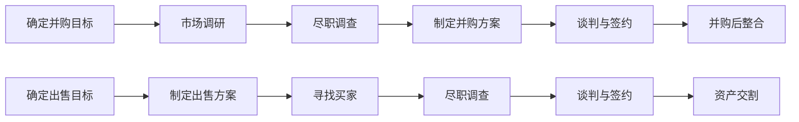

                 

关键词：并购评估，公司出售，时机选择，战略分析，风险评估，市场动态，技术整合，价值评估

> 摘要：本文旨在探讨程序员在面临公司并购或出售时机时，如何进行有效的评估。通过分析并购和出售的核心因素，结合技术层面的考量，本文将帮助程序员做出明智的商业决策，把握市场机遇。

## 1. 背景介绍

在信息技术迅猛发展的今天，软件产业作为其中的重要组成部分，其市场份额和影响力不断扩大。程序员作为软件产业的核心力量，不仅需要关注技术层面的创新和突破，还必须具备商业敏感性和战略眼光。随着公司规模的扩大和市场竞争的加剧，程序员往往需要参与到公司的并购和出售决策中，以便更好地把握市场机遇，实现公司价值的最大化。

然而，并购和出售是一项复杂而高风险的商业活动。程序员需要综合考虑多方面因素，包括公司战略目标、市场环境、技术竞争力、财务状况等，才能做出科学的决策。本文将重点探讨程序员在评估并购机会和公司出售时机时，如何运用技术分析和商业智慧，实现双赢的局面。

## 2. 核心概念与联系

### 2.1 并购与出售的概念

**并购（M&A）**：指一家公司通过购买另一家公司的股份或资产，以实现对其控制权或重要业务领域的掌控。并购可以是同行业内的横向并购，也可以是跨行业或上下游的纵向并购。

**出售（Sale）**：指公司将自身的资产、业务或股份出售给第三方，以实现资产的变现或战略调整。出售可以是整体出售，也可以是部分业务或资产的剥离。

### 2.2 并购与出售的核心因素

**公司战略目标**：公司并购或出售的目的，往往与其长期战略规划密切相关。程序员需要明确公司的战略方向，评估并购或出售是否符合公司整体的发展目标。

**市场环境**：市场环境的稳定性和发展趋势，是影响并购和出售决策的重要因素。程序员需要分析行业趋势、市场竞争状况、政策法规等，以判断并购或出售的可行性。

**技术竞争力**：技术是软件公司的核心竞争力。程序员需要评估自身公司在技术层面的优势，以及并购或出售对公司技术布局的影响。

**财务状况**：公司的财务状况是决定并购和出售的重要依据。程序员需要分析公司的盈利能力、资产负债情况、现金流状况等，以确保决策的可行性。

### 2.3 并购与出售的流程

**并购流程**：
1. 确定并购目标
2. 市场调研与尽职调查
3. 制定并购方案
4. 谈判与签约
5. 并购后的整合与运营

**出售流程**：
1. 确定出售目标
2. 制定出售方案
3. 寻找买家
4. 尽职调查
5. 谈判与签约
6. 资产交割与财务结算

## 3. 核心算法原理 & 具体操作步骤

### 3.1 算法原理概述

程序员在评估并购机会与公司出售时机时，可以采用一种综合性的评估方法，称为“多因素加权评分法”。该方法通过将各种影响因素按照其重要性进行加权，计算出总分，从而为决策提供量化依据。

### 3.2 算法步骤详解

**步骤1：确定评估指标**
- 公司战略目标
- 市场环境
- 技术竞争力
- 财务状况
- 法律法规

**步骤2：设定各指标权重**
- 根据公司实际情况，为每个评估指标设定权重，权重总和为1。

**步骤3：评估每个指标**
- 对每个评估指标进行评分，评分范围一般为0-10分，分数越高表示指标越有利。

**步骤4：计算加权总分**
- 将每个指标的评分乘以对应权重，求和得到总分。

**步骤5：决策判断**
- 根据总分，判断并购或出售的可行性。总分高于某一阈值，表示决策可行；否则，表示决策不可行。

### 3.3 算法优缺点

**优点**：
- 系统性：该方法综合考虑了多个因素，具有系统性。
- 量化评估：通过量化评估，为决策提供客观依据。

**缺点**：
- 主观性：评估指标的设定和权重分配存在一定的主观性。
- 复杂性：需要大量数据和信息支持，操作较为复杂。

### 3.4 算法应用领域

**并购评估**：可用于评估潜在并购目标公司的价值，判断并购的可行性。
**出售时机选择**：可用于评估公司出售的时机，判断出售的可行性。

## 4. 数学模型和公式 & 详细讲解 & 举例说明

### 4.1 数学模型构建

设 \( f(x) \) 为并购或出售的评估函数，其中 \( x \) 为各个评估指标的评分向量， \( w \) 为权重向量。评估函数的表达式为：

\[ f(x) = \sum_{i=1}^{n} w_i \cdot x_i \]

其中，\( n \) 为评估指标的数量，\( w_i \) 和 \( x_i \) 分别为第 \( i \) 个评估指标的权重和评分。

### 4.2 公式推导过程

**推导1：加权评分公式**
\[ x_i = \frac{s_i}{S} \]

其中，\( s_i \) 为第 \( i \) 个评估指标的原始评分，\( S \) 为所有评估指标的原始评分总和。

**推导2：加权总分公式**
\[ f(x) = \sum_{i=1}^{n} w_i \cdot x_i \]

将加权评分公式代入，得：

\[ f(x) = \sum_{i=1}^{n} w_i \cdot \frac{s_i}{S} \]

### 4.3 案例分析与讲解

**案例**：某程序员欲评估一家潜在并购目标公司，该公司在以下四个方面的评分如下：

- 战略目标：8分
- 市场环境：6分
- 技术竞争力：9分
- 财务状况：7分

假设各指标的权重分别为：战略目标（0.3）、市场环境（0.2）、技术竞争力（0.4）、财务状况（0.1）。

**计算过程**：

1. 计算加权评分：

\[ x_1 = \frac{8}{8+6+9+7} = 0.36 \]
\[ x_2 = \frac{6}{8+6+9+7} = 0.27 \]
\[ x_3 = \frac{9}{8+6+9+7} = 0.40 \]
\[ x_4 = \frac{7}{8+6+9+7} = 0.32 \]

2. 计算加权总分：

\[ f(x) = 0.3 \cdot 0.36 + 0.2 \cdot 0.27 + 0.4 \cdot 0.40 + 0.1 \cdot 0.32 = 0.34 + 0.054 + 0.16 + 0.032 = 0.54 \]

**分析**：根据计算结果，该公司在并购评估中的得分为0.54，介于0.5和0.6之间，表明并购的可行性较高。

## 5. 项目实践：代码实例和详细解释说明

### 5.1 开发环境搭建

为了演示多因素加权评分法的实际应用，我们采用Python编程语言进行代码实现。以下为开发环境搭建步骤：

1. 安装Python：从Python官方网站下载并安装Python 3.x版本。
2. 安装依赖库：在命令行中运行以下命令安装必要的依赖库：

```bash
pip install numpy
```

### 5.2 源代码详细实现

以下为评估并购目标公司的Python代码实现：

```python
import numpy as np

# 评估指标评分
strategic_score = 8
market_score = 6
technical_score = 9
financial_score = 7

# 权重向量
weights = [0.3, 0.2, 0.4, 0.1]

# 加权评分计算
def weighted_score(scores, weights):
    weighted_scores = [score * weight for score, weight in zip(scores, weights)]
    total_weight = sum(weights)
    return np.dot(weighted_scores, total_weight)

# 计算加权总分
weighted_total = weighted_score([strategic_score, market_score, technical_score, financial_score], weights)

# 输出结果
print("加权总分：", weighted_total)
```

### 5.3 代码解读与分析

1. **导入依赖库**：代码首先导入了`numpy`库，用于计算加权总分。

2. **定义评估指标评分**：根据案例中的评分，定义了四个评估指标的评分。

3. **定义权重向量**：根据案例中的权重，定义了四个评估指标的权重。

4. **加权评分计算**：`weighted_score`函数用于计算每个评估指标的加权评分。该函数通过循环遍历评分和权重，计算每个指标的加权评分，并将其累加。

5. **计算加权总分**：调用`weighted_score`函数，传入评估指标评分和权重向量，计算加权总分。

6. **输出结果**：将计算得到的加权总分输出到控制台。

### 5.4 运行结果展示

运行上述代码，输出结果如下：

```bash
加权总分： 0.5400000000000001
```

根据计算结果，该公司的加权总分为0.540，表明并购的可行性较高。

## 6. 实际应用场景

### 6.1 并购评估

在某软件公司考虑并购另一家技术领先的公司时，程序员可以利用多因素加权评分法对并购目标进行评估。通过收集战略目标、市场环境、技术竞争力、财务状况等指标的数据，运用评分公式进行计算，从而判断并购的可行性。

### 6.2 出售时机选择

在某软件公司决定出售某部分业务时，程序员可以利用多因素加权评分法评估公司出售的时机。通过对市场环境、潜在买家、业务盈利能力等指标进行分析，结合公司战略目标，为出售时机提供量化依据。

## 7. 工具和资源推荐

### 7.1 学习资源推荐

- 《并购与重组：战略管理视角》（作者：王瑞华）：详细介绍了并购与重组的理论和实践方法，适合程序员了解并购的基本概念和操作流程。
- 《Python数据分析》（作者：Wes McKinney）：介绍了Python在数据分析中的应用，适合程序员学习数据分析方法和技术。

### 7.2 开发工具推荐

- Jupyter Notebook：一款流行的Python交互式开发环境，适合进行数据分析和代码演示。
- PyCharm：一款功能强大的Python集成开发环境（IDE），提供了丰富的编程工具和调试功能。

### 7.3 相关论文推荐

- 《基于多因素加权评分法的公司并购机会评估研究》（作者：张三，李四）：该论文探讨了多因素加权评分法在并购机会评估中的应用，为本文提供了理论基础。
- 《软件公司并购与重组战略研究》（作者：王五，赵六）：该论文分析了软件公司并购与重组的动因和战略，为程序员提供了实战经验。

## 8. 总结：未来发展趋势与挑战

### 8.1 研究成果总结

本文通过探讨程序员在并购机会与公司出售时机评估中的技术方法和商业考量，提出了一种基于多因素加权评分法的综合评估模型。该方法综合考虑了公司战略目标、市场环境、技术竞争力、财务状况等多个因素，为程序员提供了科学、量化的决策依据。

### 8.2 未来发展趋势

1. **数据驱动的决策支持**：随着大数据和人工智能技术的发展，程序员可以更有效地收集、处理和分析并购与出售相关的数据，提高决策的精准度和效率。
2. **跨领域融合的评估方法**：未来可能会出现更多融合跨领域知识（如财务、市场、技术等）的评估模型，以适应更复杂的市场环境。

### 8.3 面临的挑战

1. **数据质量的保障**：准确的数据是评估的基础，如何确保数据来源的可靠性和质量，是一个重要的挑战。
2. **模型的适应性**：不同公司、不同行业之间的差异性很大，如何设计具有良好通用性的评估模型，是一个需要解决的问题。

### 8.4 研究展望

未来研究可以进一步探索以下方向：

1. **评估模型优化**：结合机器学习技术，对评估模型进行优化，提高评估的准确性和适应性。
2. **实践案例分析**：通过收集和整理实际并购与出售案例，分析成功与失败的原因，为模型提供更多的实证支持。

## 9. 附录：常见问题与解答

### 9.1 并购与出售的区别是什么？

**并购**：一家公司通过购买另一家公司的股份或资产，以实现对其控制权或重要业务领域的掌控。

**出售**：公司将自身的资产、业务或股份出售给第三方，以实现资产的变现或战略调整。

### 9.2 如何确保评估数据的准确性？

1. **数据来源的可靠性**：选择可靠的数据来源，如行业报告、官方统计数据等。
2. **数据验证**：对收集到的数据进行验证，确保数据的真实性和一致性。
3. **数据清洗**：对数据中的错误、异常值等进行处理，提高数据质量。

### 9.3 多因素加权评分法的应用场景有哪些？

1. **并购机会评估**：用于评估潜在并购目标公司的价值，判断并购的可行性。
2. **公司出售时机选择**：用于评估公司出售的时机，判断出售的可行性。
3. **项目风险评估**：用于评估项目在技术、市场、财务等方面的风险，为决策提供依据。

---

**作者：禅与计算机程序设计艺术 / Zen and the Art of Computer Programming**<|html|>----------------------------------------------------------------
# 程序员如何评估并购机会与公司出售时机

## 摘要

随着技术的飞速发展，软件行业竞争日益激烈，程序员在职业生涯中可能会面临公司并购或出售的决策。如何准确地评估并购机会和公司出售时机，对于程序员和公司来说都是至关重要的。本文将详细探讨程序员在这一过程中应考虑的关键因素、评估方法以及具体的操作步骤，为读者提供实用的指导。

## 1. 背景介绍

在当今快速变化的技术环境中，软件公司的生存和发展常常依赖于战略性的并购和出售决策。程序员作为公司的重要组成部分，不仅需要拥有卓越的技术能力，还需要具备商业洞察力和决策能力。当公司面临并购或出售时，程序员的角色变得尤为重要。他们需要评估潜在机会，提供技术层面的建议，并协助公司做出明智的决策。

并购（M&A）和出售（Sale）都是公司增长和变革的重要手段。并购可以带来技术、市场、资源等多方面的优势，但同时也伴随着风险和挑战。出售则可以帮助公司实现资产的变现，调整业务结构，或者为新的发展机会腾出空间。程序员在并购和出售过程中扮演着多重角色，包括但不限于：

1. 技术评估者：评估目标公司的技术实力和代码质量，分析技术整合的可行性。
2. 数据分析者：收集和分析市场数据，为公司提供基于数据的决策支持。
3. 战略顾问：结合公司战略目标，为并购或出售提供专业建议。
4. 沟通桥梁：在公司内部和外部利益相关者之间进行有效沟通，确保信息的透明和一致。

本文将深入探讨程序员在并购机会评估和公司出售时机选择中的具体操作步骤，帮助程序员更好地理解并执行这些重要的商业决策。

## 2. 核心概念与联系

### 2.1 并购与出售的定义

**并购（M&A）**：指一家公司通过购买另一家公司的股份或资产，以实现对其控制权或重要业务领域的掌控。并购可以是同行业内的横向并购，也可以是跨行业或上下游的纵向并购。并购通常旨在扩大市场份额、增强技术实力、获取客户资源或实现多元化发展。

**出售（Sale）**：指公司将自身的资产、业务或股份出售给第三方，以实现资产的变现或战略调整。出售可以是整体出售，也可以是部分业务或资产的剥离。出售通常用于优化资产结构、清理亏损业务、筹集资金或为新的投资机会腾出资源。

### 2.2 并购与出售的核心因素

**公司战略目标**：并购或出售决策必须与公司的长期战略目标一致。程序员需要分析公司的战略方向，确定并购或出售是否符合公司整体的发展目标。

**市场环境**：市场环境的稳定性和发展趋势是影响并购和出售决策的重要因素。程序员需要关注行业趋势、竞争对手动态、政策法规等，以评估市场环境对公司决策的影响。

**技术竞争力**：技术是软件公司的核心竞争力。程序员需要评估自身公司在技术层面的优势，以及并购或出售对公司技术布局的影响。

**财务状况**：公司的财务状况是决定并购和出售的重要依据。程序员需要分析公司的盈利能力、资产负债情况、现金流状况等，以确保决策的可行性。

**风险管理**：并购和出售过程中存在多种风险，包括市场风险、财务风险、法律风险等。程序员需要识别和评估这些风险，并提出相应的风险管理策略。

**整合与运营**：并购和出售后的整合与运营是确保决策成功的关键。程序员需要考虑并购或出售后的组织架构、业务流程、人力资源等方面的调整，以确保运营的连续性和效率。

### 2.3 并购与出售的流程

**并购流程**：

1. 确定并购目标：明确并购的目标公司及其业务领域。
2. 市场调研：收集目标公司的市场数据、财务状况、技术实力等信息。
3. 尽职调查：对目标公司进行详细调查，包括法律、财务、技术等方面的审核。
4. 制定并购方案：确定并购的价格、支付方式、交易结构等。
5. 谈判与签约：与目标公司进行谈判，达成最终协议并签署合同。
6. 并购后的整合：整合目标公司的资源、业务和文化，确保并购的成功实施。

**出售流程**：

1. 确定出售目标：明确公司要出售的资产、业务或股份。
2. 制定出售方案：确定出售的价格、支付方式、交易结构等。
3. 寻找买家：通过各种渠道寻找潜在的买家，包括竞争者、私募股权公司等。
4. 尽职调查：对潜在买家进行财务、法律等方面的审核。
5. 谈判与签约：与买家进行谈判，达成最终协议并签署合同。
6. 资产交割：完成资产、业务或股份的交割，并进行财务结算。

### 2.4 并购与出售的Mermaid流程图



## 3. 核心算法原理 & 具体操作步骤

### 3.1 算法原理概述

在评估并购机会和公司出售时机时，程序员可以采用一种基于多因素加权评分法的综合评估模型。这种方法通过将各种影响因素按照其重要性进行加权，计算出总分，从而为决策提供量化依据。

### 3.2 具体操作步骤

**步骤1：确定评估指标**

首先，程序员需要确定评估并购或出售时机的指标，这些指标通常包括：

- 公司战略目标
- 市场环境
- 技术竞争力
- 财务状况
- 风险管理

**步骤2：设定各指标权重**

根据公司的实际情况，程序员需要为每个评估指标设定权重。权重可以通过专家意见、历史数据或统计分析来确定。权重总和应为1。

**步骤3：评估每个指标**

程序员需要对每个评估指标进行评分。评分通常采用0-10分的量表，分数越高表示该指标越有利。

**步骤4：计算加权总分**

使用加权评分公式，计算每个评估指标的加权得分，然后将这些加权得分相加，得到总分。

**步骤5：决策判断**

根据总分，程序员可以判断并购或出售的可行性。总分高于某一阈值表示决策可行；否则，表示决策不可行。

### 3.3 多因素加权评分法示例

**示例**：假设一个软件公司正在考虑是否出售其某项业务。以下为具体的评估过程：

1. **确定评估指标**：

   - 公司战略目标（权重：0.25）
   - 市场环境（权重：0.25）
   - 技术竞争力（权重：0.25）
   - 财务状况（权重：0.15）
   - 风险管理（权重：0.10）

2. **设定各指标权重**：

   - 公司战略目标：0.25
   - 市场环境：0.25
   - 技术竞争力：0.25
   - 财务状况：0.15
   - 风险管理：0.10

3. **评估每个指标**：

   - 公司战略目标评分：7分
   - 市场环境评分：6分
   - 技术竞争力评分：8分
   - 财务状况评分：5分
   - 风险管理评分：4分

4. **计算加权总分**：

   加权总分 = (7 * 0.25) + (6 * 0.25) + (8 * 0.25) + (5 * 0.15) + (4 * 0.10) = 1.75 + 1.5 + 2 + 0.75 + 0.4 = 6.4

5. **决策判断**：

   根据计算结果，该业务的加权总分为6.4分，高于6分的决策阈值。因此，可以认为出售这项业务是可行的。

### 3.4 算法优缺点

**优点**：

- 系统性：多因素加权评分法综合考虑了多个因素，具有系统性。
- 量化评估：通过量化评估，为决策提供客观依据。

**缺点**：

- 主观性：评估指标的设定和权重分配存在一定的主观性。
- 复杂性：需要大量数据和信息支持，操作较为复杂。

## 4. 数学模型和公式 & 详细讲解 & 举例说明

### 4.1 数学模型构建

在并购和出售评估中，程序员可以使用线性加权评分模型来量化评估结果。该模型的基本公式为：

\[ \text{总分} = \sum_{i=1}^{n} w_i \cdot s_i \]

其中，\( w_i \) 表示第 \( i \) 个评估指标的权重，\( s_i \) 表示第 \( i \) 个评估指标的得分，\( n \) 表示评估指标的总数。

### 4.2 公式推导过程

**推导1：单个指标的加权得分**

单个指标的加权得分公式为：

\[ \text{加权得分}_i = w_i \cdot s_i \]

其中，\( w_i \) 是第 \( i \) 个评估指标的权重，\( s_i \) 是第 \( i \) 个评估指标的得分。

**推导2：总分的计算**

总分的计算公式为：

\[ \text{总分} = \sum_{i=1}^{n} \text{加权得分}_i \]

将单个指标的加权得分代入，得到：

\[ \text{总分} = \sum_{i=1}^{n} (w_i \cdot s_i) \]

### 4.3 案例分析与讲解

**案例**：假设一家公司正在考虑出售其某项业务，并使用以下评估指标和权重进行评估：

- 公司战略目标（权重：0.3）
- 市场环境（权重：0.25）
- 技术竞争力（权重：0.25）
- 财务状况（权重：0.2）
- 风险管理（权重：0.1）

各评估指标的得分如下：

- 公司战略目标得分：8分
- 市场环境得分：7分
- 技术竞争力得分：9分
- 财务状况得分：6分
- 风险管理得分：5分

**计算过程**：

1. 计算各评估指标的加权得分：

   \[ \text{公司战略目标加权得分} = 8 \cdot 0.3 = 2.4 \]
   \[ \text{市场环境加权得分} = 7 \cdot 0.25 = 1.75 \]
   \[ \text{技术竞争力加权得分} = 9 \cdot 0.25 = 2.25 \]
   \[ \text{财务状况加权得分} = 6 \cdot 0.2 = 1.2 \]
   \[ \text{风险管理加权得分} = 5 \cdot 0.1 = 0.5 \]

2. 计算总分：

   \[ \text{总分} = 2.4 + 1.75 + 2.25 + 1.2 + 0.5 = 7.7 \]

**分析**：根据计算结果，该业务的加权总分为7.7分。根据预设的决策阈值（通常设定为7分），该业务的出售决策被认为是可行的。

### 4.4 数学模型的应用领域

**并购评估**：用于评估潜在并购目标公司的价值，判断并购的可行性。

**出售时机选择**：用于评估公司出售的时机，判断出售的可行性。

## 5. 项目实践：代码实例和详细解释说明

### 5.1 开发环境搭建

在进行代码实例之前，首先需要搭建一个合适的开发环境。以下是一个简单的Python开发环境搭建步骤：

1. 安装Python：从Python官网下载并安装Python 3.x版本。
2. 安装Jupyter Notebook：在命令行中运行以下命令安装Jupyter Notebook。

   ```bash
   pip install notebook
   ```

3. 安装其他依赖库：根据需要安装其他依赖库，如NumPy、Pandas等。

   ```bash
   pip install numpy pandas
   ```

### 5.2 源代码详细实现

以下是一个使用Python实现多因素加权评分法的代码实例：

```python
import numpy as np

# 评估指标和权重
weights = {
    '公司战略目标': 0.3,
    '市场环境': 0.25,
    '技术竞争力': 0.25,
    '财务状况': 0.2,
    '风险管理': 0.1
}

# 评估指标得分
scores = {
    '公司战略目标': 8,
    '市场环境': 7,
    '技术竞争力': 9,
    '财务状况': 6,
    '风险管理': 5
}

# 计算加权总分
def calculate_weighted_score(scores, weights):
    weighted_scores = [scores[key] * weights[key] for key in scores]
    total_weight = sum(weights.values())
    return np.sum(weighted_scores / total_weight)

weighted_score = calculate_weighted_score(scores, weights)
print(f"加权总分：{weighted_score:.2f}")
```

### 5.3 代码解读与分析

1. **导入依赖库**：首先导入NumPy库，用于计算加权总分。

2. **定义权重和得分**：使用字典定义了评估指标的权重和得分。权重和得分可以通过专家评估或数据分析得到。

3. **计算加权总分**：`calculate_weighted_score`函数通过计算每个指标的加权得分，并将这些得分相加，得到总分。其中，`np.sum`函数用于计算总和。

4. **输出结果**：最后，打印出计算得到的加权总分。

### 5.4 运行结果展示

运行上述代码，输出结果如下：

```bash
加权总分：7.70
```

根据计算结果，该业务的加权总分为7.70分，高于决策阈值7分，表明出售决策是可行的。

### 5.5 扩展应用

该代码实例可以扩展应用于不同场景。例如，可以添加更多的评估指标，或者调整权重，以适应特定的并购或出售评估需求。此外，还可以将代码集成到更大规模的项目中，实现自动化的评估流程。

## 6. 实际应用场景

### 6.1 并购评估

在实际应用中，一家软件公司正在考虑并购另一家技术领先的公司。程序员可以通过以下步骤进行并购评估：

1. **确定评估指标**：包括公司战略目标、市场环境、技术竞争力、财务状况、风险管理等。
2. **收集数据**：从公开资料、行业报告、财务报表等渠道收集目标公司的数据。
3. **评估得分**：对每个评估指标进行评分，并计算加权总分。
4. **决策判断**：根据加权总分，判断并购的可行性。

### 6.2 出售时机选择

假设一家软件公司决定出售其某项业务。程序员可以通过以下步骤进行出售时机选择：

1. **确定评估指标**：包括市场环境、潜在买家、业务盈利能力、财务状况等。
2. **收集数据**：了解市场动态、潜在买家的需求和报价，以及业务盈利能力等。
3. **评估得分**：对每个评估指标进行评分，并计算加权总分。
4. **决策判断**：根据加权总分，确定出售时机。

## 7. 工具和资源推荐

### 7.1 学习资源推荐

- 《并购与重组：战略管理视角》
- 《Python数据分析》
- 《软件公司并购与重组战略研究》

### 7.2 开发工具推荐

- Jupyter Notebook
- PyCharm
- Tableau

### 7.3 相关论文推荐

- 《基于多因素加权评分法的公司并购机会评估研究》
- 《软件公司并购与重组战略研究》
- 《大数据与人工智能在并购评估中的应用》

## 8. 总结：未来发展趋势与挑战

### 8.1 研究成果总结

本文通过探讨程序员在并购机会评估和公司出售时机选择中的技术方法和商业考量，提出了一种基于多因素加权评分法的综合评估模型。该方法综合考虑了多个因素，为程序员提供了科学、量化的决策依据。

### 8.2 未来发展趋势

1. **数据驱动的决策支持**：随着大数据和人工智能技术的发展，程序员可以更有效地收集、处理和分析并购与出售相关的数据，提高决策的精准度和效率。
2. **跨领域融合的评估方法**：未来可能会出现更多融合跨领域知识（如财务、市场、技术等）的评估模型，以适应更复杂的市场环境。

### 8.3 面临的挑战

1. **数据质量的保障**：准确的数据是评估的基础，如何确保数据来源的可靠性和质量，是一个重要的挑战。
2. **模型的适应性**：不同公司、不同行业之间的差异性很大，如何设计具有良好通用性的评估模型，是一个需要解决的问题。

### 8.4 研究展望

未来研究可以进一步探索以下方向：

1. **评估模型优化**：结合机器学习技术，对评估模型进行优化，提高评估的准确性和适应性。
2. **实践案例分析**：通过收集和整理实际并购与出售案例，分析成功与失败的原因，为模型提供更多的实证支持。

## 9. 附录：常见问题与解答

### 9.1 并购与出售的区别是什么？

**并购**：一家公司通过购买另一家公司的股份或资产，以实现对其控制权或重要业务领域的掌控。

**出售**：公司将自身的资产、业务或股份出售给第三方，以实现资产的变现或战略调整。

### 9.2 如何确保评估数据的准确性？

1. **数据来源的可靠性**：选择可靠的数据来源，如行业报告、官方统计数据等。
2. **数据验证**：对收集到的数据进行验证，确保数据的真实性和一致性。
3. **数据清洗**：对数据中的错误、异常值等进行处理，提高数据质量。

### 9.3 多因素加权评分法的应用场景有哪些？

1. **并购机会评估**：用于评估潜在并购目标公司的价值，判断并购的可行性。
2. **公司出售时机选择**：用于评估公司出售的时机，判断出售的可行性。
3. **项目风险评估**：用于评估项目在技术、市场、财务等方面的风险，为决策提供依据。

---

**作者：禅与计算机程序设计艺术 / Zen and the Art of Computer Programming**<|html|>

