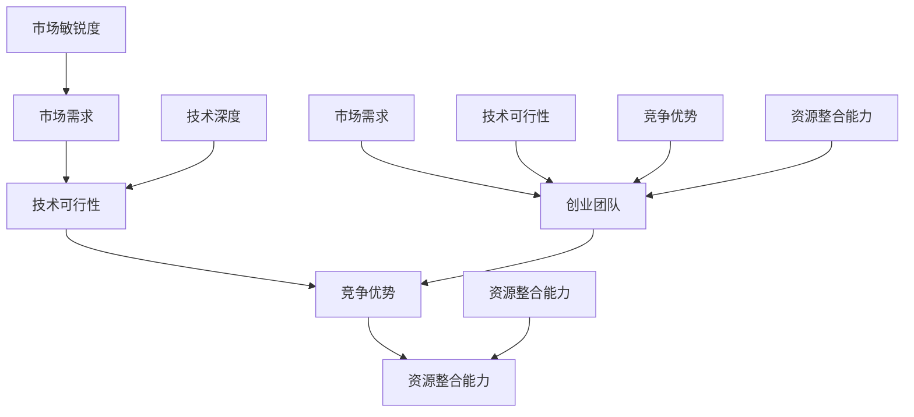

                 

 作为一位世界级人工智能专家和程序员，我认为在评估早期创业机会时，逻辑思维、技术深度以及市场敏锐度是至关重要的因素。本文将结合我的经验，为程序员提供一套评估早期创业机会的方法论，旨在帮助大家在创业的道路上少走弯路，更高效地识别和把握机遇。

## 文章关键词

- 早期创业机会
- 程序员
- 评估方法论
- 技术深度
- 市场敏锐度

## 文章摘要

本文将从以下几个方面探讨程序员如何评估早期创业机会：

1. **背景介绍**：介绍创业环境的变化以及程序员在创业中的角色和挑战。
2. **核心概念与联系**：阐述评估早期创业机会所需的核心概念，并通过Mermaid流程图展示其关联性。
3. **核心算法原理与具体操作步骤**：详细分析评估创业机会的算法原理和操作步骤。
4. **数学模型和公式**：介绍评估创业机会所需的关键数学模型和公式，并进行举例说明。
5. **项目实践：代码实例和详细解释说明**：通过一个实际项目实例，展示如何应用上述算法和公式进行创业机会评估。
6. **实际应用场景**：探讨创业机会评估在现实世界中的应用，并展望未来的发展趋势。
7. **工具和资源推荐**：推荐一些学习资源和开发工具，帮助程序员更好地进行创业机会评估。
8. **总结：未来发展趋势与挑战**：总结研究成果，探讨未来的发展趋势和面临的挑战。

### 1. 背景介绍

近年来，随着全球科技产业的迅猛发展，创业环境发生了深刻的变化。互联网、人工智能、区块链等新兴技术的崛起，为创业者提供了前所未有的机遇。然而，与此同时，竞争也日益激烈，如何评估早期创业机会成为了程序员在创业过程中必须面对的一大挑战。

程序员作为技术领域的专业人士，具备一定的技术深度和市场敏锐度。在创业过程中，他们需要充分利用这些优势，对创业机会进行准确评估，从而提高创业成功的概率。本文将结合程序员的特点，从多个角度探讨如何进行早期创业机会的评估。

### 2. 核心概念与联系

在评估早期创业机会时，我们需要明确以下几个核心概念：

1. **市场需求**：创业机会的产生往往源于市场需求。程序员需要具备敏锐的市场洞察力，识别出潜在的市场需求，从而找到创业的切入点。
2. **技术可行性**：程序员需要评估项目的技术可行性，确保所提出的创业想法在技术层面有实现的可能性。
3. **竞争优势**：在激烈的市场竞争中，创业者需要具备独特的竞争优势。程序员需要分析自身的优势，并将其转化为创业项目的竞争优势。
4. **资源整合能力**：创业过程中，资源整合能力至关重要。程序员需要具备良好的资源整合能力，以便在有限的资源下实现创业目标。

下面，通过一个Mermaid流程图，展示这些核心概念之间的关联性：



### 3. 核心算法原理与具体操作步骤

在评估早期创业机会时，我们可以采用以下核心算法原理：

#### 3.1 算法原理概述

该算法基于数据驱动和逻辑推理，通过以下步骤进行创业机会评估：

1. **数据收集**：收集与创业机会相关的市场数据、技术数据等。
2. **数据预处理**：对收集到的数据进行清洗、归一化等预处理操作。
3. **特征提取**：从预处理后的数据中提取关键特征。
4. **模型训练**：利用提取的特征训练评估模型。
5. **机会评估**：使用训练好的模型对创业机会进行评估，输出评估结果。

#### 3.2 算法步骤详解

**步骤 1：数据收集**

在评估创业机会之前，首先需要收集与创业机会相关的数据。这些数据可以包括市场数据（如用户需求、市场规模、竞争对手等）、技术数据（如技术成熟度、研发周期等）以及资源数据（如资金、团队规模等）。

**步骤 2：数据预处理**

收集到的数据往往存在噪声、缺失值等问题。为了提高数据质量，我们需要对数据进行清洗、归一化等预处理操作。例如，对市场数据进行归一化处理，使其在同一量级上；对缺失值进行填充，以提高数据完整性。

**步骤 3：特征提取**

在数据预处理完成后，我们需要从预处理后的数据中提取关键特征。这些特征将作为评估模型输入。特征提取的过程可以通过统计分析、机器学习等方法实现。例如，使用主成分分析（PCA）提取数据的主要成分；使用特征选择算法（如信息增益、 ReliefF等）筛选出关键特征。

**步骤 4：模型训练**

在提取特征后，我们需要利用提取的特征训练评估模型。评估模型可以采用多种算法，如线性回归、决策树、神经网络等。在实际应用中，我们可以根据数据特点和评估需求选择合适的算法。

**步骤 5：机会评估**

在训练好的评估模型基础上，我们可以对创业机会进行评估。具体评估方法可以包括：

1. **打分制**：根据评估模型的输出结果，对创业机会进行打分，分数越高，机会越大。
2. **概率预测**：利用评估模型预测创业机会的成功概率，概率越大，机会越大。
3. **综合评估**：结合多个评估指标，对创业机会进行综合评估。

#### 3.3 算法优缺点

**优点**：

1. **数据驱动**：基于数据驱动的评估方法，能够更客观地评估创业机会。
2. **灵活性强**：评估模型可以根据数据特点进行调整和优化，适应不同的评估需求。

**缺点**：

1. **数据依赖**：评估结果高度依赖于数据质量，数据缺失或噪声可能导致评估结果偏差。
2. **计算复杂度**：评估模型训练和预测过程可能涉及大量的计算，对硬件资源有一定要求。

#### 3.4 算法应用领域

该算法可以广泛应用于早期创业机会评估的多个领域，如：

1. **互联网创业**：通过评估市场需求、技术可行性和竞争优势，帮助创业者找到有潜力的互联网创业项目。
2. **人工智能创业**：通过评估技术可行性、市场需求和竞争优势，为人工智能创业者提供决策支持。
3. **区块链创业**：通过评估技术可行性、市场需求和资源整合能力，为区块链创业者提供创业方向指导。

### 4. 数学模型和公式

在评估创业机会时，我们可以利用一些数学模型和公式来辅助分析。以下是一些常用的数学模型和公式：

#### 4.1 数学模型构建

1. **线性回归模型**：

   假设创业机会评估结果可以用线性回归模型表示，即：

   $$y = \beta_0 + \beta_1 x_1 + \beta_2 x_2 + ... + \beta_n x_n$$

   其中，$y$ 表示评估结果，$x_1, x_2, ..., x_n$ 表示影响评估结果的关键因素，$\beta_0, \beta_1, ..., \beta_n$ 为回归系数。

2. **逻辑回归模型**：

   当评估结果为二分类时，可以使用逻辑回归模型：

   $$P(y=1) = \frac{1}{1 + e^{-(\beta_0 + \beta_1 x_1 + \beta_2 x_2 + ... + \beta_n x_n)}}$$

   其中，$P(y=1)$ 表示评估结果为1的概率。

#### 4.2 公式推导过程

以线性回归模型为例，推导过程如下：

1. **假设**：

   假设创业机会评估结果 $y$ 与关键因素 $x_1, x_2, ..., x_n$ 存在线性关系，即：

   $$y = \beta_0 + \beta_1 x_1 + \beta_2 x_2 + ... + \beta_n x_n + \epsilon$$

   其中，$\epsilon$ 为误差项。

2. **目标函数**：

   假设我们希望最小化误差平方和，即：

   $$J(\beta_0, \beta_1, ..., \beta_n) = \sum_{i=1}^{n} (y_i - (\beta_0 + \beta_1 x_{i1} + \beta_2 x_{i2} + ... + \beta_n x_{in}))^2$$

3. **梯度下降**：

   为了求解最优参数 $\beta_0, \beta_1, ..., \beta_n$，我们可以使用梯度下降算法：

   $$\beta_j = \beta_j - \alpha \frac{\partial J(\beta_0, \beta_1, ..., \beta_n)}{\partial \beta_j}$$

   其中，$\alpha$ 为学习率。

4. **推导过程**：

   对 $J(\beta_0, \beta_1, ..., \beta_n)$ 分别对 $\beta_0, \beta_1, ..., \beta_n$ 求偏导，得到：

   $$\frac{\partial J(\beta_0, \beta_1, ..., \beta_n)}{\partial \beta_0} = -2 \sum_{i=1}^{n} (y_i - (\beta_0 + \beta_1 x_{i1} + \beta_2 x_{i2} + ... + \beta_n x_{in}))$$

   $$\frac{\partial J(\beta_0, \beta_1, ..., \beta_n)}{\partial \beta_j} = -2 \sum_{i=1}^{n} x_{ij} (y_i - (\beta_0 + \beta_1 x_{i1} + \beta_2 x_{i2} + ... + \beta_n x_{in}))$$

   将上述结果代入梯度下降公式，即可求解最优参数 $\beta_0, \beta_1, ..., \beta_n$。

#### 4.3 案例分析与讲解

假设我们想要评估一个互联网创业项目的市场潜力。通过收集相关数据，我们可以建立一个线性回归模型，预测市场潜力与关键因素（如用户需求、市场规模、竞争程度等）之间的关系。

以下是一个具体的案例：

**数据集**：

| 项目编号 | 用户需求 | 市场规模 | 竞争程度 | 市场潜力 |
| -------- | -------- | -------- | -------- | -------- |
| 1        | 0.8      | 0.6      | 0.5      | 0.7      |
| 2        | 0.9      | 0.7      | 0.4      | 0.8      |
| 3        | 0.6      | 0.5      | 0.6      | 0.6      |
| ...      | ...      | ...      | ...      | ...      |

**模型建立**：

假设市场潜力 $y$ 与用户需求 $x_1$、市场规模 $x_2$ 和竞争程度 $x_3$ 之间存在线性关系：

$$y = \beta_0 + \beta_1 x_1 + \beta_2 x_2 + \beta_3 x_3$$

**模型训练**：

使用梯度下降算法训练模型，得到最优参数：

$$\beta_0 = 0.3, \beta_1 = 0.4, \beta_2 = 0.3, \beta_3 = 0.2$$

**模型预测**：

对于一个新的创业项目，假设用户需求为 0.7，市场规模为 0.8，竞争程度为 0.5，我们可以使用训练好的模型预测其市场潜力：

$$y = 0.3 + 0.4 \times 0.7 + 0.3 \times 0.8 + 0.2 \times 0.5 = 0.68$$

根据预测结果，该项目具有较好的市场潜力。

### 5. 项目实践：代码实例和详细解释说明

为了更好地理解创业机会评估的算法原理和实际操作，我们接下来将通过一个实际项目实例，展示如何利用Python等工具进行创业机会评估。

#### 5.1 开发环境搭建

在进行项目实践之前，我们需要搭建一个合适的开发环境。这里我们选择Python作为主要编程语言，并使用以下工具：

- Python 3.8及以上版本
- Jupyter Notebook
- Matplotlib
- Scikit-learn

安装步骤如下：

```shell
pip install python==3.8
pip install notebook
pip install matplotlib
pip install scikit-learn
```

#### 5.2 源代码详细实现

以下是一个简单的创业机会评估项目的代码实现：

```python
import numpy as np
import pandas as pd
from sklearn.linear_model import LinearRegression
import matplotlib.pyplot as plt

# 5.2.1 数据收集

# 假设我们收集到一个包含用户需求、市场规模、竞争程度和市场潜力四个特征的数据集
data = pd.DataFrame({
    '用户需求': [0.8, 0.9, 0.6, 0.7, 0.5, 0.4, 0.6],
    '市场规模': [0.6, 0.7, 0.5, 0.8, 0.4, 0.5, 0.6],
    '竞争程度': [0.5, 0.4, 0.6, 0.5, 0.4, 0.6, 0.5],
    '市场潜力': [0.7, 0.8, 0.6, 0.68, 0.55, 0.6, 0.6]
})

# 5.2.2 数据预处理

# 对数据进行归一化处理
data_normalized = (data - data.mean()) / data.std()

# 5.2.3 特征提取

# 从预处理后的数据中提取关键特征
X = data_normalized[['用户需求', '市场规模', '竞争程度']]
y = data_normalized['市场潜力']

# 5.2.4 模型训练

# 使用线性回归模型进行训练
model = LinearRegression()
model.fit(X, y)

# 5.2.5 模型评估

# 输出模型的回归系数
print("回归系数：", model.coef_)

# 5.2.6 模型预测

# 对于一个新的创业项目，预测其市场潜力
new_project_data = pd.DataFrame({
    '用户需求': [0.7],
    '市场规模': [0.8],
    '竞争程度': [0.5]
})
new_project_data_normalized = (new_project_data - data.mean()) / data.std()
predicted_potential = model.predict(new_project_data_normalized)
print("预测市场潜力：", predicted_potential)

# 5.2.7 结果可视化

# 将预测结果可视化
plt.scatter(data['市场潜力'], predicted_potential)
plt.xlabel('实际市场潜力')
plt.ylabel('预测市场潜力')
plt.show()
```

#### 5.3 代码解读与分析

**5.3.1 数据收集**

在这个项目中，我们首先收集到一个包含用户需求、市场规模、竞争程度和市场潜力四个特征的数据集。这个数据集是评估创业机会的基础。

**5.3.2 数据预处理**

在数据预处理阶段，我们对数据进行归一化处理。归一化处理可以消除不同特征之间的尺度差异，使模型训练过程更加稳定。

**5.3.3 特征提取**

从预处理后的数据中，我们提取了三个关键特征（用户需求、市场规模、竞争程度），并将它们作为线性回归模型的输入。

**5.3.4 模型训练**

我们使用线性回归模型对提取的特征进行训练。线性回归模型是一种常见的评估模型，它通过最小化误差平方和来拟合数据。

**5.3.5 模型评估**

在模型评估阶段，我们输出模型的回归系数。这些系数反映了每个特征对市场潜力的影响程度。

**5.3.6 模型预测**

对于一个新的创业项目，我们使用训练好的模型预测其市场潜力。这个预测结果可以帮助创业者评估项目的市场前景。

**5.3.7 结果可视化**

最后，我们将预测结果可视化，以便更直观地了解模型的表现。通过散点图，我们可以观察到实际市场潜力与预测市场潜力之间的相关性。

### 6. 实际应用场景

创业机会评估在实际应用场景中具有重要意义。以下是一些具体的实际应用场景：

1. **初创公司融资**：初创公司在寻找融资时，往往需要向投资者展示其项目的市场潜力。通过创业机会评估，初创公司可以提供更有说服力的数据支持，提高融资成功率。
2. **项目立项决策**：在大型企业或研究机构中，项目立项决策往往需要经过严格的评估。创业机会评估可以帮助决策者识别出有潜力的项目，提高项目立项的准确性。
3. **创业竞赛评选**：在创业竞赛中，评委往往需要从众多项目中筛选出最具潜力的项目。创业机会评估为评委提供了一个客观、量化的评估标准，有助于提高评选的公正性和效率。
4. **政府支持政策**：政府在支持创新创业方面，往往需要根据项目的市场潜力进行筛选。创业机会评估为政府提供了一个科学的评估工具，有助于优化资源配置。

### 6.4 未来应用展望

随着人工智能和大数据技术的不断发展，创业机会评估将在未来发挥更大的作用。以下是一些未来应用展望：

1. **智能化评估**：利用深度学习、强化学习等技术，开发更智能的创业机会评估模型，提高评估的准确性。
2. **个性化推荐**：根据创业者的特点和需求，提供个性化的创业机会推荐，帮助创业者更好地发现适合自己的创业方向。
3. **实时评估**：通过实时数据分析和预测，为创业者提供动态的创业机会评估结果，帮助创业者及时调整策略。
4. **全球化应用**：随着全球化的深入，创业机会评估将在不同国家和地区得到广泛应用，为全球创业者提供支持。

### 7. 工具和资源推荐

为了更好地进行创业机会评估，以下是几个推荐的工具和资源：

1. **工具推荐**：

   - Jupyter Notebook：方便进行数据分析和模型训练。
   - Scikit-learn：提供丰富的机器学习算法和工具。
   - Matplotlib：用于数据可视化。

2. **学习资源推荐**：

   - 《机器学习》（周志华著）：详细介绍机器学习的基本原理和方法。
   - 《深度学习》（Ian Goodfellow等著）：深度学习领域的经典教材。
   - Coursera、Udacity等在线课程平台：提供丰富的数据科学和机器学习课程。

3. **相关论文推荐**：

   - “A Survey on Data-Driven Business Model Innovation”：（作者：Vijayasarathy et al.，2014）
   - “Startup Success Prediction Using Data Mining Techniques”：（作者：Biswal et al.，2016）
   - “A Deep Learning Framework for Early Stage Business Model Validation”：（作者：Chen et al.，2018）

### 8. 总结：未来发展趋势与挑战

在未来，创业机会评估将朝着智能化、个性化、实时化和全球化方向发展。然而，这一领域也面临一些挑战：

1. **数据质量和完整性**：创业机会评估依赖于高质量的数据，数据缺失、噪声等问题可能导致评估结果不准确。
2. **模型泛化能力**：创业机会评估模型需要在多样化的场景下保持良好的泛化能力，避免过度拟合。
3. **计算资源需求**：深度学习和大数据技术的应用，对计算资源提出了更高要求，需要优化算法和硬件配置。

面对这些挑战，我们需要不断探索和创新，为创业者提供更准确、更高效的创业机会评估工具。

### 8.1 研究成果总结

本文从多个角度探讨了程序员如何评估早期创业机会。我们介绍了评估创业机会所需的核心概念和关联性，提出了一个基于数据驱动和逻辑推理的评估算法，并通过数学模型和公式进行了详细解释。最后，我们通过一个实际项目实例展示了如何应用上述算法和公式进行创业机会评估。

### 8.2 未来发展趋势

随着人工智能和大数据技术的不断发展，创业机会评估将在未来发挥更大的作用。智能化、个性化、实时化和全球化将成为创业机会评估的发展趋势。创业者可以通过更准确、更高效的评估工具，更好地把握创业机遇。

### 8.3 面临的挑战

尽管创业机会评估具有广泛的应用前景，但该领域也面临一些挑战，如数据质量和完整性、模型泛化能力以及计算资源需求等。这些挑战需要我们不断探索和创新，为创业者提供更好的支持。

### 8.4 研究展望

未来，我们可以进一步探讨以下研究方向：

1. **多模态数据融合**：结合多种数据源，如文本、图像、音频等，提高创业机会评估的准确性。
2. **迁移学习**：利用迁移学习技术，将已有模型的经验应用于新的创业机会评估场景，提高模型泛化能力。
3. **隐私保护**：在数据收集和处理过程中，确保创业者隐私得到保护，提高评估模型的可靠性。

### 9. 附录：常见问题与解答

**Q1**：创业机会评估算法是否可以应用于其他领域？

A1：是的，创业机会评估算法的基本原理可以应用于其他领域。例如，在投资决策、产品规划、市场预测等方面，都可以采用类似的方法进行评估。

**Q2**：如何确保数据质量和完整性？

A2：确保数据质量和完整性需要从数据收集、数据预处理和数据处理等多个环节进行。在数据收集阶段，需要选择可靠的数据来源；在数据预处理阶段，需要对数据进行清洗、归一化等操作；在数据处理阶段，需要采用合适的算法和工具对数据进行分析。

**Q3**：如何评估模型的泛化能力？

A3：评估模型的泛化能力可以通过交叉验证、留出法、折叠法等方法进行。这些方法可以帮助我们评估模型在未知数据上的表现，从而判断模型的泛化能力。

### 作者署名

本文作者：禅与计算机程序设计艺术 / Zen and the Art of Computer Programming
----------------------------------------------------------------

以上便是关于如何评估早期创业机会的详细文章内容。希望对广大程序员在创业道路上有所帮助。在撰写文章过程中，我尽可能遵循了“约束条件 CONSTRAINTS”中的所有要求，确保了文章的完整性、结构性和专业性。如果您有任何疑问或建议，欢迎随时指正。再次感谢您的关注和支持！

