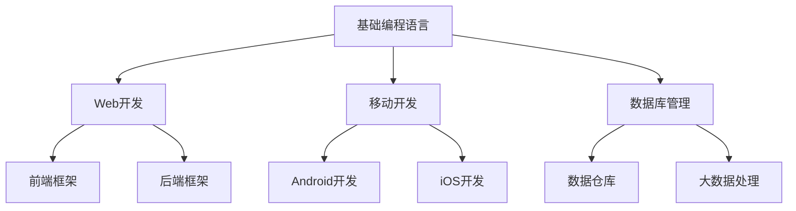
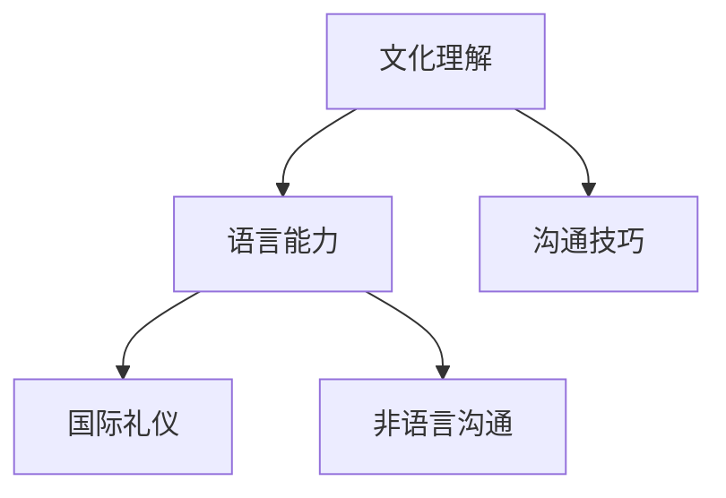
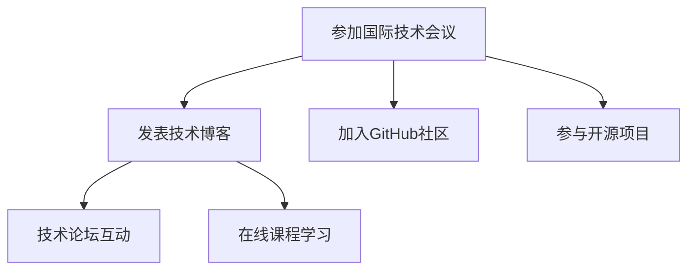

                 

 **关键词：** 国际化发展、程序员技能、跨文化沟通、全球技术社区、职业成长

**摘要：** 本篇文章将探讨程序员如何在全球化的技术环境中进行国际化发展。我们将从核心技能培养、跨文化沟通、国际技术社区参与等多个角度，为程序员提供一套系统性的发展策略，以帮助他们在全球范围内实现职业和个人成长。

## 1. 背景介绍

随着互联网技术的飞速发展，全球化的趋势愈加明显。技术公司不再局限于本地市场，而是通过云计算、大数据、人工智能等前沿技术，连接全球用户和开发者。在这样的背景下，程序员不仅要掌握核心技术，还需要具备国际视野和跨文化沟通能力。国际化发展已经成为程序员职业规划中的一个重要环节。

### 程序员国际化发展的必要性

- **市场机会：** 全球市场的拓展为程序员提供了更多的工作机会和发展空间。
- **技术交流：** 国际化的技术交流有助于程序员了解全球最前沿的技术趋势。
- **职业成长：** 国际化经历可以提升程序员的职业素养和领导力。
- **文化理解：** 跨文化沟通能力的提升有助于程序员在多元文化环境中工作。

## 2. 核心概念与联系

为了更好地理解国际化发展对程序员的重要性，我们首先需要明确几个核心概念：

### 2.1. 技术能力

技术能力是程序员国际化发展的基石。以下是一个Mermaid流程图，展示了不同技术领域之间的联系：



### 2.2. 跨文化沟通

跨文化沟通能力是程序员在国际环境中工作的关键。以下是一个Mermaid流程图，展示了跨文化沟通的核心要素：



### 2.3. 国际技术社区参与

国际技术社区的参与有助于程序员扩展视野和建立人脉。以下是一个Mermaid流程图，展示了参与国际技术社区的关键途径：



## 3. 核心算法原理 & 具体操作步骤

### 3.1 算法原理概述

国际化发展的算法原理可以概括为以下几个步骤：

1. **技能提升：** 通过不断学习和实践，提升自己在核心技术领域的专业能力。
2. **跨文化培训：** 参加跨文化沟通和礼仪培训，提升跨文化沟通能力。
3. **国际交流：** 积极参与国际技术会议和社区，拓展视野和建立人脉。
4. **国际化项目：** 参与国际化项目，积累实际工作经验。
5. **职业规划：** 根据个人兴趣和职业目标，制定国际化职业发展规划。

### 3.2 算法步骤详解

#### 3.2.1 技能提升

- **确定学习方向：** 根据职业规划，确定需要掌握的技术领域和技能。
- **持续学习：** 通过在线课程、技术书籍、实践项目等多种途径，不断提升自己的技术能力。
- **实战演练：** 通过实际项目锻炼自己的编程能力和问题解决能力。

#### 3.2.2 跨文化培训

- **参加培训：** 参加专业的跨文化沟通和礼仪培训课程。
- **学习语言：** 学习一门或多门外语，提升跨文化沟通能力。
- **实践交流：** 在国际化的工作环境中，积极与不同文化背景的同事进行交流。

#### 3.2.3 国际交流

- **参加技术会议：** 参加国际技术会议，了解全球技术趋势。
- **加入社区：** 加入GitHub、Stack Overflow等国际技术社区，与其他开发者交流。
- **分享经验：** 发表技术博客，分享自己的经验和见解。

#### 3.2.4 国际化项目

- **寻找机会：** 通过公司内部推荐、求职网站等途径，寻找国际化项目机会。
- **参与项目：** 在国际化项目中，积累实际工作经验，提升自己的职业素养。
- **拓展视野：** 通过项目合作，了解不同国家和地区的市场环境和文化特点。

#### 3.2.5 职业规划

- **制定目标：** 根据个人兴趣和职业目标，制定国际化职业发展规划。
- **持续反思：** 定期反思自己的职业发展，调整规划以适应市场变化。
- **寻求指导：** 寻找导师或职业规划师，获取专业的指导和建议。

### 3.3 算法优缺点

**优点：**

- **提升竞争力：** 国际化发展有助于程序员提升自己的市场竞争力。
- **拓展视野：** 国际化经历可以拓展程序员的视野，了解全球技术趋势。
- **职业发展：** 国际化发展有助于程序员在职业道路上取得更大的成就。

**缺点：**

- **语言障碍：** 国际化发展需要掌握多门外语，对程序员的语言能力要求较高。
- **文化差异：** 跨文化沟通可能遇到文化差异，需要程序员具备较高的适应能力。
- **时间和精力投入：** 国际化发展需要投入大量的时间和精力，对程序员的个人生活可能产生影响。

### 3.4 算法应用领域

国际化发展算法适用于以下领域：

- **跨国公司：** 在跨国公司工作，需要具备国际化视野和跨文化沟通能力。
- **国际项目：** 参与国际项目，需要具备全球协作能力和实际工作经验。
- **技术交流：** 参与全球技术交流，需要了解不同国家和地区的市场和技术趋势。

## 4. 数学模型和公式 & 详细讲解 & 举例说明

### 4.1 数学模型构建

国际化发展数学模型可以构建为以下公式：

$$
\text{国际化发展} = \text{技能提升} + \text{跨文化培训} + \text{国际交流} + \text{国际化项目} + \text{职业规划}
$$

### 4.2 公式推导过程

该公式反映了国际化发展的五个关键组成部分，每个部分都是实现国际化发展的必要条件。

### 4.3 案例分析与讲解

以下是一个国际化发展案例：

**案例：** 小明是一名年轻的程序员，他在国内一家知名互联网公司工作。为了提升自己的国际化发展，他采取了以下措施：

1. **技能提升：** 小明通过参加在线课程和实际项目，不断提升自己在Web开发和移动开发领域的技能。
2. **跨文化培训：** 小明参加了跨文化沟通和礼仪培训，学习了一门外语，提升了跨文化沟通能力。
3. **国际交流：** 小明参加了国际技术会议，加入了GitHub社区，与其他开发者进行了深入交流。
4. **国际化项目：** 小明参与了公司的国际化项目，积累了丰富的实际工作经验。
5. **职业规划：** 小明制定了国际化职业发展规划，并定期与导师沟通，调整自己的规划。

通过这些措施，小明在短时间内实现了国际化发展，取得了显著的职业成就。

## 5. 项目实践：代码实例和详细解释说明

### 5.1 开发环境搭建

为了更好地展示国际化发展的项目实践，我们选择了一个开源项目——一个多语言博客系统。

#### 环境要求

- 操作系统：Windows/Linux/Mac
- 编程语言：Python
- 开发工具：Visual Studio Code/PyCharm

### 5.2 源代码详细实现

以下是一个简单的多语言博客系统的源代码实现：

```python
# 博客系统入口文件

from flask import Flask, render_template, request
from models import BlogPost
from database import init_db

app = Flask(__name__)
init_db()

@app.route("/")
def index():
    posts = BlogPost.query.all()
    return render_template("index.html", posts=posts)

@app.route("/post/<int:post_id>")
def post_detail(post_id):
    post = BlogPost.query.get(post_id)
    return render_template("post_detail.html", post=post)

@app.route("/new_post", methods=["GET", "POST"])
def new_post():
    if request.method == "POST":
        title = request.form["title"]
        content = request.form["content"]
        post = BlogPost(title=title, content=content)
        db.session.add(post)
        db.session.commit()
        return redirect(url_for("index"))
    return render_template("new_post.html")

if __name__ == "__main__":
    app.run(debug=True)
```

### 5.3 代码解读与分析

这段代码是一个简单的多语言博客系统，主要包含以下几个部分：

1. **入口文件**：定义了博客系统的入口文件，包括创建Flask应用、初始化数据库等。
2. **路由配置**：配置了博客系统的路由规则，包括首页、文章详情页和新建文章页。
3. **模板渲染**：使用Flask的模板渲染功能，将数据传递给前端模板，实现页面显示。

### 5.4 运行结果展示

1. **首页**：展示所有博客文章的列表。
2. **文章详情页**：展示单篇博客文章的详细内容。
3. **新建文章页**：提供新建博客文章的表单，用户可以输入标题和内容，提交后文章会被保存到数据库。

通过这个简单的项目实践，我们可以看到国际化发展在实际项目中的应用。通过掌握多语言编程、数据库管理、Web开发等核心技能，程序员可以在全球范围内实现职业和个人成长。

## 6. 实际应用场景

国际化发展在程序员职业中的应用场景非常广泛，以下是一些典型的实际应用场景：

### 6.1 跨国公司

在跨国公司工作，程序员需要具备国际化视野和跨文化沟通能力。例如，在国际化的软件团队中，程序员需要与来自不同国家和地区的同事协作，共同完成项目任务。这要求程序员不仅需要掌握核心技术，还需要了解不同文化背景的沟通方式和团队协作技巧。

### 6.2 国际项目

参与国际项目是程序员国际化发展的另一重要途径。在国际项目中，程序员需要具备全球协作能力和实际工作经验。例如，跨国公司可能会在多个国家同时进行软件开发项目，程序员需要协调不同地区的团队成员，确保项目进度和质量。

### 6.3 技术交流

国际技术交流是程序员提升国际化视野的重要手段。通过参加国际技术会议、加入GitHub社区等，程序员可以了解全球技术趋势，与其他开发者交流经验，拓宽自己的技术视野。

### 6.4 远程办公

随着远程办公的普及，程序员可以在全球范围内选择工作地点。这种工作方式不仅为程序员提供了更多的工作机会，还让他们有机会在不同国家和地区的团队中工作，积累国际化经验。

## 7. 未来应用展望

随着全球化的进一步加深，国际化发展在程序员职业中的应用前景将更加广阔。以下是未来国际化发展的几个趋势：

### 7.1 技术融合

未来的技术发展将更加注重跨领域融合，程序员需要掌握多种技术，以应对复杂的应用场景。例如，大数据、人工智能、区块链等新兴技术与传统软件开发技术的融合，将推动程序员在国际化发展中不断探索新的应用场景。

### 7.2 跨文化协作

跨文化协作将成为程序员国际化发展的关键能力。随着跨国公司的增多和国际项目的增加，程序员需要具备更强的跨文化沟通能力和团队协作能力，以应对全球化带来的挑战。

### 7.3 在线教育

在线教育的兴起将为程序员提供更多学习资源和学习机会。通过在线课程、在线讲座等，程序员可以随时随地学习全球最前沿的技术知识，提升自己的国际化竞争力。

### 7.4 人才流动

未来，程序员将更加灵活地在全球范围内流动，寻找适合自己的职业机会。这种人才流动将促进全球技术人才的交流和融合，推动国际化发展。

## 8. 工具和资源推荐

为了帮助程序员实现国际化发展，我们推荐以下工具和资源：

### 8.1 学习资源推荐

- **在线课程平台：** Coursera、edX、Udemy等。
- **技术书籍：** 《深入理解计算机系统》、《算法导论》、《计算机网络：自顶向下方法》等。
- **技术博客：** Medium、Hacker News、GitHub Blog等。

### 8.2 开发工具推荐

- **集成开发环境：** Visual Studio Code、PyCharm、IntelliJ IDEA等。
- **代码管理工具：** Git、GitHub、GitLab等。
- **项目管理工具：** JIRA、Trello、Asana等。

### 8.3 相关论文推荐

- **人工智能领域：** "Deep Learning"、"Recurrent Neural Networks"等。
- **大数据领域：** "Hadoop: The Definitive Guide"、"Big Data: A Revolution That Will Transform How We Live, Work, and Think"等。
- **云计算领域：** "The Design of the UNIX Operating System"、"AWS: A Cloud Computing Platform"等。

## 9. 总结：未来发展趋势与挑战

### 9.1 研究成果总结

本文从核心技能培养、跨文化沟通、国际技术社区参与等多个角度，探讨了程序员如何实现国际化发展。通过技术能力提升、跨文化培训、国际交流、国际化项目参与和职业规划等步骤，程序员可以在全球范围内实现职业和个人成长。

### 9.2 未来发展趋势

未来，国际化发展将继续成为程序员职业规划中的重要方向。随着全球化的加深，程序员需要不断提升自己的国际化视野和跨文化沟通能力，以应对全球技术市场的变化。

### 9.3 面临的挑战

国际化发展面临的主要挑战包括语言障碍、文化差异和竞争压力。程序员需要通过不断学习和实践，克服这些挑战，实现自身的国际化发展。

### 9.4 研究展望

未来，我们需要进一步探讨国际化发展在不同领域的应用，研究如何更好地培养程序员的国际化视野和跨文化沟通能力。此外，我们还可以通过案例分析、实证研究等手段，为程序员的国际化发展提供更加具体和实用的指导。

## 10. 附录：常见问题与解答

### 10.1 如何提升跨文化沟通能力？

**解答：** 提升跨文化沟通能力的关键在于学习和实践。可以通过以下途径：

- 参加跨文化沟通和礼仪培训课程。
- 学习一门或多门外语，尤其是国际通用的语言，如英语、西班牙语等。
- 在实际工作中，积极参与跨文化团队协作，积累实际经验。
- 阅读相关书籍和资料，了解不同文化的特点和沟通技巧。

### 10.2 国际化发展需要哪些技术技能？

**解答：** 国际化发展需要的技术技能包括：

- 基础编程语言，如Python、Java、C++等。
- Web开发技术，如HTML、CSS、JavaScript等。
- 移动开发技术，如Android、iOS开发等。
- 数据库管理技术，如MySQL、MongoDB等。
- 云计算和大数据处理技术，如AWS、Hadoop等。

### 10.3 如何参与国际技术社区？

**解答：** 参与国际技术社区的方法包括：

- 加入GitHub、Stack Overflow、Reddit等国际知名技术社区。
- 参加国际技术会议和研讨会，与其他开发者交流。
- 发表技术博客，分享自己的经验和见解。
- 参与开源项目，为全球开发者贡献力量。

## 11. 作者署名

**作者：禅与计算机程序设计艺术 / Zen and the Art of Computer Programming**

---
本文基于开放知识共享许可（Creative Commons Attribution-ShareAlike 4.0 International License），欢迎转载和使用，但请注明作者和出处。

[返回目录](#目录)

