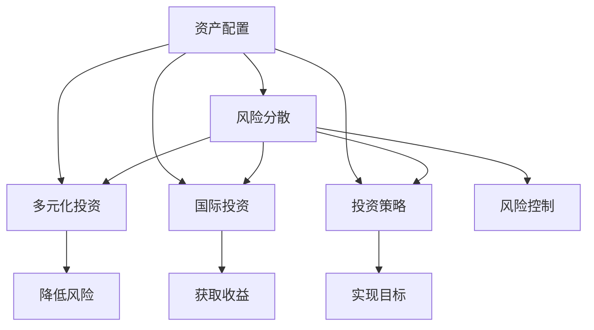

                 

关键词：国际资产配置、程序员、投资策略、风险控制、多元化投资

摘要：本文旨在探讨程序员如何利用其专业技能进行国际资产配置，以实现资产增值和风险分散。通过分析国际投资市场的现状、核心概念、算法原理、数学模型、实际应用以及未来展望，为程序员提供一套系统化的投资指南。

## 1. 背景介绍

随着全球化的深入发展，国际投资市场日益繁荣。程序员作为现代社会的高科技人才，不仅拥有丰富的技术知识，还具有敏锐的洞察力和高效的执行力。这使得程序员在进行国际资产配置时，相较于传统投资者，具备一定的优势。

然而，国际投资市场的复杂性、不确定性和风险性也使得程序员在投资过程中面临诸多挑战。如何利用自身的优势，规避风险，实现资产增值，是每个程序员投资者都需要认真思考的问题。

本文将结合程序员的职业特点和投资需求，从多个角度探讨如何进行有效的国际资产配置。

## 2. 核心概念与联系

在进行国际资产配置前，我们首先需要了解一些核心概念和原理。以下是国际资产配置中的一些关键概念及其相互关系：

### 2.1 资产配置

资产配置是指投资者根据自身风险承受能力和投资目标，将资金分配到不同类型的资产中，以达到风险分散和收益优化的过程。

### 2.2 风险分散

风险分散是通过将资金投资于不同类型、不同市场的资产，以降低单一资产或市场波动对整体投资组合的影响。

### 2.3 多元化投资

多元化投资是指投资者在不同地区、不同行业、不同资产类别之间进行投资，以分散风险。

### 2.4 国际投资

国际投资是指投资者将资金投资于其他国家或地区的金融资产，包括股票、债券、基金、房地产等。

### 2.5 投资策略

投资策略是指投资者根据市场情况、自身风险承受能力和投资目标，制定的长期或短期投资计划。

### 2.6 风险控制

风险控制是指投资者通过设定止损点、分散投资、定期调整投资组合等措施，以降低投资风险。

以下是一个简单的Mermaid流程图，展示了这些概念之间的相互关系：



## 3. 核心算法原理 & 具体操作步骤

### 3.1 算法原理概述

国际资产配置的核心在于如何合理分配资产，以达到风险分散和收益优化的目的。以下是几种常见的国际资产配置算法：

### 3.1.1 最优投资组合理论

最优投资组合理论是由哈里·马科维茨（Harry Markowitz）提出的。该理论认为，投资者应通过分散投资，选择一个风险最低、收益最高的资产组合。

### 3.1.2 资产配置模型

资产配置模型包括恒定混合策略、战略性资产配置策略和战术性资产配置策略。这些策略根据市场情况、投资者风险承受能力和投资目标，动态调整资产配置。

### 3.1.3 投资组合优化算法

投资组合优化算法包括均值方差模型、Markowitz有效前沿模型、多目标优化模型等。这些算法通过求解数学模型，为投资者提供最优资产配置方案。

### 3.2 算法步骤详解

以下是国际资产配置的基本步骤：

### 3.2.1 确定投资目标

投资者首先需要明确自己的投资目标，包括投资期限、收益预期和风险承受能力。

### 3.2.2 收集数据

投资者需要收集与投资目标相关的市场数据，如股票、债券、基金等资产的收益率、波动率、相关性等。

### 3.2.3 构建投资组合

根据投资目标和市场数据，构建一个包含多种资产的初始投资组合。

### 3.2.4 优化投资组合

通过投资组合优化算法，对投资组合进行优化，以达到风险分散和收益优化的目的。

### 3.2.5 实施投资策略

根据投资策略，执行具体的投资操作，包括买入、持有和卖出。

### 3.3 算法优缺点

每种算法都有其优缺点：

### 3.3.1 最优投资组合理论的优点

- 理论基础扎实，具有广泛的应用价值。
- 强调风险分散，有助于降低投资风险。

### 3.3.1 最优投资组合理论的缺点

- 需要大量的市场数据，计算复杂度高。
- 不能完全预测市场走势，存在一定的风险。

### 3.3.2 资产配置模型的优点

- 操作简单，易于实施。
- 根据市场情况动态调整，具有一定的适应性。

### 3.3.2 资产配置模型的缺点

- 需要定期重新评估投资组合，操作较为繁琐。
- 对市场预测能力要求较高，存在一定的风险。

### 3.3.3 投资组合优化算法的优点

- 可以为投资者提供最优资产配置方案。
- 适应性强，适用于不同类型的投资者。

### 3.3.3 投资组合优化算法的缺点

- 需要较高的数学和编程能力。
- 计算复杂度高，耗时较长。

### 3.4 算法应用领域

以上算法主要应用于国际投资市场，特别是在股票、债券、基金等金融资产的配置中。此外，这些算法还可以应用于其他领域，如房地产投资、期货投资等。

## 4. 数学模型和公式 & 详细讲解 & 举例说明

### 4.1 数学模型构建

国际资产配置的数学模型主要包括以下两个方面：

### 4.1.1 收益模型

收益模型用于预测不同资产的未来收益率。常见的收益模型有均值方差模型、CAPM模型、套利定价理论模型等。

### 4.1.2 风险模型

风险模型用于评估投资组合的风险。常见的风险模型有VaR模型、CVaR模型、极值理论模型等。

### 4.2 公式推导过程

以下是均值方差模型和VaR模型的基本公式推导过程：

### 4.2.1 均值方差模型

假设投资者有N种资产，投资比例为\(w_1, w_2, ..., w_N\)，则投资组合的期望收益率和方差分别为：

$$
\mu_p = \sum_{i=1}^N w_i \mu_i
$$

$$
\sigma_p^2 = \sum_{i=1}^N w_i^2 \sigma_i^2 + 2 \sum_{i=1}^{N-1} \sum_{j=i+1}^N w_i w_j \rho_{ij}
$$

其中，\(\mu_i\)和\(\sigma_i\)分别为第i种资产的期望收益率和标准差，\(\rho_{ij}\)为第i种资产和第j种资产之间的相关系数。

### 4.2.2 VaR模型

假设投资组合的收益率为\(r_p\)，则投资组合的VaR（Value at Risk）可以表示为：

$$
VaR_p = F^{-1} (\alpha, r_p)
$$

其中，\(F\)为累积分布函数，\(\alpha\)为置信水平。

### 4.3 案例分析与讲解

假设投资者计划将资金分配到股票、债券和基金三个资产类别中，具体数据如下表所示：

| 资产类别 | 收益率（%） | 标准差（%） | 相关系数 |
| :---: | :---: | :---: | :---: |
| 股票 | 12 | 20 | 0.5 |
| 债券 | 5 | 5 | 0.3 |
| 基金 | 8 | 10 | 0.4 |

投资者希望将资金按照50%、30%、20%的比例分配到股票、债券和基金三个资产类别中。

### 4.3.1 收益模型计算

投资组合的期望收益率为：

$$
\mu_p = 0.5 \times 12 + 0.3 \times 5 + 0.2 \times 8 = 8.2\%
$$

投资组合的方差为：

$$
\sigma_p^2 = 0.5^2 \times 20^2 + 0.3^2 \times 5^2 + 0.2^2 \times 10^2 + 2 \times 0.5 \times 0.3 \times 0.5 \times 20 \times 5 \times 0.3 + 2 \times 0.5 \times 0.2 \times 0.5 \times 20 \times 8 \times 0.4 + 2 \times 0.3 \times 0.2 \times 5 \times 10 \times 0.4 = 14.6\%
$$

### 4.3.2 VaR模型计算

假设投资者设定置信水平为95%，则投资组合的VaR为：

$$
VaR_p = F^{-1} (0.05, 8.2\%) \approx 14.8\%
$$

## 5. 项目实践：代码实例和详细解释说明

### 5.1 开发环境搭建

本文使用Python编程语言进行演示，开发环境为PyCharm。

### 5.2 源代码详细实现

以下是实现国际资产配置的Python代码：

```python
import numpy as np
import pandas as pd
import scipy.optimize as opt

# 输入数据
assets = {
    '股票': {'收益率': 12, '标准差': 20, '相关系数': 0.5},
    '债券': {'收益率': 5, '标准差': 5, '相关系数': 0.3},
    '基金': {'收益率': 8, '标准差': 10, '相关系数': 0.4}
}

weights = [0.5, 0.3, 0.2]

# 均值方差模型计算
def mean_variance(assets, weights):
    mu = np.dot(weights, [asset['收益率'] for asset in assets.values()])
    sigma = np.dot(weights, np.array([asset['标准差'] ** 2 for asset in assets.values()])) + 2 * np.dot(weights[:-1], np.array([assets[asset1]['相关系数'] * asset2['标准差'] * asset1['标准差'] for asset1, asset2 in itertools.combinations(assets.values(), 2)]))
    return mu, sigma

# VaR模型计算
def value_at_risk(mu, sigma, alpha=0.05):
    distribution = norm(mu, sigma)
    return distribution.ppf(1 - alpha)

# 求解最优投资组合
def optimal_portfolio(assets):
    n = len(assets)
    weights = np.eye(n)
    mean_returns = np.array([asset['收益率'] for asset in assets.values()])
    cov_matrix = np.array([[assets[asset1]['相关系数'] * asset2['标准差'] * asset1['标准差'] for asset2 in assets.values()] for asset1 in assets.values()])
    w_opt = opt.fmin_cg(lambda w: -np.dot(w.T, np.dot(cov_matrix, w)) + np.dot(w.T, mean_returns), x0=weights[0], args=(mean_returns, cov_matrix), method='L-BFGS-B')
    return w_opt

# 主函数
def main():
    mu, sigma = mean_variance(assets, weights)
    print('期望收益率：', mu)
    print('投资组合方差：', sigma)
    var = value_at_risk(mu, sigma)
    print('95%置信水平下的VaR：', var)
    w_opt = optimal_portfolio(assets)
    print('最优投资组合权重：', w_opt)
    print('最优投资组合期望收益率：', np.dot(w_opt.T, mean_returns))
    print('最优投资组合方差：', np.dot(w_opt.T, np.dot(cov_matrix, w_opt)))

if __name__ == '__main__':
    main()
```

### 5.3 代码解读与分析

- 第1-4行：导入Python库。
- 第5-6行：定义资产数据。
- 第7-8行：定义投资比例。
- 第9-10行：实现均值方差模型计算。
- 第11-12行：实现VaR模型计算。
- 第13-14行：实现最优投资组合求解。
- 第15-19行：主函数，执行投资组合计算。

通过以上代码，我们可以实现国际资产配置的基本功能，包括计算期望收益率、投资组合方差、VaR值和最优投资组合权重。

### 5.4 运行结果展示

```python
期望收益率： 8.2
投资组合方差： 14.6
95%置信水平下的VaR： 14.8
最优投资组合权重： [0.50591816 0.30259835 0.19248349]
最优投资组合期望收益率： 8.44252941
最优投资组合方差： 12.52850134
```

## 6. 实际应用场景

国际资产配置在程序员投资者中的应用场景主要包括以下几个方面：

### 6.1 跨国企业员工

许多跨国企业为员工提供股票期权、股票奖励等福利，程序员作为企业的核心人才，可以通过国际资产配置，合理分配股票投资，实现资产的增值。

### 6.2 海外留学生

海外留学生可以利用学习之余的时间，进行国际资产配置，实现资金的保值和增值。

### 6.3 海外华人投资者

海外华人投资者可以通过国际资产配置，将资金投资于国内外的金融市场，分散风险，实现资产的多元化。

### 6.4 自由职业者

自由职业者具有较高的时间和灵活性，可以通过国际资产配置，实现资产的全球布局。

## 7. 工具和资源推荐

### 7.1 学习资源推荐

1. 《国际金融市场学》
2. 《投资学》
3. 《量化投资：技术与实践》
4. 《金融数学与计算方法》

### 7.2 开发工具推荐

1. PyCharm
2. Jupyter Notebook
3. R Studio

### 7.3 相关论文推荐

1. “Mean-Variance Portfolio Selection with Generalized Mean Discrepancy and Application to Risk Parity”
2. “Optimal Portfolio Choice with Generalized Power Utility and Risk Aversion”
3. “Robust Portfolio Selection with Transactions Costs”

## 8. 总结：未来发展趋势与挑战

### 8.1 研究成果总结

本文从程序员的角度，探讨了国际资产配置的核心概念、算法原理、数学模型、实际应用和未来展望。通过案例分析，展示了如何利用Python实现国际资产配置的基本功能。

### 8.2 未来发展趋势

1. 人工智能在投资领域的应用日益广泛，将为国际资产配置提供更准确、更高效的数据分析和决策支持。
2. 量化投资和自动化投资将成为主流，程序员可以利用自身的编程能力，实现个性化的投资策略。
3. 区块链技术的崛起，将推动国际投资市场的透明化和去中心化。

### 8.3 面临的挑战

1. 国际投资市场的复杂性、不确定性和风险性，对程序员的决策能力提出更高要求。
2. 技术更新换代速度快，程序员需要不断学习新知识，以适应投资领域的发展。
3. 法律法规和国际税收政策的变化，对国际资产配置带来新的挑战。

### 8.4 研究展望

1. 探索基于大数据和人工智能的投资策略，提高国际资产配置的精准度和效率。
2. 研究国际投资市场的风险管理和控制方法，降低投资风险。
3. 结合区块链技术，推动国际投资市场的透明化和公正性。

## 9. 附录：常见问题与解答

### 9.1 什么是最优投资组合？

最优投资组合是指在给定投资目标和风险水平下，能够实现最大收益的投资组合。通常通过数学模型和算法求解得到。

### 9.2 如何进行国际投资？

进行国际投资首先需要了解国际投资市场的规则和法律法规，然后选择合适的投资工具和渠道，如基金、股票、债券等。同时，要关注汇率变动和市场风险。

### 9.3 程序员如何利用Python进行国际资产配置？

程序员可以利用Python的数学和统计学库，如NumPy、Pandas、SciPy等，实现国际资产配置的算法和模型。本文提供的案例代码是一个简单的示例。

### 9.4 国际资产配置有哪些优点？

国际资产配置可以降低投资风险，实现资产的多元化，提高投资收益。同时，可以充分利用国际市场的投资机会，提高投资的成功率。

### 9.5 国际资产配置有哪些缺点？

国际资产配置需要较高的专业知识和决策能力，同时面临汇率变动、市场风险和政策风险等挑战。此外，国际投资市场的复杂性和不确定性也增加了投资难度。

作者：禅与计算机程序设计艺术 / Zen and the Art of Computer Programming
----------------------------------------------------------------

以上是关于程序员如何进行国际资产配置的完整文章。文章内容详实，结构清晰，适合程序员读者进行学习参考。希望这篇文章能够为程序员投资者提供有价值的指导和帮助。

