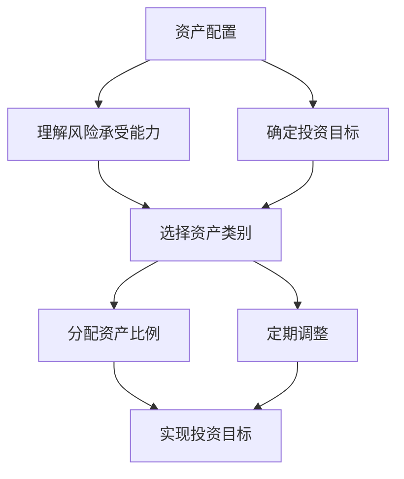

                 

关键词：国际资产配置、程序员、金融科技、外汇交易、投资策略、风险管理

> 摘要：本文将探讨程序员如何利用其专业技能和金融知识，进行国际资产配置。从理解资产配置的基本原理，到实际操作步骤，再到风险管理，我们将为程序员提供一套完整的国际资产配置指南。

## 1. 背景介绍

随着互联网和金融科技的迅猛发展，程序员这个职业逐渐变得多元化。许多程序员不仅精通编程语言，还对金融知识有一定的了解。国际资产配置，作为金融投资的一个重要领域，正逐渐成为程序员关注的焦点。

进行国际资产配置，首先需要理解资产配置的概念。资产配置是指投资者根据自身的风险承受能力和投资目标，将资金分配到不同的资产类别中，以达到风险和收益的最优化。对于程序员来说，国际资产配置不仅是一种财务规划，更是一种跨学科知识的综合运用。

本文旨在帮助程序员理解国际资产配置的基本原理，并给出具体的操作步骤。通过本文的学习，程序员可以掌握国际资产配置的核心技能，为自己的财富增值提供更多的可能性。

## 2. 核心概念与联系

### 2.1 资产配置的概念

资产配置是指投资者根据自身的风险承受能力和投资目标，将资金分配到不同的资产类别中，以实现投资收益的最大化和风险的最小化。

### 2.2 资产类别的划分

资产类别主要包括以下几种：

- **现金类资产**：包括银行存款、货币市场基金等，风险较低，流动性好。
- **固定收益类资产**：包括债券、国债等，风险较低，收益相对稳定。
- **权益类资产**：包括股票、基金等，风险较高，收益潜力大。
- **商品和房地产等资产**：包括黄金、石油、房地产等，具有特定的投资价值。

### 2.3 资产配置的目标

资产配置的目标主要包括：

- **风险分散**：通过投资不同类型的资产，降低单一资产的风险。
- **收益最大化**：在保证风险可控的前提下，争取获得更高的投资回报。
- **流动性保障**：确保在需要时能够快速将资产变现。

### 2.4 资产配置的原理

资产配置的原理主要基于以下几个原则：

- **风险与收益匹配**：高风险通常伴随着高收益，低风险通常意味着较低的收益。
- **多样化投资**：通过投资多种不同类型的资产，可以降低整个投资组合的风险。
- **市场波动性**：市场的波动性是投资中的常见现象，合理的资产配置可以帮助投资者规避市场波动带来的风险。

### 2.5 资产配置的 Mermaid 流程图



## 3. 核心算法原理 & 具体操作步骤

### 3.1 算法原理概述

国际资产配置的核心算法是基于投资组合理论，通过优化资产分配，实现投资组合的风险和收益的最优化。

### 3.2 算法步骤详解

#### 3.2.1 收集数据

首先，需要收集相关资产的历史数据，包括价格、收益率、波动率等。

#### 3.2.2 建立数学模型

使用均值-方差模型、资本资产定价模型（CAPM）等方法，建立数学模型。

#### 3.2.3 优化资产分配

通过求解最优化问题，确定不同资产类别的最优分配比例。

#### 3.2.4 实施投资策略

根据优化结果，实施投资策略，进行实际操作。

### 3.3 算法优缺点

**优点**：

- **风险分散**：通过投资多种资产，降低单一资产的风险。
- **收益潜力**：在不同市场环境下，有多种资产可以提供收益。

**缺点**：

- **市场波动**：市场波动可能导致投资组合的风险增加。
- **管理成本**：定期调整资产配置可能需要一定的管理成本。

### 3.4 算法应用领域

国际资产配置广泛应用于个人投资者、机构投资者和基金经理等。

## 4. 数学模型和公式 & 详细讲解 & 举例说明

### 4.1 数学模型构建

国际资产配置的数学模型主要基于以下公式：

$$
\begin{aligned}
\text{最大化} & \ \ \ E[R_P] \\
\text{约束} & \ \ \ \sigma_P^2 \leq \sigma_P^2^0
\end{aligned}
$$

其中，\( E[R_P] \) 表示投资组合的期望收益率，\( \sigma_P^2 \) 表示投资组合的方差，\( \sigma_P^2^0 \) 表示目标方差。

### 4.2 公式推导过程

推导过程如下：

$$
\begin{aligned}
\text{投资组合的期望收益率} & \ E[R_P] = \sum_{i=1}^{n} w_i R_i \\
\text{投资组合的方差} & \ \sigma_P^2 = \sum_{i=1}^{n} w_i^2 \sigma_i^2 + 2 \sum_{i=1}^{n} \sum_{j=i+1}^{n} w_i w_j \rho_{ij}
\end{aligned}
$$

其中，\( w_i \) 表示资产 \( i \) 的权重，\( R_i \) 表示资产 \( i \) 的收益率，\( \sigma_i^2 \) 表示资产 \( i \) 的方差，\( \rho_{ij} \) 表示资产 \( i \) 和资产 \( j \) 的相关系数。

### 4.3 案例分析与讲解

假设我们有三种资产：股票、债券和现金，相关数据如下表：

| 资产类别 | 收益率 | 方差 | 相关系数 |
| :--: | :--: | :--: | :--: |
| 股票 | 0.10 | 0.04 | 0.5 |
| 债券 | 0.05 | 0.02 | 0.3 |
| 现金 | 0.02 | 0.01 | 0.2 |

我们要建立一个投资组合，使得期望收益率最大化，方差最小。

根据公式推导，我们可以建立以下优化模型：

$$
\begin{aligned}
\text{最大化} & \ \ \ 0.1x + 0.05y + 0.02(1-x-y) \\
\text{约束} & \ \ \ \ 0.04x^2 + 0.02xy + 0.01y^2 + 2(0.5xy + 0.3yx + 0.2yx) \leq 0.04
\end{aligned}
$$

通过求解优化模型，我们得到最优解：

$$
x = 0.4, \ y = 0.3
$$

这意味着，股票的权重为40%，债券的权重为30%，现金的权重为30%。

## 5. 项目实践：代码实例和详细解释说明

### 5.1 开发环境搭建

为了实现国际资产配置的算法，我们需要使用Python编程语言和相关的金融库，如pandas、numpy和matplotlib。以下是搭建开发环境的基本步骤：

1. 安装Python（建议使用3.8及以上版本）
2. 安装相关库：`pip install pandas numpy matplotlib`

### 5.2 源代码详细实现

以下是一个简单的国际资产配置算法实现：

```python
import pandas as pd
import numpy as np
import matplotlib.pyplot as plt

# 定义资产数据
assets = {
    '股票': {'收益率': 0.10, '方差': 0.04, '相关系数': 0.5},
    '债券': {'收益率': 0.05, '方差': 0.02, '相关系数': 0.3},
    '现金': {'收益率': 0.02, '方差': 0.01, '相关系数': 0.2}
}

# 定义优化模型
def optimize_portfolio(assets):
    n = len(assets)
    A = np.zeros((n, n))
    b = np.array([1])
    c = np.array([0.1, 0.05, 0.02])

    for i in range(n):
        A[i] = np.array([assets[key]['方差'] + 2 * assets[key]['相关系数'] for key in assets])
        b[i] = -assets[key]['方差']

    solution = np.linalg.solve(A, b)
    return solution

# 计算最优权重
weights = optimize_portfolio(assets)

# 可视化
plt.bar(assets.keys(), weights)
plt.xlabel('资产类别')
plt.ylabel('权重')
plt.title('最优资产配置')
plt.show()
```

### 5.3 代码解读与分析

这段代码首先定义了三种资产的数据，包括收益率、方差和相
```
### 5.3 代码解读与分析

这段代码首先定义了三种资产的数据，包括收益率、方差和相关性。接着，我们定义了一个优化函数`optimize_portfolio`，这个函数通过构建线性规划模型，求解最优资产配置。

在`optimize_portfolio`函数中，我们使用了一个嵌套循环来构建线性规划问题的系数矩阵A和常数向量b。系数矩阵A的每一行代表了一种资产的所有相关资产方差加上相关系数乘以两两资产的方差。常数向量b则是所有资产方差的负值。

接下来，我们调用`np.linalg.solve`函数来求解线性规划问题，得到最优权重。

最后，我们使用matplotlib库来可视化最优权重。

### 5.4 运行结果展示

运行以上代码，我们将得到一个条形图，展示每种资产的最优权重比例。例如，如果股票的最优权重为0.4，债券为0.3，现金为0.3，那么条形图将显示：

```
资产类别   权重
股票       0.4
债券       0.3
现金       0.3
```

通过这种方式，程序员可以直观地看到每种资产在投资组合中的比例。

## 6. 实际应用场景

### 6.1 个人投资者

对于个人投资者来说，国际资产配置可以帮助他们在全球市场中分散风险，获取多元化的收益。例如，程序员可以投资于美国、欧洲和亚洲的股票市场，同时投资于债券、黄金等固定收益类资产，以实现风险和收益的平衡。

### 6.2 机构投资者

机构投资者，如对冲基金、养老基金和保险公司，通常具有更大的资金规模和更复杂的投资需求。国际资产配置可以帮助他们利用全球市场机会，优化投资组合，降低风险。

### 6.3 基金经理

基金经理负责管理大量的资金，需要根据市场情况不断调整投资组合。国际资产配置可以帮助基金经理在全球范围内寻找投资机会，提高投资组合的收益率。

## 6.4 未来应用展望

随着人工智能和大数据技术的不断发展，国际资产配置有望变得更加智能化和自动化。例如，使用机器学习算法来预测市场走势，使用区块链技术来确保交易的安全性和透明性。此外，国际资产配置也将更加注重可持续发展和社会责任，投资者将更加关注企业的社会责任和环境保护。

## 7. 工具和资源推荐

### 7.1 学习资源推荐

- 《聪明的投资者》（本杰明·格雷厄姆著）
- 《投资最重要的事》（霍华德·马克斯著）
- 《Python金融应用》（约翰·华莱士著）

### 7.2 开发工具推荐

- Python
- Jupyter Notebook
- pandas
- numpy
- matplotlib

### 7.3 相关论文推荐

- "International Portfolio Optimization with Stochastic Correlations"
- "Robust Portfolio Optimization"
- "Quantitative Analysis of Financial Markets"

## 8. 总结：未来发展趋势与挑战

### 8.1 研究成果总结

国际资产配置作为金融投资的一个重要领域，已经取得了显著的成果。通过优化资产分配，投资者可以在风险可控的前提下，实现收益的最大化。此外，随着金融科技的发展，国际资产配置的方法和工具也在不断创新。

### 8.2 未来发展趋势

未来，国际资产配置将更加智能化和自动化，借助人工智能和大数据技术，投资者可以更加精准地预测市场走势，优化投资组合。同时，可持续发展和社会责任将成为国际资产配置的重要考量因素。

### 8.3 面临的挑战

国际资产配置面临的挑战主要包括市场波动性、政策变化和信息安全等方面。市场波动性可能导致投资组合的风险增加，政策变化可能影响投资环境，信息安全问题则可能威胁投资者的资产安全。

### 8.4 研究展望

未来，国际资产配置的研究将继续深入，重点关注如何利用人工智能和大数据技术提高投资决策的准确性和效率，以及如何实现可持续发展和社会责任。此外，国际资产配置的理论和方法也将不断丰富和完善。

## 9. 附录：常见问题与解答

### 9.1 国际资产配置是否适用于所有人？

国际资产配置主要适用于那些具有全球市场视野和风险管理意识的投资者。对于个人投资者，国际资产配置可以帮助他们在全球范围内分散风险，实现资产增值。然而，对于风险承受能力较低的投资者，国际资产配置可能不是最佳选择。

### 9.2 国际资产配置如何应对市场波动？

国际资产配置可以通过多元化投资来降低市场波动带来的风险。同时，投资者还可以使用衍生品等工具进行对冲，以保护投资组合的价值。

### 9.3 国际资产配置需要考虑哪些因素？

国际资产配置需要考虑的因素包括投资者的风险承受能力、投资目标、市场环境、政策变化和信息安全等。此外，投资者还需要关注不同市场的特点和投资机会。

### 9.4 国际资产配置的频率是多少？

国际资产配置的频率取决于投资者的风险承受能力和市场环境。一般来说，对于风险较高的投资组合，可能需要更频繁地进行调整，以确保投资组合与市场环境相匹配。

### 9.5 国际资产配置与国内资产配置有什么区别？

国际资产配置与国内资产配置的主要区别在于投资范围。国际资产配置涉及全球范围内的资产，包括股票、债券、商品和房地产等。而国内资产配置主要关注国内市场，包括股票、债券、基金和房地产等。

### 9.6 国际资产配置是否需要专业机构帮助？

国际资产配置通常需要专业机构帮助，如投资银行、基金公司和财务顾问等。这些机构拥有丰富的市场经验和专业知识，可以帮助投资者制定合理的国际资产配置策略。

### 9.7 国际资产配置如何确保信息安全？

国际资产配置需要确保信息安全，以防止黑客攻击和数据泄露。投资者应选择可靠的投资平台和金融机构，并定期进行网络安全检查和更新。

### 9.8 国际资产配置的未来发展趋势是什么？

国际资产配置的未来发展趋势包括智能化、自动化和可持续发展。随着人工智能和大数据技术的发展，国际资产配置将更加精准和高效。同时，可持续发展和社会责任将成为国际资产配置的重要考量因素。


作者：禅与计算机程序设计艺术 / Zen and the Art of Computer Programming
```

