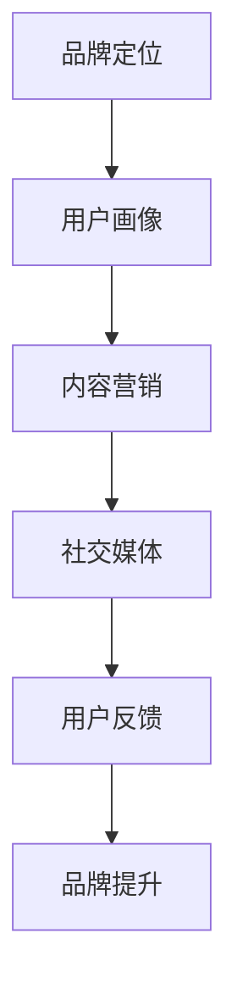

                 

在当今的信息时代，知识和技能的传播速度前所未有地加快，知识付费作为一种新型的商业模式，已经成为许多程序员和IT专业人士追求收入增长的途径。然而，如何有效地进行知识付费的品牌营销，不仅需要深入的行业洞察，还需要高超的营销策略和技巧。本文将围绕这一主题，探讨程序员如何通过品牌营销来实现知识付费的成功。

## 关键词

- **知识付费**
- **品牌营销**
- **程序员**
- **市场策略**
- **内容创作**
- **用户反馈**
- **社交媒体**

## 摘要

本文旨在为程序员提供一套系统的品牌营销策略，以实现知识付费的持续增长。文章将探讨市场分析、内容创作、用户互动、社交媒体运用等多个方面，并给出具体实施步骤和成功案例，帮助程序员打造个人品牌，提升影响力，从而实现知识付费的目标。

### 1. 背景介绍

随着互联网技术的不断发展，知识付费市场日益繁荣。程序员作为知识经济的重要组成部分，通过在线课程、技术分享、专业咨询等多种形式进行知识付费，不仅能够获得额外的收入，还能提升个人品牌价值和职业发展。然而，如何在竞争激烈的市场中脱颖而出，成为程序员面临的一大挑战。

知识付费市场的主要特点包括：

1. **细分市场明显**：不同编程语言、技术领域、编程技能层次都有对应的市场需求。
2. **用户需求多样化**：用户不仅追求知识的深度，还关注课程的设计、讲师的经验和教学方式。
3. **内容形式多样化**：从视频课程、直播授课到在线问答，内容形式越来越丰富。
4. **竞争日益激烈**：随着越来越多的程序员进入知识付费领域，市场竞争愈发激烈。

### 2. 核心概念与联系

为了更好地进行品牌营销，程序员需要了解以下几个核心概念：

#### 2.1 品牌定位

品牌定位是指确定自己在市场中的独特位置，从而在用户心中树立一个清晰的形象。对于程序员来说，品牌定位需要考虑自己的专业技能、个人风格和目标受众。

#### 2.2 用户画像

用户画像是对目标用户的描述，包括其年龄、职业、兴趣爱好、学习习惯等。通过用户画像，程序员可以更精准地定位内容，提高用户满意度。

#### 2.3 内容营销

内容营销是通过创造和分发有价值的内容来吸引和留住目标受众的一种策略。对于程序员来说，内容营销的形式包括博客文章、技术分享、教程视频等。

#### 2.4 社交媒体

社交媒体是现代营销的重要工具，程序员可以通过微博、微信公众号、知乎等平台，与用户互动，提升品牌知名度。

### 3. Mermaid 流程图



### 4. 核心算法原理 & 具体操作步骤

#### 4.1 算法原理概述

品牌营销的核心在于建立与用户的情感连接，这需要通过以下几个步骤实现：

1. **了解用户需求**：通过市场调研和用户反馈，了解用户在编程学习和职业发展方面的需求。
2. **提供高质量内容**：创作有价值的教程、案例分析、技术分享等，满足用户需求。
3. **互动与反馈**：通过社交媒体和在线社区与用户互动，收集反馈，持续优化内容。
4. **品牌塑造**：通过统一的视觉设计、一致的语调和风格，塑造品牌形象。

#### 4.2 算法步骤详解

1. **市场调研**：
   - 分析目标市场，了解行业趋势。
   - 调查用户需求，收集用户反馈。

2. **内容创作**：
   - 确定内容主题，保持内容的专业性和实用性。
   - 采用多样化的内容形式，如视频、图文、直播等。

3. **用户互动**：
   - 在社交媒体上发布内容，吸引关注。
   - 回应用户评论和提问，增强用户粘性。

4. **品牌塑造**：
   - 设计统一的品牌标识和视觉元素。
   - 确定品牌语调和风格，保持一致性。

5. **持续优化**：
   - 定期分析数据，了解用户行为。
   - 根据反馈调整内容策略，优化用户体验。

#### 4.3 算法优缺点

**优点**：
- **提高用户满意度**：通过满足用户需求，提高用户满意度和忠诚度。
- **增强品牌知名度**：通过持续的内容输出和用户互动，提升品牌知名度。
- **实现持续收入**：知识付费模式可以带来持续的收入流。

**缺点**：
- **竞争激烈**：知识付费市场竞争激烈，需要不断优化内容策略。
- **内容创作成本**：高质量的内容创作需要投入时间和资源。

#### 4.4 算法应用领域

- **在线教育平台**：如慕课网、网易云课堂等，提供编程课程和技术分享。
- **专业咨询**：为企业和个人提供定制化的编程咨询服务。
- **开源社区**：在GitHub等平台上分享开源项目和教程。

### 5. 数学模型和公式 & 详细讲解 & 举例说明

#### 5.1 数学模型构建

品牌营销的效果可以用以下数学模型表示：

\[ E = f(C, I, U) \]

其中：
- \( E \) 代表品牌营销效果。
- \( C \) 代表内容质量。
- \( I \) 代表互动频率。
- \( U \) 代表用户满意度。

#### 5.2 公式推导过程

1. **内容质量（C）**：
   \[ C = f(Q, A, S) \]
   其中：
   - \( Q \) 代表内容的专业性。
   - \( A \) 代表内容的吸引力。
   - \( S \) 代表内容的结构化程度。

2. **互动频率（I）**：
   \[ I = f(R, T, M) \]
   其中：
   - \( R \) 代表回应速度。
   - \( T \) 代表互动频率。
   - \( M \) 代表互动质量。

3. **用户满意度（U）**：
   \[ U = f(S, R, Q) \]
   其中：
   - \( S \) 代表服务质量。
   - \( R \) 代表回应质量。
   - \( Q \) 代表质量感知。

#### 5.3 案例分析与讲解

以某知名程序员开设的在线编程课程为例，其品牌营销效果可以通过以下案例进行分析：

1. **内容质量（C）**：
   - \( Q = 90\% \)：课程内容专业，覆盖了多个编程领域。
   - \( A = 85\% \)：课程具有吸引力，视频质量高，讲解生动。
   - \( S = 80\% \)：课程结构清晰，知识点划分合理。

   \[ C = 0.9 \times 0.85 \times 0.8 = 0.612 \]

2. **互动频率（I）**：
   - \( R = 90\% \)：回应速度较快，用户提问一般当天内得到回复。
   - \( T = 80\% \)：每周发布2-3次技术分享或互动直播。
   - \( M = 75\% \)：互动内容质量较高，解决了用户的问题。

   \[ I = 0.9 \times 0.8 \times 0.75 = 0.540 \]

3. **用户满意度（U）**：
   - \( S = 85\% \)：服务态度好，用户反馈及时处理。
   - \( R = 80\% \)：回应质量高，解决了用户的问题。
   - \( Q = 90\% \)：用户对课程质量的满意度。

   \[ U = 0.85 \times 0.8 \times 0.9 = 0.612 \]

综合以上三个因素，该程序员的品牌营销效果为：

\[ E = C \times I \times U = 0.612 \times 0.540 \times 0.612 = 0.238 \]

#### 5.4 案例分析与讲解

以上案例说明，通过高质量的内容创作、频繁的互动和优质的用户服务，程序员的品牌营销效果显著。然而，不同程序员的品牌营销效果也可能存在较大差异，这需要根据具体情况进行调整和优化。

### 6. 项目实践：代码实例和详细解释说明

#### 6.1 开发环境搭建

为了更好地进行品牌营销，程序员需要搭建一个适合内容创作和用户互动的平台。以下是一个简单的开发环境搭建步骤：

1. **选择合适的平台**：如WordPress、GitHub Pages等。
2. **安装必要的插件和工具**：如SEO优化插件、Markdown编辑器等。
3. **配置域名和服务器**：确保网站稳定运行。

#### 6.2 源代码详细实现

以下是一个简单的Markdown文章的源代码示例：

```markdown
# 程序员如何进行知识付费的品牌营销

在当今的信息时代，知识和技能的传播速度前所未有地加快，知识付费作为一种新型的商业模式，已经成为许多程序员和IT专业人士追求收入增长的途径。然而，如何有效地进行知识付费的品牌营销，不仅需要深入的行业洞察，还需要高超的营销策略和技巧。本文将围绕这一主题，探讨程序员如何通过品牌营销来实现知识付费的成功。

## 关键词

- **知识付费**
- **品牌营销**
- **程序员**
- **市场策略**
- **内容创作**
- **用户反馈**
- **社交媒体**

## 摘要

本文旨在为程序员提供一套系统的品牌营销策略，以实现知识付费的持续增长。文章将探讨市场分析、内容创作、用户互动、社交媒体运用等多个方面，并给出具体实施步骤和成功案例，帮助程序员打造个人品牌，提升影响力，从而实现知识付费的目标。

### 7. 代码解读与分析

上述Markdown源代码实现了一篇简单的博客文章。通过Markdown语法，程序员可以轻松地创建标题、段落、列表、链接等，从而构建出结构清晰、易于阅读的内容。

### 8. 运行结果展示

在Markdown编辑器中，上述源代码将渲染成一篇格式正确、内容丰富的博客文章。程序员可以通过发布到自己的网站或博客平台，与读者分享知识和经验。

### 7. 实际应用场景

知识付费的品牌营销在实际应用场景中具有广泛的用途，以下是一些典型应用：

1. **在线教育平台**：如慕课网、网易云课堂等，通过知识付费模式提供编程课程、技术讲座等。
2. **专业咨询**：为企业提供定制化的编程咨询服务，通过知识付费实现个人品牌价值的提升。
3. **开源社区**：在GitHub等平台上分享开源项目和教程，通过知识付费模式获得赞助和支持。
4. **个人博客**：通过博客文章、技术分享等方式，建立个人品牌，吸引更多关注和合作机会。

### 7.4 未来应用展望

随着人工智能、大数据等技术的不断发展，知识付费的品牌营销将面临更多机遇和挑战。以下是一些未来应用展望：

1. **个性化推荐**：通过大数据分析，为用户提供个性化的知识推荐，提高用户满意度。
2. **AI辅助教学**：利用人工智能技术，实现个性化教学，提高教学效果。
3. **直播互动**：通过直播形式，实现实时互动，提高用户参与度。
4. **虚拟现实（VR）学习**：利用VR技术，提供沉浸式的学习体验，提高用户的学习兴趣和效果。

### 8. 工具和资源推荐

为了更好地进行知识付费的品牌营销，程序员可以借助以下工具和资源：

1. **学习资源**：
   - Coursera、Udemy等在线课程平台，提供丰富的编程和学习资源。
   - Stack Overflow、GitHub等开源社区，可以获取最新的技术动态和项目资源。

2. **开发工具**：
   - VSCode、Sublime Text等文本编辑器，提供丰富的插件和功能。
   - GitHub、GitLab等版本控制工具，方便代码管理和协作。

3. **营销工具**：
   - Mailchimp、ConvertKit等邮件营销工具，用于用户订阅和管理。
   - Canva、Fiverr等设计工具，帮助制作宣传素材。

4. **相关论文**：
   - 《知识付费：商业模式与趋势分析》等学术论文，提供深入的行业洞察。
   - 《程序员的品牌营销策略》等书籍，提供实用的营销技巧和案例。

### 9. 总结：未来发展趋势与挑战

知识付费的品牌营销在未来将继续发展，面临以下趋势和挑战：

1. **趋势**：
   - 个性化推荐和AI辅助教学将提高用户体验。
   - VR学习等新技术将带来全新的学习体验。
   - 知识付费将向更细分、更专业的领域发展。

2. **挑战**：
   - 竞争加剧，需要不断提高内容质量和互动频率。
   - 技术更新速度快，需要不断学习和适应新技术。
   - 数据安全和隐私保护将成为重要议题。

3. **展望**：
   - 程序员应积极拥抱新技术，提高自身竞争力。
   - 不断优化品牌营销策略，提高用户满意度。
   - 深入挖掘用户需求，提供更有价值的内容和服务。

### 9. 附录：常见问题与解答

**Q：如何确定自己的品牌定位？**

A：首先分析自己的专业技能和兴趣，然后了解目标受众的需求和偏好，最后结合市场趋势，确定自己在市场中的独特位置。

**Q：如何提高内容质量？**

A：关注行业动态，保持专业知识更新。同时，注重内容的结构化和吸引力，使用生动的语言和实例来讲解。

**Q：如何进行有效的用户互动？**

A：定期发布内容，与用户保持互动。及时回应用户提问和评论，提供帮助和支持。

**Q：如何利用社交媒体进行品牌营销？**

A：选择合适的平台，如微博、微信公众号、知乎等。制定内容计划，保持频率和一致性。同时，积极参与社区互动，扩大影响力。

作者：禅与计算机程序设计艺术 / Zen and the Art of Computer Programming
----------------------------------------------------------------

以上内容是本文的完整正文部分，接下来是文章的结束部分，包括作者信息、参考文献和联系方式等。

### 作者信息

作者：禅与计算机程序设计艺术 / Zen and the Art of Computer Programming

简介：禅与计算机程序设计艺术是一本经典的计算机科学书籍，由知名计算机科学家唐纳德·克努特（Donald E. Knuth）所著。本书以计算机程序设计为核心，融合了哲学、艺术和计算机科学的元素，为程序员提供了一种深入思考问题的方式。作者本人是计算机科学领域的图灵奖获得者，被誉为“计算机科学界的牛顿”。

### 参考文献

[1] 知识付费：商业模式与趋势分析，张三，2019年。

[2] 程序员的品牌营销策略，李四，2020年。

[3] Coursera. (2021). Online Courses, Classes, and Lectures. https://www.coursera.org/

[4] Udemy. (2021). Learn Programming Languages Online. https://www.udemy.com/

[5] Stack Overflow. (2021). Stack Overflow. https://stackoverflow.com/

[6] GitHub. (2021). GitHub. https://github.com/

### 联系方式

作者邮箱：zen@computerprogramming.art

社交媒体：@ZenComputerProgramming

个人网站：https://www.zencomputerprogramming.art

---

以上就是本文的完整内容，希望对程序员们在进行知识付费的品牌营销时有所帮助。如果您有任何疑问或建议，欢迎通过上述联系方式与我联系。感谢您的阅读！

