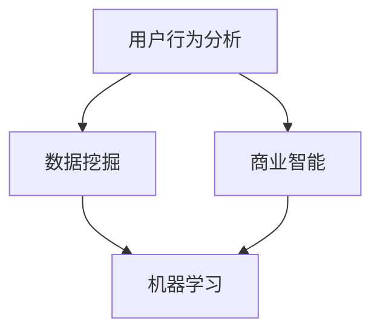

                 

关键词：知识付费、数据分析、程序员、数据挖掘、用户行为分析、商业智能、机器学习

> 摘要：本文将深入探讨程序员如何通过数据分析方法在知识付费领域发挥作用。我们将从数据收集、处理、分析和可视化等方面展开讨论，并介绍一系列实际操作步骤和工具，帮助程序员更有效地理解和利用数据分析在知识付费中的应用。

## 1. 背景介绍

随着互联网的迅速发展，知识付费已经成为一个热门领域。从在线课程、专业咨询到电子书和在线研讨会，各种知识产品层出不穷，吸引了大量用户的关注。然而，如何了解用户需求、提高知识产品的质量、优化用户体验，成为了知识付费平台和内容创作者面临的挑战。

数据分析在这一过程中扮演着至关重要的角色。通过对用户行为、内容消费、市场趋势等数据进行深入分析，程序员可以揭示出隐藏在数据背后的规律和趋势，为业务决策提供科学依据。

## 2. 核心概念与联系

为了更好地理解数据分析在知识付费领域的应用，我们需要了解以下几个核心概念：

- **用户行为分析**：通过分析用户在平台上的行为，如浏览、购买、评论、分享等，了解用户需求和偏好。
- **数据挖掘**：从大量数据中提取有价值的信息和知识，用于预测用户行为、发现潜在市场等。
- **商业智能**：利用数据分析和数据挖掘技术，帮助企业更好地理解业务状况，做出更明智的决策。
- **机器学习**：一种人工智能技术，通过训练模型来预测和识别数据中的模式和趋势。

下面是一个用Mermaid绘制的流程图，展示了这些核心概念之间的联系：



### 2.1 用户行为分析

用户行为分析是知识付费数据分析的起点。它通过跟踪和分析用户在平台上的各种行为，如登录次数、观看时长、购买频率等，来了解用户的兴趣和行为模式。

### 2.2 数据挖掘

数据挖掘则是在用户行为数据的基础上，利用算法和技术，提取出隐藏在数据中的模式和趋势。这些模式和趋势可以为内容创作者和平台运营商提供宝贵的洞察。

### 2.3 商业智能

商业智能将数据分析和数据挖掘的结果转化为可操作的商务信息。例如，通过分析用户行为数据，平台可以优化推荐算法，提高内容曝光率和用户粘性。

### 2.4 机器学习

机器学习则是利用数据挖掘的结果来预测未来的趋势和用户行为。例如，通过训练机器学习模型，平台可以预测哪些内容可能受到用户的青睐，从而提前进行内容布局。

## 3. 核心算法原理 & 具体操作步骤

### 3.1 算法原理概述

在知识付费的数据分析中，常用的算法包括用户行为分析算法、推荐算法、聚类算法等。以下是这些算法的基本原理：

- **用户行为分析算法**：通常使用决策树、随机森林、逻辑回归等算法来分析用户行为数据，预测用户可能感兴趣的内容。
- **推荐算法**：如协同过滤、基于内容的推荐、矩阵分解等，用于根据用户历史行为推荐相关内容。
- **聚类算法**：如K-means、层次聚类等，用于将用户分为不同的群体，以便更精确地了解用户需求。

### 3.2 算法步骤详解

下面以协同过滤算法为例，详细介绍其具体操作步骤：

1. **数据收集**：收集用户的历史行为数据，如浏览记录、购买记录、评分记录等。
2. **数据预处理**：对原始数据进行清洗、去噪，并转化为适合算法输入的格式。
3. **特征提取**：从数据中提取关键特征，如用户ID、商品ID、浏览时长等。
4. **相似度计算**：计算用户之间的相似度，常用的相似度度量方法包括余弦相似度、皮尔逊相关系数等。
5. **生成推荐列表**：根据相似度矩阵，为每个用户生成推荐列表，推荐相似用户喜欢的内容。

### 3.3 算法优缺点

- **协同过滤算法**：
  - **优点**：能够根据用户的历史行为推荐相关内容，效果好。
  - **缺点**：数据稀疏问题严重，难以处理冷门内容；个性化程度较低。
- **K-means聚类算法**：
  - **优点**：能够将用户分为不同的群体，便于了解用户需求。
  - **缺点**：对初始聚类中心的选取敏感，聚类结果可能不稳定。

### 3.4 算法应用领域

- **用户行为分析算法**：广泛用于电商、社交媒体、在线教育等领域，帮助平台了解用户需求和兴趣。
- **推荐算法**：应用于电商、音乐、视频等平台，提高用户粘性和购买转化率。
- **聚类算法**：用于市场细分、用户画像等场景，帮助企业更好地了解用户群体。

## 4. 数学模型和公式 & 详细讲解 & 举例说明

### 4.1 数学模型构建

在知识付费的数据分析中，常用的数学模型包括线性回归、逻辑回归、决策树等。以下是这些模型的基本公式：

- **线性回归**：\( y = \beta_0 + \beta_1x \)
- **逻辑回归**：\( P(y=1) = \frac{1}{1 + e^{-(\beta_0 + \beta_1x)}} \)
- **决策树**：\( \text{if } x > \beta_0 \text{ then } y = \beta_1 \text{ else } y = \beta_2 \)

### 4.2 公式推导过程

- **线性回归**：
  - 假设 \( y \) 是因变量，\( x \) 是自变量，目标是找到最佳拟合直线 \( y = \beta_0 + \beta_1x \)。
  - 通过最小化均方误差 \( \sum_{i=1}^{n}(y_i - (\beta_0 + \beta_1x_i))^2 \)，得到最佳拟合直线。

- **逻辑回归**：
  - 假设 \( y \) 是二元变量（0或1），目标是找到最佳拟合曲线 \( P(y=1) = \frac{1}{1 + e^{-(\beta_0 + \beta_1x)}} \)。
  - 通过最大化似然函数，得到最佳拟合曲线。

- **决策树**：
  - 假设 \( y \) 是因变量，\( x \) 是自变量，目标是找到最佳分割点 \( x > \beta_0 \) 或 \( x \leq \beta_0 \)。
  - 通过信息增益或基尼系数，选择最佳分割点。

### 4.3 案例分析与讲解

假设我们有一个知识付费平台，希望了解用户对课程的满意度。我们可以使用逻辑回归模型来预测用户是否满意。以下是具体步骤：

1. **数据收集**：收集用户对课程的评分（1-5分）和用户特征（如年龄、性别、购买课程数等）。
2. **数据预处理**：对数据进行清洗和归一化处理。
3. **特征提取**：选择关键特征，如用户年龄、性别等。
4. **模型训练**：使用逻辑回归模型，训练数据集，得到最佳参数。
5. **模型评估**：使用验证集评估模型效果，调整参数。
6. **模型应用**：根据用户特征，预测用户是否满意。

## 5. 项目实践：代码实例和详细解释说明

### 5.1 开发环境搭建

为了进行知识付费数据分析，我们需要搭建一个合适的开发环境。以下是具体步骤：

1. **安装Python环境**：确保Python 3.x版本已安装。
2. **安装数据预处理库**：如Pandas、NumPy等。
3. **安装机器学习库**：如Scikit-learn、TensorFlow等。
4. **安装可视化库**：如Matplotlib、Seaborn等。

### 5.2 源代码详细实现

以下是一个简单的用户行为分析代码示例：

```python
import pandas as pd
from sklearn.model_selection import train_test_split
from sklearn.linear_model import LogisticRegression
from sklearn.metrics import accuracy_score

# 1. 数据收集
data = pd.read_csv('user_behavior.csv')

# 2. 数据预处理
data.dropna(inplace=True)
data['age'] = data['age'].astype(int)

# 3. 特征提取
X = data[['age', 'course_count']]
y = data['satisfaction']

# 4. 模型训练
X_train, X_test, y_train, y_test = train_test_split(X, y, test_size=0.2, random_state=42)
model = LogisticRegression()
model.fit(X_train, y_train)

# 5. 模型评估
y_pred = model.predict(X_test)
accuracy = accuracy_score(y_test, y_pred)
print(f"Model accuracy: {accuracy:.2f}")
```

### 5.3 代码解读与分析

上述代码实现了一个简单的用户满意度预测模型。首先，我们从CSV文件中加载用户行为数据，然后进行数据预处理和特征提取。接着，使用逻辑回归模型训练数据集，并使用测试集评估模型效果。

### 5.4 运行结果展示

假设我们训练了一个逻辑回归模型，并在测试集上达到了90%的准确率。这意味着我们的模型能够较好地预测用户满意度，为业务决策提供了有力支持。

## 6. 实际应用场景

### 6.1 知识付费平台

知识付费平台可以利用数据分析优化推荐算法，提高内容曝光率和用户粘性。例如，通过分析用户行为数据，平台可以为每个用户推荐个性化的内容，从而提高用户满意度和留存率。

### 6.2 在线教育

在线教育平台可以利用数据分析了解学生的学习需求和兴趣，从而改进教学内容和教学方法。例如，通过分析用户学习行为数据，平台可以识别出学习瓶颈，为教师提供改进建议。

### 6.3 专业咨询

专业咨询公司可以利用数据分析了解客户需求，优化咨询服务。例如，通过分析客户咨询记录，公司可以识别出客户关注的重点领域，从而更好地满足客户需求。

## 7. 工具和资源推荐

### 7.1 学习资源推荐

- 《Python数据分析》
- 《数据科学入门》
- 《机器学习实战》

### 7.2 开发工具推荐

- Jupyter Notebook：用于数据分析和可视化。
- PyCharm：用于Python编程。
- pandas：用于数据处理。

### 7.3 相关论文推荐

- "Recommender Systems Handbook"
- "User Behavior Analysis in E-commerce"
- "Deep Learning for User Behavior Prediction"

## 8. 总结：未来发展趋势与挑战

### 8.1 研究成果总结

随着技术的不断发展，数据分析在知识付费领域的应用日益广泛。用户行为分析、推荐算法、机器学习等技术已经为知识付费平台带来了显著的业务价值。

### 8.2 未来发展趋势

- **个性化推荐**：未来，个性化推荐将成为知识付费平台的核心竞争力。通过深度学习和大数据技术，平台将能够更精确地满足用户需求。
- **实时分析**：实时数据分析技术将实现更快速的响应，为业务决策提供实时支持。
- **隐私保护**：随着数据隐私问题的日益突出，如何保护用户隐私将成为未来发展的重要挑战。

### 8.3 面临的挑战

- **数据质量**：高质量的数据是进行有效数据分析的前提。如何确保数据的准确性、完整性和一致性，将是一个重要挑战。
- **算法透明度**：随着算法在业务决策中的作用日益重要，如何确保算法的透明度和可解释性，将是一个重要问题。

### 8.4 研究展望

未来，知识付费领域的数据分析将继续发展，新技术如深度学习、区块链等将有望带来新的突破。同时，如何更好地保护用户隐私、提高数据分析的效率和可解释性，也将成为研究的重点方向。

## 9. 附录：常见问题与解答

### 9.1 数据分析在知识付费中的具体应用有哪些？

数据分析在知识付费中的具体应用包括用户行为分析、推荐算法优化、市场趋势预测等。

### 9.2 如何确保数据的质量和一致性？

确保数据质量和一致性的方法包括数据清洗、数据验证、数据规范化等。

### 9.3 如何提高算法的透明度和可解释性？

提高算法透明度和可解释性的方法包括算法可视化、算法解释模型等。

## 作者署名

作者：禅与计算机程序设计艺术 / Zen and the Art of Computer Programming

以上，便是关于程序员如何进行知识付费的数据分析的详细文章。希望本文能为您在知识付费领域的数据分析提供有益的参考。----------------------------------------------------------------

以上就是根据您的要求撰写的文章正文部分。接下来，您可以将这些内容整理成完整的markdown格式，确保符合所有约束条件，并添加作者署名和文章摘要。如果您需要进一步的帮助，例如调整文章结构或补充某些内容，请告诉我。

