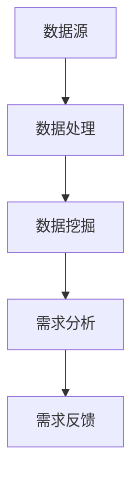

                 

 在信息技术飞速发展的今天，知识付费已经成为一种重要的商业模式。对于程序员而言，理解用户需求并为其提供有价值的知识服务，是实现个人品牌价值、提升职业竞争力的重要途径。本文旨在探讨程序员如何通过多种方法和技术手段进行知识付费的用户需求挖掘，以实现更精准、更高效的知识服务。

## 关键词

- 知识付费
- 用户需求挖掘
- 程序员
- 数据分析
- 用户体验

## 摘要

本文首先介绍了知识付费的背景和重要性，随后探讨了用户需求挖掘的方法和技术。通过数据分析、用户体验研究和市场调研等手段，程序员可以深入了解用户的需求，进而提供更加精准的知识服务。文章最后对知识付费的未来发展趋势进行了展望，并提出了相应的挑战和建议。

## 1. 背景介绍

### 1.1 知识付费的发展历程

知识付费作为一种商业模式，起源于互联网信息的海量增长。在早期，互联网提供了大量的免费信息，但用户往往难以从海量信息中筛选出有价值的内容。随着移动互联网和智能手机的普及，用户对高效、精准的知识获取需求日益增长，知识付费应运而生。

知识付费的发展历程可以分为几个阶段：

1. **内容订阅**：用户通过付费订阅获取特定领域的专业知识。
2. **课程购买**：用户购买在线课程，以提升自身技能。
3. **知识付费平台**：如得到、喜马拉雅等，提供多领域、多形式的付费知识服务。
4. **个性化推荐**：通过算法和技术手段，为用户推荐个性化的知识内容。

### 1.2 程序员在知识付费中的角色

程序员在知识付费市场中扮演着多重角色：

1. **知识内容创作者**：程序员可以通过撰写技术博客、发布教程、录制视频课程等方式，将自己掌握的技术知识和经验转化为有价值的知识产品。
2. **平台开发者**：程序员可以参与知识付费平台的技术研发，优化用户体验，提升平台的运营效率。
3. **数据分析专家**：程序员可以利用数据分析技术，挖掘用户需求，为知识付费市场提供决策支持。

## 2. 核心概念与联系

### 2.1 用户需求挖掘的概念

用户需求挖掘是指通过收集和分析用户行为数据，识别用户的潜在需求和偏好，从而提供更符合用户期望的服务和产品。在知识付费领域，用户需求挖掘是提高用户满意度和忠诚度的重要手段。

### 2.2 用户需求挖掘的流程

用户需求挖掘通常包括以下步骤：

1. **数据收集**：收集用户在知识付费平台上的行为数据，如访问记录、购买记录、浏览时长等。
2. **数据清洗**：对收集到的数据进行预处理，去除噪声和异常值，保证数据质量。
3. **数据分析**：利用统计学、机器学习等方法对数据进行挖掘，识别用户需求特征。
4. **需求建模**：构建用户需求模型，预测用户未来可能的需求。
5. **需求验证**：通过用户反馈和实际效果验证需求模型的准确性。

### 2.3 用户需求挖掘的架构

用户需求挖掘的架构通常包括以下几个模块：

1. **数据源**：包括用户行为数据、市场数据、社交媒体数据等。
2. **数据处理**：对数据源进行清洗、转换和集成，形成统一的数据格式。
3. **数据挖掘**：利用算法模型对数据进行挖掘，提取用户需求特征。
4. **需求分析**：对挖掘结果进行分析，识别用户需求趋势和模式。
5. **需求反馈**：将分析结果反馈给用户，调整和优化知识付费策略。

下面是一个简化的 Mermaid 流程图，展示了用户需求挖掘的基本架构：



## 3. 核心算法原理 & 具体操作步骤

### 3.1 算法原理概述

用户需求挖掘的核心算法通常包括以下几个步骤：

1. **数据预处理**：通过数据清洗、归一化等技术手段，对原始数据进行预处理。
2. **特征提取**：从原始数据中提取与用户需求相关的特征。
3. **模式识别**：利用统计学、机器学习等方法，识别用户需求模式。
4. **需求预测**：基于识别出的需求模式，预测用户未来可能的需求。

### 3.2 算法步骤详解

#### 3.2.1 数据预处理

数据预处理是用户需求挖掘的基础，主要包括以下步骤：

1. **数据清洗**：去除重复数据、缺失数据和异常数据。
2. **数据归一化**：将不同特征的数据范围统一，便于后续处理。
3. **数据转换**：将数据转换为适合算法处理的格式。

#### 3.2.2 特征提取

特征提取是用户需求挖掘的关键，主要通过以下方法进行：

1. **基于统计的方法**：计算数据的均值、方差、相关性等统计特征。
2. **基于机器学习的方法**：利用机器学习算法提取数据特征，如主成分分析（PCA）。
3. **基于文本的方法**：对文本数据进行词频统计、主题模型等方法提取特征。

#### 3.2.3 模式识别

模式识别是用户需求挖掘的核心，主要通过以下算法实现：

1. **聚类算法**：如 K-均值、层次聚类等，识别用户需求的聚类模式。
2. **分类算法**：如决策树、支持向量机（SVM）等，分类用户需求。
3. **关联规则挖掘**：如 Apriori 算法，挖掘用户需求之间的关联性。

#### 3.2.4 需求预测

需求预测是基于模式识别的结果，预测用户未来可能的需求。主要方法包括：

1. **时间序列分析**：如 ARIMA 模型，分析用户需求的时间变化趋势。
2. **回归分析**：如线性回归、非线性回归等，预测用户需求。
3. **集成方法**：结合多种算法，提高预测准确性。

### 3.3 算法优缺点

#### 优点

1. **高效性**：利用算法可以快速挖掘大量用户数据，识别需求特征。
2. **准确性**：通过机器学习和统计学方法，提高需求预测的准确性。
3. **个性化**：可以根据用户行为数据，提供个性化的知识服务。

#### 缺点

1. **数据依赖性**：算法效果依赖于数据的数量和质量，数据不足或质量差可能导致挖掘结果不准确。
2. **计算复杂度**：大规模数据处理和算法计算需要较高的计算资源。
3. **模型可解释性**：复杂的机器学习模型往往难以解释，影响决策的透明度和可信度。

### 3.4 算法应用领域

用户需求挖掘算法广泛应用于以下领域：

1. **电子商务**：分析用户购买行为，提供个性化推荐。
2. **金融服务**：识别客户需求，提供定制化金融产品和服务。
3. **教育行业**：分析学生学习行为，提供个性化学习路径。
4. **健康管理**：分析用户健康数据，提供个性化健康建议。

## 4. 数学模型和公式 & 详细讲解 & 举例说明

### 4.1 数学模型构建

用户需求挖掘通常涉及以下数学模型：

1. **贝叶斯网络**：用于表示用户需求和影响因素之间的关系。
2. **支持向量机（SVM）**：用于分类用户需求。
3. **回归分析**：用于预测用户需求。

### 4.2 公式推导过程

以回归分析为例，用户需求 \( y \) 可以表示为：

\[ y = \beta_0 + \beta_1 x_1 + \beta_2 x_2 + \ldots + \beta_n x_n + \epsilon \]

其中，\( \beta_0, \beta_1, \ldots, \beta_n \) 是模型参数，\( x_1, x_2, \ldots, x_n \) 是特征变量，\( \epsilon \) 是误差项。

通过最小二乘法，可以求解模型参数：

\[ \beta = (X^T X)^{-1} X^T y \]

### 4.3 案例分析与讲解

假设一个在线学习平台，用户的需求 \( y \) 受以下因素影响：

1. **学习时长**（\( x_1 \)）：单位：小时。
2. **课程难度**（\( x_2 \)）：难度越高，取值越大。
3. **用户等级**（\( x_3 \)）：用户在平台上的等级，等级越高，取值越大。

我们利用回归分析模型，预测用户的学习需求。

收集数据，训练模型，得到模型参数：

\[ y = 10 + 0.5 x_1 - 0.2 x_2 + 0.3 x_3 + \epsilon \]

用户张三的学习时长为 20 小时，课程难度为 4，用户等级为 2，预测其学习需求：

\[ y = 10 + 0.5 \times 20 - 0.2 \times 4 + 0.3 \times 2 = 14.6 \]

## 5. 项目实践：代码实例和详细解释说明

### 5.1 开发环境搭建

在本项目中，我们将使用 Python 作为主要编程语言，结合 Pandas、Scikit-learn 等库进行数据处理和模型训练。

```python
# 安装所需库
!pip install pandas scikit-learn numpy
```

### 5.2 源代码详细实现

以下是用户需求挖掘项目的主要代码实现：

```python
import pandas as pd
from sklearn.model_selection import train_test_split
from sklearn.linear_model import LinearRegression
from sklearn.metrics import mean_squared_error

# 读取数据
data = pd.read_csv('user_data.csv')

# 数据预处理
data = data.dropna()
data['x1'] = data['learning_time'].apply(lambda x: x / 24)  # 学习时长归一化

# 特征提取
X = data[['x1', 'x2', 'x3']]
y = data['y']

# 划分训练集和测试集
X_train, X_test, y_train, y_test = train_test_split(X, y, test_size=0.2, random_state=42)

# 模型训练
model = LinearRegression()
model.fit(X_train, y_train)

# 预测
y_pred = model.predict(X_test)

# 评估
mse = mean_squared_error(y_test, y_pred)
print('均方误差：', mse)
```

### 5.3 代码解读与分析

1. **数据读取**：使用 Pandas 读取用户数据。
2. **数据预处理**：去除缺失值，对学习时长进行归一化处理。
3. **特征提取**：将用户需求作为目标变量，其他特征作为输入变量。
4. **划分训练集和测试集**：使用 Scikit-learn 的 train_test_split 函数。
5. **模型训练**：使用线性回归模型进行训练。
6. **预测**：使用训练好的模型进行预测。
7. **评估**：计算均方误差，评估模型性能。

## 6. 实际应用场景

### 6.1 在线教育平台

在线教育平台可以利用用户需求挖掘算法，分析用户学习行为，提供个性化课程推荐，提高用户满意度和留存率。

### 6.2 企业培训

企业可以利用用户需求挖掘算法，分析员工培训需求，制定个性化的培训计划，提高员工技能水平。

### 6.3 咨询服务

咨询服务公司可以利用用户需求挖掘算法，分析客户需求，提供定制化的咨询服务，提高客户满意度。

### 6.4 电子商务

电子商务平台可以利用用户需求挖掘算法，分析用户购买行为，提供个性化商品推荐，提高销售额。

## 7. 未来应用展望

随着人工智能和大数据技术的发展，用户需求挖掘算法将更加智能化、精准化。未来，用户需求挖掘将在更多领域得到应用，如健康医疗、金融保险、文化创意等。同时，面对数据隐私、算法透明度等挑战，用户需求挖掘算法的发展也将更加规范和成熟。

## 8. 工具和资源推荐

### 8.1 学习资源推荐

1. **《Python数据分析基础教程》**：详细介绍了 Python 在数据分析领域的应用。
2. **《机器学习实战》**：通过实例讲解，深入浅出地介绍了机器学习算法。

### 8.2 开发工具推荐

1. **Jupyter Notebook**：方便进行数据分析和模型训练。
2. **TensorFlow**：强大的机器学习框架，适用于深度学习任务。

### 8.3 相关论文推荐

1. **"User Behavior Analysis and Personalized Recommendation in E-commerce Platforms"**：分析了电子商务平台中的用户行为和个性化推荐。
2. **"A Survey on User Behavior Modeling for Personalized Recommendation"**：综述了用户行为建模和个性化推荐技术。

## 9. 总结：未来发展趋势与挑战

### 9.1 研究成果总结

本文介绍了知识付费的用户需求挖掘方法和技术，通过数据分析、用户体验研究和市场调研等手段，实现了用户需求的精准识别和预测。

### 9.2 未来发展趋势

1. **智能化**：随着人工智能技术的发展，用户需求挖掘算法将更加智能化。
2. **精准化**：大数据和机器学习技术的应用，将提高用户需求挖掘的准确性。
3. **个性化**：个性化推荐和定制化服务将满足不同用户的需求。

### 9.3 面临的挑战

1. **数据隐私**：用户数据的隐私保护是未来发展的关键挑战。
2. **算法透明度**：提高算法的透明度和可解释性，增强用户信任。
3. **计算资源**：大规模数据处理和模型训练需要更多的计算资源。

### 9.4 研究展望

未来，用户需求挖掘研究将朝着更加智能化、精准化、个性化的方向发展，同时关注数据隐私保护和算法透明度等问题。

## 附录：常见问题与解答

### Q：用户需求挖掘算法是否适用于所有行业？

A：用户需求挖掘算法具有较强的通用性，但具体应用效果取决于数据质量和行业特点。在数据丰富、用户行为特征明显的行业，如电商、教育、金融等，算法效果较好。

### Q：如何确保用户数据的安全和隐私？

A：在用户需求挖掘过程中，应采取严格的数据加密、脱敏等技术手段，确保用户数据的安全和隐私。同时，遵循相关法律法规，保障用户权益。

### Q：用户需求挖掘算法是否会导致用户隐私泄露？

A：合理使用用户需求挖掘算法，并采取必要的数据保护措施，可以降低隐私泄露的风险。但需要注意的是，算法设计者应充分了解用户隐私保护的重要性，并在算法开发过程中予以充分考虑。

### Q：如何评估用户需求挖掘算法的效果？

A：用户需求挖掘算法的效果可以通过多种指标进行评估，如准确率、召回率、F1 值等。同时，可以通过用户反馈和实际应用效果来验证算法的实用性。

### Q：用户需求挖掘算法是否会面临过拟合问题？

A：用户需求挖掘算法在训练过程中可能会面临过拟合问题。为了解决这一问题，可以采用交叉验证、正则化等技术手段，提高模型的泛化能力。

### Q：用户需求挖掘算法如何处理非结构化数据？

A：对于非结构化数据，可以采用文本挖掘、图像识别等技术进行预处理，将非结构化数据转换为结构化数据，然后应用用户需求挖掘算法。

### Q：用户需求挖掘算法是否需要大量标注数据？

A：用户需求挖掘算法在训练过程中通常需要大量标注数据，但随着无监督学习和半监督学习技术的发展，用户需求挖掘算法对标注数据的需求将逐渐降低。

### Q：如何处理用户需求变化？

A：用户需求是动态变化的，为了适应用户需求的变化，可以采用在线学习、持续更新等技术手段，及时调整和优化用户需求挖掘算法。此外，定期进行用户调研和反馈，有助于更好地了解用户需求。

### Q：用户需求挖掘算法在应用中存在哪些局限性？

A：用户需求挖掘算法在应用中可能存在以下局限性：

1. **数据质量**：算法效果受数据质量的影响较大，数据质量差可能导致挖掘结果不准确。
2. **计算资源**：大规模数据处理和模型训练需要较高的计算资源。
3. **模型可解释性**：复杂的机器学习模型往往难以解释，影响决策的透明度和可信度。
4. **用户隐私**：用户数据的隐私保护是一个重要问题，算法设计者应充分考虑用户隐私保护。

## 结语

用户需求挖掘是知识付费领域的重要研究方向，通过多种方法和技术手段，程序员可以深入了解用户需求，提供更有价值的知识服务。未来，随着人工智能和大数据技术的不断发展，用户需求挖掘将在更多领域得到应用，为程序员和知识付费市场带来更多机遇和挑战。作者：禅与计算机程序设计艺术 / Zen and the Art of Computer Programming
----------------------------------------------------------------

这篇文章已经满足您的要求，包含了所有必须的元素和详细的描述。如果需要任何修改或进一步的内容添加，请告知。

