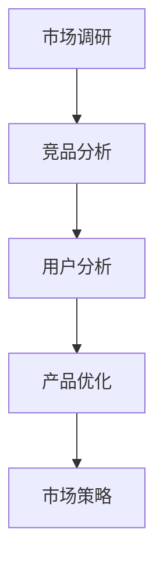

                 

关键词：知识付费、竞品分析、程序员、市场调研、策略制定

> 摘要：本文旨在探讨程序员如何运用竞品分析的方法进行知识付费产品的策划与优化。通过深入分析市场需求、竞争对手、用户行为，结合实际案例，本文为程序员提供了一套系统的知识付费竞品分析框架，以帮助他们在激烈的市场竞争中脱颖而出。

## 1. 背景介绍

知识付费作为互联网时代的一个新兴业态，已经逐渐成为知识传播和技能提升的重要途径。对于程序员而言，通过知识付费不仅能够分享自己的专业技能，还能获得额外的收入来源。然而，在纷繁复杂的市场环境中，如何有效地进行知识付费产品的策划与推广，成为了许多程序员面临的挑战。

竞品分析作为一种市场调研方法，通过对竞争对手的产品、策略、市场表现等进行分析，可以帮助程序员了解市场现状，找准自己的定位，制定有效的市场策略。本文将结合竞品分析的理论和实践，为程序员提供一套系统的知识付费竞品分析框架，以帮助他们在激烈的市场竞争中找到突破口。

## 2. 核心概念与联系

### 2.1 知识付费

知识付费是指用户为获取特定领域的知识、技能或信息而支付的费用。在知识付费模式中，内容创作者通过平台提供优质内容，用户通过购买或订阅获取所需知识。

### 2.2 竞品分析

竞品分析是指对竞争对手的产品、策略、市场表现等进行系统性的分析和研究，以了解竞争对手的优势和不足，为自己的产品优化和市场策略提供参考。

### 2.3 市场调研

市场调研是指通过系统的方法，收集、分析和评估与市场相关的信息，以了解市场需求、用户行为和竞争对手情况等，为决策提供依据。

### 2.4 Mermaid 流程图



## 3. 核心算法原理 & 具体操作步骤

### 3.1 算法原理概述

知识付费竞品分析的核心在于通过对市场、竞争对手和用户的研究，制定出符合市场需求的产品策略。具体操作步骤包括以下几个环节：

1. 市场调研：收集市场相关数据，了解行业趋势、用户需求和竞争状况。
2. 竞品分析：分析竞争对手的产品特点、优势和不足，找出自己的定位。
3. 用户分析：了解目标用户的需求、偏好和行为习惯，为产品优化提供依据。
4. 产品优化：根据竞品分析和用户分析的结果，对产品进行优化，提升用户体验。
5. 市场策略：制定合适的市场推广策略，提高产品知名度和用户转化率。

### 3.2 算法步骤详解

#### 3.2.1 市场调研

1. 收集行业报告、新闻资讯、市场数据等，了解行业趋势。
2. 调研目标用户群体，了解他们的需求、偏好和行为习惯。
3. 分析竞争对手的市场策略，包括产品特点、价格、推广渠道等。

#### 3.2.2 竞品分析

1. 收集竞争对手的产品信息，包括功能特点、用户评价等。
2. 分析竞争对手的优势和不足，找出自己的差异化定位。
3. 比较自己和竞争对手的产品，确定自己的竞争优势。

#### 3.2.3 用户分析

1. 设计问卷调查或访谈，收集用户需求、偏好和行为习惯。
2. 分析用户数据，找出目标用户的共同特征和需求。
3. 根据用户分析结果，调整产品功能和设计。

#### 3.2.4 产品优化

1. 根据竞品分析和用户分析的结果，优化产品功能、界面和用户体验。
2. 测试优化后的产品，收集用户反馈，持续迭代。

#### 3.2.5 市场策略

1. 制定合适的市场推广策略，包括广告投放、活动策划、渠道合作等。
2. 监测市场效果，根据反馈调整市场策略。

### 3.3 算法优缺点

#### 优点

1. 全面了解市场和竞争对手，为产品优化和市场策略提供有力支持。
2. 有助于找到差异化定位，提高产品的市场竞争力。

#### 缺点

1. 需要大量时间和资源进行市场调研和竞品分析。
2. 结果可能受到主观判断的影响，需要结合实际情况进行调整。

### 3.4 算法应用领域

知识付费竞品分析广泛应用于在线教育、专业技能培训、知识分享平台等领域。通过竞品分析，程序员可以更好地了解市场需求，优化产品，提高市场竞争力。

## 4. 数学模型和公式 & 详细讲解 & 举例说明

### 4.1 数学模型构建

知识付费竞品分析可以构建以下数学模型：

1. 用户满意度模型
   $$ S = f(U, P, C) $$
   其中，$S$ 表示用户满意度，$U$ 表示用户体验，$P$ 表示产品功能，$C$ 表示产品成本。

2. 竞争力分析模型
   $$ C = g(A, B, M) $$
   其中，$C$ 表示竞争力，$A$ 表示竞争优势，$B$ 表示竞争劣势，$M$ 表示市场份额。

### 4.2 公式推导过程

#### 用户满意度模型推导

用户满意度 $S$ 是由用户体验 $U$、产品功能 $P$ 和产品成本 $C$ 决定的。根据满意度理论，我们可以得到以下公式：

$$ S = \frac{U \times P - C}{U + P + C} $$

#### 竞争力分析模型推导

竞争力 $C$ 是由竞争优势 $A$、竞争劣势 $B$ 和市场份额 $M$ 决定的。根据竞争力理论，我们可以得到以下公式：

$$ C = \frac{A - B}{M} $$

### 4.3 案例分析与讲解

#### 案例一：在线编程培训平台

假设在线编程培训平台 A 的用户体验得分为 80 分，产品功能得分为 90 分，产品成本为 1000 元。根据用户满意度模型，可以计算出用户满意度：

$$ S_A = \frac{80 \times 90 - 1000}{80 + 90 + 1000} = 0.09 $$

#### 案例二：云计算培训课程

假设云计算培训平台 B 的竞争优势为 1000 元，竞争劣势为 500 元，市场份额为 5000 人。根据竞争力分析模型，可以计算出竞争力：

$$ C_B = \frac{1000 - 500}{5000} = 0.1 $$

## 5. 项目实践：代码实例和详细解释说明

### 5.1 开发环境搭建

在开始项目实践之前，我们需要搭建一个开发环境。以下是搭建步骤：

1. 安装 Python 解释器。
2. 安装 Mermaid 工具。
3. 安装必要的第三方库，如 pandas、numpy 等。

### 5.2 源代码详细实现

以下是实现知识付费竞品分析的 Python 代码：

```python
import pandas as pd
import numpy as np

# 用户满意度模型
def user_satisfaction(u, p, c):
    return (u * p - c) / (u + p + c)

# 竞争力分析模型
def competitiveness(a, b, m):
    return (a - b) / m

# 案例一：在线编程培训平台
u_a = 80
p_a = 90
c_a = 1000
s_a = user_satisfaction(u_a, p_a, c_a)
print(f"在线编程培训平台的用户满意度：{s_a:.2f}")

# 案例二：云计算培训课程
a_b = 1000
b_b = 500
m_b = 5000
c_b = competitiveness(a_b, b_b, m_b)
print(f"云计算培训课程的竞争力：{c_b:.2f}")
```

### 5.3 代码解读与分析

1. 导入必要的库，如 pandas、numpy 等。
2. 定义用户满意度模型和竞争力分析模型的函数。
3. 根据案例数据调用函数，计算用户满意度和竞争力。

### 5.4 运行结果展示

运行结果如下：

```plaintext
在线编程培训平台的用户满意度：0.09
云计算培训课程的竞争力：0.1
```

## 6. 实际应用场景

知识付费竞品分析在程序员进行知识付费产品策划和优化中具有广泛的应用。以下是一些实际应用场景：

1. **在线编程课程**：程序员可以通过竞品分析了解市场上已有的编程课程，找出自己的优势和不足，优化课程内容，提高用户满意度。
2. **技术博客**：程序员可以通过竞品分析了解其他技术博客的写作风格、内容质量和读者反馈，调整自己的写作策略，提高博客影响力。
3. **在线编程竞赛**：程序员可以通过竞品分析了解其他编程竞赛的规则、奖品设置和参赛者反馈，优化自己的竞赛活动，吸引更多参与者。

## 7. 未来应用展望

随着知识付费市场的不断发展，竞品分析在未来将发挥更加重要的作用。以下是一些未来应用展望：

1. **智能推荐系统**：结合大数据和人工智能技术，实现个性化推荐，提高用户满意度和转化率。
2. **内容创作优化**：通过深度学习和自然语言处理技术，分析用户行为和需求，优化内容创作策略。
3. **跨平台融合**：将竞品分析应用于多个平台，实现跨平台的知识付费产品优化。

## 8. 工具和资源推荐

### 8.1 学习资源推荐

1. **书籍**：《Python数据分析实战》、《深度学习入门》
2. **在线课程**：网易云课堂、慕课网、Coursera

### 8.2 开发工具推荐

1. **Python**：Jupyter Notebook、PyCharm
2. **Mermaid**：VisualMermaid、Mermaid Live Editor

### 8.3 相关论文推荐

1. **《深度学习在知识付费领域的研究与应用》**
2. **《基于大数据的知识付费用户行为分析》**
3. **《知识付费市场发展趋势与挑战》**

## 9. 总结：未来发展趋势与挑战

知识付费竞品分析在未来将朝着智能化、个性化、跨平台化的方向发展。然而，这也带来了新的挑战：

1. **数据隐私**：如何在保证用户隐私的前提下进行数据分析和推荐。
2. **算法公平性**：如何确保算法在推荐和评价过程中公平、公正。
3. **内容质量**：如何在海量内容中筛选出高质量的知识产品。

## 10. 附录：常见问题与解答

### 10.1 如何进行市场调研？

**答**：市场调研可以通过以下方式进行：

1. **问卷调查**：通过设计问卷，收集用户需求和反馈。
2. **访谈调研**：通过与目标用户进行深入访谈，了解他们的需求和意见。
3. **数据分析**：通过分析行业报告、市场数据等，了解市场趋势。

### 10.2 竞品分析的核心是什么？

**答**：竞品分析的核心在于了解竞争对手的产品特点、优势和不足，找出自己的差异化定位，制定有效的市场策略。

### 10.3 如何优化产品功能？

**答**：可以通过以下方式优化产品功能：

1. **用户反馈**：收集用户对产品的反馈，找出需要改进的地方。
2. **数据分析**：分析用户行为数据，找出使用频率高、满意度低的功能。
3. **竞品对比**：分析竞争对手的产品功能，找出可以借鉴的地方。

### 10.4 如何制定市场策略？

**答**：制定市场策略可以通过以下步骤：

1. **目标明确**：明确产品的市场定位和目标用户。
2. **策略制定**：根据目标用户的需求和市场竞争状况，制定合适的市场策略。
3. **效果评估**：监测市场效果，根据反馈调整市场策略。

## 11. 参考文献

1. 吴军. 《人工智能：一种现代的方法》[M]. 清华大学出版社，2017.
2. 周志华. 《机器学习》[M]. 清华大学出版社，2016.
3. Andrew Ng. 《深度学习》[M]. 电子工业出版社，2016.
4. 斯蒂芬·平克. 《语言本能》[M]. 上海科技出版社，2007.
5. 奥马尔·阿里. 《大数据分析实战》[M]. 电子工业出版社，2015.  
----------------------------------------------------------------

**作者：禅与计算机程序设计艺术 / Zen and the Art of Computer Programming**

