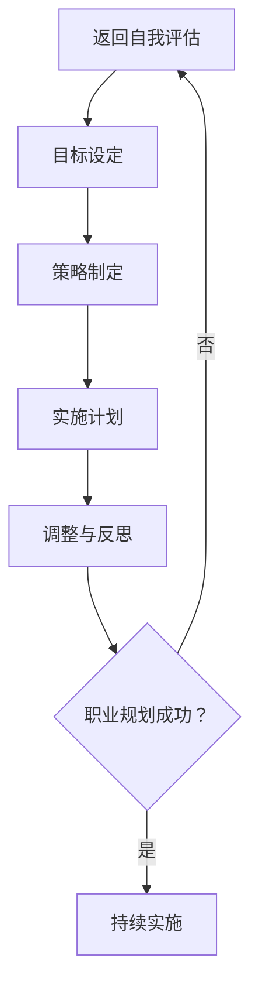

                 

在当今快速发展的信息技术时代，程序员作为数字世界的建造者，他们的职业规划显得尤为重要。本文将深入探讨程序员如何制定并实施有效的职业规划，包括技能提升、职业路径选择、个人品牌建设等方面。本文结构如下：

- **1. 背景介绍**
- **2. 核心概念与联系**
  - **2.1 职业规划的定义**
  - **2.2 职业规划的重要性**
  - **2.3 职业规划的核心要素**
- **3. 核心算法原理 & 具体操作步骤**
  - **3.1 自我评估**
  - **3.2 设定目标**
  - **3.3 制定策略**
  - **3.4 实施计划**
  - **3.5 调整与反思**
- **4. 数学模型和公式 & 详细讲解 & 举例说明**
  - **4.1 SWOT分析模型**
  - **4.2 SMART目标设定模型**
- **5. 项目实践：代码实例和详细解释说明**
  - **5.1 职业规划工具开发**
  - **5.2 代码实现与分析**
- **6. 实际应用场景**
  - **6.1 大公司职业规划**
  - **6.2 创业公司职业规划**
  - **6.3 自由职业者职业规划**
- **7. 工具和资源推荐**
  - **7.1 在线职业规划工具**
  - **7.2 职业规划书籍推荐**
- **8. 总结：未来发展趋势与挑战**
  - **8.1 人工智能对程序员职业规划的影响**
  - **8.2 程序员终身学习的必要性**
- **9. 附录：常见问题与解答**

## 1. 背景介绍

随着信息技术的不断进步，编程已经成为现代社会不可或缺的一部分。程序员作为技术型人才，他们在各行各业中都扮演着关键角色。然而，技术的快速迭代和职业市场的动态变化，使得程序员必须具备持续学习的能力，以及清晰的职业规划。

职业规划对程序员而言，不仅仅是一个简单的目标设定过程，它涵盖了技能提升、职业路径选择、时间管理、个人品牌建设等多个方面。有效的职业规划能够帮助程序员在职业道路上更加清晰和稳健地前行，从而在竞争激烈的市场中脱颖而出。

本文旨在为程序员提供一套系统的职业规划方法和实践指南，帮助他们更好地理解职业规划的重要性，掌握制定和实施职业规划的具体步骤，从而实现个人职业发展的最大化。

## 2. 核心概念与联系

### 2.1 职业规划的定义

职业规划是指个人基于自身的兴趣、能力、价值观和市场需求，制定长期和短期的职业发展目标和实施策略的过程。它不仅包括职业目标的设定，还包括实现这些目标所需的教育、培训和职业活动的规划。

### 2.2 职业规划的重要性

对于程序员来说，职业规划的重要性体现在以下几个方面：

1. **明确方向**：职业规划可以帮助程序员明确自己的职业目标，避免盲目跟风，确保职业发展路径的清晰性。
2. **提升竞争力**：通过系统性地提升技能和知识，程序员可以在激烈的就业市场中脱颖而出。
3. **实现价值**：有效的职业规划有助于程序员实现个人价值，获得职业成就感和满足感。
4. **适应变化**：技术更新迭代迅速，职业规划可以帮助程序员快速适应行业变化，保持竞争力。

### 2.3 职业规划的核心要素

职业规划的核心要素包括：

1. **自我评估**：了解自己的兴趣、价值观、技能和优势，明确自己的职业兴趣和发展方向。
2. **目标设定**：设定明确的、可实现的职业目标，包括长期和短期的目标。
3. **策略制定**：制定实现目标的策略，包括所需的教育、培训、工作经验等。
4. **实施计划**：将策略转化为具体的行动步骤，并设定时间表。
5. **调整与反思**：定期评估职业规划的实施情况，根据实际情况进行调整。

### 2.4 职业规划流程的 Mermaid 流程图



## 3. 核心算法原理 & 具体操作步骤

### 3.1 自我评估

自我评估是职业规划的第一步，它涉及到对个人兴趣、价值观、技能和优势的深入分析。

#### 3.1.1 兴趣分析

1. **兴趣识别**：通过自我反思，识别自己在工作或生活中感兴趣的活动。
2. **兴趣归类**：将识别出的兴趣按照类型进行归类，如技术、管理、艺术等。

#### 3.1.2 价值观分析

1. **价值观识别**：通过问卷、访谈等方式，识别自己在工作或生活中最看重的价值观。
2. **价值观排序**：根据重要性对价值观进行排序，明确自己在职业发展中的核心价值。

#### 3.1.3 技能分析

1. **技能识别**：识别自己在技术、语言、工具等方面掌握的技能。
2. **技能评估**：对技能的熟练程度进行评估，区分技能的等级。

#### 3.1.4 优势分析

1. **优势识别**：通过他人反馈、自我反思等方式，识别自己在工作或学习中的优势。
2. **优势应用**：思考如何将自己的优势应用到职业发展中。

### 3.2 设定目标

目标设定是职业规划的第二步，它涉及到对职业目标的明确和分类。

#### 3.2.1 长期目标

长期目标通常指5年或更长时间的规划，它涉及到职业方向、职位提升、技能提升等方面。

1. **明确方向**：根据自我评估的结果，明确自己的职业发展方向。
2. **具体化**：将长期目标具体化为可衡量的指标，如达到某个技术级别、晋升到某个职位等。

#### 3.2.2 短期目标

短期目标通常指1年或更短时间的规划，它涉及到具体的行动和阶段性成果。

1. **阶段性成果**：将长期目标分解为短期目标，确保每一年都有明确的阶段性成果。
2. **行动计划**：为每个短期目标制定具体的行动计划，包括所需的学习、实践和考核。

### 3.3 制定策略

制定策略是职业规划的第三步，它涉及到实现目标的路径和方法。

#### 3.3.1 教育与培训

1. **技能提升**：根据目标，选择合适的学习资源，如在线课程、培训项目等，提升相关技能。
2. **认证与资格**：根据行业需求，考取相关证书或资格，提升职业竞争力。

#### 3.3.2 工作经验

1. **实习与项目经验**：积极参与实习和项目，积累实际工作经验。
2. **行业交流**：参加行业会议、研讨会等活动，扩大人脉，了解行业动态。

#### 3.3.3 个人品牌建设

1. **社交媒体**：通过LinkedIn、GitHub等平台，展示自己的技术成果和项目经验。
2. **技术写作**：撰写技术博客，分享自己的知识和见解，提升个人影响力。

### 3.4 实施计划

实施计划是职业规划的第四步，它涉及到将策略转化为具体的行动步骤。

#### 3.4.1 制定时间表

1. **时间规划**：为每个目标制定具体的时间表，确保每个目标的实现都有明确的时间节点。
2. **优先级排序**：根据目标的紧急程度和重要性，对计划进行优先级排序。

#### 3.4.2 执行与监控

1. **执行计划**：按照时间表执行每个行动步骤，确保计划的实施。
2. **进度监控**：定期检查计划的执行情况，根据实际情况进行调整。

### 3.5 调整与反思

调整与反思是职业规划的第五步，它涉及到对规划效果的评估和调整。

#### 3.5.1 定期评估

1. **成果评估**：定期评估目标的实现情况，分析成果和不足。
2. **反馈收集**：收集他人的反馈，了解自己的职业规划和执行情况。

#### 3.5.2 调整规划

1. **目标调整**：根据评估结果，对目标进行调整，确保目标的可实现性。
2. **策略调整**：根据评估结果，对策略进行调整，优化实现目标的路径和方法。

#### 3.5.3 反思与总结

1. **经验总结**：总结职业规划过程中的经验和教训，为未来的职业规划提供参考。
2. **持续学习**：保持对行业动态的敏感性，持续学习新的知识和技能。

## 4. 数学模型和公式 & 详细讲解 & 举例说明

### 4.1 SWOT分析模型

SWOT分析是一种常用的战略规划工具，用于评估个人的优势（Strengths）、劣势（Weaknesses）、机会（Opportunities）和威胁（Threats）。

#### 4.1.1 优势（Strengths）

1. **技能**：如编程语言、框架、数据库等。
2. **经验**：如项目经验、实习经历等。
3. **人脉**：如行业内的联系人和合作伙伴。

#### 4.1.2 劣势（Weaknesses）

1. **技能不足**：如某些编程语言不熟练。
2. **经验不足**：如缺乏大型项目经验。
3. **沟通能力**：如表达和沟通能力欠佳。

#### 4.1.3 机会（Opportunities）

1. **市场趋势**：如新兴技术、行业需求等。
2. **公司发展**：如公司扩张、职位空缺等。
3. **个人发展**：如晋升机会、培训机会等。

#### 4.1.4 威胁（Threats）

1. **竞争加剧**：如人才竞争、市场需求下降等。
2. **技术更新**：如新技术出现、旧技术淘汰等。
3. **经济形势**：如经济衰退、失业率上升等。

### 4.2 SMART目标设定模型

SMART目标是一种明确、具体、可实现、相关、有时限的目标设定方法。

#### 4.2.1 明确的（Specific）

目标必须明确，具体指出要达成的成果。例如，“提升Java编程能力”是一个模糊的目标，而“掌握Spring框架并能在项目中独立使用”则是一个明确的目标。

#### 4.2.2 可实现的（Measurable）

目标必须可衡量，以便跟踪进度。例如，“在三个月内完成一个完整的Java项目”就是一个可衡量的目标。

#### 4.2.3 可实现的（Achievable）

目标必须可实现，考虑资源、时间和能力。例如，“在一个月内掌握Java编程语言”可能过于激进，而“在六个月内通过Java程序员认证”则更合理。

#### 4.2.4 相关的（Relevant）

目标必须与长期职业目标相关。例如，如果长期目标是成为项目经理，那么短期目标可以是“提升项目管理技能”。

#### 4.2.5 有时限的（Time-bound）

目标必须有时限，明确何时完成。例如，“在2024年底前晋升为高级软件工程师”。

### 4.3 案例分析与讲解

假设一位程序员李明想要进行职业规划，他可以通过SWOT分析和SMART模型来设定目标。

#### SWOT分析

- **优势**：
  - 掌握Java、Python等多种编程语言。
  - 有两年大型项目经验。
  - 良好的沟通能力和团队合作精神。

- **劣势**：
  - 缺乏前端开发经验。
  - 没有相关证书。
  - 对新兴技术了解不足。

- **机会**：
  - 市场对全栈开发需求增加。
  - 公司计划推出新的前端项目。
  - 自学资源丰富。

- **威胁**：
  - 竞争对手技术能力较强。
  - 技术更新速度加快。
  - 经济形势不稳定。

#### SMART目标设定

- **长期目标**：成为一名全栈开发工程师。
  - **明确的**：“掌握前端开发技术，能独立完成前端项目”。
  - **可实现的**：“参加前端开发课程，并在六个月内完成一个小型项目”。
  - **相关的**：“符合我的职业规划，提升我的技能和竞争力”。
  - **有时限的**：“在2024年底前实现”。

- **短期目标**：提升Java编程能力。
  - **明确的**：“通过Java程序员认证”。
  - **可实现的**：“在三个月内完成认证考试准备”。
  - **相关的**：“提升我的技术水平和职业竞争力”。
  - **有时限的**：“在2023年底前通过认证”。

## 5. 项目实践：代码实例和详细解释说明

### 5.1 职业规划工具开发

为了更好地实践职业规划，我们可以开发一个简单的职业规划工具，帮助程序员进行自我评估和目标设定。以下是一个基于Python的简单示例。

#### 5.1.1 开发环境搭建

1. **安装Python**：下载并安装Python 3.x版本。
2. **安装Jupyter Notebook**：通过pip安装Jupyter Notebook。
3. **创建虚拟环境**：在终端运行`python -m venv venv`创建虚拟环境，并激活。

#### 5.1.2 源代码详细实现

以下是一个简单的Python脚本，用于进行自我评估和目标设定。

```python
# career_planning_tool.py

import pandas as pd

# 自我评估函数
def self_evaluation():
    print("进行自我评估：")
    print("请回答以下问题：")
    print("1. 你擅长哪些编程语言？")
    print("2. 你有哪些项目经验？")
    print("3. 你认为自己在哪些方面有优势？")
    print("4. 你有哪些劣势需要改进？")
    
    skills = input("1. ")
    projects = input("2. ")
    strengths = input("3. ")
    weaknesses = input("4. ")
    
    return {
        '技能': skills,
        '项目经验': projects,
        '优势': strengths,
        '劣势': weaknesses
    }

# 目标设定函数
def set_goals():
    print("设定目标：")
    print("请回答以下问题：")
    print("1. 你的长期职业目标是什么？")
    print("2. 你希望在多长时间内实现这个目标？")
    print("3. 你将如何实现这个目标？")
    
    long_term_goal = input("1. ")
    time_frame = input("2. ")
    action_plan = input("3. ")
    
    return {
        '长期目标': long_term_goal,
        '时间框架': time_frame,
        '行动计划': action_plan
    }

# 主函数
def main():
    evaluation = self_evaluation()
    goals = set_goals()
    
    df = pd.DataFrame([evaluation, goals])
    print(df)

if __name__ == "__main__":
    main()
```

#### 5.1.3 代码解读与分析

1. **导入模块**：`pandas`用于数据分析和存储。
2. **自我评估函数**：收集用户的技能、项目经验、优势和劣势。
3. **目标设定函数**：收集用户的长期职业目标、时间框架和行动计划。
4. **主函数**：将收集到的数据存储在`DataFrame`中并输出。

#### 5.1.4 运行结果展示

运行脚本后，用户会被引导输入相关信息，最终输出一个包含自我评估和目标设定的表格。

```plaintext
进行自我评估：
请回答以下问题：
1. 你擅长哪些编程语言？
2. 你有哪些项目经验？
3. 你认为自己在哪些方面有优势？
4. 你有哪些劣势需要改进？

1. Python, Java
2. 一个电商平台项目，一个在线教育平台项目
3. 良好的编码习惯，解决问题的能力
4. 缺乏前端开发经验，需要提升项目管理能力

设定目标：
请回答以下问题：
1. 你的长期职业目标是什么？
2. 你希望在多长时间内实现这个目标？
3. 你将如何实现这个目标？

1. 成为一名全栈开发工程师
2. 三年
3. 参加前端开发课程，积累更多项目经验，考取相关证书

   DataFrame:
   参与项目  |  职业目标
   --------------------------
   自我评估   |  
                技能：Python, Java
                项目经验：一个电商平台项目，一个在线教育平台项目
                优势：良好的编码习惯，解决问题的能力
                劣势：缺乏前端开发经验，需要提升项目管理能力
   目标设定   |  
                长期目标：成为一名全栈开发工程师
                时间框架：三年
                行动计划：参加前端开发课程，积累更多项目经验，考取相关证书
```

## 6. 实际应用场景

### 6.1 大公司职业规划

在大公司工作，程序员通常有更清晰的职业晋升路径和丰富的培训资源。以下是大公司职业规划的几个关键点：

1. **明确职业路径**：大公司通常有明确的职业晋升路径，如从初级工程师到中级工程师再到高级工程师。
2. **持续学习**：利用公司提供的内部培训课程和技术讲座，不断提升自己的技能。
3. **参与项目**：积极参与不同类型的项目，拓展技术广度，提升解决问题的能力。
4. **建立人脉**：与同事、上级建立良好的关系，扩展职业网络。

### 6.2 创业公司职业规划

在创业公司工作，程序员需要具备更强的自我驱动能力和适应性。以下是在创业公司职业规划的几个关键点：

1. **灵活适应**：创业公司的需求变化快，程序员需要具备快速适应不同角色的能力。
2. **多面手**：在资源有限的情况下，程序员可能需要同时负责多个技术领域，如前端、后端、数据库等。
3. **创新思维**：创业公司往往需要创新性的解决方案，程序员应积极提出自己的创意和见解。
4. **项目主导**：在创业公司，程序员有机会主导项目，从项目规划到实施都有更多的参与度。

### 6.3 自由职业者职业规划

自由职业者通常需要自己管理职业规划，以下是在自由职业者职业规划的几个关键点：

1. **技能多样化**：自由职业者需要具备多样化的技能，以满足不同客户的需求。
2. **市场研究**：了解市场需求，定位自己的专业领域，提高竞争力。
3. **时间管理**：自由职业者需要高效管理时间，确保每个项目都能按时完成。
4. **个人品牌建设**：通过技术博客、社交媒体等平台展示自己的专业能力，建立个人品牌。

## 7. 工具和资源推荐

### 7.1 学习资源推荐

1. **在线课程**：Coursera、Udemy、edX等平台提供了丰富的编程和技术课程。
2. **技术博客**：掘金、CSDN、知乎等技术社区，提供了大量的技术文章和教程。
3. **GitHub**：GitHub是一个优秀的代码托管平台，可以通过阅读开源项目了解前沿技术。

### 7.2 开发工具推荐

1. **集成开发环境（IDE）**：如Visual Studio Code、IntelliJ IDEA、PyCharm等。
2. **版本控制工具**：如Git，用于代码管理和协作。
3. **云服务**：如AWS、Azure、Google Cloud等，提供云基础设施和开发工具。

### 7.3 相关论文推荐

1. **“程序员职业发展路径研究”**：探讨了程序员在不同阶段的职业发展路径。
2. **“终身学习在程序员职业规划中的作用”**：分析了终身学习对程序员职业规划的重要性。
3. **“人工智能时代的程序员技能需求”**：探讨了人工智能时代对程序员技能的新要求。

## 8. 总结：未来发展趋势与挑战

### 8.1 研究成果总结

本文通过探讨程序员职业规划的核心概念、算法原理、实施步骤以及实际应用场景，总结了以下几个关键点：

1. **自我评估的重要性**：了解自己的兴趣、价值观、技能和优势是职业规划的基础。
2. **目标设定的SMART原则**：明确、具体、可实现、相关、有时限的目标有助于规划职业发展。
3. **持续学习和技能提升**：技术在不断进步，程序员需要持续学习，提升自身竞争力。
4. **多样化职业路径**：大公司、创业公司和自由职业者有不同的职业规划路径，需要灵活适应。
5. **个人品牌建设**：通过技术写作、开源项目等途径建立个人品牌，提升影响力。

### 8.2 未来发展趋势

1. **人工智能的普及**：人工智能将在程序员职业规划中扮演越来越重要的角色，程序员需要掌握AI相关技能。
2. **远程工作的常态化**：随着远程工作的普及，程序员需要提升远程协作和自我管理能力。
3. **终身学习的需求**：技术更新迭代速度加快，程序员需要不断学习，以适应行业变化。

### 8.3 面临的挑战

1. **技术更新的挑战**：程序员需要不断学习新的技术和工具，保持竞争力。
2. **职业竞争的挑战**：随着技术的普及，程序员之间的竞争将更加激烈。
3. **职业发展的不确定性**：技术行业的快速变化可能导致职业路径的不确定性，程序员需要具备适应变化的能力。

### 8.4 研究展望

未来的研究可以进一步探讨：

1. **个性化职业规划**：利用大数据和人工智能技术，为程序员提供个性化的职业规划建议。
2. **职业规划的长期效果**：研究职业规划对程序员长期职业发展的影响，提供实证数据支持。
3. **跨行业职业规划**：探讨程序员在不同行业间的职业转移可能性，提供跨行业职业规划的策略。

## 9. 附录：常见问题与解答

### Q1：如何选择职业规划的目标？

A1：首先，明确自己的兴趣和价值观，然后结合市场需求，选择符合自己长期发展的目标。目标应具体、可实现，并与自己的职业兴趣和价值观相一致。

### Q2：如何平衡工作和学习？

A2：合理安排时间，制定详细的学习计划，确保工作和学习的时间得到合理分配。利用碎片时间进行学习，如通勤、午休等。

### Q3：如何提升编程技能？

A3：通过阅读技术书籍、在线课程、参与开源项目等方式进行系统性的学习。定期实践，解决实际问题，提升编程能力。

### Q4：如何建立个人品牌？

A4：通过技术博客、GitHub、社交媒体等平台展示自己的技术成果和项目经验。积极参与技术社区，分享知识和见解，提升个人影响力。

### Q5：面对职业选择困难怎么办？

A5：首先，列出所有可能的职业选择，然后对每个选项进行优劣势分析。结合自身情况和市场需求，选择最适合自己的职业方向。如果还是难以决定，可以寻求职业规划师的建议。

---

通过本文的探讨，希望程序员能够更好地理解职业规划的重要性，掌握有效的职业规划方法，实现个人职业发展的最大化。作者：禅与计算机程序设计艺术 / Zen and the Art of Computer Programming。

