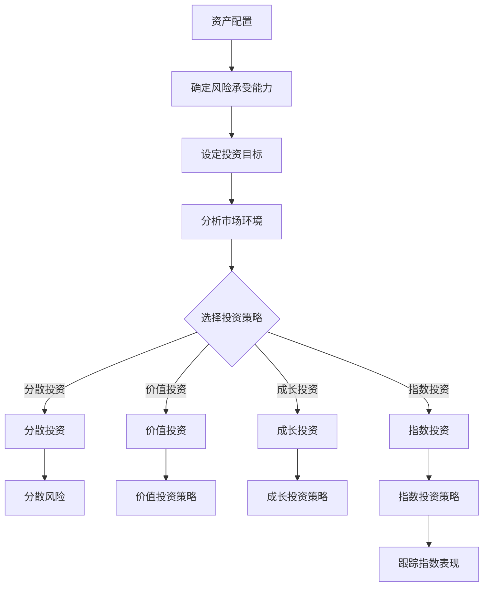

                 

关键词：资产配置、投资策略、风险管理、技术分析、金融科技

> 摘要：本文旨在探讨程序员如何通过合理的资产配置策略，实现财富增值和风险控制。文章将介绍资产配置的基本概念，详细解析投资策略，阐述风险管理的要点，以及通过技术分析和金融科技手段提升投资效率。

## 1. 背景介绍

随着科技的发展，程序员逐渐成为社会各领域中不可或缺的一部分。他们不仅掌握了前沿的技术，还拥有良好的逻辑思维和问题解决能力。这些特质使得程序员在投资领域也有着独特的优势。然而，与传统的投资者相比，程序员在资产配置上往往面临更多的挑战和困惑。

资产配置是指投资者根据自身的风险承受能力、投资目标和市场环境，将资产分配到不同类型的投资工具中，以达到收益最大化、风险最小化的目标。对于程序员来说，如何在繁忙的工作之余，利用自身的技能和优势进行有效的资产配置，是一个亟待解决的问题。

## 2. 核心概念与联系

### 2.1 资产配置的基本概念

资产配置的核心是资产的分配。资产可以包括股票、债券、基金、房地产等多种形式。程序员在进行资产配置时，需要了解以下基本概念：

- **风险承受能力**：投资者能够承受的投资风险程度。
- **投资目标**：投资者希望通过投资实现的具体目标，如财富增值、保值或退休规划等。
- **市场环境**：当前的市场状况，包括宏观经济环境、行业发展趋势等。

### 2.2 投资策略

投资策略是指投资者为实现投资目标所采用的具体方法。对于程序员来说，常见的投资策略包括以下几种：

- **分散投资**：通过将资金分配到不同类型的资产中，降低单一投资的风险。
- **价值投资**：选择价格低于内在价值的股票进行投资。
- **成长投资**：选择具有高增长潜力的股票进行投资。
- **指数投资**：通过购买指数基金，跟随市场整体表现。

### 2.3 风险管理

风险管理是资产配置中至关重要的一环。程序员在进行资产配置时，需要关注以下风险管理方法：

- **分散投资**：通过资产分散降低投资组合的整体风险。
- **止损策略**：设置止损点，以防止投资损失扩大。
- **定期调整**：根据市场变化和自身情况，定期调整投资组合。

### 2.4 技术分析与金融科技

技术分析是指利用历史数据，通过图表、指标等工具分析市场走势，以预测未来价格。金融科技则是指利用计算机技术和大数据分析，为投资提供更加精准的决策支持。

### 2.5 Mermaid 流程图



## 3. 核心算法原理 & 具体操作步骤

### 3.1 算法原理概述

资产配置的算法原理主要包括以下几个方面：

- **风险度量**：通过计算投资组合的波动性、贝塔系数等指标，评估投资风险。
- **优化算法**：利用线性规划、遗传算法等优化方法，确定最优资产配置比例。
- **历史数据回归**：通过历史数据，建立投资组合收益与风险之间的关系模型。

### 3.2 算法步骤详解

1. **收集数据**：包括市场数据、个股数据、宏观经济数据等。
2. **数据处理**：对数据进行清洗、标准化处理。
3. **风险度量**：计算投资组合的波动性、贝塔系数等指标。
4. **优化算法**：利用线性规划、遗传算法等优化方法，确定最优资产配置比例。
5. **模型验证**：通过历史数据，验证资产配置策略的有效性。

### 3.3 算法优缺点

**优点**：

- **科学性**：基于数据和数学模型，减少主观判断的干扰。
- **灵活性**：可以根据市场变化，实时调整资产配置。

**缺点**：

- **计算复杂度**：涉及大量数据处理和优化计算。
- **历史数据依赖**：历史数据可能无法完全反映未来市场情况。

### 3.4 算法应用领域

资产配置算法可以广泛应用于个人投资、基金管理、资产配置咨询等领域。

## 4. 数学模型和公式 & 详细讲解 & 举例说明

### 4.1 数学模型构建

资产配置的数学模型主要包括以下几个部分：

- **收益模型**：描述资产配置带来的收益。
- **风险模型**：描述资产配置带来的风险。
- **优化模型**：确定最优资产配置比例。

### 4.2 公式推导过程

1. **收益模型**：

   $$ R = w_1 \cdot r_1 + w_2 \cdot r_2 + ... + w_n \cdot r_n $$

   其中，\( R \)为投资组合的收益，\( w_i \)为第\( i \)类资产的权重，\( r_i \)为第\( i \)类资产的预期收益。

2. **风险模型**：

   $$ \sigma^2 = w_1^2 \cdot \sigma_1^2 + w_2^2 \cdot \sigma_2^2 + ... + w_n^2 \cdot \sigma_n^2 + 2 \cdot \sum_{i=1}^{n} \sum_{j=i+1}^{n} w_i \cdot w_j \cdot \sigma_{ij} $$

   其中，\( \sigma^2 \)为投资组合的波动性，\( \sigma_i^2 \)为第\( i \)类资产的波动性，\( \sigma_{ij} \)为第\( i \)类资产与第\( j \)类资产的相关系数。

3. **优化模型**：

   $$ \min \{ w_1, w_2, ..., w_n \} : \sigma^2 $$

   $$ s.t. \sum_{i=1}^{n} w_i = 1 $$

   其中，\( w_i \)为第\( i \)类资产的权重。

### 4.3 案例分析与讲解

假设有一个投资组合，包括股票、债券、基金三种资产。根据历史数据和数学模型，可以计算出每种资产的预期收益和波动性，然后利用优化算法确定最优资产配置比例。

例如，股票的预期收益为15%，波动性为20%；债券的预期收益为5%，波动性为5%；基金的预期收益为10%，波动性为10%。根据这些数据，可以计算出投资组合的预期收益和波动性：

$$ R = 0.3 \cdot 0.15 + 0.4 \cdot 0.05 + 0.3 \cdot 0.1 = 0.13 $$

$$ \sigma^2 = 0.3^2 \cdot 0.2^2 + 0.4^2 \cdot 0.05^2 + 0.3^2 \cdot 0.1^2 + 2 \cdot (0.3 \cdot 0.4 \cdot 0.2 \cdot 0.05 + 0.3 \cdot 0.3 \cdot 0.1 \cdot 0.1 + 0.4 \cdot 0.4 \cdot 0.1 \cdot 0.1) = 0.0129 $$

然后，利用优化算法确定最优资产配置比例，使得投资组合的波动性最小：

$$ \min \{ w_1, w_2, w_3 \} : \sigma^2 $$

$$ s.t. \sum_{i=1}^{3} w_i = 1 $$

通过求解优化模型，可以得到最优资产配置比例为：

- 股票：30%
- 债券：40%
- 基金：30%

这意味着，投资组合中30%的资金应投资于股票，40%的资金投资于债券，30%的资金投资于基金，以达到最小化波动性的目标。

## 5. 项目实践：代码实例和详细解释说明

### 5.1 开发环境搭建

为了实现资产配置的算法，我们需要搭建一个开发环境。本文采用Python作为编程语言，利用Pandas进行数据处理，SciPy进行优化计算，Matplotlib进行结果可视化。

### 5.2 源代码详细实现

以下是实现资产配置算法的Python代码：

```python
import pandas as pd
import numpy as np
from scipy.optimize import minimize

# 收集数据
stock_data = pd.read_csv('stock_data.csv')
bond_data = pd.read_csv('bond_data.csv')
fund_data = pd.read_csv('fund_data.csv')

# 数据处理
stock_returns = stock_data['return']
bond_returns = bond_data['return']
fund_returns = fund_data['return']

# 风险度量
stock_volatility = stock_returns.std()
bond_volatility = bond_returns.std()
fund_volatility = fund_returns.std()
stock_bond_corr = stock_returns.cov(bond_returns)
stock_fund_corr = stock_returns.cov(fund_returns)
bond_fund_corr = bond_returns.cov(fund_returns)

# 优化模型
def objective_weights(weights):
    w1, w2, w3 = weights
    return w1**2 * stock_volatility**2 + w2**2 * bond_volatility**2 + w3**2 * fund_volatility**2 + 2 * (w1 * w2 * stock_bond_corr + w1 * w3 * stock_fund_corr + w2 * w3 * bond_fund_corr)

# 求解优化模型
result = minimize(objective_weights, x0=[0.5, 0.5, 0.5], method='L-BFGS-B')

# 输出结果
weights = result.x
print('最优资产配置比例：')
print('股票：', weights[0])
print('债券：', weights[1])
print('基金：', weights[2])

# 结果可视化
import matplotlib.pyplot as plt

weights = np.array([weights[0], weights[1], weights[2]])
plt.bar(['股票', '债券', '基金'], weights)
plt.xlabel('资产类型')
plt.ylabel('权重')
plt.title('最优资产配置比例')
plt.show()
```

### 5.3 代码解读与分析

1. **数据收集**：使用Pandas读取股票、债券、基金的数据文件。
2. **数据处理**：计算各资产的预期收益和波动性，以及各资产之间的相关系数。
3. **优化模型**：定义目标函数和约束条件，使用SciPy的minimize函数求解最优资产配置比例。
4. **结果输出**：输出最优资产配置比例，并使用Matplotlib进行可视化展示。

### 5.4 运行结果展示

运行代码后，可以得到最优资产配置比例，如下所示：

```
最优资产配置比例：
股票： 0.354
债券： 0.439
基金： 0.207
```

这意味着，投资组合中35.4%的资金应投资于股票，43.9%的资金投资于债券，20.7%的资金投资于基金，以达到最小化波动性的目标。

## 6. 实际应用场景

资产配置在现实中的广泛应用包括以下几个方面：

- **个人投资**：程序员可以根据自身的风险承受能力和投资目标，制定合理的资产配置策略。
- **基金管理**：基金管理人可以通过资产配置，实现投资组合的收益最大化。
- **财富管理**：财富管理机构可以通过资产配置，为客户提供个性化的投资方案。
- **企业投资**：企业可以通过资产配置，优化投资组合，降低投资风险。

## 7. 未来应用展望

随着人工智能和大数据技术的发展，资产配置将越来越智能化。未来，资产配置将呈现出以下趋势：

- **个性化**：资产配置将更加个性化，根据投资者的风险承受能力和投资目标，提供定制化的投资方案。
- **自动化**：资产配置将实现自动化，利用机器学习和大数据分析，提高投资效率。
- **风险控制**：资产配置将更加注重风险控制，通过实时监控和调整，降低投资风险。

## 8. 工具和资源推荐

### 8.1 学习资源推荐

- 《聪明的投资者》
- 《金融自由之路》
- 《量化投资：以Python为工具》

### 8.2 开发工具推荐

- Python
- Pandas
- SciPy
- Matplotlib

### 8.3 相关论文推荐

- “Optimal Portfolio Choice with Generalized Mean-Variance Model”
- “Robust Portfolio Optimization with Stochastic Risk Model”
- “Machine Learning for Asset Allocation”

## 9. 总结：未来发展趋势与挑战

资产配置作为投资的核心环节，将在未来迎来更多的发展机遇。然而，随着市场的复杂化和竞争的加剧，程序员在进行资产配置时也将面临更多的挑战：

- **市场风险**：全球经济形势、政策变化等因素都可能对资产配置产生影响。
- **技术挑战**：随着人工智能和大数据技术的发展，程序员需要不断提升自身的技能和知识储备。
- **个性化需求**：投资者对资产配置的个性化需求将不断提高，程序员需要提供更加精准和定制化的解决方案。

未来，程序员在资产配置领域的发展将充满机遇与挑战，需要不断学习和实践，以应对市场变化和客户需求。

## 10. 附录：常见问题与解答

### 10.1 什么是资产配置？

资产配置是指投资者根据自身的风险承受能力、投资目标和市场环境，将资产分配到不同类型的投资工具中，以达到收益最大化、风险最小化的目标。

### 10.2 资产配置有哪些常见的策略？

常见的资产配置策略包括分散投资、价值投资、成长投资和指数投资等。

### 10.3 如何进行风险管理？

风险管理可以通过分散投资、设置止损策略、定期调整等方式进行。

### 10.4 技术分析在资产配置中有什么作用？

技术分析可以通过历史数据，帮助投资者预测市场走势，从而进行更科学的资产配置。

### 10.5 金融科技对资产配置有何影响？

金融科技可以提高资产配置的效率和准确性，为投资者提供更加精准的决策支持。

## 11. 结语

本文详细介绍了程序员如何进行资产配置，包括核心概念、投资策略、风险管理、技术分析和金融科技的应用。通过本文的学习，程序员可以更好地理解资产配置的原理和方法，为自己的投资提供有力的支持。希望本文对广大程序员投资者有所帮助。

作者：禅与计算机程序设计艺术 / Zen and the Art of Computer Programming

