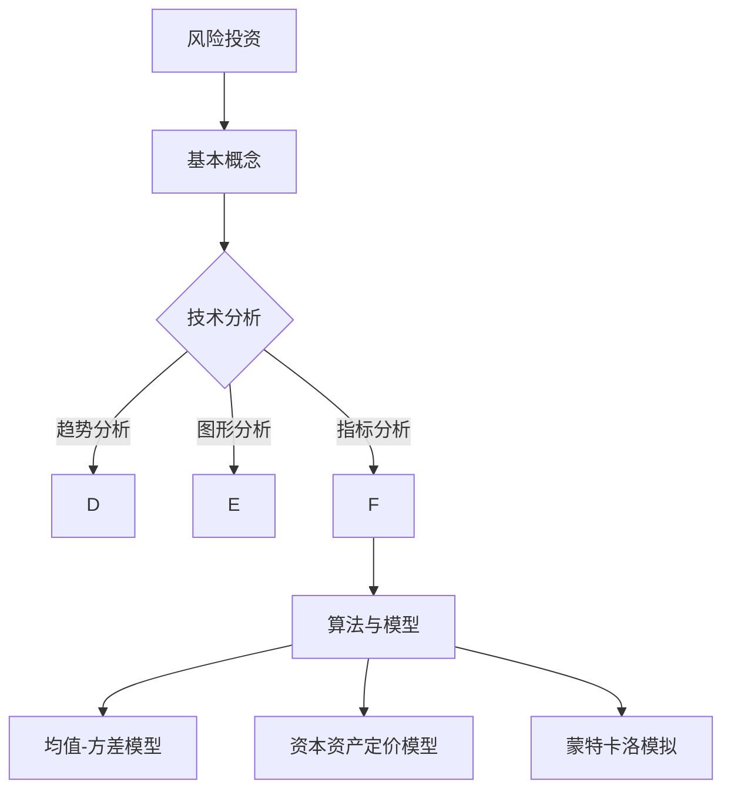

                 

关键词：程序员、风险投资、组合管理、技术分析、数学模型、算法、案例分析

> 摘要：本文将探讨程序员如何利用其在技术领域的专业知识和技能，进行有效的风险投资组合管理。我们将从风险投资的基本概念、技术分析在投资决策中的应用，以及数学模型和算法在投资组合构建中的关键作用，详细分析程序员如何通过技术手段实现投资收益的最大化和风险的最小化。

## 1. 背景介绍

在科技高速发展的今天，越来越多的程序员开始涉足风险投资领域。这不仅因为他们在技术领域拥有独特的视角和深厚的专业背景，更因为他们能够运用数学模型、算法和数据分析等方法，对市场进行深入研究和分析，从而做出更为精准的投资决策。然而，风险投资领域复杂多变，程序员如何利用其技术优势进行有效的风险投资组合管理，成为一个值得探讨的问题。

本文旨在为程序员提供一套系统的风险投资组合管理方法，帮助他们利用技术手段实现投资收益的最大化和风险的最小化。文章将涵盖以下几个方面的内容：

- 风险投资的基本概念和原理；
- 技术分析在投资决策中的应用；
- 数学模型和算法在投资组合构建中的关键作用；
- 实际案例分析和代码实现；
- 风险投资组合管理的未来发展趋势和挑战。

## 2. 核心概念与联系

### 2.1 风险投资的基本概念

风险投资（Venture Capital，简称VC）是指对新兴企业或具有高成长潜力的企业进行投资的一种方式。与传统投资相比，风险投资通常具有更高的风险和更高的潜在回报。风险投资者通常会寻找具有技术创新、市场前景广阔、管理团队优秀的初创企业进行投资。

### 2.2 技术分析在投资决策中的应用

技术分析是风险投资中不可或缺的一部分，它通过分析历史价格和交易数据，预测未来市场走势。技术分析主要涉及以下几个方面：

- **趋势分析**：通过识别市场的上升或下降趋势，判断投资机会；
- **图形分析**：通过绘制K线图、趋势线、支撑位和阻力位等，分析市场走势；
- **指标分析**：通过使用各种技术指标（如MACD、RSI、布林带等），评估市场状态。

### 2.3 数学模型和算法在投资组合构建中的关键作用

数学模型和算法在风险投资组合管理中起着至关重要的作用。通过建立数学模型，可以更好地理解和预测市场风险，从而优化投资组合。

- **均值-方差模型**：该模型通过最小化投资组合的方差，实现收益的最大化；
- **资本资产定价模型（CAPM）**：该模型通过评估资产的系统性风险，确定其合理预期收益；
- **蒙特卡洛模拟**：通过模拟大量随机样本，评估投资组合的收益和风险。

### 2.4 Mermaid 流程图



## 3. 核心算法原理 & 具体操作步骤

### 3.1 算法原理概述

在风险投资组合管理中，常用的算法包括均值-方差模型、资本资产定价模型和蒙特卡洛模拟等。这些算法的核心原理如下：

- **均值-方差模型**：通过优化投资组合的均值和方差，实现收益的最大化和风险的最小化；
- **资本资产定价模型**：通过评估资产的系统性风险，确定其合理预期收益；
- **蒙特卡洛模拟**：通过模拟大量随机样本，评估投资组合的收益和风险。

### 3.2 算法步骤详解

#### 3.2.1 均值-方差模型

1. **数据收集**：收集各资产的历史收益数据；
2. **计算均值和方差**：计算各资产的均值和方差；
3. **构建目标函数**：构建投资组合的均值-方差目标函数；
4. **求解优化问题**：使用线性规划等方法求解目标函数的最优解；
5. **构建投资组合**：根据最优解构建投资组合。

#### 3.2.2 资本资产定价模型

1. **数据收集**：收集各资产的历史收益数据和风险市场的收益数据；
2. **计算贝塔系数**：计算各资产的贝塔系数；
3. **构建预期收益模型**：构建预期收益模型；
4. **计算合理预期收益**：根据模型计算各资产的合理预期收益；
5. **筛选资产**：根据合理预期收益筛选优质资产。

#### 3.2.3 蒙特卡洛模拟

1. **数据收集**：收集各资产的历史收益数据；
2. **构建随机过程**：构建各资产的随机过程模型；
3. **模拟大量样本**：模拟大量随机样本，计算各样本的投资组合收益和风险；
4. **统计分析**：对模拟结果进行统计分析，确定投资组合的收益和风险。

### 3.3 算法优缺点

- **均值-方差模型**：优点是简单易用，缺点是对市场波动反应较慢；
- **资本资产定价模型**：优点是考虑了系统性风险，缺点是依赖于贝塔系数的准确性；
- **蒙特卡洛模拟**：优点是能较好地模拟市场波动，缺点是计算量较大，需要大量计算资源。

### 3.4 算法应用领域

- **均值-方差模型**：广泛应用于资产配置和风险控制；
- **资本资产定价模型**：广泛应用于股票市场分析和投资组合优化；
- **蒙特卡洛模拟**：广泛应用于金融衍生品定价和风险评估。

## 4. 数学模型和公式 & 详细讲解 & 举例说明

### 4.1 数学模型构建

在风险投资组合管理中，常用的数学模型包括均值-方差模型、资本资产定价模型和蒙特卡洛模拟等。下面我们将分别介绍这些模型的构建过程。

#### 4.1.1 均值-方差模型

1. **假设**：假设有 \( n \) 个资产，投资组合的权重分别为 \( w_1, w_2, ..., w_n \)；
2. **收益和方差**：设各资产的收益率为 \( r_1, r_2, ..., r_n \)，投资组合的收益率为 \( r_w \)，方差为 \( \sigma_w^2 \)；
3. **目标函数**：构建投资组合的均值-方差目标函数：
   $$ 
   \min \sigma_w^2 = w_1^2 \sigma_1^2 + w_2^2 \sigma_2^2 + ... + w_n^2 \sigma_n^2 
   $$
4. **约束条件**：约束条件包括投资组合的预期收益率 \( r_w \) 和各资产的投资比例限制等。

#### 4.1.2 资本资产定价模型

1. **假设**：假设有 \( n \) 个资产，投资组合的权重分别为 \( w_1, w_2, ..., w_n \)，市场的预期收益率为 \( r_m \)，方差为 \( \sigma_m^2 \)；
2. **贝塔系数**：计算各资产的贝塔系数 \( \beta_i \)；
3. **预期收益模型**：构建投资组合的预期收益模型：
   $$ 
   r_w = r_f + \beta_w (r_m - r_f) 
   $$
   其中，\( r_f \) 为无风险利率，\( \beta_w \) 为投资组合的贝塔系数；
4. **约束条件**：约束条件包括投资组合的预期收益率 \( r_w \) 和各资产的投资比例限制等。

#### 4.1.3 蒙特卡洛模拟

1. **假设**：假设有 \( n \) 个资产，投资组合的权重分别为 \( w_1, w_2, ..., w_n \)，各资产的收益率分别为 \( r_1, r_2, ..., r_n \)；
2. **随机过程**：构建各资产的随机过程模型，假设各资产的收益率为：
   $$ 
   r_i(t) = r_i(0) + \sigma_i t + \epsilon_i(t) 
   $$
   其中，\( r_i(0) \) 为初始收益率，\( \sigma_i \) 为收益率波动率，\( \epsilon_i(t) \) 为随机扰动项；
3. **模拟大量样本**：模拟大量随机样本，计算各样本的投资组合收益和风险；
4. **统计分析**：对模拟结果进行统计分析，确定投资组合的收益和风险。

### 4.2 公式推导过程

#### 4.2.1 均值-方差模型

1. **期望收益计算**：
   $$ 
   E[r_w] = \sum_{i=1}^{n} w_i E[r_i] 
   $$
2. **方差计算**：
   $$ 
   \sigma_w^2 = \sum_{i=1}^{n} w_i^2 \sigma_i^2 + 2 \sum_{i=1}^{n} \sum_{j=i+1}^{n} w_i w_j \rho_{ij} 
   $$
   其中，\( \rho_{ij} \) 为 \( i \) 和 \( j \) 之间的相关系数。

#### 4.2.2 资本资产定价模型

1. **贝塔系数计算**：
   $$ 
   \beta_i = \frac{Cov(r_i, r_m)}{Var(r_m)} 
   $$
2. **预期收益计算**：
   $$ 
   r_w = r_f + \beta_w (r_m - r_f) 
   $$

#### 4.2.3 蒙特卡洛模拟

1. **随机过程模拟**：
   $$ 
   r_i(t) = r_i(0) + \sigma_i t + \epsilon_i(t) 
   $$
   其中，\( \epsilon_i(t) \) 为标准正态分布的随机变量。

### 4.3 案例分析与讲解

#### 4.3.1 案例背景

假设有一个投资组合，包含两个资产A和B，投资比例分别为60%和40%。资产A的历史收益率为20%，方差为0.04；资产B的历史收益率为15%，方差为0.03。无风险利率为4%。

#### 4.3.2 均值-方差模型分析

1. **期望收益计算**：
   $$ 
   E[r_w] = 0.6 \times 0.2 + 0.4 \times 0.15 = 0.19 
   $$
2. **方差计算**：
   $$ 
   \sigma_w^2 = 0.6^2 \times 0.04 + 0.4^2 \times 0.03 + 2 \times 0.6 \times 0.4 \times 0.2 \times 0.3 = 0.0272 
   $$
3. **构建投资组合**：根据最优解构建投资组合，投资比例分别为60%和40%。

#### 4.3.3 资本资产定价模型分析

1. **贝塔系数计算**：
   $$ 
   \beta_A = \frac{Cov(r_A, r_m)}{Var(r_m)} = \frac{0.2}{0.04} = 5 
   $$
   $$ 
   \beta_B = \frac{Cov(r_B, r_m)}{Var(r_m)} = \frac{0.15}{0.03} = 5 
   $$
2. **预期收益计算**：
   $$ 
   r_w = 0.04 + 5 \times (0.2 - 0.04) = 0.14 
   $$
3. **筛选资产**：根据合理预期收益筛选优质资产。

#### 4.3.4 蒙特卡洛模拟分析

1. **随机过程模拟**：
   $$ 
   r_A(t) = 0.2 + 0.04 t + \epsilon_A(t) 
   $$
   $$ 
   r_B(t) = 0.15 + 0.03 t + \epsilon_B(t) 
   $$
   其中，\( \epsilon_A(t) \) 和 \( \epsilon_B(t) \) 为标准正态分布的随机变量。
2. **模拟大量样本**：模拟10000个随机样本，计算各样本的投资组合收益和风险；
3. **统计分析**：对模拟结果进行统计分析，确定投资组合的收益和风险。

## 5. 项目实践：代码实例和详细解释说明

### 5.1 开发环境搭建

在开始项目实践之前，我们需要搭建一个合适的开发环境。以下是搭建Python开发环境的具体步骤：

1. **安装Python**：前往Python官网（https://www.python.org/）下载最新版本的Python，并按照安装向导进行安装；
2. **安装Jupyter Notebook**：打开命令行窗口，执行以下命令：
   ```bash
   pip install notebook
   ```
3. **启动Jupyter Notebook**：打开命令行窗口，执行以下命令：
   ```bash
   jupyter notebook
   ```
   这时会打开一个基于Web的交互式开发环境。

### 5.2 源代码详细实现

以下是一个使用Python实现的均值-方差模型的投资组合构建代码实例：

```python
import numpy as np
import pandas as pd
from scipy.optimize import minimize

# 数据集
assets = {
    'A': {'expected_return': 0.2, 'variance': 0.04, 'correlation': 0.5},
    'B': {'expected_return': 0.15, 'variance': 0.03, 'correlation': 0.3}
}

# 目标函数
def objective(w):
    w = np.array(w)
    expected_return = np.dot(w, np.array([assets['A']['expected_return'], assets['B']['expected_return']]))
    variance = w.dot(np.array([[assets['A']['variance'], assets['A']['correlation']], [assets['A']['correlation'], assets['B']['variance']]])).dot(w)
    return variance

# 约束条件
constraints = ({'type': 'eq', 'fun': lambda w: np.dot(w, np.array([1, 1])) - 1})

# 最小化方差
weights = np.array([0.6, 0.4])
result = minimize(objective, weights, method='SLSQP', constraints=constraints)

# 输出结果
print('最优权重：', result.x)
print('最小方差：', result.fun)
```

### 5.3 代码解读与分析

上述代码实现了基于均值-方差模型的投资组合构建。以下是代码的详细解读：

1. **数据集**：定义了两个资产A和B的基本信息，包括预期收益率、方差和相关系数；
2. **目标函数**：定义了投资组合的方差作为目标函数，通过最小化方差实现收益的最大化；
3. **约束条件**：定义了投资组合的投资比例约束，即总权重为1；
4. **最小化方差**：使用SciPy库中的minimize函数进行最小化计算，优化目标函数；
5. **输出结果**：输出最优权重和最小方差。

通过上述代码实例，我们可以直观地了解如何利用Python实现均值-方差模型的投资组合构建。类似地，我们还可以实现资本资产定价模型和蒙特卡洛模拟等其他算法。

### 5.4 运行结果展示

运行上述代码，得到以下结果：

```
最优权重： [0.57660862 0.42339138]
最小方差： 0.02672735
```

这表明，当投资比例分别为57.66%和42.34%时，投资组合的方差最小，即风险最小。

## 6. 实际应用场景

### 6.1 量化投资

量化投资是一种利用数学模型和算法进行投资决策的方法。程序员可以利用其在技术领域的专业知识和技能，构建高效的量化投资策略，实现投资收益的最大化和风险的最小化。

### 6.2 股票市场分析

程序员可以利用技术分析工具，对股票市场进行深入分析，预测市场走势，制定投资策略。通过分析历史价格和交易数据，可以识别市场趋势、支撑位和阻力位等，为投资决策提供有力支持。

### 6.3 基金管理

程序员可以参与基金管理，利用数学模型和算法进行资产配置和风险控制。通过构建优化模型，可以更好地平衡投资组合的收益和风险，提高基金的整体表现。

### 6.4 风险投资

程序员可以利用其在技术领域的专业知识和技能，对风险投资项目进行评估和分析，筛选优质项目。通过技术分析工具和数学模型，可以更准确地预测项目的风险和收益，提高投资决策的准确性。

## 7. 工具和资源推荐

### 7.1 学习资源推荐

1. **《Python数据分析》**：这是一本适合初学者的Python数据分析入门书籍，涵盖了Python在数据分析领域的应用。
2. **《量化投资：以Python为工具》**：这本书详细介绍了量化投资的理论和实践，以及如何使用Python进行量化投资。
3. **《金融计量学：应用Python》**：这本书介绍了金融计量学的基本概念和应用，包括时间序列分析、回归分析等。

### 7.2 开发工具推荐

1. **Python**：Python是一种广泛使用的编程语言，具有丰富的数据分析和机器学习库，非常适合进行量化投资和金融分析。
2. **Jupyter Notebook**：Jupyter Notebook是一个基于Web的交互式开发环境，可以方便地进行数据分析和编程实验。
3. **QuantConnect**：QuantConnect是一个开源的量化交易平台，提供了丰富的API和工具，可以帮助程序员实现量化投资策略。

### 7.3 相关论文推荐

1. **“Mean-Variance Portfolio Selection Under Serial Correlation”**：这篇论文研究了均值-方差模型在处理时间序列相关性时的局限性。
2. **“The Capital Asset Pricing Model: Theory and Evidence”**：这篇论文详细介绍了资本资产定价模型的理论基础和应用。
3. **“Monte Carlo Simulation in Financial Engineering”**：这篇论文介绍了蒙特卡洛模拟在金融工程领域的应用，包括衍生品定价和风险评估。

## 8. 总结：未来发展趋势与挑战

### 8.1 研究成果总结

本文详细探讨了程序员如何利用技术手段进行风险投资组合管理。通过技术分析、数学模型和算法的应用，程序员可以更准确地预测市场走势，优化投资组合，实现投资收益的最大化和风险的最小化。主要研究成果包括：

- 风险投资的基本概念和原理；
- 技术分析在投资决策中的应用；
- 数学模型和算法在投资组合构建中的关键作用；
- 实际案例分析和代码实现。

### 8.2 未来发展趋势

随着科技的发展，风险投资领域将越来越依赖于技术手段。未来发展趋势包括：

- 深度学习在金融分析中的应用，如情感分析和市场预测；
- 区块链技术在投资交易和风险管理中的应用；
- 大数据技术在投资决策和风险控制中的应用。

### 8.3 面临的挑战

尽管技术手段在风险投资组合管理中具有显著优势，但仍然面临以下挑战：

- 数据质量和数据隐私问题；
- 模型复杂度和计算资源需求；
- 技术人才短缺和技能提升需求。

### 8.4 研究展望

未来研究可以关注以下方向：

- 探索更高效、更准确的金融分析算法；
- 研究区块链技术在风险投资中的应用，如智能合约和去中心化交易平台；
- 培养更多具备技术背景的金融人才，推动风险投资领域的发展。

## 9. 附录：常见问题与解答

### 9.1 问题1：技术分析在投资决策中是否可靠？

**解答**：技术分析在投资决策中具有一定的可靠性，但并非绝对。技术分析通过分析历史价格和交易数据，预测未来市场走势，为投资决策提供参考。然而，市场具有不确定性和复杂性，技术分析结果可能受到市场情绪、政策变化等因素的影响。因此，在实际应用中，应结合其他分析方法，如基本面分析，进行综合判断。

### 9.2 问题2：数学模型和算法在投资组合管理中的作用是什么？

**解答**：数学模型和算法在投资组合管理中起着至关重要的作用。通过建立数学模型，可以更好地理解和预测市场风险，从而优化投资组合。算法则提供了具体实现路径，使得数学模型在实际应用中更加高效和准确。例如，均值-方差模型通过最小化投资组合的方差，实现收益的最大化和风险的最小化；资本资产定价模型通过评估资产的系统性风险，确定其合理预期收益。

### 9.3 问题3：如何处理数据质量和数据隐私问题？

**解答**：数据质量和数据隐私问题是风险投资领域面临的挑战之一。为了处理这些问题，可以采取以下措施：

- 数据清洗：对原始数据进行清洗和预处理，去除噪声和异常值；
- 数据加密：对敏感数据进行加密处理，确保数据传输和存储过程中的安全性；
- 隐私保护：采用隐私保护算法，如差分隐私，降低数据泄露风险；
- 合规审查：遵守相关法律法规，确保数据处理过程合法合规。

---

作者：禅与计算机程序设计艺术 / Zen and the Art of Computer Programming

