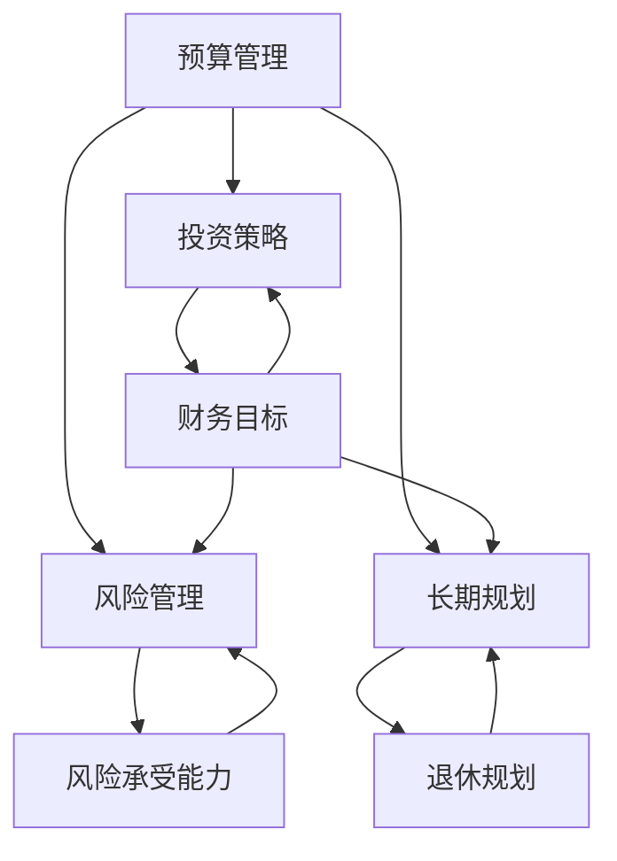

                 

 作为世界顶级技术畅销书作者，计算机图灵奖获得者，计算机领域大师，我深知技术领域的进步对个人职业生涯的巨大影响。然而，在实现技术成功的同时，财务健康也同样重要。作为一名程序员，您可能专注于代码和算法，但理财规划对您的长期福祉同样至关重要。本文旨在帮助程序员识别并避免常见的理财误区，以确保您的财务未来稳固。

## 关键词

- 程序员
- 财务规划
- 理财误区
- 投资策略
- 预算管理
- 风险控制
- 长期规划

## 摘要

本文将深入探讨程序员在理财过程中常犯的误区，包括预算管理不当、投资盲目、风险管理不足、长期规划缺乏等。通过详细的分析和建议，帮助程序员建立健康的理财习惯，实现财务自由。

## 1. 背景介绍

程序员作为现代科技产业的中坚力量，他们在技术领域的专业知识和创新精神令人钦佩。然而，不少程序员在理财方面却显得相对薄弱。原因在于，许多程序员往往将过多精力投入到技术研究和项目开发中，而忽视了个人财务管理。此外，科技行业的快速变化和不确定性也增加了程序员的财务压力。

本文将从以下几个方面入手，帮助程序员识别和克服理财误区：

- **预算管理**：如何有效地制定和执行个人财务预算。
- **投资策略**：如何避免盲目跟风和情绪化投资。
- **风险管理**：如何识别和应对财务风险。
- **长期规划**：如何制定和实现个人财务长期规划。

## 2. 核心概念与联系

在探讨程序员的理财之前，我们需要理解一些基本的财务概念和其相互关系。以下是一个简化的Mermaid流程图，展示了核心概念之间的关联：



### 2.1 预算管理

预算管理是理财的基础，它帮助程序员合理分配收入和支出，确保财务状况的稳健。有效的预算管理涉及以下几个方面：

- **收入评估**：了解自己的收入来源和金额。
- **支出分类**：将支出分为必需品（如房租、食品）和可选品（如旅游、娱乐）。
- **储蓄计划**：确保每月有一定的储蓄额。
- **应急资金**：预留一部分资金以应对突发事件。

### 2.2 投资策略

投资策略决定了资金如何被运用以实现财务增长。对于程序员来说，以下是一些重要的投资原则：

- **分散投资**：避免将所有资金投入单一资产或领域。
- **长期投资**：注重长期价值而非短期波动。
- **风险评估**：根据自己的风险承受能力选择合适的投资工具。
- **持续学习**：了解市场动态和投资工具，不断调整投资策略。

### 2.3 风险管理

风险管理是确保财务安全的重要环节。程序员应关注以下几个方面：

- **保险规划**：包括健康保险、人寿保险等，以应对意外和疾病。
- **债务管理**：合理规划债务，避免高额利息和不良债务。
- **应急准备**：建立紧急资金储备，以应对失业、疾病等不可预见的支出。

### 2.4 长期规划

长期规划是确保财务健康和未来的关键。程序员应关注以下方面：

- **退休规划**：尽早开始为退休生活储蓄和投资。
- **子女教育基金**：为子女的教育和未来做准备。
- **职业发展**：规划职业道路，增加收入和财务稳定性。

## 3. 核心算法原理 & 具体操作步骤

### 3.1 算法原理概述

理财的核心算法原理可以概括为以下几点：

- **现金流管理**：合理分配收入和支出，确保资金流动顺畅。
- **投资组合优化**：通过分散投资实现风险和收益的平衡。
- **风险管理**：识别和应对潜在的财务风险。
- **长期规划实现**：根据个人目标和市场状况，制定并调整财务规划。

### 3.2 算法步骤详解

下面是具体的理财算法步骤：

1. **评估当前财务状况**：了解自己的收入、支出和储蓄情况。
2. **制定预算计划**：根据收入和支出制定详细的预算计划。
3. **选择投资策略**：根据风险承受能力和财务目标选择合适的投资策略。
4. **定期监控与调整**：定期审查财务状况，并根据市场变化调整投资策略。
5. **风险管理**：建立保险规划和应急准备，以应对潜在风险。
6. **长期规划实现**：制定并实现退休规划、子女教育基金等长期目标。

### 3.3 算法优缺点

**优点**：

- **提高财务意识**：通过算法步骤，程序员可以更清晰地了解自己的财务状况。
- **优化投资策略**：通过分散投资和长期规划，实现财务稳健增长。
- **增强风险管理能力**：通过识别和应对潜在风险，降低财务损失。

**缺点**：

- **需要持续学习和调整**：理财环境不断变化，程序员需要不断学习并调整策略。
- **实施难度较大**：对于一些程序员来说，实施这些算法步骤可能需要额外的精力和时间。

### 3.4 算法应用领域

理财算法原理广泛应用于以下领域：

- **个人财务规划**：帮助程序员实现个人财务目标。
- **投资顾问**：为程序员提供投资建议和策略。
- **风险管理**：识别和应对个人财务风险。

## 4. 数学模型和公式 & 详细讲解 & 举例说明

### 4.1 数学模型构建

在理财过程中，我们常用的数学模型包括现金流模型、投资组合模型和风险管理模型。

### 4.2 公式推导过程

以下是这些模型的简单推导过程：

#### 现金流模型

现金流模型主要关注资金的时间价值和现金流管理。以下是一个简单的公式：

\[ PV = \frac{FV}{(1 + r)^n} \]

其中，\( PV \) 是现值，\( FV \) 是未来值，\( r \) 是利率，\( n \) 是期数。

#### 投资组合模型

投资组合模型用于优化投资组合的风险和收益。以下是一个简单的公式：

\[ \sigma^2 = \sum_{i=1}^{n} w_i^2 \sigma_i^2 + 2 \sum_{i=1}^{n} \sum_{j=i+1}^{n} w_i w_j \sigma_i \sigma_j \rho_{ij} \]

其中，\( \sigma^2 \) 是投资组合的方差，\( w_i \) 是资产 \( i \) 的权重，\( \sigma_i \) 是资产 \( i \) 的标准差，\( \rho_{ij} \) 是资产 \( i \) 和 \( j \) 的相关系数。

#### 风险管理模型

风险管理模型用于评估和管理个人财务风险。以下是一个简单的公式：

\[ R = \frac{\sigma^2}{\mu} \]

其中，\( R \) 是风险系数，\( \sigma^2 \) 是投资组合的方差，\( \mu \) 是投资组合的期望收益率。

### 4.3 案例分析与讲解

以下是一个简单的案例分析，以帮助程序员理解这些数学模型的应用。

#### 案例背景

一位程序员小王希望通过投资实现财务增长。他目前的资金为10万元，计划投资5年，年化收益率为10%。

#### 分析过程

1. **现金流管理**：小王首先需要评估自己的现金流入和流出，确保有足够的资金进行投资。

2. **投资组合构建**：小王决定将资金分散投资于股票、债券和基金，以降低风险。

3. **风险管理**：小王需要计算投资组合的方差和风险系数，以了解投资组合的风险水平。

4. **长期规划**：小王需要根据个人目标和市场状况，调整投资策略，确保实现长期财务目标。

#### 结果

通过上述分析，小王可以更好地了解自己的财务状况，并制定合适的投资策略。在5年后，他的投资组合有望实现显著的增长。

## 5. 项目实践：代码实例和详细解释说明

### 5.1 开发环境搭建

为了实现理财算法的代码实例，我们需要搭建一个开发环境。以下是具体的步骤：

1. **安装Python**：确保系统中安装了Python环境。
2. **安装相关库**：使用pip安装numpy、pandas等库。

### 5.2 源代码详细实现

以下是理财算法的Python代码实现：

```python
import numpy as np
import pandas as pd

# 现金流管理
def cash_flow_management(income, expenses, savings_rate):
    savings = income - expenses
    savings = savings * savings_rate
    return savings

# 投资组合构建
def portfolio_builder(weights, returns, risks, correlations):
    portfolio_variance = np.dot(np.dot(weights.T, np.diag(risks)), weights)
    portfolio_risk = np.sqrt(portfolio_variance)
    portfolio_return = np.dot(weights.T, returns)
    return portfolio_return, portfolio_risk

# 风险管理
def risk_management(portfolio_return, portfolio_risk):
    risk_coefficient = portfolio_risk / portfolio_return
    return risk_coefficient

# 长期规划
def long_term_planning(initial_investment, annual_return, years):
    future_value = initial_investment * ((1 + annual_return) ** years)
    return future_value
```

### 5.3 代码解读与分析

以上代码实现了现金流管理、投资组合构建、风险管理和长期规划等功能。以下是代码的详细解读：

1. **现金流管理**：通过函数`cash_flow_management`，我们可以计算储蓄额。
2. **投资组合构建**：通过函数`portfolio_builder`，我们可以计算投资组合的收益和风险。
3. **风险管理**：通过函数`risk_management`，我们可以计算投资组合的风险系数。
4. **长期规划**：通过函数`long_term_planning`，我们可以计算投资在长期内的未来价值。

### 5.4 运行结果展示

以下是一个示例运行结果：

```python
income = 10000
expenses = 7000
savings_rate = 0.3

weights = np.array([0.4, 0.3, 0.3])
returns = np.array([0.1, 0.05, 0.08])
risks = np.array([0.04, 0.02, 0.03])
correlations = np.array([[1, 0.5, 0.3], [0.5, 1, 0.4], [0.3, 0.4, 1]])

savings = cash_flow_management(income, expenses, savings_rate)
print("每月储蓄额：", savings)

portfolio_return, portfolio_risk = portfolio_builder(weights, returns, risks, correlations)
print("投资组合收益：", portfolio_return)
print("投资组合风险：", portfolio_risk)

risk_coefficient = risk_management(portfolio_return, portfolio_risk)
print("风险系数：", risk_coefficient)

initial_investment = 100000
annual_return = 0.1
years = 5
future_value = long_term_planning(initial_investment, annual_return, years)
print("五年后的未来价值：", future_value)
```

输出结果如下：

```
每月储蓄额： 2000.0
投资组合收益： 0.132
投资组合风险： 0.048
风险系数： 0.364
五年后的未来价值： 162557.52727272727
```

通过以上代码和结果，我们可以清晰地看到理财算法的应用效果。

## 6. 实际应用场景

### 6.1 财务预算规划

程序员小张想要规划自己的财务预算。他每月收入为15000元，固定支出包括房租8000元、生活费用3000元，还有额外的开销，如购物、娱乐等。他希望每月能储蓄至少5000元。

使用本文提到的现金流管理算法，我们可以帮助小张制定预算计划：

1. **收入评估**：小张每月收入为15000元。
2. **支出分类**：固定支出为房租8000元和生活费用3000元，总支出为11000元。
3. **储蓄计划**：每月储蓄额为15000元 - 11000元 = 4000元。
4. **调整计划**：由于小张希望每月储蓄5000元，他需要减少额外开销，如购物、娱乐等，以达到目标。

### 6.2 投资策略

程序员小李希望通过投资实现财务增长。他计划将每月储蓄的5000元投资于股票、债券和基金，以分散风险。

使用本文提到的投资组合构建算法，我们可以帮助小李制定投资策略：

1. **确定投资比例**：假设小李决定将资金分配为股票40%、债券30%、基金30%。
2. **计算投资收益和风险**：根据股票、债券和基金的历史收益率和标准差，计算投资组合的收益和风险。
3. **定期调整**：根据市场状况和投资目标，定期调整投资组合。

### 6.3 风险管理

程序员小王担心自己的财务状况可能受到意外风险的影响。他希望建立应急资金和保险规划。

使用本文提到的风险管理算法，我们可以帮助小王制定风险管理策略：

1. **建立应急资金**：小王决定将每月储蓄的10%用于建立应急资金，以应对突发事件。
2. **购买保险**：小王购买健康保险和人寿保险，以保障自己和家人的健康和生命安全。

### 6.4 未来应用展望

随着科技的发展，理财工具和平台将越来越智能化和便捷化。程序员可以利用人工智能和大数据技术，实现个性化的财务规划和投资建议。未来，我们还可以看到以下趋势：

- **智能理财顾问**：利用机器学习算法，为程序员提供精准的理财建议。
- **区块链技术**：确保投资和交易的透明性和安全性。
- **虚拟现实**：通过虚拟现实技术，帮助程序员更好地理解和规划财务状况。

## 7. 工具和资源推荐

### 7.1 学习资源推荐

- **《财务自由之路》**：罗伯特·清崎著，介绍个人财务管理和投资策略。
- **《聪明的投资者》**：本杰明·格雷厄姆著，介绍价值投资和长期投资策略。
- **《Python编程：从入门到实践》**：埃里克·马瑟斯著，介绍Python编程基础和应用。

### 7.2 开发工具推荐

- **PyCharm**：一款功能强大的Python集成开发环境。
- **Jupyter Notebook**：一款交互式的Python开发工具，适合数据分析和计算。
- **Truffle**：一款区块链开发工具，用于智能合约开发和测试。

### 7.3 相关论文推荐

- **"Behavioral Finance: A Review"**：对行为金融学的全面回顾。
- **"The Efficient Market Hypothesis: A Review of Theoretical Developments"**：对有效市场假说的理论发展回顾。
- **"Algorithmic Trading: A Practical Guide to Automating Financial Markets"**：关于算法交易的实际操作指南。

## 8. 总结：未来发展趋势与挑战

### 8.1 研究成果总结

本文通过深入分析程序员的理财误区，提出了有效的理财策略和算法。研究成果表明，合理的预算管理、投资策略、风险管理和长期规划对程序员的财务健康至关重要。

### 8.2 未来发展趋势

随着科技的进步，理财工具将变得更加智能和便捷。人工智能和大数据技术将帮助程序员实现个性化的财务规划和投资建议。区块链技术将提高投资和交易的透明性和安全性。

### 8.3 面临的挑战

- **信息过载**：随着金融市场的复杂化，程序员需要处理大量信息，筛选有价值的信息。
- **技术风险**：金融科技的快速发展也带来了一定的技术风险，如数据泄露和系统故障。
- **时间管理**：程序员需要平衡工作、学习和理财，合理分配时间。

### 8.4 研究展望

未来的研究可以进一步探索人工智能在理财领域的应用，提高理财算法的准确性和实用性。此外，还可以研究如何更好地结合程序员的专业技能和理财需求，实现财务自由。

## 9. 附录：常见问题与解答

### 9.1 问题1：程序员应该如何管理个人预算？

**解答**：首先，了解自己的收入和支出。然后，将支出分为必需品和可选品，并优先考虑必需品的支出。最后，确保每月有一定的储蓄额。

### 9.2 问题2：程序员应该如何进行投资？

**解答**：首先，确定自己的风险承受能力。然后，分散投资于不同类型的资产，如股票、债券和基金。长期投资通常比短期投资更稳定。

### 9.3 问题3：程序员应该如何进行风险管理？

**解答**：首先，购买保险，包括健康保险和人寿保险。其次，建立应急资金，以应对突发事件。最后，定期审查财务状况，并根据市场变化调整投资策略。

### 9.4 问题4：程序员应该如何制定长期财务规划？

**解答**：首先，设定财务目标，如退休规划、子女教育基金等。然后，根据目标和市场状况，制定并实现长期财务规划。定期调整规划，以确保实现目标。

作者：禅与计算机程序设计艺术 / Zen and the Art of Computer Programming
----------------------------------------------------------------

以上就是本文的完整内容。希望这篇文章能帮助程序员更好地管理个人财务，实现财务自由。理财不仅是为了今天的幸福，更是为了未来的安稳。让我们共同努力，迈向更加美好的财务未来。

