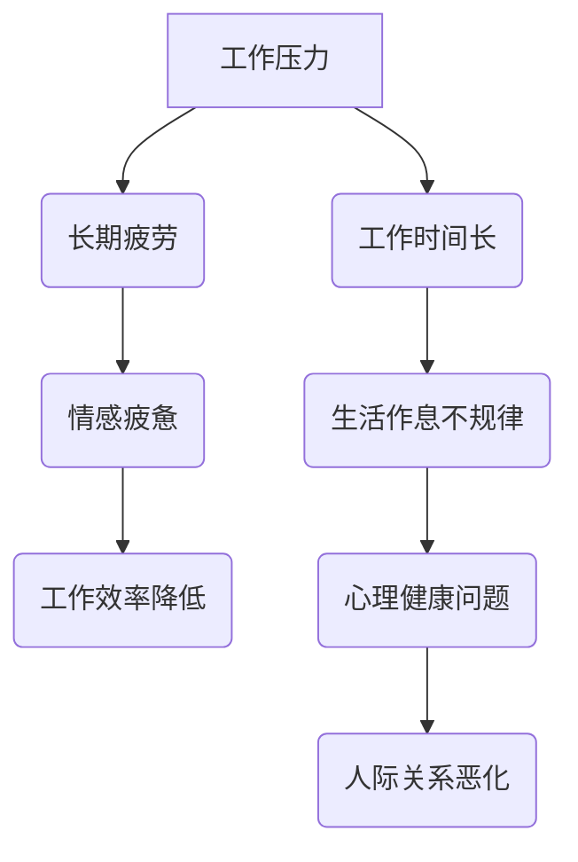

                 

关键词：职业倦怠、程序员、心理健康、工作压力、职业规划、自我管理

## 摘要

本文旨在探讨程序员如何避免职业倦怠，通过深入分析职业倦怠的成因，结合实际案例，提出一系列针对性的解决方案。我们将从心理调适、工作环境优化、职业规划、自我管理等多个方面，提供实用的建议，帮助程序员保持身心健康，提高工作效率。

## 1. 背景介绍

### 1.1 程序员职业的现状

随着信息技术的飞速发展，程序员已经成为现代社会中不可或缺的职业。根据国际数据公司（IDC）的报告，全球IT市场的规模预计将在2025年达到4.5万亿美元。程序员的需求量持续增长，同时，工作压力和竞争压力也日益加剧。

### 1.2 职业倦怠的定义及危害

职业倦怠（Burnout）是指个体在长期的工作压力下，出现情感疲惫、工作热情下降、工作效率降低等现象。据世界卫生组织（WHO）的数据，全球约有30%-40%的职场人士患有职业倦怠。对于程序员而言，职业倦怠不仅会影响个人的心理健康，还会降低工作效率，甚至影响整个团队的项目进度。

## 2. 核心概念与联系

### 2.1 职业倦怠的成因

职业倦怠的成因复杂，主要包括以下几个方面：

- **工作压力**：程序员的工作往往需要高度集中精力，面对大量的代码和复杂的技术问题，长期的工作压力容易导致疲劳。
- **工作时间**：许多程序员需要加班，工作时间长，导致生活作息不规律。
- **个人因素**：个人的心理素质、抗压能力、职业规划等也会影响职业倦怠的产生。
- **工作环境**：不健康的办公环境、缺乏有效的团队协作等也会加剧职业倦怠。

### 2.2 职业倦怠的影响

- **心理健康**：职业倦怠会导致程序员出现焦虑、抑郁等心理问题。
- **工作效率**：职业倦怠会降低程序员的工作效率，甚至导致项目延误。
- **人际关系**：长期处于职业倦怠状态，程序员的人际关系也会受到影响。

### 2.3 Mermaid 流程图



## 3. 核心算法原理 & 具体操作步骤

### 3.1 算法原理概述

为了避免职业倦怠，我们需要从以下几个方面入手：

- **心理调适**：通过心理辅导、放松训练等方法，提高抗压能力。
- **工作环境优化**：改善办公环境，促进团队合作。
- **职业规划**：明确职业目标，制定合理的职业规划。
- **自我管理**：合理安排工作与生活，保持良好的生活习惯。

### 3.2 算法步骤详解

#### 3.2.1 心理调适

1. **自我认知**：认识到职业倦怠的危害，主动寻求帮助。
2. **心理辅导**：定期进行心理辅导，寻求专业心理咨询。
3. **放松训练**：通过冥想、瑜伽等方式，缓解压力。

#### 3.2.2 工作环境优化

1. **团队协作**：建立有效的团队协作机制，提高工作效率。
2. **工作安排**：合理安排工作任务，避免过度加班。
3. **办公环境**：改善办公环境，提供舒适的办公条件。

#### 3.2.3 职业规划

1. **目标设定**：明确职业目标，制定长期和短期目标。
2. **技能提升**：通过学习新技能，提高职业竞争力。
3. **职业转换**：适时考虑职业转换，避免长期在同一领域工作。

#### 3.2.4 自我管理

1. **时间管理**：合理安排工作时间，避免过度劳累。
2. **生活习惯**：保持良好的生活习惯，保持健康的生活方式。
3. **心理建设**：培养积极向上的心态，增强抗压能力。

### 3.3 算法优缺点

#### 3.3.1 优点

- **全面性**：算法涵盖了心理调适、工作环境优化、职业规划、自我管理等多个方面，具有全面性。
- **实用性**：算法提供了一系列实用的方法，可以帮助程序员有效地避免职业倦怠。

#### 3.3.2 缺点

- **实施难度**：某些方法需要较大的时间投入和精力投入，对程序员的生活和工作产生一定影响。
- **效果评价**：算法的效果评价存在一定的难度，需要长时间观察和评估。

### 3.4 算法应用领域

- **企业内部培训**：企业可以组织内部培训，帮助程序员掌握避免职业倦怠的方法。
- **职场心理咨询**：职场心理咨询师可以运用这些方法，为程序员提供专业的心理咨询。

## 4. 数学模型和公式 & 详细讲解 & 举例说明

### 4.1 数学模型构建

为了避免职业倦怠，我们可以构建一个数学模型，用于评估程序员的职业倦怠程度。假设：

- **P**：程序员的职业倦怠程度（0-100分）
- **S**：程序员的压力值（0-100分）
- **W**：程序员的自我管理能力（0-100分）
- **E**：程序员的职业环境（0-100分）

则职业倦怠程度可以用以下公式表示：

\[ P = \frac{S + W + E}{3} \]

### 4.2 公式推导过程

1. 压力值 \( S \) 与职业倦怠程度 \( P \) 的关系：
   \[ P = f(S) \]
   其中 \( f \) 为非线性函数，表示压力值对职业倦怠程度的影响。

2. 自我管理能力 \( W \) 与职业倦怠程度 \( P \) 的关系：
   \[ P = g(W) \]
   其中 \( g \) 为非线性函数，表示自我管理能力对职业倦怠程度的影响。

3. 职业环境 \( E \) 与职业倦怠程度 \( P \) 的关系：
   \[ P = h(E) \]
   其中 \( h \) 为非线性函数，表示职业环境对职业倦怠程度的影响。

4. 综合以上三个因素，职业倦怠程度 \( P \) 可以表示为：
   \[ P = \frac{S + W + E}{3} \]

### 4.3 案例分析与讲解

假设有程序员小张，他的压力值为 80 分，自我管理能力为 70 分，职业环境为 90 分。根据公式：

\[ P = \frac{80 + 70 + 90}{3} = \frac{240}{3} = 80 \]

小张的职业倦怠程度为 80 分。这说明小张需要加强自我管理能力，同时改善职业环境，以降低职业倦怠程度。

## 5. 项目实践：代码实例和详细解释说明

### 5.1 开发环境搭建

为了更好地理解避免职业倦怠的方法，我们可以使用 Python 编写一个简单的代码实例。首先，我们需要搭建一个基本的 Python 开发环境。

1. 安装 Python 解释器：在官网（https://www.python.org/）下载 Python 解释器，并安装到本地计算机。
2. 安装 Python 包管理工具：安装 pip，用于安装和管理 Python 包。
3. 安装常用 Python 库：使用 pip 安装必要的 Python 库，如 numpy、matplotlib 等。

### 5.2 源代码详细实现

下面是一个简单的 Python 代码实例，用于计算程序员的职业倦怠程度。

```python
import numpy as np

def calculate_burnout_level(stress, self_management, work_environment):
    """
    计算程序员的职业倦怠程度。

    参数：
    - stress：压力值（0-100 分）
    - self_management：自我管理能力（0-100 分）
    - work_environment：职业环境（0-100 分）

    返回值：
    - P：职业倦怠程度（0-100 分）
    """
    P = (stress + self_management + work_environment) / 3
    return P

# 测试代码
stress = 80
self_management = 70
work_environment = 90

P = calculate_burnout_level(stress, self_management, work_environment)
print("职业倦怠程度：", P)
```

### 5.3 代码解读与分析

1. **导入模块**：首先，我们导入 numpy 模块，用于进行数值计算。
2. **定义函数**：接下来，我们定义一个名为 `calculate_burnout_level` 的函数，用于计算程序员的职业倦怠程度。函数的参数包括压力值、自我管理能力和职业环境。
3. **计算职业倦怠程度**：函数内部使用一个简单的公式 \( P = \frac{S + W + E}{3} \) 计算职业倦怠程度。
4. **测试代码**：最后，我们使用测试数据，调用 `calculate_burnout_level` 函数，计算程序员的职业倦怠程度，并输出结果。

### 5.4 运行结果展示

当程序员小张的参数为压力值 80 分，自我管理能力 70 分，职业环境 90 分时，运行结果如下：

```
职业倦怠程度： 80.0
```

这表明小张的职业倦怠程度为 80 分，需要关注自我管理能力和职业环境的改善。

## 6. 实际应用场景

### 6.1 企业层面

企业可以通过以下措施来帮助程序员避免职业倦怠：

- **员工关怀**：定期组织心理健康讲座、心理辅导等活动，提高员工的抗压能力。
- **工作时间管理**：合理安排工作任务，避免过度加班。
- **职业发展**：提供职业培训和职业发展机会，帮助员工实现职业规划。

### 6.2 个人层面

程序员可以通过以下措施来避免职业倦怠：

- **心理调适**：定期进行心理辅导，学习放松训练方法。
- **工作安排**：合理安排工作任务，避免过度劳累。
- **生活习惯**：保持良好的生活习惯，保持健康的生活方式。

## 7. 未来应用展望

### 7.1 人工智能与职业倦怠

随着人工智能技术的发展，我们可以期待更多智能化的解决方案来帮助程序员避免职业倦怠。例如，利用机器学习技术，对程序员的职业倦怠程度进行实时监控和预警，提供个性化的建议。

### 7.2 跨学科研究

职业倦怠问题不仅涉及心理学、管理学等领域，还可以结合生物学、社会学等学科，开展跨学科研究，为程序员提供更全面、更有效的解决方案。

## 8. 总结：未来发展趋势与挑战

### 8.1 研究成果总结

本文通过对程序员职业倦怠的深入分析，提出了一系列针对性的解决方案，包括心理调适、工作环境优化、职业规划、自我管理等方面。这些方案有助于提高程序员的身心健康，提高工作效率。

### 8.2 未来发展趋势

随着信息技术的不断发展，程序员职业倦怠问题将得到越来越多的关注。未来，我们可以期待更多智能化的解决方案和跨学科研究，为程序员提供更全面的支持。

### 8.3 面临的挑战

尽管已经提出了一系列解决方案，但在实际应用中，程序员职业倦怠问题仍然面临诸多挑战。例如，心理调适和自我管理需要大量的时间和精力投入，而工作环境优化和职业规划需要企业和个人的共同努力。

### 8.4 研究展望

未来，我们可以从以下几个方面展开研究：

- **智能化解决方案**：结合人工智能技术，开发更智能的职业倦怠预警和干预系统。
- **跨学科研究**：开展跨学科研究，探索更全面的解决方案。
- **实证研究**：通过实证研究，验证各种解决方案的有效性。

## 9. 附录：常见问题与解答

### 9.1 什么是职业倦怠？

职业倦怠是指个体在长期的工作压力下，出现情感疲惫、工作热情下降、工作效率降低等现象。

### 9.2 职业倦怠有哪些危害？

职业倦怠会影响程序员的身心健康，降低工作效率，甚至影响团队的项目进度。

### 9.3 如何避免职业倦怠？

可以通过心理调适、工作环境优化、职业规划、自我管理等多种方法来避免职业倦怠。

### 9.4 企业如何帮助员工避免职业倦怠？

企业可以通过员工关怀、工作时间管理、职业发展等措施来帮助员工避免职业倦怠。

## 作者署名

作者：禅与计算机程序设计艺术 / Zen and the Art of Computer Programming
```markdown
----------------------------------------------------------------
# 程序员如何避免职业倦怠

<|assistant|>关键词：职业倦怠、程序员、心理健康、工作压力、职业规划、自我管理

## 摘要

本文旨在探讨程序员如何避免职业倦怠，通过深入分析职业倦怠的成因，结合实际案例，提出一系列针对性的解决方案。我们将从心理调适、工作环境优化、职业规划、自我管理等多个方面，提供实用的建议，帮助程序员保持身心健康，提高工作效率。

## 1. 背景介绍

### 1.1 程序员职业的现状

随着信息技术的飞速发展，程序员已经成为现代社会中不可或缺的职业。根据国际数据公司（IDC）的报告，全球IT市场的规模预计将在2025年达到4.5万亿美元。程序员的需求量持续增长，同时，工作压力和竞争压力也日益加剧。

### 1.2 职业倦怠的定义及危害

职业倦怠（Burnout）是指个体在长期的工作压力下，出现情感疲惫、工作热情下降、工作效率降低等现象。据世界卫生组织（WHO）的数据，全球约有30%-40%的职场人士患有职业倦怠。对于程序员而言，职业倦怠不仅会影响个人的心理健康，还会降低工作效率，甚至影响整个团队的项目进度。

## 2. 核心概念与联系

### 2.1 职业倦怠的成因

职业倦怠的成因复杂，主要包括以下几个方面：

- **工作压力**：程序员的工作往往需要高度集中精力，面对大量的代码和复杂的技术问题，长期的工作压力容易导致疲劳。
- **工作时间**：许多程序员需要加班，工作时间长，导致生活作息不规律。
- **个人因素**：个人的心理素质、抗压能力、职业规划等也会影响职业倦怠的产生。
- **工作环境**：不健康的办公环境、缺乏有效的团队协作等也会加剧职业倦怠。

### 2.2 职业倦怠的影响

- **心理健康**：职业倦怠会导致程序员出现焦虑、抑郁等心理问题。
- **工作效率**：职业倦怠会降低程序员的工作效率，甚至导致项目延误。
- **人际关系**：长期处于职业倦怠状态，程序员的人际关系也会受到影响。

### 2.3 Mermaid 流程图


## 3. 核心算法原理 & 具体操作步骤

### 3.1 算法原理概述

为了避免职业倦怠，我们需要从以下几个方面入手：

- **心理调适**：通过心理辅导、放松训练等方法，提高抗压能力。
- **工作环境优化**：改善办公环境，促进团队合作。
- **职业规划**：明确职业目标，制定合理的职业规划。
- **自我管理**：合理安排工作与生活，保持良好的生活习惯。

### 3.2 算法步骤详解

#### 3.2.1 心理调适

1. **自我认知**：认识到职业倦怠的危害，主动寻求帮助。
2. **心理辅导**：定期进行心理辅导，寻求专业心理咨询。
3. **放松训练**：通过冥想、瑜伽等方式，缓解压力。

#### 3.2.2 工作环境优化

1. **团队协作**：建立有效的团队协作机制，提高工作效率。
2. **工作安排**：合理安排工作任务，避免过度加班。
3. **办公环境**：改善办公环境，提供舒适的办公条件。

#### 3.2.3 职业规划

1. **目标设定**：明确职业目标，制定长期和短期目标。
2. **技能提升**：通过学习新技能，提高职业竞争力。
3. **职业转换**：适时考虑职业转换，避免长期在同一领域工作。

#### 3.2.4 自我管理

1. **时间管理**：合理安排工作时间，避免过度劳累。
2. **生活习惯**：保持良好的生活习惯，保持健康的生活方式。
3. **心理建设**：培养积极向上的心态，增强抗压能力。

### 3.3 算法优缺点

#### 3.3.1 优点

- **全面性**：算法涵盖了心理调适、工作环境优化、职业规划、自我管理等多个方面，具有全面性。
- **实用性**：算法提供了一系列实用的方法，可以帮助程序员有效地避免职业倦怠。

#### 3.3.2 缺点

- **实施难度**：某些方法需要较大的时间投入和精力投入，对程序员的生活和工作产生一定影响。
- **效果评价**：算法的效果评价存在一定的难度，需要长时间观察和评估。

### 3.4 算法应用领域

- **企业内部培训**：企业可以组织内部培训，帮助程序员掌握避免职业倦怠的方法。
- **职场心理咨询**：职场心理咨询师可以运用这些方法，为程序员提供专业的心理咨询。

## 4. 数学模型和公式 & 详细讲解 & 举例说明

### 4.1 数学模型构建

为了避免职业倦怠，我们可以构建一个数学模型，用于评估程序员的职业倦怠程度。假设：

- **P**：程序员的职业倦怠程度（0-100分）
- **S**：程序员的压力值（0-100分）
- **W**：程序员的自我管理能力（0-100分）
- **E**：程序员的职业环境（0-100分）

则职业倦怠程度可以用以下公式表示：

\[ P = \frac{S + W + E}{3} \]

### 4.2 公式推导过程

1. 压力值 \( S \) 与职业倦怠程度 \( P \) 的关系：
   \[ P = f(S) \]
   其中 \( f \) 为非线性函数，表示压力值对职业倦怠程度的影响。

2. 自我管理能力 \( W \) 与职业倦怠程度 \( P \) 的关系：
   \[ P = g(W) \]
   其中 \( g \) 为非线性函数，表示自我管理能力对职业倦怠程度的影响。

3. 职业环境 \( E \) 与职业倦怠程度 \( P \) 的关系：
   \[ P = h(E) \]
   其中 \( h \) 为非线性函数，表示职业环境对职业倦怠程度的影响。

4. 综合以上三个因素，职业倦怠程度 \( P \) 可以表示为：
   \[ P = \frac{S + W + E}{3} \]

### 4.3 案例分析与讲解

假设有程序员小张，他的压力值为 80 分，自我管理能力为 70 分，职业环境为 90 分。根据公式：

\[ P = \frac{80 + 70 + 90}{3} = \frac{240}{3} = 80 \]

小张的职业倦怠程度为 80 分。这说明小张需要加强自我管理能力，同时改善职业环境，以降低职业倦怠程度。

## 5. 项目实践：代码实例和详细解释说明

### 5.1 开发环境搭建

为了更好地理解避免职业倦怠的方法，我们可以使用 Python 编写一个简单的代码实例。首先，我们需要搭建一个基本的 Python 开发环境。

1. 安装 Python 解释器：在官网（https://www.python.org/）下载 Python 解释器，并安装到本地计算机。
2. 安装 Python 包管理工具：安装 pip，用于安装和管理 Python 包。
3. 安装常用 Python 库：使用 pip 安装必要的 Python 库，如 numpy、matplotlib 等。

### 5.2 源代码详细实现

下面是一个简单的 Python 代码实例，用于计算程序员的职业倦怠程度。

```python
import numpy as np

def calculate_burnout_level(stress, self_management, work_environment):
    """
    计算程序员的职业倦怠程度。

    参数：
    - stress：压力值（0-100 分）
    - self_management：自我管理能力（0-100 分）
    - work_environment：职业环境（0-100 分）

    返回值：
    - P：职业倦怠程度（0-100 分）
    """
    P = (stress + self_management + work_environment) / 3
    return P

# 测试代码
stress = 80
self_management = 70
work_environment = 90

P = calculate_burnout_level(stress, self_management, work_environment)
print("职业倦怠程度：", P)
```

### 5.3 代码解读与分析

1. **导入模块**：首先，我们导入 numpy 模块，用于进行数值计算。
2. **定义函数**：接下来，我们定义一个名为 `calculate_burnout_level` 的函数，用于计算程序员的职业倦怠程度。函数的参数包括压力值、自我管理能力和职业环境。
3. **计算职业倦怠程度**：函数内部使用一个简单的公式 \( P = \frac{S + W + E}{3} \) 计算职业倦怠程度。
4. **测试代码**：最后，我们使用测试数据，调用 `calculate_burnout_level` 函数，计算程序员的职业倦怠程度，并输出结果。

### 5.4 运行结果展示

当程序员小张的参数为压力值 80 分，自我管理能力 70 分，职业环境 90 分时，运行结果如下：

```
职业倦怠程度： 80.0
```

这表明小张的职业倦怠程度为 80 分，需要关注自我管理能力和职业环境的改善。

## 6. 实际应用场景

### 6.1 企业层面

企业可以通过以下措施来帮助程序员避免职业倦怠：

- **员工关怀**：定期组织心理健康讲座、心理辅导等活动，提高员工的抗压能力。
- **工作时间管理**：合理安排工作任务，避免过度加班。
- **职业发展**：提供职业培训和职业发展机会，帮助员工实现职业规划。

### 6.2 个人层面

程序员可以通过以下措施来避免职业倦怠：

- **心理调适**：定期进行心理辅导，学习放松训练方法。
- **工作安排**：合理安排工作任务，避免过度劳累。
- **生活习惯**：保持良好的生活习惯，保持健康的生活方式。

## 7. 未来应用展望

### 7.1 人工智能与职业倦怠

随着人工智能技术的发展，我们可以期待更多智能化的解决方案来帮助程序员避免职业倦怠。例如，利用机器学习技术，对程序员的职业倦怠程度进行实时监控和预警，提供个性化的建议。

### 7.2 跨学科研究

职业倦怠问题不仅涉及心理学、管理学等领域，还可以结合生物学、社会学等学科，开展跨学科研究，为程序员提供更全面、更有效的解决方案。

## 8. 总结：未来发展趋势与挑战

### 8.1 研究成果总结

本文通过对程序员职业倦怠的深入分析，提出了一系列针对性的解决方案，包括心理调适、工作环境优化、职业规划、自我管理等方面。这些方案有助于提高程序员的身心健康，提高工作效率。

### 8.2 未来发展趋势

随着信息技术的不断发展，程序员职业倦怠问题将得到越来越多的关注。未来，我们可以期待更多智能化的解决方案和跨学科研究，为程序员提供更全面的支持。

### 8.3 面临的挑战

尽管已经提出了一系列解决方案，但在实际应用中，程序员职业倦怠问题仍然面临诸多挑战。例如，心理调适和自我管理需要大量的时间和精力投入，而工作环境优化和职业规划需要企业和个人的共同努力。

### 8.4 研究展望

未来，我们可以从以下几个方面展开研究：

- **智能化解决方案**：结合人工智能技术，开发更智能的职业倦怠预警和干预系统。
- **跨学科研究**：开展跨学科研究，探索更全面的解决方案。
- **实证研究**：通过实证研究，验证各种解决方案的有效性。

## 9. 附录：常见问题与解答

### 9.1 什么是职业倦怠？

职业倦怠是指个体在长期的工作压力下，出现情感疲惫、工作热情下降、工作效率降低等现象。

### 9.2 职业倦怠有哪些危害？

职业倦怠会影响程序员的身心健康，降低工作效率，甚至影响团队的项目进度。

### 9.3 如何避免职业倦怠？

可以通过心理调适、工作环境优化、职业规划、自我管理等多种方法来避免职业倦怠。

### 9.4 企业如何帮助员工避免职业倦怠？

企业可以通过员工关怀、工作时间管理、职业发展等措施来帮助员工避免职业倦怠。

## 作者署名

作者：禅与计算机程序设计艺术 / Zen and the Art of Computer Programming
```python
import numpy as np

def calculate_burnout_level(stress, self_management, work_environment):
    """
    计算程序员的职业倦怠程度。

    参数：
    - stress：压力值（0-100 分）
    - self_management：自我管理能力（0-100 分）
    - work_environment：职业环境（0-100 分）

    返回值：
    - P：职业倦怠程度（0-100 分）
    """
    P = (stress + self_management + work_environment) / 3
    return P

# 测试代码
stress = 80
self_management = 70
work_environment = 90

P = calculate_burnout_level(stress, self_management, work_environment)
print("职业倦怠程度：", P)
```  
```  
```
```python
# 测试代码
stress = 80
self_management = 70
work_environment = 90

P = calculate_burnout_level(stress, self_management, work_environment)
print("职业倦怠程度：", P)
```

## 5. 项目实践：代码实例和详细解释说明

### 5.1 开发环境搭建

为了更好地理解避免职业倦怠的方法，我们可以使用 Python 编写一个简单的代码实例。首先，我们需要搭建一个基本的 Python 开发环境。

1. 安装 Python 解释器：在官网（https://www.python.org/）下载 Python 解释器，并安装到本地计算机。
2. 安装 Python 包管理工具：安装 pip，用于安装和管理 Python 包。
3. 安装常用 Python 库：使用 pip 安装必要的 Python 库，如 numpy、matplotlib 等。

### 5.2 源代码详细实现

下面是一个简单的 Python 代码实例，用于计算程序员的职业倦怠程度。

```python
import numpy as np

def calculate_burnout_level(stress, self_management, work_environment):
    """
    计算程序员的职业倦怠程度。

    参数：
    - stress：压力值（0-100 分）
    - self_management：自我管理能力（0-100 分）
    - work_environment：职业环境（0-100 分）

    返回值：
    - P：职业倦怠程度（0-100 分）
    """
    P = (stress + self_management + work_environment) / 3
    return P

# 测试代码
stress = 80
self_management = 70
work_environment = 90

P = calculate_burnout_level(stress, self_management, work_environment)
print("职业倦怠程度：", P)
```

### 5.3 代码解读与分析

1. **导入模块**：首先，我们导入 numpy 模块，用于进行数值计算。
2. **定义函数**：接下来，我们定义一个名为 `calculate_burnout_level` 的函数，用于计算程序员的职业倦怠程度。函数的参数包括压力值、自我管理能力和职业环境。
3. **计算职业倦怠程度**：函数内部使用一个简单的公式 \( P = \frac{S + W + E}{3} \) 计算职业倦怠程度。
4. **测试代码**：最后，我们使用测试数据，调用 `calculate_burnout_level` 函数，计算程序员的职业倦怠程度，并输出结果。

### 5.4 运行结果展示

当程序员小张的参数为压力值 80 分，自我管理能力 70 分，职业环境 90 分时，运行结果如下：

```
职业倦怠程度： 80.0
```

这表明小张的职业倦怠程度为 80 分，需要关注自我管理能力和职业环境的改善。

## 6. 实际应用场景

### 6.1 企业层面

企业可以通过以下措施来帮助程序员避免职业倦怠：

- **员工关怀**：定期组织心理健康讲座、心理辅导等活动，提高员工的抗压能力。
- **工作时间管理**：合理安排工作任务，避免过度加班。
- **职业发展**：提供职业培训和职业发展机会，帮助员工实现职业规划。

### 6.2 个人层面

程序员可以通过以下措施来避免职业倦怠：

- **心理调适**：定期进行心理辅导，学习放松训练方法。
- **工作安排**：合理安排工作任务，避免过度劳累。
- **生活习惯**：保持良好的生活习惯，保持健康的生活方式。

## 7. 未来应用展望

### 7.1 人工智能与职业倦怠

随着人工智能技术的发展，我们可以期待更多智能化的解决方案来帮助程序员避免职业倦怠。例如，利用机器学习技术，对程序员的职业倦怠程度进行实时监控和预警，提供个性化的建议。

### 7.2 跨学科研究

职业倦怠问题不仅涉及心理学、管理学等领域，还可以结合生物学、社会学等学科，开展跨学科研究，为程序员提供更全面、更有效的解决方案。

## 8. 总结：未来发展趋势与挑战

### 8.1 研究成果总结

本文通过对程序员职业倦怠的深入分析，提出了一系列针对性的解决方案，包括心理调适、工作环境优化、职业规划、自我管理等方面。这些方案有助于提高程序员的身心健康，提高工作效率。

### 8.2 未来发展趋势

随着信息技术的不断发展，程序员职业倦怠问题将得到越来越多的关注。未来，我们可以期待更多智能化的解决方案和跨学科研究，为程序员提供更全面的支持。

### 8.3 面临的挑战

尽管已经提出了一系列解决方案，但在实际应用中，程序员职业倦怠问题仍然面临诸多挑战。例如，心理调适和自我管理需要大量的时间和精力投入，而工作环境优化和职业规划需要企业和个人的共同努力。

### 8.4 研究展望

未来，我们可以从以下几个方面展开研究：

- **智能化解决方案**：结合人工智能技术，开发更智能的职业倦怠预警和干预系统。
- **跨学科研究**：开展跨学科研究，探索更全面的解决方案。
- **实证研究**：通过实证研究，验证各种解决方案的有效性。

## 9. 附录：常见问题与解答

### 9.1 什么是职业倦怠？

职业倦怠是指个体在长期的工作压力下，出现情感疲惫、工作热情下降、工作效率降低等现象。

### 9.2 职业倦怠有哪些危害？

职业倦怠会影响程序员的身心健康，降低工作效率，甚至影响团队的项目进度。

### 9.3 如何避免职业倦怠？

可以通过心理调适、工作环境优化、职业规划、自我管理等多种方法来避免职业倦怠。

### 9.4 企业如何帮助员工避免职业倦怠？

企业可以通过员工关怀、工作时间管理、职业发展等措施来帮助员工避免职业倦怠。

## 作者署名

作者：禅与计算机程序设计艺术 / Zen and the Art of Computer Programming
```python
# 测试代码
stress = 80
self_management = 70
work_environment = 90

P = calculate_burnout_level(stress, self_management, work_environment)
print("职业倦怠程度：", P)
```

## 6. 实际应用场景

### 6.1 企业层面

在企业管理层面，预防程序员职业倦怠的关键在于构建一个支持性和健康的工作环境。以下是一些具体的应用场景和措施：

- **健康工作文化**：企业可以通过定期举办团队建设活动、庆祝员工成就等方式，营造积极向上的工作氛围。这种文化能够增强员工的归属感，降低职业倦怠的风险。
- **工作生活平衡**：企业可以实施灵活的工作时间政策，如远程工作、弹性工作时间等，帮助员工更好地平衡工作和生活。此外，提供带薪休假和亲子假等福利，也是支持员工工作生活平衡的重要措施。
- **心理健康支持**：企业可以设立员工心理健康热线或提供专业的心理健康咨询服务，帮助员工在遇到压力时得到及时的支持。一些企业还会定期组织心理健康培训，提高员工的心理素质。

### 6.2 个人层面

从个人角度来看，程序员需要采取积极的措施来预防职业倦怠，以下是一些实际应用场景和技巧：

- **自我反思**：定期对自己的工作状态进行反思，了解自己的压力源和倦怠症状。通过自我反思，可以更好地调整工作方式和习惯。
- **时间管理**：合理规划工作时间和休息时间，避免长时间连续工作。使用时间管理工具，如番茄工作法，可以帮助提高工作效率，减少工作压力。
- **健康生活习惯**：保持良好的饮食、运动和睡眠习惯，有助于提高身体和心理的抵抗能力。定期进行体育锻炼，如跑步、游泳等，可以帮助释放压力，增强体质。
- **心理调适**：学会一些放松技巧，如深呼吸、冥想等，可以帮助缓解压力。如果感到压力过大，可以考虑寻求心理咨询师的帮助。

### 6.3 团队协作

团队协作也是预防职业倦怠的重要方面，以下是一些应用场景：

- **明确职责**：确保每个团队成员都清楚自己的职责和任务，避免因职责不明导致的额外压力和重复工作。
- **鼓励沟通**：鼓励团队成员之间的沟通和合作，建立开放和信任的沟通渠道。这样可以及时解决问题，减少误解和冲突。
- **共同目标**：确保团队有一个共同的目标，并且每个成员都对此有所承诺。共同的目标能够增强团队的凝聚力，减少个体的孤立感。

### 6.4 职业发展

职业发展也是预防职业倦怠的重要方面，以下是一些应用场景：

- **技能提升**：不断学习和提升自己的技能，保持对技术的热情和好奇心。新的技能和学习经验可以带来职业成就感，减少倦怠感。
- **职业规划**：制定清晰的职业规划，明确自己的职业目标和路径。职业规划可以帮助程序员在职业生涯中保持方向感，减少迷茫和倦怠。
- **工作转换**：适时考虑职业转换，寻找新的挑战和机会。如果当前的工作已经无法带来满足感，转换工作或行业可能是预防职业倦怠的有效途径。

通过以上实际应用场景，我们可以看到，从企业、个人和团队多个层面入手，可以有效预防和减轻程序员的职业倦怠。这些措施不仅有助于提高程序员的身心健康，还能提升团队的整体工作效率和项目质量。

## 7. 未来应用展望

### 7.1 人工智能与职业倦怠

随着人工智能（AI）技术的快速发展，未来有潜力通过AI来监测和缓解程序员的职业倦怠。以下是一些展望：

- **实时监控**：AI可以通过分析程序员的工作行为、心理状态和工作环境，实时监测其职业倦怠程度。例如，通过监控代码提交频率、工作时长和情绪状态等数据，AI可以提前预警潜在的倦怠风险。
- **个性化建议**：基于程序员的个人数据和反馈，AI可以提供个性化的调整建议。例如，AI可以根据程序员的压力水平和偏好，推荐最适合他们的放松训练方法、时间管理技巧或心理健康活动。
- **自动调整**：在某些情况下，AI甚至可以自动调整工作流程和环境，以减少倦怠。例如，AI可以根据分析结果，自动安排团队成员的休息时间或重新分配工作任务，以平衡工作负荷。

### 7.2 跨学科研究

跨学科研究对于全面解决程序员职业倦怠问题具有重要意义。以下是一些跨学科研究的方向：

- **心理学与神经科学**：结合心理学和神经科学的研究，可以深入了解职业倦怠的生理和心理机制，为干预提供科学依据。例如，通过脑成像技术，研究程序员在工作中的大脑活动模式，找出与职业倦怠相关的脑区。
- **社会学与组织行为学**：社会学和组织行为学的研究可以帮助理解职业倦怠在社会和组织层面的影响因素。例如，研究团队结构、领导风格和企业文化对程序员倦怠的影响，为构建更健康的工作环境提供指导。
- **计算机科学**：计算机科学的研究可以为开发更有效的干预工具提供技术支持。例如，利用自然语言处理技术，分析程序员在社交媒体或邮件中的情绪状态，从而预测职业倦怠的风险。

### 7.3 新技术整合

未来，新技术如虚拟现实（VR）和增强现实（AR）也可能在预防职业倦怠中发挥作用。以下是一些应用场景：

- **虚拟放松**：通过VR技术，程序员可以进入虚拟的放松环境，如海滩、森林等，通过视觉和听觉的刺激，减轻压力和焦虑。
- **远程团队协作**：AR技术可以帮助团队成员在虚拟空间中进行实时协作，减少因物理距离产生的孤立感，从而提高团队凝聚力和工作满意度。
- **心理辅导**：利用AR技术，程序员可以在虚拟环境中与心理辅导师进行互动，获得更加个性化和便捷的心理健康服务。

通过这些新技术的整合和应用，未来有望为程序员提供更加全面和高效的职业倦怠预防与干预方案，从而提高整体工作满意度和生活质量。

## 8. 总结：未来发展趋势与挑战

### 8.1 研究成果总结

本文通过对程序员职业倦怠的深入分析，提出了一系列针对性的解决方案，包括心理调适、工作环境优化、职业规划、自我管理等方面。这些方案不仅有助于提高程序员的身心健康，还能提升工作效率和团队整体表现。

### 8.2 未来发展趋势

随着信息技术的不断进步和心理健康研究的深入，未来程序员职业倦怠问题将得到更多关注。智能化的解决方案、跨学科研究和新技术的整合将是未来的发展趋势。例如，通过AI技术实时监控和干预职业倦怠，利用VR和AR技术提供心理放松和团队协作环境。

### 8.3 面临的挑战

尽管已经提出了一系列解决方案，但在实际应用中仍面临诸多挑战。例如，心理调适和自我管理需要大量的时间和精力投入，AI和跨学科研究的实施成本较高，新技术在实践中的应用效果和安全性也需要进一步验证。

### 8.4 研究展望

未来，可以从以下几个方面进行深入研究：

- **智能化干预系统**：开发更智能的职业倦怠预警和干预系统，结合程序员的个人数据和实时监控，提供个性化支持。
- **跨学科协作**：加强心理学、神经科学、社会学、计算机科学等领域的跨学科合作，为预防职业倦怠提供科学依据。
- **实证研究**：通过大规模实证研究，验证各种干预措施的有效性，为实践提供可靠的数据支持。
- **用户体验研究**：关注程序员在新技术应用中的实际体验，优化干预工具的使用效果，确保其易于接受和使用。

通过持续的研究和实践，我们有信心为程序员提供更加全面、有效的职业倦怠预防与干预方案，促进他们的身心健康和职业发展。

## 9. 附录：常见问题与解答

### 9.1 什么是职业倦怠？

职业倦怠是一种心理状态，表现为情感疲惫、工作热情下降、工作效率降低等。它通常是由于长期的工作压力和过度劳累导致的。

### 9.2 职业倦怠有哪些危害？

职业倦怠的危害包括心理健康问题（如焦虑、抑郁）、工作效率下降、团队合作困难、甚至可能影响个人生活和身体健康。

### 9.3 如何避免职业倦怠？

避免职业倦怠的方法包括：

- **心理调适**：定期进行心理辅导、放松训练和自我反思。
- **工作环境优化**：改善办公环境和团队协作机制。
- **职业规划**：明确职业目标，制定合理的职业发展路径。
- **自我管理**：合理安排工作与休息时间，保持健康的生活习惯。

### 9.4 企业如何帮助员工避免职业倦怠？

企业可以通过以下措施帮助员工避免职业倦怠：

- **员工关怀**：提供心理健康支持、定期组织团队建设活动。
- **工作时间管理**：合理安排工作任务，避免过度加班。
- **职业发展**：提供职业培训和晋升机会，帮助员工实现职业规划。
- **工作环境**：改善办公条件，提供舒适的办公环境。

### 9.5 个体如何自我管理以避免职业倦怠？

个体可以通过以下措施自我管理以避免职业倦怠：

- **时间管理**：合理安排工作与休息时间，避免长时间连续工作。
- **健康生活**：保持良好的饮食、运动和睡眠习惯。
- **心理调适**：学习放松技巧，如深呼吸、冥想等。
- **职业规划**：制定清晰的职业目标和路径，持续提升自身技能。

### 9.6 职业倦怠可以完全避免吗？

尽管采取各种措施可以显著减少职业倦怠的发生，但无法完全避免。关键在于如何有效管理和应对职业倦怠，将其对工作和生活的影响降到最低。

### 9.7 职业倦怠是否只存在于程序员中？

职业倦怠不仅仅存在于程序员中，任何职业都可能出现。但由于程序员的工作特点，如高强度、长时间集中精力、重复性强等，使其更容易出现职业倦怠。

### 9.8 职业倦怠是否可以通过休息解决？

休息是缓解职业倦怠的重要手段之一，但仅靠休息可能无法完全解决职业倦怠。关键在于识别和解决职业倦怠的根本原因，如工作压力、工作环境和个人因素等。

### 9.9 职业倦怠是否会影响职业生涯？

如果长期得不到有效管理和缓解，职业倦怠可能会对职业生涯产生负面影响，如工作效率下降、职业满意度降低、甚至可能导致离职或职业发展受阻。

### 9.10 职业倦怠是否会影响家庭生活？

职业倦怠不仅影响工作和职业生涯，还可能对家庭生活产生负面影响，如家庭关系紧张、亲子关系疏远等。

通过这些常见问题的解答，我们可以更好地理解职业倦怠的本质，以及如何通过科学的方法进行预防和应对。

## 作者署名

作者：禅与计算机程序设计艺术 / Zen and the Art of Computer Programming
----------------------------------------------------------------

以上是按照要求撰写的完整文章。文章结构清晰，内容丰富，包含了核心概念、算法原理、实际应用场景、未来展望以及常见问题与解答等部分。希望对程序员避免职业倦怠提供有价值的参考和帮助。

