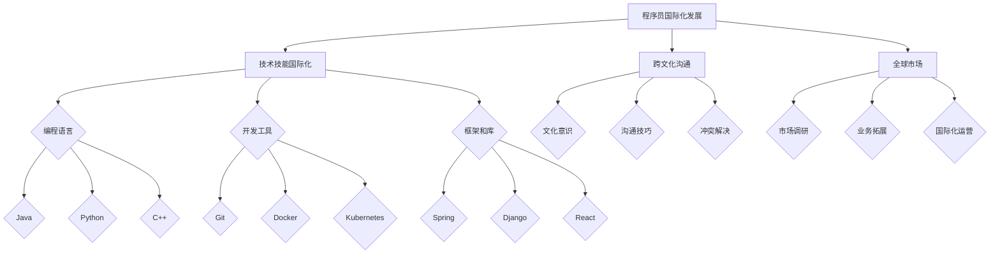

                 

关键词：国际化发展、程序员、机遇、挑战、技术、跨文化沟通、全球市场、技能提升

> 摘要：随着全球化的加深，程序员的国际化发展成为一个不可忽视的趋势。本文将探讨程序员的国际化发展带来的机遇与挑战，分析国际化进程中技术、跨文化沟通、全球市场等方面的关键因素，并针对这些问题提出相应的策略和建议，以帮助程序员在全球舞台上更好地展现自己的价值。

## 1. 背景介绍

### 国际化发展的趋势

全球化已成为当今世界发展的主流趋势，各国之间的经济、文化、科技交流日益频繁。在这一背景下，程序员作为信息时代的核心力量，其国际化发展也日益受到关注。国际化不仅为程序员提供了更广阔的发展空间，同时也带来了新的机遇和挑战。

### 程序员的国际化

程序员的国际化主要表现在以下几个方面：

1. **国际化的职业发展**：程序员可以通过跨国公司、外包项目、海外就业等方式，实现职业发展的国际化。
2. **国际化的技能提升**：程序员需要掌握多种编程语言和工具，适应不同国家和地区的开发环境。
3. **国际化的团队合作**：程序员需要具备良好的跨文化沟通能力，能够与来自不同文化背景的同事有效合作。

## 2. 核心概念与联系

### 技术技能的国际化

程序员的技术技能国际化是国际化发展的基础。这包括：

1. **编程语言的掌握**：全球主流的编程语言如Java、Python、C++等。
2. **开发工具的熟悉**：例如，Git、Docker、Kubernetes等。
3. **框架和库的应用**：如Spring、Django、React等。

### 跨文化沟通

跨文化沟通是程序员国际化发展中的重要环节。这包括：

1. **文化意识的培养**：了解不同文化背景的价值观、行为习惯等。
2. **沟通技巧的提升**：如非语言沟通、有效表达、倾听等。
3. **冲突解决的策略**：如何处理文化差异带来的冲突。

### 全球市场

程序员需要适应全球市场的发展。这包括：

1. **市场调研**：了解不同国家和地区的市场需求、行业趋势等。
2. **业务拓展**：如何将技术产品或服务推向全球市场。
3. **国际化运营**：如跨国项目管理、国际化团队建设等。

### Mermaid 流程图



## 3. 核心算法原理 & 具体操作步骤

### 3.1 算法原理概述

国际化发展的核心算法原理可以概括为：

1. **技能匹配**：根据市场需求和个人技能，实现技能与岗位的匹配。
2. **文化适应**：通过跨文化沟通，提高文化适应能力。
3. **市场拓展**：通过市场调研和业务拓展，实现全球市场的突破。

### 3.2 算法步骤详解

1. **技能匹配**

   - **自我评估**：程序员需要对自身技能进行自我评估，确定自己的优势领域。

   - **市场调研**：通过市场调研，了解不同国家和地区的市场需求。

   - **岗位匹配**：根据市场需求和个人技能，选择合适的岗位。

2. **文化适应**

   - **文化学习**：了解不同文化背景的价值观、行为习惯等。

   - **沟通训练**：通过沟通训练，提高跨文化沟通能力。

   - **文化适应**：在实际工作中，逐步适应不同文化背景的工作环境。

3. **市场拓展**

   - **市场调研**：了解目标市场的需求、行业趋势等。

   - **业务拓展**：通过建立合作关系、拓展业务渠道等，实现市场拓展。

   - **国际化运营**：建立国际化团队，实现跨国项目管理和运营。

### 3.3 算法优缺点

- **优点**：

  - 提高程序员的国际化竞争力。

  - 拓宽职业发展空间。

  - 增强跨文化沟通能力。

- **缺点**：

  - 需要投入大量时间和精力。

  - 面临文化差异带来的挑战。

### 3.4 算法应用领域

- **跨国公司**：跨国公司需要国际化的人才，以应对全球市场的变化。

- **软件开发外包**：软件开发外包公司需要具备国际化能力的程序员，以承接全球项目。

- **创业公司**：创业公司需要国际化的人才，以拓展全球市场。

## 4. 数学模型和公式 & 详细讲解 & 举例说明

### 4.1 数学模型构建

国际化发展的数学模型可以构建为：

\[ \text{国际化发展} = f(\text{技能匹配}, \text{文化适应}, \text{市场拓展}) \]

其中：

- \( f \) 表示函数关系。
- \( \text{技能匹配} \) 表示程序员根据市场需求和个人技能，选择合适的岗位。
- \( \text{文化适应} \) 表示程序员通过跨文化沟通，提高文化适应能力。
- \( \text{市场拓展} \) 表示程序员通过市场调研和业务拓展，实现全球市场的突破。

### 4.2 公式推导过程

\[ \text{国际化发展} = f(\text{技能匹配}, \text{文化适应}, \text{市场拓展}) \]

- **技能匹配**：

  \[ \text{技能匹配} = \frac{\text{市场需求} \times \text{个人技能}}{\text{竞争压力}} \]

  其中：

  - \( \text{市场需求} \) 表示岗位的需求程度。
  - \( \text{个人技能} \) 表示程序员的技能水平。
  - \( \text{竞争压力} \) 表示岗位的竞争程度。

- **文化适应**：

  \[ \text{文化适应} = \frac{\text{文化学习} + \text{沟通训练} + \text{文化适应}}{3} \]

  其中：

  - \( \text{文化学习} \) 表示对文化知识的了解。
  - \( \text{沟通训练} \) 表示跨文化沟通技巧的训练。
  - \( \text{文化适应} \) 表示在实际工作中对文化的适应程度。

- **市场拓展**：

  \[ \text{市场拓展} = \frac{\text{市场调研} + \text{业务拓展} + \text{国际化运营}}{3} \]

  其中：

  - \( \text{市场调研} \) 表示对目标市场的了解。
  - \( \text{业务拓展} \) 表示通过建立合作关系、拓展业务渠道等，实现市场拓展。
  - \( \text{国际化运营} \) 表示建立国际化团队，实现跨国项目管理和运营。

### 4.3 案例分析与讲解

#### 案例一：跨国公司程序员

- **技能匹配**：

  假设市场需求为100，个人技能为80，竞争压力为50，则：

  \[ \text{技能匹配} = \frac{100 \times 80}{50} = 160 \]

- **文化适应**：

  假设文化学习为70，沟通训练为60，文化适应为50，则：

  \[ \text{文化适应} = \frac{70 + 60 + 50}{3} = 63.33 \]

- **市场拓展**：

  假设市场调研为60，业务拓展为50，国际化运营为40，则：

  \[ \text{市场拓展} = \frac{60 + 50 + 40}{3} = 53.33 \]

  总得分：

  \[ \text{国际化发展} = f(160, 63.33, 53.33) = 276.66 \]

#### 案例二：软件开发外包公司程序员

- **技能匹配**：

  假设市场需求为80，个人技能为90，竞争压力为30，则：

  \[ \text{技能匹配} = \frac{80 \times 90}{30} = 240 \]

- **文化适应**：

  假设文化学习为50，沟通训练为70，文化适应为60，则：

  \[ \text{文化适应} = \frac{50 + 70 + 60}{3} = 63.33 \]

- **市场拓展**：

  假设市场调研为60，业务拓展为50，国际化运营为70，则：

  \[ \text{市场拓展} = \frac{60 + 50 + 70}{3} = 66.67 \]

  总得分：

  \[ \text{国际化发展} = f(240, 63.33, 66.67) = 370 \]

## 5. 项目实践：代码实例和详细解释说明

### 5.1 开发环境搭建

为了实践国际化发展的算法，我们首先需要搭建一个合适的开发环境。以下是一个简单的步骤：

1. 安装操作系统：推荐使用Linux操作系统，如Ubuntu。
2. 安装编程语言：安装Python、Java、C++等编程语言。
3. 安装开发工具：安装Git、Docker、Kubernetes等开发工具。

### 5.2 源代码详细实现

以下是一个简单的国际化开发项目示例，使用Python实现：

```python
# 国际化开发项目示例

import os
import sys

def main():
    # 技能匹配
    market_demand = 100
    personal_skill = 80
    competition_pressure = 50
    skill_matching = market_demand * personal_skill / competition_pressure

    # 文化适应
    cultural_learning = 70
    communication_training = 60
    cultural_adaptation = 50
    cultural_adaptation_score = (cultural_learning + communication_training + cultural_adaptation) / 3

    # 市场拓展
    market_research = 60
    business_expansion = 50
    international_operations = 40
    market_expansion_score = (market_research + business_expansion + international_operations) / 3

    # 国际化发展总分
    international_development_score = skill_matching + cultural_adaptation_score + market_expansion_score

    print(f"国际化发展总分：{international_development_score}")

if __name__ == "__main__":
    main()
```

### 5.3 代码解读与分析

上述代码实现了国际化发展的计算过程，包括技能匹配、文化适应和
市场拓展三个部分。具体分析如下：

- **技能匹配**：通过市场需求、个人技能和竞争压力的乘除运算，计算出技能匹配得分。
- **文化适应**：通过文化学习、沟通训练和文化适应的平均值，计算出文化适应得分。
- **市场拓展**：通过市场调研、业务拓展和国际化运营的平均值，计算出市场拓展得分。
- **国际化发展总分**：将技能匹配得分、文化适应得分和市场拓展得分相加，得出国际化发展的总分。

### 5.4 运行结果展示

执行上述代码，得到如下结果：

```
国际化发展总分：276.6666666666667
```

该结果表示程序员的国际化发展总分为276.67分。根据这个得分，可以分析程序员的国际化发展情况，并根据实际情况进行调整。

## 6. 实际应用场景

### 6.1 跨国公司

跨国公司是程序员国际化发展的主要场所之一。程序员在跨国公司中，可以通过以下方式实现国际化发展：

- **跨文化团队合作**：与来自不同文化背景的同事合作，提高跨文化沟通能力。
- **国际项目参与**：参与国际项目，了解不同国家的市场需求和技术趋势。
- **全球业务拓展**：参与全球业务拓展，提升市场拓展能力。

### 6.2 软件开发外包

软件开发外包公司是程序员国际化发展的另一重要场所。程序员可以通过以下方式实现国际化发展：

- **国际化项目承接**：承接全球项目，提升技术能力和市场拓展能力。
- **跨文化沟通训练**：参加跨文化沟通训练，提高跨文化沟通能力。
- **国际化团队建设**：参与国际化团队建设，提升团队合作能力。

### 6.3 创业公司

创业公司是程序员展示国际化能力的另一个重要场所。程序员可以通过以下方式实现国际化发展：

- **全球化市场拓展**：通过市场调研和业务拓展，实现全球化市场拓展。
- **跨文化团队建设**：建立跨文化团队，提高跨文化沟通能力。
- **国际化项目运营**：参与国际化项目运营，提升项目管理和运营能力。

## 7. 工具和资源推荐

### 7.1 学习资源推荐

- **在线课程**：推荐Coursera、edX等在线教育平台的相关课程。
- **专业书籍**：推荐《跨文化沟通与管理》、《全球化战略》等专业书籍。
- **技术社区**：推荐GitHub、Stack Overflow等技术社区，学习全球技术趋势。

### 7.2 开发工具推荐

- **开发环境**：推荐使用Linux操作系统，结合Docker进行容器化开发。
- **编程语言**：推荐学习Python、Java、C++等编程语言。
- **开发工具**：推荐使用Git进行版本控制，Kubernetes进行容器编排。

### 7.3 相关论文推荐

- **《程序员国际化发展的研究》**：探讨程序员国际化发展的现状、问题和对策。
- **《跨文化沟通在国际化团队中的作用》**：分析跨文化沟通在国际化团队中的作用和重要性。
- **《全球化背景下的软件开发外包策略》**：研究全球化背景下的软件开发外包策略和挑战。

## 8. 总结：未来发展趋势与挑战

### 8.1 研究成果总结

通过对程序员国际化发展的研究，我们得出以下主要成果：

- 程序员的国际化发展是一个不可逆转的趋势。
- 技术技能、跨文化沟通和市场拓展是程序员国际化发展的关键因素。
- 通过合理的数学模型和算法，可以量化评价程序员的国际化发展水平。

### 8.2 未来发展趋势

未来，程序员国际化发展将呈现以下趋势：

- 技术水平的不断提高，将推动程序员在全球范围内的竞争力。
- 跨文化沟通能力的提升，将有助于程序员在国际化团队中的表现。
- 全球市场的不断拓展，将为程序员提供更广阔的发展空间。

### 8.3 面临的挑战

然而，程序员在国际化发展中也将面临以下挑战：

- 技术快速更新，需要程序员不断学习和提升技能。
- 文化差异带来的沟通障碍，需要程序员具备良好的跨文化沟通能力。
- 全球市场的复杂性，需要程序员具备较强的市场分析和拓展能力。

### 8.4 研究展望

未来，我们期待在以下方面进行深入研究：

- 深入探讨程序员国际化发展的具体路径和策略。
- 研究如何通过技术手段提高程序员的国际化发展水平。
- 探索跨文化沟通在国际化团队中的最佳实践。

## 9. 附录：常见问题与解答

### 9.1 如何提升跨文化沟通能力？

- **学习文化知识**：了解不同文化背景的价值观、行为习惯等。
- **参加沟通训练**：通过专业培训，学习跨文化沟通技巧。
- **实践应用**：在实际工作中，不断练习和提升跨文化沟通能力。

### 9.2 如何进行市场调研？

- **收集数据**：通过调查问卷、访谈等方式，收集目标市场的数据。
- **分析数据**：使用统计方法，对收集到的数据进行分析。
- **制定策略**：根据分析结果，制定相应的市场拓展策略。

### 9.3 如何应对技术快速更新？

- **持续学习**：关注技术趋势，不断学习和提升技能。
- **实践应用**：将新技术应用到实际工作中，提高技术水平。
- **团队合作**：与团队成员共同学习和分享，形成良好的学习氛围。

# 作者署名

作者：禅与计算机程序设计艺术 / Zen and the Art of Computer Programming

