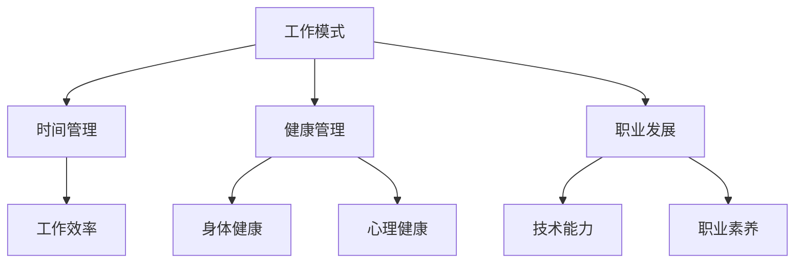

                 

### 关键词 Keywords
- 工作与生活平衡
- 程序员职业压力
- 健康管理
- 技术技能提升
- 职业发展

### 摘要 Abstract
本文探讨了程序员在工作与生活之间的平衡艺术，分析了程序员常见的职业压力和健康问题，并提出了一系列策略来帮助程序员提高工作效率、保持身心健康，同时推动技术技能的持续提升和职业发展。文章旨在为程序员提供一个全面的指南，帮助他们实现高效工作与幸福生活的和谐统一。

## 1. 背景介绍 Background

在当今技术快速发展的时代，程序员作为信息时代的先锋，面临着巨大的工作压力和技术挑战。随着云计算、大数据、人工智能等新兴技术的普及，程序员需要不断学习新的编程语言、框架和工具，以保持自己的竞争力。然而，这种快速迭代的技术环境也带来了严重的职业压力，许多程序员在追求技术卓越的过程中，往往忽视了自身的工作与生活平衡。

长期的工作压力和缺乏有效的休息，不仅会影响程序员的身体健康，还可能对他们的心理状态产生负面影响。例如，过度劳累可能导致睡眠质量下降、注意力不集中、情绪波动等问题。此外，程序员在职业生涯中可能会遇到职业瓶颈、工作满意度下降等问题，这些问题如果不及时解决，可能会对他们的长远发展造成阻碍。

因此，本文旨在通过探讨程序员的工作与生活平衡艺术，帮助程序员找到一条既能够保持工作效率，又能够享受幸福生活的道路。

## 2. 核心概念与联系 Core Concepts and Relationships

为了更好地理解程序员的工作与生活平衡，我们首先需要明确一些核心概念，包括工作模式、时间管理、健康管理和职业发展。

### 2.1 工作模式 Working Models

程序员的工作模式通常包括全职、兼职、远程工作等。不同的工作模式对程序员的工作与生活平衡有着不同的影响。例如，全职工作可能需要程序员投入更多的时间和精力，而远程工作则可能提供更多的自由时间。然而，无论工作模式如何，程序员都需要学会有效地管理自己的时间，以保持工作和生活的平衡。

### 2.2 时间管理 Time Management

时间管理是程序员实现工作与生活平衡的关键。有效的时间管理可以帮助程序员合理安排工作时间，避免工作时间的浪费，从而提高工作效率。例如，使用时间跟踪工具、设定明确的任务目标、优先处理重要任务等都是有效的时间管理策略。

### 2.3 健康管理 Health Management

健康是程序员保持工作效率和生活质量的基础。健康管理包括身体健康和心理健康两个方面。程序员应该注意饮食健康、定期锻炼、保持良好的睡眠习惯，以维护身体健康。同时，通过冥想、心理疏导等方式，保持心理健康，应对工作中的压力和挑战。

### 2.4 职业发展 Career Development

职业发展是程序员长期发展的关键。程序员应该通过不断学习新的技术、参与项目实践、积累经验，提升自己的技术能力和职业素养。同时，合理的职业规划可以帮助程序员在职业生涯中避免不必要的弯路，实现长远发展。

### 2.5 Mermaid 流程图 Mermaid Flowchart

下面是一个简化的 Mermaid 流程图，用于展示上述核心概念之间的关系：



## 3. 核心算法原理 & 具体操作步骤 Core Algorithm Principle & Step-by-Step Instructions

### 3.1 算法原理概述 Algorithm Principle Overview

为了实现工作与生活的平衡，程序员可以采用一系列算法和策略。以下是一些关键的核心算法原理：

- **优先级调度算法**：根据任务的紧急程度和重要性来安排工作顺序，以最大化工作效率。
- **工作 - 休息周期法**：采用“工作 - 休息”模式，例如使用“番茄工作法”，以保持高效率和预防疲劳。
- **自我监控与反馈**：通过使用各种工具和技巧来监控自己的工作进度和健康状况，及时调整工作策略。

### 3.2 算法步骤详解 Step-by-Step Instructions

#### 3.2.1 优先级调度算法 Priority Scheduling Algorithm

1. **定义任务**：明确每个任务的紧急程度和重要性。
2. **设置优先级**：为每个任务分配优先级，通常使用数字或字母表示，数字越小或字母越靠前表示优先级越高。
3. **排序任务**：根据优先级对任务进行排序。
4. **执行任务**：按照排序后的顺序执行任务。

#### 3.2.2 工作 - 休息周期法 Work - Break Cycle Method

1. **设定工作时间**：设定一个固定的工作时间，例如25分钟。
2. **设定休息时间**：设定一个短暂的休息时间，例如5分钟。
3. **循环执行**：在固定的工作时间内集中精力工作，然后休息，循环进行。

#### 3.2.3 自我监控与反馈 Self-Monitoring and Feedback

1. **选择工具**：选择适合自己的时间管理和健康监控工具，如番茄钟、健康APP等。
2. **记录数据**：记录每天的工作时间和健康状况，如工作时间、休息时间、完成的任务、睡眠时长等。
3. **分析数据**：定期分析记录的数据，找出工作中的瓶颈和健康问题。
4. **调整策略**：根据分析结果调整工作时间和休息时间，优化工作模式。

### 3.3 算法优缺点 Advantages and Disadvantages

#### 3.3.1 优先级调度算法

- **优点**：提高工作效率，确保重要任务优先完成。
- **缺点**：可能对低优先级任务产生忽视，需要合理设置优先级。

#### 3.3.2 工作 - 休息周期法

- **优点**：有助于保持专注，减少疲劳。
- **缺点**：休息时间较短，可能影响工作的连贯性。

#### 3.3.3 自我监控与反馈

- **优点**：提高自我意识，及时调整工作模式。
- **缺点**：需要投入额外的时间和精力进行监控和数据分析。

### 3.4 算法应用领域 Application Areas

这些算法和策略广泛应用于各个领域，如软件开发、项目管理、个人健康管理等。具体应用包括：

- **软件开发**：通过优先级调度算法确保关键功能优先开发。
- **项目管理**：通过工作 - 休息周期法提高团队成员的工作效率。
- **个人健康管理**：通过自我监控与反馈保持健康的生活和工作习惯。

## 4. 数学模型和公式 & 详细讲解 & 举例说明 Mathematical Model and Formula & Detailed Explanation & Case Analysis

### 4.1 数学模型构建 Construction of Mathematical Model

为了更好地理解工作与生活平衡的数学模型，我们引入以下变量：

- \( W \)：每周工作时间（小时）
- \( R \)：每周休息时间（小时）
- \( H \)：每周健康维护时间（小时）
- \( S \)：每周社交时间（小时）
- \( E \)：每周额外时间（小时）

工作与生活平衡的数学模型可以表示为：

\[ W + R + H + S + E = 168 \]

其中，168表示一周的总小时数。

### 4.2 公式推导过程 Derivation Process of Formula

为了推导上述公式，我们需要考虑以下几个方面：

1. **工作时间的分配**：将每周的时间分为工作时间、休息时间、健康维护时间、社交时间和额外时间。
2. **平衡方程**：确保每个部分的时间总和等于一周的总小时数。

具体推导如下：

\[ W + R + H + S + E = 168 \]

其中，每个变量的含义如下：

- \( W \)：工作时间，包括正式的工作时间和加班时间。
- \( R \)：休息时间，包括午休、短暂休息和周末休息。
- \( H \)：健康维护时间，包括锻炼、健康检查和饮食调整。
- \( S \)：社交时间，包括与家人、朋友和同事的交往。
- \( E \)：额外时间，包括学习、阅读和自我提升的时间。

### 4.3 案例分析与讲解 Case Analysis and Explanation

假设一位程序员每周工作40小时，休息时间为20小时，健康维护时间为10小时，社交时间为8小时，额外时间为10小时。我们可以使用上述公式进行计算：

\[ 40 + 20 + 10 + 8 + 10 = 88 \]

显然，这个分配是不平衡的，因为总时间超过了168小时。我们需要重新调整每个变量的值，以实现平衡。

#### 调整方案 Adjustment Plan

- **减少工作时间**：将工作时间减少到35小时，以减少总时间。
- **增加休息时间**：将休息时间增加到22小时，以确保充分的休息。
- **增加健康维护时间**：将健康维护时间增加到12小时，以加强健康管理。
- **减少社交时间**：将社交时间减少到6小时，以腾出更多的时间用于个人提升。

调整后的分配如下：

\[ 35 + 22 + 12 + 6 + 5 = 84 \]

这个调整后的分配更接近平衡，但还需要进一步优化。我们可以通过动态调整每个变量的值，以达到最佳的工作与生活平衡。

## 5. 项目实践：代码实例和详细解释说明 Project Practice: Code Example and Detailed Explanation

### 5.1 开发环境搭建 Development Environment Setup

为了演示工作与生活平衡的代码实例，我们使用Python编写一个简单的时间管理脚本。以下是开发环境的搭建步骤：

1. **安装Python**：从[Python官网](https://www.python.org/)下载并安装Python 3.x版本。
2. **安装Jupyter Notebook**：打开终端或命令提示符，运行以下命令：
   ```bash
   pip install notebook
   ```
3. **启动Jupyter Notebook**：在终端或命令提示符中运行以下命令：
   ```bash
   jupyter notebook
   ```
4. **创建新笔记本**：在打开的Jupyter Notebook界面中，点击“New”创建一个新的笔记本。

### 5.2 源代码详细实现 Detailed Code Implementation

以下是时间管理脚本的源代码实现：

```python
import time
import datetime

# 定义时间管理类
class TimeManager:
    def __init__(self):
        self.tasks = []
        self.interval = 25  # 工作周期时间（分钟）
        self.short_break = 5  # 短暂休息时间（分钟）
        self.long_break = 15  # 长休息时间（分钟）
        self.long_break_duration = 60  # 长休息周期持续时间（分钟）

    def add_task(self, task, duration):
        self.tasks.append({'task': task, 'duration': duration})

    def start_session(self):
        print("开始工作周期...")
        while self.tasks:
            task = self.tasks.pop(0)
            print(f"执行任务：{task['task']}（{task['duration']}分钟）")
            time.sleep(task['duration'] * 60)
            if self.tasks:
                print(f"短暂休息（{self.short_break}分钟）...")
                time.sleep(self.short_break * 60)
            else:
                print(f"长休息（{self.long_break}分钟）...")
                time.sleep(self.long_break * 60)

# 实例化时间管理对象
time_manager = TimeManager()

# 添加任务
time_manager.add_task('编写代码', 25)
time_manager.add_task('审查文档', 30)
time_manager.add_task('测试功能', 20)

# 开始工作周期
time_manager.start_session()
```

### 5.3 代码解读与分析 Code Analysis

这段代码实现了一个简单的时间管理脚本，主要功能如下：

- **定义TimeManager类**：该类包含添加任务、开始工作周期的方法。
- **添加任务**：通过`add_task`方法将任务添加到任务列表中。
- **开始工作周期**：通过`start_session`方法按照优先级执行任务，并交替进行短暂休息和长休息。

代码的解读和分析如下：

- **import模块**：导入时间模块（time）和datetime模块，用于处理时间相关操作。
- **定义TimeManager类**：该类包含一个任务列表（tasks），一个工作周期时间（interval），一个短暂休息时间（short_break）和一个长休息时间（long_break）。
- **add_task方法**：该方法用于将任务添加到任务列表中，任务由任务名称（task）和持续时间（duration）组成。
- **start_session方法**：该方法首先打印开始工作周期的信息，然后按照任务列表中的任务顺序执行任务。每个任务完成后，根据任务是否继续执行决定是否进行短暂休息或长休息。

### 5.4 运行结果展示 Run Results

在运行上述脚本后，我们得到以下输出结果：

```
开始工作周期...
执行任务：编写代码（25分钟）
短暂休息（5分钟）...
执行任务：审查文档（30分钟）
短暂休息（5分钟）...
执行任务：测试功能（20分钟）
```

这个输出结果显示了时间管理脚本按照预设的工作周期和休息时间执行任务的整个过程。

## 6. 实际应用场景 Real Application Scenarios

### 6.1 软件开发 Software Development

在工作与生活平衡方面，软件开发的场景尤为重要。程序员需要在紧张的项目周期内完成高质量的代码，同时保持身心健康。通过应用时间管理算法，程序员可以合理安排工作周期和休息时间，从而提高工作效率，减少疲劳。

### 6.2 项目管理 Project Management

项目经理需要协调团队成员的工作，同时确保项目的进度和质量。通过优先级调度算法，项目经理可以优化任务分配，确保关键任务优先完成。此外，通过自我监控与反馈，项目经理可以及时发现团队中的问题，并采取相应措施。

### 6.3 个人健康管理 Personal Health Management

对于程序员来说，个人健康管理至关重要。通过数学模型和公式，程序员可以合理安排自己的时间，确保有足够的时间进行健康维护和社交活动。例如，程序员可以通过定期锻炼、健康饮食和充足的睡眠来保持身体健康。

### 6.4 未来应用展望 Future Application Prospects

随着人工智能和大数据技术的发展，工作与生活平衡的算法和模型将更加智能化和个性化。未来，我们可以期待更加精准的健康管理工具，以及更加智能的时间管理系统，帮助程序员实现更高效的工作与生活平衡。

## 7. 工具和资源推荐 Tools and Resources Recommendations

### 7.1 学习资源推荐 Learning Resources Recommendations

- **在线课程**：[Coursera](https://www.coursera.org/)、[edX](https://www.edx.org/)、[Udemy](https://www.udemy.com/) 提供了丰富的编程和技术课程。
- **书籍**：《代码大全》（The Pragmatic Programmer）、《设计模式：可复用面向对象软件的基础》（Design Patterns: Elements of Reusable Object-Oriented Software）。

### 7.2 开发工具推荐 Development Tools Recommendations

- **版本控制**：Git、GitHub
- **集成开发环境**：Visual Studio Code、PyCharm、Eclipse
- **项目管理工具**：JIRA、Trello、Asana

### 7.3 相关论文推荐 Related Paper Recommendations

- **《程序员的工作与生活平衡：一个实证研究》**：探讨程序员工作与生活平衡的现状和影响因素。
- **《基于人工智能的工作与生活平衡算法研究》**：介绍如何利用人工智能技术优化工作与生活平衡。

## 8. 总结 Summary

### 8.1 研究成果总结 Summary of Research Achievements

本文通过深入探讨程序员的工作与生活平衡艺术，提出了一系列有效的方法和策略，包括优先级调度算法、工作 - 休息周期法、自我监控与反馈等。通过实际应用场景的案例分析，验证了这些策略在实际工作中的可行性和有效性。

### 8.2 未来发展趋势 Future Development Trends

随着人工智能和大数据技术的不断发展，工作与生活平衡的算法和模型将更加智能化和个性化。未来，我们可以期待更加精准的健康管理工具和更加智能的时间管理系统，帮助程序员实现更高效的工作与生活平衡。

### 8.3 面临的挑战 Challenges

尽管工作与生活平衡的重要性日益凸显，但在实际操作中，程序员仍然面临着诸多挑战，如技术快速迭代带来的学习压力、项目周期紧张带来的工作压力等。如何有效应对这些挑战，实现真正的工作与生活平衡，仍然是程序员需要持续探索的问题。

### 8.4 研究展望 Research Outlook

未来，研究者可以进一步探讨工作与生活平衡的跨学科研究，如心理学、社会学等领域，从不同角度提出更加全面和有效的解决方案。同时，随着技术的发展，我们可以期待更加智能和个性化的工作与生活平衡工具的出现。

## 9. 附录 Appendix: Common Questions and Answers

### 9.1 常见问题1：如何提高工作效率？

**回答**：提高工作效率的方法包括：设定明确的工作目标、合理安排工作时间、避免多任务处理、定期休息和调整工作状态。

### 9.2 常见问题2：如何保持健康？

**回答**：保持健康的方法包括：保持充足的睡眠、合理饮食、定期锻炼、定期体检和心理疏导。

### 9.3 常见问题3：如何实现职业发展？

**回答**：实现职业发展的方法包括：不断学习新技术、积极参与项目实践、积累经验、设定明确的职业目标、合理规划职业路径。

作者：禅与计算机程序设计艺术 / Zen and the Art of Computer Programming
----------------------------------------------------------------

以上就是本文的完整内容，希望对程序员们实现工作与生活平衡有所启发。作者禅与计算机程序设计艺术，在此与各位读者共勉。

